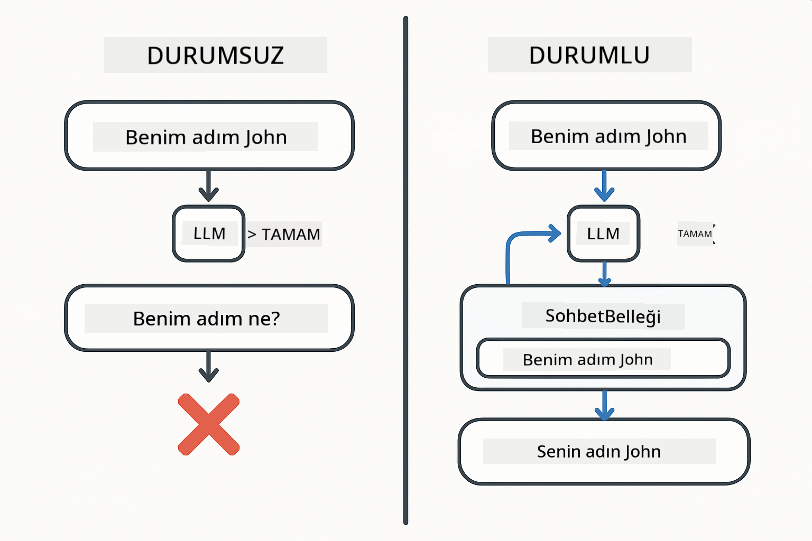
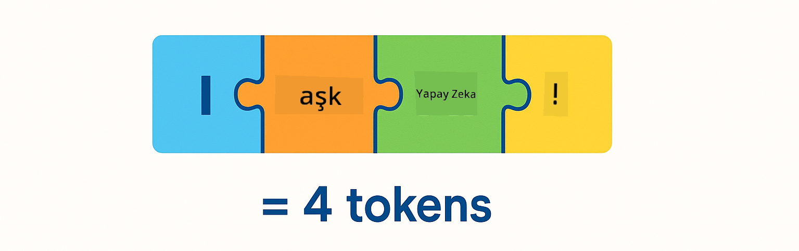
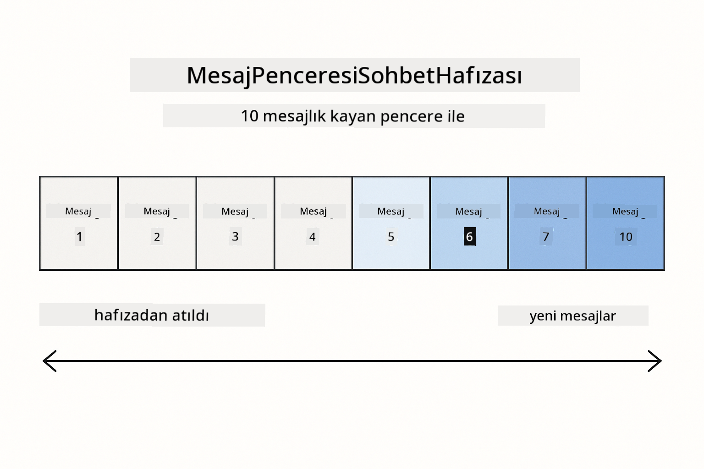

<!--
CO_OP_TRANSLATOR_METADATA:
{
  "original_hash": "c3e07ca58d0b8a3f47d3bf5728541e0a",
  "translation_date": "2025-12-13T13:35:15+00:00",
  "source_file": "01-introduction/README.md",
  "language_code": "tr"
}
-->
# Modül 01: LangChain4j ile Başlarken

## İçindekiler

- [Neler Öğreneceksiniz](../../../01-introduction)
- [Ön Koşullar](../../../01-introduction)
- [Temel Problemi Anlamak](../../../01-introduction)
- [Tokenları Anlamak](../../../01-introduction)
- [Bellek Nasıl Çalışır](../../../01-introduction)
- [Bunun LangChain4j Kullanımı](../../../01-introduction)
- [Azure OpenAI Altyapısını Dağıtmak](../../../01-introduction)
- [Uygulamayı Yerel Olarak Çalıştırmak](../../../01-introduction)
- [Uygulamayı Kullanmak](../../../01-introduction)
  - [Durumsuz Sohbet (Sol Panel)](../../../01-introduction)
  - [Durumlu Sohbet (Sağ Panel)](../../../01-introduction)
- [Sonraki Adımlar](../../../01-introduction)

## Neler Öğreneceksiniz

Hızlı başlangıcı tamamladıysanız, nasıl istem gönderip yanıt alacağınızı gördünüz. Bu temel, ancak gerçek uygulamalar daha fazlasını gerektirir. Bu modül, bağlamı hatırlayan ve durumu koruyan konuşma yapay zekası oluşturmayı öğretir - tek seferlik bir demo ile üretime hazır bir uygulama arasındaki fark budur.

Bu rehber boyunca Azure OpenAI'nin GPT-5 modelini kullanacağız çünkü gelişmiş akıl yürütme yetenekleri farklı desenlerin davranışını daha belirgin hale getirir. Bellek eklediğinizde farkı net bir şekilde göreceksiniz. Bu, her bileşenin uygulamanıza ne kattığını anlamayı kolaylaştırır.

Her iki deseni de gösteren bir uygulama oluşturacaksınız:

**Durumsuz Sohbet** - Her istek bağımsızdır. Model önceki mesajları hatırlamaz. Bu, hızlı başlangıçta kullandığınız desendir.

**Durumlu Konuşma** - Her istek konuşma geçmişini içerir. Model birden fazla tur boyunca bağlamı korur. Üretim uygulamalarının ihtiyacı budur.

## Ön Koşullar

- Azure aboneliği ve Azure OpenAI erişimi
- Java 21, Maven 3.9+
- Azure CLI (https://learn.microsoft.com/en-us/cli/azure/install-azure-cli)
- Azure Developer CLI (azd) (https://learn.microsoft.com/en-us/azure/developer/azure-developer-cli/install-azd)

> **Not:** Java, Maven, Azure CLI ve Azure Developer CLI (azd) sağlanan devcontainer içinde önceden yüklüdür.

> **Not:** Bu modül Azure OpenAI üzerinde GPT-5 kullanır. Dağıtım `azd up` ile otomatik yapılandırılır - kodda model adını değiştirmeyin.

## Temel Problemi Anlamak

Dil modelleri durumsuzdur. Her API çağrısı bağımsızdır. "Adım John" yazıp sonra "Adım ne?" diye sorarsanız, model kendinizi tanıttığınızı bilmez. Her isteği sanki ilk konuşmanızmış gibi ele alır.

Bu basit SSS için uygundur ama gerçek uygulamalar için işe yaramaz. Müşteri hizmetleri botları söylediklerinizi hatırlamalıdır. Kişisel asistanlar bağlama ihtiyaç duyar. Çok turlu herhangi bir konuşma belleğe ihtiyaç duyar.



*Durumsuz (bağımsız çağrılar) ve durumlu (bağlam farkında) konuşmalar arasındaki fark*

## Tokenları Anlamak

Konuşmalara dalmadan önce tokenları anlamak önemlidir - dil modellerinin işlediği temel metin birimleri:



*Metnin tokenlara nasıl bölündüğüne örnek - "I love AI!" 4 ayrı işleme birimine dönüşür*

Tokenlar, yapay zeka modellerinin metni ölçme ve işleme şeklidir. Kelimeler, noktalama işaretleri ve hatta boşluklar token olabilir. Modelinizin aynı anda işleyebileceği token sayısı sınırlıdır (GPT-5 için 400.000, 272.000 giriş ve 128.000 çıkış tokenı). Tokenları anlamak, konuşma uzunluğunu ve maliyetleri yönetmenize yardımcı olur.

## Bellek Nasıl Çalışır

Sohbet belleği, durumsuz problemi konuşma geçmişini koruyarak çözer. İsteğinizi modele göndermeden önce, çerçeve ilgili önceki mesajları başa ekler. "Adım ne?" diye sorduğunuzda, sistem aslında tüm konuşma geçmişini gönderir, böylece model daha önce "Adım John" dediğinizi görür.

LangChain4j, bunu otomatik yöneten bellek uygulamaları sağlar. Kaç mesaj saklayacağınızı seçersiniz ve çerçeve bağlam penceresini yönetir.



*MessageWindowChatMemory, son mesajların kayan penceresini tutar, eski mesajları otomatik olarak düşürür*

## Bunun LangChain4j Kullanımı

Bu modül, hızlı başlangıcı Spring Boot ile entegre ederek ve konuşma belleği ekleyerek genişletir. Parçalar şöyle bir araya gelir:

**Bağımlılıklar** - İki LangChain4j kütüphanesi ekleyin:

```xml
<dependency>
    <groupId>dev.langchain4j</groupId>
    <artifactId>langchain4j</artifactId> <!-- Inherited from BOM in root pom.xml -->
</dependency>
<dependency>
    <groupId>dev.langchain4j</groupId>
    <artifactId>langchain4j-open-ai-official</artifactId> <!-- Inherited from BOM in root pom.xml -->
</dependency>
```

**Sohbet Modeli** - Azure OpenAI'yi Spring bean olarak yapılandırın ([LangChainConfig.java](../../../01-introduction/src/main/java/com/example/langchain4j/config/LangChainConfig.java)):

```java
@Bean
public OpenAiOfficialChatModel openAiOfficialChatModel() {
    return OpenAiOfficialChatModel.builder()
            .baseUrl(azureEndpoint)
            .apiKey(azureApiKey)
            .modelName(deploymentName)
            .timeout(Duration.ofMinutes(5))
            .maxRetries(3)
            .build();
}
```

Builder, `azd up` tarafından ayarlanan ortam değişkenlerinden kimlik bilgilerini okur. `baseUrl`'yi Azure uç noktanıza ayarlamak, OpenAI istemcisinin Azure OpenAI ile çalışmasını sağlar.

**Konuşma Belleği** - MessageWindowChatMemory ile sohbet geçmişini takip edin ([ConversationService.java](../../../01-introduction/src/main/java/com/example/langchain4j/service/ConversationService.java)):

```java
ChatMemory memory = MessageWindowChatMemory.withMaxMessages(10);

memory.add(UserMessage.from("My name is John"));
memory.add(AiMessage.from("Nice to meet you, John!"));

memory.add(UserMessage.from("What's my name?"));
AiMessage aiMessage = chatModel.chat(memory.messages()).aiMessage();
memory.add(aiMessage);
```

`withMaxMessages(10)` ile son 10 mesajı tutacak şekilde bellek oluşturun. Kullanıcı ve yapay zeka mesajlarını `UserMessage.from(text)` ve `AiMessage.from(text)` ile tipli sarmalayıcılar olarak ekleyin. Geçmişi `memory.messages()` ile alın ve modele gönderin. Servis, her konuşma kimliği için ayrı bellek örnekleri tutar, böylece birden fazla kullanıcı aynı anda sohbet edebilir.

> **🤖 [GitHub Copilot](https://github.com/features/copilot) Chat ile deneyin:** [`ConversationService.java`](../../../01-introduction/src/main/java/com/example/langchain4j/service/ConversationService.java) dosyasını açın ve sorun:
> - "MessageWindowChatMemory pencere dolduğunda hangi mesajları atmaya karar veriyor?"
> - "Belleği bellek içi yerine veritabanı kullanarak nasıl özelleştirebilirim?"
> - "Eski konuşma geçmişini sıkıştırmak için özetleme nasıl eklenir?"

Durumsuz sohbet uç noktası belleği tamamen atlar - sadece hızlı başlangıçtaki gibi `chatModel.chat(prompt)` kullanılır. Durumlu uç nokta mesajları belleğe ekler, geçmişi alır ve her isteğe bağlam olarak dahil eder. Aynı model yapılandırması, farklı desenler.

## Azure OpenAI Altyapısını Dağıtmak

**Bash:**
```bash
cd 01-introduction
azd up  # Aboneliği ve konumu seçin (eastus2 önerilir)
```

**PowerShell:**
```powershell
cd 01-introduction
azd up  # Aboneliği ve konumu seçin (eastus2 önerilir)
```

> **Not:** Eğer zaman aşımı hatası alırsanız (`RequestConflict: Cannot modify resource ... provisioning state is not terminal`), `azd up` komutunu tekrar çalıştırın. Azure kaynakları arka planda hala hazırlanıyor olabilir, yeniden denemek dağıtımın kaynaklar terminal duruma geldiğinde tamamlanmasını sağlar.

Bu işlemler:
1. GPT-5 ve text-embedding-3-small modelleri ile Azure OpenAI kaynağı dağıtır
2. Proje kökünde kimlik bilgileri içeren `.env` dosyasını otomatik oluşturur
3. Gerekli tüm ortam değişkenlerini ayarlar

**Dağıtım sorunları mı yaşıyorsunuz?** Alt alan adı çakışmaları, manuel Azure Portal dağıtımı adımları ve model yapılandırma rehberi için [Altyapı README](infra/README.md) dosyasına bakın.

**Dağıtımın başarılı olduğunu doğrulayın:**

**Bash:**
```bash
cat ../.env  # AZURE_OPENAI_ENDPOINT, API_KEY vb. gösterilmelidir.
```

**PowerShell:**
```powershell
Get-Content ..\.env  # AZURE_OPENAI_ENDPOINT, API_KEY vb. gösterilmelidir.
```

> **Not:** `azd up` komutu `.env` dosyasını otomatik oluşturur. Daha sonra güncellemeniz gerekirse, ya `.env` dosyasını manuel düzenleyin ya da şu komutla yeniden oluşturun:
>
> **Bash:**
> ```bash
> cd ..
> bash .azd-env.sh
> ```
>
> **PowerShell:**
> ```powershell
> cd ..
> .\.azd-env.ps1
> ```

## Uygulamayı Yerel Olarak Çalıştırmak

**Dağıtımı doğrulayın:**

Azure kimlik bilgileri içeren `.env` dosyasının kök dizinde olduğundan emin olun:

**Bash:**
```bash
cat ../.env  # AZURE_OPENAI_ENDPOINT, API_KEY, DEPLOYMENT göstermeli
```

**PowerShell:**
```powershell
Get-Content ..\.env  # AZURE_OPENAI_ENDPOINT, API_KEY, DEPLOYMENT göstermeli
```

**Uygulamaları başlatın:**

**Seçenek 1: Spring Boot Dashboard kullanarak (VS Code kullanıcıları için önerilir)**

Dev container, tüm Spring Boot uygulamalarını yönetmek için görsel arayüz sağlayan Spring Boot Dashboard uzantısını içerir. VS Code'un sol tarafındaki Aktivite Çubuğunda (Spring Boot simgesine bakın) bulabilirsiniz.

Spring Boot Dashboard'dan:
- Çalışma alanındaki tüm Spring Boot uygulamalarını görebilirsiniz
- Uygulamaları tek tıkla başlatabilir/durdurabilirsiniz
- Uygulama günlüklerini gerçek zamanlı izleyebilirsiniz
- Uygulama durumunu takip edebilirsiniz

Bu modülü başlatmak için "introduction" yanındaki oynat düğmesine tıklayın veya tüm modülleri aynı anda başlatın.


**Seçenek 2: Shell betikleri kullanarak**

Tüm web uygulamalarını başlatın (modüller 01-04):

**Bash:**
```bash
cd ..  # Kök dizinden
./start-all.sh
```

**PowerShell:**
```powershell
cd ..  # Kök dizinden
.\start-all.ps1
```

Ya da sadece bu modülü başlatın:

**Bash:**
```bash
cd 01-introduction
./start.sh
```

**PowerShell:**
```powershell
cd 01-introduction
.\start.ps1
```

Her iki betik de ortam değişkenlerini kök `.env` dosyasından otomatik yükler ve JAR dosyaları yoksa oluşturur.

> **Not:** Başlatmadan önce tüm modülleri manuel derlemek isterseniz:
>
> **Bash:**
> ```bash
> cd ..  # Go to root directory
> mvn clean package -DskipTests
> ```
>
> **PowerShell:**
> ```powershell
> cd ..  # Go to root directory
> mvn clean package -DskipTests
> ```

Tarayıcınızda http://localhost:8080 adresini açın.

**Durdurmak için:**

**Bash:**
```bash
./stop.sh  # Sadece bu modül
# Veya
cd .. && ./stop-all.sh  # Tüm modüller
```

**PowerShell:**
```powershell
.\stop.ps1  # Sadece bu modül
# Veya
cd ..; .\stop-all.ps1  # Tüm modüller
```

## Uygulamayı Kullanmak

Uygulama, yan yana iki sohbet uygulaması içeren bir web arayüzü sağlar.


*Basit Sohbet (durumsuz) ve Konuşma Sohbeti (durumlu) seçeneklerini gösteren kontrol paneli*

### Durumsuz Sohbet (Sol Panel)

Önce bunu deneyin. "Adım John" deyin, hemen ardından "Adım ne?" diye sorun. Model hatırlamayacaktır çünkü her mesaj bağımsızdır. Bu, temel dil modeli entegrasyonundaki temel problemi gösterir - konuşma bağlamı yoktur.


*Yapay zeka önceki mesajdaki adınızı hatırlamaz*

### Durumlu Sohbet (Sağ Panel)

Şimdi aynı diziyi burada deneyin. "Adım John" deyin, sonra "Adım ne?" Bu sefer hatırlar. Fark MessageWindowChatMemory'dir - konuşma geçmişini tutar ve her isteğe dahil eder. Üretim konuşma yapay zekası böyle çalışır.


*Yapay zeka konuşmanın önceki kısmındaki adınızı hatırlar*

Her iki panel de aynı GPT-5 modelini kullanır. Tek fark bellek. Bu, belleğin uygulamanıza ne kattığını ve gerçek kullanım durumları için neden gerekli olduğunu netleştirir.

## Sonraki Adımlar

**Sonraki Modül:** [02-prompt-engineering - GPT-5 ile Prompt Mühendisliği](../02-prompt-engineering/README.md)

---

**Gezinme:** [← Önceki: Modül 00 - Hızlı Başlangıç](../00-quick-start/README.md) | [Ana Sayfaya Dön](../README.md) | [Sonraki: Modül 02 - Prompt Mühendisliği →](../02-prompt-engineering/README.md)

---

<!-- CO-OP TRANSLATOR DISCLAIMER START -->
**Feragatname**:  
Bu belge, AI çeviri servisi [Co-op Translator](https://github.com/Azure/co-op-translator) kullanılarak çevrilmiştir. Doğruluk için çaba gösterilse de, otomatik çevirilerin hatalar veya yanlışlıklar içerebileceğini lütfen unutmayın. Orijinal belge, kendi dilinde yetkili kaynak olarak kabul edilmelidir. Kritik bilgiler için profesyonel insan çevirisi önerilir. Bu çevirinin kullanımı sonucu oluşabilecek yanlış anlamalar veya yorum hatalarından sorumlu değiliz.
<!-- CO-OP TRANSLATOR DISCLAIMER END -->