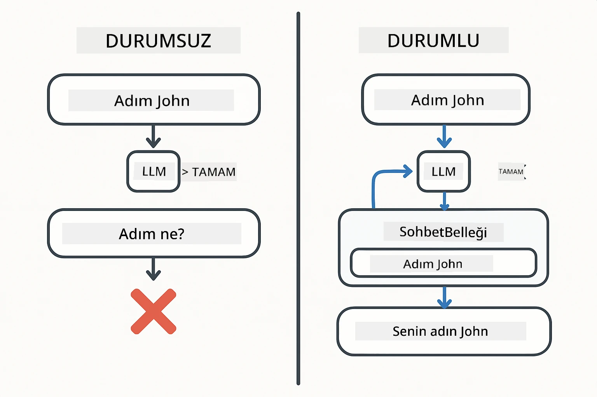
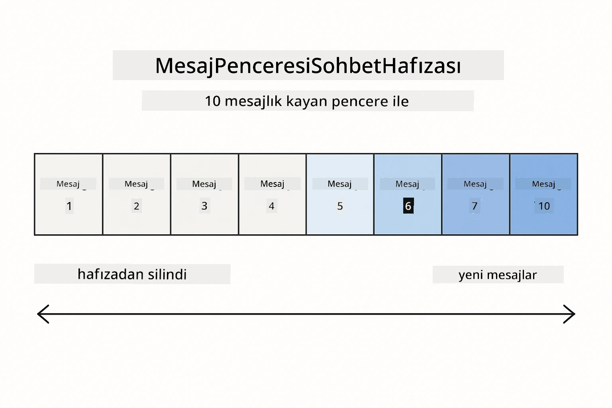
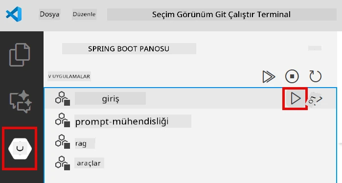
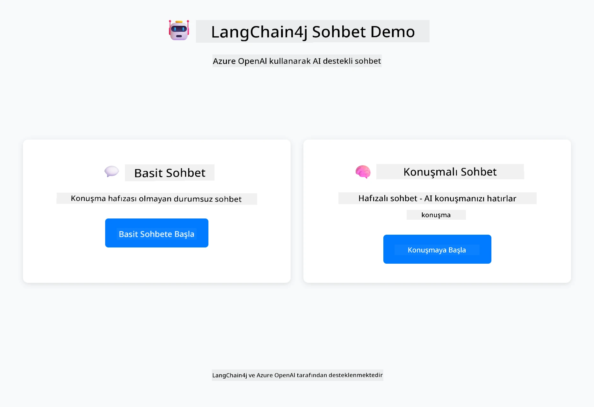
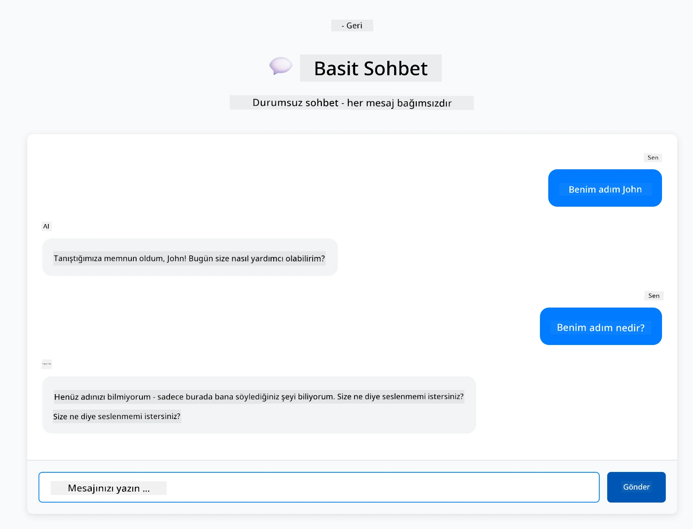
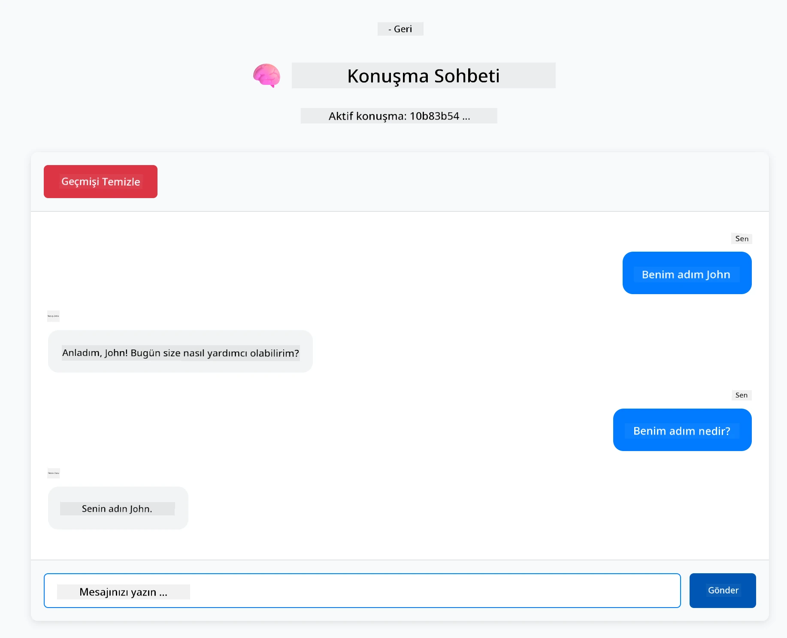

# Modül 01: LangChain4j ile Başlangıç

## İçindekiler

- [Video Yürütme](#video-yürütme)
- [Öğrenecekleriniz](#öğrenecekleriniz)
- [Gereksinimler](#gereksinimler)
- [Temel Problemi Anlamak](#temel-problemi-anlamak)
- [Tokenları Anlamak](#tokenları-anlamak)
- [Belleğin Nasıl Çalıştığı](#belleğin-nasıl-çalıştığı)
- [LangChain4j Nasıl Kullanılır](#langchain4j-nasıl-kullanılır)
- [Azure OpenAI Altyapısını Dağıtmak](#azure-openai-altyapısını-dağıtmak)
- [Uygulamayı Yerel Olarak Çalıştırmak](#uygulamayı-yerel-olarak-çalıştırmak)
- [Uygulamayı Kullanmak](#uygulamayı-kullanmak)
  - [Durumsuz Sohbet (Sol Panel)](#durumsuz-sohbet-sol-panel)
  - [Durumlu Sohbet (Sağ Panel)](#durumlu-sohbet-sağ-panel)
- [Sonraki Adımlar](#sonraki-adımlar)

## Video Yürütme

Bu modülle nasıl başlayacağınızı anlatan canlı oturumu izleyin:

<a href="https://www.youtube.com/live/nl_troDm8rQ?si=6b85S8xGjWnT2fX9"></a>

## Öğrenecekleriniz

LangChain4j ve Azure OpenAI ile başlangıç noktanız burasıdır. Temellerle başlıyoruz ve üretim tarzı uygulamalar geliştirmeye başlayacağız. Bu modül, bağlamı hatırlayan ve durumu koruyan konuşma yapay zekasına odaklanır — tüm sonraki modüllerin üzerine inşa edildiği temel kavramlar.

Bu rehber boyunca Azure OpenAI'nin GPT-5.2 modelini kullanacağız çünkü gelişmiş çıkarım yetenekleri farklı desenlerin davranışlarını daha açık hale getiriyor. Bellek eklediğinizde farkı net bir şekilde göreceksiniz. Bu, her bileşenin uygulamanıza neler kattığını anlamayı kolaylaştırır.

Her iki deseni de gösteren tek bir uygulama geliştireceksiniz:

**Durumsuz Sohbet** - Her istek bağımsızdır. Model önceki mesajları hatırlamaz. Bu en basit başlangıç noktasıdır.

**Durumlu Konuşma** - Her istek konuşma geçmişini içerir. Model birden fazla tur boyunca bağlamı korur. Üretim uygulamalarının ihtiyacı budur.

## Gereksinimler

- Azure OpenAI erişimi olan Azure aboneliği
- Java 21, Maven 3.9+
- Azure CLI (https://learn.microsoft.com/en-us/cli/azure/install-azure-cli)
- Azure Developer CLI (azd) (https://learn.microsoft.com/en-us/azure/developer/azure-developer-cli/install-azd)

> **Not:** Java, Maven, Azure CLI ve Azure Developer CLI (azd), sağlanan geliştirme konteynerinde önceden yüklüdür.

> **Not:** Bu modül Azure OpenAI üzerinde GPT-5.2 modelini kullanır. Dağıtım `azd up` ile otomatik yapılandırılır - kodda model adını değiştirmeyin.

## Temel Problemi Anlamak

Dil modelleri durumsuzdur. Her API çağrısı bağımsızdır. "Benim adım John" yazdıktan sonra "Adım ne?" diye sorarsanız, model kendinizi yeni tanıttığınızın farkında değildir. Her isteği, yaptığınız ilk konuşma gibi ele alır.

Bu basit soru-cevap için uygundur ancak gerçek uygulamalar için işe yaramaz. Müşteri hizmetleri botlarının söylediklerinizi hatırlaması gerekir. Kişisel asistanlar bağlama ihtiyaç duyar. Her çok turlu konuşma belleğe ihtiyaç duyar.

Aşağıdaki diyagram bu iki yaklaşımı karşılaştırır — solda isminizi unutan durumsuz çağrı; sağda isminizi hatırlayan ChatMemory destekli durumlu çağrı.



*Durumsuz (bağımsız çağrılar) ile durumlu (bağlam farkında) konuşmalar arasındaki fark*

## Tokenları Anlamak

Konuşmaya girmeden önce, dil modellerinin işlediği temel birimler olan tokenları anlamak önemlidir:


*Metnin tokenlere nasıl bölündüğüne örnek - "I love AI!" dört ayrı işlem birimine dönüşür*

Tokenlar, yapay zeka modellerinin metni ölçme ve işleme yoludur. Kelimeler, noktalama işaretleri ve hatta boşluklar token olabilir. Modelinizin aynı anda işleyebileceği token sayısının bir limiti vardır (GPT-5.2 için 400.000, girişte 272.000 ve çıkışta 128.000 tokena kadar). Tokenları anlamak, konuşma uzunluğunu ve maliyetleri yönetmenize yardımcı olur.

## Belleğin Nasıl Çalıştığı

Chat belleği, durumsuz problemi çözerek konuşma geçmişini korur. İsteğinizi modele göndermeden önce çerçeve, ilgili önceki mesajları başa ekler. "Adım ne?" diye sorduğunuzda, sistem tüm konuşma geçmişini gönderir, böylece model önceden "Benim adım John" dediğinizi görebilir.

LangChain4j, bunu otomatik olarak yöneten bellek uygulamaları sağlar. Kaç mesajı saklayacağınızı seçersiniz ve çerçeve bağlam penceresini yönetir. Aşağıdaki diyagram, MessageWindowChatMemory’nin nasıl kaydırmalı bir pencereyle yakın tarihli mesajları tuttuğunu gösterir.



*MessageWindowChatMemory, kaydırmalı pencere ile yakın tarihli mesajları tutar, eski mesajları otomatik olarak düşürür*

## LangChain4j Nasıl Kullanılır

Bu modül Spring Boot’u entegre eder ve konuşma belleği ekler. Parçalar şöyle işler:

**Bağımlılıklar** - İki LangChain4j kütüphanesi ekleyin:

```xml
<dependency>
    <groupId>dev.langchain4j</groupId>
    <artifactId>langchain4j</artifactId> <!-- Inherited from BOM in root pom.xml -->
</dependency>
<dependency>
    <groupId>dev.langchain4j</groupId>
    <artifactId>langchain4j-open-ai-official</artifactId> <!-- Inherited from BOM in root pom.xml -->
</dependency>
```

**Sohbet Modeli** - Azure OpenAI’yi Spring bean olarak yapılandırın ([LangChainConfig.java](../../../01-introduction/src/main/java/com/example/langchain4j/config/LangChainConfig.java)):

```java
@Bean
public OpenAiOfficialChatModel openAiOfficialChatModel() {
    return OpenAiOfficialChatModel.builder()
            .baseUrl(azureEndpoint)
            .apiKey(azureApiKey)
            .modelName(deploymentName)
            .timeout(Duration.ofMinutes(5))
            .maxRetries(3)
            .build();
}
```

Builder, `azd up` ile ayarlanmış ortam değişkenlerinden kimlik bilgilerini okur. `baseUrl` adresini Azure uç noktanıza ayarlamak, OpenAI istemcisinin Azure OpenAI ile çalışmasını sağlar.

**Konuşma Belleği** - MessageWindowChatMemory ile sohbet geçmişini takip edin ([ConversationService.java](../../../01-introduction/src/main/java/com/example/langchain4j/service/ConversationService.java)):

```java
ChatMemory memory = MessageWindowChatMemory.withMaxMessages(10);

memory.add(UserMessage.from("My name is John"));
memory.add(AiMessage.from("Nice to meet you, John!"));

memory.add(UserMessage.from("What's my name?"));
AiMessage aiMessage = chatModel.chat(memory.messages()).aiMessage();
memory.add(aiMessage);
```

`withMaxMessages(10)` ile son 10 mesajı tutan belleği oluşturun. Kullanıcı ve yapay zeka mesajlarını `UserMessage.from(text)` ve `AiMessage.from(text)` tipleriyle ekleyin. Geçmişi `memory.messages()` ile alın ve modele gönderin. Servis, her konuşma kimliği için ayrı bellek örnekleri tutar, böylece birden çok kullanıcı aynı anda sohbet edebilir.

> **🤖 GitHub Copilot Chat ile deneyin:** [`ConversationService.java`](../../../01-introduction/src/main/java/com/example/langchain4j/service/ConversationService.java) dosyasını açıp sorun:
> - "Pencere dolduğunda MessageWindowChatMemory hangi mesajları bırakmaya karar veriyor?"
> - "In-memory yerine veritabanı kullanarak özel bellek depolaması yapabilir miyim?"
> - "Eski konuşma geçmişini sıkıştırmak için özetleme nasıl eklenir?"

Durumsuz sohbet uç noktası belleği tamamen atlar — sadece `chatModel.chat(prompt)` çağrısı yapılır, hızlı başlangıç gibi. Durumlu uç nokta, mesajları belleğe ekler, geçmişi alır ve bu bağlamı her istekle dahil eder. Aynı model yapılandırması, farklı desenler.

## Azure OpenAI Altyapısını Dağıtmak

**Bash:**
```bash
cd 01-introduction
azd up  # Aboneliği ve konumu seçin (eastus2 önerilir)
```

**PowerShell:**
```powershell
cd 01-introduction
azd up  # Aboneliği ve konumu seçin (eastus2 önerilir)
```

> **Not:** Eğer zaman aşımı hatası (`RequestConflict: Cannot modify resource ... provisioning state is not terminal`) ile karşılaşırsanız, `azd up` komutunu yeniden çalıştırın. Azure kaynakları arka planda hala hazırlanıyor olabilir, tekrar denemek dağıtımın kaynaklar terminal durumuna ulaştığında tamamlanmasını sağlar.

Bu işlem:
1. GPT-5.2 ve text-embedding-3-small modelleriyle Azure OpenAI kaynağı dağıtır
2. Proje kökünde kimlik bilgileri içeren `.env` dosyasını otomatik oluşturur
3. Gerekli tüm ortam değişkenlerini ayarlar

**Dağıtım sorunları mı yaşıyorsunuz?** Alt alan adı çakışmaları, manuel Azure Portal dağıtımı ve model yapılandırma rehberleri için [Altyapı README dosyasına](infra/README.md) bakın.

**Dağıtımın başarılı olduğunu doğrulayın:**

**Bash:**
```bash
cat ../.env  # AZURE_OPENAI_ENDPOINT, API_KEY, vb. göstermelidir.
```

**PowerShell:**
```powershell
Get-Content ..\.env  # AZURE_OPENAI_ENDPOINT, API_KEY vb. gösterilmeli
```

> **Not:** `azd up` komutu `.env` dosyasını otomatik oluşturur. Daha sonra güncellemeniz gerekirse, ya `.env` dosyasını manuel düzenleyebilir ya da aşağıdaki komutla yeniden oluşturabilirsiniz:
>
> **Bash:**
> ```bash
> cd ..
> bash .azd-env.sh
> ```
>
> **PowerShell:**
> ```powershell
> cd ..
> .\.azd-env.ps1
> ```

## Uygulamayı Yerel Olarak Çalıştırmak

**Dağıtımı doğrulayın:**

Azure kimlik bilgileriyle `.env` dosyasının kök dizinde olduğundan emin olun. Bu komutu modül dizininden (`01-introduction/`) çalıştırın:

**Bash:**
```bash
cat ../.env  # AZURE_OPENAI_ENDPOINT, API_KEY, DEPLOYMENT göstermeli
```

**PowerShell:**
```powershell
Get-Content ..\.env  # AZURE_OPENAI_ENDPOINT, API_KEY, DEPLOYMENT göstermeli
```

**Uygulamaları başlatın:**

**Seçenek 1: Spring Boot Dashboard Kullanarak (VS Code kullanıcıları için önerilir)**

Geliştirme konteyneri, tüm Spring Boot uygulamalarını yönetmek için görsel arayüz sağlayan Spring Boot Dashboard uzantısını içerir. VS Code'da sol taraftaki Aktivite Çubuğunda (Spring Boot ikonu) bulunabilir.

Spring Boot Dashboard’dan:
- Çalışma alanındaki tüm Spring Boot uygulamalarını görebilirsiniz
- Uygulamaları tek tıkla başlatabilir/durdurabilirsiniz
- Uygulama günlüklerini gerçek zamanlı izleyebilirsiniz
- Uygulama durumunu takip edebilirsiniz

Bu modülü başlatmak için "introduction" yanındaki oynat düğmesine tıklayın veya tüm modülleri aynı anda çalıştırın.



*VS Code’daki Spring Boot Dashboard — tüm modülleri tek yerden başlat, durdur ve izle*

**Seçenek 2: Shell komut dosyaları kullanarak**

Tüm web uygulamalarını (modüller 01-04) başlatın:

**Bash:**
```bash
cd ..  # Kök dizinden
./start-all.sh
```

**PowerShell:**
```powershell
cd ..  # Kök dizinden
.\start-all.ps1
```

Ya da sadece bu modülü başlatın:

**Bash:**
```bash
cd 01-introduction
./start.sh
```

**PowerShell:**
```powershell
cd 01-introduction
.\start.ps1
```

Her iki betik de kök `.env` dosyasından ortam değişkenlerini otomatik yükler ve JAR dosyaları yoksa oluşturur.

> **Not:** Başlatmadan önce tüm modülleri manuel olarak derlemek isterseniz:
>
> **Bash:**
> ```bash
> cd ..  # Go to root directory
> mvn clean package -DskipTests
> ```
>
> **PowerShell:**
> ```powershell
> cd ..  # Go to root directory
> mvn clean package -DskipTests
> ```

Tarayıcınızda http://localhost:8080 adresini açın.

**Durmak için:**

**Bash:**
```bash
./stop.sh  # Sadece bu modül
# Veya
cd .. && ./stop-all.sh  # Tüm modüller
```

**PowerShell:**
```powershell
.\stop.ps1  # Bu sadece modül
# Veya
cd ..; .\stop-all.ps1  # Tüm modüller
```

## Uygulamayı Kullanmak

Uygulama, yan yana iki sohbet uygulamasını web arayüzünde sunar.



*Hem Basit Sohbet (durumsuz) hem de Konuşma Sohbeti (durumlu) seçeneklerini gösteren kontrol paneli*

### Durumsuz Sohbet (Sol Panel)

Bundan başlayın. "Benim adım John" deyin ve hemen ardından "Adım ne?" diye sorun. Model hatırlamayacaktır, çünkü her mesaj bağımsızdır. Bu, temel dil modeli entegrasyonundaki asıl problemi gösterir - konuşma bağlamı yoktur.



*Yapay zeka önceki mesajdaki adınızı hatırlamaz*

### Durumlu Sohbet (Sağ Panel)

Şimdi aynı sırayı burada deneyin. "Benim adım John" deyin ve ardından "Adım ne?" sorun. Bu sefer hatırlar. Fark MessageWindowChatMemory'dedir - konuşma geçmişini korur ve her isteğe bu bağlamı ekler. Üretim konuşma yapay zekası böyle çalışır.



*Yapay zeka, konuşmanın başındaki adınızı hatırlar*

Her iki panel de aynı GPT-5.2 modelini kullanır. Tek fark bellek kullanımıdır. Bu, belleğin uygulamanıza neler kattığını ve gerçek kullanım senaryoları için neden gerekli olduğunu netleştirir.

## Sonraki Adımlar

**Sonraki Modül:** [02-prompt-mühendisliği - GPT-5.2 ile Prompt Mühendisliği](../02-prompt-engineering/README.md)

---

**Gezinme:** [← Ana Sayfaya Dön](../README.md) | [İleri: Modül 02 - Prompt Mühendisliği →](../02-prompt-engineering/README.md)

---

<!-- CO-OP TRANSLATOR DISCLAIMER START -->
**Feragatname**:
Bu belge, AI çeviri hizmeti [Co-op Translator](https://github.com/Azure/co-op-translator) kullanılarak çevrilmiştir. Doğruluk için çaba sarf etsek de, otomatik çevirilerin hata veya yanlışlık içerebileceğini lütfen unutmayınız. Orijinal belge, kendi dilinde yetkili kaynak olarak kabul edilmelidir. Kritik bilgiler için profesyonel insan çevirisi önerilir. Bu çevirinin kullanımı sonucu ortaya çıkabilecek yanlış anlamalardan veya yanlış yorumlamalardan sorumlu değiliz.
<!-- CO-OP TRANSLATOR DISCLAIMER END -->