# Modül 02: GPT-5 ile İstek Mühendisliği

## İçindekiler

- [Neler Öğreneceksiniz](../../../02-prompt-engineering)
- [Önkoşullar](../../../02-prompt-engineering)
- [İstek Mühendisliğini Anlamak](../../../02-prompt-engineering)
- [Bunun LangChain4j Kullanımı](../../../02-prompt-engineering)
- [Temel Desenler](../../../02-prompt-engineering)
- [Mevcut Azure Kaynaklarını Kullanmak](../../../02-prompt-engineering)
- [Uygulama Ekran Görüntüleri](../../../02-prompt-engineering)
- [Desenleri Keşfetmek](../../../02-prompt-engineering)
  - [Düşük ve Yüksek İsteklilik](../../../02-prompt-engineering)
  - [Görev Yürütme (Araç Ön Yazıları)](../../../02-prompt-engineering)
  - [Kendi Kendini Yansıtan Kod](../../../02-prompt-engineering)
  - [Yapılandırılmış Analiz](../../../02-prompt-engineering)
  - [Çok Turlu Sohbet](../../../02-prompt-engineering)
  - [Adım Adım Akıl Yürütme](../../../02-prompt-engineering)
  - [Kısıtlı Çıktı](../../../02-prompt-engineering)
- [Gerçekten Neler Öğreniyorsunuz](../../../02-prompt-engineering)
- [Sonraki Adımlar](../../../02-prompt-engineering)

## Neler Öğreneceksiniz

Önceki modülde, belleğin konuşma yapay zekasını nasıl mümkün kıldığını gördünüz ve temel etkileşimler için GitHub Modellerini kullandınız. Şimdi ise soruları nasıl sorduğunuza - yani isteklerin kendisine - odaklanacağız; Azure OpenAI'nin GPT-5 modelini kullanarak. İsteklerinizi nasıl yapılandırdığınız, aldığınız yanıtların kalitesini dramatik şekilde etkiler.

GPT-5'i kullanacağız çünkü akıl yürütme kontrolü sunuyor - modele yanıt vermeden önce ne kadar düşünmesi gerektiğini söyleyebilirsiniz. Bu, farklı istek stratejilerini daha belirgin hale getirir ve her yaklaşımın ne zaman kullanılacağını anlamanıza yardımcı olur. Ayrıca Azure'un GPT-5 için GitHub Modellerine kıyasla daha az oran sınırı avantajından faydalanacağız.

## Önkoşullar

- Modül 01 tamamlanmış (Azure OpenAI kaynakları dağıtılmış)
- Kök dizinde Azure kimlik bilgileri içeren `.env` dosyası (Modül 01'de `azd up` ile oluşturulmuş)

> **Not:** Eğer Modül 01'i tamamlamadıysanız, önce oradaki dağıtım talimatlarını izleyin.

## İstek Mühendisliğini Anlamak

İstek mühendisliği, ihtiyacınız olan sonuçları tutarlı şekilde almanızı sağlayan giriş metnini tasarlamaktır. Sadece soru sormak değil - modelin tam olarak ne istediğinizi ve nasıl sunacağını anlaması için istekleri yapılandırmaktır.

Bunu bir meslektaşınıza talimat vermek gibi düşünün. "Hatanı düzelt" belirsizdir. "UserService.java dosyasının 45. satırındaki null pointer hatasını null kontrolü ekleyerek düzelt" ise spesifiktir. Dil modelleri de aynı şekilde çalışır - özgüllük ve yapı önemlidir.

## Bunun LangChain4j Kullanımı

Bu modül, önceki modüllerden aynı LangChain4j temelini kullanarak gelişmiş istek desenlerini gösterir; odak noktası istek yapısı ve akıl yürütme kontrolüdür.

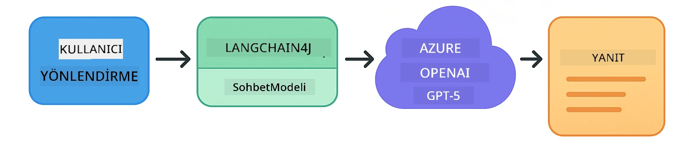

*LangChain4j isteklerinizi Azure OpenAI GPT-5'e nasıl bağlar*

**Bağımlılıklar** - Modül 02, `pom.xml` içinde tanımlı aşağıdaki langchain4j bağımlılıklarını kullanır:  
```xml
<dependency>
    <groupId>dev.langchain4j</groupId>
    <artifactId>langchain4j</artifactId> <!-- Inherited from BOM in root pom.xml -->
</dependency>
<dependency>
    <groupId>dev.langchain4j</groupId>
    <artifactId>langchain4j-open-ai-official</artifactId> <!-- Inherited from BOM in root pom.xml -->
</dependency>
```
  
**OpenAiOfficialChatModel Yapılandırması** - [LangChainConfig.java](../../../02-prompt-engineering/src/main/java/com/example/langchain4j/prompts/config/LangChainConfig.java)

Chat modeli, Azure OpenAI uç noktalarını destekleyen OpenAI Official istemcisi kullanılarak Spring bean olarak manuel yapılandırılır. Modül 01'den farkı, modelin kendisi değil, `chatModel.chat()` metoduna gönderilen isteklerin nasıl yapılandırıldığıdır.

**Sistem ve Kullanıcı Mesajları** - [Gpt5PromptService.java](../../../02-prompt-engineering/src/main/java/com/example/langchain4j/prompts/service/Gpt5PromptService.java)

LangChain4j, mesaj türlerini netlik için ayırır. `SystemMessage` yapay zekanın davranışını ve bağlamını belirler (örneğin "Sen bir kod inceleyicisin"), `UserMessage` ise gerçek isteği içerir. Bu ayrım, farklı kullanıcı sorguları arasında tutarlı yapay zeka davranışı sağlar.

```java
SystemMessage systemMsg = SystemMessage.from(
    "You are a helpful Java programming expert."
);

UserMessage userMsg = UserMessage.from(
    "Explain what a List is in Java"
);

String response = chatModel.chat(systemMsg, userMsg);
```
  
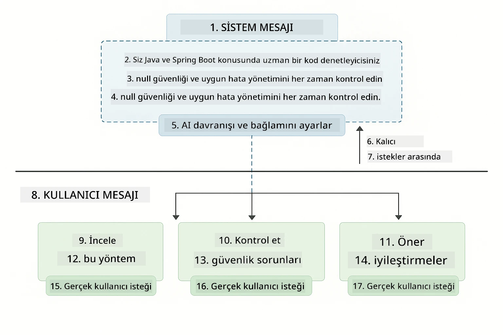

*SystemMessage kalıcı bağlam sağlar, UserMessages ise bireysel istekleri içerir*

**Çok Turlu İçin MessageWindowChatMemory** - Çok turlu sohbet deseni için, Modül 01'den `MessageWindowChatMemory` yeniden kullanılır. Her oturum kendi belleğine sahiptir ve `Map<String, ChatMemory>` içinde saklanır; böylece birden fazla eşzamanlı sohbet bağlam karışmadan yürütülür.

**İstek Şablonları** - Buradaki gerçek odak istek mühendisliğidir, yeni LangChain4j API'leri değil. Her desen (düşük istek, yüksek istek, görev yürütme vb.) aynı `chatModel.chat(prompt)` metodunu kullanır ancak dikkatle yapılandırılmış istek metinleri ile. XML etiketleri, talimatlar ve biçimlendirme istek metninin parçasıdır, LangChain4j özellikleri değildir.

**Akıl Yürütme Kontrolü** - GPT-5'in akıl yürütme çabası, "maksimum 2 akıl yürütme adımı" veya "detaylıca keşfet" gibi istek talimatlarıyla kontrol edilir. Bunlar istek mühendisliği teknikleridir, LangChain4j yapılandırmaları değildir. Kütüphane sadece isteklerinizi modele iletir.

Ana çıkarım: LangChain4j altyapıyı sağlar (model bağlantısı için [LangChainConfig.java](../../../02-prompt-engineering/src/main/java/com/example/langchain4j/prompts/config/LangChainConfig.java), bellek ve mesaj yönetimi için [Gpt5PromptService.java](../../../02-prompt-engineering/src/main/java/com/example/langchain4j/prompts/service/Gpt5PromptService.java)), bu modül ise o altyapı içinde etkili istekler oluşturmayı öğretir.

## Temel Desenler

Tüm problemler aynı yaklaşımı gerektirmez. Bazı sorular hızlı yanıt ister, bazıları derin düşünce. Bazıları görünür akıl yürütme ister, bazıları sadece sonuç. Bu modül sekiz istek desenini kapsar - her biri farklı senaryolara optimize edilmiştir. Hepsini deneyerek hangi yaklaşımın ne zaman işe yaradığını öğreneceksiniz.


*Sekiz istek mühendisliği deseninin genel görünümü ve kullanım alanları*

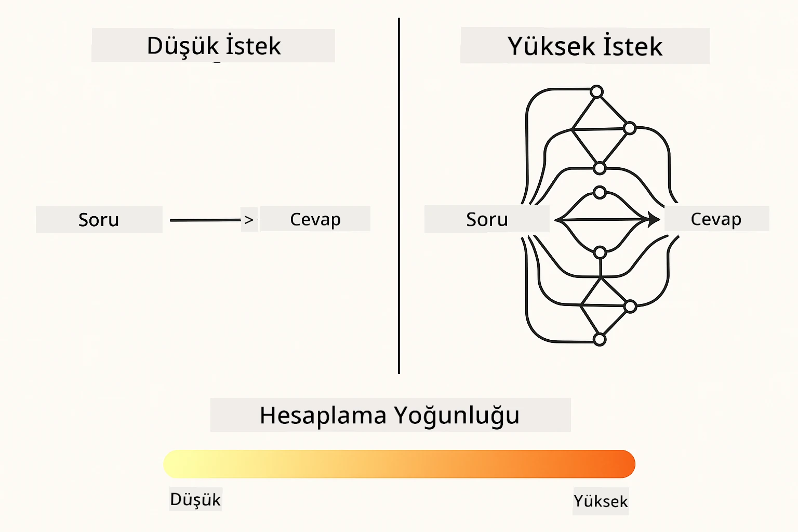

*Düşük isteklilik (hızlı, doğrudan) vs Yüksek isteklilik (detaylı, keşifçi) akıl yürütme yaklaşımları*

**Düşük İsteklilik (Hızlı & Odaklı)** - Hızlı, doğrudan yanıt istediğiniz basit sorular için. Model minimum akıl yürütme yapar - maksimum 2 adım. Hesaplamalar, aramalar veya basit sorular için kullanın.

```java
String prompt = """
    <reasoning_effort>low</reasoning_effort>
    <instruction>maximum 2 reasoning steps</instruction>
    
    What is 15% of 200?
    """;

String response = chatModel.chat(prompt);
```
  
> 💡 **GitHub Copilot ile Keşfedin:** [`Gpt5PromptService.java`](../../../02-prompt-engineering/src/main/java/com/example/langchain4j/prompts/service/Gpt5PromptService.java) dosyasını açın ve sorun:  
> - "Düşük isteklilik ve yüksek isteklilik istek desenleri arasındaki fark nedir?"  
> - "İsteklerdeki XML etiketleri yapay zekanın yanıtını nasıl yapılandırmaya yardımcı olur?"  
> - "Kendi kendini yansıtma desenlerini ne zaman doğrudan talimatla kullanmalıyım?"

**Yüksek İsteklilik (Derin & Detaylı)** - Kapsamlı analiz istediğiniz karmaşık problemler için. Model detaylıca keşfeder ve ayrıntılı akıl yürütme gösterir. Sistem tasarımı, mimari kararlar veya karmaşık araştırmalar için kullanın.

```java
String prompt = """
    <reasoning_effort>high</reasoning_effort>
    <instruction>explore thoroughly, show detailed reasoning</instruction>
    
    Design a caching strategy for a high-traffic REST API.
    """;

String response = chatModel.chat(prompt);
```
  
**Görev Yürütme (Adım Adım İlerleme)** - Çok adımlı iş akışları için. Model önceden bir plan sunar, her adımı anlatır, sonra özet verir. Geçişler, uygulamalar veya çok adımlı süreçler için kullanın.

```java
String prompt = """
    <task>Create a REST endpoint for user registration</task>
    <preamble>Provide an upfront plan</preamble>
    <narration>Narrate each step as you work</narration>
    <summary>Summarize what was accomplished</summary>
    """;

String response = chatModel.chat(prompt);
```
  
Zincirleme Düşünce (Chain-of-Thought) istekleri, modelden akıl yürütme sürecini göstermesini açıkça ister, karmaşık görevlerde doğruluğu artırır. Adım adım ayrım hem insanlar hem yapay zeka için mantığı anlamayı kolaylaştırır.

> **🤖 [GitHub Copilot](https://github.com/features/copilot) Sohbet ile Deneyin:** Bu desen hakkında sorun:  
> - "Uzun süren işlemler için görev yürütme desenini nasıl uyarlardım?"  
> - "Üretim uygulamalarında araç ön yazılarını yapılandırmanın en iyi uygulamaları nelerdir?"  
> - "Ara ilerleme güncellemelerini bir kullanıcı arayüzünde nasıl yakalar ve gösteririm?"

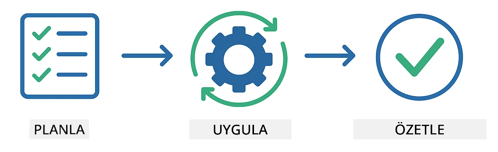

*Planla → Yürüt → Özetle iş akışı çok adımlı görevler için*

**Kendi Kendini Yansıtan Kod** - Üretim kalitesinde kod üretmek için. Model kod üretir, kalite kriterlerine göre kontrol eder ve iteratif olarak iyileştirir. Yeni özellikler veya servisler geliştirirken kullanın.

```java
String prompt = """
    <task>Create an email validation service</task>
    <quality_criteria>
    - Correct logic and error handling
    - Best practices (clean code, proper naming)
    - Performance optimization
    - Security considerations
    </quality_criteria>
    <instruction>Generate code, evaluate against criteria, improve iteratively</instruction>
    """;

String response = chatModel.chat(prompt);
```
  
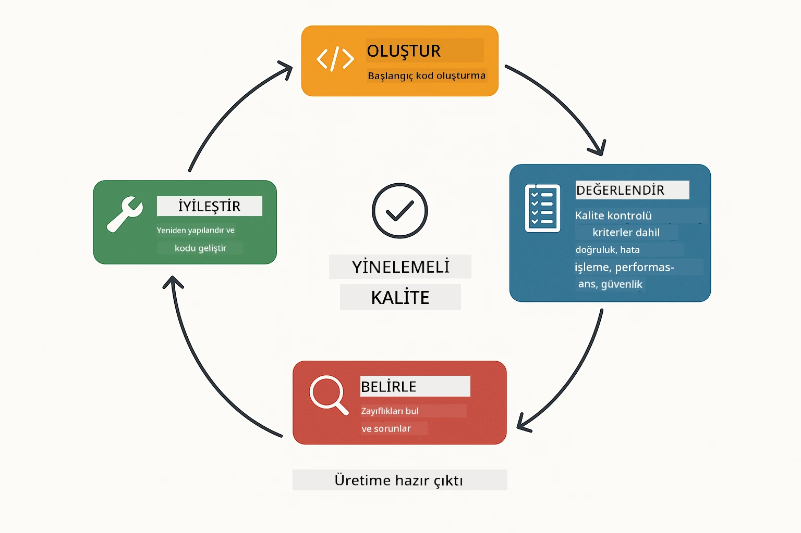

*İteratif iyileştirme döngüsü - üret, değerlendir, sorunları belirle, geliştir, tekrarla*

**Yapılandırılmış Analiz** - Tutarlı değerlendirme için. Model kodu sabit bir çerçeve ile inceler (doğruluk, uygulamalar, performans, güvenlik). Kod incelemeleri veya kalite değerlendirmeleri için kullanın.

```java
String prompt = """
    <code>
    public List getUsers() {
        return database.query("SELECT * FROM users");
    }
    </code>
    
    <framework>
    Evaluate using these categories:
    1. Correctness - Logic and functionality
    2. Best Practices - Code quality
    3. Performance - Efficiency concerns
    4. Security - Vulnerabilities
    </framework>
    """;

String response = chatModel.chat(prompt);
```
  
> **🤖 [GitHub Copilot](https://github.com/features/copilot) Sohbet ile Deneyin:** Yapılandırılmış analiz hakkında sorun:  
> - "Farklı kod inceleme türleri için analiz çerçevesini nasıl özelleştirebilirim?"  
> - "Yapılandırılmış çıktıyı programatik olarak ayrıştırıp işlememenin en iyi yolu nedir?"  
> - "Farklı inceleme oturumlarında tutarlı şiddet seviyelerini nasıl sağlarım?"

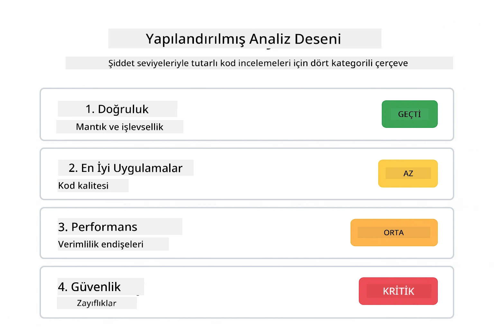

*Tutarlı kod incelemeleri için dört kategorili çerçeve ve şiddet seviyeleri*

**Çok Turlu Sohbet** - Bağlam gerektiren konuşmalar için. Model önceki mesajları hatırlar ve üzerine inşa eder. Etkileşimli yardım oturumları veya karmaşık SSS için kullanın.

```java
ChatMemory memory = MessageWindowChatMemory.withMaxMessages(10);

memory.add(UserMessage.from("What is Spring Boot?"));
AiMessage aiMessage1 = chatModel.chat(memory.messages()).aiMessage();
memory.add(aiMessage1);

memory.add(UserMessage.from("Show me an example"));
AiMessage aiMessage2 = chatModel.chat(memory.messages()).aiMessage();
memory.add(aiMessage2);
```
  
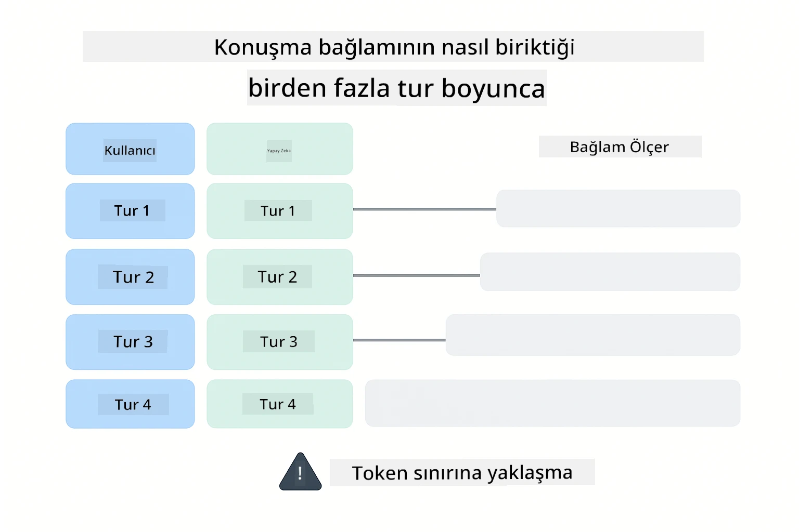

*Konuşma bağlamı, token sınırına ulaşana kadar çok turlu birikim*

**Adım Adım Akıl Yürütme** - Görünür mantık gerektiren problemler için. Model her adım için açık akıl yürütme gösterir. Matematik problemleri, mantık bulmacaları veya düşünce sürecini anlamak istediğinizde kullanın.

```java
String prompt = """
    <instruction>Show your reasoning step-by-step</instruction>
    
    If a train travels 120 km in 2 hours, then stops for 30 minutes,
    then travels another 90 km in 1.5 hours, what is the average speed
    for the entire journey including the stop?
    """;

String response = chatModel.chat(prompt);
```
  
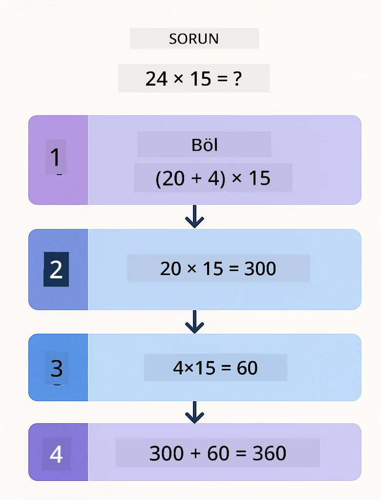

*Problemleri açık mantıksal adımlara bölme*

**Kısıtlı Çıktı** - Belirli format gereksinimleri olan yanıtlar için. Model format ve uzunluk kurallarına sıkı sıkıya uyar. Özetler veya kesin çıktı yapısı gerektiğinde kullanın.

```java
String prompt = """
    <constraints>
    - Exactly 100 words
    - Bullet point format
    - Technical terms only
    </constraints>
    
    Summarize the key concepts of machine learning.
    """;

String response = chatModel.chat(prompt);
```
  
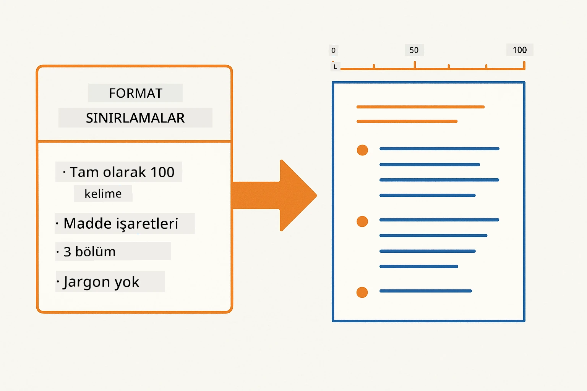

*Belirli format, uzunluk ve yapı gereksinimlerini zorunlu kılma*

## Mevcut Azure Kaynaklarını Kullanmak

**Dağıtımı doğrulayın:**

Kök dizinde Azure kimlik bilgileri içeren `.env` dosyasının var olduğundan emin olun (Modül 01 sırasında oluşturulmuş):  
```bash
cat ../.env  # AZURE_OPENAI_ENDPOINT, API_KEY, DEPLOYMENT göstermeli
```
  
**Uygulamayı başlatın:**

> **Not:** Eğer Modül 01'den `./start-all.sh` ile tüm uygulamaları zaten başlattıysanız, bu modül zaten 8083 portunda çalışıyor. Aşağıdaki başlatma komutlarını atlayabilir ve doğrudan http://localhost:8083 adresine gidebilirsiniz.

**Seçenek 1: Spring Boot Dashboard kullanmak (VS Code kullanıcıları için önerilir)**

Geliştirme konteyneri, tüm Spring Boot uygulamalarını yönetmek için görsel arayüz sağlayan Spring Boot Dashboard uzantısını içerir. VS Code'un solundaki Aktivite Çubuğunda (Spring Boot simgesine bakın) bulabilirsiniz.

Spring Boot Dashboard'dan:  
- Çalışma alanındaki tüm Spring Boot uygulamalarını görebilirsiniz  
- Uygulamaları tek tıkla başlat/durdurabilirsiniz  
- Uygulama günlüklerini gerçek zamanlı izleyebilirsiniz  
- Uygulama durumunu takip edebilirsiniz  

"prompt-engineering" yanındaki oynat düğmesine tıklayarak bu modülü başlatabilir veya tüm modülleri aynı anda başlatabilirsiniz.

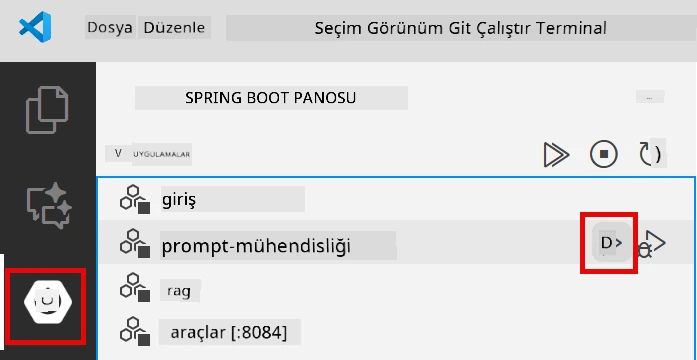

**Seçenek 2: Shell betikleri kullanmak**

Tüm web uygulamalarını (modüller 01-04) başlatın:

**Bash:**  
```bash
cd ..  # Kök dizinden
./start-all.sh
```
  
**PowerShell:**  
```powershell
cd ..  # Kök dizinden
.\start-all.ps1
```
  
Ya da sadece bu modülü başlatın:

**Bash:**  
```bash
cd 02-prompt-engineering
./start.sh
```
  
**PowerShell:**  
```powershell
cd 02-prompt-engineering
.\start.ps1
```
  
Her iki betik de kök `.env` dosyasından ortam değişkenlerini otomatik yükler ve JAR dosyaları yoksa oluşturur.

> **Not:** Başlatmadan önce tüm modülleri manuel derlemeyi tercih ederseniz:  
>  
> **Bash:**  
> ```bash
> cd ..  # Go to root directory
> mvn clean package -DskipTests
> ```
  
> **PowerShell:**  
> ```powershell
> cd ..  # Go to root directory
> mvn clean package -DskipTests
> ```
  
Tarayıcınızda http://localhost:8083 adresini açın.

**Durdurmak için:**

**Bash:**  
```bash
./stop.sh  # Sadece bu modül
# Veya
cd .. && ./stop-all.sh  # Tüm modüller
```
  
**PowerShell:**  
```powershell
.\stop.ps1  # Sadece bu modül
# Veya
cd ..; .\stop-all.ps1  # Tüm modüller
```
  
## Uygulama Ekran Görüntüleri

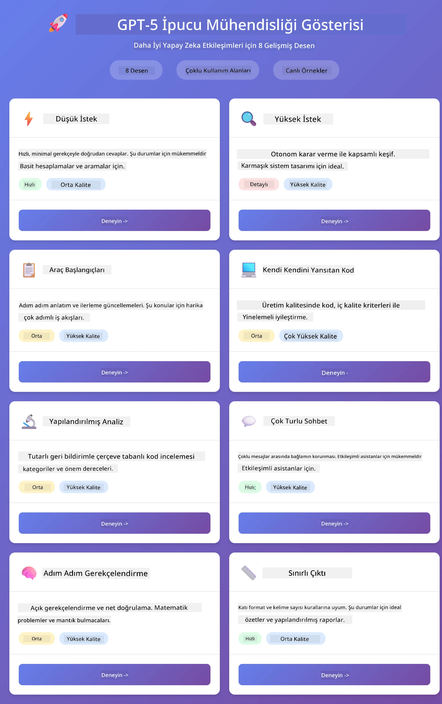

*Tüm 8 istek mühendisliği desenini, özelliklerini ve kullanım alanlarını gösteren ana kontrol paneli*

## Desenleri Keşfetmek

Web arayüzü, farklı istek stratejileriyle denemeler yapmanızı sağlar. Her desen farklı problemleri çözer - hangisinin ne zaman işe yaradığını görmek için deneyin.

### Düşük ve Yüksek İsteklilik

"Düşük İsteklilik" kullanarak "200'ün %15'i nedir?" gibi basit bir soru sorun. Anında, doğrudan yanıt alırsınız. Şimdi "Yüksek trafikli bir API için önbellekleme stratejisi tasarla" gibi karmaşık bir soruyu "Yüksek İsteklilik" ile sorun. Modelin nasıl yavaşlayıp detaylı akıl yürütme sunduğunu izleyin. Aynı model, aynı soru yapısı - ama istek ne kadar düşünmesi gerektiğini söylüyor.

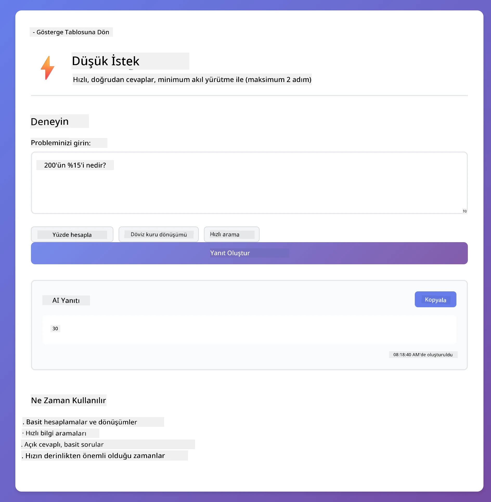
*Minimal akıl yürütme ile hızlı hesaplama*

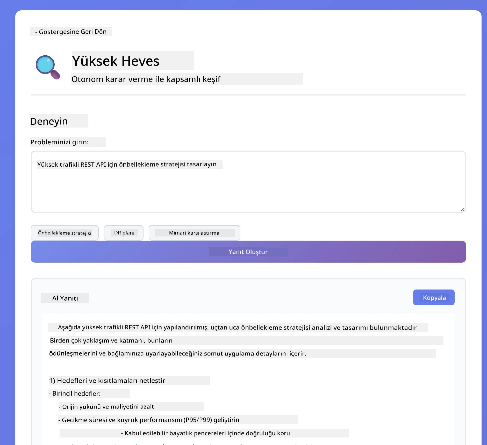

*Kapsamlı önbellekleme stratejisi (2.8MB)*

### Görev Yürütme (Araç Ön Bilgileri)

Çok adımlı iş akışları, önceden planlama ve ilerleme anlatımı ile fayda sağlar. Model ne yapacağını özetler, her adımı anlatır, sonra sonuçları özetler.

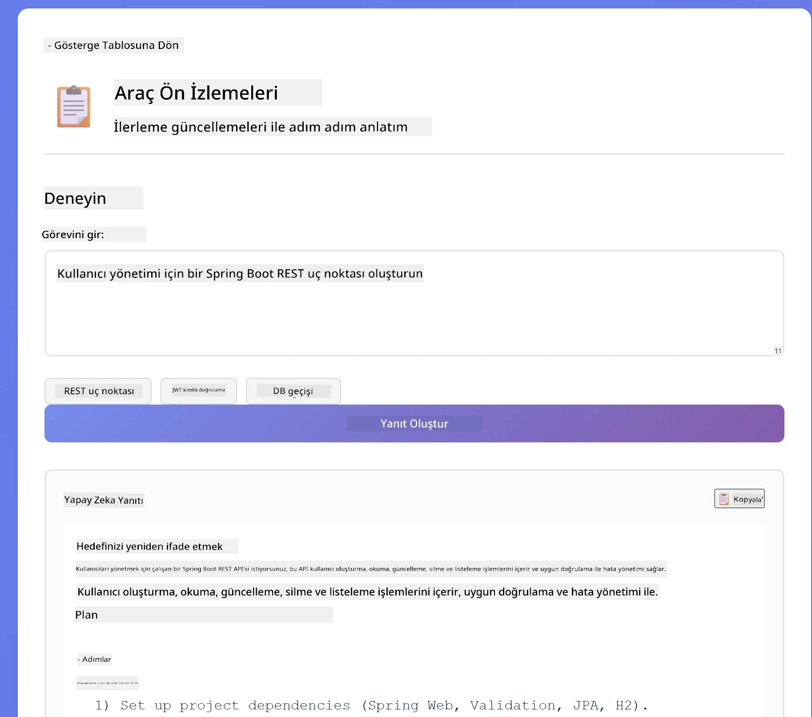

*Adım adım anlatımla REST uç noktası oluşturma (3.9MB)*

### Kendini Değerlendiren Kod

"Bir e-posta doğrulama servisi oluştur" deneyin. Sadece kod üretip durmak yerine, model üretir, kalite kriterlerine göre değerlendirir, zayıf yönleri belirler ve geliştirir. Kod üretim standartlarına ulaşana kadar yinelemeyi göreceksiniz.

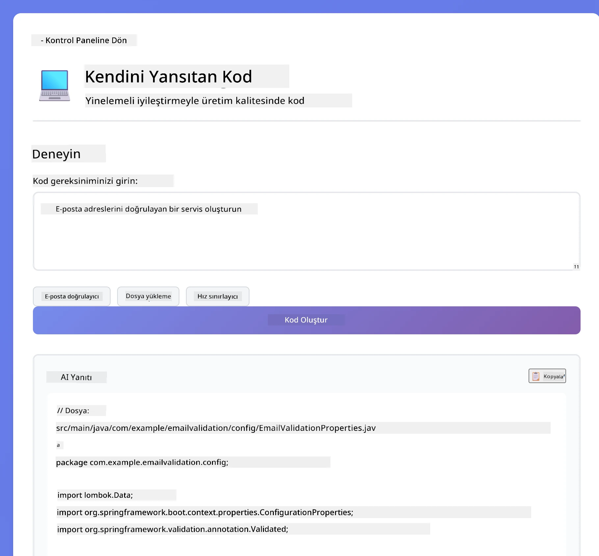

*Tam e-posta doğrulama servisi (5.2MB)*

### Yapılandırılmış Analiz

Kod incelemeleri tutarlı değerlendirme çerçeveleri gerektirir. Model, kodu sabit kategorilerle (doğruluk, uygulamalar, performans, güvenlik) ve şiddet seviyeleriyle analiz eder.

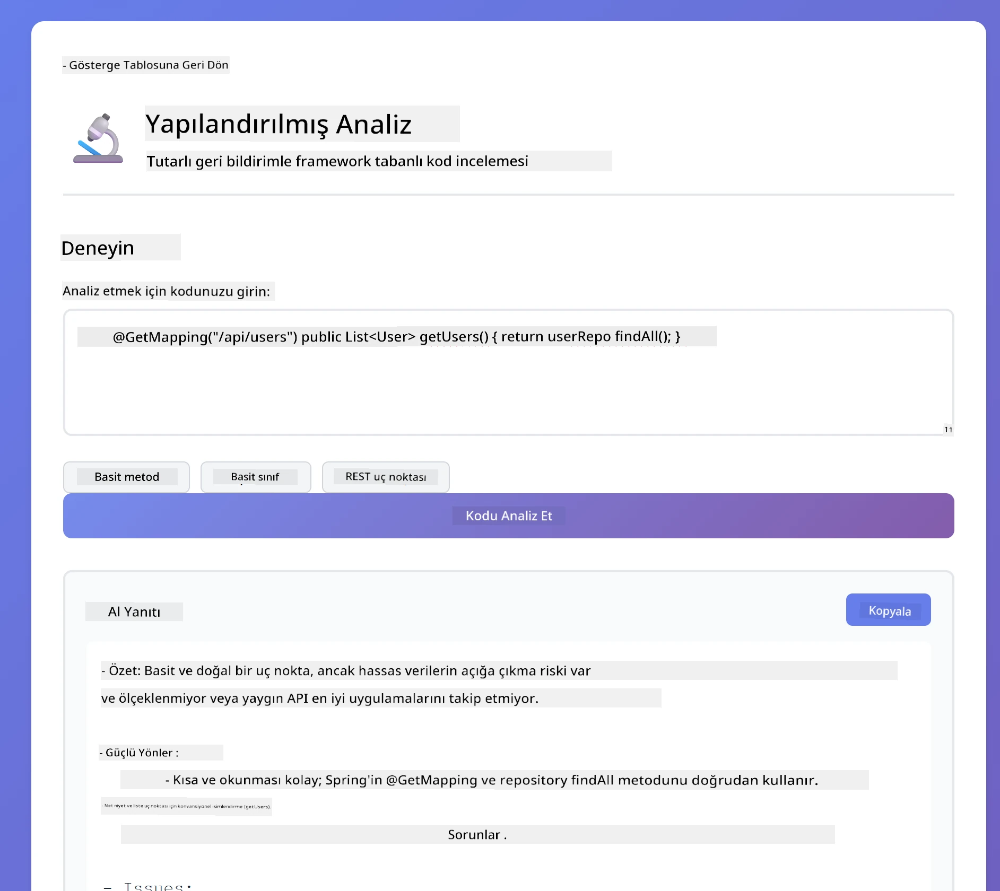

*Çerçeve tabanlı kod incelemesi*

### Çok Turlu Sohbet

"Spring Boot nedir?" diye sorun, ardından hemen "Bana bir örnek göster" deyin. Model ilk soruyu hatırlar ve size özel bir Spring Boot örneği verir. Bellek olmasaydı, ikinci soru çok belirsiz olurdu.

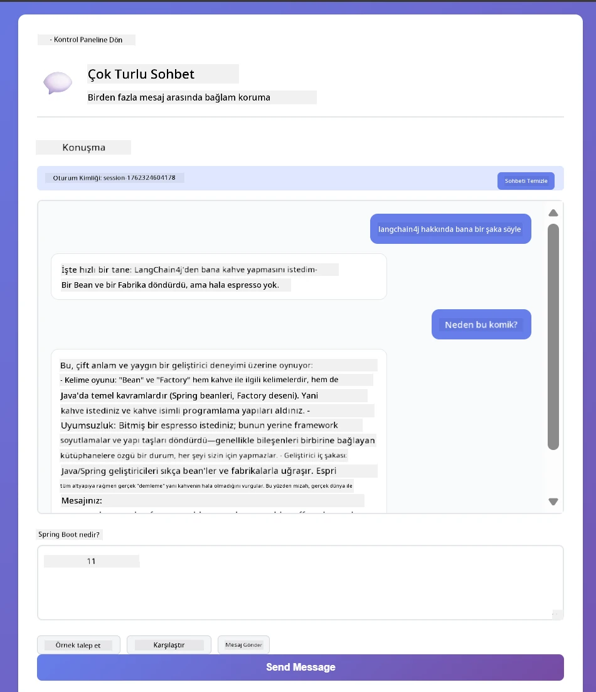

*Sorular arasında bağlam koruma*

### Adım Adım Akıl Yürütme

Bir matematik problemi seçin ve hem Adım Adım Akıl Yürütme hem de Düşük İsteklilik ile deneyin. Düşük isteklilik sadece cevabı verir - hızlı ama şeffaf değil. Adım adım size her hesaplamayı ve kararı gösterir.

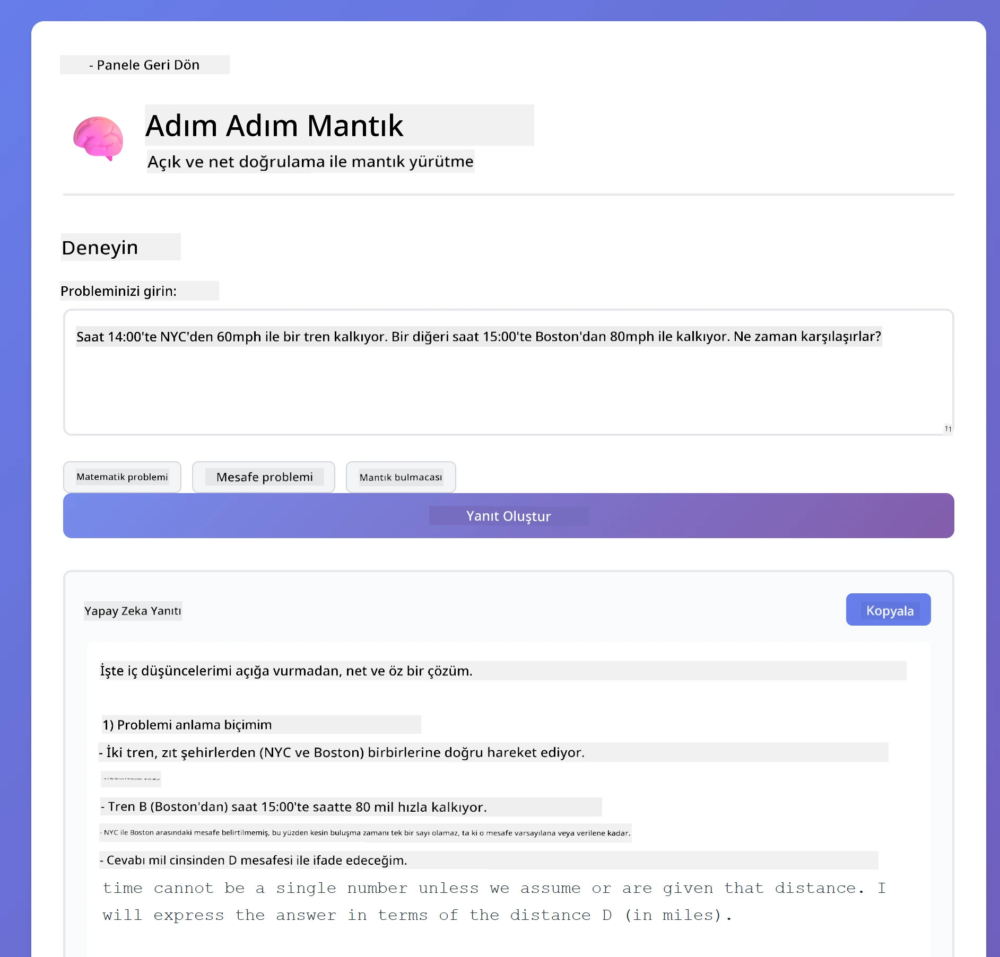

*Açık adımlarla matematik problemi*

### Kısıtlı Çıktı

Belirli formatlar veya kelime sayıları gerektiğinde, bu desen sıkı uyumu sağlar. Tam olarak 100 kelimelik madde işaretli bir özet üretmeyi deneyin.

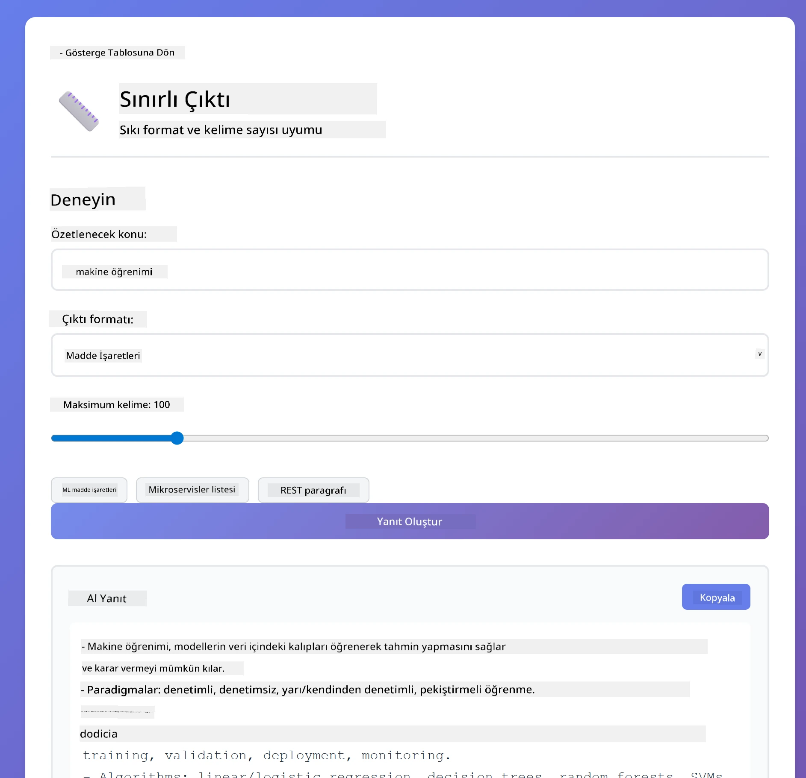

*Format kontrolü ile makine öğrenimi özeti*

## Gerçekten Ne Öğreniyorsunuz

**Akıl Yürütme Çabası Her Şeyi Değiştirir**

GPT-5, hesaplama çabasını istemlerinizle kontrol etmenizi sağlar. Düşük çaba, minimal keşif ile hızlı yanıtlar demektir. Yüksek çaba, modelin derin düşünmek için zaman ayırmasıdır. Görev karmaşıklığına göre çabayı ayarlamayı öğreniyorsunuz - basit sorularda zaman kaybetmeyin, ama karmaşık kararlarda acele etmeyin.

**Yapı Davranışı Yönlendirir**

İstemlerdeki XML etiketlerini fark ettiniz mi? Süs amaçlı değiller. Modeller, serbest metinden daha güvenilir şekilde yapılandırılmış talimatları takip eder. Çok adımlı süreçler veya karmaşık mantık gerektiğinde, yapı modelin nerede olduğunu ve sıradakini takip etmesine yardımcı olur.

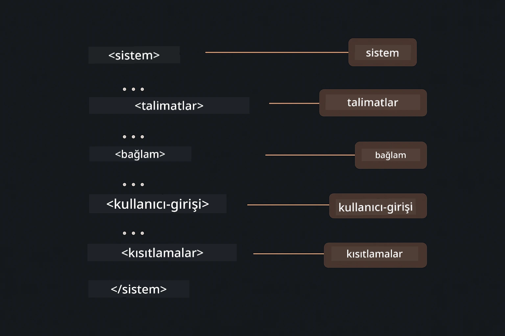

*Açık bölümler ve XML tarzı organizasyonla iyi yapılandırılmış bir istemin anatomisi*

**Kalite Kendi Kendini Değerlendirme ile Sağlanır**

Kendini değerlendiren desenler, kalite kriterlerini açık hale getirerek çalışır. Modelin "doğru yapmasını" ummak yerine, "doğru"nun ne anlama geldiğini tam olarak söylersiniz: doğru mantık, hata yönetimi, performans, güvenlik. Model kendi çıktısını değerlendirebilir ve geliştirebilir. Bu, kod üretimini bir piyangodan sürece dönüştürür.

**Bağlam Sınırlıdır**

Çok turlu sohbetler, her isteğe mesaj geçmişini dahil ederek çalışır. Ama bir sınır vardır - her modelin maksimum token sayısı vardır. Konuşmalar büyüdükçe, ilgili bağlamı korumak için stratejilere ihtiyacınız olacak. Bu modül belleğin nasıl çalıştığını gösterir; ileride ne zaman özetleneceğini, ne zaman unutulacağını ve ne zaman geri çağrılacağını öğreneceksiniz.

## Sonraki Adımlar

**Sonraki Modül:** [03-rag - RAG (Retrieval-Augmented Generation)](../03-rag/README.md)

---

**Gezinme:** [← Önceki: Modül 01 - Giriş](../01-introduction/README.md) | [Ana Sayfaya Dön](../README.md) | [Sonraki: Modül 03 - RAG →](../03-rag/README.md)

---

<!-- CO-OP TRANSLATOR DISCLAIMER START -->
**Feragatname**:  
Bu belge, AI çeviri servisi [Co-op Translator](https://github.com/Azure/co-op-translator) kullanılarak çevrilmiştir. Doğruluk için çaba gösterilse de, otomatik çevirilerin hatalar veya yanlışlıklar içerebileceğini lütfen unutmayınız. Orijinal belge, kendi dilinde yetkili kaynak olarak kabul edilmelidir. Kritik bilgiler için profesyonel insan çevirisi önerilir. Bu çevirinin kullanımı sonucu oluşabilecek yanlış anlamalar veya yorum hatalarından sorumlu değiliz.
<!-- CO-OP TRANSLATOR DISCLAIMER END -->