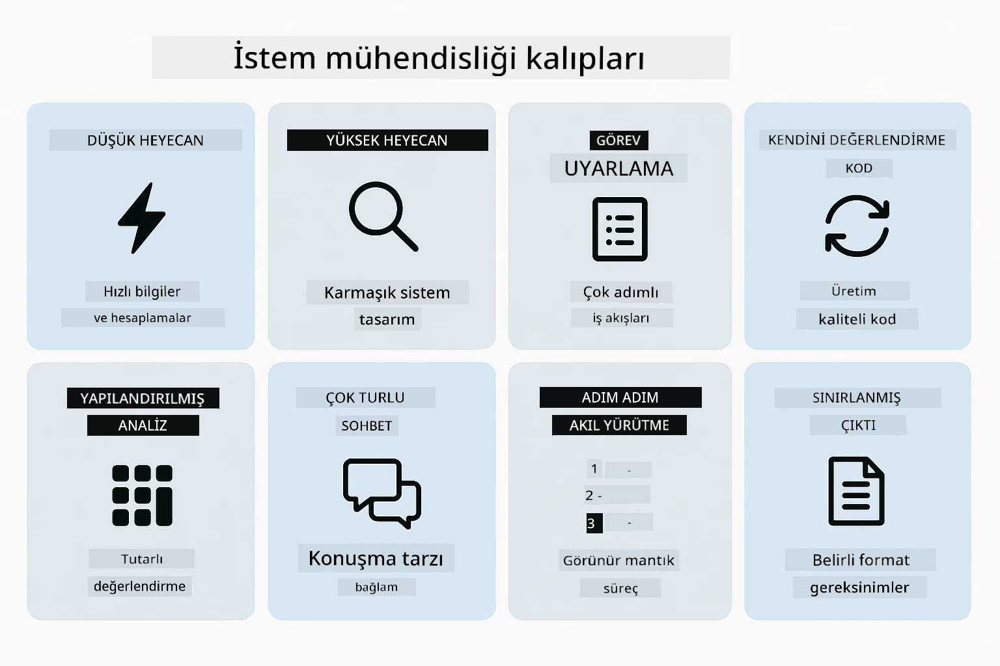
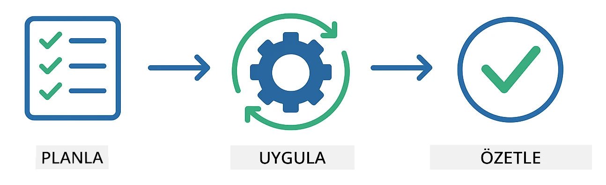
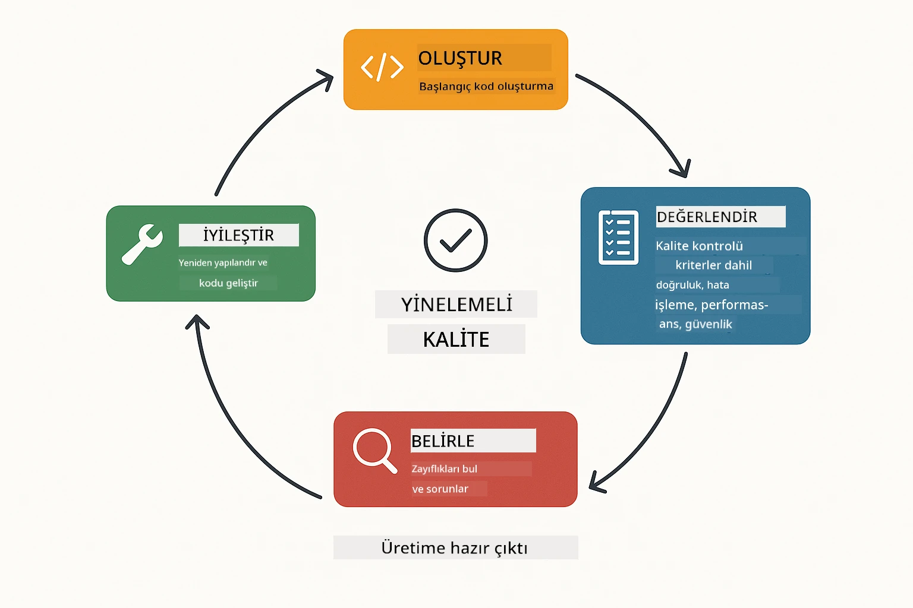
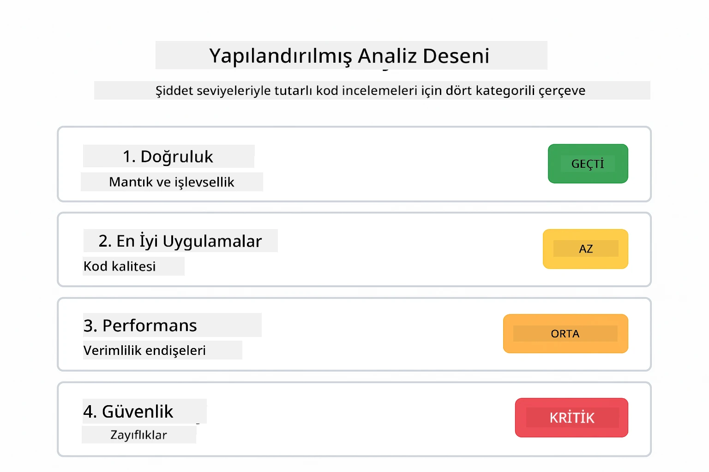
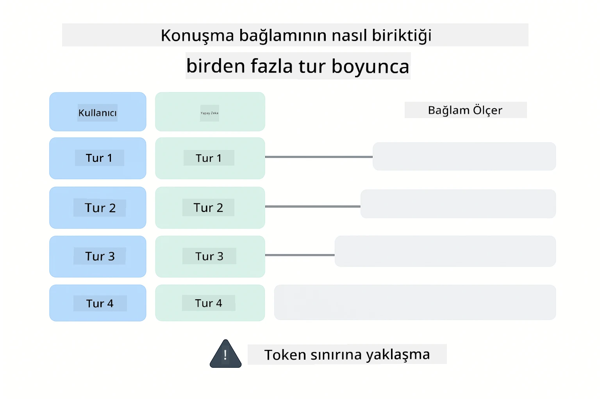
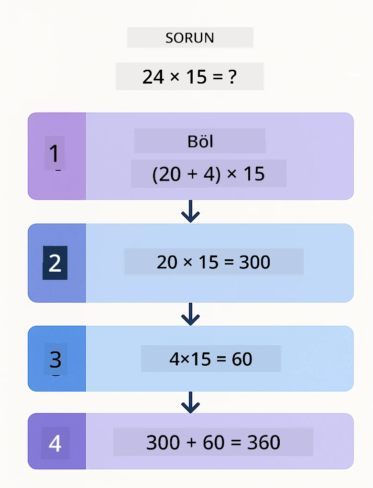
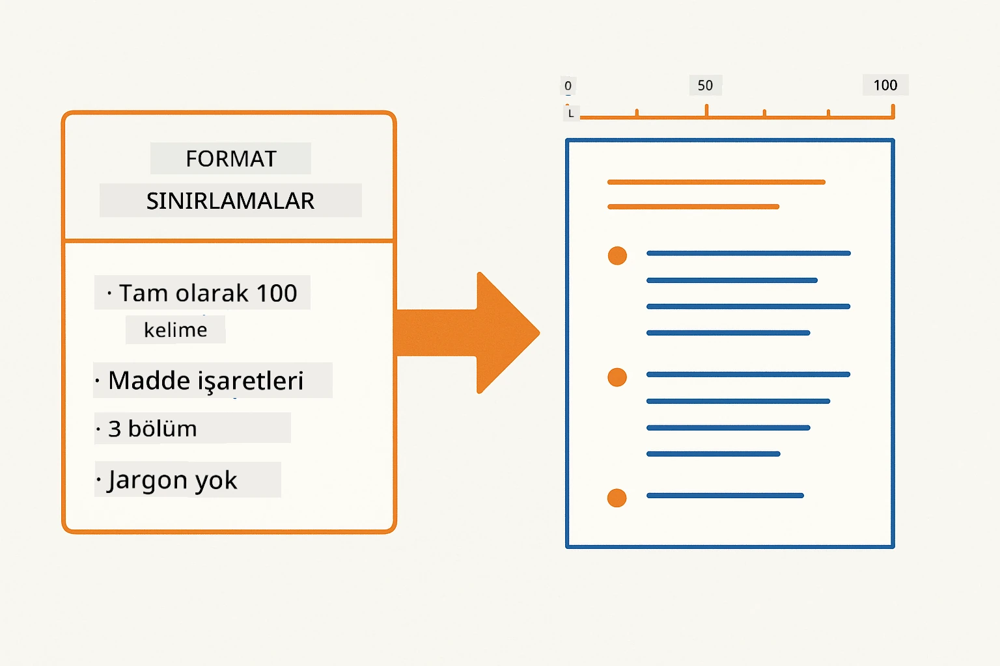
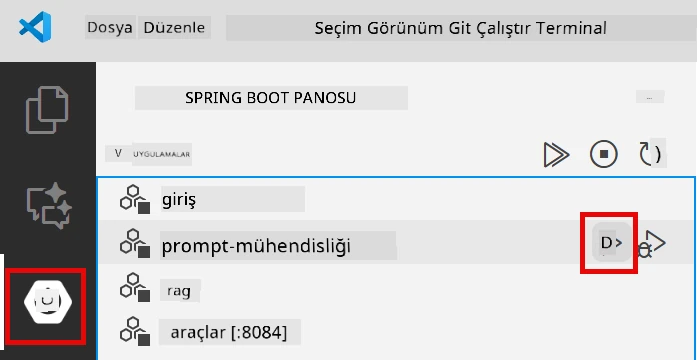
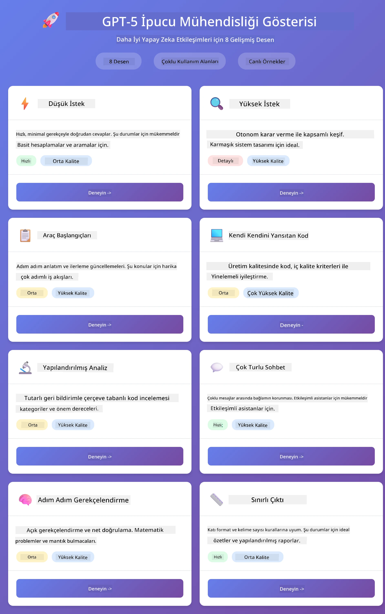
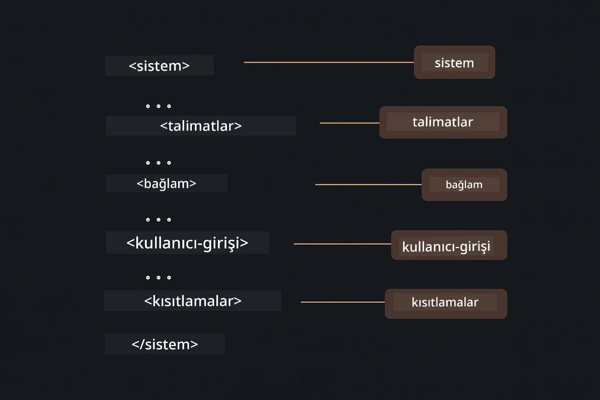

# Modül 02: GPT-5.2 ile Prompt Mühendisliği

## İçindekiler

- [Video Yürütme](#video-yürütme)
- [Neler Öğreneceksiniz](#neler-öğreneceksiniz)
- [Önkoşullar](#önkoşullar)
- [Prompt Mühendisliğini Anlamak](#prompt-mühendisliğini-anlamak)
- [Prompt Mühendisliği Temelleri](#prompt-mühendisliği-temelleri)
  - [Sıfır-Örnekleme (Zero-Shot) Promptlama](#sıfır-örnekleme-zero-shot-promptlama)
  - [Az-Örnekleme (Few-Shot) Promptlama](#az-örnekleme-few-shot-promptlama)
  - [Düşünce Zinciri](#düşünce-zinciri)
  - [Rol Bazlı Promptlama](#rol-bazlı-promptlama)
  - [Prompt Şablonları](#prompt-şablonları)
- [Gelişmiş Kalıplar](#gelişmiş-kalıplar)
- [Uygulamayı Çalıştırma](#uygulamayı-çalıştırın)
- [Uygulama Ekran Görüntüleri](#uygulama-ekran-görüntüleri)
- [Kalıpları Keşfetmek](#kalıpları-keşfetmek)
  - [Düşük vs Yüksek Heves](#düşük-ve-yüksek-i̇steklilik-eagerness)
  - [Görev Yürütme (Araç Önsözleri)](#görev-yürütme-araç-ön-hazırlıkları)
  - [Kendini Yansıtan Kod](#kendini-değerlendiren-kod)
  - [Yapılandırılmış Analiz](#yapılandırılmış-analiz)
  - [Çok Turlu Sohbet](#çok-turlu-sohbet)
  - [Adım Adım Akıl Yürütme](#adım-adım-mantık-yürütme)
  - [Kısıtlı Çıktı](#kısıtlı-çıktı)
- [Gerçekten Neler Öğreniyorsunuz](#gerçekten-ne-öğreniyorsunuz)
- [Sonraki Adımlar](#sonraki-adımlar)

## Video Yürütme

Bu modüle nasıl başlanacağını açıklayan canlı oturumu izleyin:

<a href="https://www.youtube.com/live/PJ6aBaE6bog?si=LDshyBrTRodP-wke"></a>

## Neler Öğreneceksiniz

Aşağıdaki diyagram, bu modülde geliştireceğiniz temel konular ve beceriler hakkında genel bir bakış sunar — prompt iyileştirme tekniklerinden takip edeceğiniz adım adım iş akışına kadar.


Önceki modülde Azure OpenAI ile hafızanın nasıl konuşma AI'sını sağladığını gördünüz. Şimdi Azure OpenAI'nin GPT-5.2'sini kullanarak soruları nasıl soracağımıza — promptlara — odaklanacağız. Promptlarınızı yapılandırma şekliniz aldığınız cevapların kalitesini dramatik şekilde etkiler. Temel prompt tekniklerinin gözden geçirilmesi ile başlıyor, sonra GPT-5.2'nin yeteneklerini tam olarak kullanan sekiz gelişmiş desene geçiyoruz.

GPT-5.2'yi kullanmamızın sebebi, akıl yürütme kontrolü getirmesidir - modelin cevaplamadan önce ne kadar düşünmesi gerektiğini söyleyebilirsiniz. Bu farklı prompt stratejilerini daha net kılar ve her yaklaşımın ne zaman kullanılacağını anlamanıza yardımcı olur.

## Önkoşullar

- Modül 01 tamamlanmış (Azure OpenAI kaynakları devreye alınmış)
- Ana dizinde `.env` dosyası Azure kimlik bilgileri ile (Modül 01'de `azd up` komutu ile oluşturulmuş)

> **Not:** Modül 01'i tamamlamadıysanız, önce oradaki dağıtım talimatlarını izleyin.

## Prompt Mühendisliğini Anlamak

Temelde prompt mühendisliği belirsiz talimatlar ile kesin talimatlar arasındaki farktır; aşağıdaki karşılaştırma bunu gösterir.


Prompt mühendisliği, ihtiyaç duyduğunuz sonuçları tutarlı olarak almanızı sağlayan giriş metnini tasarlama işidir. Sadece soru sormakla ilgili değil — isteği o şekilde yapılandırmakla ilgilidir ki model tam olarak ne istediğinizi ve nasıl sunacağını anlasın.

Bir meslektaşınıza talimat vermek gibi düşünün. "Hata düzelt" belirsizdir. "UserService.java’nın 45. satırındaki null pointer istisnasını null kontrolü ekleyerek düzelt" ise spesifiktir. Dil modelleri aynı şekilde çalışır — özgüllük ve yapı önemlidir.

Aşağıdaki diyagram LangChain4j'nin bu resmi nasıl tamamladığını gösterir — prompt kalıplarınızı SystemMessage ve UserMessage yapı taşları aracılığıyla modele bağlar.


LangChain4j, altyapıyı sağlar — model bağlantıları, hafıza ve mesaj türleri — prompt kalıpları ise bu altyapı üzerinden gönderdiğiniz dikkatle yapılandırılmış metindir. Temel yapı taşları `SystemMessage` (yapay zekanın davranışını ve rolünü belirler) ve `UserMessage` (gerçek isteğinizi taşır) öğeleridir.

## Prompt Mühendisliği Temelleri

Aşağıda gösterilen beş temel teknik, etkili prompt mühendisliğinin temelini oluşturur. Her biri dil modelleriyle iletişimin farklı bir yönünü ele alır.


Bu modüldeki gelişmiş kalıplara dalmadan önce, beş temel promptlama tekniğini gözden geçirelim. Bunlar her prompt mühendisi tarafından bilinmesi gereken yapı taşlarıdır.

### Sıfır-Örnekleme (Zero-Shot) Promptlama

En basit yaklaşım: modele herhangi bir örnek vermeden doğrudan bir talimat vermek. Model, görevi anlamak ve yürütmek için tamamen eğitimine güvenir. Beklenen davranışın açık olduğu basit talepler için iyi çalışır.


*Örnek olmadan doğrudan talimat — model görevi yalnızca talimattan çıkarır*

```java
String prompt = "Classify this sentiment: 'I absolutely loved the movie!'";
String response = model.chat(prompt);
// Yanıt: "Pozitif"
```

**Ne zaman kullanılır:** Basit sınıflandırmalar, doğrudan sorular, çeviriler veya modelin ek rehberlik olmadan işleyebileceği her türlü görev.

### Az-Örnekleme (Few-Shot) Promptlama

Modelin takip etmesini istediğiniz kalıbı gösteren örnekler sağlarsınız. Model, örneklerden beklenen giriş-çıkış formatını öğrenir ve yeni girdilere uygular. Bu, istenen formatın ya da davranışın açık olmadığı görevlerde tutarlılığı dramatik şekilde artırır.


*Örneklerden öğrenme — model kalıbı tanır ve yeni girdilere uygular*

```java
String prompt = """
    Classify the sentiment as positive, negative, or neutral.
    
    Examples:
    Text: "This product exceeded my expectations!" → Positive
    Text: "It's okay, nothing special." → Neutral
    Text: "Waste of money, very disappointed." → Negative
    
    Now classify this:
    Text: "Best purchase I've made all year!"
    """;
String response = model.chat(prompt);
```

**Ne zaman kullanılır:** Özel sınıflandırmalar, tutarlı biçimlendirme, alan spesifik görevler veya sıfır-örnekleme sonuçları tutarsız olduğunda.

### Düşünce Zinciri

Modelden akıl yürütmesini adım adım göstermesini istersiniz. Cevaba doğrudan atlamak yerine, model problemi parçalara ayırır ve her kısmı açık şekilde işler. Bu, matematik, mantık ve çok adımlı akıl yürütme görevlerinde doğruluğu artırır.


*Adım adım akıl yürütme — karmaşık problemleri açık mantıksal adımlara bölme*

```java
String prompt = """
    Problem: A store has 15 apples. They sell 8 apples and then 
    receive a shipment of 12 more apples. How many apples do they have now?
    
    Let's solve this step-by-step:
    """;
String response = model.chat(prompt);
// Model şu sonucu gösteriyor: 15 - 8 = 7, sonra 7 + 12 = 19 elma
```

**Ne zaman kullanılır:** Matematik problemleri, mantık bulmacaları, hata ayıklama veya akıl yürütme sürecinin gösterilmesinin doğruluk ve güveni artırdığı durumlar.

### Rol Bazlı Promptlama

Sorunuzu sormadan önce yapay zekaya bir kişilik ya da rol verirsiniz. Bu, yanıtın tonunu, derinliğini ve odağını belirleyen bir bağlam sağlar. "Yazılım mimarı" ile "genç geliştirici" ya da "güvenlik denetçisi" farklı öneriler sunar.


*Bağlam ve kişilik ayarlama — aynı soru verilen role göre farklı yanıt alır*

```java
String prompt = """
    You are an experienced software architect reviewing code.
    Provide a brief code review for this function:
    
    def calculate_total(items):
        total = 0
        for item in items:
            total = total + item['price']
        return total
    """;
String response = model.chat(prompt);
```

**Ne zaman kullanılır:** Kod incelemeleri, eğitim, alan spesifik analiz veya yanıtların belirli uzmanlık seviyesi ya da bakış açısına göre özelleştirildiği durumlar.

### Prompt Şablonları

Değişken yer tutucularla tekrar kullanılabilir promptlar oluşturun. Her seferinde yeni bir prompt yazmak yerine, bir şablon tanımlayın ve farklı değerlerle doldurun. LangChain4j’nin `PromptTemplate` sınıfı `{{variable}}` sözdizimi ile bunu kolaylaştırır.


*Değişken yer tutuculara sahip tekrar kullanılabilir promptlar — bir şablon, çok kullanım*

```java
PromptTemplate template = PromptTemplate.from(
    "What's the best time to visit {{destination}} for {{activity}}?"
);

Prompt prompt = template.apply(Map.of(
    "destination", "Paris",
    "activity", "sightseeing"
));

String response = model.chat(prompt.text());
```

**Ne zaman kullanılır:** Farklı girişlerle tekrarlanan sorgular, toplu işlemler, tekrar kullanılabilir AI iş akışları veya prompt yapısının aynı kalıp, verinin değiştiği her senaryo.

---

Bu beş temel, çoğu promptlama görevi için sağlam bir araç seti sunar. Bu modül kalan kısmında, GPT-5.2'nin akıl yürütme kontrolü, kendini değerlendirme ve yapılandırılmış çıktı yeteneklerini kullanan **sekiz gelişmiş kalıp** ile devam eder.

## Gelişmiş Kalıplar

Temelleri tamamladıktan sonra, bu modülü benzersiz kılan sekiz gelişmiş kalıba geçelim. Her problem aynı yaklaşımı gerektirmez. Bazı sorular hızlı cevap ister, bazıları derin düşünme. Bazıları görünür akıl yürütme ister, bazıları yalnızca sonuç. Aşağıdaki her kalıp farklı senaryo için optimize edilmiştir — ve GPT-5.2'nin akıl yürütme kontrolü farkları daha da belirgin kılar.



*Sekiz prompt mühendisliği kalıbının genel görünümü ve kullanım alanları*

GPT-5.2 bu kalıplara başka bir boyut ekler: *akıl yürütme kontrolü*. Aşağıdaki çubuk, modelin düşünme çabasını — hızlı, doğrudan cevaplardan derin, kapsamlı analizlere kadar — nasıl ayarlayabileceğinizi gösterir.


*GPT-5.2'nin akıl yürütme kontrolü, modelin ne kadar düşünmesi gerektiğini belirtmenizi sağlar — hızlı doğrudan cevaplardan derin keşfe kadar*

**Düşük Heves (Hızlı ve Odaklı)** - Hızlı, doğrudan cevap istediğiniz basit sorular için. Model minimum akıl yürütme yapar - maksimum 2 adım. Bunu hesaplamalar, sorgular veya basit sorular için kullanın.

```java
String prompt = """
    <context_gathering>
    - Search depth: very low
    - Bias strongly towards providing a correct answer as quickly as possible
    - Usually, this means an absolute maximum of 2 reasoning steps
    - If you think you need more time, state what you know and what's uncertain
    </context_gathering>
    
    Problem: What is 15% of 200?
    
    Provide your answer:
    """;

String response = chatModel.chat(prompt);
```

> 💡 **GitHub Copilot ile Keşfedin:** [`Gpt5PromptService.java`](../../../02-prompt-engineering/src/main/java/com/example/langchain4j/prompts/service/Gpt5PromptService.java) dosyasını açın ve sorun:
> - "Düşük heves ve yüksek heves promptlama kalıpları arasındaki fark nedir?"
> - "Promptlardaki XML etiketleri yapay zekanın yanıtını nasıl yapılandırmaya yardım eder?"
> - "Kendini yansıtma kalıplarını ne zaman doğrudan talimat yerine kullanmalıyım?"

**Yüksek Heves (Derin ve Kapsamlı)** - Kapsamlı analiz istediğiniz karmaşık problemler için. Model derinlemesine keşfeder ve detaylı akıl yürütmeyi gösterir. Bunu sistem tasarımı, mimari kararlar veya karmaşık araştırmalar için kullanın.

```java
String prompt = """
    Analyze this problem thoroughly and provide a comprehensive solution.
    Consider multiple approaches, trade-offs, and important details.
    Show your analysis and reasoning in your response.
    
    Problem: Design a caching strategy for a high-traffic REST API.
    """;

String response = chatModel.chat(prompt);
```

**Görev Yürütme (Adım Adım İlerleme)** - Çok adımlı iş akışları için. Model baştan bir plan sunar, çalışırken her adımı anlatır, sonra özetler. Bunu geçişler, uygulamalar veya çok adımlı süreçler için tercih edin.

```java
String prompt = """
    <task_execution>
    1. First, briefly restate the user's goal in a friendly way
    
    2. Create a step-by-step plan:
       - List all steps needed
       - Identify potential challenges
       - Outline success criteria
    
    3. Execute each step:
       - Narrate what you're doing
       - Show progress clearly
       - Handle any issues that arise
    
    4. Summarize:
       - What was completed
       - Any important notes
       - Next steps if applicable
    </task_execution>
    
    <tool_preambles>
    - Always begin by rephrasing the user's goal clearly
    - Outline your plan before executing
    - Narrate each step as you go
    - Finish with a distinct summary
    </tool_preambles>
    
    Task: Create a REST endpoint for user registration
    
    Begin execution:
    """;

String response = chatModel.chat(prompt);
```

Düşünce Zinciri promptlama, modelden akıl yürütme sürecini göstermesini açık şekilde ister, karmaşık görevlerin doğruluğunu artırır. Adım adım ayrım, hem insan hem yapay zekanın mantığı anlamasını kolaylaştırır.

> **🤖 GitHub Copilot Chat ile Deneyin:** Bu kalıpla ilgili sorun:
> - "Uzun süreli işlemler için görev yürütme kalıbını nasıl adapte edebilirim?"
> - "Üretim uygulamalarında araç önsözleri nasıl en iyi şekilde yapılandırılır?"
> - "Ara ilerleme güncellemelerini bir kullanıcı arayüzünde nasıl yakalar ve gösteririm?"

Aşağıdaki diyagram bu Planla → Yürüt → Özetle iş akışını görselleştirir.



*Planla → Yürüt → Özetle iş akışı çok adımlı görevler için*

**Kendini Yansıtan Kod** - Üretim kalitesinde kod üretmek için. Model, uygun hata yönetimi ile üretim standartlarına uygun kod oluşturur. Yeni özellikler ya da servisler oluştururken kullanılır.

```java
String prompt = """
    Generate Java code with production-quality standards: Create an email validation service
    Keep it simple and include basic error handling.
    """;

String response = chatModel.chat(prompt);
```

Aşağıdaki diyagram bu tekrarlı iyileştirme döngüsünü gösterir — üret, değerlendirme yap, zayıf noktaları belirle, standarda ulaşana kadar iyileştir.



*İteratif iyileştirme döngüsü - üret, değerlendir, sorunları tespit et, geliştir, tekrarla*

**Yapılandırılmış Analiz** - Tutarlı değerlendirme için. Model, kodu sabit bir çerçeve ile gözden geçirir (doğruluk, uygulamalar, performans, güvenlik, sürdürülebilirlik). Kod incelemeleri veya kalite değerlendirmelerinde kullanılır.

```java
String prompt = """
    <analysis_framework>
    You are an expert code reviewer. Analyze the code for:
    
    1. Correctness
       - Does it work as intended?
       - Are there logical errors?
    
    2. Best Practices
       - Follows language conventions?
       - Appropriate design patterns?
    
    3. Performance
       - Any inefficiencies?
       - Scalability concerns?
    
    4. Security
       - Potential vulnerabilities?
       - Input validation?
    
    5. Maintainability
       - Code clarity?
       - Documentation?
    
    <output_format>
    Provide your analysis in this structure:
    - Summary: One-sentence overall assessment
    - Strengths: 2-3 positive points
    - Issues: List any problems found with severity (High/Medium/Low)
    - Recommendations: Specific improvements
    </output_format>
    </analysis_framework>
    
    Code to analyze:
    ```
    public List getUsers() {
        return database.query("SELECT * FROM users");
    }
    ```
    Provide your structured analysis:
    """;

String response = chatModel.chat(prompt);
```

> **🤖 GitHub Copilot Chat ile Deneyin:** Yapılandırılmış analiz hakkında sorun:
> - "Farklı kod inceleme türleri için analiz çerçevesi nasıl özelleştirilir?"
> - "Yapılandırılmış çıktıyı programatik olarak ayrıştırmanın ve işlemenin en iyi yolu nedir?"
> - "Farklı inceleme oturumlarında tutarlı önem düzeyleri nasıl sağlanır?"

Aşağıdaki diyagram bu yapılandırılmış çerçevenin kod incelemesini tutarlı kategorilere ve önem düzeylerine nasıl ayırdığını gösterir.



*Tutarlı kod incelemeleri için önem düzeyli çerçeve*

**Çok Turlu Sohbet** - Bağlam gerektiren konuşmalar için. Model önceki mesajları hatırlar ve üzerine inşa eder. Etkileşimli yardım oturumları veya karmaşık SSS için kullanılır.

```java
ChatMemory memory = MessageWindowChatMemory.withMaxMessages(10);

memory.add(UserMessage.from("What is Spring Boot?"));
AiMessage aiMessage1 = chatModel.chat(memory.messages()).aiMessage();
memory.add(aiMessage1);

memory.add(UserMessage.from("Show me an example"));
AiMessage aiMessage2 = chatModel.chat(memory.messages()).aiMessage();
memory.add(aiMessage2);
```

Aşağıdaki diyagram, konuşma bağlamının her turda nasıl biriktiğini ve modelin token sınırıyla ilişkisini görselleştirir.



*Konuşma bağlamının token sınırına ulaşana kadar çoklu turlarda birikmesi*

**Adım Adım Akıl Yürütme** - Görünür mantık gerektiren problemler için. Model, her adım için açık akıl yürütme gösterir. Matematik problemleri, mantık bulmacaları veya düşünme sürecini anlamak istediğiniz durumlar için uygundur.

```java
String prompt = """
    <instruction>Show your reasoning step-by-step</instruction>
    
    If a train travels 120 km in 2 hours, then stops for 30 minutes,
    then travels another 90 km in 1.5 hours, what is the average speed
    for the entire journey including the stop?
    """;

String response = chatModel.chat(prompt);
```

Aşağıdaki diyagram modelin problemleri açık, numaralandırılmış mantıksal adımlara nasıl böldüğünü gösterir.


*Sorunları açık mantıksal adımlara ayırmak*

**Kısıtlı Çıktı** - Belirli format gereksinimleri olan yanıtlar için. Model, format ve uzunluk kurallarına kesinlikle uyar. Özetler için veya kesin çıktı yapısına ihtiyaç duyduğunuzda kullanın.

```java
String prompt = """
    <constraints>
    - Exactly 100 words
    - Bullet point format
    - Technical terms only
    </constraints>
    
    Summarize the key concepts of machine learning.
    """;

String response = chatModel.chat(prompt);
```

Aşağıdaki diyagram, modelin format ve uzunluk gereksinimlerinize sıkı sıkıya uyan çıktı üretmesini nasıl sağladığını göstermektedir.



*Belirli format, uzunluk ve yapı gereksinimlerinin uygulanması*

## Uygulamayı Çalıştırın

**Dağıtımı doğrulayın:**

`.env` dosyasının kök dizinde Azure kimlik bilgileri ile (Modül 01 sırasında oluşturuldu) mevcut olduğundan emin olun. Bunu modül dizininden (`02-prompt-engineering/`) çalıştırın:

**Bash:**
```bash
cat ../.env  # AZURE_OPENAI_ENDPOINT, API_KEY, DEPLOYMENT göstermeli
```

**PowerShell:**
```powershell
Get-Content ..\.env  # AZURE_OPENAI_ENDPOINT, API_KEY, DEPLOYMENT göstermelidir
```

**Uygulamayı başlatın:**

> **Not:** Eğer tüm uygulamaları kök dizinden `./start-all.sh` komutuyla (Modül 01’de açıklandığı gibi) zaten başlattıysanız, bu modül 8083 portunda zaten çalışıyor. Aşağıdaki başlatma komutlarını atlayıp doğrudan http://localhost:8083 adresine gidebilirsiniz.

**Seçenek 1: Spring Boot Dashboard kullanımı (VS Code kullanıcıları için önerilir)**

Dev konteyner, tüm Spring Boot uygulamalarını yönetmek için görsel arayüz sağlayan Spring Boot Dashboard eklentisini içerir. VS Code’un sol yanındaki Aktivite Çubuğunda (Spring Boot simgesine bakın) bulabilirsiniz.

Spring Boot Dashboard’dan şunları yapabilirsiniz:
- Çalışma alanındaki tüm kullanılabilir Spring Boot uygulamalarını görmek
- Uygulamaları tek tıklamayla başlatmak/durdurmak
- Uygulama günlüklerini gerçek zamanlı görüntülemek
- Uygulama durumunu izlemek

Bu modülü başlatmak için "prompt-engineering" yanındaki oynat düğmesine tıklayın veya tüm modülleri aynı anda başlatın.



*VS Code’daki Spring Boot Dashboard — tüm modülleri tek bir yerden başlatın, durdurun ve izleyin*

**Seçenek 2: Shell betikleri kullanmak**

Tüm web uygulamalarını (modüller 01-04) başlatın:

**Bash:**
```bash
cd ..  # Kök dizinden
./start-all.sh
```

**PowerShell:**
```powershell
cd ..  # Kök dizinden
.\start-all.ps1
```

Ya da sadece bu modülü başlatın:

**Bash:**
```bash
cd 02-prompt-engineering
./start.sh
```

**PowerShell:**
```powershell
cd 02-prompt-engineering
.\start.ps1
```

Her iki betik de kök dizindeki `.env` dosyasından ortam değişkenlerini otomatik yükler ve JAR dosyaları yoksa inşa eder.

> **Not:** Başlatmadan önce tüm modülleri manuel olarak derlemeyi tercih ederseniz:
>
> **Bash:**
> ```bash
> cd ..  # Go to root directory
> mvn clean package -DskipTests
> ```
>
> **PowerShell:**
> ```powershell
> cd ..  # Go to root directory
> mvn clean package -DskipTests
> ```

Tarayıcınızda http://localhost:8083 adresini açın.

**Durdurmak için:**

**Bash:**
```bash
./stop.sh  # Yalnızca bu modül
# Veya
cd .. && ./stop-all.sh  # Tüm modüller
```

**PowerShell:**
```powershell
.\stop.ps1  # Yalnızca bu modül
# Veya
cd ..; .\stop-all.ps1  # Tüm modüller
```

## Uygulama Ekran Görüntüleri

Burada, sekiz kalıbın tamamıyla yan yana deneme yapabileceğiniz prompt engineering modülünün ana arayüzü bulunmaktadır.



*Sekiz prompt engineering kalıbını özellikleri ve kullanım durumlarıyla gösteren ana paneller*

## Kalıpları Keşfetmek

Web arayüzü, farklı sorgulama stratejileriyle deneme yapmanızı sağlar. Her kalıp farklı sorunları çözer - hangisinin ne zaman işe yaradığını görmek için deneyin.

> **Not: Akışlı vs Akışsız** — Her kalıp sayfası iki buton sunar: **🔴 Akışlı Yanıt (Canlı)** ve **Akışsız** seçenek. Akışlı, model tokenleri üretirken Server-Sent Events (SSE) kullanarak gerçek zamanlı gösterir, böylece ilerlemeyi hemen görürsünüz. Akışsız seçenek tüm yanıtı bekler ve sonra gösterir. Derin mantık gerektiren isteklerde (örneğin, High Eagerness, Self-Reflecting Code) akışsız çağrı çok uzun sürebilir — bazen dakikalarca — ve görünür geri bildirim olmaz. **Karmaşık sorgularla denemeler yaparken akışlıyı kullanın** böylece modelin nasıl çalıştığını görür ve isteğin zaman aşımına uğradığı izlenimini önlersiniz.
>
> **Not: Tarayıcı Gereksinimi** — Akış özelliği Fetch Streams API (`response.body.getReader()`) kullanır ve tam özellikli bir tarayıcı (Chrome, Edge, Firefox, Safari) gerektirir. VS Code’un yerleşik Basit Tarayıcısında çalışmaz çünkü onun webview’si ReadableStream API desteği sunmaz. Basit Tarayıcı kullanırsanız, akışsız düğmeler normal çalışır — sadece akışlılar etkilenir. Tam deneyim için `http://localhost:8083` adresini harici bir tarayıcıda açın.

### Düşük ve Yüksek İsteklilik (Eagerness)

"Düşük İsteklilik" ile "200’ün %15’i nedir?" gibi basit bir soru sorun. Hızlı, doğrudan yanıt alırsınız. Şimdi "Yüksek trafikli API için önbellekleme stratejisi tasarla" gibi karmaşık bir soru sorup **🔴 Akışlı Yanıt (Canlı)** butonuna tıklayın ve modelin detaylı mantığını token token görün. Aynı model, aynı soru yapısı - ama sorgu ona ne kadar düşünmesi gerektiğini söylüyor.

### Görev Yürütme (Araç Ön Hazırlıkları)

Çok adımlı iş akışları önceden planlama ve ilerleme anlatımıyla gelişir. Model ne yapacağını özetler, her adımı anlatır, sonra sonuçları özetler.

### Kendini Değerlendiren Kod

"Bir e-posta doğrulama servisi oluştur" deneyin. Kod oluşturup durmak yerine, model üretir, kalite kriterlerine göre değerlendirir, zayıf noktaları belirler ve geliştirir. Kod üretim standartlarına ulaşana kadar tekrar ettirir.

### Yapılandırılmış Analiz

Kod incelemeleri tutarlı değerlendirme çerçeveleri ister. Model, kodu doğruluk, uygulamalar, performans, güvenlik gibi sabit kategorilerle ve önem dereceleriyle analiz eder.

### Çok Turlu Sohbet

"Spring Boot nedir?" diye sorun, hemen ardından "Bana bir örnek göster" deyin. Model ilk soruyu hatırlar ve size özel bir Spring Boot örneği verir. Hafıza olmasaydı, ikinci soru çok belirsiz olurdu.

### Adım Adım Mantık Yürütme

Bir matematik problemi seçip hem Adım Adım Mantık Yürütme hem de Düşük İsteklilikle deneyin. Düşük istek sadece cevabı verir — hızlı ama yüzeysel. Adım adım size her hesaplamayı ve kararı gösterir.

### Kısıtlı Çıktı

Belirli format veya kelime sayısı gerektiğinde, bu kalıp sıkı uyumu sağlar. Tam olarak 100 kelimelik, madde işaretli bir özet üretmeyi deneyin.

## Gerçekten Ne Öğreniyorsunuz

**Mantık Yürütme Çabası Her Şeyi Değiştirir**

GPT-5.2, sorgularınız aracılığıyla hesaplama çabasını kontrol etmenizi sağlar. Düşük çaba, hızlı ve az keşif içeren yanıtlar demektir. Yüksek çaba, modelin derin düşünmesi için zaman ayırması anlamına gelir. Görevin karmaşıklığına göre çaba seviyesi ayarlamayı öğreniyorsunuz — basit sorularda zaman harcamayın, ama karmaşık kararlarda acele etmeyin.

**Yapı Davranışı Yönlendirir**

Sorgulardaki XML etiketlerine dikkat ettiniz mi? Süs için değil. Modeller yapılandırılmış talimatları serbest metinden daha güvenilir izler. Çok aşamalı süreçler veya karmaşık mantık gerektiğinde, yapı modelin nerede olduğunu ve sırada ne olduğunu takip etmesine yardımcı olur. Aşağıdaki diyagram, iyi yapılandırılmış bir sorguyu parçalar, `<system>`, `<instructions>`, `<context>`, `<user-input>` ve `<constraints>` gibi etiketlerin talimatlarınızı nasıl net bölümlere ayırdığını gösterir.



*Net bölümlere ve XML tarzı organizasyona sahip iyi yapılandırılmış bir sorgunun anatomisi*

**Kalite Kendini Değerlendirme ile**

Kendini değerlendiren kalıplar, kalite kriterlerini açık hale getirerek çalışır. Modelin "doğru yapacağını" ummak yerine, "doğru"nun ne anlama geldiğini kesin olarak söylersiniz: doğru mantık, hata yönetimi, performans, güvenlik. Model kendi çıktısını değerlendirebilir ve geliştirebilir. Bu, kod üretimini bir piyangodan sürece dönüştürür.

**Kontekst Sınırlıdır**

Çok turlu sohbetler, her istekte mesaj geçmişini dahil ederek işler. Ama bir sınır vardır — her modelin maksimum token sayısı vardır. Sohbet uzadıkça, ilgili bağlamı korumak için stratejiler gerekir, bu modül, hafızanın nasıl çalıştığını gösterir; daha sonra ne zaman özetleneceğini, ne zaman unutulacağını ve ne zaman geri çağrılacağını öğrenirsiniz.

## Sonraki Adımlar

**Sonraki Modül:** [03-rag - RAG (Retrieval-Augmented Generation)](../03-rag/README.md)

---

**Gezinme:** [← Önceki: Modül 01 - Giriş](../01-introduction/README.md) | [Ana Sayfaya Dön](../README.md) | [Sonraki: Modül 03 - RAG →](../03-rag/README.md)

---

<!-- CO-OP TRANSLATOR DISCLAIMER START -->
**Feragatname**:
Bu belge, AI çeviri hizmeti [Co-op Translator](https://github.com/Azure/co-op-translator) kullanılarak çevrilmiştir. Doğruluk için çaba sarf etsek de, otomatik çevirilerin hata veya yanlışlık içerebileceğini lütfen unutmayınız. Orijinal belge, kendi dilinde yetkili kaynak olarak kabul edilmelidir. Kritik bilgiler için profesyonel insan çevirisi önerilir. Bu çevirinin kullanımı sonucu ortaya çıkabilecek yanlış anlamalardan veya yanlış yorumlamalardan sorumlu değiliz.
<!-- CO-OP TRANSLATOR DISCLAIMER END -->