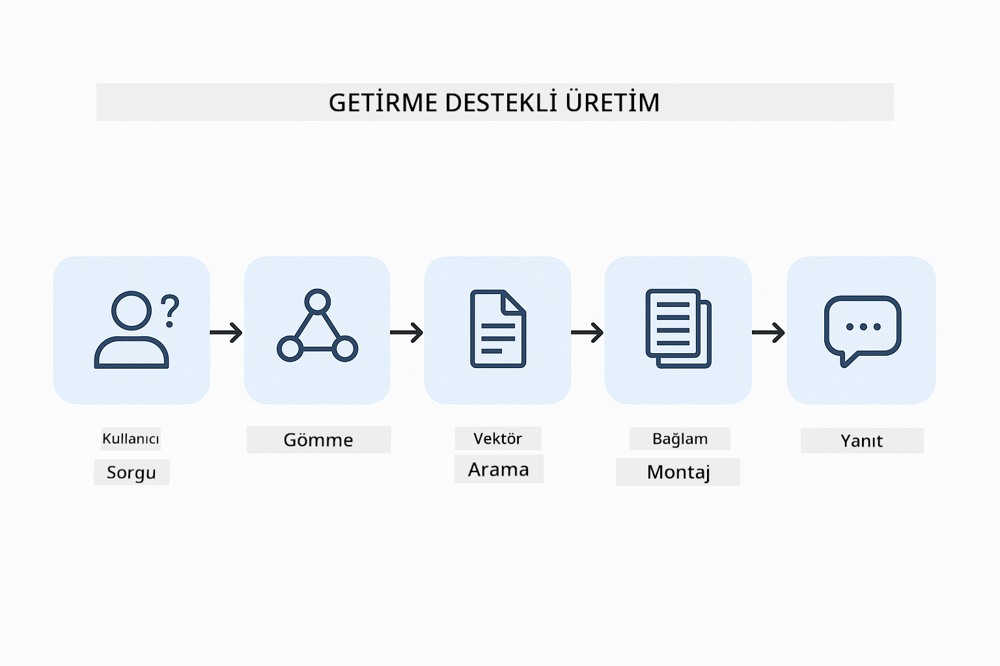
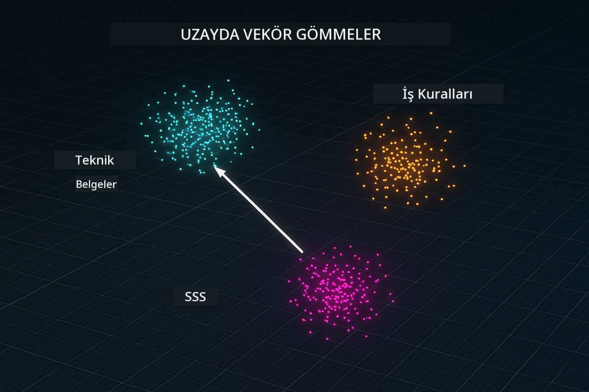
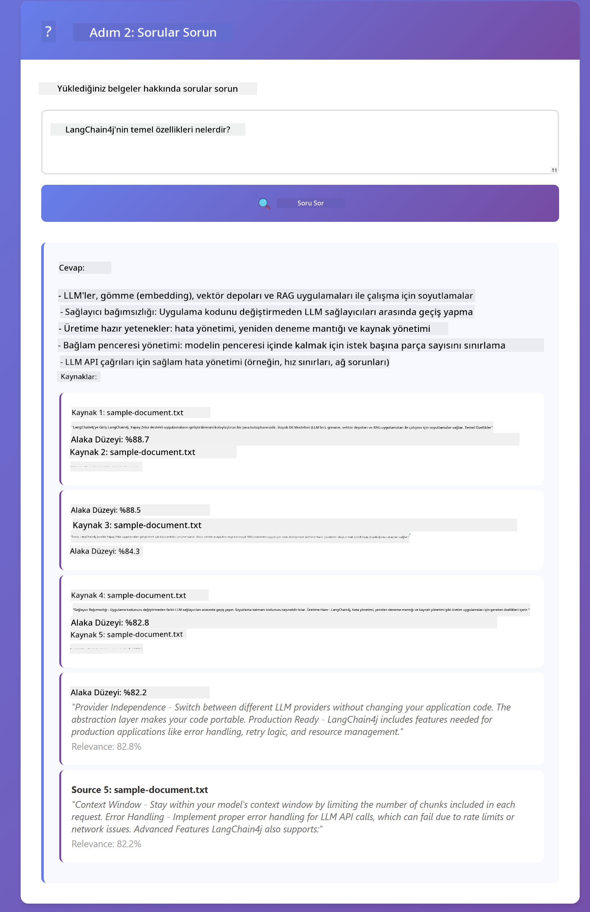

<!--
CO_OP_TRANSLATOR_METADATA:
{
  "original_hash": "f538a51cfd13147d40d84e936a0f485c",
  "translation_date": "2025-12-13T17:01:31+00:00",
  "source_file": "03-rag/README.md",
  "language_code": "tr"
}
-->
# Modül 03: RAG (Retrieval-Augmented Generation)

## İçindekiler

- [Neler Öğreneceksiniz](../../../03-rag)
- [Ön Koşullar](../../../03-rag)
- [RAG'i Anlamak](../../../03-rag)
- [Nasıl Çalışır](../../../03-rag)
  - [Belge İşleme](../../../03-rag)
  - [Gömülü Temsil Oluşturma](../../../03-rag)
  - [Anlamsal Arama](../../../03-rag)
  - [Cevap Üretimi](../../../03-rag)
- [Uygulamayı Çalıştırma](../../../03-rag)
- [Uygulamayı Kullanma](../../../03-rag)
  - [Belge Yükleme](../../../03-rag)
  - [Sorular Sorma](../../../03-rag)
  - [Kaynak Referanslarını Kontrol Etme](../../../03-rag)
  - [Sorularla Deney Yapma](../../../03-rag)
- [Temel Kavramlar](../../../03-rag)
  - [Parçalama Stratejisi](../../../03-rag)
  - [Benzerlik Puanları](../../../03-rag)
  - [Bellek İçi Depolama](../../../03-rag)
  - [Bağlam Penceresi Yönetimi](../../../03-rag)
- [RAG Ne Zaman Önemlidir](../../../03-rag)
- [Sonraki Adımlar](../../../03-rag)

## Neler Öğreneceksiniz

Önceki modüllerde, yapay zeka ile nasıl sohbet edileceğini ve istemlerinizi nasıl etkili yapılandıracağınızı öğrendiniz. Ancak temel bir sınırlama vardır: dil modelleri yalnızca eğitim sırasında öğrendiklerini bilir. Şirketinizin politikaları, proje dokümantasyonunuz veya eğitilmediği herhangi bir bilgi hakkında soruları yanıtlayamazlar.

RAG (Retrieval-Augmented Generation) bu sorunu çözer. Modeli bilgilerinizi öğretmeye çalışmak yerine (ki bu pahalı ve pratik değildir), ona belgelerinizde arama yapma yeteneği verirsiniz. Birisi soru sorduğunda, sistem ilgili bilgileri bulur ve isteme dahil eder. Model ardından bu alınan bağlama dayanarak yanıt verir.

RAG'i modele bir referans kütüphanesi vermek gibi düşünün. Bir soru sorduğunuzda sistem:

1. **Kullanıcı Sorgusu** - Siz bir soru sorarsınız
2. **Gömülü Temsil** - Sorunuzu bir vektöre dönüştürür
3. **Vektör Araması** - Benzer belge parçalarını bulur
4. **Bağlam Oluşturma** - İlgili parçaları isteme ekler
5. **Yanıt** - LLM, bağlama dayanarak cevap üretir

Bu, modelin yanıtlarını eğitim bilgisine veya uydurulan cevaplara dayanmak yerine gerçek verilerinize dayandırır.



*RAG iş akışı - kullanıcı sorgusundan anlamsal aramaya ve bağlamsal cevap üretimine*

## Ön Koşullar

- Modül 01 tamamlanmış (Azure OpenAI kaynakları dağıtıldı)
- Kök dizinde Azure kimlik bilgileri içeren `.env` dosyası (Modül 01'de `azd up` ile oluşturuldu)

> **Not:** Modül 01'i tamamlamadıysanız, önce oradaki dağıtım talimatlarını izleyin.

## Nasıl Çalışır

**Belge İşleme** - [DocumentService.java](../../../03-rag/src/main/java/com/example/langchain4j/rag/service/DocumentService.java)

Bir belge yüklediğinizde, sistem onu modelin bağlam penceresine rahatça sığacak daha küçük parçalara böler. Bu parçalar sınırda bağlam kaybını önlemek için biraz üst üste biner.

```java
Document document = FileSystemDocumentLoader.loadDocument("sample-document.txt");

DocumentSplitter splitter = DocumentSplitters
    .recursive(300, 30, new OpenAiTokenizer());

List<TextSegment> segments = splitter.split(document);
```

> **🤖 [GitHub Copilot](https://github.com/features/copilot) Chat ile deneyin:** [`DocumentService.java`](../../../03-rag/src/main/java/com/example/langchain4j/rag/service/DocumentService.java) dosyasını açın ve sorun:
> - "LangChain4j belgeleri nasıl parçalara ayırıyor ve üst üste binme neden önemli?"
> - "Farklı belge türleri için optimal parça boyutu nedir ve neden?"
> - "Birden fazla dilde veya özel biçimlendirmeye sahip belgelerle nasıl başa çıkarım?"

**Gömülü Temsil Oluşturma** - [LangChainRagConfig.java](../../../03-rag/src/main/java/com/example/langchain4j/rag/config/LangChainRagConfig.java)

Her parça, metnin anlamını yakalayan matematiksel bir parmak izi olan sayısal bir temsil (embedding) haline getirilir. Benzer metinler benzer gömülü temsiller üretir.

```java
@Bean
public EmbeddingModel embeddingModel() {
    return OpenAiOfficialEmbeddingModel.builder()
        .baseUrl(azureOpenAiEndpoint)
        .apiKey(azureOpenAiKey)
        .modelName(azureEmbeddingDeploymentName)
        .build();
}

EmbeddingStore<TextSegment> embeddingStore = 
    new InMemoryEmbeddingStore<>();
```



*Belgeler gömülü temsil alanında vektörler olarak gösterilir - benzer içerikler kümelenir*

**Anlamsal Arama** - [RagService.java](../../../03-rag/src/main/java/com/example/langchain4j/rag/service/RagService.java)

Bir soru sorduğunuzda, sorunuz da bir gömülü temsile dönüştürülür. Sistem, sorunuzun gömülü temsili ile tüm belge parçalarının gömülü temsillerini karşılaştırır. En benzer anlamlara sahip parçaları bulur - sadece anahtar kelime eşleşmesi değil, gerçek anlamsal benzerlik.

```java
Embedding queryEmbedding = embeddingModel.embed(question).content();

List<EmbeddingMatch<TextSegment>> matches = 
    embeddingStore.findRelevant(queryEmbedding, 5, 0.7);

for (EmbeddingMatch<TextSegment> match : matches) {
    String relevantText = match.embedded().text();
    double score = match.score();
}
```

> **🤖 [GitHub Copilot](https://github.com/features/copilot) Chat ile deneyin:** [`RagService.java`](../../../03-rag/src/main/java/com/example/langchain4j/rag/service/RagService.java) dosyasını açın ve sorun:
> - "Gömülü temsillerle benzerlik araması nasıl çalışır ve puanı ne belirler?"
> - "Hangi benzerlik eşiğini kullanmalıyım ve sonuçları nasıl etkiler?"
> - "İlgili belge bulunamadığında nasıl davranmalıyım?"

**Cevap Üretimi** - [RagService.java](../../../03-rag/src/main/java/com/example/langchain4j/rag/service/RagService.java)

En alakalı parçalar modele verilen isteme dahil edilir. Model bu belirli parçaları okur ve sorunuza bu bilgiler doğrultusunda yanıt verir. Bu, modelin uydurma yapmasını engeller - sadece önünde olan bilgiden cevap verebilir.

## Uygulamayı Çalıştırma

**Dağıtımı doğrulayın:**

Kök dizinde Azure kimlik bilgileri içeren `.env` dosyasının var olduğundan emin olun (Modül 01 sırasında oluşturuldu):
```bash
cat ../.env  # AZURE_OPENAI_ENDPOINT, API_KEY, DEPLOYMENT göstermeli
```

**Uygulamayı başlatın:**

> **Not:** Modül 01'de `./start-all.sh` ile tüm uygulamaları zaten başlattıysanız, bu modül 8081 portunda zaten çalışıyor. Aşağıdaki başlatma komutlarını atlayabilir ve doğrudan http://localhost:8081 adresine gidebilirsiniz.

**Seçenek 1: Spring Boot Dashboard kullanarak (VS Code kullanıcıları için önerilir)**

Geliştirme konteyneri, tüm Spring Boot uygulamalarını yönetmek için görsel bir arayüz sağlayan Spring Boot Dashboard uzantısını içerir. VS Code'un solundaki Aktivite Çubuğunda (Spring Boot simgesine bakın) bulabilirsiniz.

Spring Boot Dashboard'dan:
- Çalışma alanındaki tüm Spring Boot uygulamalarını görebilirsiniz
- Uygulamaları tek tıkla başlatabilir/durdurabilirsiniz
- Uygulama günlüklerini gerçek zamanlı izleyebilirsiniz
- Uygulama durumunu takip edebilirsiniz

"rag" yanındaki oynat düğmesine tıklayarak bu modülü başlatabilir veya tüm modülleri aynı anda başlatabilirsiniz.


**Seçenek 2: Shell betikleri kullanarak**

Tüm web uygulamalarını (modüller 01-04) başlatın:

**Bash:**
```bash
cd ..  # Kök dizinden
./start-all.sh
```

**PowerShell:**
```powershell
cd ..  # Kök dizinden
.\start-all.ps1
```

Ya da sadece bu modülü başlatın:

**Bash:**
```bash
cd 03-rag
./start.sh
```

**PowerShell:**
```powershell
cd 03-rag
.\start.ps1
```

Her iki betik de kök `.env` dosyasından ortam değişkenlerini otomatik yükler ve JAR dosyaları yoksa oluşturur.

> **Not:** Başlatmadan önce tüm modülleri manuel derlemeyi tercih ederseniz:
>
> **Bash:**
> ```bash
> cd ..  # Go to root directory
> mvn clean package -DskipTests
> ```
>
> **PowerShell:**
> ```powershell
> cd ..  # Go to root directory
> mvn clean package -DskipTests
> ```

Tarayıcınızda http://localhost:8081 adresini açın.

**Durdurmak için:**

**Bash:**
```bash
./stop.sh  # Sadece bu modül
# Veya
cd .. && ./stop-all.sh  # Tüm modüller
```

**PowerShell:**
```powershell
.\stop.ps1  # Sadece bu modül
# Veya
cd ..; .\stop-all.ps1  # Tüm modüller
```

## Uygulamayı Kullanma

Uygulama, belge yükleme ve soru sorma için web arayüzü sağlar.

<a href="images/rag-homepage.png"></a>

*RAG uygulama arayüzü - belgeleri yükleyin ve sorular sorun*

**Belge Yükleme**

Öncelikle bir belge yükleyin - test için TXT dosyaları en uygunudur. Bu dizinde LangChain4j özellikleri, RAG uygulaması ve en iyi uygulamalar hakkında bilgi içeren `sample-document.txt` adlı bir örnek belge sağlanmıştır - sistemin test edilmesi için mükemmeldir.

Sistem belgenizi işler, parçalara böler ve her parça için gömülü temsiller oluşturur. Bu işlem belgeyi yüklediğinizde otomatik gerçekleşir.

**Sorular Sorma**

Şimdi belge içeriği hakkında spesifik sorular sorun. Belgedeki açıkça belirtilmiş gerçekçi bir şey deneyin. Sistem ilgili parçaları arar, isteme dahil eder ve bir cevap üretir.

**Kaynak Referanslarını Kontrol Etme**

Her cevabın benzerlik puanları ile kaynak referansları içerdiğine dikkat edin. Bu puanlar (0 ile 1 arasında) her parçanın sorunuzla ne kadar alakalı olduğunu gösterir. Daha yüksek puanlar daha iyi eşleşme demektir. Bu, cevabı kaynak materyale karşı doğrulamanızı sağlar.

<a href="images/rag-query-results.png"></a>

*Sorgu sonuçları, cevap ile kaynak referansları ve alaka puanlarını gösterir*

**Sorularla Deney Yapma**

Farklı türde sorular deneyin:
- Spesifik gerçekler: "Ana konu nedir?"
- Karşılaştırmalar: "X ile Y arasındaki fark nedir?"
- Özetler: "Z hakkında temel noktaları özetle"

Sorunuzun belge içeriğiyle ne kadar iyi eşleştiğine bağlı olarak alaka puanlarının nasıl değiştiğini izleyin.

## Temel Kavramlar

**Parçalama Stratejisi**

Belgeler 300 token'lık parçalara 30 token üst üste binme ile bölünür. Bu denge, her parçanın anlamlı bağlama sahip olmasını sağlarken, istemde birden fazla parçanın yer almasına izin verecek kadar küçük kalmasını sağlar.

**Benzerlik Puanları**

Puanlar 0 ile 1 arasında değişir:
- 0.7-1.0: Çok alakalı, tam eşleşme
- 0.5-0.7: Alakalı, iyi bağlam
- 0.5'in altında: Filtrelenmiş, çok farklı

Sistem kaliteyi sağlamak için minimum eşik üzerindeki parçaları getirir.

**Bellek İçi Depolama**

Bu modül basitlik için bellek içi depolama kullanır. Uygulamayı yeniden başlattığınızda yüklenen belgeler kaybolur. Üretim sistemleri Qdrant veya Azure AI Search gibi kalıcı vektör veritabanları kullanır.

**Bağlam Penceresi Yönetimi**

Her modelin maksimum bağlam penceresi vardır. Büyük bir belgeden tüm parçaları dahil edemezsiniz. Sistem, sınırlar içinde kalmak ve doğru cevaplar için yeterli bağlam sağlamak amacıyla en alakalı N parçayı (varsayılan 5) getirir.

## RAG Ne Zaman Önemlidir

**RAG'i kullanın:**
- Özel belgelerle ilgili soruları yanıtlarken
- Bilgilerin sık değiştiği durumlarda (politikalar, fiyatlar, spesifikasyonlar)
- Doğruluk için kaynak ataması gerektiğinde
- İçerik tek bir isteme sığmayacak kadar büyükse
- Doğrulanabilir, temellendirilmiş yanıtlar gerektiğinde

**RAG'i kullanmayın:**
- Sorular modelin zaten bildiği genel bilgi gerektiriyorsa
- Gerçek zamanlı veri gerekiyorsa (RAG yüklenen belgeler üzerinde çalışır)
- İçerik doğrudan isteme sığacak kadar küçükse

## Sonraki Adımlar

**Sonraki Modül:** [04-tools - Araçlarla AI Ajanları](../04-tools/README.md)

---

**Gezinme:** [← Önceki: Modül 02 - İstem Mühendisliği](../02-prompt-engineering/README.md) | [Ana Sayfaya Dön](../README.md) | [Sonraki: Modül 04 - Araçlar →](../04-tools/README.md)

---

<!-- CO-OP TRANSLATOR DISCLAIMER START -->
**Feragatname**:  
Bu belge, AI çeviri servisi [Co-op Translator](https://github.com/Azure/co-op-translator) kullanılarak çevrilmiştir. Doğruluk için çaba göstersek de, otomatik çevirilerin hatalar veya yanlışlıklar içerebileceğini lütfen unutmayın. Orijinal belge, kendi dilinde yetkili kaynak olarak kabul edilmelidir. Kritik bilgiler için profesyonel insan çevirisi önerilir. Bu çevirinin kullanımı sonucu oluşabilecek yanlış anlamalar veya yorum hatalarından sorumlu değiliz.
<!-- CO-OP TRANSLATOR DISCLAIMER END -->