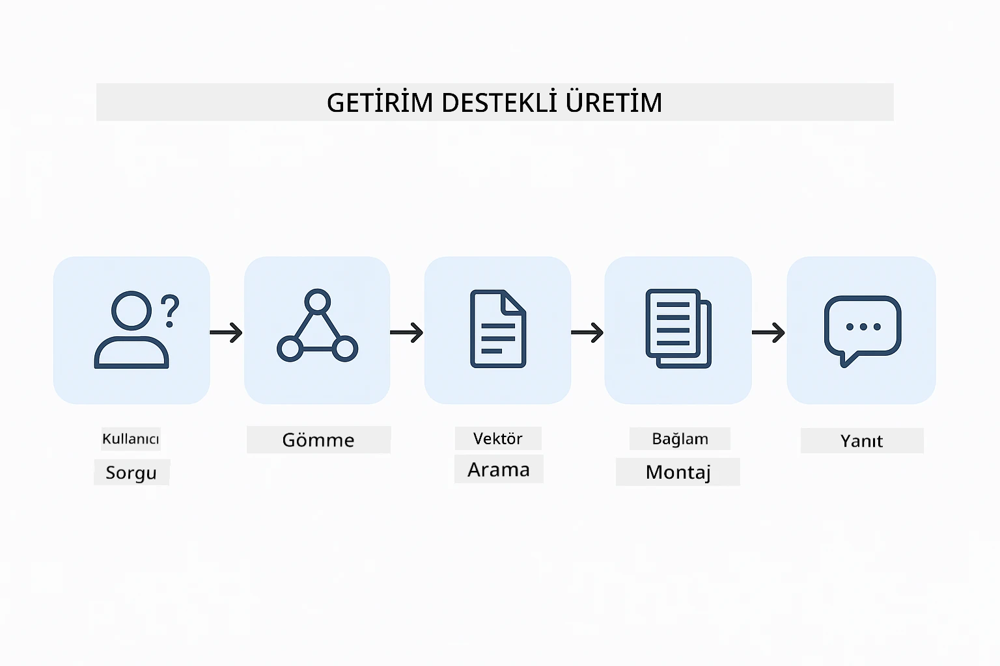
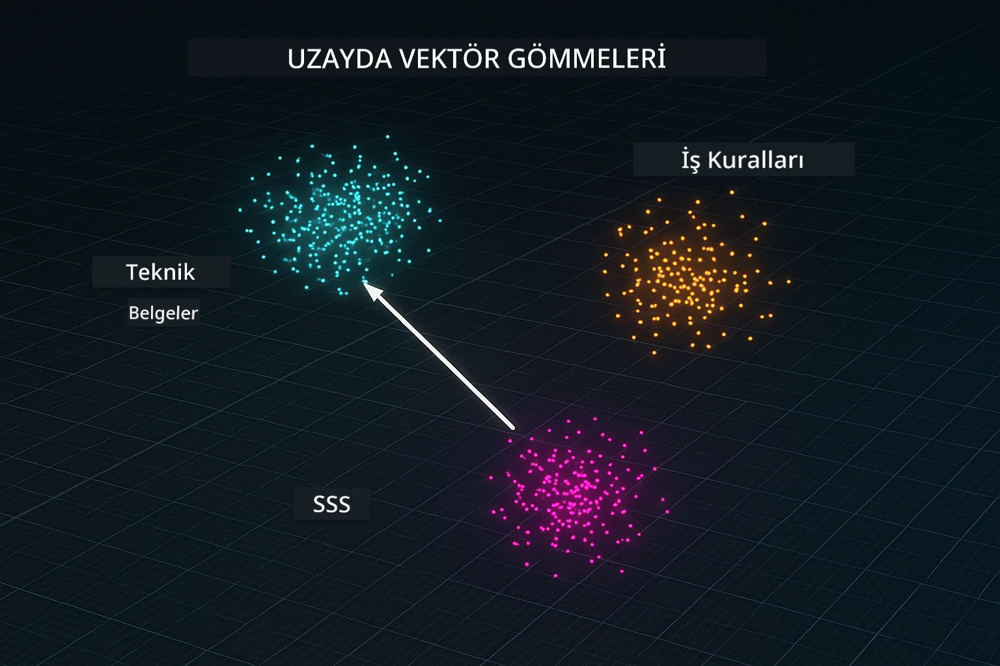
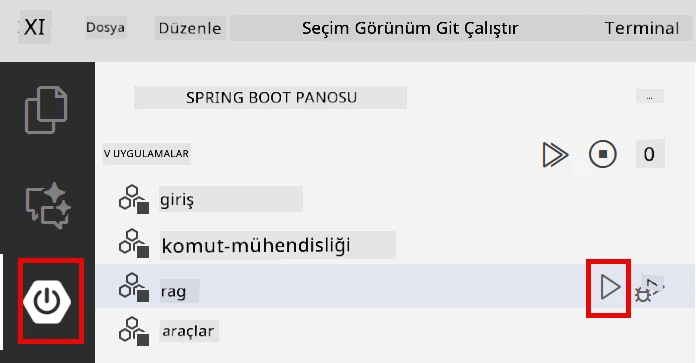
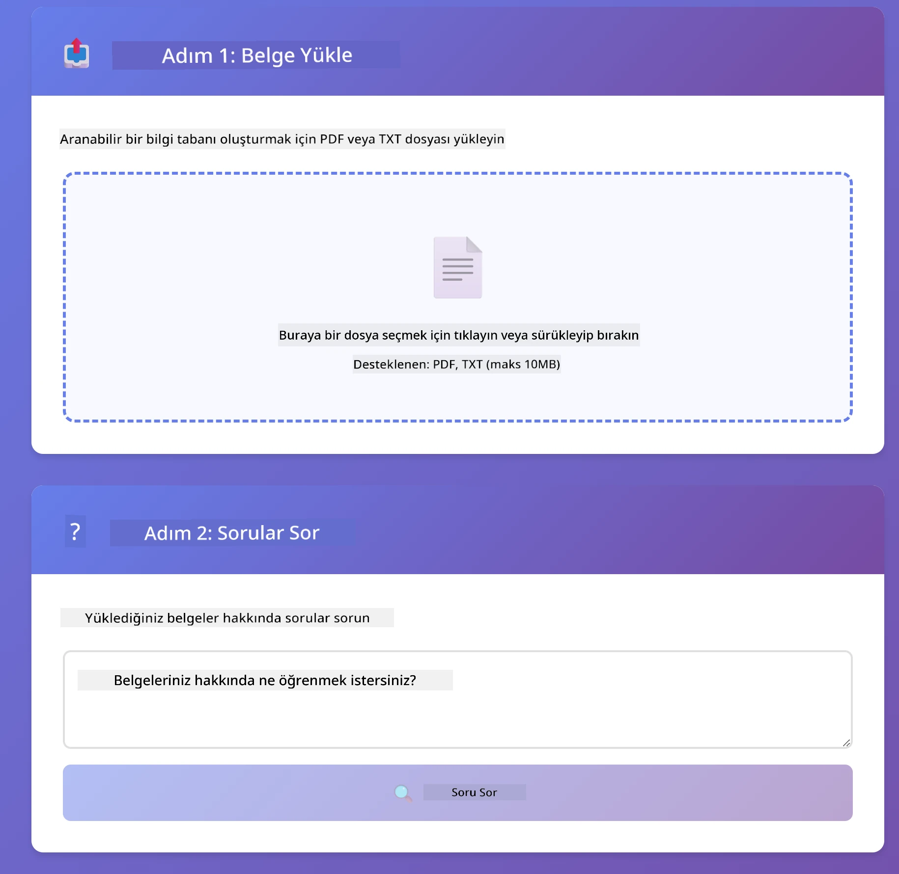
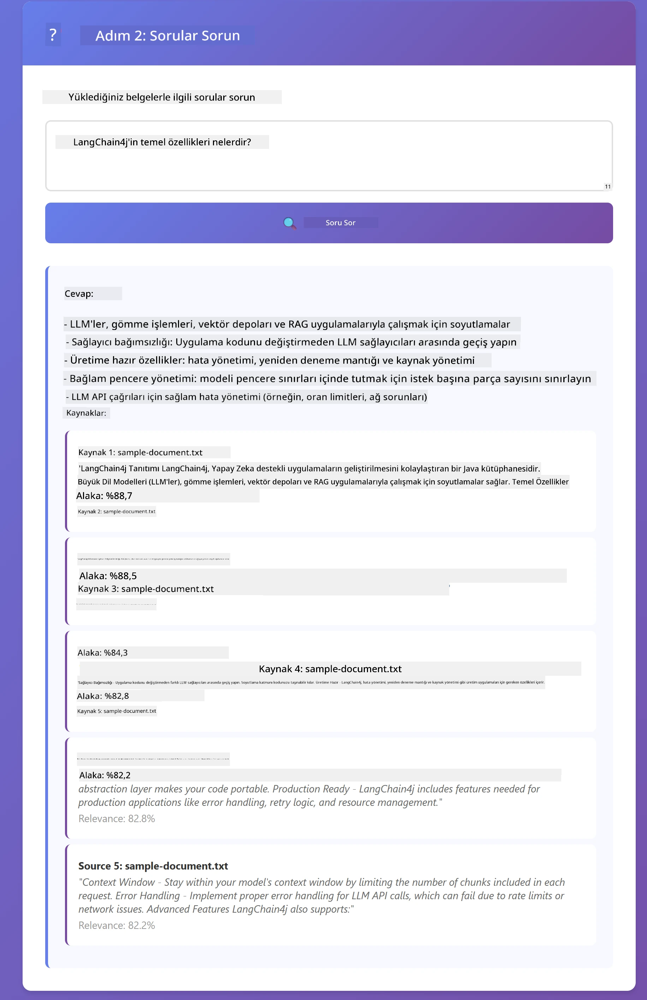

# Modül 03: RAG (Arama Destekli Üretim)

## İçindekiler

- [Video Rehberi](#video-rehberi)
- [Neler Öğreneceksiniz](#neler-öğreneceksiniz)
- [Ön Koşullar](#ön-koşullar)
- [RAG'ı Anlamak](#ragı-anlamak)
  - [Bu Eğitim Hangi RAG Yaklaşımını Kullanıyor?](#bu-eğitim-hangi-rag-yaklaşımını-kullanıyor)
- [Nasıl Çalışır](#nasıl-çalışır)
  - [Belge İşleme](#belge-i̇şleme)
  - [Gömüler Oluşturma](#gömüler-oluşturma)
  - [Anlamsal Arama](#anlamsal-arama)
  - [Yanıt Üretimi](#yanıt-oluşturma)
- [Uygulamayı Çalıştırma](#uygulamayı-çalıştırma)
- [Uygulamayı Kullanma](#uygulama-kullanımı)
  - [Belge Yükleme](#belge-yükleme)
  - [Sorular Sorma](#sorular-sorun)
  - [Kaynak Referanslarını Kontrol Etme](#kaynak-referanslarını-kontrol-edin)
  - [Sorularla Deney Yapma](#sorularla-deney-yapın)
- [Anahtar Kavramlar](#temel-kavramlar)
  - [Parçalama Stratejisi](#parça-bölme-stratejisi)
  - [Benzerlik Skorları](#benzerlik-puanları)
  - [Bellek İçi Depolama](#bellek-i̇çi-depolama)
  - [Bağlam Penceresi Yönetimi](#bağlam-penceresi-yönetimi)
- [RAG Ne Zaman Önemlidir](#rag-ne-zaman-önemlidir)
- [Sonraki Adımlar](#sonraki-adımlar)

## Video Rehberi

Bu modüle nasıl başlanacağını anlatan canlı oturumu izleyin:

<a href="https://www.youtube.com/watch?v=_olq75ZH_eY"></a>

## Neler Öğreneceksiniz

Önceki modüllerde AI ile nasıl sohbet edeceğinizi ve istemlerinizi etkili şekilde yapılandırmayı öğrendiniz. Ancak temel bir sınırlama var: dil modelleri yalnızca eğitim sırasında öğrendiklerini bilir. Şirket politikalarınız, proje dokümantasyonunuz veya eğitilmedikleri herhangi bir bilgi hakkında soruları yanıtlayamazlar.

RAG (Arama Destekli Üretim) bu sorunu çözer. Modele bilgilerinizi öğretmeye çalışmak (ki bu hem maliyetli hem de pratik değildir) yerine, ona dokümanlarınızda arama yapma yeteneği verirsiniz. Birisi soru sorduğunda, sistem ilgili bilgileri bulur ve isteme ekler. Model de cevapları bu alınan bağlama dayanarak üretir.

RAG’ı modele bir başvuru kütüphanesi vermek gibi düşünün. Bir soru sorduğunuzda sistem:

1. **Kullanıcı Sorgusu** - Siz soru sorarsınız
2. **Gömüleme** - Sorunuzu vektöre çevirir
3. **Vektör Arama** - Benzer belge parçalarını bulur
4. **Bağlam Derleme** - İlgili parçaları isteme ekler
5. **Cevap** - LLM, bağlama dayanarak cevap üretir

Bu sayede modelin yanıtları eğitim bilgisine ya da tahmine değil, gerçek verilerinize dayanır.

## Ön Koşullar

- [Modül 01 - Giriş](../01-introduction/README.md) tamamlanmış (Azure OpenAI kaynakları dağıtılmış, `text-embedding-3-small` gömülü modeli dahil)
- Kök dizinde Azure kimlik bilgileri içeren `.env` dosyası (Modül 01'de `azd up` ile oluşturuldu)

> **Not:** Eğer Modül 01 tamamlanmadıysa önce oradaki dağıtım talimatlarını izleyin. `azd up` komutu hem GPT sohbet modeli hem de bu modülde kullanılan gömü modeli dağıtır.

## RAG'ı Anlamak

Aşağıdaki diyagram temel kavramı gösterir: modele sadece eğitim verilerini kullanmak yerine, cevap üretmeden önce danışması için belgelerinizden bir başvuru kütüphanesi verilmektedir.


*Bu diyagram standart bir LLM (eğitimden tahmin yapar) ile RAG destekli bir LLM (önce belgelerinize danışar) arasındaki farkı gösterir.*

Aşağıda, parçaların baştan sona nasıl bağlandığı gösterilmiştir. Bir kullanıcının sorusu dört aşamadan geçer — gömüleme, vektör arama, bağlam derleme ve yanıt üretimi — her aşama bir öncekine dayanır:



*Bu diyagram, bir kullanıcının sorgusunun gömüleme, vektör arama, bağlam derleme ve yanıt üretimi süreçlerinden geçtiği RAG hattını gösterir.*

Modülün geri kalanı, her aşamayı çalıştırıp değiştirebileceğiniz kod ve diyagramlarla ayrıntılı anlatır.

### Bu Eğitim Hangi RAG Yaklaşımını Kullanıyor?

LangChain4j, farklı soyutlama seviyeleriyle uygulanan üç RAG yöntemi sunar. Aşağıdaki diyagram yan yana karşılaştırır:


*Bu diyagram, LangChain4j'nin Easy, Native ve Advanced RAG yaklaşımlarını temel bileşenleri ve ne zaman kullanıldıkları ile karşılaştırır.*

| Yaklaşım | Ne Yapar | Dezavantajı |
|---|---|---|
| **Easy RAG** | Tüm süreci `AiServices` ve `ContentRetriever` üzerinden otomatik olarak bağlar. Bir arayüz tanımlayıp retriever ekliyorsunuz, LangChain4j gömüleme, arama ve istem derlemeyi arka planda hallediyor. | Kod minimal ama her adım görünmüyor. |
| **Native RAG** | Gömü modelini çağırır, deposunu arar, istemi kendiniz oluşturur ve cevabı üretirsiniz — her adım açıkça yazılır. | Daha fazla kod ama her aşama görünür ve değiştirilebilir. |
| **Advanced RAG** | `RetrievalAugmentor` çerçevesi kullanır; sorgu dönüştürücüler, yönlendiriciler, yeniden sıralayıcılar ve içerik enjeksiyonları kullanımına izin verir. | Maksimum esneklik ama çok daha karmaşık. |

**Bu eğitim Native yaklaşımı kullanır.** RAG hattının her adımı — sorguyu gömülemek, vektör deposunu aramak, bağlamı derlemek ve cevabı üretmek — [`RagService.java`](../../../03-rag/src/main/java/com/example/langchain4j/rag/service/RagService.java) içinde açıkça yazılmıştır. Bu bilinçli bir tercihtir; öğrenme kaynağı olarak her adımı görmeniz ve anlamanız, kodun asgari olması kadar önemlidir. Parçaların nasıl birleştiğine hakim olduktan sonra, hızlı prototipler için Easy RAG’ye ya da prodüksiyon sistemleri için Advanced RAG’ye geçebilirsiniz.

> **💡 Easy RAG merak ettiyseniz?** LangChain4j, `AiServices` ve `ContentRetriever` ile gömüleme, arama ve istem derlemeyi otomatik yapan *Easy RAG* yaklaşımı da sunar. Bu modül ise biraz daha açık bir yolu seçer — hattı açarak her aşamayı görmenizi ve kontrol etmenizi sağlar.

Aşağıdaki diyagram Easy RAG hattını gösterir. `AiServices` ve `EmbeddingStoreContentRetriever` tüm karmaşıklığı gizler — belge yüklersiniz, retriever ekler ve cevaplar alırsınız. Bu modülde kullanılan Native yaklaşım, o gizli adımları açar:


*Bu diyagram Easy RAG hattını gösterir. Modülde kullanılan Native yaklaşım ile karşılaştırın: Easy RAG, gömüleme, arama ve istem derlemeyi `AiServices` ve `ContentRetriever` arkasına gizler — belge yüklersiniz, retriever ekler ve cevap alırsınız. Native yaklaşım ise o hattı açar, her aşamayı (gömüle, ara, bağlamı derle, üret) sizin çağırmanızı sağlar, tam görünürlük ve kontrol verir.*

## Nasıl Çalışır

Bu modüldeki RAG hattı, bir kullanıcı her soru sorduğunda sıralı olarak çalışan dört aşamaya ayrılır. İlk olarak yüklenen belge **parçalanır ve işlenir**. Bu parçalar sonra **vektör gömülerine** dönüştürülür ve matematiksel karşılaştırma için saklanır. Sorgu geldiğinde, sistem **anlamsal arama** yaparak en ilgili parçaları bulur ve son olarak LLM’ye **yanıt üretimi** için bağlam olarak gönderir. Aşağıdaki bölümler her aşamayı kod ve diyagramlarla anlatır. İlk adıma bakalım.

### Belge İşleme

[DocumentService.java](../../../03-rag/src/main/java/com/example/langchain4j/rag/service/DocumentService.java)

Belge yüklediğinizde, sistem onu ayrıştırır (PDF veya düz metin), dosya adı gibi meta veriler ekler, sonra da modelin bağlam penceresine rahatça sığacak küçük parçalara böler. Bu parçalar birbirleriyle hafifçe örtüşür; böylece sınır bölgelerinde bağlam kaybolmaz.

```java
// Yüklenen dosyayı analiz edin ve LangChain4j Belgesi içinde sarın
Document document = Document.from(content, metadata);

// 30 token örtüşme ile 300 tokenluk parçalara bölünüz
DocumentSplitter splitter = DocumentSplitters
    .recursive(300, 30);

List<TextSegment> segments = splitter.split(document);
```

Aşağıdaki diyagram bunu görsel olarak gösterir. Her parçanın komşularıyla bazı token'ları paylaştığına dikkat edin — 30 token’lık örtüşme, önemli bağlamın kırılmasını önler:


*Bu diyagram, bir belgenin 300 token parçalar halinde, her parçanın 30 token örtüşmesi olacak şekilde bölünmesini gösterir. Bu, parça sınırlarında bağlamın korunmasını sağlar.*

> **🤖 [GitHub Copilot](https://github.com/features/copilot) Chat ile deneyin:** [`DocumentService.java`](../../../03-rag/src/main/java/com/example/langchain4j/rag/service/DocumentService.java) dosyasını açın ve sorun:
> - "LangChain4j belgeleri nasıl parçalara ayırıyor ve neden örtüşme önemli?"
> - "Farklı belge türleri için ideal parça büyüklüğü nedir ve neden?"
> - "Çok dilli veya özel formatlama içeren belgelerle nasıl başa çıkarım?"

### Gömüler Oluşturma

[LangChainRagConfig.java](../../../03-rag/src/main/java/com/example/langchain4j/rag/config/LangChainRagConfig.java)

Her parça bir gömüye dönüştürülür — anlamdan sayılara çevirme işlemi. Gömü modeli sohbet modeli gibi "zeki" değildir; talimatları takip edemez, mantık kuramaz ya da soruları yanıtlayamaz. Yapabildiği, benzer anlamları birbirine yakın vektörlerle matematiksel bir uzaya haritalamaktır — "araba" "otomobil"in yanında, "iade politikası" "paramı geri al"ın yanında yer alır. Soğuk bir sohbet modeli bir insan gibidir, gömü modeli ise çok iyi bir dosyalama sistemidir.

Aşağıdaki diyagram bu kavramı görselleştirir — metin girer, sayısal vektör çıkar ve benzer anlamlar yakın vektörler üretir:


*Bu diyagram, bir gömü modelinin metni sayısal vektörlere nasıl dönüştürdüğünü ve "araba" ile "otomobil" gibi benzer anlamları uzayda yakına yerleştirdiğini gösterir.*

```java
@Bean
public EmbeddingModel embeddingModel() {
    return OpenAiOfficialEmbeddingModel.builder()
        .baseUrl(azureOpenAiEndpoint)
        .apiKey(azureOpenAiKey)
        .modelName(azureEmbeddingDeploymentName)
        .build();
}

EmbeddingStore<TextSegment> embeddingStore = 
    new InMemoryEmbeddingStore<>();
```

Aşağıdaki sınıf diyagramı, RAG hattındaki iki ayrı akışı ve bunları uygulayan LangChain4j sınıflarını gösterir. **Yükleme akışı** (sadece yükleme sırasında çalışır) belgeyi parçalar, gömüleri oluşturur ve `.addAll()` ile depolar. **Sorgu akışı** (kullanıcı her sorunca çalışır) soruyu gömüler, `.search()` ile arama yapar ve eşleşen bağlamı sohbet modeline verir. İki akış ortak `EmbeddingStore<TextSegment>` arayüzünde buluşur:


*Bu diyagram RAG hattındaki iki akışı — yükleme ve sorgu — ve bunların ortak EmbeddingStore üzerinden nasıl bağlandığını gösterir.*

Gömüler depolandıktan sonra benzer içerikler doğal olarak vektör uzayında kümelenir. Aşağıdaki görselleştirme, ilgili konulardaki belgelerin nasıl yan yana noktalar olarak toplandığını ve bunun anlamsal aramayı mümkün kıldığını gösterir:



*Bu görselleştirme, teknik dokümanlar, iş kuralları ve SSS gibi konuların 3D vektör uzayında nasıl farklı kümeler oluşturduğunu gösterir.*

Kullanıcı arama yaptığında sistem dört adımı izler: belgeleri bir kez gömüler, her aramada sorguyu gömüler, sorgu vektörü ile tüm saklanan vektörleri kosinüs benzerliğiyle karşılaştırır ve en yüksek puanlı top-K parçaları döner. Aşağıdaki diyagram her adımı ve LangChain4j sınıflarını anlatır:


*Bu diyagram dört aşamalı gömü arama sürecini gösterir: belgeleri gömüle, sorguyu gömüle, kosinüs benzerliğiyle vektörleri karşılaştır, top-K sonuçları döndür.*

### Anlamsal Arama

[RagService.java](../../../03-rag/src/main/java/com/example/langchain4j/rag/service/RagService.java)

Soru sorduğunuzda, sorunuzu da gömülmüş bir vektöre dönüştürür. Sistem, sorunuzun gömüsünü tüm belge parçalarının gömüleriyle karşılaştırır. En benzer anlamdaki parçaları bulur — sadece anahtar kelimeleri eşleştirmekle kalmaz, gerçek anlamsal benzerliği değerlendirir.

```java
Embedding queryEmbedding = embeddingModel.embed(question).content();

EmbeddingSearchRequest searchRequest = EmbeddingSearchRequest.builder()
    .queryEmbedding(queryEmbedding)
    .maxResults(5)
    .minScore(0.5)
    .build();

EmbeddingSearchResult<TextSegment> searchResult = embeddingStore.search(searchRequest);
List<EmbeddingMatch<TextSegment>> matches = searchResult.matches();

for (EmbeddingMatch<TextSegment> match : matches) {
    String relevantText = match.embedded().text();
    double score = match.score();
}
```

Aşağıdaki diyagram anlamsal aramayı geleneksel anahtar kelime aramasıyla karşılaştırır. "Vehicle" kelimesi için yapılan anahtar kelime araması "cars and trucks" olan bir parçayı kaçırır; ancak anlamsal arama, bunun aynı anlama geldiğini fark eder ve yüksek puanlı eşleşme olarak getirir:


*Bu diyagram, anahtar kelimeye dayalı arama ile anlamsal aramayı karşılaştırır; anlamsal arama, tam anahtar kelimeler farklı olsa bile kavramsal olarak ilgili içerikleri getirir.*

Altta yatan benzerlik ölçütü kosinüs benzerliğidir — yani "bu iki ok aynı yöne mi bakıyor?" sorusunu sorar. İki parça tamamen farklı kelimeler kullansa da aynı anlama geliyorlarsa vektörleri aynı yöne bakar ve skorları 1.0'a yakın olur:


*Bu diyagram, gömme vektörler arasındaki açı olarak kosinüs benzerliğini gösterir — daha hizalanmış vektörler 1.0'a daha yakın puan alır, bu da daha yüksek anlamsal benzerlik anlamına gelir.*

> **🤖 [GitHub Copilot](https://github.com/features/copilot) Sohbet ile deneyin:** [`RagService.java`](../../../03-rag/src/main/java/com/example/langchain4j/rag/service/RagService.java) dosyasını açın ve sorun:
> - "Benzerlik araması gömme vektörlerle nasıl çalışır ve puanı ne belirler?"
> - "Hangi benzerlik eşiğini kullanmalıyım ve bu sonuçları nasıl etkiler?"
> - "İlgili belge bulunamadığında nasıl bir yol izlemeliyim?"

### Yanıt Oluşturma

[RagService.java](../../../03-rag/src/main/java/com/example/langchain4j/rag/service/RagService.java)

En alakalı parçalar, açık talimatlar, getirilen bağlam ve kullanıcının sorusunu içeren yapılandırılmış bir isteme birleştirilir. Model bu belirli parçaları okur ve bu bilgilere dayanarak yanıt verir — sadece önünde olanı kullanabilir, bu da yanılsamayı önler.

```java
String context = matches.stream()
    .map(match -> match.embedded().text())
    .collect(Collectors.joining("\n\n"));

String prompt = String.format("""
    Answer the question based on the following context.
    If the answer cannot be found in the context, say so.

    Context:
    %s

    Question: %s

    Answer:""", context, request.question());

String answer = chatModel.chat(prompt);
```

Aşağıdaki diyagram bu birleştirmeyi gösterir — arama adımındaki en yüksek puanlı parçalar istem şablonuna yerleştirilir ve `OpenAiOfficialChatModel` sağlam bir yanıt oluşturur:


*Bu diyagram, en yüksek puanlı parçaların yapılandırılmış bir isteme nasıl birleştirildiğini gösterir, böylece model verilerinizden sağlam bir yanıt oluşturabilir.*

## Uygulamayı Çalıştırma

**Dağıtımı doğrulayın:**

Kök dizinde Azure kimlik bilgileri içeren `.env` dosyasının var olduğundan emin olun (Modül 01 sırasında oluşturuldu). Modül dizininden (`03-rag/`) şunu çalıştırın:

**Bash:**
```bash
cat ../.env  # AZURE_OPENAI_ENDPOINT, API_KEY, DEPLOYMENT göstermeli
```

**PowerShell:**
```powershell
Get-Content ..\.env  # AZURE_OPENAI_ENDPOINT, API_KEY, DEPLOYMENT göstermeli
```

**Uygulamayı başlatın:**

> **Not:** Daha önce root dizinden `./start-all.sh` komutu ile tüm uygulamaları başlattıysanız (Modül 01'de açıklandı), bu modül zaten 8081 portunda çalışıyor. Aşağıdaki başlatma komutlarını atlayabilir ve doğrudan http://localhost:8081 adresine gidebilirsiniz.

**Seçenek 1: Spring Boot Dashboard kullanmak (VS Code kullanıcıları için önerilir)**

Geliştirme konteyneri, tüm Spring Boot uygulamalarını yönetmek için görsel bir arayüz sağlayan Spring Boot Dashboard eklentisini içerir. VS Code'un sol tarafındaki Etkinlik Çubuğunda (Spring Boot simgesine bakın) bulabilirsiniz.

Spring Boot Dashboard'dan:
- Çalışma alanındaki tüm mevcut Spring Boot uygulamalarını görebilirsiniz
- Uygulamaları tek tıkla başlatabilir/durdurabilirsiniz
- Gerçek zamanlı uygulama loglarını görüntüleyebilirsiniz
- Uygulama durumunu izleyebilirsiniz

Sadece "rag" yanındaki oynat düğmesine tıklayarak bu modülü başlatın ya da tüm modülleri aynı anda başlatın.



*Bu ekran görüntüsü, VS Code'daki Spring Boot Dashboard'u gösterir; burada uygulamaları görsel olarak başlatabilir, durdurabilir ve izleyebilirsiniz.*

**Seçenek 2: Shell scriptleri kullanmak**

Tüm web uygulamalarını başlatmak için (modüller 01-04):

**Bash:**
```bash
cd ..  # Kök dizinden
./start-all.sh
```

**PowerShell:**
```powershell
cd ..  # Kök dizinden
.\start-all.ps1
```

Ya da sadece bu modülü başlatın:

**Bash:**
```bash
cd 03-rag
./start.sh
```

**PowerShell:**
```powershell
cd 03-rag
.\start.ps1
```

Her iki script de kök `.env` dosyasından çevre değişkenlerini otomatik olarak yükler ve JAR dosyaları mevcut değilse derler.

> **Not:** Başlatmadan önce tüm modülleri manuel olarak derlemeyi tercih ederseniz:
>
> **Bash:**
> ```bash
> cd ..  # Go to root directory
> mvn clean package -DskipTests
> ```
>
> **PowerShell:**
> ```powershell
> cd ..  # Go to root directory
> mvn clean package -DskipTests
> ```

Tarayıcınızda http://localhost:8081 adresini açın.

**Durdurmak için:**

**Bash:**
```bash
./stop.sh  # Sadece bu modül
# Veya
cd .. && ./stop-all.sh  # Tüm modüller
```

**PowerShell:**
```powershell
.\stop.ps1  # Sadece bu modül
# Veya
cd ..; .\stop-all.ps1  # Tüm modüller
```

## Uygulama Kullanımı

Uygulama belge yükleme ve soru sorma için bir web arayüzü sağlar.

<a href="images/rag-homepage.png"></a>

*Bu ekran görüntüsü, belgelerin yüklendiği ve sorular sorulduğu RAG uygulama arayüzünü gösterir.*

### Belge Yükleme

Bir belge yükleyerek başlayın — test için TXT dosyaları en uygunudur. Bu dizinde LangChain4j özellikleri, RAG uygulaması ve en iyi uygulamalar hakkında bilgiler içeren `sample-document.txt` sunulmuştur — sistem testi için mükemmeldir.

Sistem belgenizi işler, parçalara böler ve her parça için gömme vektörleri oluşturur. Bu işlem otomatik olarak yükleme sırasında gerçekleşir.

### Sorular Sorun

Şimdi belge içeriği hakkında spesifik sorular sorun. Belge içinde açıkça belirtilmiş somut şeyleri deneyin. Sistem ilgili parçaları arar, bunları isteme ekler ve yanıt oluşturur.

### Kaynak Referanslarını Kontrol Edin

Her yanıtın benzerlik puanları ile birlikte kaynak referanslarını içerdiğine dikkat edin. Bu puanlar (0 ile 1 arasında), her parçanın sorunuza ne kadar alakalı olduğunu gösterir. Daha yüksek puanlar daha iyi eşleştirmeler anlamına gelir. Bu sayede yanıtı kaynak materyale karşı doğrulayabilirsiniz.

<a href="images/rag-query-results.png"></a>

*Bu ekran görüntüsü, oluşturulan yanıt, kaynak referansları ve her getirilen parçanın alaka puanları ile sorgu sonuçlarını gösterir.*

### Sorularla Deney Yapın

Farklı tür sorular deneyin:
- Belirli gerçekler: "Ana konu nedir?"
- Karşılaştırmalar: "X ile Y arasındaki fark nedir?"
- Özetler: "Z hakkında temel noktaları özetle"

Sorunuzun belge içeriğiyle ne kadar iyi eşleştiğine bağlı olarak alaka puanlarının nasıl değiştiğine dikkat edin.

## Temel Kavramlar

### Parça Bölme Stratejisi

Belgeler 300 token uzunluğunda, 30 token örtüşmeli parçalara bölünür. Bu denge, her parçanın anlamlı bir bağlam içermesini sağlarken, istemde birden fazla parçanın yer almasına izin verecek kadar küçük olmasını sağlar.

### Benzerlik Puanları

Her getirilen parçaya, kullanıcının sorusuyla ne kadar yakından eşleştiğini gösteren 0 ile 1 arasında bir benzerlik puanı atanır. Aşağıdaki diyagram, puan aralıklarını ve sistemin onları sonuçları filtrelemek için nasıl kullandığını görselleştirir:


*Bu diyagram 0 ile 1 arasındaki puan aralıklarını ve alakasız parçaları filtreleyen 0.5 minimum eşiğini gösterir.*

Puan aralıkları:
- 0.7-1.0: Çok alakalı, tam eşleşme
- 0.5-0.7: Alakalı, iyi bağlam
- 0.5’in altında: Filtrelenen, çok farklı

Sistem sadece minimum eşik üzerindeki parçaları getirerek kalitenin korunmasını sağlar.

Gömme vektörler anlam kümeleri net olduğunda iyi çalışır, ancak kör noktalar vardır. Aşağıdaki diyagram yaygın başarısızlık durumlarını gösterir — çok büyük parçalar bulanık vektörler üretir, çok küçük parçalar bağlam eksikliği yaşar, belirsiz terimler birden çok kümeye işaret eder ve net eşleşmeli aramalar (ID'ler, parça numaraları) gömmelerle hiç çalışmaz:


*Bu diyagram yaygın gömme başarısızlık modlarını gösterir: çok büyük parçalar, çok küçük parçalar, birden çok kümeye işaret eden belirsiz terimler ve ID gibi tam eşleşmeli aramalar.*

### Bellek İçi Depolama

Bu modül basitlik için bellek içi depolama kullanır. Uygulamayı yeniden başlattığınızda yüklenen belgeler kaybolur. Üretim sistemleri kalıcı vektör veritabanları kullanır, örn. Qdrant veya Azure AI Search.

### Bağlam Penceresi Yönetimi

Her modelin maksimum bir bağlam penceresi vardır. Büyük bir belgeden her parçayı dahil edemezsiniz. Sistem, sınırlar içinde kalırken doğru yanıtlar için yeterli bağlam sağlamak üzere en alakalı N parçayı (varsayılan 5) getirir.

## RAG Ne Zaman Önemlidir?

RAG her zaman doğru yaklaşım değildir. Aşağıdaki karar rehberi, ne zaman RAG’nin değer kattığını ve ne zaman daha basit yaklaşımların — örn. içeriği direkt isteme eklemek veya modelin kendi bilgi tabanına güvenmek — yeterli olduğunu belirlemenize yardımcı olur:


*Bu diyagram, RAG’nin değer katığı durumlar ile daha basit yaklaşımlar yeterli olduğunda karar vermeye yardımcı olur.*

## Sonraki Adımlar

**Sonraki Modül:** [04-tools - Araçlarla AI Ajanları](../04-tools/README.md)

---

**Gezinme:** [← Önceki: Modül 02 - İstem Mühendisliği](../02-prompt-engineering/README.md) | [Ana Sayfaya Dön](../README.md) | [Sonraki: Modül 04 - Araçlar →](../04-tools/README.md)

---

<!-- CO-OP TRANSLATOR DISCLAIMER START -->
**Feragatname**:
Bu belge, AI çeviri hizmeti [Co-op Translator](https://github.com/Azure/co-op-translator) kullanılarak çevrilmiştir. Doğruluk için çaba sarf etsek de, otomatik çevirilerin hata veya yanlışlık içerebileceğini lütfen unutmayınız. Orijinal belge, kendi dilinde yetkili kaynak olarak kabul edilmelidir. Kritik bilgiler için profesyonel insan çevirisi önerilir. Bu çevirinin kullanımı sonucu ortaya çıkabilecek yanlış anlamalardan veya yanlış yorumlamalardan sorumlu değiliz.
<!-- CO-OP TRANSLATOR DISCLAIMER END -->