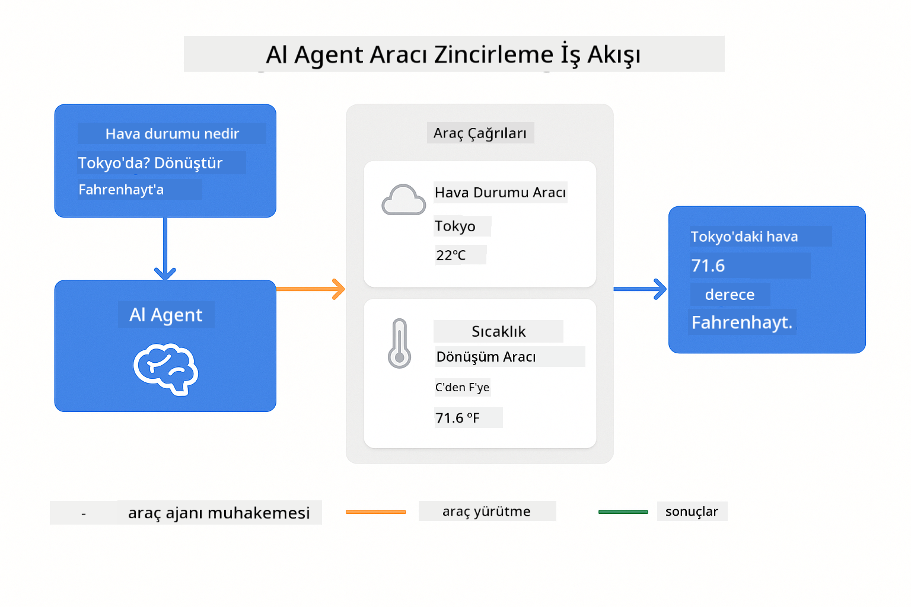
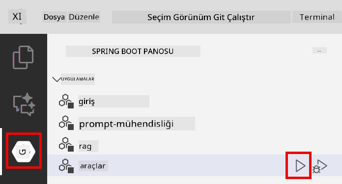
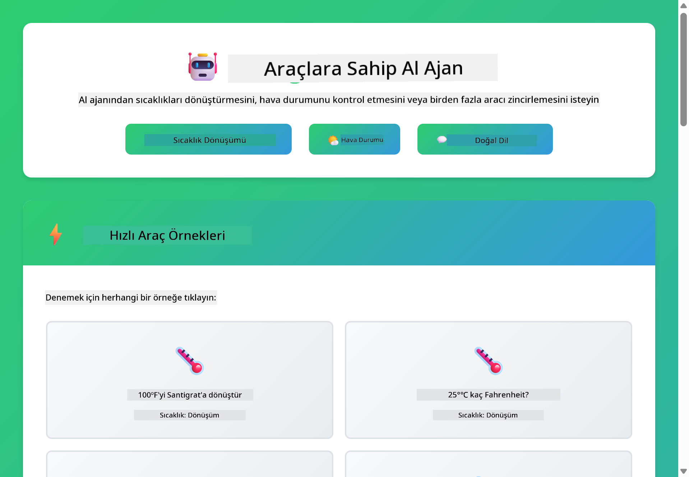
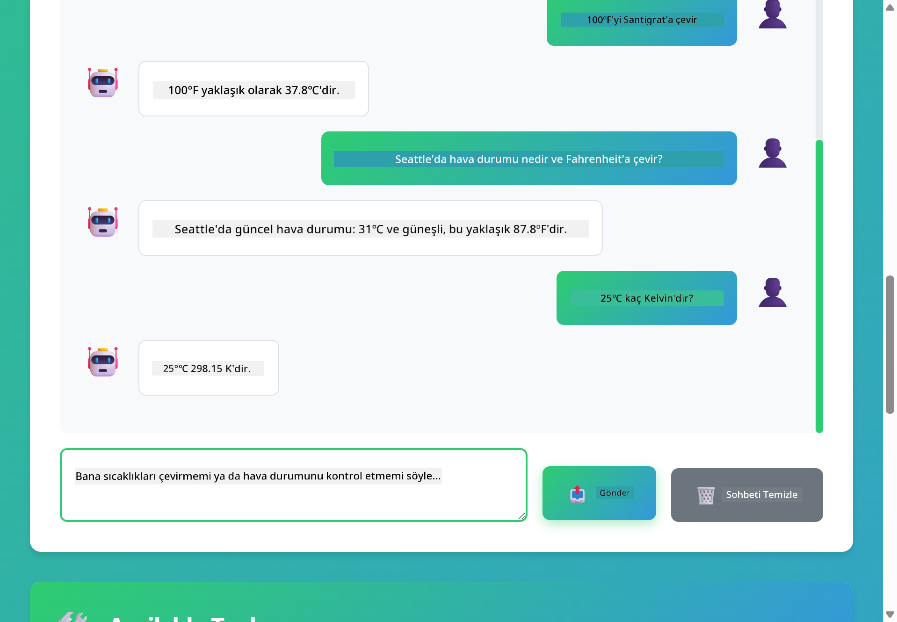

<!--
CO_OP_TRANSLATOR_METADATA:
{
  "original_hash": "844788938b26242f3cc54ce0d0951bea",
  "translation_date": "2026-01-05T23:20:33+00:00",
  "source_file": "04-tools/README.md",
  "language_code": "tr"
}
-->
# Modül 04: Araçlara Sahip Yapay Zeka Ajanları

## İçindekiler

- [Neler Öğreneceksiniz](../../../04-tools)
- [Ön Koşullar](../../../04-tools)
- [Araçlara Sahip Yapay Zeka Ajanlarını Anlamak](../../../04-tools)
- [Araç Çağırma Nasıl Çalışır](../../../04-tools)
  - [Araç Tanımları](../../../04-tools)
  - [Karar Verme](../../../04-tools)
  - [Yürütme](../../../04-tools)
  - [Yanıt Oluşturma](../../../04-tools)
- [Araç Zincirleme](../../../04-tools)
- [Uygulamayı Çalıştır](../../../04-tools)
- [Uygulamayı Kullanma](../../../04-tools)
  - [Basit Araç Kullanımını Deneyin](../../../04-tools)
  - [Araç Zincirlemesini Test Edin](../../../04-tools)
  - [Konuşma Akışını Görüntüleyin](../../../04-tools)
  - [Farklı Taleplerle Deney Yapın](../../../04-tools)
- [Önemli Kavramlar](../../../04-tools)
  - [ReAct Deseni (Muhakeme ve Eylem)](../../../04-tools)
  - [Araç Açıklamaları Önemlidir](../../../04-tools)
  - [Oturum Yönetimi](../../../04-tools)
  - [Hata Yönetimi](../../../04-tools)
- [Mevcut Araçlar](../../../04-tools)
- [Araç Tabanlı Ajanları Ne Zaman Kullanmalı](../../../04-tools)
- [Sonraki Adımlar](../../../04-tools)

## Neler Öğreneceksiniz

Şimdiye kadar, yapay zeka ile nasıl sohbet yapılacağını, istemleri etkili şekilde yapısal hale getirmeyi ve yanıtları belgelerinize dayandırmayı öğrendiniz. Fakat hâlâ temel bir kısıtlama var: dil modelleri yalnızca metin üretebilir. Hava durumunu kontrol edemez, hesaplama yapamaz, veritabanlarını sorgulayamaz veya dış sistemlerle etkileşime geçemezler.

Araçlar bunu değiştirir. Modele çağırabileceği işlevlere erişim vererek, onu sadece metin üreten bir modelden eylemler gerçekleştirebilen bir ajana dönüştürürsünüz. Model ne zaman bir araca ihtiyaç duyduğuna, hangi aracı kullanacağına ve hangi parametreleri geçeceğine karar verir. Kodunuz işlevi yürütür ve sonucu geri döner. Model bu sonucu yanıtına entegre eder.

## Ön Koşullar

- Modül 01 tamamlandı (Azure OpenAI kaynakları dağıtıldı)
- `.env` dosyası ana dizinde Azure kimlik bilgileriyle (Modül 01’de `azd up` ile oluşturuldu)

> **Not:** Eğer Modül 01'i tamamlamadıysanız, önce oradaki dağıtım talimatlarını izleyin.

## Araçlara Sahip Yapay Zeka Ajanlarını Anlamak

> **📝 Not:** Bu modülde "ajanlar" terimi, araç çağırma özellikleri eklenmiş yapay zeka asistanlarını ifade eder. Bu, [Modül 05: MCP](../05-mcp/README.md)’de ele alacağımız **Agentic AI** (planlama, hafıza ve çok adımlı muhakeme içeren otonom ajanlar) desenlerinden farklıdır.

Araçlara sahip yapay zeka ajanı, muhakeme ve eylem desenini (ReAct) takip eder:

1. Kullanıcı bir soru sorar
2. Ajan ne bilmesi gerektiğini muhakeme eder
3. Ajan cevap için araca ihtiyaç duyup duymadığına karar verir
4. Eğer evet ise, uygun aracı doğru parametrelerle çağırır
5. Araç yürütülür ve veri döner
6. Ajan sonucu yanıtına dahil eder ve son cevabı verir


*ReAct deseni - Yapay zeka ajanlarının problem çözmek için muhakeme ile eylem arasında geçiş yapması*

Bu süreç otomatik gerçekleşir. Siz araçları ve açıklamalarını tanımlarsınız. Model ne zaman ve nasıl kullanılacağına karar verir.

## Araç Çağırma Nasıl Çalışır

### Araç Tanımları

[WeatherTool.java](../../../04-tools/src/main/java/com/example/langchain4j/agents/tools/WeatherTool.java) | [TemperatureTool.java](../../../04-tools/src/main/java/com/example/langchain4j/agents/tools/TemperatureTool.java)

İşlevleri net açıklamalar ve parametre spesifikasyonlarıyla tanımlarsınız. Model, sistem isteminde bu açıklamaları görür ve her aracın ne yaptığını anlar.

```java
@Component
public class WeatherTool {
    
    @Tool("Get the current weather for a location")
    public String getCurrentWeather(@P("Location name") String location) {
        // Hava durumu sorgulama mantığınız
        return "Weather in " + location + ": 22°C, cloudy";
    }
}

@AiService
public interface Assistant {
    String chat(@MemoryId String sessionId, @UserMessage String message);
}

// Yardımcı, Spring Boot tarafından otomatik olarak bağlanır:
// - ChatModel bileşeni
// - @Component sınıflarından tüm @Tool yöntemleri
// - Oturum yönetimi için ChatMemoryProvider
```

> **🤖 [GitHub Copilot](https://github.com/features/copilot) Chat ile deneyin:** [`WeatherTool.java`](../../../04-tools/src/main/java/com/example/langchain4j/agents/tools/WeatherTool.java) dosyasını açın ve sorun:
> - "Gerçek bir hava durumu API'si OpenWeatherMap'i sahte veri yerine nasıl entegre ederim?"
> - "Yapay zekanın aracı doğru şekilde kullanmasına yardımcı olan iyi bir araç açıklaması nedir?"
> - "Araç uygulamalarında API hataları ve hız limiti nasıl yönetilir?"

### Karar Verme

Kullanıcı "Seattle'da hava nasıl?" dediğinde model, hava durumu aracına ihtiyaç duyduğunu anlar. Lokasyon parametresi "Seattle" olarak ayarlanmış işlev çağrısı üretir.

### Yürütme

[AgentService.java](../../../04-tools/src/main/java/com/example/langchain4j/agents/service/AgentService.java)

Spring Boot, beyan edilen `@AiService` arayüzünü kayıtlı tüm araçlarla otomatik bağlantılar ve LangChain4j araç çağrılarını otomatik yürütür.

> **🤖 [GitHub Copilot](https://github.com/features/copilot) Chat ile deneyin:** [`AgentService.java`](../../../04-tools/src/main/java/com/example/langchain4j/agents/service/AgentService.java) dosyasını açın ve sorun:
> - "ReAct deseni nasıl çalışır ve yapay zeka ajanları için neden etkilidir?"
> - "Ajan hangi aracı kullanacağına ve hangi sırayla karar verir?"
> - "Araç yürütmesi başarısız olursa ne olur - hataları sağlam şekilde nasıl yönetirim?"

### Yanıt Oluşturma

Model hava durumu verisini alır ve kullanıcı için doğal dil yanıtına dönüştürür.

### Neden Beyan Edilmiş AI Servisleri Kullanılır?

Bu modül, LangChain4j'nin Spring Boot entegrasyonuyla beyan edilen `@AiService` arayüzlerini kullanır:

- **Spring Boot otomatik bağlantısı** - ChatModel ve araçlar otomatik olarak enjekte edilir
- **@MemoryId deseni** - Oturum bazlı otomatik hafıza yönetimi sağlanır
- **Tek örnek** - Asistan bir kere oluşturulup performans için tekrar kullanılır
- **Tip-güvenli yürütme** - Java metodları doğrudan tip dönüşümü ile çağrılır
- **Çok adımlı orkestrasyon** - Araç zincirleme otomatik yönetilir
- **Sıfır hazır kod** - Manuel AiServices.builder() çağrısı veya HashMap gerektirmez

Alternatif yöntemler (manuel `AiServices.builder()`) daha fazla kod gerektirir ve Spring Boot entegrasyon avantajlarını kullanamaz.

## Araç Zincirleme

**Araç Zincirleme** - AI, birden fazla aracı ardışık olarak çağırabilir. "Seattle'da hava nasıl ve şemsiye almalıyım?" diye sorun; `getCurrentWeather` fonksiyonunu yağmur ekipmanı hakkında muhakeme ile zincirlediğini izleyin.

<a href="images/tool-chaining.png"></a>

*Ardışık araç çağrıları - bir aracın çıktısı sonraki karara beslenir*

**Nazik Hatalar** - Sahte veri içinde olmayan bir şehir için hava durumunu sorarsanız, araç hata mesajı döner ve AI yardım edemediğini açıklar. Araçlar güvende başarısız olur.

Bu tek bir sohbet turunda gerçekleşir. Ajan çoklu araç çağrılarını otonom şekilde düzenler.

## Uygulamayı Çalıştır

**Dağıtımı doğrulayın:**

Ana dizinde Azure kimlik bilgileriyle `.env` dosyasının var olduğundan emin olun (Modül 01 sırasında oluşturuldu):
```bash
cat ../.env  # AZURE_OPENAI_ENDPOINT, API_KEY, DEPLOYMENT göstermeli
```

**Uygulamayı başlatın:**

> **Not:** Eğer Modül 01’den tüm uygulamaları `./start-all.sh` komutuyla zaten başlattıysanız, bu modül 8084 portunda zaten çalışıyor. Aşağıdaki başlatma komutlarını atlayıp doğrudan http://localhost:8084 adresine gidebilirsiniz.

**Seçenek 1: Spring Boot Dashboard kullanmak (VS Code kullanıcıları için önerilir)**

Geliştirici konteyneri Spring Boot Dashboard uzantısını içerir. Bu uzantı, tüm Spring Boot uygulamalarını yönetmek için görsel arayüz sağlar. VS Code’un solundaki Etkinlik Çubuğunda (Spring Boot simgesini arayın) bulunur.

Spring Boot Dashboard’dan şu işlemleri yapabilirsiniz:
- Çalışma alanındaki tüm Spring Boot uygulamalarını görün
- Uygulamaları tek tıkla başlat/durdur
- Uygulama günlüklerini gerçek zamanlı izleyin
- Uygulama durumunu takip edin

“tools” yanındaki oynat düğmesine tıklayarak bu modülü başlatabilir veya tüm modülleri birden başlatabilirsiniz.



**Seçenek 2: Komut dosyaları kullanmak**

Tüm web uygulamalarını (modül 01-04) başlatın:

**Bash:**
```bash
cd ..  # Kök dizinden
./start-all.sh
```

**PowerShell:**
```powershell
cd ..  # Kök dizinden
.\start-all.ps1
```

Veya sadece bu modülü başlatın:

**Bash:**
```bash
cd 04-tools
./start.sh
```

**PowerShell:**
```powershell
cd 04-tools
.\start.ps1
```

Her iki betik ana dizindeki `.env` dosyasından ortam değişkenlerini otomatik yükler ve jar dosyaları yoksa oluşturur.

> **Not:** Başlatmadan önce tüm modülleri manuel derlemeyi tercih ederseniz:
>
> **Bash:**
> ```bash
> cd ..  # Go to root directory
> mvn clean package -DskipTests
> ```
>
> **PowerShell:**
> ```powershell
> cd ..  # Go to root directory
> mvn clean package -DskipTests
> ```

Tarayıcınızda http://localhost:8084 adresini açın.

**Durdurmak için:**

**Bash:**
```bash
./stop.sh  # Sadece bu modül
# Veya
cd .. && ./stop-all.sh  # Tüm modüller
```

**PowerShell:**
```powershell
.\stop.ps1  # Bu modül sadece
# Veya
cd ..; .\stop-all.ps1  # Tüm modüller
```


## Uygulamayı Kullanma

Uygulama, hava durumu ve sıcaklık dönüşüm araçlarına erişimi olan bir yapay zeka ajanıyla etkileşim için web arayüzü sunar.

<a href="images/tools-homepage.png"></a>

*Yapay Zeka Ajan Araçları arayüzü - araçlarla etkileşim için hızlı örnekler ve sohbet arayüzü*

### Basit Araç Kullanımını Deneyin

Basit bir taleple başlayın: "100 Fahrenheit dereceyi Santigrata çevir". Ajan sıcaklık dönüşüm aracına ihtiyaç duyduğunu anlar, doğru parametrelerle çağırır ve sonucu döner. Doğal olduğunu fark edin — hangi aracı kullanacağınızı ya da nasıl çağıracağınızı belirtmediniz.

### Araç Zincirlemesini Test Edin

Şimdi daha karmaşık bir şey deneyin: "Seattle’da hava nasıl ve onu Fahrenheit’a çevir?" Ajanın bunu adım adım nasıl yaptığını izleyin. Önce havayı alır (Celsius olarak döner), sonra Fahrenheit’a çevirmesi gerektiğini anlar, dönüşüm aracını çağırır ve her iki sonucu tek yanıt olarak birleştirir.

### Konuşma Akışını Görüntüleyin

Sohbet arayüzü konuşma geçmişini tutar, böylece çok adımlı etkileşimler yapabilirsiniz. Önceki tüm sorguları ve yanıtları görebilir, konuşmanın nasıl geliştiğini ve ajanın bağlamı nasıl oluşturduğunu takip etmek kolaydır.

<a href="images/tools-conversation-demo.png"></a>

*Basit dönüşümler, hava durumu sorgulamaları ve araç zincirlemesi gösteren çok adımlı konuşma*

### Farklı Taleplerle Deney Yapın

Çeşitli kombinasyonlar deneyin:
- Hava durumu sorguları: "Tokyo’da hava nasıl?"
- Sıcaklık dönüşümleri: "25°C kaç Kelvin?"
- Birleşik sorgular: "Paris’te hava durumunu kontrol et ve 20°C’nin üzerinde mi söyle"

Ajanın doğal dili nasıl yorumlayıp uygun araç çağrılarına dönüştürdüğünü fark edin.

## Önemli Kavramlar

### ReAct Deseni (Muhakeme ve Eylem)

Ajan muhakeme (ne yapılacağına karar verme) ve eylem (araçları kullanma) arasında geçiş yapar. Bu desen, sadece talimatlara yanıt vermek yerine otonom problem çözmeyi mümkün kılar.

### Araç Açıklamaları Önemlidir

Araç açıklamalarının kalitesi, ajanın onları ne kadar iyi kullandığını doğrudan etkiler. Net ve spesifik açıklamalar, modelin hangi aracı ne zaman nasıl çağıracağını anlamasına yardımcı olur.

### Oturum Yönetimi

`@MemoryId` açıklaması otomatik oturum bazlı hafıza yönetimini etkinleştirir. Her oturum kimliği, `ChatMemoryProvider` bileşeni tarafından yönetilen kendi `ChatMemory` örneğine sahip olur; bu da manuel hafıza takibine gerek bırakmaz.

### Hata Yönetimi

Araçlar başarısız olabilir - API’ler zaman aşımına uğrayabilir, parametreler geçersiz olabilir, dış servisler kapanabilir. Üretim ajanları, modelin sorunları açıklayabilmesi veya alternatif denemesi için hata yönetimi gerektirir.

## Mevcut Araçlar

**Hava Durumu Araçları** (gösterim için sahte veri):
- Bir konum için güncel hava durumunu al
- Çok günlük tahminler al

**Sıcaklık Dönüşüm Araçları**:
- Santigrat’tan Fahrenheit’a
- Fahrenheit’tan Santigrat’a
- Santigrat’tan Kelvin’e
- Kelvin’den Santigrat’a
- Fahrenheit’tan Kelvin’e
- Kelvin’den Fahrenheit’a

Bunlar basit örneklerdir, ancak desen her türlü işlev için geçerlidir: veritabanı sorguları, API çağrıları, hesaplamalar, dosya işlemleri veya sistem komutları.

## Araç Tabanlı Ajanları Ne Zaman Kullanmalı

**Araçları şu durumlarda kullanın:**
- Gerçek zamanlı verilere ihtiyaç varsa (hava durumu, borsa fiyatları, stok bilgisi)
- Basit matematik dışı hesaplamalar gerekiyor
- Veritabanı veya API erişimi gerektiriyor
- Eylem gerektiriyor (e-posta gönderme, bilet oluşturma, kayıt güncelleme)
- Birden fazla veri kaynağını birleştirmek istiyorsunuz

**Araçları şu durumlarda kullanmayın:**
- Sorular genel bilgilere dayanıyorsa
- Yanıt tamamen sohbet amaçlıysa
- Araç gecikmesi deneyimi çok yavaşlatacaksa

## Sonraki Adımlar

**Sonraki Modül:** [05-mcp - Model Context Protocol (MCP)](../05-mcp/README.md)

---

**Gezinme:** [← Önceki: Modül 03 - RAG](../03-rag/README.md) | [Ana Sayfaya Dön](../README.md) | [Sonraki: Modül 05 - MCP →](../05-mcp/README.md)

---

<!-- CO-OP TRANSLATOR DISCLAIMER START -->
**Feragatname**:  
Bu belge, AI çeviri servisi [Co-op Translator](https://github.com/Azure/co-op-translator) kullanılarak çevrilmiştir. Doğruluk için çaba gösterilse de, otomatik çevirilerin hatalar veya yanlışlıklar içerebileceğini lütfen unutmayınız. Orijinal belge, kendi dilinde otoriter kaynak olarak kabul edilmelidir. Kritik bilgiler için profesyonel insan çevirisi tavsiye edilir. Bu çevirinin kullanılması sonucu oluşabilecek herhangi bir yanlış anlama veya yanlış yorumlamadan sorumlu tutulamayız.
<!-- CO-OP TRANSLATOR DISCLAIMER END -->