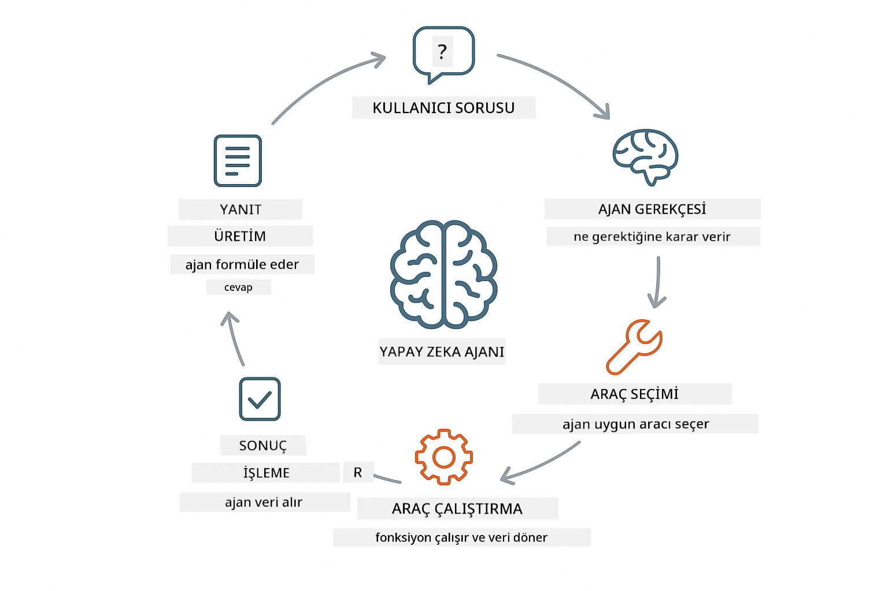

<!--
CO_OP_TRANSLATOR_METADATA:
{
  "original_hash": "aa23f106e7f53270924c9dd39c629004",
  "translation_date": "2025-12-13T18:53:43+00:00",
  "source_file": "04-tools/README.md",
  "language_code": "tr"
}
-->
# Modül 04: Araçlara Sahip Yapay Zeka Ajanları

## İçindekiler

- [Neler Öğreneceksiniz](../../../04-tools)
- [Ön Koşullar](../../../04-tools)
- [Araçlara Sahip Yapay Zeka Ajanlarını Anlamak](../../../04-tools)
- [Araç Çağrısı Nasıl Çalışır](../../../04-tools)
  - [Araç Tanımları](../../../04-tools)
  - [Karar Verme](../../../04-tools)
  - [Yürütme](../../../04-tools)
  - [Yanıt Oluşturma](../../../04-tools)
- [Araç Zincirleme](../../../04-tools)
- [Uygulamayı Çalıştırma](../../../04-tools)
- [Uygulamayı Kullanma](../../../04-tools)
  - [Basit Araç Kullanımını Deneyin](../../../04-tools)
  - [Araç Zincirlemeyi Test Edin](../../../04-tools)
  - [Konuşma Akışını Görün](../../../04-tools)
  - [Muhakemeyi Gözlemleyin](../../../04-tools)
  - [Farklı İsteklerle Deney Yapın](../../../04-tools)
- [Temel Kavramlar](../../../04-tools)
  - [ReAct Deseni (Muhakeme ve Hareket)](../../../04-tools)
  - [Araç Açıklamaları Önemlidir](../../../04-tools)
  - [Oturum Yönetimi](../../../04-tools)
  - [Hata Yönetimi](../../../04-tools)
- [Mevcut Araçlar](../../../04-tools)
- [Araç Tabanlı Ajanlar Ne Zaman Kullanılır](../../../04-tools)
- [Sonraki Adımlar](../../../04-tools)

## Neler Öğreneceksiniz

Şimdiye kadar, yapay zeka ile nasıl sohbet edileceğini, istemleri etkili şekilde nasıl yapılandıracağınızı ve yanıtları belgelerinizle nasıl ilişkilendireceğinizi öğrendiniz. Ancak hâlâ temel bir sınırlama var: dil modelleri sadece metin üretebilir. Hava durumunu kontrol edemez, hesaplama yapamaz, veritabanlarını sorgulayamaz veya dış sistemlerle etkileşime giremezler.

Araçlar bunu değiştirir. Modele çağırabileceği fonksiyonlara erişim vererek, onu bir metin üreticisinden eylem alabilen bir ajana dönüştürürsünüz. Model ne zaman araca ihtiyacı olduğunu, hangi aracı kullanacağını ve hangi parametreleri geçeceğini belirler. Kodunuz fonksiyonu çalıştırır ve sonucu döner. Model bu sonucu yanıtına dahil eder.

## Ön Koşullar

- Modül 01 tamamlandı (Azure OpenAI kaynakları dağıtıldı)
- Kök dizinde Azure kimlik bilgileri içeren `.env` dosyası (Modül 01'de `azd up` ile oluşturuldu)

> **Not:** Modül 01'i tamamlamadıysanız, önce oradaki dağıtım talimatlarını izleyin.

## Araçlara Sahip Yapay Zeka Ajanlarını Anlamak

Araçlara sahip bir yapay zeka ajanı, muhakeme ve hareket etme desenini (ReAct) takip eder:

1. Kullanıcı bir soru sorar
2. Ajan ne bilmesi gerektiği hakkında muhakeme yapar
3. Ajan cevap için araca ihtiyacı olup olmadığına karar verir
4. Eğer evet ise, uygun aracı doğru parametrelerle çağırır
5. Araç çalışır ve veri döner
6. Ajan sonucu yanıtına dahil eder ve nihai cevabı verir



*ReAct deseni - yapay zeka ajanlarının problemleri çözmek için muhakeme ve hareket arasında nasıl geçiş yaptığı*

Bu otomatik gerçekleşir. Siz araçları ve açıklamalarını tanımlarsınız. Model ne zaman ve nasıl kullanacağına karar verir.

## Araç Çağrısı Nasıl Çalışır

**Araç Tanımları** - [WeatherTool.java](../../../04-tools/src/main/java/com/example/langchain4j/agents/tools/WeatherTool.java) | [TemperatureTool.java](../../../04-tools/src/main/java/com/example/langchain4j/agents/tools/TemperatureTool.java)

Açık açıklamalar ve parametre tanımlarıyla fonksiyonlar tanımlarsınız. Model bu açıklamaları sistem isteminde görür ve her aracın ne yaptığını anlar.

```java
@Component
public class WeatherTool {
    
    @Tool("Get the current weather for a location")
    public String getCurrentWeather(@P("Location name") String location) {
        // Hava durumu sorgulama mantığınız
        return "Weather in " + location + ": 22°C, cloudy";
    }
}

@AiService
public interface Assistant {
    String chat(@MemoryId String sessionId, @UserMessage String message);
}

// Asistan Spring Boot tarafından otomatik olarak şu şekilde bağlanır:
// - ChatModel bean'i
// - @Component sınıflarından tüm @Tool metodları
// - Oturum yönetimi için ChatMemoryProvider
```

> **🤖 [GitHub Copilot](https://github.com/features/copilot) Chat ile deneyin:** [`WeatherTool.java`](../../../04-tools/src/main/java/com/example/langchain4j/agents/tools/WeatherTool.java) dosyasını açın ve sorun:
> - "Gerçek bir hava durumu API'si (OpenWeatherMap gibi) nasıl entegre edilir, sahte veriler yerine?"
> - "Yapay zekanın doğru kullanmasını sağlayan iyi bir araç açıklaması nasıl olmalı?"
> - "Araç uygulamalarında API hataları ve hız sınırları nasıl yönetilir?"

**Karar Verme**

Kullanıcı "Seattle'da hava durumu nasıl?" diye sorduğunda, model hava durumu aracına ihtiyacı olduğunu anlar. Konum parametresi "Seattle" olarak ayarlanmış bir fonksiyon çağrısı üretir.

**Yürütme** - [AgentService.java](../../../04-tools/src/main/java/com/example/langchain4j/agents/service/AgentService.java)

Spring Boot, bildirisel `@AiService` arayüzünü kayıtlı tüm araçlarla otomatik olarak bağlar ve LangChain4j araç çağrılarını otomatik yürütür.

> **🤖 [GitHub Copilot](https://github.com/features/copilot) Chat ile deneyin:** [`AgentService.java`](../../../04-tools/src/main/java/com/example/langchain4j/agents/service/AgentService.java) dosyasını açın ve sorun:
> - "ReAct deseni nasıl çalışır ve yapay zeka ajanları için neden etkilidir?"
> - "Ajan hangi aracı kullanacağına ve hangi sırayla karar verir?"
> - "Bir araç yürütmesi başarısız olursa ne olur - hataları sağlam şekilde nasıl yönetmeliyim?"

**Yanıt Oluşturma**

Model hava durumu verisini alır ve kullanıcı için doğal dil yanıtı olarak biçimlendirir.

### Neden Bildirisel AI Servisleri Kullanılır?

Bu modül, LangChain4j'nin Spring Boot entegrasyonunu bildirisel `@AiService` arayüzleri ile kullanır:

- **Spring Boot otomatik bağlama** - ChatModel ve araçlar otomatik enjekte edilir
- **@MemoryId deseni** - Oturum bazlı otomatik bellek yönetimi
- **Tek örnek** - Asistan bir kez oluşturulur ve performans için tekrar kullanılır
- **Tip güvenli yürütme** - Java metodları doğrudan tip dönüşümü ile çağrılır
- **Çok adımlı orkestrasyon** - Araç zincirlemeyi otomatik yönetir
- **Sıfır gereksiz kod** - Elle AiServices.builder() çağrısı veya bellek HashMap gerekmez

Alternatif yaklaşımlar (manuel `AiServices.builder()`) daha fazla kod gerektirir ve Spring Boot entegrasyon avantajlarını kaçırır.

## Araç Zincirleme

**Araç Zincirleme** - Yapay zeka birden fazla aracı sırayla çağırabilir. "Seattle'da hava durumu nasıl ve şemsiye getirmeli miyim?" diye sorun ve `getCurrentWeather` çağrısını yağmur ekipmanı hakkında muhakeme ile zincirlediğini izleyin.

<a href="images/tool-chaining.png"></a>

*Ardışık araç çağrıları - bir aracın çıktısı sonraki karara beslenir*

**Zarif Hatalar** - Sahte veride olmayan bir şehir için hava durumu isteyin. Araç hata mesajı döner ve yapay zeka yardım edemeyeceğini açıklar. Araçlar güvenli şekilde başarısız olur.

Bu tek bir konuşma turunda olur. Ajan birden fazla araç çağrısını kendi başına yönetir.

## Uygulamayı Çalıştırma

**Dağıtımı doğrulayın:**

Kök dizinde Azure kimlik bilgileri içeren `.env` dosyasının var olduğundan emin olun (Modül 01 sırasında oluşturuldu):
```bash
cat ../.env  # AZURE_OPENAI_ENDPOINT, API_KEY, DEPLOYMENT göstermeli
```

**Uygulamayı başlatın:**

> **Not:** Modül 01'de `./start-all.sh` ile tüm uygulamaları zaten başlattıysanız, bu modül 8084 portunda zaten çalışıyor. Aşağıdaki başlatma komutlarını atlayabilir ve doğrudan http://localhost:8084 adresine gidebilirsiniz.

**Seçenek 1: Spring Boot Dashboard kullanımı (VS Code kullanıcıları için önerilir)**

Geliştirme konteyneri, tüm Spring Boot uygulamalarını yönetmek için görsel arayüz sağlayan Spring Boot Dashboard uzantısını içerir. VS Code'un solundaki Aktivite Çubuğunda (Spring Boot simgesine bakın) bulabilirsiniz.

Spring Boot Dashboard'dan:
- Çalışma alanındaki tüm Spring Boot uygulamalarını görebilirsiniz
- Uygulamaları tek tıkla başlatabilir/durdurabilirsiniz
- Uygulama günlüklerini gerçek zamanlı izleyebilirsiniz
- Uygulama durumunu takip edebilirsiniz

"tools" yanındaki oynat düğmesine tıklayarak bu modülü başlatın veya tüm modülleri aynı anda başlatın.


**Seçenek 2: Shell betikleri kullanımı**

Tüm web uygulamalarını başlatın (modüller 01-04):

**Bash:**
```bash
cd ..  # Kök dizinden
./start-all.sh
```

**PowerShell:**
```powershell
cd ..  # Kök dizinden
.\start-all.ps1
```

Ya da sadece bu modülü başlatın:

**Bash:**
```bash
cd 04-tools
./start.sh
```

**PowerShell:**
```powershell
cd 04-tools
.\start.ps1
```

Her iki betik de kök `.env` dosyasından ortam değişkenlerini otomatik yükler ve JAR dosyaları yoksa oluşturur.

> **Not:** Başlatmadan önce tüm modülleri manuel derlemeyi tercih ederseniz:
>
> **Bash:**
> ```bash
> cd ..  # Go to root directory
> mvn clean package -DskipTests
> ```
>
> **PowerShell:**
> ```powershell
> cd ..  # Go to root directory
> mvn clean package -DskipTests
> ```

Tarayıcınızda http://localhost:8084 adresini açın.

**Durdurmak için:**

**Bash:**
```bash
./stop.sh  # Sadece bu modül
# Veya
cd .. && ./stop-all.sh  # Tüm modüller
```

**PowerShell:**
```powershell
.\stop.ps1  # Sadece bu modül
# Veya
cd ..; .\stop-all.ps1  # Tüm modüller
```

## Uygulamayı Kullanma

Uygulama, hava durumu ve sıcaklık dönüşüm araçlarına erişimi olan bir yapay zeka ajanıyla etkileşim kurabileceğiniz web arayüzü sağlar.

<a href="images/tools-homepage.png"></a>

*Yapay Zeka Ajanı Araçları arayüzü - araçlarla etkileşim için hızlı örnekler ve sohbet arayüzü*

**Basit Araç Kullanımını Deneyin**

"100 derece Fahrenheit'i Santigrat'a çevir" gibi basit bir istekle başlayın. Ajan sıcaklık dönüşüm aracına ihtiyacı olduğunu anlar, doğru parametrelerle çağırır ve sonucu döner. Ne kadar doğal hissettirdiğine dikkat edin - hangi aracı kullanacağınızı veya nasıl çağıracağınızı belirtmediniz.

**Araç Zincirlemeyi Test Edin**

Şimdi daha karmaşık bir şey deneyin: "Seattle'da hava durumu nasıl ve bunu Fahrenheit'e çevir?" Ajanın bunu adım adım nasıl çözdüğünü izleyin. Önce hava durumunu alır (Santigrat döner), Fahrenheit'e çevirmesi gerektiğini anlar, dönüşüm aracını çağırır ve her iki sonucu tek bir yanıtta birleştirir.

**Konuşma Akışını Görün**

Sohbet arayüzü konuşma geçmişini tutar, çok adımlı etkileşimlere izin verir. Önceki tüm sorguları ve yanıtları görebilir, konuşmayı takip etmek ve ajanın bağlamı nasıl oluşturduğunu anlamak kolaylaşır.

<a href="images/tools-conversation-demo.png"></a>

*Basit dönüşümler, hava durumu sorguları ve araç zincirlemesini gösteren çok adımlı konuşma*

**Farklı İsteklerle Deney Yapın**

Çeşitli kombinasyonları deneyin:
- Hava durumu sorguları: "Tokyo'da hava nasıl?"
- Sıcaklık dönüşümleri: "25°C kaç Kelvin?"
- Birleşik sorgular: "Paris'te hava durumunu kontrol et ve 20°C'nin üzerinde olup olmadığını söyle"

Ajanın doğal dili nasıl yorumlayıp uygun araç çağrılarına dönüştürdüğüne dikkat edin.

## Temel Kavramlar

**ReAct Deseni (Muhakeme ve Hareket)**

Ajan, muhakeme (ne yapılacağına karar verme) ve hareket (araç kullanma) arasında geçiş yapar. Bu desen, sadece talimatlara yanıt vermek yerine otonom problem çözmeyi sağlar.

**Araç Açıklamaları Önemlidir**

Araç açıklamalarınızın kalitesi, ajanın onları ne kadar iyi kullandığını doğrudan etkiler. Açık ve spesifik açıklamalar modelin ne zaman ve nasıl çağıracağını anlamasına yardımcı olur.

**Oturum Yönetimi**

`@MemoryId` notasyonu, otomatik oturum bazlı bellek yönetimini etkinleştirir. Her oturum kimliği için `ChatMemory` örneği `ChatMemoryProvider` bean tarafından yönetilir, elle bellek takibi gerekmez.

**Hata Yönetimi**

Araçlar başarısız olabilir - API zaman aşımı, geçersiz parametreler, dış servislerin kapanması gibi. Üretim ajanları, modelin sorunları açıklayabilmesi veya alternatifler deneyebilmesi için hata yönetimine ihtiyaç duyar.

## Mevcut Araçlar

**Hava Durumu Araçları** (gösterim için sahte veri):
- Bir konum için güncel hava durumu al
- Çok günlük hava tahmini al

**Sıcaklık Dönüşüm Araçları**:
- Santigrat'tan Fahrenheit'e
- Fahrenheit'ten Santigrat'a
- Santigrat'tan Kelvin'e
- Kelvin'den Santigrat'a
- Fahrenheit'ten Kelvin'e
- Kelvin'den Fahrenheit'e

Bunlar basit örneklerdir, ancak desen herhangi bir fonksiyona genişletilebilir: veritabanı sorguları, API çağrıları, hesaplamalar, dosya işlemleri veya sistem komutları.

## Araç Tabanlı Ajanlar Ne Zaman Kullanılır

**Araçları kullanın:**
- Gerçek zamanlı veri gerektiren cevaplar (hava durumu, hisse fiyatları, envanter)
- Basit matematik dışı hesaplamalar yapmanız gerektiğinde
- Veritabanlarına veya API'lere erişirken
- Eylem alırken (e-posta gönderme, bilet oluşturma, kayıt güncelleme)
- Birden fazla veri kaynağını birleştirirken

**Araçları kullanmayın:**
- Sorular genel bilgiyle cevaplanabiliyorsa
- Yanıt tamamen sohbet amaçlıysa
- Araç gecikmesi deneyimi çok yavaşlatacaksa

## Sonraki Adımlar

**Sonraki Modül:** [05-mcp - Model Context Protocol (MCP)](../05-mcp/README.md)

---

**Gezinme:** [← Önceki: Modül 03 - RAG](../03-rag/README.md) | [Ana Sayfaya Dön](../README.md) | [Sonraki: Modül 05 - MCP →](../05-mcp/README.md)

---

<!-- CO-OP TRANSLATOR DISCLAIMER START -->
**Feragatname**:  
Bu belge, AI çeviri servisi [Co-op Translator](https://github.com/Azure/co-op-translator) kullanılarak çevrilmiştir. Doğruluk için çaba gösterilse de, otomatik çevirilerin hatalar veya yanlışlıklar içerebileceğini lütfen unutmayınız. Orijinal belge, kendi dilinde yetkili kaynak olarak kabul edilmelidir. Kritik bilgiler için profesyonel insan çevirisi önerilir. Bu çevirinin kullanımı sonucu oluşabilecek yanlış anlamalar veya yorum hatalarından sorumlu değiliz.
<!-- CO-OP TRANSLATOR DISCLAIMER END -->