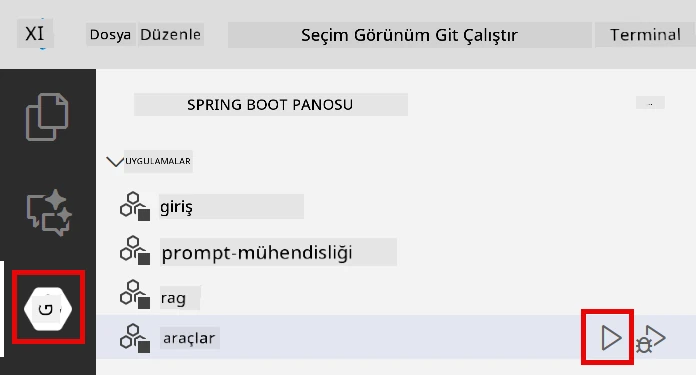
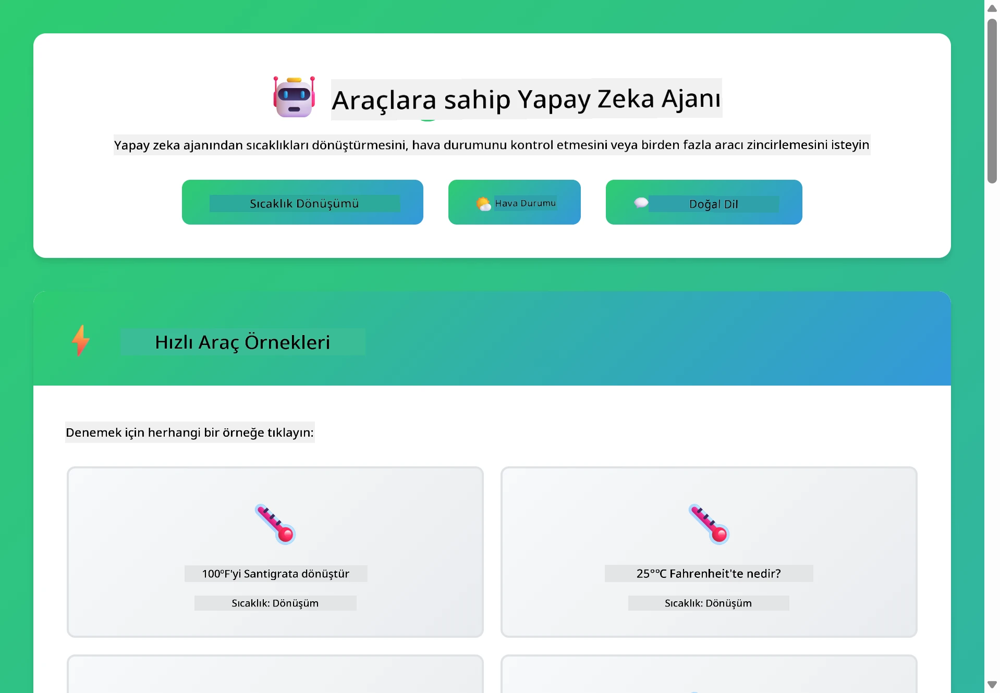
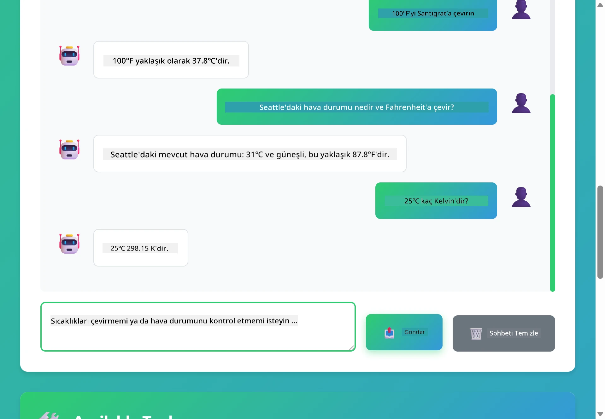

# Modül 04: Araçlarla AI Ajanları

## İçindekiler

- [Video Yürütme](#video-yürütme)
- [Neler Öğreneceksiniz](#neler-öğreneceksiniz)
- [Önkoşullar](#önkoşullar)
- [Araçlarla AI Ajanlarını Anlamak](#araçlarla-ai-ajanlarını-anlamak)
- [Araç Çağrısı Nasıl Çalışır](#araç-çağrısı-nasıl-çalışır)
  - [Araç Tanımları](#araç-tanımları)
  - [Karar Verme](#karar-verme)
  - [Uygulama](#uygulama)
  - [Yanıt Oluşturma](#yanıt-oluşturma)
  - [Mimari: Spring Boot Otomatik Bağlama](#mimari-spring-boot-otomatik-bağlama)
- [Araç Zincirleme](#araç-zincirleme)
- [Uygulamayı Çalıştırma](#uygulamayı-çalıştırma)
- [Uygulamayı Kullanma](#uygulamanın-kullanımı)
  - [Basit Araç Kullanmayı Deneyin](#basit-araç-kullanımını-deneyin)
  - [Araç Zincirlemeyi Test Edin](#araç-zincirleme-testi)
  - [Konuşma Akışını Görün](#konuşma-akışını-görün)
  - [Farklı İsteklerle Deney Yapın](#farklı-i̇steklerle-deneyler-yapın)
- [Anahtar Kavramlar](#temel-kavramlar)
  - [ReAct Deseni (Mantık Yürütme ve Hareket Etme)](#react-deseni-akıl-yürütme-ve-hareket-etme)
  - [Araç Tanımları Önemlidir](#araç-açıklamaları-önemlidir)
  - [Oturum Yönetimi](#oturum-yönetimi)
  - [Hata Yönetimi](#hata-yönetimi)
- [Mevcut Araçlar](#mevcut-araçlar)
- [Araç Tabanlı Ajanları Ne Zaman Kullanmalı](#araç-tabanlı-ajanları-ne-zaman-kullanmalı)
- [Araçlar ve RAG Karşılaştırması](#araçlar-ve-rag)
- [Sonraki Adımlar](#sonraki-adımlar)

## Video Yürütme

Bu modüle nasıl başlayacağınızı açıklayan canlı oturumu izleyin:

<a href="https://www.youtube.com/watch?v=O_J30kZc0rw"></a>

## Neler Öğreneceksiniz

Şu ana kadar AI ile nasıl sohbet edileceğini, istemleri etkili bir şekilde yapılandırmayı ve yanıtları belgelerinizle nasıl temel alacağınızı öğrendiniz. Ancak temel bir sınırlama hâlâ var: dil modelleri yalnızca metin üretebilir. Hava durumunu kontrol edemez, hesaplama yapamaz, veri tabanlarını sorgulayamaz veya dış sistemlerle etkileşimde bulunamazlar.

Araçlar bunu değiştirir. Modele çağırabileceği fonksiyonlara erişim vererek, onu bir metin üreteci olmaktan, eylem yapabilen bir ajan haline dönüştürürsünüz. Model, ne zaman araca ihtiyacı olduğunu, hangi aracı kullanacağını ve hangi parametreleri geçeceğini karar verir. Kodunuz fonksiyonu uygular ve sonucu döner. Model, sonucu yanıtına dahil eder.

## Önkoşullar

- [Modül 01 - Giriş](../01-introduction/README.md) tamamlandı (Azure OpenAI kaynakları dağıtıldı)
- Önceki modüllerin tamamlanması önerilir (bu modül, Araçlar ve RAG karşılaştırmasında [Modül 03'ten RAG kavramlarını](../03-rag/README.md) referans alır)
- Azure kimlik bilgileri içeren kök dizinde `.env` dosyası (Modül 01'de `azd up` ile oluşturuldu)

> **Not:** Eğer Modül 01'i tamamlamadıysanız, önce oradaki dağıtım talimatlarını izleyin.

## Araçlarla AI Ajanlarını Anlamak

> **📝 Not:** Bu modüldeki "ajanlar" terimi, araç çağırma yetenekleriyle geliştirilmiş AI asistanlarını ifade eder. Bu, [Modül 05: MCP](../05-mcp/README.md)'de ele alacağımız **Otonom AI** desenlerinden (planlama, hafıza ve çok adımlı akıl yürütme içeren otonom ajanlar) farklıdır.

Araçlar olmadan, dil modeli yalnızca eğitim verisinden metin üretebilir. Mevcut hava durumunu sorarsanız, tahminde bulunmak zorunda kalır. Araçlar verirseniz, hava durumu API’si çağırabilir, hesaplama yapabilir veya veri tabanı sorgulayabilir — ve bu gerçek sonuçları yanıtına dahil edebilir.


*Araçlar olmadan model sadece tahmin eder — araçlarla API’leri çağırabilir, hesaplama yapabilir ve gerçek zamanlı veri sunabilir.*

Araçlara sahip bir AI ajanı **Mantık Yürütme ve Hareket Etme (ReAct)** desenini takip eder. Model sadece yanıt vermez — neye ihtiyacı olduğunu düşünür, bir araç çağırarak eyleme geçer, sonucu gözlemler ve ardından tekrar hareket edip etmeyeceğine ya da nihai yanıtı vereceğine karar verir:

1. **Düşün** — Ajan kullanıcının sorusunu analiz eder ve hangi bilgilere ihtiyacı olduğunu belirler
2. **Hareket Et** — Ajan doğru aracı seçer, uygun parametreleri oluşturur ve çağırır
3. **Gözle** — Ajan aracın çıktısını alır ve sonucu değerlendirir
4. **Tekrarla veya Yanıtla** — Daha fazla veriye gerek varsa döngüye devam eder; yoksa doğal dil yanıtı oluşturur


*ReAct döngüsü — ajan ne yapması gerektiğini düşünür, bir araç çağırarak hareket eder, sonucu gözlemler ve nihai yanıtı verebilene kadar döngü yapar.*

Bu otomatik gerçekleşir. Siz araçları ve açıklamalarını tanımlarsınız. Model, ne zaman ve nasıl kullanılacağına karar verir.

## Araç Çağrısı Nasıl Çalışır

### Araç Tanımları

[WeatherTool.java](../../../04-tools/src/main/java/com/example/langchain4j/agents/tools/WeatherTool.java) | [TemperatureTool.java](../../../04-tools/src/main/java/com/example/langchain4j/agents/tools/TemperatureTool.java)

Fonksiyonları net açıklamalar ve parametre tanımlarıyla belirtirsiniz. Model, sistem isteminde bu açıklamaları görür ve her aracın ne yaptığını anlar.

```java
@Component
public class WeatherTool {
    
    @Tool("Get the current weather for a location")
    public String getCurrentWeather(@P("Location name") String location) {
        // Hava durumu sorgulama mantığınız
        return "Weather in " + location + ": 22°C, cloudy";
    }
}

@AiService
public interface Assistant {
    String chat(@MemoryId String sessionId, @UserMessage String message);
}

// Asistan, Spring Boot tarafından otomatik olarak yapılandırılır:
// - ChatModel bileşeni
// - @Component sınıflarından tüm @Tool yöntemleri
// - Oturum yönetimi için ChatMemoryProvider
```

Aşağıdaki diyagram her açıklamayı detaylandırır ve her parçanın AI’nın ne zaman aracı çağırması gerektiğini ve hangi argümanları kullanacağını nasıl anladığını gösterir:


*Araç tanımının anatomisi — @Tool AI’ya ne zaman kullanacağını söyler, @P her parametreyi açıklar, ve @AiService her şeyi başlangıçta bağlar.*

> **🤖 [GitHub Copilot](https://github.com/features/copilot) Chat ile deneyin:** [`WeatherTool.java`](../../../04-tools/src/main/java/com/example/langchain4j/agents/tools/WeatherTool.java) dosyasını açın ve sorun:
> - "Sahte veri yerine gerçek hava durumu API'si OpenWeatherMap‘i nasıl entegre ederim?"
> - "AI’nın aracı doğru kullanmasını sağlayan iyi bir araç tanımı nasıl olur?"
> - "Araç uygulamalarında API hatalarını ve hız sınırlarını nasıl yönetirim?"

### Karar Verme

Kullanıcı "Seattle’de hava nasıl?" diye sorduğunda model rastgele bir araç seçmez. Kullanıcının niyetini sahip olduğu her araç açıklaması ile karşılaştırır, her birini ilgisine göre puanlar ve en iyi eşleşeni seçer. Ardından doğru parametrelerle yapılandırılmış fonksiyon çağrısı oluşturur — burada `location` değerini `"Seattle"` olarak ayarlar.

Eğer kullanıcının isteğine uyan araç yoksa, model kendi bilgisiyle cevap verir. Birden çok araç uygunsa en spesifik olanı seçer.


*Model, her aracı kullanıcının niyetiyle değerlendirir ve en uygun olanı seçer — bu yüzden net ve spesifik araç açıklamaları yazmak önemlidir.*

### Uygulama

[AgentService.java](../../../04-tools/src/main/java/com/example/langchain4j/agents/service/AgentService.java)

Spring Boot, deklaratif `@AiService` arayüzünü tüm kayıtlı araçlarla otomatik bağlar ve LangChain4j araç çağrılarını otomatik olarak yürütür. Sahnenin arkasında eksiksiz bir araç çağrısı altı aşamadan geçer — kullanıcının doğal dil sorusundan doğal dile yanıt oluşturulana kadar:


*Uçtan uca akış — kullanıcı soru sorar, model araç seçer, LangChain4j aracı uygular ve model sonucu doğal yanıtına ekler.*

Sahnenin arkasında `AiServices` herhangi bir araç için aynı araç çağrısı döngüsünü yürütür — burada basit bir `Calculator` örneği ile gösterilmiştir. Aşağıdaki sıra diyagramı tam olarak neler olduğunu gösteriyor:


*Araç çağrısı döngüsü — `AiServices` mesajınızı ve araç şemalarını LLM’ye gönderir, LLM `add(42, 58)` gibi fonksiyon çağrısı yapar, LangChain4j `Calculator` metodunu yerel olarak çalıştırır ve sonucu nihai yanıt için geri besler.*

> **🤖 [GitHub Copilot](https://github.com/features/copilot) Chat ile deneyin:** [`AgentService.java`](../../../04-tools/src/main/java/com/example/langchain4j/agents/service/AgentService.java) dosyasını açın ve sorun:
> - "ReAct deseni nasıl çalışır ve neden AI ajanları için etkilidir?"
> - "Ajan hangi aracı kullanacağına ve hangi sırayla karar verir?"
> - "Bir araç çalıştırma başarısız olursa ne olur - hataları sağlam şekilde nasıl yönetirim?"

### Yanıt Oluşturma

Model hava durumu verilerini alır ve kullanıcı için doğal dil yanıtı olarak biçimlendirir.

### Mimari: Spring Boot Otomatik Bağlama

Bu modül, LangChain4j’nin deklaratif `@AiService` arayüzleriyle Spring Boot entegrasyonunu kullanır. Başlangıçta Spring Boot, `@Tool` metodları içeren tüm `@Component`'leri, ChatModel bean’inizi ve ChatMemoryProvider’ı keşfeder — sonra bunların hepsini sıfır kuvvetli kodla tek bir `Assistant` arayüzüne bağlar.


*@AiService arayüzü ChatModel, araç bileşenleri ve hafıza sağlayıcıyı bir araya getirir — Spring Boot tüm bağlantıları otomatik yapar.*

İşte HTTP isteğinden kontrolör, servis ve otomatik bağlanan vekile, oradan da araç yürütmeye ve geri dönüşe kadar tam istek yaşam döngüsünün sıra diyagramı:


*Tam Spring Boot istek yaşam döngüsü — HTTP isteği kontrolör ve servis üzerinden otomatik bağlanan Assistant vekiline akar, o da LLM ve araç çağrılarını otomatik organize eder.*

Bu yaklaşımın temel faydaları:

- **Spring Boot otomatik bağlama** — ChatModel ve araçlar otomatik olarak enjekte edilir
- **@MemoryId deseni** — Oturum bazlı hafıza yönetimi otomatik
- **Tek örnek** — Assistant bir kez oluşturulur ve performans için tekrar kullanılır
- **Tip-güvenli yürütme** — Java metodları doğrudan tür dönüşümüyle çağrılır
- **Çok turlu orkestrasyon** — Araç zincirleme otomatik yönetilir
- **Sıfır kuvvetli kod** — Elle `AiServices.builder()` çağrısı veya hafıza HashMap yok

Alternatif yaklaşımlar (manuel `AiServices.builder()`) daha fazla kod gerektirir ve Spring Boot entegrasyon avantajlarını kaçırır.

## Araç Zincirleme

**Araç Zincirleme** — Araç tabanlı ajanların gerçek gücü, tek bir sorunun birden fazla araç gerektirdiği durumlarda ortaya çıkar. "Seattle’de hava Fahrenheit cinsinden nasıl?" diye sorarsanız ajan otomatik olarak iki aracı birleştirir: önce `getCurrentWeather` ile Santigrat cinsinden sıcaklığı alır, sonra o değeri `celsiusToFahrenheit` aracına aktarır — hepsi tek bir konuşma turunda.


*Araç zincirleme uygulamada — ajan önce getCurrentWeather çağırır, sonra Santigrat sonucunu celsiusToFahrenheit’e geçirir ve birleşik yanıtı verir.*

**Sıkıntısız Hatalar** — Sahte veride olmayan bir şehir için hava talep edin. Araç hata mesajı döner ve AI çözemediğini zarifçe açıklar, çökmez. Araçlar güvenli şekilde hata yapar. Aşağıdaki diyagram iki yaklaşımı karşılaştırır — düzgün hata yönetiminde ajan istisnayı yakalar ve yardımcı yanıt verir; yönetmeseydi uygulama tamamen çökebilirdi:


*Bir araç başarısız olduğunda ajan hatayı yakalar ve çökme yerine yardımcı bir açıklama yapar.*

Bu tek bir konuşma turunda olur. Ajan birden fazla araç çağrısını otonom şekilde yönetir.

## Uygulamayı Çalıştırma

**Dağıtımı doğrulayın:**

Modül 01 sırasında oluşturulan Azure kimlik bilgileri içeren `.env` dosyasının kök dizinde olduğundan emin olun. Bunu modül dizininden çalıştırın (`04-tools/`):

**Bash:**
```bash
cat ../.env  # AZURE_OPENAI_ENDPOINT, API_KEY, DEPLOYMENT göstermeli
```

**PowerShell:**
```powershell
Get-Content ..\.env  # AZURE_OPENAI_ENDPOINT, API_KEY, DEPLOYMENT göstermeli
```

**Uygulamayı başlatın:**

> **Not:** Eğer zaten kök dizinden `./start-all.sh` ile tüm uygulamaları başlattıysanız (Modül 01’de anlatıldığı gibi), bu modül zaten 8084 portunda çalışıyor. Aşağıdaki başlatma komutlarını atlayabilir ve doğrudan http://localhost:8084 adresine gidebilirsiniz.

**Seçenek 1: Spring Boot Dashboard ile Kullanım (VS Code kullanıcıları için önerilir)**

Geliştirme konteyneri, tüm Spring Boot uygulamalarını görsel olarak yönetmenizi sağlayan Spring Boot Dashboard uzantısını içerir. Bunu VS Code’un solundaki Etkinlik Çubuğu’nda (Spring Boot simgesine bakın) bulabilirsiniz.

Spring Boot Dashboard’dan şunları yapabilirsiniz:
- Çalışma alanındaki tüm kullanılabilir Spring Boot uygulamalarını görün
- Uygulamaları tek tıkla başlat/durdur
- Uygulama günlüklerini gerçek zamanlı görüntüle
- Uygulama durumunu izleyin

"tools" yanındaki oynat düğmesine tıklayarak bu modülü başlatabilir veya tüm modülleri aynı anda başlatabilirsiniz.

İşte VS Code’da Spring Boot Dashboard’ın görünümü:


*VS Code'daki Spring Boot Kontrol Paneli — tüm modülleri tek yerden başlatın, durdurun ve izleyin*

**Seçenek 2: Shell scriptleri kullanmak**

Tüm web uygulamalarını başlatın (modüller 01-04):

**Bash:**
```bash
cd ..  # Kök dizinden
./start-all.sh
```

**PowerShell:**
```powershell
cd ..  # Kök dizinden
.\start-all.ps1
```

Ya da sadece bu modülü başlatın:

**Bash:**
```bash
cd 04-tools
./start.sh
```

**PowerShell:**
```powershell
cd 04-tools
.\start.ps1
```

Her iki script de kök `.env` dosyasından ortam değişkenlerini otomatik olarak yükler ve JAR dosyaları yoksa oluşturur.

> **Not:** Başlatmadan önce tüm modülleri manuel olarak derlemeyi tercih ederseniz:
>
> **Bash:**
> ```bash
> cd ..  # Go to root directory
> mvn clean package -DskipTests
> ```

> **PowerShell:**
> ```powershell
> cd ..  # Go to root directory
> mvn clean package -DskipTests
> ```

Tarayıcınızda http://localhost:8084 adresini açın.

**Durdurmak için:**

**Bash:**
```bash
./stop.sh  # Bu modül sadece
# Veya
cd .. && ./stop-all.sh  # Tüm modüller
```

**PowerShell:**
```powershell
.\stop.ps1  # Bu modül yalnızca
# Veya
cd ..; .\stop-all.ps1  # Tüm modüller
```

## Uygulamanın Kullanımı

Uygulama, hava durumu ve sıcaklık dönüşümü araçlarına erişimi olan bir yapay zeka ajanı ile etkileşim kurabileceğiniz bir web arayüzü sağlar. Arayüzün görünümü şöyle — hızlı başlangıç örnekleri ve istek göndermek için bir sohbet paneli içerir:

<a href="images/tools-homepage.png"></a>

*AI Agent Tools arayüzü - araçlarla etkileşim için hızlı örnekler ve sohbet arayüzü*

### Basit Araç Kullanımını Deneyin

Basit bir istekle başlayın: "100 derece Fahrenheit'i Celsius'a çevir". Ajan, sıcaklık dönüşüm aracını çağırması gerektiğini anlar, doğru parametrelerle çalıştırır ve sonucu döner. Bunun ne kadar doğal olduğunu fark edin - hangi aracı kullanacağınızı veya nasıl çağıracağınızı belirtmediniz.

### Araç Zincirleme Testi

Şimdi daha karmaşık bir şey deneyin: "Seattle'daki hava durumu nedir ve Fahrenheit'a çevir?" Ajanın bunu adım adım nasıl çözdüğünü izleyin. Önce hava durumunu alır (derece Celsius cinsinden), ardından Fahrenheit'a çevirmesi gerektiğini anlar, dönüşüm aracını çağırır ve her iki sonucu birleştirerek yanıt verir.

### Konuşma Akışını Görün

Sohbet arayüzü, çok turlu etkileşimler için geçmişi saklar. Tüm önceki sorguları ve yanıtları görebilir, konuşmayı takip etmek ve ajanın bağlamı nasıl oluşturduğunu anlamak kolaylaşır.

<a href="images/tools-conversation-demo.png"></a>

*Basit dönüşümler, hava durumu sorgulamaları ve araç zincirlemesi gösteren çok turlu sohbet*

### Farklı İsteklerle Deneyler Yapın

Çeşitli kombinasyonlar deneyin:
- Hava durumu sorgulamaları: "Tokyo'da hava nasıl?"
- Sıcaklık dönüşümleri: "25°C kaç Kelvin eder?"
- Kombine sorgular: "Paris'teki hava durumunu kontrol et ve 20°C üzerinde mi söyle"

Ajanın doğal dili nasıl yorumladığını ve uygun araç çağrılarına dönüştürdüğünü fark edin.

## Temel Kavramlar

### ReAct Deseni (Akıl Yürütme ve Hareket Etme)

Ajan, akıl yürütme (ne yapacağına karar verme) ve hareket etme (araçları kullanma) arasında geçiş yapar. Bu desen, sadece talimatlara yanıt vermek yerine, otonom problem çözmeyi mümkün kılar.

### Araç Açıklamaları Önemlidir

Araç açıklamalarınızın kalitesi, ajanın araçları ne kadar iyi kullandığını doğrudan etkiler. Açık ve spesifik açıklamalar, modelin hangi araç çağrılması gerektiğini ve nasıl yapılacağını anlamasına yardımcı olur.

### Oturum Yönetimi

`@MemoryId` notasyonu, otomatik oturum tabanlı hafıza yönetimini sağlar. Her oturum kimliği, `ChatMemoryProvider` bean'i tarafından yönetilen kendi `ChatMemory` örneği alır, böylece birden çok kullanıcı aynı anda ajana etkileşim kurabilir ve konuşmalar karışmaz. Aşağıdaki diyagram, çoklu kullanıcıların oturum kimliklerine göre izole hafıza depolarına nasıl yönlendirildiğini gösterir:


*Her oturum kimliği izole bir konuşma geçmişine sahiptir — kullanıcılar birbirlerinin mesajlarını hiç görmez.*

### Hata Yönetimi

Araçlar başarısız olabilir — API'ler zaman aşımına uğrayabilir, parametreler geçersiz olabilir veya dış servisler devre dışı kalabilir. Üretim ajanları, modelin problemleri açıklayabilmesi veya alternatifler deneyebilmesi için hata yönetimine ihtiyaç duyar; yoksa uygulama çöker. Bir araç istisna fırlattığında, LangChain4j yakalar ve hata mesajını modele geri besler, böylece model doğal dilde problemi açıklayabilir.

## Mevcut Araçlar

Aşağıdaki diyagram, oluşturabileceğiniz geniş araç ekosistemini gösteriyor. Bu modül, hava durumu ve sıcaklık araçlarını gösteriyor, ancak aynı `@Tool` deseni herhangi bir Java metodunda çalışır — veritabanı sorgularından ödeme işlemlerine kadar.


*@Tool ile notasyonlu herhangi bir Java metodu, AI için kullanılabilir hale gelir — desen veritabanları, API'ler, e-posta, dosya işlemleri ve diğerlerine kadar genişler.*

## Araç Tabanlı Ajanları Ne Zaman Kullanmalı?

Her istek araç gerektirmez. Karar, yapay zekanın dış sistemlerle etkileşime girip girmemesi veya kendi bilgisinden yanıt verip verememesi ile ilgilidir. Aşağıdaki rehber, araçların ne zaman değer kattığını ve ne zaman gereksiz olduğunu özetler:


*Hızlı karar rehberi — araçlar gerçek zamanlı veri, hesaplamalar ve işlemler içindir; genel bilgi ve yaratıcı görevler için gerekli değildir.*

## Araçlar ve RAG

Modüller 03 ve 04, AI'nın yapabileceklerini genişletir, ancak temelde farklı yollarla. RAG, modele **bilgi** erişimi sağlar; belgelerden alınan verilerle. Araçlar ise modele işlev çağrıları yaparak **eylemler** alma yeteneği verir. Aşağıdaki diyagram, bu iki yaklaşımı yan yana karşılaştırır — her süreç nasıl işler ve aralarındaki dezavantajlar:


*RAG statik belgelerden bilgi alır — Araçlar eylemleri gerçekleştirir ve dinamik, gerçek zamanlı verileri getirir. Pek çok üretim sistemi ikisini birden kullanır.*

Pratikte birçok üretim sistemi her iki yaklaşımı da birleştirir: RAG, yanıtları belgelerinizle temellendirir; Araçlar, canlı veri getirmek veya işlem yapmak için kullanılır.

## Sonraki Adımlar

**Sonraki Modül:** [05-mcp - Model Context Protocol (MCP)](../05-mcp/README.md)

---

**Gezinme:** [← Önceki: Modül 03 - RAG](../03-rag/README.md) | [Ana Sayfaya Dön](../README.md) | [Sonraki: Modül 05 - MCP →](../05-mcp/README.md)

---

<!-- CO-OP TRANSLATOR DISCLAIMER START -->
**Feragatname**:
Bu belge, AI çeviri hizmeti [Co-op Translator](https://github.com/Azure/co-op-translator) kullanılarak çevrilmiştir. Doğruluk için çaba sarf etsek de, otomatik çevirilerin hata veya yanlışlık içerebileceğini lütfen unutmayınız. Orijinal belge, kendi dilinde yetkili kaynak olarak kabul edilmelidir. Kritik bilgiler için profesyonel insan çevirisi önerilir. Bu çevirinin kullanımı sonucu ortaya çıkabilecek yanlış anlamalardan veya yanlış yorumlamalardan sorumlu değiliz.
<!-- CO-OP TRANSLATOR DISCLAIMER END -->