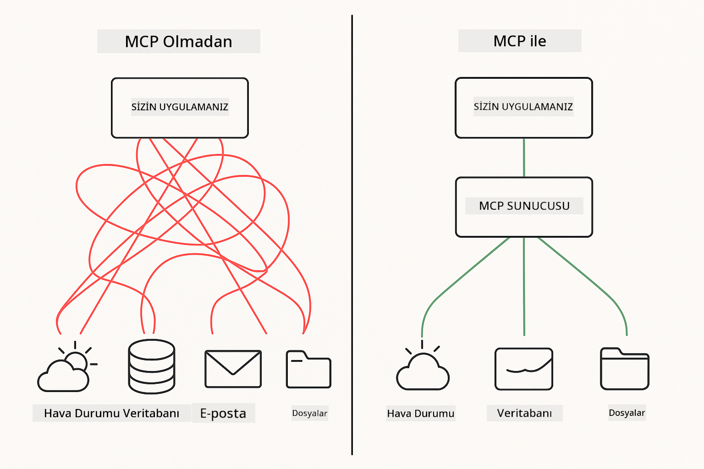

<!--
CO_OP_TRANSLATOR_METADATA:
{
  "original_hash": "c25ec1f10ef156c53e190cdf8b0711ab",
  "translation_date": "2025-12-13T17:52:09+00:00",
  "source_file": "05-mcp/README.md",
  "language_code": "tr"
}
-->
# Modül 05: Model Context Protocol (MCP)

## İçindekiler

- [Neler Öğreneceksiniz](../../../05-mcp)
- [MCP'yi Anlamak](../../../05-mcp)
- [MCP Nasıl Çalışır](../../../05-mcp)
  - [Sunucu-Müşteri Mimarisi](../../../05-mcp)
  - [Araç Keşfi](../../../05-mcp)
  - [Taşıma Mekanizmaları](../../../05-mcp)
- [Ön Koşullar](../../../05-mcp)
- [Bu Modül Neleri Kapsar](../../../05-mcp)
- [Hızlı Başlangıç](../../../05-mcp)
  - [Örnek 1: Uzaktan Hesap Makinesi (Streamable HTTP)](../../../05-mcp)
  - [Örnek 2: Dosya İşlemleri (Stdio)](../../../05-mcp)
  - [Örnek 3: Git Analizi (Docker)](../../../05-mcp)
- [Temel Kavramlar](../../../05-mcp)
  - [Taşıma Seçimi](../../../05-mcp)
  - [Araç Keşfi](../../../05-mcp)
  - [Oturum Yönetimi](../../../05-mcp)
  - [Çapraz Platform Dikkatleri](../../../05-mcp)
- [MCP Ne Zaman Kullanılır](../../../05-mcp)
- [MCP Ekosistemi](../../../05-mcp)
- [Tebrikler!](../../../05-mcp)
  - [Sırada Ne Var?](../../../05-mcp)
- [Sorun Giderme](../../../05-mcp)

## Neler Öğreneceksiniz

Konuşma tabanlı yapay zeka oluşturdunuz, istemleri ustalıkla kullandınız, yanıtları belgelerle temellendirdiniz ve araçlarla ajanlar yarattınız. Ancak tüm bu araçlar, belirli uygulamanız için özel olarak oluşturulmuştu. Peki ya yapay zekanıza herkesin oluşturup paylaşabileceği standart bir araç ekosistemine erişim verebilseydiniz?

Model Context Protocol (MCP) tam olarak bunu sağlar - yapay zeka uygulamalarının harici araçları keşfetmesi ve kullanması için standart bir yol. Her veri kaynağı veya hizmet için özel entegrasyonlar yazmak yerine, yeteneklerini tutarlı bir formatta sunan MCP sunucularına bağlanırsınız. Yapay zeka ajanınız bu araçları otomatik olarak keşfedip kullanabilir.



*MCP Öncesi: Karmaşık nokta-noktaya entegrasyonlar. MCP Sonrası: Tek protokol, sonsuz olanak.*

## MCP'yi Anlamak

MCP, yapay zeka geliştirmede temel bir sorunu çözer: her entegrasyon özeldir. GitHub'a erişmek mi istiyorsunuz? Özel kod. Dosya okumak mı? Özel kod. Veritabanı sorgulamak mı? Özel kod. Ve bu entegrasyonların hiçbiri diğer yapay zeka uygulamalarıyla çalışmaz.

MCP bunu standartlaştırır. Bir MCP sunucusu, araçları net açıklamalar ve şemalarla sunar. Herhangi bir MCP istemcisi bağlanabilir, mevcut araçları keşfedebilir ve kullanabilir. Bir kere oluştur, her yerde kullan.


*Model Context Protocol mimarisi - standartlaştırılmış araç keşfi ve yürütme*

## MCP Nasıl Çalışır

**Sunucu-Müşteri Mimarisi**

MCP, istemci-sunucu modeli kullanır. Sunucular araç sağlar - dosya okuma, veritabanı sorgulama, API çağrıları. İstemciler (yapay zeka uygulamanız) sunuculara bağlanır ve araçlarını kullanır.

**Araç Keşfi**

İstemciniz bir MCP sunucusuna bağlandığında, "Hangi araçlara sahipsin?" diye sorar. Sunucu, açıklamalar ve parametre şemalarıyla birlikte mevcut araçların listesini yanıtlar. Yapay zeka ajanınız, kullanıcı isteklerine göre hangi araçları kullanacağına karar verebilir.

**Taşıma Mekanizmaları**

MCP iki taşıma mekanizması tanımlar: uzak sunucular için HTTP, yerel süreçler için Stdio (Docker konteynerleri dahil):


*MCP taşıma mekanizmaları: Uzak sunucular için HTTP, yerel süreçler için Stdio (Docker konteynerleri dahil)*

**Streamable HTTP** - [StreamableHttpDemo.java](../../../05-mcp/src/main/java/com/example/langchain4j/mcp/StreamableHttpDemo.java)

Uzak sunucular için. Uygulamanız, ağda bir yerde çalışan bir sunucuya HTTP istekleri yapar. Gerçek zamanlı iletişim için Server-Sent Events kullanır.

```java
McpTransport httpTransport = new StreamableHttpMcpTransport.Builder()
    .url("http://localhost:3001/mcp")
    .timeout(Duration.ofSeconds(60))
    .logRequests(true)
    .logResponses(true)
    .build();
```

> **🤖 [GitHub Copilot](https://github.com/features/copilot) Chat ile deneyin:** [`StreamableHttpDemo.java`](../../../05-mcp/src/main/java/com/example/langchain4j/mcp/StreamableHttpDemo.java) dosyasını açın ve sorun:
> - "MCP, Modül 04'teki doğrudan araç entegrasyonundan nasıl farklıdır?"
> - "MCP'nin uygulamalar arasında araç paylaşımı için faydaları nelerdir?"
> - "MCP sunucularına bağlantı hataları veya zaman aşımı durumlarını nasıl yönetirim?"

**Stdio** - [StdioTransportDemo.java](../../../05-mcp/src/main/java/com/example/langchain4j/mcp/StdioTransportDemo.java)

Yerel süreçler için. Uygulamanız bir alt süreç olarak bir sunucu başlatır ve standart giriş/çıkış üzerinden iletişim kurar. Dosya sistemi erişimi veya komut satırı araçları için kullanışlıdır.

```java
McpTransport stdioTransport = new StdioMcpTransport.Builder()
    .command(List.of(
        npmCmd, "exec",
        "@modelcontextprotocol/server-filesystem@0.6.2",
        resourcesDir
    ))
    .logEvents(false)
    .build();
```

> **🤖 [GitHub Copilot](https://github.com/features/copilot) Chat ile deneyin:** [`StdioTransportDemo.java`](../../../05-mcp/src/main/java/com/example/langchain4j/mcp/StdioTransportDemo.java) dosyasını açın ve sorun:
> - "Stdio taşıması nasıl çalışır ve HTTP'ye kıyasla ne zaman kullanmalıyım?"
> - "LangChain4j, başlatılan MCP sunucu süreçlerinin yaşam döngüsünü nasıl yönetir?"
> - "Yapay zekaya dosya sistemine erişim vermenin güvenlik sonuçları nelerdir?"

**Docker (Stdio kullanır)** - [GitRepositoryAnalyzer.java](../../../05-mcp/src/main/java/com/example/langchain4j/mcp/GitRepositoryAnalyzer.java)

Konteynerleştirilmiş hizmetler için. `docker run` ile bir Docker konteyneriyle stdio taşıması üzerinden iletişim kurar. Karmaşık bağımlılıklar veya izole ortamlar için uygundur.

```java
McpTransport dockerTransport = new StdioMcpTransport.Builder()
    .command(List.of(
        "docker", "run",
        "-e", "GITHUB_PERSONAL_ACCESS_TOKEN=" + System.getenv("GITHUB_TOKEN"),
        "-v", volumeMapping,
        "-i", "mcp/git"
    ))
    .logEvents(true)
    .build();
```

> **🤖 [GitHub Copilot](https://github.com/features/copilot) Chat ile deneyin:** [`GitRepositoryAnalyzer.java`](../../../05-mcp/src/main/java/com/example/langchain4j/mcp/GitRepositoryAnalyzer.java) dosyasını açın ve sorun:
> - "Docker taşıması MCP sunucularını nasıl izole eder ve faydaları nelerdir?"
> - "Ana makine ile MCP konteynerleri arasında veri paylaşımı için hacim montajlarını nasıl yapılandırırım?"
> - "Üretimde Docker tabanlı MCP sunucu yaşam döngülerini yönetmek için en iyi uygulamalar nelerdir?"

## Örnekleri Çalıştırmak

### Ön Koşullar

- Java 21+, Maven 3.9+
- Node.js 16+ ve npm (MCP sunucuları için)
- **Docker Desktop** - Örnek 3 için **ÇALIŞIYOR OLMALI** (sadece kurulu olması yetmez)
- `.env` dosyasında yapılandırılmış GitHub Kişisel Erişim Token'ı (Modül 00'dan)

> **Not:** GitHub token'ınızı henüz ayarlamadıysanız, talimatlar için [Modül 00 - Hızlı Başlangıç](../00-quick-start/README.md) bölümüne bakın.

> **⚠️ Docker Kullanıcıları:** Örnek 3'ü çalıştırmadan önce `docker ps` ile Docker Desktop'ın çalıştığını doğrulayın. Bağlantı hataları görürseniz, Docker Desktop'ı başlatın ve ~30 saniye başlatma için bekleyin.

## Hızlı Başlangıç

**VS Code Kullanarak:** Explorer'da herhangi bir demo dosyasına sağ tıklayın ve **"Run Java"** seçeneğini seçin veya Çalıştır ve Hata Ayıkla panelindeki başlatma yapılandırmalarını kullanın (önce token'ınızı `.env` dosyasına eklediğinizden emin olun).

**Maven Kullanarak:** Alternatif olarak, aşağıdaki örneklerle komut satırından çalıştırabilirsiniz.

**⚠️ Önemli:** Bazı örneklerin ön koşulları vardır (örneğin MCP sunucusunu başlatmak veya Docker imajlarını oluşturmak). Her örneğin gereksinimlerini çalıştırmadan önce kontrol edin.

### Örnek 1: Uzaktan Hesap Makinesi (Streamable HTTP)

Bu, ağ tabanlı araç entegrasyonunu gösterir.

**⚠️ Ön Koşul:** Önce MCP sunucusunu başlatmanız gerekir (aşağıdaki Terminal 1'e bakın).

**Terminal 1 - MCP sunucusunu başlatın:**

**Bash:**
```bash
git clone https://github.com/modelcontextprotocol/servers.git
cd servers/src/everything
npm install
node dist/streamableHttp.js
```

**PowerShell:**
```powershell
git clone https://github.com/modelcontextprotocol/servers.git
cd servers/src/everything
npm install
node dist/streamableHttp.js
```

**Terminal 2 - Örneği çalıştırın:**

**VS Code Kullanarak:** `StreamableHttpDemo.java` dosyasına sağ tıklayın ve **"Run Java"** seçeneğini seçin.

**Maven Kullanarak:**

**Bash:**
```bash
export GITHUB_TOKEN=your_token_here
cd 05-mcp
mvn compile exec:java -Dexec.mainClass=com.example.langchain4j.mcp.StreamableHttpDemo
```

**PowerShell:**
```powershell
$env:GITHUB_TOKEN=your_token_here
cd 05-mcp
mvn --% compile exec:java -Dexec.mainClass=com.example.langchain4j.mcp.StreamableHttpDemo
```

Ajanın mevcut araçları keşfetmesini izleyin, ardından hesap makinesini toplama işlemi için kullanın.

### Örnek 2: Dosya İşlemleri (Stdio)

Bu, yerel alt süreç tabanlı araçları gösterir.

**✅ Ön koşul yok** - MCP sunucusu otomatik olarak başlatılır.

**VS Code Kullanarak:** `StdioTransportDemo.java` dosyasına sağ tıklayın ve **"Run Java"** seçeneğini seçin.

**Maven Kullanarak:**

**Bash:**
```bash
export GITHUB_TOKEN=your_token_here
cd 05-mcp
mvn compile exec:java -Dexec.mainClass=com.example.langchain4j.mcp.StdioTransportDemo
```

**PowerShell:**
```powershell
$env:GITHUB_TOKEN=your_token_here
cd 05-mcp
mvn --% compile exec:java -Dexec.mainClass=com.example.langchain4j.mcp.StdioTransportDemo
```

Uygulama otomatik olarak bir dosya sistemi MCP sunucusu başlatır ve yerel bir dosyayı okur. Alt süreç yönetiminin sizin için nasıl yapıldığına dikkat edin.

**Beklenen çıktı:**
```
Assistant response: The content of the file is "Kaboom!".
```

### Örnek 3: Git Analizi (Docker)

Bu, konteynerleştirilmiş araç sunucularını gösterir.

**⚠️ Ön Koşullar:** 
1. **Docker Desktop ÇALIŞIYOR OLMALI** (sadece kurulu olması yetmez)
2. **Windows kullanıcıları:** WSL 2 modu önerilir (Docker Desktop Ayarları → Genel → "Use the WSL 2 based engine"). Hyper-V modu manuel dosya paylaşımı yapılandırması gerektirir.
3. Önce Docker imajını oluşturmanız gerekir (aşağıdaki Terminal 1'e bakın)

**Docker'ın çalıştığını doğrulayın:**

**Bash:**
```bash
docker ps  # Hata değil, konteyner listesini göstermeli
```

**PowerShell:**
```powershell
docker ps  # Hata değil, konteyner listesini göstermeli
```

"Erişim sağlanamıyor: Docker daemon'a bağlanılamıyor" veya "Sistem belirtilen dosyayı bulamıyor" gibi hatalar görürseniz, Docker Desktop'ı başlatın ve başlatma için (~30 saniye) bekleyin.

**Sorun Giderme:**
- Yapay zeka boş depo veya dosya yok raporluyorsa, hacim montajı (`-v`) çalışmıyor demektir.
- **Windows Hyper-V kullanıcıları:** Proje dizinini Docker Desktop Ayarları → Kaynaklar → Dosya paylaşımı bölümüne ekleyin, ardından Docker Desktop'ı yeniden başlatın.
- **Önerilen çözüm:** Otomatik dosya paylaşımı için WSL 2 moduna geçin (Ayarlar → Genel → "Use the WSL 2 based engine" etkinleştirin).

**Terminal 1 - Docker imajını oluşturun:**

**Bash:**
```bash
cd servers/src/git
docker build -t mcp/git .
```

**PowerShell:**
```powershell
cd servers/src/git
docker build -t mcp/git .
```

**Terminal 2 - Analizörü çalıştırın:**

**VS Code Kullanarak:** `GitRepositoryAnalyzer.java` dosyasına sağ tıklayın ve **"Run Java"** seçeneğini seçin.

**Maven Kullanarak:**

**Bash:**
```bash
export GITHUB_TOKEN=your_token_here
cd 05-mcp
mvn compile exec:java -Dexec.mainClass=com.example.langchain4j.mcp.GitRepositoryAnalyzer
```

**PowerShell:**
```powershell
$env:GITHUB_TOKEN=your_token_here
cd 05-mcp
mvn --% compile exec:java -Dexec.mainClass=com.example.langchain4j.mcp.GitRepositoryAnalyzer
```

Uygulama bir Docker konteyneri başlatır, deponuzu bağlar ve yapay zeka ajanı aracılığıyla depo yapısını ve içeriğini analiz eder.

## Temel Kavramlar

**Taşıma Seçimi**

Araçlarınızın nerede olduğuna göre seçin:
- Uzak servisler → Streamable HTTP
- Yerel dosya sistemi → Stdio
- Karmaşık bağımlılıklar → Docker

**Araç Keşfi**

MCP istemcileri bağlandıklarında mevcut araçları otomatik olarak keşfeder. Yapay zeka ajanınız araç açıklamalarını görür ve kullanıcının isteğine göre hangi araçları kullanacağına karar verir.

**Oturum Yönetimi**

Streamable HTTP taşıması oturumları korur, uzak sunucularla durumlu etkileşimlere izin verir. Stdio ve Docker taşıma genellikle durumsuzdur.

**Çapraz Platform Dikkatleri**

Örnekler platform farklarını otomatik olarak yönetir (Windows ve Unix komut farkları, Docker için yol dönüşümleri). Bu, farklı ortamlarda üretim dağıtımları için önemlidir.

## MCP Ne Zaman Kullanılır

**MCP'yi kullanın:**
- Mevcut araç ekosistemlerinden yararlanmak istediğinizde
- Birden fazla uygulamanın kullanacağı araçlar oluştururken
- Üçüncü taraf servisleri standart protokollerle entegre ederken
- Kod değişikliği olmadan araç uygulamalarını değiştirmek istediğinizde

**Özel araçları (Modül 04) kullanın:**
- Uygulamaya özgü işlevsellik oluştururken
- Performans kritik olduğunda (MCP ek yük getirir)
- Araçlarınız basitse ve yeniden kullanılmayacaksa
- Yürütme üzerinde tam kontrol gerektiğinde

## MCP Ekosistemi

Model Context Protocol, büyüyen bir ekosisteme sahip açık bir standarttır:

- Yaygın görevler için resmi MCP sunucuları (dosya sistemi, Git, veritabanları)
- Çeşitli servisler için topluluk katkılı sunucular
- Standartlaştırılmış araç açıklamaları ve şemalar
- Çapraz çerçeve uyumluluğu (herhangi bir MCP istemcisi ile çalışır)

Bu standartlaşma, bir yapay zeka uygulaması için oluşturulan araçların diğerleriyle de çalışmasını sağlar ve yeteneklerin paylaşıldığı ortak bir ekosistem yaratır.

## Tebrikler!

LangChain4j Başlangıç Kursunu tamamladınız. Şunları öğrendiniz:

- Bellekli konuşma tabanlı yapay zeka nasıl oluşturulur (Modül 01)
- Farklı görevler için istem mühendisliği kalıpları (Modül 02)
- Yanıtları belgelerle temellendirme (RAG) (Modül 03)
- Özel araçlarla yapay zeka ajanları oluşturma (Modül 04)
- MCP ile standart araç entegrasyonu (Modül 05)

Artık üretim yapay zeka uygulamaları oluşturmak için temele sahipsiniz. Öğrendiğiniz kavramlar belirli çerçeveler veya modellerden bağımsızdır - yapay zeka mühendisliğinde temel kalıplardır.

### Sırada Ne Var?

Modülleri tamamladıktan sonra, LangChain4j test kavramlarını uygulamalı görmek için [Test Rehberi](../docs/TESTING.md) bölümünü keşfedin.

**Resmi Kaynaklar:**
- [LangChain4j Dokümantasyonu](https://docs.langchain4j.dev/) - Kapsamlı rehberler ve API referansı
- [LangChain4j GitHub](https://github.com/langchain4j/langchain4j) - Kaynak kod ve örnekler
- [LangChain4j Eğitimleri](https://docs.langchain4j.dev/tutorials/) - Çeşitli kullanım durumları için adım adım eğitimler

Bu kursu tamamladığınız için teşekkürler!

---

**Gezinme:** [← Önceki: Modül 04 - Araçlar](../04-tools/README.md) | [Ana Sayfaya Dön](../README.md)

---

## Sorun Giderme

### PowerShell Maven Komut Sözdizimi
**Sorun**: Maven komutları `Unknown lifecycle phase ".mainClass=..."` hatasıyla başarısız oluyor

**Neden**: PowerShell, `=` işaretini değişken atama operatörü olarak yorumlayarak Maven özellik sözdizimini bozuyor

**Çözüm**: Maven komutundan önce durdurma-parsleme operatörü `--%` kullanın:

**PowerShell:**
```powershell
mvn --% compile exec:java -Dexec.mainClass=com.example.langchain4j.mcp.StreamableHttpDemo
```

**Bash:**
```bash
mvn compile exec:java -Dexec.mainClass=com.example.langchain4j.mcp.StreamableHttpDemo
```

`--%` operatörü, PowerShell'e kalan tüm argümanları yorumlamadan doğrudan Maven'a iletmesini söyler.

### Docker Bağlantı Sorunları

**Sorun**: Docker komutları "Cannot connect to Docker daemon" veya "The system cannot find the file specified" hatası veriyor

**Neden**: Docker Desktop çalışmıyor veya tam olarak başlatılmadı

**Çözüm**: 
1. Docker Desktop'u başlatın
2. Tam başlatma için yaklaşık 30 saniye bekleyin
3. `docker ps` ile doğrulayın (hata değil, konteyner listesi göstermeli)
4. Ardından örneğinizi çalıştırın

### Windows Docker Volume Mounting

**Sorun**: Git depo analizörü boş depo veya dosya yok raporluyor

**Neden**: Dosya paylaşım yapılandırması nedeniyle volume mount (`-v`) çalışmıyor

**Çözüm**:
- **Önerilen:** WSL 2 moduna geçin (Docker Desktop Ayarları → Genel → "Use the WSL 2 based engine")
- **Alternatif (Hyper-V):** Proje dizinini Docker Desktop Ayarları → Kaynaklar → Dosya paylaşımı'na ekleyin, ardından Docker Desktop'u yeniden başlatın

---

<!-- CO-OP TRANSLATOR DISCLAIMER START -->
**Feragatname**:  
Bu belge, AI çeviri servisi [Co-op Translator](https://github.com/Azure/co-op-translator) kullanılarak çevrilmiştir. Doğruluk için çaba gösterilse de, otomatik çevirilerin hatalar veya yanlışlıklar içerebileceğini lütfen unutmayınız. Orijinal belge, kendi dilinde yetkili kaynak olarak kabul edilmelidir. Kritik bilgiler için profesyonel insan çevirisi önerilir. Bu çevirinin kullanımı sonucu oluşabilecek yanlış anlamalar veya yorum hatalarından sorumlu değiliz.
<!-- CO-OP TRANSLATOR DISCLAIMER END -->