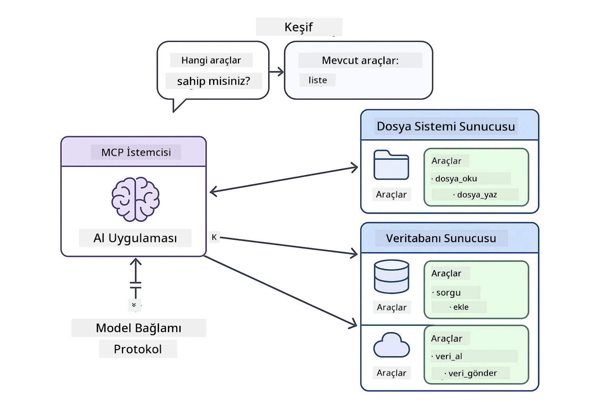
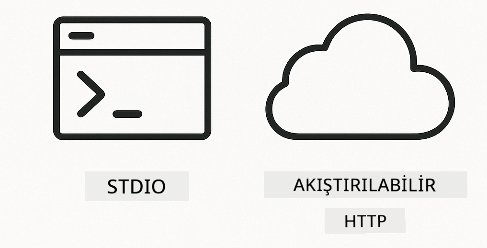
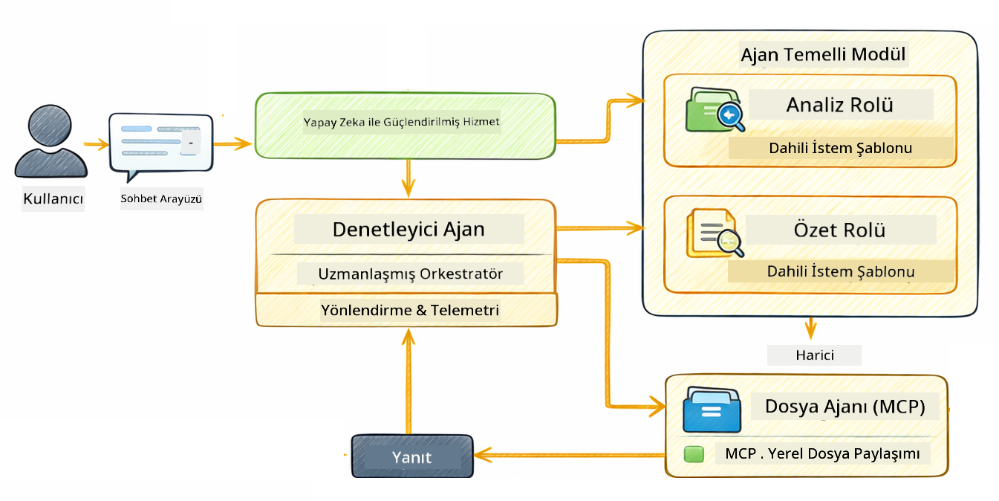

<!--
CO_OP_TRANSLATOR_METADATA:
{
  "original_hash": "6c816d130a1fa47570c11907e72d84ae",
  "translation_date": "2026-01-05T23:18:52+00:00",
  "source_file": "05-mcp/README.md",
  "language_code": "tr"
}
-->
# Modül 05: Model Context Protocol (MCP)

## İçindekiler

- [Neler Öğreneceksiniz](../../../05-mcp)
- [MCP Nedir?](../../../05-mcp)
- [MCP Nasıl Çalışır](../../../05-mcp)
- [Agentik Modül](../../../05-mcp)
- [Örneklerin Çalıştırılması](../../../05-mcp)
  - [Önkoşullar](../../../05-mcp)
- [Hızlı Başlangıç](../../../05-mcp)
  - [Dosya İşlemleri (Stdio)](../../../05-mcp)
  - [Süpervizör Agent](../../../05-mcp)
    - [Çıktının Anlaşılması](../../../05-mcp)
    - [Yanıt Stratejileri](../../../05-mcp)
    - [Agentik Modül Özelliklerinin Açıklanması](../../../05-mcp)
- [Temel Kavramlar](../../../05-mcp)
- [Tebrikler!](../../../05-mcp)
  - [Sırada Ne Var?](../../../05-mcp)

## Neler Öğreneceksiniz

Konuşma tabanlı yapay zeka oluşturdunuz, promptları ustaca kullandınız, yanıtları belgelere dayandırdınız ve araçlara sahip ajanlar yarattınız. Ancak tüm bu araçlar, sizin özel uygulamanız için özel olarak yapılmıştı. Peki yapay zekanıza, herkesin oluşturup paylaşabileceği standart bir araç ekosistemine erişim sağlama imkânınız olsa? Bu modülde, tam olarak bunu Model Context Protocol (MCP) ve LangChain4j’nin agentik modülü ile nasıl yapacağınızı öğreneceksiniz. Önce basit bir MCP dosya okuyucusunu gösteriyoruz, sonra Supervisor Agent kalıbını kullanarak onun gelişmiş agentik iş akışlarına nasıl kolayca entegre olduğunu gösteriyoruz.

## MCP Nedir?

Model Context Protocol (MCP) tam da bunu sağlar — yapay zeka uygulamalarının harici araçları keşfetmesi ve kullanması için standart bir yol. Her veri kaynağı veya servis için özel entegrasyonlar yazmak yerine, yeteneklerini tutarlı bir biçimde açan MCP sunucularına bağlanırsınız. Yapay zeka ajanınız bu araçları otomatik olarak keşfedip kullanabilir.


*MCP’den Önce: Karmaşık nokta-noktaya entegrasyonlar. MCP’den Sonra: Tek protokol, sonsuz olasılık.*

MCP yapay zeka geliştirmede temel bir sorunu çözer: her entegrasyon özeldir. GitHub erişmek mi istiyorsunuz? Özel kod. Dosya okumak mı? Özel kod. Veritabanı sorgulamak mı? Özel kod. Ve bu entegrasyonların hiçbiri diğer yapay zeka uygulamalarıyla çalışmaz.

MCP bunu standartlaştırır. Bir MCP sunucusu araçları açık tanımlar ve şemalarla sunar. Herhangi bir MCP istemcisi bağlanabilir, mevcut araçları keşfedebilir ve onları kullanabilir. Bir kere inşa edin, her yerde kullanın.



*Model Context Protocol mimarisi - standartlaştırılmış araç keşfi ve yürütme*

## MCP Nasıl Çalışır

**Sunucu-İstemci Mimarisi**

MCP istemci-sunucu modelini kullanır. Sunucular araçlar sağlar - dosya okuma, veritabanı sorgulama, API çağrıları. İstemciler (yapay zeka uygulamanız) sunuculara bağlanır ve araçlarını kullanır.

LangChain4j ile MCP kullanmak için bu Maven bağımlılığını ekleyin:

```xml
<dependency>
    <groupId>dev.langchain4j</groupId>
    <artifactId>langchain4j-mcp</artifactId>
    <version>${langchain4j.version}</version>
</dependency>
```

**Araç Keşfi**

İstemciniz bir MCP sunucusuna bağlandığında "Hangi araçlara sahipsin?" diye sorar. Sunucu mevcut araçların bir listesini açıklamalar ve parametre şemalarıyla yanıtlar. Yapay zeka ajanınız kullanıcı taleplerine göre hangi araçları kullanacağına karar verir.

**Taşıma Mekanizmaları**

MCP farklı taşıma mekanizmalarını destekler. Bu modül, yerel süreçler için Stdio taşımayı gösterir:



*MCP taşıma mekanizmaları: uzak sunucular için HTTP, yerel süreçler için Stdio*

**Stdio** - [StdioTransportDemo.java](../../../05-mcp/src/main/java/com/example/langchain4j/mcp/StdioTransportDemo.java)

Yerel süreçler için. Uygulamanız, bir alt süreç olarak sunucu oluşturur ve standart giriş/çıkış ile iletişim kurar. Dosya sistemi erişimi veya komut satırı araçları için kullanışlıdır.

```java
McpTransport stdioTransport = new StdioMcpTransport.Builder()
    .command(List.of(
        npmCmd, "exec",
        "@modelcontextprotocol/server-filesystem@2025.12.18",
        resourcesDir
    ))
    .logEvents(false)
    .build();
```

> **🤖 [GitHub Copilot](https://github.com/features/copilot) Sohbeti ile Deneyin:** [`StdioTransportDemo.java`](../../../05-mcp/src/main/java/com/example/langchain4j/mcp/StdioTransportDemo.java) dosyasını açın ve sorun:
> - "Stdio taşıma nasıl çalışır ve HTTP ile ne zaman kullanılmalıdır?"
> - "LangChain4j MCP sunucu süreçlerinin yaşam döngüsünü nasıl yönetir?"
> - "Yapay zeka dosya sistemine eriştiğinde güvenlik riskleri nelerdir?"

## Agentik Modül

MCP standartlaştırılmış araçlar sağlarken, LangChain4j’nin **agentik modülü** bu araçları koordine eden ajanlar oluşturmak için deklaratif bir yol sunar. `@Agent` anotasyonu ve `AgenticServices` ile ajanın davranışını emredici kod yerine arayüzler aracılığıyla tanımlabilirsiniz.

Bu modülde, kullanıcı isteğine göre hangi alt ajanların çağrılacağına dinamik karar veren gelişmiş bir agentik yapay zeka yaklaşımı olan **Supervisor Agent** kalıbını keşfedeceksiniz. MCP destekli dosya erişimini bir alt ajanımıza vererek her iki kavramı birleştireceğiz.

Agentik modülü kullanmak için bu Maven bağımlılığını ekleyin:

```xml
<dependency>
    <groupId>dev.langchain4j</groupId>
    <artifactId>langchain4j-agentic</artifactId>
    <version>${langchain4j.mcp.version}</version>
</dependency>
```

> **⚠️ Deneysel:** `langchain4j-agentic` modülü **deneysel** olup değişime tabidir. AI asistanları oluşturmanın stabil yolu hâlâ `langchain4j-core` ve özel araçlardır (Modül 04).

## Örneklerin Çalıştırılması

### Önkoşullar

- Java 21+, Maven 3.9+
- Node.js 16+ ve npm (MCP sunucuları için)
- `.env` dosyasında yapılandırılmış ortam değişkenleri (kök dizinden):
  - `AZURE_OPENAI_ENDPOINT`, `AZURE_OPENAI_API_KEY`, `AZURE_OPENAI_DEPLOYMENT` (Modüller 01-04 ile aynı)

> **Not:** Ortam değişkenlerinizi henüz ayarlamadıysanız, talimatlar için [Modül 00 - Hızlı Başlangıç](../00-quick-start/README.md) bölümüne bakın veya kök dizindeki `.env.example` dosyasını `.env` olarak kopyalayıp değerlerinizi doldurun.

## Hızlı Başlangıç

**VS Code Kullananlar:** Explorer’daki herhangi bir demo dosyasına sağ tıklayın ve **"Run Java"** seçeneğini seçin ya da Çalıştır ve Hata Ayıkla panelindeki başlatma yapılandırmalarını kullanın (önce `.env` dosyasına token eklediğinizden emin olun).

**Maven İle:** Alternatif olarak aşağıdaki örneklerle komut satırından çalıştırabilirsiniz.

### Dosya İşlemleri (Stdio)

Bu, yerel alt süreç tabanlı araçları gösterir.

**✅ Önkoşul gerekmez** — MCP sunucu otomatik başlatılır.

**Başlatma Betikleri (Önerilir):**

Başlatma betikleri ortam değişkenlerini kök `.env` dosyasından otomatik yükler:

**Bash:**
```bash
cd 05-mcp
chmod +x start-stdio.sh
./start-stdio.sh
```

**PowerShell:**
```powershell
cd 05-mcp
.\start-stdio.ps1
```

**VS Code Kullanarak:** `StdioTransportDemo.java` üzerine sağ tıklayın ve **"Run Java"** seçin (env dosyanız ayarlı olmalı).

Uygulama otomatik olarak bir dosya sistemi MCP sunucusu oluşturur ve yerel bir dosya okur. Alt süreç yönetiminin sizin için nasıl yapıldığına dikkat edin.

**Beklenen çıktı:**
```
Assistant response: The file provides an overview of LangChain4j, an open-source Java library
for integrating Large Language Models (LLMs) into Java applications...
```

### Süpervizör Agent

**Supervisor Agent kalıbı** esnek bir agentik AI formudur. Bir Supervisor, LLM kullanarak kullanıcının talebine göre hangi ajanların çağrılacağına bağımsız olarak karar verir. Bir sonraki örnekte, MCP destekli dosya erişimi ve LLM ajanını birleştirerek denetimli dosya okuma → raporlama iş akışı oluşturuyoruz.

Demoda, `FileAgent` MCP dosya sistemi araçlarını kullanarak dosya okur, `ReportAgent` ise yönetici özeti (1 cümle), 3 anahtar nokta ve öneriler içeren yapılandırılmış bir rapor oluşturur. Supervisor bu akışı otomatik yönetir:



```
┌─────────────┐      ┌──────────────┐
│  FileAgent  │ ───▶ │ ReportAgent  │
│ (MCP tools) │      │  (pure LLM)  │
└─────────────┘      └──────────────┘
   outputKey:           outputKey:
  'fileContent'         'report'
```

Her ajan çıktısını **Agentic Scope** (paylaşılan bellek) içine kaydeder; böylece sonraki ajanlar önceki sonuçlara erişebilir. Bu, MCP araçlarının agentik iş akışlarına sorunsuz entegrasyonunu gösterir — Supervisor dosyaların *nasıl* okunduğunu bilmek zorunda değildir, sadece `FileAgent` yapabildiğini bilir.

#### Demoyu Çalıştırma

Başlatma betikleri ortam değişkenlerini kök `.env` dosyasından otomatik yükler:

**Bash:**
```bash
cd 05-mcp
chmod +x start-supervisor.sh
./start-supervisor.sh
```

**PowerShell:**
```powershell
cd 05-mcp
.\start-supervisor.ps1
```

**VS Code Kullanarak:** `SupervisorAgentDemo.java` üzerinde sağ tıklayın ve **"Run Java"** seçin (env dosyanız ayarlı olmalı).

#### Supervisor Nasıl Çalışır

```java
// Adım 1: FileAgent MCP araçlarını kullanarak dosyaları okur
FileAgent fileAgent = AgenticServices.agentBuilder(FileAgent.class)
        .chatModel(model)
        .toolProvider(mcpToolProvider)  // Dosya işlemleri için MCP araçlarına sahiptir
        .build();

// Adım 2: ReportAgent yapılandırılmış raporlar oluşturur
ReportAgent reportAgent = AgenticServices.agentBuilder(ReportAgent.class)
        .chatModel(model)
        .build();

// Supervisor dosya → rapor iş akışını düzenler
SupervisorAgent supervisor = AgenticServices.supervisorBuilder()
        .chatModel(model)
        .subAgents(fileAgent, reportAgent)
        .responseStrategy(SupervisorResponseStrategy.LAST)  // Nihai raporu döndürür
        .build();

// Supervisor isteğe bağlı olarak hangi ajanların çağrılacağına karar verir
String response = supervisor.invoke("Read the file at /path/file.txt and generate a report");
```

#### Yanıt Stratejileri

Bir `SupervisorAgent` yapılandırırken, alt ajanların görevlerini tamamladıktan sonra kullanıcıya nihai cevabı nasıl oluşturacağını belirlersiniz. Mevcut stratejiler:

| Strateji | Açıklama |
|----------|----------|
| **LAST** | Supervisor çağrılan son alt ajan veya aracın çıktısını döner. Bu, iş akışındaki son ajanın tüm nihai cevabı üretmek üzere özel olarak tasarlandığı durumlarda yararlıdır (örneğin araştırma hattındaki "Özet Ajan"). |
| **SUMMARY** | Supervisor kendi iç LLM’sini kullanarak tüm etkileşimin ve alt ajan çıktıların özetini sentezler, sonra bu özeti nihai yanıt olarak döner. Kullanıcıya temiz ve toplu bir yanıt sağlar. |
| **SCORED** | Sistem, orijinal kullanıcı isteğine göre hem LAST yanıtını hem SUMMARY’yi içeren LLM skorlaması yapar, daha yüksek skoru alan çıktıyı döner. |

Tam uygulama için [SupervisorAgentDemo.java](../../../05-mcp/src/main/java/com/example/langchain4j/mcp/SupervisorAgentDemo.java) dosyasına bakın.

> **🤖 [GitHub Copilot](https://github.com/features/copilot) Sohbeti ile Deneyin:** [`SupervisorAgentDemo.java`](../../../05-mcp/src/main/java/com/example/langchain4j/mcp/SupervisorAgentDemo.java) dosyasını açın ve sorun:
> - "Supervisor hangi ajanların çağrılacağına nasıl karar veriyor?"
> - "Supervisor ile Sıralı iş akışı kalıpları arasındaki fark nedir?"
> - "Supervisor'ün planlama davranışını nasıl özelleştirebilirim?"

#### Çıktının Anlaşılması

Demoyu çalıştırdığınızda Supervisor’ün birden çok ajanı nasıl organize ettiğine dair yapılandırılmış bir yürüyüş görürsünüz. Her bölümün anlamı şudur:

```
======================================================================
  FILE → REPORT WORKFLOW DEMO
======================================================================

This demo shows a clear 2-step workflow: read a file, then generate a report.
The Supervisor orchestrates the agents automatically based on the request.
```

**Başlık** iş akışı kavramını tanıtır: dosya okumadan rapor oluşturmaya odaklı bir hat.

```
--- WORKFLOW ---------------------------------------------------------
  ┌─────────────┐      ┌──────────────┐
  │  FileAgent  │ ───▶ │ ReportAgent  │
  │ (MCP tools) │      │  (pure LLM)  │
  └─────────────┘      └──────────────┘
   outputKey:           outputKey:
   'fileContent'        'report'

--- AVAILABLE AGENTS -------------------------------------------------
  [FILE]   FileAgent   - Reads files via MCP → stores in 'fileContent'
  [REPORT] ReportAgent - Generates structured report → stores in 'report'
```

**İş Akışı Diyagramı** ajanlar arasındaki veri akışını gösterir. Her ajanın belirli bir rolü vardır:
- **FileAgent** MCP araçları kullanarak dosyaları okur ve raw içeriği `fileContent` olarak depolar
- **ReportAgent** bu içeriği kullanır ve `report` içinde yapılandırılmış bir rapor üretir

```
--- USER REQUEST -----------------------------------------------------
  "Read the file at .../file.txt and generate a report on its contents"
```

**Kullanıcı Talebi** görevi gösterir. Supervisor bunu çözümler ve FileAgent → ReportAgent çağırmaya karar verir.

```
--- SUPERVISOR ORCHESTRATION -----------------------------------------
  The Supervisor decides which agents to invoke and passes data between them...

  +-- STEP 1: Supervisor chose -> FileAgent (reading file via MCP)
  |
  |   Input: .../file.txt
  |
  |   Result: LangChain4j is an open-source, provider-agnostic Java framework for building LLM...
  +-- [OK] FileAgent (reading file via MCP) completed

  +-- STEP 2: Supervisor chose -> ReportAgent (generating structured report)
  |
  |   Input: LangChain4j is an open-source, provider-agnostic Java framew...
  |
  |   Result: Executive Summary...
  +-- [OK] ReportAgent (generating structured report) completed
```

**Supervisor Orkestrasyonu** 2 adımlı iş akışını gösterir:
1. **FileAgent** dosyayı MCP üzerinden okur ve içeriği depolar
2. **ReportAgent** içeriği alır ve yapılandırılmış rapor oluşturur

Supervisor kullanıcının isteğine dayalı **bağımsız** olarak bu kararları verdi.

```
--- FINAL RESPONSE ---------------------------------------------------
Executive Summary
...

Key Points
...

Recommendations
...

--- AGENTIC SCOPE (Data Flow) ----------------------------------------
  Each agent stores its output for downstream agents to consume:
  * fileContent: LangChain4j is an open-source, provider-agnostic Java framework...
  * report: Executive Summary...
```

#### Agentik Modül Özelliklerinin Açıklanması

Örnek agentik modülün birkaç gelişmiş özelliğini gösterir. Agentic Scope ve Agent Dinleyicilerine yakından bakalım.

**Agentic Scope** ajanların `@Agent(outputKey="...")` kullanarak sonuçlarını depoladığı paylaşılan belleği gösterir. Bu şunları sağlar:
- Sonraki ajanların önceki ajan çıktılarına erişimi
- Supervisor’ün nihai yanıtı sentezlemesi
- Üretileni inceleyebilmeniz

```java
ResultWithAgenticScope<String> result = supervisor.invokeWithAgenticScope(request);
AgenticScope scope = result.agenticScope();
String fileContent = scope.readState("fileContent");  // FileAgent'ten ham dosya verisi
String report = scope.readState("report");            // ReportAgent'ten yapılandırılmış rapor
```

**Agent Dinleyiciler** ajan yürütmesini izleme ve hata ayıklama sağlar. Demoda gördüğünüz adım adım çıktı, her ajan çağrısına bağlanan bir AgentListener’dan gelir:
- **beforeAgentInvocation** - Supervisor bir ajan seçtiğinde çağrılır, hangi ajanın niçin seçildiğini görmenizi sağlar
- **afterAgentInvocation** - Bir ajan tamamlandığında çağrılır, sonucunu gösterir
- **inheritedBySubagents** - true ise hiyerarşideki tüm ajanları izler

```java
AgentListener monitor = new AgentListener() {
    private int step = 0;
    
    @Override
    public void beforeAgentInvocation(AgentRequest request) {
        step++;
        System.out.println("  +-- STEP " + step + ": " + request.agentName());
    }
    
    @Override
    public void afterAgentInvocation(AgentResponse response) {
        System.out.println("  +-- [OK] " + response.agentName() + " completed");
    }
    
    @Override
    public boolean inheritedBySubagents() {
        return true; // Tüm alt ajanlara yayılacak
    }
};
```

Supervisor kalıbının ötesinde, `langchain4j-agentic` modülü birçok güçlü iş akışı kalıbı ve özellik sunar:

| Kalıp | Açıklama | Kullanım Durumu |
|---------|-------------|----------|
| **Sıralı** | Ajanları sırayla çalıştırır, çıktı sonraki adıma akar | Hatlar: araştırma → analiz → rapor |
| **Paralel** | Ajanları eşzamanlı çalıştırır | Bağımsız görevler: hava durumu + haberler + borsa |
| **Döngü** | Koşul sağlanana kadar iterasyon yapar | Kalite puanlama: skor ≥ 0.8 olana kadar iyileştir |
| **Koşullu** | Koşullara göre yönlendirir | Sınıflandır → uzman ajanına yönlendir |
| **İnsan-Dahil** | İnsan onay noktaları ekler | Onay iş akışları, içerik inceleme |

## Temel Kavramlar

Artık MCP ve agentik modülü eylem halinde keşfettiğinize göre, her yaklaşımı ne zaman kullanacağınızı özetleyelim.

**MCP**, mevcut araç ekosistemlerinden yararlanmak, birçok uygulamanın paylaşabileceği araçlar geliştirmek, üçüncü taraf hizmetleri standart protokollerle entegre etmek veya kod değiştirmeden araç uygulamalarını değiştirmek istediğinizde idealdir.

**Agentik Modül**, `@Agent` anotasyonları ile deklaratif ajan tanımları yapmak, iş akışı orkestrasyonu (sıralı, döngü, paralel) gerektiren, etkin arayüz tabanlı ajan tasarımını tercih eden veya `outputKey` ile çıktı paylaşan birden çok ajanı bir araya getiren projeler için uygundur.

**Supervisor Agent kalıbı**, iş akışı önceden tahmin edilemez olduğunda ve karar vermek için LLM’nin devreye girmesini istediğinizde, birden çok uzmanlaşmış ajanın dinamik yönlendirmeye ihtiyaç duyduğu durumlarda, farklı yeteneklere yönlendiren konuşma sistemleri kurarken veya en esnek, adaptif ajan davranışını istediğinizde öne çıkar.
## Tebrikler!

LangChain4j for Beginners kursunu tamamladınız. Şunları öğrendiniz:

- Bellek ile sohbet bazlı yapay zeka nasıl kurulur (Modül 01)
- Farklı görevler için istem mühendisliği kalıpları (Modül 02)
- Yanıtları belgelerinizle temellendirme (RAG) (Modül 03)
- Özel araçlarla temel yapay zeka ajanları (asistanlar) oluşturma (Modül 04)
- LangChain4j MCP ve Agentic modülleri ile standart araçları entegre etme (Modül 05)

### Sonrası?

Modülleri tamamladıktan sonra, LangChain4j test kavramlarını uygulamada görmek için [Testing Guide](../docs/TESTING.md) rehberini keşfedin.

**Resmi Kaynaklar:**
- [LangChain4j Documentation](https://docs.langchain4j.dev/) - Kapsamlı rehberler ve API referansı
- [LangChain4j GitHub](https://github.com/langchain4j/langchain4j) - Kaynak kodu ve örnekler
- [LangChain4j Tutorials](https://docs.langchain4j.dev/tutorials/) - Çeşitli kullanım senaryoları için adım adım eğitimler

Bu kursu tamamladığınız için teşekkürler!

---

**Gezinme:** [← Önceki: Modül 04 - Araçlar](../04-tools/README.md) | [Ana Sayfaya Dön](../README.md)

---

<!-- CO-OP TRANSLATOR DISCLAIMER START -->
**Feragatname**:
Bu belge, AI çeviri hizmeti [Co-op Translator](https://github.com/Azure/co-op-translator) kullanılarak çevrilmiştir. Doğruluk için çaba sarf etsek de, otomatik çevirilerin hatalar veya yanlışlıklar içerebileceğini lütfen unutmayın. Orijinal belge, kendi dilinde yetkili kaynak olarak kabul edilmelidir. Kritik bilgiler için profesyonel insan çevirisi önerilir. Bu çevirinin kullanımıyla ortaya çıkabilecek yanlış anlamalar veya yanlış yorumlamalardan sorumlu değiliz.
<!-- CO-OP TRANSLATOR DISCLAIMER END -->