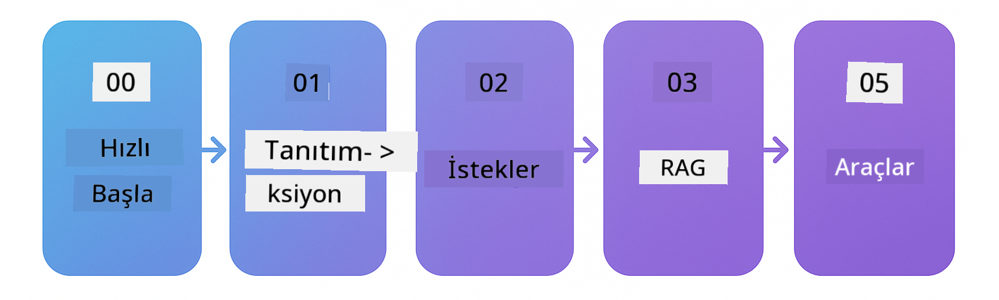

<!--
CO_OP_TRANSLATOR_METADATA:
{
  "original_hash": "69c7e2616c66df6cc296492fbfcad9ec",
  "translation_date": "2025-12-13T12:29:52+00:00",
  "source_file": "README.md",
  "language_code": "tr"
}
-->

# Yeni Başlayanlar için LangChain4j

LangChain4j ve Azure OpenAI GPT-5 ile temel sohbetten AI ajanlarına kadar AI uygulamaları geliştirme kursu.

**LangChain4j'ye yeni misiniz?** Anahtar terimlerin ve kavramların tanımları için [Sözlüğe](docs/GLOSSARY.md) göz atın.

## İçindekiler

1. [Hızlı Başlangıç](00-quick-start/README.md) - LangChain4j ile başlayın
2. [Giriş](01-introduction/README.md) - LangChain4j'nin temellerini öğrenin
3. [Prompt Mühendisliği](02-prompt-engineering/README.md) - Etkili prompt tasarımında ustalaşın
4. [RAG (Retrieval-Augmented Generation)](03-rag/README.md) - Akıllı bilgi tabanlı sistemler oluşturun
5. [Araçlar](04-tools/README.md) - AI ajanları ile harici araçlar ve API'leri entegre edin
6. [MCP (Model Context Protocol)](05-mcp/README.md) - Model Context Protocol ile çalışın
---

## Öğrenme Yolu

[Hızlı Başlangıç](00-quick-start/README.md) modülü ile başlayın ve becerilerinizi adım adım geliştirmek için her modülden ilerleyin. Temelleri anlamak için temel örnekleri deneyeceksiniz, ardından GPT-5 ile daha derinlemesine inceleme için [Giriş](01-introduction/README.md) modülüne geçeceksiniz.

Modülleri tamamladıktan sonra, LangChain4j test kavramlarını uygulamalı görmek için [Test Rehberini](docs/TESTING.md) keşfedin.

> **Not:** Bu eğitim hem GitHub Modellerini hem de Azure OpenAI'yi kullanır. [Hızlı Başlangıç](00-quick-start/README.md) ve [MCP](05-mcp/README.md) modülleri GitHub Modellerini kullanır (Azure aboneliği gerekmez), modüller 1-4 ise Azure OpenAI GPT-5 kullanır.

## GitHub Copilot ile Öğrenme

Hızlıca kodlamaya başlamak için bu projeyi bir GitHub Codespace'te veya sağlanan devcontainer ile yerel IDE'nizde açın. Bu kursta kullanılan devcontainer, AI eşliğinde programlama için önceden yapılandırılmış GitHub Copilot içerir.

Her kod örneği, GitHub Copilot'a sorabileceğiniz önerilen soruları içerir, böylece anlayışınızı derinleştirebilirsiniz. 💡/🤖 ipuçlarını şunlarda arayın:

- **Java dosya başlıkları** - Her örneğe özgü sorular
- **Modül README dosyaları** - Kod örneklerinden sonra keşif soruları

**Nasıl kullanılır:** Herhangi bir kod dosyasını açın ve Copilot'a önerilen soruları sorun. Kod tabanının tam bağlamına sahiptir ve açıklayabilir, genişletebilir ve alternatifler önerebilir.

Daha fazlasını öğrenmek ister misiniz? [AI Eşli Programlama için Copilot](https://aka.ms/GitHubCopilotAI) sayfasına göz atın.

## Ek Kaynaklar 

### LangChain

---

### Azure / Edge / MCP / Ajanlar

---
 
### Üretken AI Serisi

[-9333EA?style=for-the-badge&labelColor=E5E7EB&color=9333EA)](https://github.com/microsoft/Generative-AI-for-beginners-dotnet?WT.mc_id=academic-105485-koreyst)
[-C084FC?style=for-the-badge&labelColor=E5E7EB&color=C084FC)](https://github.com/microsoft/generative-ai-for-beginners-java?WT.mc_id=academic-105485-koreyst)
[-E879F9?style=for-the-badge&labelColor=E5E7EB&color=E879F9)](https://github.com/microsoft/generative-ai-with-javascript?WT.mc_id=academic-105485-koreyst)

---
 
### Temel Öğrenme

---
 
### Copilot Serisi

## Yardım Alma

Tıkandığınızda veya AI uygulamaları geliştirme hakkında sorularınız olduğunda katılın:

Ürün geri bildirimi veya hata bildirimi için ziyaret edin:

## Lisans

MIT Lisansı - Ayrıntılar için [LICENSE](../../LICENSE) dosyasına bakın.

---

<!-- CO-OP TRANSLATOR DISCLAIMER START -->
**Feragatname**:  
Bu belge, AI çeviri hizmeti [Co-op Translator](https://github.com/Azure/co-op-translator) kullanılarak çevrilmiştir. Doğruluk için çaba gösterilse de, otomatik çevirilerin hatalar veya yanlışlıklar içerebileceğini lütfen unutmayınız. Orijinal belge, kendi dilinde yetkili kaynak olarak kabul edilmelidir. Kritik bilgiler için profesyonel insan çevirisi önerilir. Bu çevirinin kullanımı sonucu oluşabilecek yanlış anlamalar veya yorum hatalarından sorumlu değiliz.
<!-- CO-OP TRANSLATOR DISCLAIMER END -->