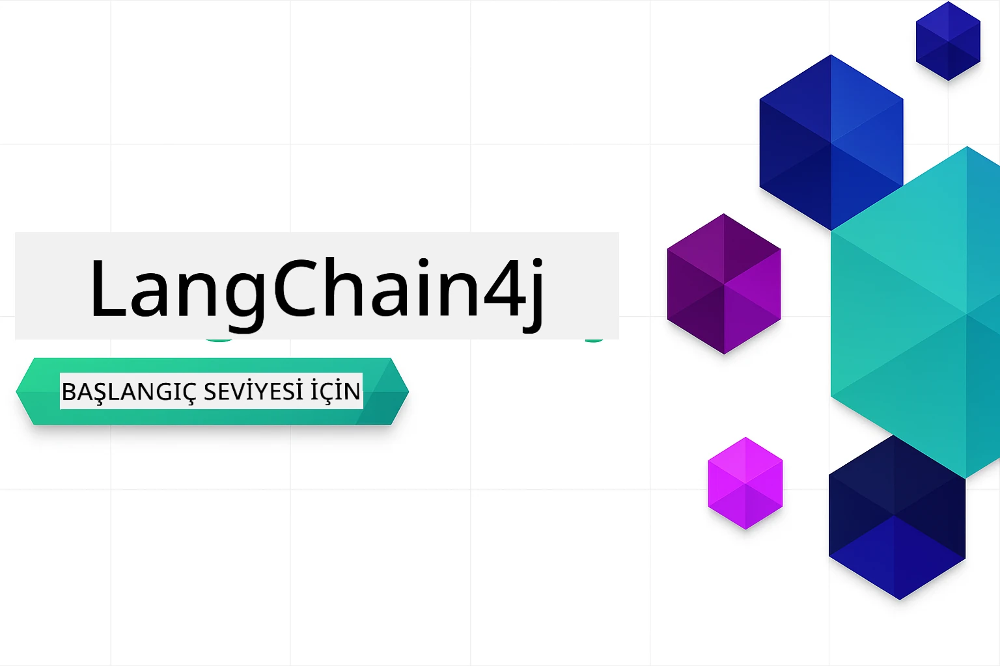

### 🌐 Çok Dilli Destek

#### GitHub Action ile Desteklenmektedir (Otomatik & Her Zaman Güncel)

<!-- CO-OP TRANSLATOR LANGUAGES TABLE START -->
[Arabic](../ar/README.md) | [Bengali](../bn/README.md) | [Bulgarian](../bg/README.md) | [Burmese (Myanmar)](../my/README.md) | [Chinese (Simplified)](../zh-CN/README.md) | [Chinese (Traditional, Hong Kong)](../zh-HK/README.md) | [Chinese (Traditional, Macau)](../zh-MO/README.md) | [Chinese (Traditional, Taiwan)](../zh-TW/README.md) | [Croatian](../hr/README.md) | [Czech](../cs/README.md) | [Danish](../da/README.md) | [Dutch](../nl/README.md) | [Estonian](../et/README.md) | [Finnish](../fi/README.md) | [French](../fr/README.md) | [German](../de/README.md) | [Greek](../el/README.md) | [Hebrew](../he/README.md) | [Hindi](../hi/README.md) | [Hungarian](../hu/README.md) | [Indonesian](../id/README.md) | [Italian](../it/README.md) | [Japanese](../ja/README.md) | [Kannada](../kn/README.md) | [Korean](../ko/README.md) | [Lithuanian](../lt/README.md) | [Malay](../ms/README.md) | [Malayalam](../ml/README.md) | [Marathi](../mr/README.md) | [Nepali](../ne/README.md) | [Nigerian Pidgin](../pcm/README.md) | [Norwegian](../no/README.md) | [Persian (Farsi)](../fa/README.md) | [Polish](../pl/README.md) | [Portuguese (Brazil)](../pt-BR/README.md) | [Portuguese (Portugal)](../pt-PT/README.md) | [Punjabi (Gurmukhi)](../pa/README.md) | [Romanian](../ro/README.md) | [Russian](../ru/README.md) | [Serbian (Cyrillic)](../sr/README.md) | [Slovak](../sk/README.md) | [Slovenian](../sl/README.md) | [Spanish](../es/README.md) | [Swahili](../sw/README.md) | [Swedish](../sv/README.md) | [Tagalog (Filipino)](../tl/README.md) | [Tamil](../ta/README.md) | [Telugu](../te/README.md) | [Thai](../th/README.md) | [Turkish](./README.md) | [Ukrainian](../uk/README.md) | [Urdu](../ur/README.md) | [Vietnamese](../vi/README.md)

> **Tercihiniz Yerel Olarak Klonlamak mı?**

> Bu depo 50'den fazla dil çevirisini içermektedir ve bu, indirme boyutunu önemli ölçüde artırır. Çevrimdışı çeviri olmadan klonlamak için sparse checkout kullanın:
> ```bash
> git clone --filter=blob:none --sparse https://github.com/microsoft/LangChain4j-for-Beginners.git
> cd LangChain4j-for-Beginners
> git sparse-checkout set --no-cone '/*' '!translations' '!translated_images'
> ```
> Bu, kursu tamamlamak için ihtiyacınız olan her şeyi çok daha hızlı bir indirme ile sağlar.
<!-- CO-OP TRANSLATOR LANGUAGES TABLE END -->

# Yeni Başlayanlar İçin LangChain4j

LangChain4j ve Azure OpenAI GPT-5 ile temel sohbetten AI ajanlarına kadar AI uygulamaları geliştirme kursu.

**LangChain4j'da yenisiniz?** Temel terimler ve kavramlar için [Sözlüğü](docs/GLOSSARY.md) inceleyin.

## İçindekiler

1. [Hızlı Başlangıç](00-quick-start/README.md) - LangChain4j ile hızlı başlangıç
2. [Giriş](01-introduction/README.md) - LangChain4j'nın temelini öğrenin
3. [Prompt Mühendisliği](02-prompt-engineering/README.md) - Etkili prompt tasarımında ustalaşın
4. [RAG (Retrieval-Augmented Generation)](03-rag/README.md) - Akıllı bilgi tabanlı sistemler geliştirin
5. [Araçlar](04-tools/README.md) - Harici araçlar ve basit asistanlar entegre edin
6. [MCP (Model Bağlam Protokolü)](05-mcp/README.md) - Model Bağlam Protokolü (MCP) ve Ajans modülleri ile çalışın
---

## Öğrenme Yolu

> **Hızlı Başlangıç**

1. Bu depoyu GitHub hesabınıza fork edin
2. **Code** → **Codespaces** sekmesine tıklayın → **...** → **Seçeneklerle Yeni...**
3. Varsayılanları kullanın – bu, bu kurs için oluşturulan Geliştirme konteynerini seçecektir
4. **Oluştur codespace** butonuna tıklayın
5. Ortamın hazır olması için 5-10 dakika bekleyin
6. Başlamak için doğrudan [Hızlı Başlangıç](./00-quick-start/README.md) bölümüne atlayın!

Modülleri tamamladıktan sonra, LangChain4j test kavramlarını uygulamada görebilmek için [Test Rehberi](docs/TESTING.md) bölümünü keşfedin.

> **Not:** Bu eğitim hem GitHub Modelleri hem de Azure OpenAI kullanmaktadır. [Hızlı Başlangıç](00-quick-start/README.md) modülü GitHub Modellerini kullanır (Azure aboneliği gerekmez), modüller 1-5 ise Azure OpenAI kullanır.


## GitHub Copilot ile Öğrenme

Hızlıca kodlamaya başlamak için, bu projeyi bir GitHub Codespace'de ya da sağlanan devcontainer ile yerel IDE'nizde açın. Bu kursta kullanılan devcontainer, AI eşliğinde programlama için GitHub Copilot ile önceden yapılandırılmıştır.

Her kod örneğinde, GitHub Copilot’a sorabileceğiniz ve anlayışınızı derinleştirebileceğiniz önerilen sorular bulunmaktadır. 💡/🤖 yönlendirmelerini şurada arayın:

- **Java dosya başlıkları** - Her örneğe özgü sorular
- **Modül README dosyaları** - Kod örneklerinden sonra keşif yönlendirmeleri

**Nasıl kullanılır:** Herhangi bir kod dosyasını açın ve Copilot’a önerilen soruları sorun. Copilot, kod tabanının tam bağlamına sahiptir ve açıklama yapabilir, genişletebilir ve alternatifler önerebilir.

Daha fazla öğrenmek ister misiniz? [AI Eşli Programlama için Copilot](https://aka.ms/GitHubCopilotAI) sayfasını ziyaret edin.


## Ek Kaynaklar

<!-- CO-OP TRANSLATOR OTHER COURSES START -->
### LangChain
[](https://aka.ms/langchain4j-for-beginners)
[](https://aka.ms/langchainjs-for-beginners?WT.mc_id=m365-94501-dwahlin)

---

### Azure / Edge / MCP / Agents
[](https://github.com/microsoft/AZD-for-beginners?WT.mc_id=academic-105485-koreyst)
[](https://github.com/microsoft/edgeai-for-beginners?WT.mc_id=academic-105485-koreyst)
[](https://github.com/microsoft/mcp-for-beginners?WT.mc_id=academic-105485-koreyst)
[](https://github.com/microsoft/ai-agents-for-beginners?WT.mc_id=academic-105485-koreyst)

---
 
### Üretken AI Serisi
[](https://github.com/microsoft/generative-ai-for-beginners?WT.mc_id=academic-105485-koreyst)
[-9333EA?style=for-the-badge&labelColor=E5E7EB&color=9333EA)](https://github.com/microsoft/Generative-AI-for-beginners-dotnet?WT.mc_id=academic-105485-koreyst)
[-C084FC?style=for-the-badge&labelColor=E5E7EB&color=C084FC)](https://github.com/microsoft/generative-ai-for-beginners-java?WT.mc_id=academic-105485-koreyst)
[-E879F9?style=for-the-badge&labelColor=E5E7EB&color=E879F9)](https://github.com/microsoft/generative-ai-with-javascript?WT.mc_id=academic-105485-koreyst)

---
 
### Temel Öğrenme
[](https://aka.ms/ml-beginners?WT.mc_id=academic-105485-koreyst)
[](https://aka.ms/datascience-beginners?WT.mc_id=academic-105485-koreyst)
[](https://aka.ms/ai-beginners?WT.mc_id=academic-105485-koreyst)
[](https://github.com/microsoft/Security-101?WT.mc_id=academic-96948-sayoung)
[](https://aka.ms/webdev-beginners?WT.mc_id=academic-105485-koreyst)
[](https://aka.ms/iot-beginners?WT.mc_id=academic-105485-koreyst)
[](https://github.com/microsoft/xr-development-for-beginners?WT.mc_id=academic-105485-koreyst)

---
 
### Copilot Serisi
[](https://aka.ms/GitHubCopilotAI?WT.mc_id=academic-105485-koreyst)
[](https://github.com/microsoft/mastering-github-copilot-for-dotnet-csharp-developers?WT.mc_id=academic-105485-koreyst)
[](https://github.com/microsoft/CopilotAdventures?WT.mc_id=academic-105485-koreyst)
<!-- CO-OP TRANSLATOR OTHER COURSES END -->

## Yardım Alma

Takılırsanız veya AI uygulamaları geliştirme hakkında herhangi bir sorunuz olursa, katılın:

[](https://aka.ms/foundry/discord)

Ürün geri bildiriminiz veya yapılandırma sırasında oluşan hatalar için ziyaret edin:

[](https://aka.ms/foundry/forum)

## Lisans

MIT Lisansı - Ayrıntılar için [LICENSE](../../LICENSE) dosyasına bakınız.

---

<!-- CO-OP TRANSLATOR DISCLAIMER START -->
**Feragatname**:  
Bu belge, yapay zeka çeviri hizmeti [Co-op Translator](https://github.com/Azure/co-op-translator) kullanılarak çevrilmiştir. Doğruluk için çaba gösterilse de, otomatik çevirilerin hatalar veya yanlışlıklar içerebileceğini lütfen unutmayın. Orijinal belge, kendi ana dilinde yetkili kaynak olarak kabul edilmelidir. Önemli bilgiler için profesyonel insan çevirisi önerilir. Bu çevirinin kullanımı sonucu ortaya çıkan herhangi bir yanlış anlama veya yanlış yorumlamadan sorumlu değiliz.
<!-- CO-OP TRANSLATOR DISCLAIMER END -->