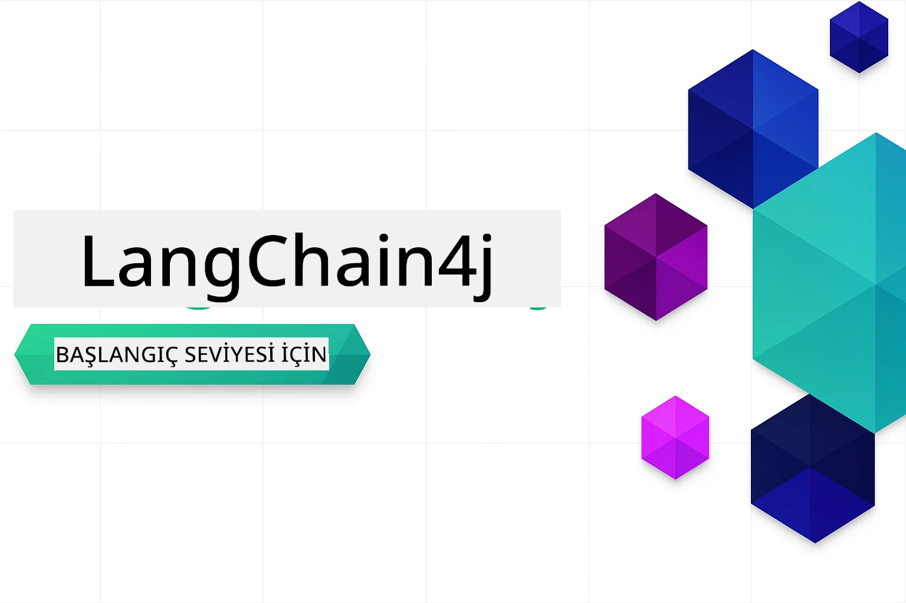

# LangChain4j Yeni Başlayanlar İçin

LangChain4j ve Azure OpenAI GPT-5.2 ile temel sohbetten AI ajanlarına kadar AI uygulamaları geliştirme kursu.

### 🌐 Çok Dilli Destek

#### GitHub Action ile Desteklenmektedir (Otomatik ve Her Zaman Güncel)

<!-- CO-OP TRANSLATOR LANGUAGES TABLE START -->
[Arabic](../ar/README.md) | [Bengali](../bn/README.md) | [Bulgarian](../bg/README.md) | [Burmese (Myanmar)](../my/README.md) | [Chinese (Simplified)](../zh-CN/README.md) | [Chinese (Traditional, Hong Kong)](../zh-HK/README.md) | [Chinese (Traditional, Macau)](../zh-MO/README.md) | [Chinese (Traditional, Taiwan)](../zh-TW/README.md) | [Croatian](../hr/README.md) | [Czech](../cs/README.md) | [Danish](../da/README.md) | [Dutch](../nl/README.md) | [Estonian](../et/README.md) | [Finnish](../fi/README.md) | [French](../fr/README.md) | [German](../de/README.md) | [Greek](../el/README.md) | [Hebrew](../he/README.md) | [Hindi](../hi/README.md) | [Hungarian](../hu/README.md) | [Indonesian](../id/README.md) | [Italian](../it/README.md) | [Japanese](../ja/README.md) | [Kannada](../kn/README.md) | [Khmer](../km/README.md) | [Korean](../ko/README.md) | [Lithuanian](../lt/README.md) | [Malay](../ms/README.md) | [Malayalam](../ml/README.md) | [Marathi](../mr/README.md) | [Nepali](../ne/README.md) | [Nigerian Pidgin](../pcm/README.md) | [Norwegian](../no/README.md) | [Persian (Farsi)](../fa/README.md) | [Polish](../pl/README.md) | [Portuguese (Brazil)](../pt-BR/README.md) | [Portuguese (Portugal)](../pt-PT/README.md) | [Punjabi (Gurmukhi)](../pa/README.md) | [Romanian](../ro/README.md) | [Russian](../ru/README.md) | [Serbian (Cyrillic)](../sr/README.md) | [Slovak](../sk/README.md) | [Slovenian](../sl/README.md) | [Spanish](../es/README.md) | [Swahili](../sw/README.md) | [Swedish](../sv/README.md) | [Tagalog (Filipino)](../tl/README.md) | [Tamil](../ta/README.md) | [Telugu](../te/README.md) | [Thai](../th/README.md) | [Turkish](./README.md) | [Ukrainian](../uk/README.md) | [Urdu](../ur/README.md) | [Vietnamese](../vi/README.md)

> **Yerel Olarak Klonlamayı Tercih Ediyor musunuz?**
>
> Bu depo, indirilen boyutu önemli ölçüde artıran 50'den fazla dil çevirisini içerir. Çeviriler olmadan klonlamak için seyrek kontrol (sparse checkout) kullanın:
>
> **Bash / macOS / Linux:**
> ```bash
> git clone --filter=blob:none --sparse https://github.com/microsoft/LangChain4j-for-Beginners.git
> cd LangChain4j-for-Beginners
> git sparse-checkout set --no-cone '/*' '!translations' '!translated_images'
> ```
>
> **CMD (Windows):**
> ```cmd
> git clone --filter=blob:none --sparse https://github.com/microsoft/LangChain4j-for-Beginners.git
> cd LangChain4j-for-Beginners
> git sparse-checkout set --no-cone "/*" "!translations" "!translated_images"
> ```
>
> Bu, kursu tamamlamak için ihtiyacınız olan her şeyi çok daha hızlı indirme ile sağlar.
<!-- CO-OP TRANSLATOR LANGUAGES TABLE END -->

## İçindekiler

1. [Giriş](01-introduction/README.md) - LangChain4j'nin temellerini öğrenin
2. [Prompt Mühendisliği](02-prompt-engineering/README.md) - Etkili prompt tasarımında ustalaşın
3. [RAG (Retrieval-Augmented Generation)](03-rag/README.md) - Akıllı bilgi tabanlı sistemler oluşturun
4. [Araçlar](04-tools/README.md) - Harici araçlar ve basit asistanlar entegre edin
5. [MCP (Model Context Protocol)](05-mcp/README.md) - Model Context Protocol (MCP) ve Ajans modülleri ile çalışın

### Video Anlatımlar

Her modül, kavramları ve kodu adım adım anlattığımız bir canlı oturum ile birlikte gelir.

| Modül | Video |
|-------|-------|
| 01 - Giriş | [LangChain4j ile Başlarken](https://www.youtube.com/live/nl_troDm8rQ) |
| 02 - Prompt Mühendisliği | [LangChain4j ile Prompt Mühendisliği](https://www.youtube.com/live/PJ6aBaE6bog) |
| 03 - RAG | [LangChain4j ile RAG](https://www.youtube.com/watch?v=_olq75ZH_eY) |
| 04 - Araçlar & 05 - MCP | [Araçlar ve MCP ile AI Ajanları](https://www.youtube.com/watch?v=O_J30kZc0rw) |

---

## Öğrenme Yolu

**LangChain4j'e yeni misiniz?** Anahtar terimler ve kavramlar için [Sözlüğe](docs/GLOSSARY.md) göz atın.

> **Hızlı Başlangıç**

1. Bu depoyu GitHub hesabınıza çatallayın (fork)
2. **Code** → **Codespaces** sekmesine tıklayın → **...** → **Seçeneklerle Yeni...**
3. Varsayılanları kullanın – bu kurs için oluşturulan Geliştirme konteynerini seçer
4. **Kodespace oluştur** butonuna tıklayın
5. Ortamın hazır olması için 5-10 dakika bekleyin
6. Başlamak için doğrudan [Giriş](./01-introduction/README.md) bölümüne atlayın!

Modülleri tamamladıktan sonra, LangChain4j test kavramlarını uygulamada görmek için [Test Rehberini](docs/TESTING.md) keşfedin.

> **Not:** Bu eğitim Azure OpenAI kullanmaktadır. Henüz hesabınız yoksa [ÜCRETSİZ Azure hesabı](https://aka.ms/azure-free-account) ile başlayın.


## GitHub Copilot ile Öğrenme

Hemen kod yazmaya başlamak için bu projeyi GitHub Codespace'de veya sağlanan devcontainer ile yerel IDE'nizde açın. Bu kursta kullanılan devcontainer, AI eşliğinde programlama için önden yapılandırılmış GitHub Copilot içerir.

Her kod örneği, GitHub Copilot'a sorabileceğiniz önerilen soruları içerir ve böylece kavrayışınızı derinleştirebilirsiniz. 💡/🤖 ipuçlarını şu yerlerde arayın:

- **Java dosya başlıkları** - Her örneğe özel sorular
- **Modül README dosyaları** - Kod örneklerinden sonra keşif soruları

**Nasıl kullanılır:** Herhangi bir kod dosyasını açın ve Copilot'a önerilen soruları sorun. Proje kod tabanının tüm bağlamını bilir, açıklama yapabilir, genişletebilir ve alternatifler önerebilir.

Daha fazlasını öğrenmek ister misiniz? [AI Eşli Programlama için Copilot](https://aka.ms/GitHubCopilotAI)'a göz atın.


## Ek Kaynaklar

<!-- CO-OP TRANSLATOR OTHER COURSES START -->
### LangChain
[](https://aka.ms/langchain4j-for-beginners)
[](https://aka.ms/langchainjs-for-beginners?WT.mc_id=m365-94501-dwahlin)
[](https://github.com/microsoft/langchain-for-beginners?WT.mc_id=m365-94501-dwahlin)
---

### Azure / Edge / MCP / Ajanlar
[](https://github.com/microsoft/AZD-for-beginners?WT.mc_id=academic-105485-koreyst)
[](https://github.com/microsoft/edgeai-for-beginners?WT.mc_id=academic-105485-koreyst)
[](https://github.com/microsoft/mcp-for-beginners?WT.mc_id=academic-105485-koreyst)
[](https://github.com/microsoft/ai-agents-for-beginners?WT.mc_id=academic-105485-koreyst)

---
 
### Üretken AI Serisi
[](https://github.com/microsoft/generative-ai-for-beginners?WT.mc_id=academic-105485-koreyst)
[-9333EA?style=for-the-badge&labelColor=E5E7EB&color=9333EA)](https://github.com/microsoft/Generative-AI-for-beginners-dotnet?WT.mc_id=academic-105485-koreyst)
[-C084FC?style=for-the-badge&labelColor=E5E7EB&color=C084FC)](https://github.com/microsoft/generative-ai-for-beginners-java?WT.mc_id=academic-105485-koreyst)
[-E879F9?style=for-the-badge&labelColor=E5E7EB&color=E879F9)](https://github.com/microsoft/generative-ai-with-javascript?WT.mc_id=academic-105485-koreyst)

---
 
### Temel Öğrenme
[](https://aka.ms/ml-beginners?WT.mc_id=academic-105485-koreyst)
[](https://aka.ms/datascience-beginners?WT.mc_id=academic-105485-koreyst)
[](https://aka.ms/ai-beginners?WT.mc_id=academic-105485-koreyst)
[](https://github.com/microsoft/Security-101?WT.mc_id=academic-96948-sayoung)

[](https://aka.ms/webdev-beginners?WT.mc_id=academic-105485-koreyst)
[](https://aka.ms/iot-beginners?WT.mc_id=academic-105485-koreyst)
[](https://github.com/microsoft/xr-development-for-beginners?WT.mc_id=academic-105485-koreyst)

---
 
### Copilot Serisi
[](https://aka.ms/GitHubCopilotAI?WT.mc_id=academic-105485-koreyst)
[](https://github.com/microsoft/mastering-github-copilot-for-dotnet-csharp-developers?WT.mc_id=academic-105485-koreyst)
[](https://github.com/microsoft/CopilotAdventures?WT.mc_id=academic-105485-koreyst)
<!-- CO-OP TRANSLATOR OTHER COURSES END -->

## Yardım Alma

Takılırsanız veya AI uygulamaları geliştirme hakkında sorularınız varsa katılın:

[](https://aka.ms/foundry/discord)

Ürün geri bildirimi veya geliştirirken oluşan hatalar için ziyaret edin:

[](https://aka.ms/foundry/forum)

## Lisans

MIT Lisansı - Ayrıntılar için [LICENSE](../../LICENSE) dosyasına bakın.

---

<!-- CO-OP TRANSLATOR DISCLAIMER START -->
**Feragatname**:
Bu belge, AI çeviri hizmeti [Co-op Translator](https://github.com/Azure/co-op-translator) kullanılarak çevrilmiştir. Doğruluk için çaba sarf etsek de, otomatik çevirilerin hata veya yanlışlık içerebileceğini lütfen unutmayınız. Orijinal belge, kendi dilinde yetkili kaynak olarak kabul edilmelidir. Kritik bilgiler için profesyonel insan çevirisi önerilir. Bu çevirinin kullanımı sonucu ortaya çıkabilecek yanlış anlamalardan veya yanlış yorumlamalardan sorumlu değiliz.
<!-- CO-OP TRANSLATOR DISCLAIMER END -->