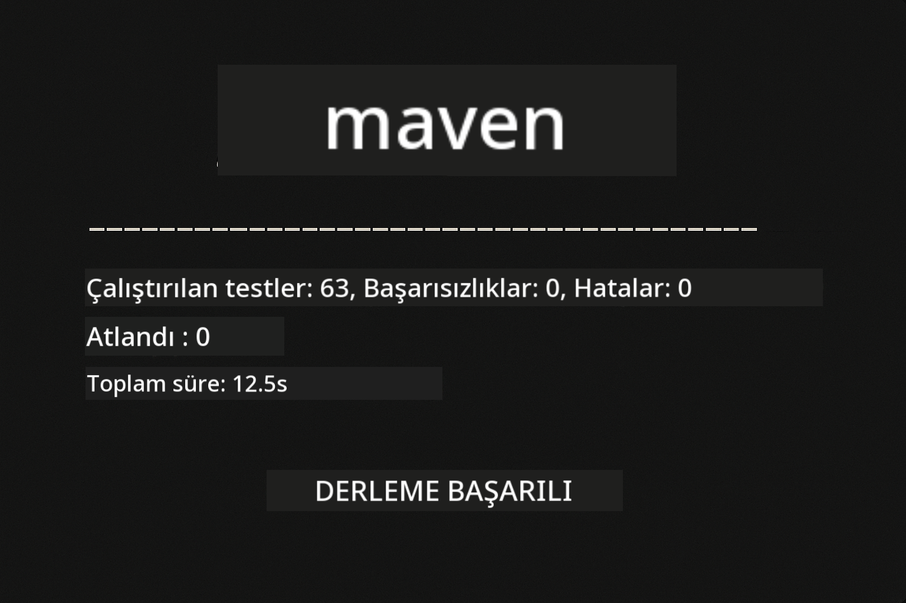
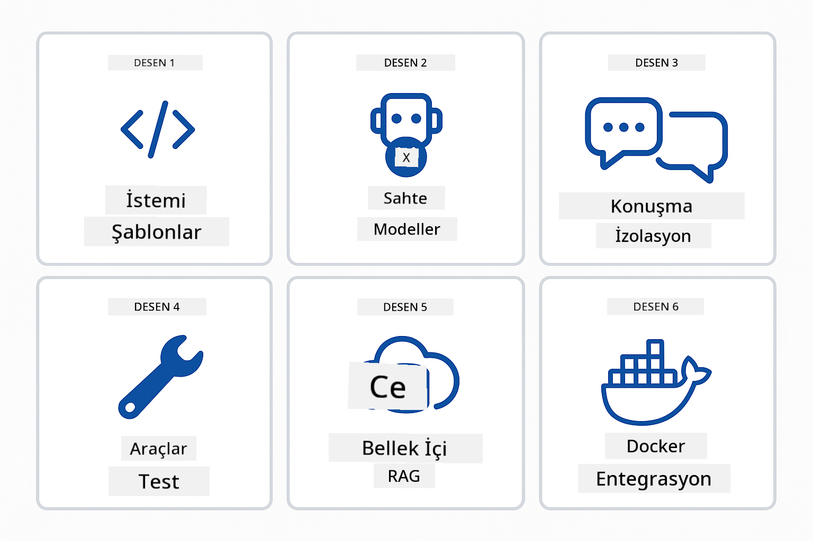
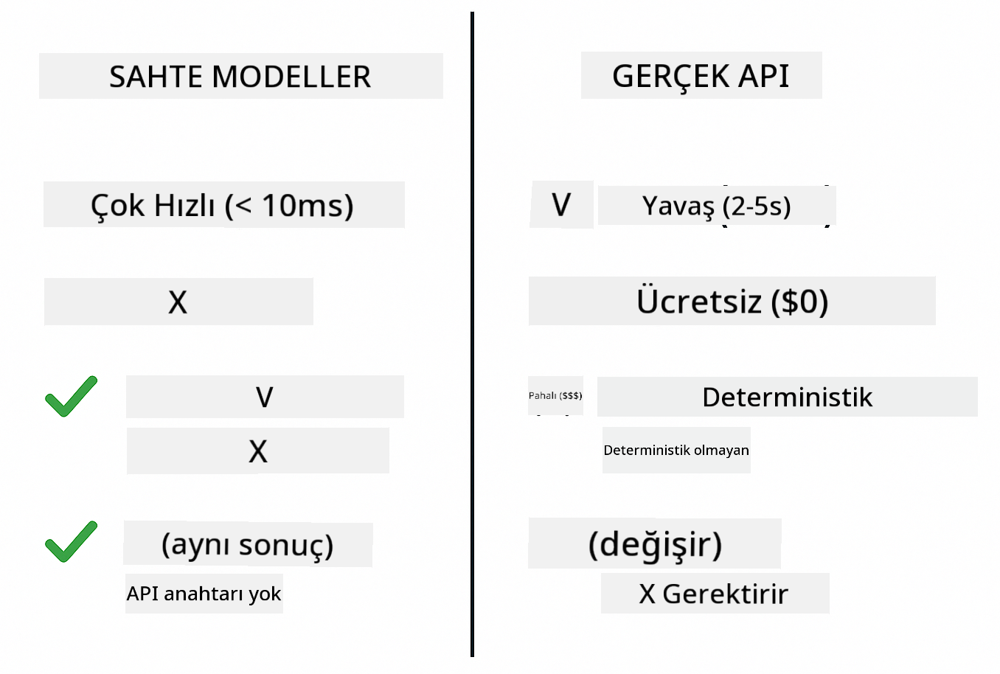

<!--
CO_OP_TRANSLATOR_METADATA:
{
  "original_hash": "b975537560c404d5f254331832811e78",
  "translation_date": "2025-12-13T21:01:21+00:00",
  "source_file": "docs/TESTING.md",
  "language_code": "tr"
}
-->
# LangChain4j Uygulamalarını Test Etme

## İçindekiler

- [Hızlı Başlangıç](../../../docs)
- [Testlerin Kapsadığı Konular](../../../docs)
- [Testleri Çalıştırma](../../../docs)
- [VS Code'da Testleri Çalıştırma](../../../docs)
- [Test Desenleri](../../../docs)
- [Test Felsefesi](../../../docs)
- [Sonraki Adımlar](../../../docs)

Bu rehber, API anahtarları veya dış hizmetler gerektirmeden AI uygulamalarını nasıl test edeceğinizi gösteren testler üzerinden sizi yönlendirir.

## Hızlı Başlangıç

Tüm testleri tek bir komutla çalıştırın:

**Bash:**
```bash
mvn test
```

**PowerShell:**
```powershell
mvn --% test
```



*Tüm testlerin sıfır hata ile geçtiğini gösteren başarılı test çalıştırması*

## Testlerin Kapsadığı Konular

Bu kurs, yerel olarak çalışan **birim testlerine** odaklanır. Her test, LangChain4j kavramını izole şekilde gösterir.


*Birim testleri (hızlı, izole), entegrasyon testleri (gerçek bileşenler) ve uçtan uca testler (Docker ile tam sistem) arasındaki dengeyi gösteren test piramidi. Bu eğitim birim testlerini kapsar.*

| Modül | Testler | Odak | Ana Dosyalar |
|--------|-------|-------|-----------|
| **00 - Hızlı Başlangıç** | 6 | İstek şablonları ve değişken yerleştirme | `SimpleQuickStartTest.java` |
| **01 - Giriş** | 8 | Konuşma belleği ve durumlu sohbet | `SimpleConversationTest.java` |
| **02 - İstek Mühendisliği** | 12 | GPT-5 desenleri, istek seviyeleri, yapılandırılmış çıktı | `SimpleGpt5PromptTest.java` |
| **03 - RAG** | 10 | Doküman alma, gömme, benzerlik araması | `DocumentServiceTest.java` |
| **04 - Araçlar** | 12 | Fonksiyon çağrısı ve araç zincirleme | `SimpleToolsTest.java` |
| **05 - MCP** | 15 | Docker ile Model Context Protocol | `SimpleMcpTest.java`, `McpDockerTransportTest.java` |

## Testleri Çalıştırma

**Tüm testleri kök dizinden çalıştırın:**

**Bash:**
```bash
mvn test
```

**PowerShell:**
```powershell
mvn --% test
```

**Belirli bir modül için testleri çalıştırın:**

**Bash:**
```bash
cd 01-introduction && mvn test
# Veya kök dizinden
mvn test -pl 01-introduction
```

**PowerShell:**
```powershell
cd 01-introduction; mvn --% test
# Veya kök dizinden
mvn --% test -pl 01-introduction
```

**Tek bir test sınıfını çalıştırın:**

**Bash:**
```bash
mvn test -Dtest=SimpleConversationTest
```

**PowerShell:**
```powershell
mvn --% test -Dtest=SimpleConversationTest
```

**Belirli bir test metodunu çalıştırın:**

**Bash:**
```bash
mvn test -Dtest=SimpleConversationTest#Konuşma geçmişi korunmalı mı
```

**PowerShell:**
```powershell
mvn --% test -Dtest=SimpleConversationTest#Konuşma geçmişi korunmalı mı
```

## VS Code'da Testleri Çalıştırma

Visual Studio Code kullanıyorsanız, Test Gezgini testleri çalıştırmak ve hata ayıklamak için grafiksel bir arayüz sağlar.


*VS Code Test Gezgini, tüm Java test sınıflarını ve bireysel test metodlarını gösteren test ağacını gösteriyor*

**VS Code'da testleri çalıştırmak için:**

1. Aktivite Çubuğundaki beher simgesine tıklayarak Test Gezgini'ni açın
2. Tüm modülleri ve test sınıflarını görmek için test ağacını genişletin
3. Herhangi bir testi tek tek çalıştırmak için yanındaki oynat düğmesine tıklayın
4. Tüm testleri çalıştırmak için "Tüm Testleri Çalıştır" seçeneğine tıklayın
5. Herhangi bir teste sağ tıklayıp "Testi Hata Ayıkla" seçeneği ile kesme noktaları koyup kodda adım adım ilerleyin

Test Gezgini, geçen testler için yeşil onay işaretleri gösterir ve başarısız testlerde ayrıntılı hata mesajları sağlar.

## Test Desenleri



*LangChain4j uygulamaları için altı test deseni: istek şablonları, model taklidi, konuşma izolasyonu, araç testi, bellekte RAG ve Docker entegrasyonu*

### Desen 1: İstek Şablonlarını Test Etme

En basit desen, herhangi bir AI modeli çağırmadan istek şablonlarını test eder. Değişken yerleştirmenin doğru çalıştığını ve isteklerin beklenen biçimde olduğunu doğrularsınız.


*Değişken yerleştirme akışını gösteren istek şablonu testi: yer tutuculu şablon → değerler uygulanır → biçimlendirilmiş çıktı doğrulanır*

```java
@Test
@DisplayName("Should format prompt template with variables")
void testPromptTemplateFormatting() {
    PromptTemplate template = PromptTemplate.from(
        "Best time to visit {{destination}} for {{activity}}?"
    );
    
    Prompt prompt = template.apply(Map.of(
        "destination", "Paris",
        "activity", "sightseeing"
    ));
    
    assertThat(prompt.text()).isEqualTo("Best time to visit Paris for sightseeing?");
}
```

Bu test `00-quick-start/src/test/java/com/example/langchain4j/quickstart/SimpleQuickStartTest.java` dosyasında bulunur.

**Çalıştırmak için:**

**Bash:**
```bash
cd 00-quick-start && mvn test -Dtest=SimpleQuickStartTest#testİstekŞablonuBiçimlendirme
```

**PowerShell:**
```powershell
cd 00-quick-start; mvn --% test -Dtest=SimpleQuickStartTest#testİstekŞablonuBiçimlendirme
```

### Desen 2: Dil Modellerini Taklit Etme

Konuşma mantığını test ederken, önceden belirlenmiş yanıtlar döndüren sahte modeller oluşturmak için Mockito kullanın. Bu testleri hızlı, ücretsiz ve belirlenebilir yapar.



*Test için neden sahte modellerin tercih edildiğini gösteren karşılaştırma: hızlı, ücretsiz, belirlenebilir ve API anahtarı gerektirmez*

```java
@ExtendWith(MockitoExtension.class)
class SimpleConversationTest {
    
    private ConversationService conversationService;
    
    @Mock
    private OpenAiOfficialChatModel mockChatModel;
    
    @BeforeEach
    void setUp() {
        ChatResponse mockResponse = ChatResponse.builder()
            .aiMessage(AiMessage.from("This is a test response"))
            .build();
        when(mockChatModel.chat(anyList())).thenReturn(mockResponse);
        
        conversationService = new ConversationService(mockChatModel);
    }
    
    @Test
    void shouldMaintainConversationHistory() {
        String conversationId = conversationService.startConversation();
        
        ChatResponse mockResponse1 = ChatResponse.builder()
            .aiMessage(AiMessage.from("Response 1"))
            .build();
        ChatResponse mockResponse2 = ChatResponse.builder()
            .aiMessage(AiMessage.from("Response 2"))
            .build();
        ChatResponse mockResponse3 = ChatResponse.builder()
            .aiMessage(AiMessage.from("Response 3"))
            .build();
        
        when(mockChatModel.chat(anyList()))
            .thenReturn(mockResponse1)
            .thenReturn(mockResponse2)
            .thenReturn(mockResponse3);

        conversationService.chat(conversationId, "First message");
        conversationService.chat(conversationId, "Second message");
        conversationService.chat(conversationId, "Third message");

        List<ChatMessage> history = conversationService.getHistory(conversationId);
        assertThat(history).hasSize(6); // 3 kullanıcı + 3 yapay zeka mesajı
    }
}
```

Bu desen `01-introduction/src/test/java/com/example/langchain4j/service/SimpleConversationTest.java` dosyasında yer alır. Sahte model, bellek yönetiminin doğru çalıştığını doğrulamanızı sağlar.

### Desen 3: Konuşma İzolasyonunu Test Etme

Konuşma belleği, birden fazla kullanıcıyı ayrı tutmalıdır. Bu test, konuşmaların bağlamları karıştırmadığını doğrular.


*Farklı kullanıcılar için ayrı bellek depolarını gösteren konuşma izolasyonu testi, bağlam karışmasını önler*

```java
@Test
void shouldIsolateConversationsByid() {
    String conv1 = conversationService.startConversation();
    String conv2 = conversationService.startConversation();
    
    ChatResponse mockResponse = ChatResponse.builder()
        .aiMessage(AiMessage.from("Response"))
        .build();
    when(mockChatModel.chat(anyList())).thenReturn(mockResponse);

    conversationService.chat(conv1, "Message for conversation 1");
    conversationService.chat(conv2, "Message for conversation 2");

    List<ChatMessage> history1 = conversationService.getHistory(conv1);
    List<ChatMessage> history2 = conversationService.getHistory(conv2);
    
    assertThat(history1).hasSize(2);
    assertThat(history2).hasSize(2);
}
```

Her konuşma kendi bağımsız geçmişini tutar. Üretim sistemlerinde bu izolasyon çok kullanıcılı uygulamalar için kritiktir.

### Desen 4: Araçları Bağımsız Test Etme

Araçlar, AI'nın çağırabileceği fonksiyonlardır. AI kararlarından bağımsız olarak doğru çalıştıklarını doğrulamak için doğrudan test edin.


*AI çağrısı olmadan iş mantığını doğrulamak için sahte araç yürütmesini gösteren araçların bağımsız testi*

```java
@Test
void shouldConvertCelsiusToFahrenheit() {
    TemperatureTool tempTool = new TemperatureTool();
    String result = tempTool.celsiusToFahrenheit(25.0);
    assertThat(result).containsPattern("77[.,]0°F");
}

@Test
void shouldDemonstrateToolChaining() {
    WeatherTool weatherTool = new WeatherTool();
    TemperatureTool tempTool = new TemperatureTool();

    String weatherResult = weatherTool.getCurrentWeather("Seattle");
    assertThat(weatherResult).containsPattern("\\d+°C");

    String conversionResult = tempTool.celsiusToFahrenheit(22.0);
    assertThat(conversionResult).containsPattern("71[.,]6°F");
}
```

Bu testler `04-tools/src/test/java/com/example/langchain4j/agents/tools/SimpleToolsTest.java` dosyasından alınmıştır ve AI katılımı olmadan araç mantığını doğrular. Zincirleme örneği, bir aracın çıktısının diğerinin girdisi olarak nasıl kullanıldığını gösterir.

### Desen 5: Bellekte RAG Testi

RAG sistemleri geleneksel olarak vektör veritabanları ve gömme servisleri gerektirir. Bellekte desen, tüm hattı dış bağımlılıklar olmadan test etmenizi sağlar.


*Veritabanı gerektirmeden doküman ayrıştırma, gömme depolama ve benzerlik aramasını gösteren bellekte RAG testi iş akışı*

```java
@Test
void testProcessTextDocument() {
    String content = "This is a test document.\nIt has multiple lines.";
    InputStream inputStream = new ByteArrayInputStream(content.getBytes(StandardCharsets.UTF_8));
    
    DocumentService.ProcessedDocument result = 
        documentService.processDocument(inputStream, "test.txt");

    assertNotNull(result);
    assertTrue(result.segments().size() > 0);
    assertEquals("test.txt", result.segments().get(0).metadata().getString("filename"));
}
```

Bu test `03-rag/src/test/java/com/example/langchain4j/rag/service/DocumentServiceTest.java` dosyasından olup, bellekte bir doküman oluşturur ve parçalara ayırma ile meta veri işlemlerini doğrular.

### Desen 6: Docker ile Entegrasyon Testi

Bazı özellikler gerçek altyapı gerektirir. MCP modülü, entegrasyon testleri için Docker konteynerlerini Testcontainers ile başlatır. Bunlar, kodunuzun gerçek servislerle çalıştığını doğrularken test izolasyonunu korur.


*Testcontainers ile otomatik konteyner yaşam döngüsünü gösteren MCP entegrasyon testi: başlat, test çalıştır, durdur ve temizle*

`05-mcp/src/test/java/com/example/langchain4j/mcp/McpDockerTransportTest.java` dosyasındaki testler için Docker'ın çalışıyor olması gerekir.

**Çalıştırmak için:**

**Bash:**
```bash
cd 05-mcp && mvn test
```

**PowerShell:**
```powershell
cd 05-mcp; mvn --% test
```

## Test Felsefesi

Kodunuzu test edin, AI'yı değil. Testleriniz, isteklerin nasıl oluşturulduğunu, belleğin nasıl yönetildiğini ve araçların nasıl çalıştığını kontrol ederek yazdığınız kodu doğrulamalıdır. AI yanıtları değişkendir ve test doğrulamalarının parçası olmamalıdır. İstek şablonunuzun değişkenleri doğru şekilde yerleştirip yerleştirmediğini sorun, AI'nın doğru cevabı verip vermediğini değil.

Dil modelleri için sahte modeller kullanın. Bunlar yavaş, pahalı ve belirlenemez dış bağımlılıklardır. Sahte modeller testleri saniyeler yerine milisaniyeler içinde hızlı, API maliyeti olmadan ücretsiz ve her seferinde aynı sonucu veren belirlenebilir yapar.

Testleri bağımsız tutun. Her test kendi verisini kurmalı, diğer testlere bağlı olmamalı ve kendini temizlemelidir. Testler çalıştırma sırasından bağımsız olarak geçmelidir.

Mutlu yolun ötesinde uç durumları test edin. Boş girdiler, çok büyük girdiler, özel karakterler, geçersiz parametreler ve sınır durumlarını deneyin. Bunlar genellikle normal kullanımda ortaya çıkmayan hataları ortaya çıkarır.

Açıklayıcı isimler kullanın. `shouldMaintainConversationHistoryAcrossMultipleMessages()` ile `test1()` karşılaştırın. İlki tam olarak ne test edildiğini söyler, hata ayıklamayı çok kolaylaştırır.

## Sonraki Adımlar

Test desenlerini anladıysanız, her modüle daha derinlemesine dalın:

- **[00 - Hızlı Başlangıç](../00-quick-start/README.md)** - İstek şablonu temelleriyle başlayın
- **[01 - Giriş](../01-introduction/README.md)** - Konuşma bellek yönetimini öğrenin
- **[02 - İstek Mühendisliği](../02-prompt-engineering/README.md)** - GPT-5 istek desenlerinde ustalaşın
- **[03 - RAG](../03-rag/README.md)** - Geri getirme destekli üretim sistemleri kurun
- **[04 - Araçlar](../04-tools/README.md)** - Fonksiyon çağrısı ve araç zincirleri uygulayın
- **[05 - MCP](../05-mcp/README.md)** - Model Context Protocol'u Docker ile entegre edin

Her modülün README dosyası burada test edilen kavramların ayrıntılı açıklamalarını sağlar.

---

**Gezinme:** [← Ana Sayfaya Dön](../README.md)

---

<!-- CO-OP TRANSLATOR DISCLAIMER START -->
**Feragatname**:  
Bu belge, AI çeviri servisi [Co-op Translator](https://github.com/Azure/co-op-translator) kullanılarak çevrilmiştir. Doğruluk için çaba gösterilse de, otomatik çevirilerin hatalar veya yanlışlıklar içerebileceğini lütfen unutmayınız. Orijinal belge, kendi dilinde yetkili kaynak olarak kabul edilmelidir. Kritik bilgiler için profesyonel insan çevirisi önerilir. Bu çevirinin kullanımı sonucu oluşabilecek yanlış anlamalar veya yorum hatalarından sorumlu değiliz.
<!-- CO-OP TRANSLATOR DISCLAIMER END -->