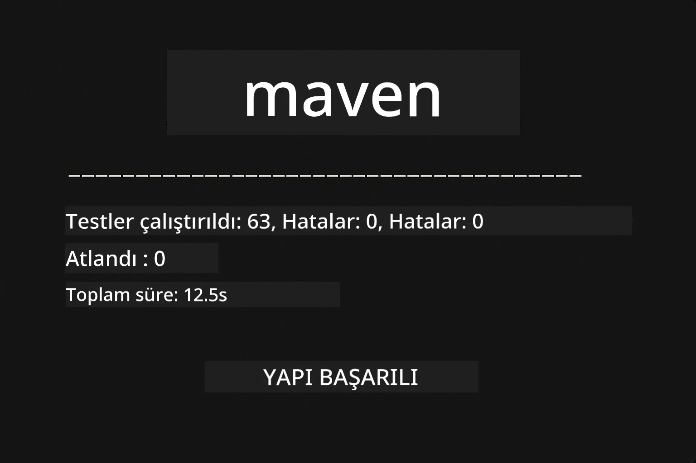
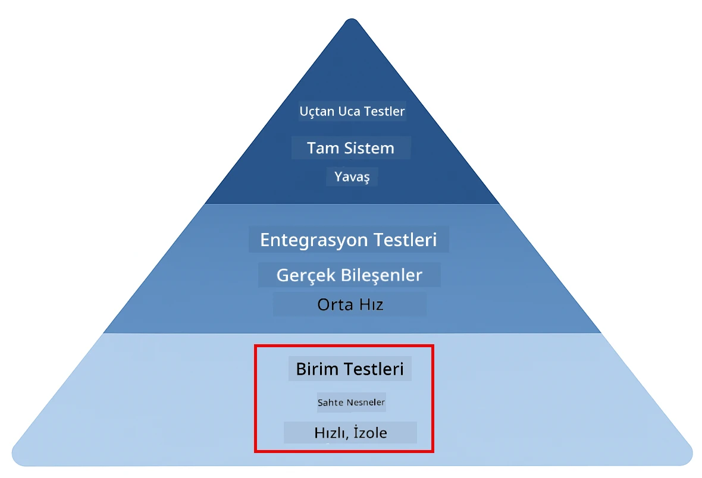
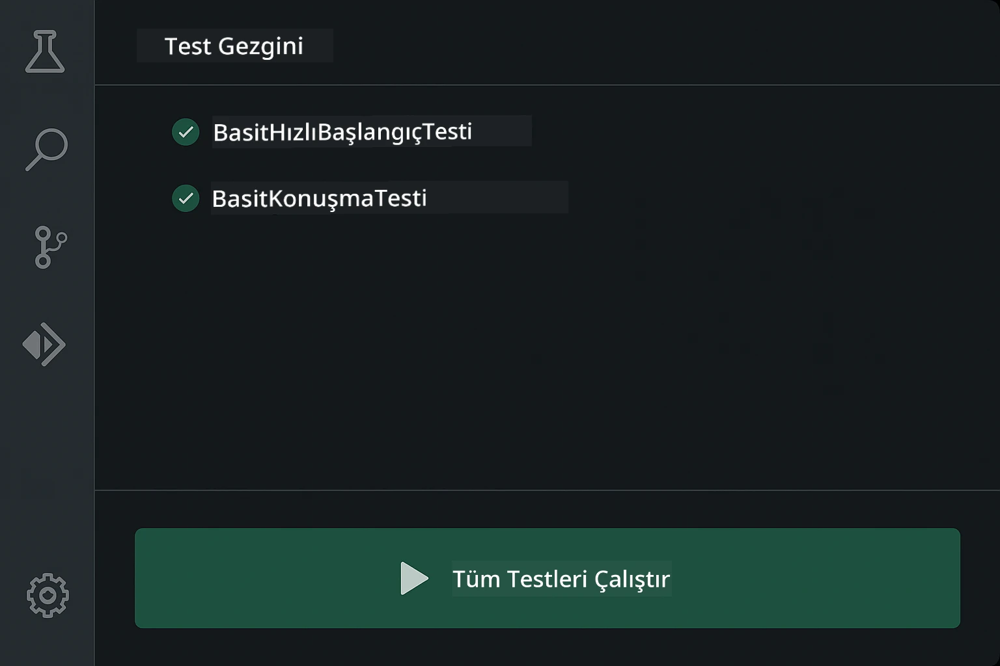
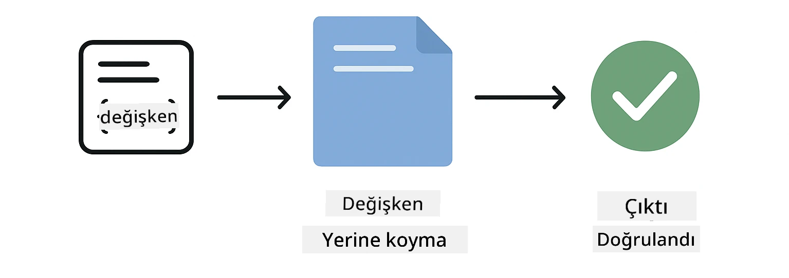
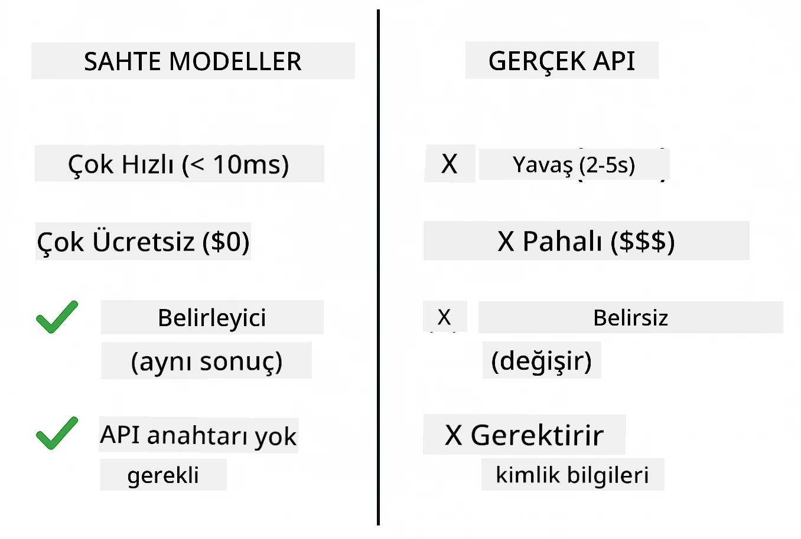
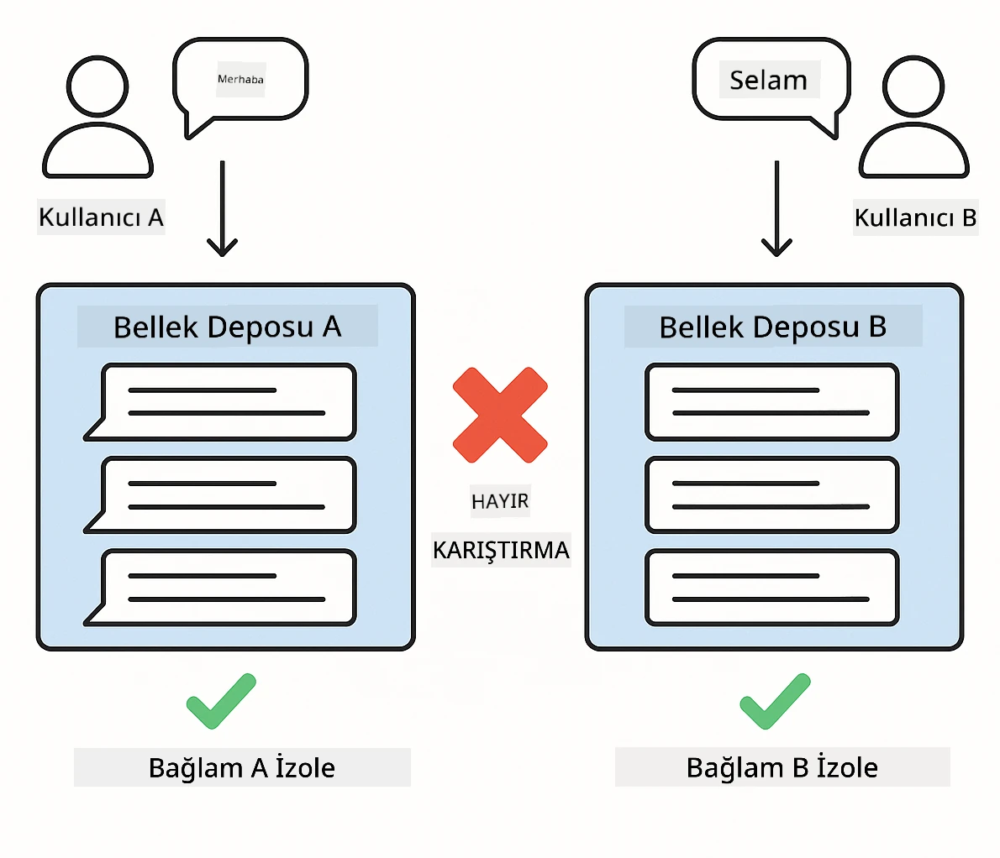
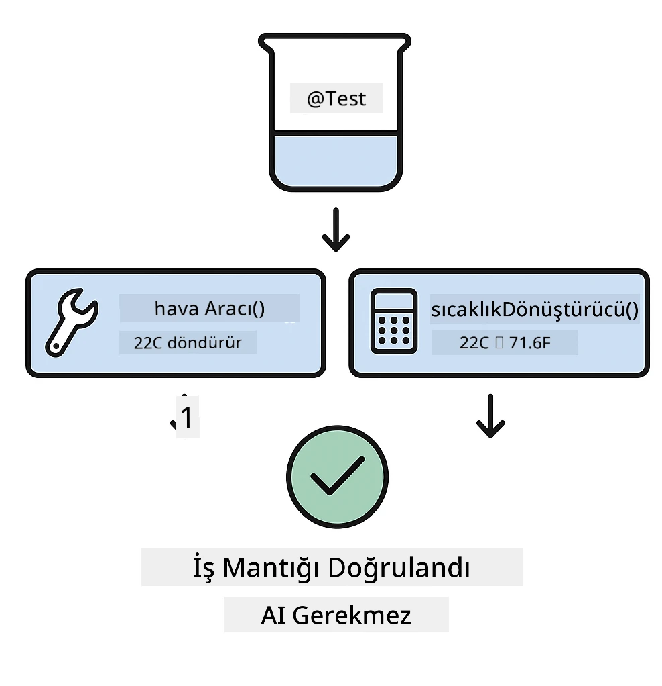
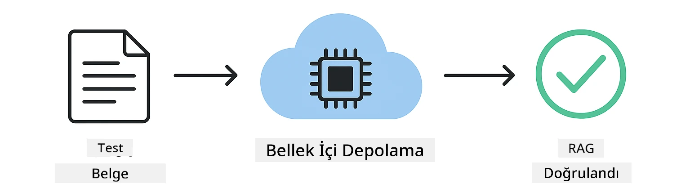

# LangChain4j Uygulamalarını Test Etme

## İçindekiler

- [Hızlı Başlangıç](#hızlı-başlangıç)
- [Testlerin Kapsadığı Konular](#testlerin-kapsadığı-konular)
- [Testleri Çalıştırma](#testleri-çalıştırma)
- [VS Code'da Testleri Çalıştırma](#vs-code’da-testleri-çalıştırma)
- [Test Desenleri](#test-desenleri)
- [Test Felsefesi](#test-felsefesi)
- [Sonraki Adımlar](#sonraki-adımlar)

Bu rehber, API anahtarı veya dış servis gerektirmeden yapay zeka uygulamalarını nasıl test edeceğinizi gösteren testleri adım adım anlatır.

## Hızlı Başlangıç

Tüm testleri tek komutla çalıştırın:

**Bash:**
```bash
mvn test
```

**PowerShell:**
```powershell
mvn --% test
```

Tüm testler geçtiğinde, aşağıdaki ekran görüntüsündeki gibi bir çıktı görmelisiniz — testler sıfır hata ile çalışır.



*Başarılı test çalıştırması, tüm testlerin sıfır hata ile geçtiğini gösteriyor*

## Testlerin Kapsadığı Konular

Bu kurs, yerel olarak çalışan **birim testlere** odaklanır. Her test, LangChain4j'nin belirli bir kavramını izole şekilde gösterir. Aşağıdaki test piramidi birim testlerin nerede durduğunu gösterir — hızlı ve güvenilir temeli oluştururlar, diğer test stratejileriniz bunların üzerine inşa edilir.



*Test piramidi, birim testlerin (hızlı, izole), entegrasyon testlerinin (gerçek bileşenler) ve uçtan uca testlerin dengesini gösterir. Bu eğitim birim testi kapsar.*

| Modül | Testler | Odak | Ana Dosyalar |
|--------|-------|-------|-----------|
| **01 - Giriş** | 8 | Konuşma hafızası ve durumlu sohbet | `SimpleConversationTest.java` |
| **02 - Prompt Mühendisliği** | 12 | GPT-5.2 desenleri, istek seviyeleri, yapılandırılmış çıktı | `SimpleGpt5PromptTest.java` |
| **03 - RAG** | 10 | Doküman alımı, gömme işlemleri, benzerlik araması | `DocumentServiceTest.java` |
| **04 - Araçlar** | 12 | Fonksiyon çağırma ve araç zinciri | `SimpleToolsTest.java` |
| **05 - MCP** | 8 | Model Context Protocol, stdio transport ile | `SimpleMcpTest.java` |

## Testleri Çalıştırma

**Tüm testleri kök dizinden çalıştırın:**

**Bash:**
```bash
mvn test
```

**PowerShell:**
```powershell
mvn --% test
```

**Belirli bir modülün testlerini çalıştırın:**

**Bash:**
```bash
cd 01-introduction && mvn test
# Ya da kök dizinden
mvn test -pl 01-introduction
```

**PowerShell:**
```powershell
cd 01-introduction; mvn --% test
# Veya kök dizinden
mvn --% test -pl 01-introduction
```

**Tek bir test sınıfını çalıştırın:**

**Bash:**
```bash
mvn test -Dtest=SimpleConversationTest
```

**PowerShell:**
```powershell
mvn --% test -Dtest=SimpleConversationTest
```

**Belirli bir test metodunu çalıştırın:**

**Bash:**
```bash
mvn test -Dtest=SimpleConversationTest#Konuşma geçmişi korunmalı mı
```

**PowerShell:**
```powershell
mvn --% test -Dtest=SimpleConversationTest#Konuşma geçmişi korunmalı mı
```

## VS Code'da Testleri Çalıştırma

Visual Studio Code kullanıyorsanız, Test Explorer testleri çalıştırmak ve hata ayıklamak için grafiksel bir arayüz sağlar.



*VS Code Test Explorer, tüm Java test sınıflarını ve bireysel test metodlarını gösteren test ağacını sunar*

**VS Code'da testleri çalıştırmak için:**

1. Aktivite Çubuğundaki beherik simgesine tıklayarak Test Explorer'ı açın  
2. Test ağacını genişleterek tüm modülleri ve test sınıflarını görün  
3. Herhangi bir testi tek başına çalıştırmak için yanındaki oynat düğmesine tıklayın  
4. Tüm testleri çalıştırmak için "Run All Tests" seçeneğine tıklayın  
5. Herhangi bir teste sağ tıklayıp "Debug Test" seçerek kesme noktaları ayarlayın ve kodda adım adım ilerleyin  

Test Explorer başarılı testler için yeşil onay işaretleri gösterir ve test başarısız olduğunda detaylı hata mesajları sağlar.

## Test Desenleri

### Desen 1: Prompt Şablonlarını Test Etme

En basit desen, hiç AI modeli çağırmadan prompt şablonlarını test eder. Değişken yer değiştirmesinin doğru işlediğini ve promptların beklenen formatta olduğunu doğrularsınız.



*Değişken yer değiştirme akışını gösteren prompt şablonu testi: yer tutucuları olan şablon → değerlerin uygulanması → biçimlendirilmiş çıktının doğrulanması*

```java
@Test
@DisplayName("Should format prompt template with variables")
void testPromptTemplateFormatting() {
    PromptTemplate template = PromptTemplate.from(
        "Best time to visit {{destination}} for {{activity}}?"
    );
    
    Prompt prompt = template.apply(Map.of(
        "destination", "Paris",
        "activity", "sightseeing"
    ));
    
    assertThat(prompt.text()).isEqualTo("Best time to visit Paris for sightseeing?");
}
```

Bu desen, değişkenlerin doğru şekilde yer değiştirdiğini ve promptların beklenen formatta olduğunu doğrular — API anahtarı veya model çağrısı gerektirmez.

### Desen 2: Dil Modellerini Taklit Etme

Konuşma mantığını test ederken, önceden belirlenmiş cevapları dönen sahte modeller oluşturmak için Mockito kullanın. Bu testleri hızlı, ücretsiz ve deterministik yapar.



*Testlerde neden sahte modellerin tercih edildiğini gösteren karşılaştırma: hızlı, ücretsiz, deterministik ve API anahtarı gerektirmezler*

```java
@ExtendWith(MockitoExtension.class)
class SimpleConversationTest {
    
    private ConversationService conversationService;
    
    @Mock
    private OpenAiOfficialChatModel mockChatModel;
    
    @BeforeEach
    void setUp() {
        ChatResponse mockResponse = ChatResponse.builder()
            .aiMessage(AiMessage.from("This is a test response"))
            .build();
        when(mockChatModel.chat(anyList())).thenReturn(mockResponse);
        
        conversationService = new ConversationService(mockChatModel);
    }
    
    @Test
    void shouldMaintainConversationHistory() {
        String conversationId = conversationService.startConversation();
        
        ChatResponse mockResponse1 = ChatResponse.builder()
            .aiMessage(AiMessage.from("Response 1"))
            .build();
        ChatResponse mockResponse2 = ChatResponse.builder()
            .aiMessage(AiMessage.from("Response 2"))
            .build();
        ChatResponse mockResponse3 = ChatResponse.builder()
            .aiMessage(AiMessage.from("Response 3"))
            .build();
        
        when(mockChatModel.chat(anyList()))
            .thenReturn(mockResponse1)
            .thenReturn(mockResponse2)
            .thenReturn(mockResponse3);

        conversationService.chat(conversationId, "First message");
        conversationService.chat(conversationId, "Second message");
        conversationService.chat(conversationId, "Third message");

        List<ChatMessage> history = conversationService.getHistory(conversationId);
        assertThat(history).hasSize(6); // 3 kullanıcı + 3 AI mesajı
    }
}
```

Bu desen `01-introduction/src/test/java/com/example/langchain4j/service/SimpleConversationTest.java` dosyasında bulunur. Sahte model tutarlı davranış sağlar, böylece hafıza yönetiminin doğru çalıştığını doğrulayabilirsiniz.

### Desen 3: Konuşma İzolasyonunu Test Etme

Konuşma hafızası birden fazla kullanıcıyı ayrı tutmalıdır. Bu test, konuşmaların bağlamları karıştırmadığını doğrular.



*Farklı kullanıcılar için ayrı hafıza depolarını gösteren konuşma izolasyonu testi*

```java
@Test
void shouldIsolateConversationsByid() {
    String conv1 = conversationService.startConversation();
    String conv2 = conversationService.startConversation();
    
    ChatResponse mockResponse = ChatResponse.builder()
        .aiMessage(AiMessage.from("Response"))
        .build();
    when(mockChatModel.chat(anyList())).thenReturn(mockResponse);

    conversationService.chat(conv1, "Message for conversation 1");
    conversationService.chat(conv2, "Message for conversation 2");

    List<ChatMessage> history1 = conversationService.getHistory(conv1);
    List<ChatMessage> history2 = conversationService.getHistory(conv2);
    
    assertThat(history1).hasSize(2);
    assertThat(history2).hasSize(2);
}
```

Her konuşma kendi bağımsız geçmişini korur. Üretim sistemlerinde bu izolasyon çoklu kullanıcı uygulamaları için kritik önemdedir.

### Desen 4: Araçları Bağımsız Test Etme

Araçlar, AI'nın çağırabileceği fonksiyonlardır. AI kararlarından bağımsız olarak doğru çalıştıklarını doğrudan test edin.



*İş mantığını doğrulamak için AI çağrısı olmadan sahte araç yürütmesini gösteren araçların bağımsız testi*

```java
@Test
void shouldConvertCelsiusToFahrenheit() {
    TemperatureTool tempTool = new TemperatureTool();
    String result = tempTool.celsiusToFahrenheit(25.0);
    assertThat(result).containsPattern("77[.,]0°F");
}

@Test
void shouldDemonstrateToolChaining() {
    WeatherTool weatherTool = new WeatherTool();
    TemperatureTool tempTool = new TemperatureTool();

    String weatherResult = weatherTool.getCurrentWeather("Seattle");
    assertThat(weatherResult).containsPattern("\\d+°C");

    String conversionResult = tempTool.celsiusToFahrenheit(22.0);
    assertThat(conversionResult).containsPattern("71[.,]6°F");
}
```

`04-tools/src/test/java/com/example/langchain4j/agents/tools/SimpleToolsTest.java` dosyasındaki bu testler, AI etkisi olmadan araç mantığını doğrular. Zincirleme örneği, bir aracın çıktısının diğerinin girdisi olarak nasıl kullanıldığını gösterir.

### Desen 5: Bellek İçi RAG Testi

RAG sistemleri geleneksel olarak vektör veritabanları ve gömme servisleri gerektirir. Bellek içi desen, dış bağımlılıklar olmadan tüm boru hattını test etmenizi sağlar.



*Veritabanı gerektirmeden doküman ayrıştırma, gömme depolama ve benzerlik aramayı gösteren bellek içi RAG testi iş akışı*

```java
@Test
void testProcessTextDocument() {
    String content = "This is a test document.\nIt has multiple lines.";
    InputStream inputStream = new ByteArrayInputStream(content.getBytes(StandardCharsets.UTF_8));
    
    DocumentService.ProcessedDocument result = 
        documentService.processDocument(inputStream, "test.txt");

    assertNotNull(result);
    assertTrue(result.segments().size() > 0);
    assertEquals("test.txt", result.segments().get(0).metadata().getString("filename"));
}
```

`03-rag/src/test/java/com/example/langchain4j/rag/service/DocumentServiceTest.java` dosyasından bu test, bellekte bir doküman oluşturur ve parçalama ile meta veri işleme adımlarını doğrular.

### Desen 6: MCP Entegrasyon Testi

MCP modülü, stdio transport kullanarak Model Context Protocol entegrasyonunu test eder. Bu testler, uygulamanızın MCP sunucularını alt süreç olarak başlatıp iletişim kurabildiğini doğrular.

`05-mcp/src/test/java/com/example/langchain4j/mcp/SimpleMcpTest.java` dosyasındaki testler MCP istemci davranışını doğrular.

**Çalıştırmak için:**

**Bash:**
```bash
cd 05-mcp && mvn test
```

**PowerShell:**
```powershell
cd 05-mcp; mvn --% test
```

## Test Felsefesi

Kodunuzu test edin, AI'yı değil. Testleriniz, yazdığınız kodu doğrulamalı; promptların nasıl oluşturulduğunu, hafızanın nasıl yönetildiğini ve araçların nasıl yürütüldüğünü kontrol etmelidir. AI yanıtları değişkendir ve test iddialarının parçası olmamalıdır. Sorun kendinize, prompt şablonunuz değişkenleri doğru şekilde değiştiriyor mu olmamalı, AI doğru cevabı veriyor mu olmamalıdır.

Dil modelleri için sahte modeller kullanın. Bunlar dış bağımlılıklardır, yavaş, pahalı ve deterministik olmayan davranış sergilerler. Sahte modeller testleri saniyeler yerine milisaniyeler içinde hızlı, API ücreti olmadan ücretsiz ve her seferinde aynı sonucu veren deterministik yapar.

Testleri bağımsız tutun. Her test kendi verisini kurmalı, diğer testlere bağlı olmamalı ve kendi temizlik işini yapmalıdır. Testler çalıştırma sırasına bakılmaksızın geçmelidir.

Mutlu yolun dışındaki durumları test edin. Boş girişler, çok büyük girdiler, özel karakterler, geçersiz parametreler ve sınır durumlarını deneyin. Bunlar genellikle normal kullanımda ortaya çıkmayan hataları verir.

Anlamlı isimler kullanın. `shouldMaintainConversationHistoryAcrossMultipleMessages()` ile `test1()`’i karşılaştırın. İlki tam olarak ne test edildiğini söyler, hata ayıklamayı çok kolaylaştırır.

## Sonraki Adımlar

Artık test desenlerini anladığınıza göre, her modüle daha derinlemesine dalabilirsiniz:

- **[01 - Giriş](../01-introduction/README.md)** - Konuşma hafızası yönetimini öğrenin  
- **[02 - Prompt Mühendisliği](../02/prompt-engineering/README.md)** - GPT-5.2 prompting desenlerinde ustalaşın  
- **[03 - RAG](../03-rag/README.md)** - Retrieve-augmented generation sistemleri oluşturun  
- **[04 - Araçlar](../04-tools/README.md)** - Fonksiyon çağırma ve araç zincirlerini uygulayın  
- **[05 - MCP](../05-mcp/README.md)** - Model Context Protocol entegrasyonu yapın  

Her modülün README dosyası burada test edilen kavramların detaylı açıklamalarını içerir.

---

**Gezi:** [← Ana Sayfaya Dön](../README.md)

---

<!-- CO-OP TRANSLATOR DISCLAIMER START -->
**Feragatname**:
Bu belge, AI çeviri hizmeti [Co-op Translator](https://github.com/Azure/co-op-translator) kullanılarak çevrilmiştir. Doğruluk için çaba sarf etsek de, otomatik çevirilerin hata veya yanlışlık içerebileceğini lütfen unutmayınız. Orijinal belge, kendi dilinde yetkili kaynak olarak kabul edilmelidir. Kritik bilgiler için profesyonel insan çevirisi önerilir. Bu çevirinin kullanımı sonucu ortaya çıkabilecek yanlış anlamalardan veya yanlış yorumlamalardan sorumlu değiliz.
<!-- CO-OP TRANSLATOR DISCLAIMER END -->