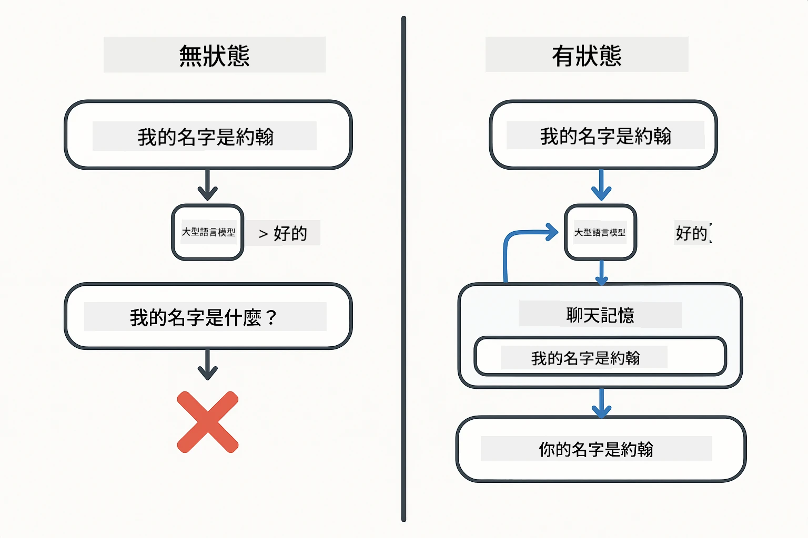
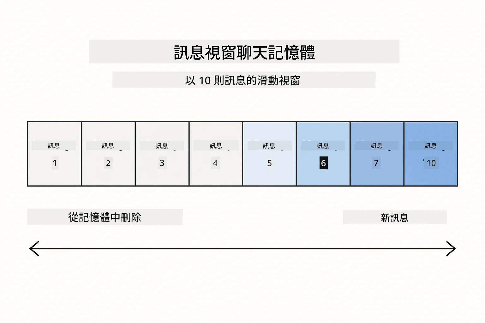
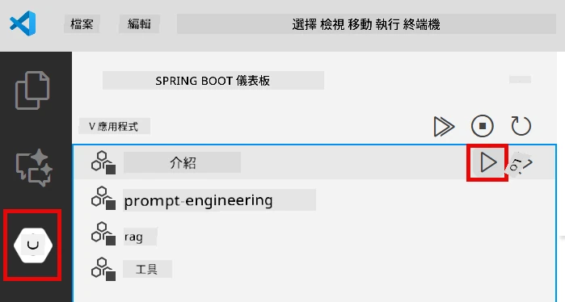
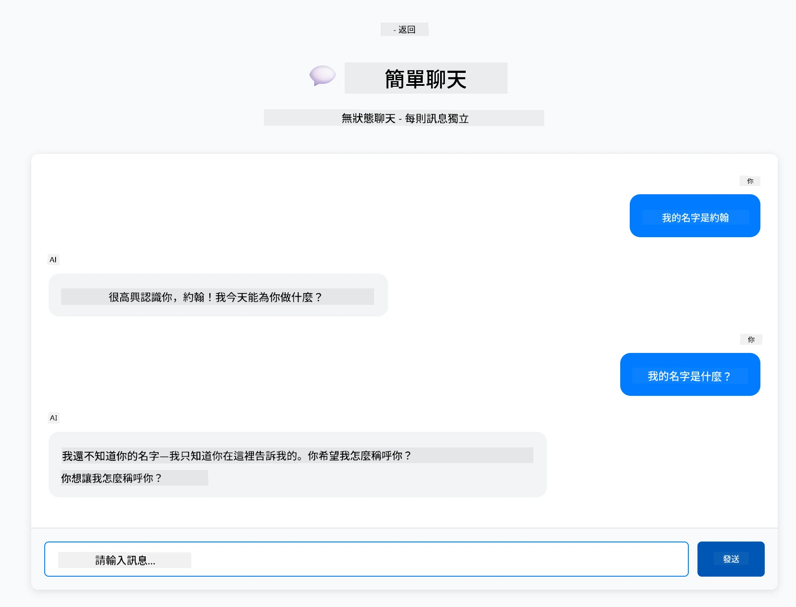

<!--
CO_OP_TRANSLATOR_METADATA:
{
  "original_hash": "c3e07ca58d0b8a3f47d3bf5728541e0a",
  "translation_date": "2025-12-13T13:15:23+00:00",
  "source_file": "01-introduction/README.md",
  "language_code": "tw"
}
-->
# Module 01: LangChain4j 入門

## 目錄

- [你將學到什麼](../../../01-introduction)
- [先決條件](../../../01-introduction)
- [理解核心問題](../../../01-introduction)
- [理解 Tokens](../../../01-introduction)
- [記憶如何運作](../../../01-introduction)
- [如何使用 LangChain4j](../../../01-introduction)
- [部署 Azure OpenAI 基礎架構](../../../01-introduction)
- [本地執行應用程式](../../../01-introduction)
- [使用應用程式](../../../01-introduction)
  - [無狀態聊天（左側面板）](../../../01-introduction)
  - [有狀態聊天（右側面板）](../../../01-introduction)
- [下一步](../../../01-introduction)

## 你將學到什麼

如果你完成了快速入門，你已經看到如何發送提示並獲得回應。這是基礎，但真正的應用程式需要更多。本模組教你如何建立能記住上下文並維持狀態的對話式 AI —— 這是一次性示範與生產就緒應用程式的差別。

本指南將全程使用 Azure OpenAI 的 GPT-5，因為其先進的推理能力讓不同模式的行為更明顯。當你加入記憶功能時，你會清楚看到差異。這讓你更容易理解每個元件為你的應用程式帶來什麼。

你將建立一個示範兩種模式的應用程式：

**無狀態聊天** — 每個請求都是獨立的。模型不會記住之前的訊息。這是你在快速入門中使用的模式。

**有狀態對話** — 每個請求包含對話歷史。模型在多輪對話中維持上下文。這是生產應用程式所需的。

## 先決條件

- 具備 Azure 訂閱並有 Azure OpenAI 存取權
- Java 21、Maven 3.9+
- Azure CLI (https://learn.microsoft.com/en-us/cli/azure/install-azure-cli)
- Azure Developer CLI (azd) (https://learn.microsoft.com/en-us/azure/developer/azure-developer-cli/install-azd)

> **注意：** Java、Maven、Azure CLI 和 Azure Developer CLI (azd) 已預先安裝於提供的開發容器中。

> **注意：** 本模組使用 Azure OpenAI 上的 GPT-5。部署會透過 `azd up` 自動配置 — 請勿修改程式碼中的模型名稱。

## 理解核心問題

語言模型是無狀態的。每次 API 呼叫都是獨立的。如果你先說「我叫 John」，接著問「我叫什麼名字？」，模型根本不知道你剛剛自我介紹過。它把每個請求當成你第一次對話。

這對簡單問答還可以，但對真正的應用程式毫無用處。客服機器人需要記住你告訴它的事情。個人助理需要上下文。任何多輪對話都需要記憶。



*無狀態（獨立呼叫）與有狀態（具上下文）對話的差異*

## 理解 Tokens

在深入對話之前，了解 tokens 很重要 —— 它是語言模型處理的基本文字單位：


*文字如何被拆解成 tokens 的範例 — 「I love AI!」變成 4 個獨立處理單位*

Tokens 是 AI 模型衡量和處理文字的方式。單字、標點符號，甚至空格都可能是 tokens。你的模型有一次能處理的 tokens 限制（GPT-5 為 400,000，包含最多 272,000 輸入 tokens 和 128,000 輸出 tokens）。了解 tokens 有助於你管理對話長度和成本。

## 記憶如何運作

聊天記憶解決了無狀態問題，透過維持對話歷史。在送出請求給模型前，框架會先加上相關的先前訊息。當你問「我叫什麼名字？」時，系統實際上會送出整個對話歷史，讓模型看到你之前說過「我叫 John」。

LangChain4j 提供自動處理這件事的記憶實作。你決定保留多少訊息，框架會管理上下文視窗。



*MessageWindowChatMemory 維持最近訊息的滑動視窗，自動丟棄舊訊息*

## 如何使用 LangChain4j

本模組擴展快速入門，整合 Spring Boot 並加入對話記憶。元件組合如下：

**依賴項** — 新增兩個 LangChain4j 函式庫：

```xml
<dependency>
    <groupId>dev.langchain4j</groupId>
    <artifactId>langchain4j</artifactId> <!-- Inherited from BOM in root pom.xml -->
</dependency>
<dependency>
    <groupId>dev.langchain4j</groupId>
    <artifactId>langchain4j-open-ai-official</artifactId> <!-- Inherited from BOM in root pom.xml -->
</dependency>
```

**聊天模型** — 將 Azure OpenAI 設定為 Spring bean（[LangChainConfig.java](../../../01-introduction/src/main/java/com/example/langchain4j/config/LangChainConfig.java)）：

```java
@Bean
public OpenAiOfficialChatModel openAiOfficialChatModel() {
    return OpenAiOfficialChatModel.builder()
            .baseUrl(azureEndpoint)
            .apiKey(azureApiKey)
            .modelName(deploymentName)
            .timeout(Duration.ofMinutes(5))
            .maxRetries(3)
            .build();
}
```

建構器從 `azd up` 設定的環境變數讀取憑證。將 `baseUrl` 設為你的 Azure 端點，使 OpenAI 用戶端能與 Azure OpenAI 配合。

**對話記憶** — 使用 MessageWindowChatMemory 追蹤聊天歷史（[ConversationService.java](../../../01-introduction/src/main/java/com/example/langchain4j/service/ConversationService.java)）：

```java
ChatMemory memory = MessageWindowChatMemory.withMaxMessages(10);

memory.add(UserMessage.from("My name is John"));
memory.add(AiMessage.from("Nice to meet you, John!"));

memory.add(UserMessage.from("What's my name?"));
AiMessage aiMessage = chatModel.chat(memory.messages()).aiMessage();
memory.add(aiMessage);
```

用 `withMaxMessages(10)` 建立記憶，保留最近 10 則訊息。用類型包裝器加入使用者和 AI 訊息：`UserMessage.from(text)` 和 `AiMessage.from(text)`。用 `memory.messages()` 取得歷史並送給模型。服務會為每個對話 ID 儲存獨立記憶，允許多用戶同時聊天。

> **🤖 嘗試用 [GitHub Copilot](https://github.com/features/copilot) Chat：** 開啟 [`ConversationService.java`](../../../01-introduction/src/main/java/com/example/langchain4j/service/ConversationService.java) 並問：
> - 「MessageWindowChatMemory 在視窗滿時如何決定丟棄哪些訊息？」
> - 「我可以用資料庫實作自訂記憶儲存，而非記憶體中嗎？」
> - 「如何加入摘要功能來壓縮舊的對話歷史？」

無狀態聊天端點完全跳過記憶 — 只用 `chatModel.chat(prompt)`，就像快速入門一樣。有狀態端點則加入訊息到記憶，取得歷史並將上下文包含在每次請求中。模型設定相同，模式不同。

## 部署 Azure OpenAI 基礎架構

**Bash:**
```bash
cd 01-introduction
azd up  # 選擇訂閱和位置（建議使用 eastus2）
```

**PowerShell:**
```powershell
cd 01-introduction
azd up  # 選擇訂閱和位置（建議使用 eastus2）
```

> **注意：** 若遇到逾時錯誤（`RequestConflict: Cannot modify resource ... provisioning state is not terminal`），只要再執行一次 `azd up`。Azure 資源可能仍在背景部署中，重試可讓部署在資源達到終端狀態後完成。

此操作將：
1. 部署含 GPT-5 和 text-embedding-3-small 模型的 Azure OpenAI 資源
2. 自動在專案根目錄產生帶有憑證的 `.env` 檔案
3. 設定所有必要的環境變數

**部署有問題？** 請參考 [Infrastructure README](infra/README.md) 取得詳細故障排除，包括子網域名稱衝突、手動 Azure 入口網站部署步驟及模型設定指引。

**確認部署成功：**

**Bash:**
```bash
cat ../.env  # 應該顯示 AZURE_OPENAI_ENDPOINT、API_KEY 等。
```

**PowerShell:**
```powershell
Get-Content ..\.env  # 應該顯示 AZURE_OPENAI_ENDPOINT、API_KEY 等。
```

> **注意：** `azd up` 指令會自動產生 `.env` 檔案。若日後需更新，可手動編輯 `.env`，或重新執行：
>
> **Bash:**
> ```bash
> cd ..
> bash .azd-env.sh
> ```
>
> **PowerShell:**
> ```powershell
> cd ..
> .\.azd-env.ps1
> ```

## 本地執行應用程式

**確認部署：**

確保根目錄有包含 Azure 憑證的 `.env` 檔案：

**Bash:**
```bash
cat ../.env  # 應該顯示 AZURE_OPENAI_ENDPOINT、API_KEY、DEPLOYMENT
```

**PowerShell:**
```powershell
Get-Content ..\.env  # 應該顯示 AZURE_OPENAI_ENDPOINT、API_KEY、DEPLOYMENT
```

**啟動應用程式：**

**選項 1：使用 Spring Boot Dashboard（推薦 VS Code 使用者）**

開發容器已包含 Spring Boot Dashboard 擴充功能，提供視覺化介面管理所有 Spring Boot 應用程式。你可以在 VS Code 左側活動列找到（尋找 Spring Boot 圖示）。

在 Spring Boot Dashboard 中，你可以：
- 查看工作區內所有可用的 Spring Boot 應用程式
- 一鍵啟動/停止應用程式
- 即時查看應用程式日誌
- 監控應用程式狀態

只要點擊「introduction」旁的播放按鈕即可啟動本模組，或一次啟動所有模組。



**選項 2：使用 shell 腳本**

啟動所有網頁應用程式（模組 01-04）：

**Bash:**
```bash
cd ..  # 從根目錄開始
./start-all.sh
```

**PowerShell:**
```powershell
cd ..  # 從根目錄開始
.\start-all.ps1
```

或只啟動本模組：

**Bash:**
```bash
cd 01-introduction
./start.sh
```

**PowerShell:**
```powershell
cd 01-introduction
.\start.ps1
```

兩個腳本會自動從根目錄 `.env` 檔案載入環境變數，且若 JAR 檔不存在會自動編譯。

> **注意：** 若你想先手動編譯所有模組再啟動：
>
> **Bash:**
> ```bash
> cd ..  # Go to root directory
> mvn clean package -DskipTests
> ```
>
> **PowerShell:**
> ```powershell
> cd ..  # Go to root directory
> mvn clean package -DskipTests
> ```

在瀏覽器開啟 http://localhost:8080 。

**停止應用程式：**

**Bash:**
```bash
./stop.sh  # 僅此模組
# 或
cd .. && ./stop-all.sh  # 所有模組
```

**PowerShell:**
```powershell
.\stop.ps1  # 僅此模組
# 或
cd ..; .\stop-all.ps1  # 所有模組
```

## 使用應用程式

應用程式提供網頁介面，左右並排兩種聊天實作。


*儀表板顯示簡易聊天（無狀態）與對話聊天（有狀態）選項*

### 無狀態聊天（左側面板）

先試試這個。問「我叫 John」，接著立刻問「我叫什麼名字？」模型不會記得，因為每則訊息都是獨立的。這展示了基本語言模型整合的核心問題 —— 沒有對話上下文。



*AI 不會記得你前一則訊息中的名字*

### 有狀態聊天（右側面板）

現在在這裡試同樣的順序。問「我叫 John」，再問「我叫什麼名字？」這次它會記得。差別在於 MessageWindowChatMemory —— 它維持對話歷史並將其包含在每次請求中。這就是生產對話式 AI 的運作方式。


*AI 記得你之前對話中的名字*

兩個面板使用相同的 GPT-5 模型。唯一差別是記憶。這清楚展示記憶為你的應用程式帶來什麼，以及為何它對真實使用案例至關重要。

## 下一步

**下一模組：** [02-prompt-engineering - 使用 GPT-5 的提示工程](../02-prompt-engineering/README.md)

---

**導覽：** [← 上一章：Module 00 - 快速入門](../00-quick-start/README.md) | [回主頁](../README.md) | [下一章：Module 02 - 提示工程 →](../02-prompt-engineering/README.md)

---

<!-- CO-OP TRANSLATOR DISCLAIMER START -->
**免責聲明**：  
本文件係使用 AI 翻譯服務 [Co-op Translator](https://github.com/Azure/co-op-translator) 進行翻譯。雖然我們致力於確保翻譯的準確性，但請注意，自動翻譯可能包含錯誤或不準確之處。原始文件的母語版本應視為權威來源。對於重要資訊，建議採用專業人工翻譯。我們不對因使用本翻譯而產生的任何誤解或誤釋負責。
<!-- CO-OP TRANSLATOR DISCLAIMER END -->