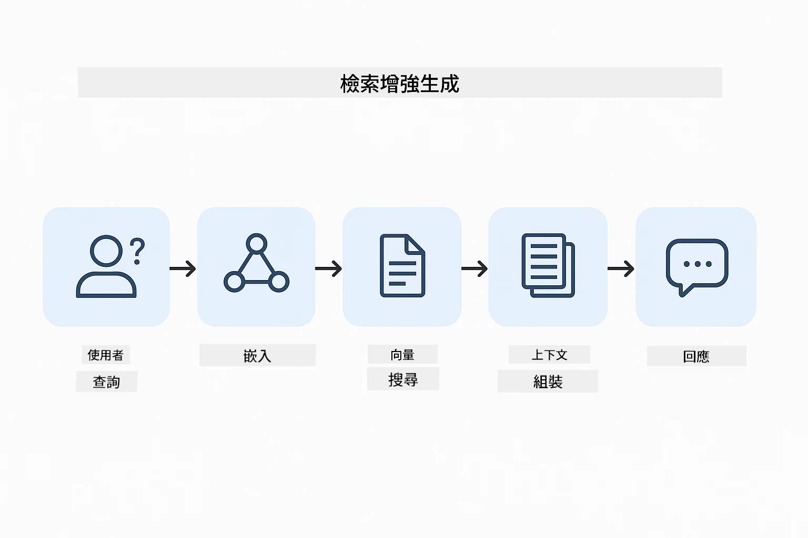

<!--
CO_OP_TRANSLATOR_METADATA:
{
  "original_hash": "81d087662fb3dd7b7124bce1a9c9ec86",
  "translation_date": "2026-01-05T22:08:57+00:00",
  "source_file": "03-rag/README.md",
  "language_code": "tw"
}
-->
# 模組 03：RAG（檢索增強生成）

## 目錄

- [您將學到什麼](../../../03-rag)
- [前置條件](../../../03-rag)
- [了解 RAG](../../../03-rag)
- [工作原理](../../../03-rag)
  - [文件處理](../../../03-rag)
  - [建立嵌入向量](../../../03-rag)
  - [語義搜尋](../../../03-rag)
  - [答案生成](../../../03-rag)
- [運行應用程式](../../../03-rag)
- [使用應用程式](../../../03-rag)
  - [上傳文件](../../../03-rag)
  - [提問](../../../03-rag)
  - [檢查來源參考](../../../03-rag)
  - [問題實驗](../../../03-rag)
- [關鍵概念](../../../03-rag)
  - [分塊策略](../../../03-rag)
  - [相似度分數](../../../03-rag)
  - [記憶體儲存](../../../03-rag)
  - [上下文視窗管理](../../../03-rag)
- [何時需要 RAG](../../../03-rag)
- [後續步驟](../../../03-rag)

## 您將學到什麼

在之前的模組中，您學會如何與 AI 對話並有效結構化提示。但有個基本限制：語言模型只知道訓練時學到的內容。它們無法回答有關您公司政策、專案文件或未經訓練的任何資訊的問題。

RAG（檢索增強生成）解決了此問題。它不是嘗試直接教模型您的資訊（這既昂貴又不切實際），而是給模型搜尋您文件的能力。當有人提問時，系統會找到相關資訊並把它包括在提示中。模型根據檢索到的上下文回答。

可以把 RAG 想成給模型一個參考圖書館。當您提出問題時，系統會：

1. **使用者查詢** — 您提出問題
2. **嵌入向量** — 將問題轉為向量
3. **向量搜尋** — 找到相似的文件分塊
4. **上下文組合** — 將相關分塊加入提示中
5. **回應** — LLM 根據上下文生成答案

這讓模型的回應基於您的真實資料，而不是依賴訓練知識或杜撰答案。



*RAG 工作流程—從使用者查詢，到語義搜尋，再到上下文答案生成*

## 前置條件

- 已完成模組 01（部署 Azure OpenAI 資源）
- `.env` 文件放置於根目錄，含 Azure 憑證（由模組 01 的 `azd up` 建立）

> **注意：** 若尚未完成模組 01，請先依該模組部屬指南進行。

## 工作原理

### 文件處理

[DocumentService.java](../../../03-rag/src/main/java/com/example/langchain4j/rag/service/DocumentService.java)

當您上傳文件時，系統會將其拆分為分塊——更小且能舒適放入模型上下文視窗的片段。這些分塊會有輕微重疊，以免在邊界處丟失上下文。

```java
Document document = FileSystemDocumentLoader.loadDocument("sample-document.txt");

DocumentSplitter splitter = DocumentSplitters
    .recursive(300, 30, new OpenAiTokenizer());

List<TextSegment> segments = splitter.split(document);
```

> **🤖 可使用 [GitHub Copilot](https://github.com/features/copilot) 聊天來嘗試：** 打開 [`DocumentService.java`](../../../03-rag/src/main/java/com/example/langchain4j/rag/service/DocumentService.java)，並提問：
> - 「LangChain4j 如何將文件拆分成分塊，為什麼重疊很重要？」
> - 「不同文件類型的最佳分塊大小是多少，原因為何？」
> - 「如何處理使用多種語言或特殊格式的文件？」

### 建立嵌入向量

[LangChainRagConfig.java](../../../03-rag/src/main/java/com/example/langchain4j/rag/config/LangChainRagConfig.java)

每個分塊都會轉換成一個數值表示，稱為嵌入向量——本質上是捕捉文本意涵的數學指紋，相似的文本會產生相似的嵌入向量。

```java
@Bean
public EmbeddingModel embeddingModel() {
    return OpenAiOfficialEmbeddingModel.builder()
        .baseUrl(azureOpenAiEndpoint)
        .apiKey(azureOpenAiKey)
        .modelName(azureEmbeddingDeploymentName)
        .build();
}

EmbeddingStore<TextSegment> embeddingStore = 
    new InMemoryEmbeddingStore<>();
```


*文件以向量形式呈現在嵌入空間中，相似內容傾向聚集成群*

### 語義搜尋

[RagService.java](../../../03-rag/src/main/java/com/example/langchain4j/rag/service/RagService.java)

當您提出問題，問題同樣會轉成嵌入向量。系統會將您問題的嵌入向量與所有文件分塊的嵌入向量進行比較。它會找到意義最相似的分塊——不只是符合關鍵字，而是真正的語義相似度。

```java
Embedding queryEmbedding = embeddingModel.embed(question).content();

List<EmbeddingMatch<TextSegment>> matches = 
    embeddingStore.findRelevant(queryEmbedding, 5, 0.7);

for (EmbeddingMatch<TextSegment> match : matches) {
    String relevantText = match.embedded().text();
    double score = match.score();
}
```

> **🤖 可使用 [GitHub Copilot](https://github.com/features/copilot) 聊天來嘗試：** 打開 [`RagService.java`](../../../03-rag/src/main/java/com/example/langchain4j/rag/service/RagService.java)，並提問：
> - 「嵌入向量如何進行相似度搜尋，分數如何決定？」
> - 「我應設定什麼相似度門檻，這會如何影響結果？」
> - 「若找不到相關文件，我該如何處理？」

### 答案生成

[RagService.java](../../../03-rag/src/main/java/com/example/langchain4j/rag/service/RagService.java)

系統會將最相關的分塊納入模型提示中，模型閱讀那些分塊並基於其內容回答您的問題。這避免了幻覺問題——模型只能根據眼前的資訊回答。

## 運行應用程式

**驗證部署狀態：**

確保根目錄有 `.env` 文件，並含 Azure 憑證（模組 01 已建立）：
```bash
cat ../.env  # 應該顯示 AZURE_OPENAI_ENDPOINT、API_KEY、DEPLOYMENT
```

**啟動應用程式：**

> **注意：** 如果您已在模組 01 使用 `./start-all.sh` 啟動所有應用程式，本模組已於 8081 埠運行。您可以跳過以下啟動指令，直接瀏覽 http://localhost:8081。

**選項 1：使用 Spring Boot Dashboard（建議 VS Code 使用者）**

開發容器內含 Spring Boot Dashboard 擴充，提供管理所有 Spring Boot 應用程式的視覺介面。可在 VS Code 左側活動欄找到（Spring Boot 圖標）。

透過 Spring Boot Dashboard，您可以：
- 查看工作區中所有可用的 Spring Boot 應用程式
- 一鍵啟動/停止應用程式
- 實時檢視應用程式日誌
- 監控應用程式狀態

只要點擊 "rag" 旁的播放按鈕啟動此模組，或一次啟動所有模組。


**選項 2：使用 shell 腳本**

啟動所有 Web 應用程式（模組 01-04）：

**Bash：**
```bash
cd ..  # 從根目錄開始
./start-all.sh
```

**PowerShell：**
```powershell
cd ..  # 從根目錄
.\start-all.ps1
```

或僅啟動此模組：

**Bash：**
```bash
cd 03-rag
./start.sh
```

**PowerShell：**
```powershell
cd 03-rag
.\start.ps1
```

這些腳本會自動從根目錄 `.env` 讀取環境變數，若 JAR 不存在則自動編譯。

> **注意：** 若您想先手動編譯所有模組，再啟動：
>
> **Bash：**
> ```bash
> cd ..  # Go to root directory
> mvn clean package -DskipTests
> ```

> **PowerShell：**
> ```powershell
> cd ..  # Go to root directory
> mvn clean package -DskipTests
> ```

使用瀏覽器打開 http://localhost:8081 。

**停止指令：**

**Bash：**
```bash
./stop.sh  # 僅此模組
# 或者
cd .. && ./stop-all.sh  # 所有模組
```

**PowerShell：**
```powershell
.\stop.ps1  # 僅此模組
# 或
cd ..; .\stop-all.ps1  # 所有模組
```

## 使用應用程式

此應用程式提供文件上傳與提問的網頁介面。

<a href="images/rag-homepage.png"></a>

*RAG 應用介面—上傳文件並提問*

### 上傳文件

先上傳文件——測試時以 TXT 檔效果最佳。此目錄中提供了 `sample-document.txt`，內容包含 LangChain4j 功能、RAG 實作及最佳實務，非常適合測試系統。

系統會處理您的文件，拆分成分塊，並為每個分塊建立嵌入向量。此過程於上傳時自動完成。

### 提問

接著針對文件內容提出具體問題。試著問文件中明確陳述的事實。系統會搜尋相關分塊，將它們包含在提示內，並產生答案。

### 檢查來源參考

每個答案都包含帶有相似度分數的來源參考。分數範圍為 0 到 1，分數越高代表該分塊與您的問題越相關。您可以透過這些參考核對答案是否符合來源材料。

<a href="images/rag-query-results.png"></a>

*查詢結果顯示帶有來源參考與相關分數的答案*

### 問題實驗

嘗試不同類型的問題：
- 具體事實：「主要主題是什麼？」
- 比較：「X 與 Y 有何差異？」
- 摘要：「請總結關於 Z 的重點」

觀察根據問題與文件內容匹配程度，相關分數如何變化。

## 關鍵概念

### 分塊策略

文件被拆成 300 代幣的分塊，並重疊 30 代幣。此平衡確保每個分塊有足夠上下文意義，且分塊足夠小，可在提示中包含多個分塊。

### 相似度分數

分數介於 0 到 1：
- 0.7-1.0：高度相關，精確匹配
- 0.5-0.7：相關，具良好上下文
- 低於 0.5：過濾掉，類似度過低

系統僅檢索高於最低門檻的分塊，以確保品質。

### 記憶體儲存

此模組使用記憶體儲存以簡化示範。重啟應用時，上傳文件將會遺失。生產系統會使用持久化向量資料庫，如 Qdrant 或 Azure AI Search。

### 上下文視窗管理

每個模型有最大上下文視窗限制。無法包含大型文件的所有分塊。系統會取回排名前 N（預設為 5）最相關分塊，在限制內提供足夠上下文以生成準確答案。

## 何時需要 RAG

**使用 RAG 時機：**
- 回答關於專屬文件的問題
- 資訊經常變動（政策、價格、規格）
- 需準確標示來源
- 內容過大無法放入單一提示
- 需要可驗證、具依據的回答

**不建議使用 RAG 時機：**
- 問題涉及模型原有的一般知識
- 需要即時資料（RAG 僅針對上傳文件運作）
- 內容足夠小可直接放入提示

## 後續步驟

**下一個模組：** [04-tools - 使用工具的 AI 代理](../04-tools/README.md)

---

**導覽：** [← 上一個：模組 02 - 提示工程](../02-prompt-engineering/README.md) | [回主頁](../README.md) | [下一個：模組 04 - 工具 →](../04-tools/README.md)

---

<!-- CO-OP TRANSLATOR DISCLAIMER START -->
**免責聲明**：  
本文件係使用 AI 翻譯服務 [Co-op Translator](https://github.com/Azure/co-op-translator) 翻譯而成。雖然我們致力於確保準確性，但請注意自動翻譯可能包含錯誤或不準確之處。原始文件的母語版本應視為權威來源。對於重要資訊，建議採用專業人工翻譯。我們不對因使用本翻譯而產生的任何誤解或誤譯負責。
<!-- CO-OP TRANSLATOR DISCLAIMER END -->