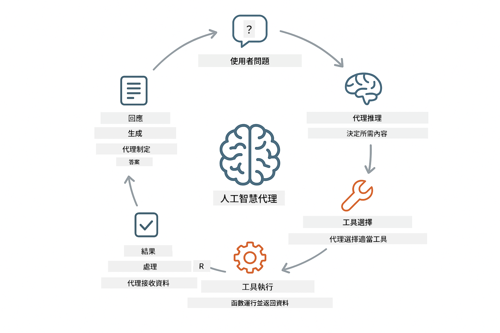
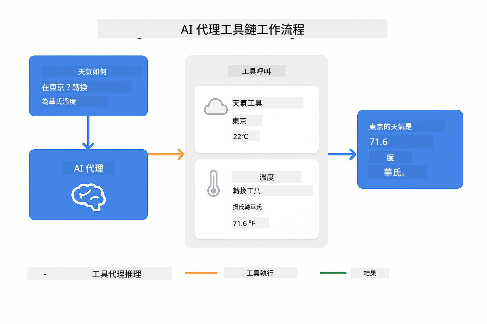
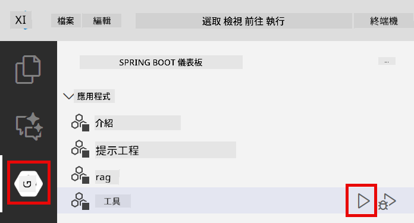
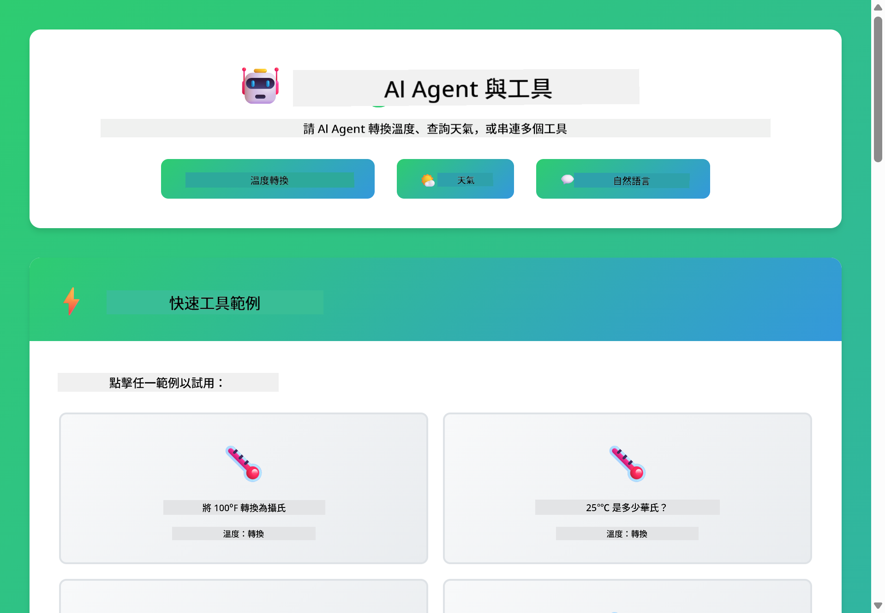
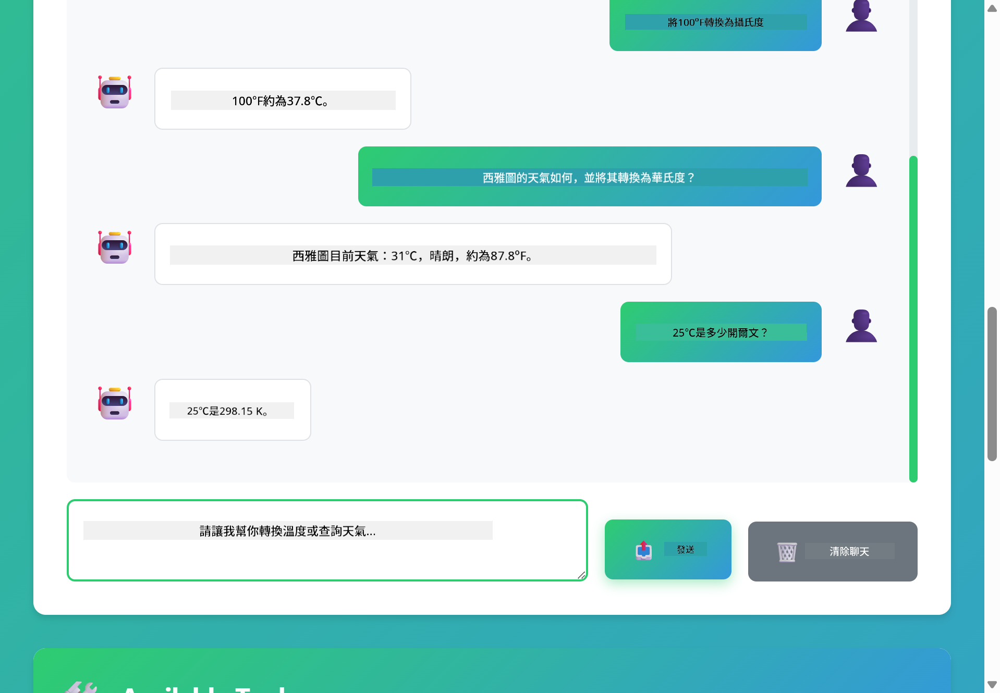

<!--
CO_OP_TRANSLATOR_METADATA:
{
  "original_hash": "13ec450c12cdd1a863baa2b778f27cd7",
  "translation_date": "2025-12-30T21:47:04+00:00",
  "source_file": "04-tools/README.md",
  "language_code": "tw"
}
-->
# Module 04: AI 代理與工具

## Table of Contents

- [你將學到什麼](../../../04-tools)
- [先決條件](../../../04-tools)
- [了解具備工具的 AI 代理](../../../04-tools)
- [工具呼叫如何運作](../../../04-tools)
  - [工具定義](../../../04-tools)
  - [決策](../../../04-tools)
  - [執行](../../../04-tools)
  - [回應產生](../../../04-tools)
- [工具串連](../../../04-tools)
- [執行應用程式](../../../04-tools)
- [使用應用程式](../../../04-tools)
  - [嘗試簡單工具使用](../../../04-tools)
  - [測試工具串連](../../../04-tools)
  - [查看對話流程](../../../04-tools)
  - [觀察推理過程](../../../04-tools)
  - [嘗試不同請求](../../../04-tools)
- [關鍵概念](../../../04-tools)
  - [ReAct 模式（推理與行動）](../../../04-tools)
  - [工具描述很重要](../../../04-tools)
  - [會話管理](../../../04-tools)
  - [錯誤處理](../../../04-tools)
- [可用工具](../../../04-tools)
- [何時使用基於工具的代理](../../../04-tools)
- [後續步驟](../../../04-tools)

## 你將學到什麼

到目前為止，你已經學會如何與 AI 進行對話、如何有效地構造提示，以及如何在文件中為回應提供依據。但仍存在一個根本限制：語言模型只能產生文字。它們無法查詢天氣、進行計算、查詢資料庫或與外部系統互動。

工具改變了這一點。透過讓模型能夠存取可以呼叫的函式，你將它從文字生成器轉變為可以採取行動的代理。模型會決定何時需要工具、使用哪一個工具，以及傳遞哪些參數。你的程式碼執行該函式並回傳結果。模型將該結果整合到其回應中。

## 先決條件

- 已完成 Module 01（已部署 Azure OpenAI 資源）
- 在專案根目錄有 `.env` 檔案，內含 Azure 憑證（由 Module 01 的 `azd up` 建立）

> **注意：** 如果你還沒完成 Module 01，請先按照那裡的部署說明操作。

## 了解具備工具的 AI 代理

> **📝 注意：** 本模組中的「代理」一詞指的是具備工具呼叫功能的 AI 助手。這與我們在 [Module 05: MCP](../05-mcp/README.md) 中將討論的 **Agentic AI** 概念（具有規劃、記憶與多步推理的自主代理）不同。

具備工具的 AI 代理遵循一個推理與行動的模式（ReAct）：

1. 使用者提出問題
2. 代理推理它需要知道的內容
3. 代理決定是否需要工具來回答
4. 如果需要，代理以正確參數呼叫適當的工具
5. 工具執行並回傳資料
6. 代理將結果合併並提供最終答案



*ReAct 模式 - AI 代理如何在推理與行動之間交替以解決問題*

這個過程是自動發生的。你定義工具及其描述。模型負責決定何時以及如何使用它們。

## 工具呼叫如何運作

**工具定義** - [WeatherTool.java](../../../04-tools/src/main/java/com/example/langchain4j/agents/tools/WeatherTool.java) | [TemperatureTool.java](../../../04-tools/src/main/java/com/example/langchain4j/agents/tools/TemperatureTool.java)

你定義具有清楚描述與參數規格的函式。模型在其系統提示中看到這些描述並理解每個工具的用途。

```java
@Component
public class WeatherTool {
    
    @Tool("Get the current weather for a location")
    public String getCurrentWeather(@P("Location name") String location) {
        // 您的天氣查詢邏輯
        return "Weather in " + location + ": 22°C, cloudy";
    }
}

@AiService
public interface Assistant {
    String chat(@MemoryId String sessionId, @UserMessage String message);
}

// Assistant 由 Spring Boot 自動注入以下元件:
// - ChatModel Bean
// - 所有來自 @Component 類別的 @Tool 方法
// - 用於會話管理的 ChatMemoryProvider
```

> **🤖 嘗試使用 [GitHub Copilot](https://github.com/features/copilot) Chat：** 開啟 [`WeatherTool.java`](../../../04-tools/src/main/java/com/example/langchain4j/agents/tools/WeatherTool.java) 並詢問：
> - 「我如何整合像 OpenWeatherMap 這樣的真實天氣 API，而不是使用模擬資料？」
> - 「什麼樣的工具描述能幫助 AI 正確使用它？」
> - 「我應該如何在工具實作中處理 API 錯誤與速率限制？」

**決策**

當使用者問「Seattle 的天氣如何？」時，模型會辨識出它需要天氣工具。它會產生一個函式呼叫，並將 location 參數設為 "Seattle"。

**執行** - [AgentService.java](../../../04-tools/src/main/java/com/example/langchain4j/agents/service/AgentService.java)

Spring Boot 自動注入所有已註冊工具的宣告式 `@AiService` 介面，並由 LangChain4j 自動執行工具呼叫。

> **🤖 嘗試使用 [GitHub Copilot](https://github.com/features/copilot) Chat：** 開啟 [`AgentService.java`](../../../04-tools/src/main/java/com/example/langchain4j/agents/service/AgentService.java) 並詢問：
> - 「ReAct 模式如何運作，為何對 AI 代理有效？」
> - 「代理如何決定使用哪個工具以及使用順序？」
> - 「如果工具執行失敗會發生什麼事 — 我應該如何健全地處理錯誤？」

**回應產生**

模型接收到天氣資料並將其格式化為給使用者的自然語言回應。

### 為何使用宣告式 AI 服務？

本模組使用 LangChain4j 與 Spring Boot 的整合，採用宣告式的 `@AiService` 介面：

- **Spring Boot 自動注入** - ChatModel 與工具會自動注入
- **@MemoryId 模式** - 自動的會話式記憶管理
- **單一實例** - 助手建立一次並重複使用以提升效能
- **型別安全執行** - 直接呼叫 Java 方法並進行型別轉換
- **多回合協調** - 自動處理工具串連
- **零樣板程式碼** - 不需要手動呼叫 AiServices.builder() 或記憶 HashMap

替代方法（手動的 `AiServices.builder()`）需要更多程式碼，且無法享受 Spring Boot 整合的好處。

## 工具串連

**工具串連** - AI 可能會依序呼叫多個工具。詢問「Seattle 的天氣如何，我應該帶雨傘嗎？」並觀察它如何先呼叫 `getCurrentWeather`，再針對是否需要雨具進行推理。

<a href="images/tool-chaining.png"></a>

*順序性工具呼叫 — 一個工具的輸出會成為下一步決策的輸入*

**優雅失敗** - 詢問一個模擬資料中不存在的城市天氣。工具會回傳錯誤訊息，AI 會解釋它無法提供協助。工具會安全地失敗。

這些發生在單一對話回合中。代理會自動協調多個工具呼叫。

## 執行應用程式

**確認部署：**

確保專案根目錄有 `.env` 檔案，內含在 Module 01 建立的 Azure 憑證：
```bash
cat ../.env  # 應該顯示 AZURE_OPENAI_ENDPOINT、API_KEY、DEPLOYMENT
```

**啟動應用程式：**

> **注意：** 如果你已經在 Module 01 使用 `./start-all.sh` 啟動所有應用程式，本模組已經在 8084 埠上執行。你可以跳過下面的啟動指令，直接前往 http://localhost:8084。

**選項 1：使用 Spring Boot Dashboard（建議 VS Code 使用者）**

開發容器已包含 Spring Boot Dashboard 擴充功能，該擴充提供一個視覺介面來管理所有 Spring Boot 應用程式。你可以在 VS Code 左側的活動列找到它（尋找 Spring Boot 圖示）。

在 Spring Boot Dashboard 中，你可以：
- 查看工作區中所有可用的 Spring Boot 應用程式
- 一鍵啟動/停止應用程式
- 即時檢視應用程式日誌
- 監控應用程式狀態

只要按下 "tools" 旁的播放按鈕即可啟動此模組，或一次啟動所有模組。



**選項 2：使用 shell 腳本**

啟動所有網頁應用程式（模組 01-04）：

**Bash:**
```bash
cd ..  # 從根目錄
./start-all.sh
```

**PowerShell:**
```powershell
cd ..  # 從根目錄
.\start-all.ps1
```

或只啟動此模組：

**Bash:**
```bash
cd 04-tools
./start.sh
```

**PowerShell:**
```powershell
cd 04-tools
.\start.ps1
```

這兩個腳本會自動從根目錄的 `.env` 檔載入環境變數，若 JAR 檔不存在則會進行建置。

> **注意：** 如果你想在啟動前手動建置所有模組：
>
> **Bash:**
> ```bash
> cd ..  # Go to root directory
> mvn clean package -DskipTests
> ```
>
> **PowerShell:**
> ```powershell
> cd ..  # Go to root directory
> mvn clean package -DskipTests
> ```

在你的瀏覽器中開啟 http://localhost:8084 。

**要停止：**

**Bash:**
```bash
./stop.sh  # 僅限此模組
# 或
cd .. && ./stop-all.sh  # 所有模組
```

**PowerShell:**
```powershell
.\stop.ps1  # 僅限此模組
# 或
cd ..; .\stop-all.ps1  # 所有模組
```

## 使用應用程式

該應用程式提供一個網頁介面，讓你可以與具備存取天氣與溫度轉換工具的 AI 代理互動。

<a href="images/tools-homepage.png"></a>

*AI 代理工具介面 - 快速範例與用於與工具互動的聊天介面*

**嘗試簡單工具使用**

從一個簡單請求開始：「將 100 華氏度轉換為攝氏」。代理會識別它需要溫度轉換工具，並以正確參數呼叫它，然後回傳結果。注意這感覺多麼自然 — 你不需要指定要使用哪個工具或如何呼叫它。

**測試工具串連**

現在試試更複雜的：「Seattle 的天氣如何，並將其轉換為華氏？」觀察代理如何分步處理。它先取得天氣（回傳攝氏），然後識別出需要轉換為華氏，呼叫轉換工具，並將兩者結果合併成一個回應。

**查看對話流程**

聊天介面會保留對話歷史，允許你進行多回合互動。你可以看到所有先前的查詢與回應，方便追蹤對話並了解代理如何在多次交流中建立上下文。

<a href="images/tools-conversation-demo.png"></a>

*多回合對話示範，顯示簡單轉換、天氣查詢與工具串連*

**嘗試不同請求**

試試各種組合：
- 天氣查詢：「Tokyo 的天氣如何？」
- 溫度轉換：「25°C 是多少開爾文？」
- 組合查詢：「檢查 Paris 的天氣，告訴我是否高於 20°C」

注意代理如何解釋自然語言並將其映射到適當的工具呼叫。

## 關鍵概念

**ReAct 模式（推理與行動）**

代理在推理（決定要做什麼）與行動（使用工具）之間交替。這個模式使代理能夠自主解決問題，而不僅僅是回應指示。

**工具描述很重要**

工具描述的品質會直接影響代理使用工具的效果。清晰且具體的描述能幫助模型理解何時以及如何呼叫每個工具。

**會話管理**

`@MemoryId` 註解啟用自動的會話式記憶管理。每個 session ID 都會有其自己的 `ChatMemory` 實例，由 `ChatMemoryProvider` bean 管理，免除了手動記憶追蹤的需要。

**錯誤處理**

工具可能會失敗 —— API 超時、參數無效、外部服務中斷。生產環境中的代理需要錯誤處理機制，讓模型能夠說明問題或嘗試替代方案。

## 可用工具

**天氣工具**（使用模擬資料示範）：
- 取得某地的即時天氣
- 取得多日天氣預報

**溫度轉換工具**：
- 攝氏轉華氏
- 華氏轉攝氏
- 攝氏轉開爾文
- 開爾文轉攝氏
- 華氏轉開爾文
- 開爾文轉華氏

這些是簡單範例，但此模式可擴展至任何函式：資料庫查詢、API 呼叫、計算、檔案操作或系統命令。

## 何時使用基於工具的代理

**在以下情況使用工具：**
- 回答需要即時資料（天氣、股票價格、庫存）
- 需要執行超出簡單數學的計算
- 存取資料庫或 API
- 採取行動（發送電子郵件、建立工單、更新紀錄）
- 結合多個資料來源

**不用在以下情況使用工具：**
- 問題可以從一般知識回答
- 回應純屬對話性質
- 工具延遲會讓體驗變得過慢

## 後續步驟

**下一個模組：** [05-mcp - Model Context Protocol (MCP)](../05-mcp/README.md)

---

**導覽：** [← 上一節：Module 03 - RAG](../03-rag/README.md) | [回到主頁](../README.md) | [下一節：Module 05 - MCP →](../05-mcp/README.md)

---

<!-- CO-OP TRANSLATOR DISCLAIMER START -->
免責聲明：
本文件已使用 AI 翻譯服務 Co-op Translator（https://github.com/Azure/co-op-translator）進行翻譯。雖然我們力求準確，但請注意自動翻譯可能包含錯誤或不精確之處。原始語言版本應被視為具權威性的參考來源。對於重要資訊，建議採用專業人工翻譯。我們不對因使用本翻譯而產生的任何誤解或誤譯承擔責任。
<!-- CO-OP TRANSLATOR DISCLAIMER END -->