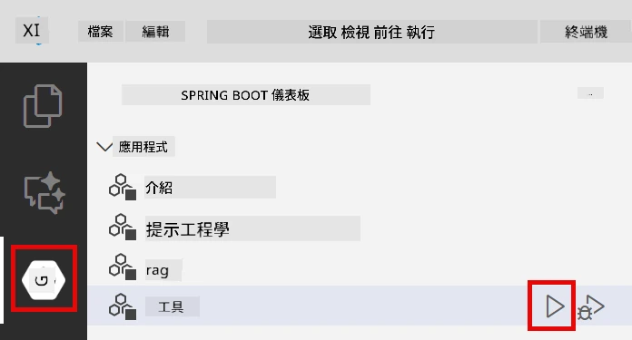

<!--
CO_OP_TRANSLATOR_METADATA:
{
  "original_hash": "844788938b26242f3cc54ce0d0951bea",
  "translation_date": "2026-01-05T22:11:12+00:00",
  "source_file": "04-tools/README.md",
  "language_code": "tw"
}
-->
# Module 04：具備工具的 AI 代理

## 目錄

- [你將學習什麼](../../../04-tools)
- [先決條件](../../../04-tools)
- [了解具備工具的 AI 代理](../../../04-tools)
- [工具呼叫的運作方式](../../../04-tools)
  - [工具定義](../../../04-tools)
  - [決策](../../../04-tools)
  - [執行](../../../04-tools)
  - [回應生成](../../../04-tools)
- [工具串鏈](../../../04-tools)
- [執行應用程式](../../../04-tools)
- [使用應用程式](../../../04-tools)
  - [嘗試簡單工具使用](../../../04-tools)
  - [測試工具串鏈](../../../04-tools)
  - [查看對話流程](../../../04-tools)
  - [嘗試不同請求](../../../04-tools)
- [關鍵概念](../../../04-tools)
  - [ReAct 模式（推理與執行）](../../../04-tools)
  - [工具描述很重要](../../../04-tools)
  - [會話管理](../../../04-tools)
  - [錯誤處理](../../../04-tools)
- [可用工具](../../../04-tools)
- [何時使用基於工具的代理](../../../04-tools)
- [下一步](../../../04-tools)

## 你將學習什麼

到目前為止，你已經學會如何與 AI 進行對話，有效構造提示，並以你的文件為基礎來回應。但仍有一個根本限制：語言模型只能產生文字。它們無法查看天氣、執行計算、查詢資料庫或與外部系統互動。

工具改變了這一點。透過讓模型能夠調用功能，你將它從文字生成器轉變為可執行動作的代理。模型決定何時需要工具、使用哪個工具以及傳遞哪些參數。你的程式碼執行該功能並返回結果。模型將結果納入回應中。

## 先決條件

- 已完成 Module 01（部署 Azure OpenAI 資源）
- 根目錄中有 `.env` 檔案，包含 Azure 憑證（由 Module 01 中的 `azd up` 建立）

> **注意：** 如果你尚未完成 Module 01，請先依照那裡的部署說明操作。

## 了解具備工具的 AI 代理

> **📝 註：** 本模組中「代理」一詞指具備工具調用能力的 AI 助手。這與我們將在 [Module 05：MCP](../05-mcp/README.md) 涉及的 **Agentic AI** 模式（具備規劃、記憶及多步推理的自主代理）不同。

具備工具的 AI 代理遵循推理與執行（ReAct）模式：

1. 使用者提問
2. 代理思考需要哪些資訊
3. 代理判斷是否需要使用工具
4. 若需要，代理會以適當參數呼叫相應工具
5. 工具執行並返回資料
6. 代理將結果結合進其最終答案


*ReAct 模式——AI 代理如何在推理與執行間交替以解決問題*

這是自動進行的。你定義工具及其描述，模型負責決定何時、如何使用它們。

## 工具呼叫的運作方式

### 工具定義

[WeatherTool.java](../../../04-tools/src/main/java/com/example/langchain4j/agents/tools/WeatherTool.java) | [TemperatureTool.java](../../../04-tools/src/main/java/com/example/langchain4j/agents/tools/TemperatureTool.java)

你定義帶有清楚描述和參數規範的函式。模型在系統提示中看到這些描述，從而理解每個工具的功能。

```java
@Component
public class WeatherTool {
    
    @Tool("Get the current weather for a location")
    public String getCurrentWeather(@P("Location name") String location) {
        // 你的天氣查詢邏輯
        return "Weather in " + location + ": 22°C, cloudy";
    }
}

@AiService
public interface Assistant {
    String chat(@MemoryId String sessionId, @UserMessage String message);
}

// 助手由 Spring Boot 自動配置搭配：
// - ChatModel Bean
// - 來自 @Component 類別的所有 @Tool 方法
// - 用於會話管理的 ChatMemoryProvider
```

> **🤖 使用 [GitHub Copilot](https://github.com/features/copilot) 聊天嘗試：** 開啟 [`WeatherTool.java`](../../../04-tools/src/main/java/com/example/langchain4j/agents/tools/WeatherTool.java) 並提問：
> - 「如何整合像 OpenWeatherMap 這樣的真實天氣 API，而非模擬資料？」
> - 「什麼樣的工具描述能幫助 AI 正確使用它？」
> - 「如何在工具實現中處理 API 錯誤和速率限制？」

### 決策

當使用者問「西雅圖的天氣如何？」時，模型識別需使用天氣工具，並生成一個帶有位置參數設為「Seattle」的函式呼叫。

### 執行

[AgentService.java](../../../04-tools/src/main/java/com/example/langchain4j/agents/service/AgentService.java)

Spring Boot 自動將帶有 `@AiService` 宣告的介面與所有已註冊工具注入，LangChain4j 自動執行工具呼叫。

> **🤖 使用 [GitHub Copilot](https://github.com/features/copilot) 聊天嘗試：** 開啟 [`AgentService.java`](../../../04-tools/src/main/java/com/example/langchain4j/agents/service/AgentService.java) 並提問：
> - 「ReAct 模式如何運作？為何對 AI 代理有效？」
> - 「代理如何決定使用哪個工具以及順序？」
> - 「如果工具執行失敗會怎樣？如何穩健地處理錯誤？」

### 回應生成

模型收到天氣資料，將其格式化為自然語言回應給使用者。

### 為何使用宣告式 AI 服務？

本模組使用 LangChain4j 與 Spring Boot 整合的宣告式 `@AiService` 介面：

- **Spring Boot 自動注入** — ChatModel 和工具自動注入
- **@MemoryId 模式** — 自動的基於會話的記憶管理
- **單例實例** — 協助整體效能更佳
- **類型安全執行** — Java 方法直接呼叫並完成類型轉換
- **多輪協同** — 自動處理工具串鏈
- **零樣板代碼** — 不需手動呼叫 AiServices.builder() 或管理記憶 HashMap

傳統方法（手動 `AiServices.builder()`）需撰寫較多程式碼且無法享受 Spring Boot 整合優勢。

## 工具串鏈

**工具串鏈** — AI 可能會依序呼叫多個工具。試問「西雅圖的天氣如何？我該帶傘嗎？」並觀察它先呼叫 `getCurrentWeather`，接著根據雨具需要做推理。

<a href="images/tool-chaining.png"></a>

*連續工具呼叫——一個工具的輸出成為下一個決策的輸入*

**優雅失敗** — 查詢不在模擬資料內的城市天氣時，工具回傳錯誤訊息，AI 會解釋無法提供協助。工具失敗時也會安全處理。

這在單一對話回合中發生，代理自主協調多次工具呼叫。

## 執行應用程式

**確認部署：**

確保根目錄中存在含 Azure 憑證的 `.env` 檔案（在 Module 01 建立）：
```bash
cat ../.env  # 應該顯示 AZURE_OPENAI_ENDPOINT、API_KEY、DEPLOYMENT
```

**啟動應用程式：**

> **注意：** 如果你已用 Module 01 的 `./start-all.sh` 啟動過所有服務，本模組已在 8084 埠運行，可跳過以下啟動指令，直接訪問 http://localhost:8084。

**方案 1：使用 Spring Boot 儀表板（建議 VS Code 用戶）**

開發容器包含 Spring Boot 儀表板擴充套件，提供視覺化介面管理所有 Spring Boot 應用。在 VS Code 左側活動欄可見（尋找 Spring Boot 圖示）。

你可以：
- 查看工作區中所有 Spring Boot 應用
- 一鍵啟動/停止應用
- 實時查看應用日誌
- 監控應用狀態

只要點擊「tools」旁播放按鈕即可啟動本模組，或者一次啟動所有模組。



**方案 2：使用 shell 腳本**

啟動所有 Web 應用（模組 01-04）：

**Bash:**
```bash
cd ..  # 從根目錄開始
./start-all.sh
```

**PowerShell:**
```powershell
cd ..  # 從根目錄開始
.\start-all.ps1
```

或只啟動本模組：

**Bash:**
```bash
cd 04-tools
./start.sh
```

**PowerShell:**
```powershell
cd 04-tools
.\start.ps1
```

腳本會自動從根目錄 `.env` 載入環境變數，且若 JAR 不存在會自動建立。

> **注意：** 若想手動編譯所有模組再啟動：
>
> **Bash:**
> ```bash
> cd ..  # Go to root directory
> mvn clean package -DskipTests
> ```
>
> **PowerShell:**
> ```powershell
> cd ..  # Go to root directory
> mvn clean package -DskipTests
> ```

在瀏覽器中開啟 http://localhost:8084。

**停止應用：**

**Bash:**
```bash
./stop.sh  # 僅限此模組
# 或
cd .. && ./stop-all.sh  # 所有模組
```

**PowerShell:**
```powershell
.\stop.ps1  # 僅限此模組
# 或
cd ..; .\stop-all.ps1  # 所有模組
```

## 使用應用程式

此應用提供網頁介面，讓你可與具備天氣與溫度轉換工具存取權的 AI 代理互動。

<a href="images/tools-homepage.png"></a>

*AI 代理工具介面 — 快速範例及聊天介面與工具互動*

### 嘗試簡單工具使用

先試一個簡單請求：「將華氏 100 度轉換為攝氏」。代理辨識需用溫度轉換工具，正確呼叫並回傳結果。看看過程多自然——你沒指定用哪個工具或如何呼叫。

### 測試工具串鏈

試一個更複雜的：「西雅圖現在天氣如何？並將結果轉換成華氏？」觀察代理分步處理。它先取得天氣（以攝氏回傳），接著識別需轉換成華氏，呼叫轉換工具，並將兩者結果結合回應。

### 查看對話流程

聊天介面保留歷史，支持多輪對話。你可以檢視所有之前的問題與回答，更容易追蹤對話脈絡，理解代理如何在多次交流中建構上下文。

<a href="images/tools-conversation-demo.png"></a>

*多輪對話展示簡單轉換、天氣查詢及工具串鏈*

### 嘗試不同請求

試試各種組合：
- 天氣查詢：「東京的天氣如何？」
- 溫度轉換：「25°C 等於多少開氏？」
- 複合查詢：「查一下巴黎天氣，並告訴我是否超過 20°C」

觀察代理如何將自然語言解析並映射至適當工具呼叫。

## 關鍵概念

### ReAct 模式（推理與執行）

代理在推理（決定該做什麼）與執行（利用工具）間交替。此模式促成自主問題解決，而非僅回應指令。

### 工具描述很重要

工具描述品質會直接影響代理使用效果。清楚、具體的描述幫助模型理解何時、如何呼叫工具。

### 會話管理

`@MemoryId` 註解啟用自動的基於會話的記憶管理。每個會話 ID 都有對應的 `ChatMemory` 實例，由 `ChatMemoryProvider` bean 管理，省去手動記憶追蹤。

### 錯誤處理

工具可能失敗——API 時間超時、參數無效、外部服務掛掉。生產環境代理需具備錯誤處理，讓模型能解釋問題或嘗試替代方案。

## 可用工具

**天氣工具**（示範用模擬資料）：
- 取得特定地點當前天氣
- 多日天氣預報

**溫度轉換工具**：
- 攝氏轉華氏
- 華氏轉攝氏
- 攝氏轉開氏
- 開氏轉攝氏
- 華氏轉開氏
- 開氏轉華氏

這些是簡單範例，模式可擴展至任何功能：資料庫查詢、API 呼叫、計算、文件操作或系統命令。

## 何時使用基於工具的代理

**使用工具時機：**
- 回答需即時資料（天氣、股價、存貨）
- 需要進行超出簡單數學的計算
- 存取資料庫或 API
- 執行動作（寄信、建立工單、更新記錄）
- 整合多個資料來源

**不適用工具時機：**
- 問題可用一般知識回答
- 回應純屬對話性質
- 工具延遲會使體驗過慢

## 下一步

**下一模組：** [05-mcp - 模型上下文協議（MCP）](../05-mcp/README.md)

---

**導覽：** [← 上一個：Module 03 - RAG](../03-rag/README.md) | [返回主頁](../README.md) | [下一個：Module 05 - MCP →](../05-mcp/README.md)

---

<!-- CO-OP TRANSLATOR DISCLAIMER START -->
**免責聲明**：  
本文件係使用 AI 翻譯服務 [Co-op Translator](https://github.com/Azure/co-op-translator) 進行翻譯。雖然我們力求準確，但請注意，自動翻譯可能包含錯誤或不準確之處。請以原始文件的母語版本為權威依據。對於重要資訊，建議採用專業人工翻譯。我們不對因使用本翻譯所產生之任何誤解或誤譯負責。
<!-- CO-OP TRANSLATOR DISCLAIMER END -->