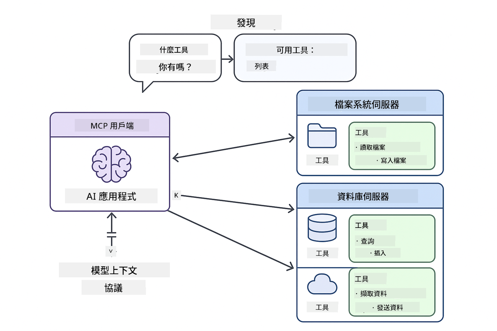
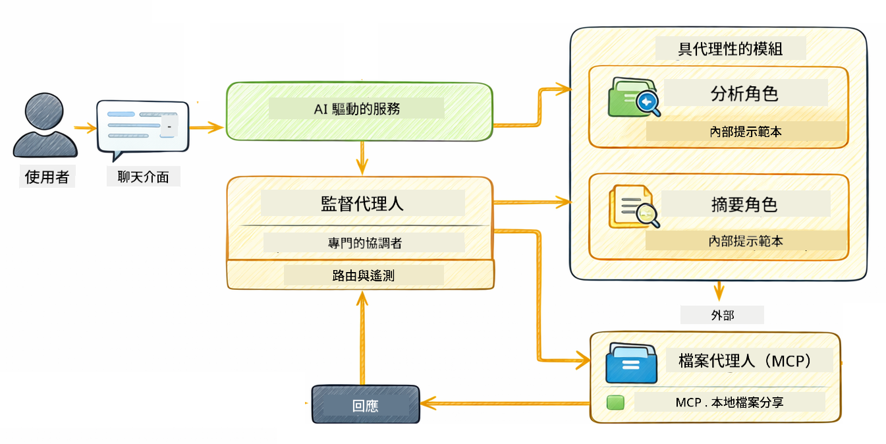

<!--
CO_OP_TRANSLATOR_METADATA:
{
  "original_hash": "f89f4c106d110e4943c055dd1a2f1dff",
  "translation_date": "2025-12-30T21:44:34+00:00",
  "source_file": "05-mcp/README.md",
  "language_code": "tw"
}
-->
# Module 05: Model Context Protocol (MCP)

## Table of Contents

- [你將學到的內容](../../../05-mcp)
- [什麼是 MCP？](../../../05-mcp)
- [MCP 怎麼運作](../../../05-mcp)
- [Agentic 模組](../../../05-mcp)
- [執行範例](../../../05-mcp)
  - [先決條件](../../../05-mcp)
- [快速開始](../../../05-mcp)
  - [檔案操作（Stdio）](../../../05-mcp)
  - [監督型 Agent](../../../05-mcp)
    - [理解輸出](../../../05-mcp)
    - [Agentic 模組功能說明](../../../05-mcp)
- [關鍵概念](../../../05-mcp)
- [恭喜！](../../../05-mcp)
  - [接下來呢？](../../../05-mcp)

## What You'll Learn

你已經建立了會話型 AI、精通提示工程、能將回應根據文件進行落地，並建立了帶有工具的代理。但所有那些工具都是為你特定應用量身定製的。如果你可以讓你的 AI 存取一個任何人都可以建立和分享的標準化工具生態系，會怎樣？在本模組中，你將學會如何使用 Model Context Protocol (MCP) 和 LangChain4j 的 agentic 模組來做到這一點。我們首先展示一個簡單的 MCP 檔案讀取器，然後展示它如何輕鬆地整合到使用 Supervisor Agent 模式的進階 agentic 工作流程中。

## What is MCP?

Model Context Protocol (MCP) 就是為此而生 — 為 AI 應用提供一種標準化方式來發現和使用外部工具。你不需要為每個資料來源或服務撰寫自訂整合，而是連接到以一致格式公開其功能的 MCP 伺服器。你的 AI 代理就可以自動發現並使用這些工具。


*在 MCP 之前：複雜的一對一整合。在 MCP 之後：一個協定，無限可能。*

MCP 解決了 AI 開發中的一個根本問題：每個整合都是自訂的。想要存取 GitHub？自訂程式碼。想要讀取檔案？自訂程式碼。想要查詢資料庫？自訂程式碼。而且這些整合都無法與其他 AI 應用互通。

MCP 將此標準化。MCP 伺服器用清楚的描述和 schema 揭露工具。任何 MCP 用戶端都能連接、發現可用工具並使用它們。一次建置，處處可用。



*Model Context Protocol 架構 - 標準化的工具發現與執行*

## How MCP Works

**Server-Client Architecture**

MCP 採用客戶端-伺服器模型。伺服器提供工具 — 讀取檔案、查詢資料庫、呼叫 API。用戶端（你的 AI 應用）連接到伺服器並使用它們的工具。

要在 LangChain4j 中使用 MCP，新增以下 Maven 相依性：

```xml
<dependency>
    <groupId>dev.langchain4j</groupId>
    <artifactId>langchain4j-mcp</artifactId>
    <version>${langchain4j.version}</version>
</dependency>
```

**Tool Discovery**

當你的用戶端連接到 MCP 伺服器時，它會詢問「你有哪些工具？」伺服器回應一個可用工具的清單，每個工具都有描述和參數 schema。你的 AI 代理就可以根據使用者的請求決定要使用哪些工具。

**Transport Mechanisms**

MCP 支援不同的傳輸機制。本模組示範用於本地程序的 Stdio 傳輸：


*MCP 傳輸機制：遠端伺服器使用 HTTP，本地程序使用 Stdio*

**Stdio** - [StdioTransportDemo.java](../../../05-mcp/src/main/java/com/example/langchain4j/mcp/StdioTransportDemo.java)

適用於本地程序。你的應用會產生一個子程序作為伺服器，並透過標準輸入/輸出進行通訊。適合檔案系統存取或命令列工具。

```java
McpTransport stdioTransport = new StdioMcpTransport.Builder()
    .command(List.of(
        npmCmd, "exec",
        "@modelcontextprotocol/server-filesystem@2025.12.18",
        resourcesDir
    ))
    .logEvents(false)
    .build();
```

> **🤖 嘗試使用 [GitHub Copilot](https://github.com/features/copilot) 聊天：** 開啟 [`StdioTransportDemo.java`](../../../05-mcp/src/main/java/com/example/langchain4j/mcp/StdioTransportDemo.java) 並詢問：
> - 「Stdio 傳輸如何運作？我該在什麼情況下使用它而不是 HTTP？」
> - 「LangChain4j 如何管理所產生 MCP 伺服器程序的生命週期？」
> - 「讓 AI 存取檔案系統有哪些安全性考量？」

## The Agentic Module

雖然 MCP 提供了標準化的工具，LangChain4j 的 **agentic 模組** 則提供以宣告式方式建立代理並協調這些工具的方法。`@Agent` 註解和 `AgenticServices` 讓你可以透過介面而不是命令式程式碼來定義代理行為。

在本模組中，你將探索 **監督型 Agent（Supervisor Agent）** 模式 — 一種進階的 agentic AI 方法，其中「監督」代理會根據使用者請求動態決定要呼叫哪些子代理。我們會結合兩個概念：讓我們的一個子代理具備由 MCP 提供的檔案存取能力。

要使用 agentic 模組，新增以下 Maven 相依性：

```xml
<dependency>
    <groupId>dev.langchain4j</groupId>
    <artifactId>langchain4j-agentic</artifactId>
    <version>${langchain4j.mcp.version}</version>
</dependency>
```

> **⚠️ 實驗性：** `langchain4j-agentic` 模組為 **實驗性**，可能會變動。建立 AI 助手的穩定方式仍然是使用 `langchain4j-core` 搭配自訂工具（Module 04）。

## Running the Examples

### Prerequisites

- Java 21+、Maven 3.9+
- Node.js 16+ 與 npm（用於 MCP 伺服器）
- 在專案根目錄的 `.env` 檔中設定環境變數：
  - **對於 StdioTransportDemo：** `GITHUB_TOKEN`（GitHub Personal Access Token）
  - **對於 SupervisorAgentDemo：** `AZURE_OPENAI_ENDPOINT`、`AZURE_OPENAI_API_KEY`、`AZURE_OPENAI_DEPLOYMENT`（與模組 01-04 相同）

> **注意：** 如果你還沒有設定環境變數，請參考 [Module 00 - Quick Start](../00-quick-start/README.md) 的說明，或將 `.env.example` 複製為 `.env` 並填入你的值。

## Quick Start

**使用 VS Code：** 在 Explorer 中對任何 demo 檔案按右鍵並選擇 **"Run Java"**，或從 Run and Debug 面板使用啟動組態（先確定你已將 token 加到 `.env` 檔案）。

**使用 Maven：** 或者，你也可以從命令列執行下面的範例。

### File Operations (Stdio)

此範例示範基於本地子程序的工具。

**✅ 無需先決條件** — MCP 伺服器會自動被啟動。

**使用 VS Code：** 在 `StdioTransportDemo.java` 上按右鍵並選擇 **"Run Java"**。

**使用 Maven：**

**Bash:**
```bash
export GITHUB_TOKEN=your_token_here
cd 05-mcp
mvn compile exec:java -Dexec.mainClass=com.example.langchain4j.mcp.StdioTransportDemo
```

**PowerShell:**
```powershell
$env:GITHUB_TOKEN=your_token_here
cd 05-mcp
mvn --% compile exec:java -Dexec.mainClass=com.example.langchain4j.mcp.StdioTransportDemo
```

應用程式會自動產生一個檔案系統的 MCP 伺服器並讀取本地檔案。注意子程序管理是如何為你處理的。

**預期輸出：**
```
Assistant response: The file provides an overview of LangChain4j, an open-source Java library
for integrating Large Language Models (LLMs) into Java applications...
```

### Supervisor Agent



監督型 Agent 模式是一種 **彈性** 的 agentic AI 形式。與決定性工作流程（順序、迴圈、平行）不同，監督者使用 LLM 自主決定根據使用者請求要呼叫哪些代理。

**將 Supervisor 與 MCP 結合：** 在此範例中，我們透過 `toolProvider(mcpToolProvider)` 給 `FileAgent` 存取 MCP 檔案系統工具。當使用者要求「讀取並分析一個檔案」時，Supervisor 會分析請求並產生執行計畫。接著它會將請求導向 `FileAgent`，由它使用 MCP 的 `read_file` 工具取回內容。Supervisor 再將該內容傳給 `AnalysisAgent` 進行解讀，並可選地呼叫 `SummaryAgent` 做摘要。

這示範了 MCP 工具如何無縫整合到 agentic 工作流程中 — Supervisor 不需要知道檔案是如何被讀取的，只需知道 `FileAgent` 能做到這點。Supervisor 能根據不同類型的請求動態調整，並回傳最後一個代理的回應或是所有操作的摘要。

**使用啟動腳本（建議）：**

啟動腳本會自動從專案根目錄的 `.env` 檔載入環境變數：

**Bash:**
```bash
cd 05-mcp
chmod +x start.sh
./start.sh
```

**PowerShell:**
```powershell
cd 05-mcp
.\start.ps1
```

**使用 VS Code：** 在 `SupervisorAgentDemo.java` 上按右鍵並選擇 **"Run Java"**（確保你的 `.env` 檔已設定好）。

**Supervisor 如何運作：**

```java
// 定義具有特定能力的多個代理人
FileAgent fileAgent = AgenticServices.agentBuilder(FileAgent.class)
        .chatModel(model)
        .toolProvider(mcpToolProvider)  // 具有用於檔案操作的 MCP 工具
        .build();

AnalysisAgent analysisAgent = AgenticServices.agentBuilder(AnalysisAgent.class)
        .chatModel(model)
        .build();

SummaryAgent summaryAgent = AgenticServices.agentBuilder(SummaryAgent.class)
        .chatModel(model)
        .build();

// 建立一個協調這些代理人的監督者
SupervisorAgent supervisor = AgenticServices.supervisorBuilder()
        .chatModel(model)  // 「planner」模型
        .subAgents(fileAgent, analysisAgent, summaryAgent)
        .responseStrategy(SupervisorResponseStrategy.SUMMARY)
        .build();

// 監督者會自主決定要呼叫哪些代理人
// 只要傳入自然語言的請求 - LLM 就會規劃執行
String response = supervisor.invoke("Read the file at /path/file.txt and analyze it");
```

完整實作請參閱 [SupervisorAgentDemo.java](../../../05-mcp/src/main/java/com/example/langchain4j/mcp/SupervisorAgentDemo.java)。

> **🤖 嘗試使用 [GitHub Copilot](https://github.com/features/copilot) 聊天：** 開啟 [`SupervisorAgentDemo.java`](../../../05-mcp/src/main/java/com/example/langchain4j/mcp/SupervisorAgentDemo.java) 並詢問：
> - 「Supervisor 如何決定要呼叫哪些代理？」
> - 「Supervisor 與 Sequential 工作流程模式有什麼差別？」
> - 「如何自訂 Supervisor 的規劃行為？」

#### Understanding the Output

當你執行此 demo 時，你會看到一個關於 Supervisor 如何協調多個代理的結構化演練。以下說明每個區段的意義：

```
======================================================================
  SUPERVISOR AGENT DEMO
======================================================================

This demo shows how a Supervisor Agent orchestrates multiple specialized agents.
The Supervisor uses an LLM to decide which agent to call based on the task.
```

**標頭** 介紹了 demo 並說明核心概念：Supervisor 使用 LLM（而非寫死的規則）來決定要呼叫哪些代理。

```
--- AVAILABLE AGENTS -------------------------------------------------
  [FILE]     FileAgent     - Reads files using MCP filesystem tools
  [ANALYZE]  AnalysisAgent - Analyzes content for structure, tone, and themes
  [SUMMARY]  SummaryAgent  - Creates concise summaries of content
```

**可用代理** 顯示了 Supervisor 可以選擇的三個專門代理。每個代理都有特定的能力：
- **FileAgent** 可以使用 MCP 工具讀取檔案（外部能力）
- **AnalysisAgent** 分析內容（純 LLM 能力）
- **SummaryAgent** 產生摘要（純 LLM 能力）

```
--- USER REQUEST -----------------------------------------------------
  "Read the file at .../file.txt and analyze what it's about"
```

**使用者請求** 顯示了被問的內容。Supervisor 必須解析此請求並決定要呼叫哪些代理。

```
--- SUPERVISOR ORCHESTRATION -----------------------------------------
  The Supervisor will now decide which agents to invoke and in what order...

  +-- STEP 1: Supervisor chose -> FileAgent (reading file via MCP)
  |
  |   Input: .../file.txt
  |
  |   Result: LangChain4j is an open-source Java library designed to simplify...
  +-- [OK] FileAgent (reading file via MCP) completed

  +-- STEP 2: Supervisor chose -> AnalysisAgent (analyzing content)
  |
  |   Input: LangChain4j is an open-source Java library...
  |
  |   Result: Structure: The content is organized into clear paragraphs that int...
  +-- [OK] AnalysisAgent (analyzing content) completed
```

**Supervisor 編排** 是魔法發生的地方。請看：
1. Supervisor **先選擇了 FileAgent**，因為請求提到「讀取檔案」
2. FileAgent 使用 MCP 的 `read_file` 工具取回檔案內容
3. Supervisor 接著 **選擇了 AnalysisAgent** 並將檔案內容傳給它
4. AnalysisAgent 分析了結構、語氣與主題

注意 Supervisor 是基於使用者請求**自主**做出這些決策 — 沒有寫死的工作流程！

**最終回應** 是 Supervisor 綜合各代理輸出後的答案。範例會輸出 agentic scope，顯示每個代理存儲的摘要與分析結果。

```
--- FINAL RESPONSE ---------------------------------------------------
I read the contents of the file and analyzed its structure, tone, and key themes.
The file introduces LangChain4j as an open-source Java library for integrating
large language models...

--- AGENTIC SCOPE (Shared Memory) ------------------------------------
  Agents store their results in a shared scope for other agents to use:
  * summary: LangChain4j is an open-source Java library...
  * analysis: Structure: The content is organized into clear paragraphs that in...
```

### Agentic 模組功能說明

此範例展示了 agentic 模組的幾個進階功能。我們來深入看看 Agentic Scope 與 Agent Listeners。

**Agentic Scope** 顯示代理使用 `@Agent(outputKey="...")` 存放其結果的共享記憶。這允許：
- 後續代理存取先前代理的輸出
- Supervisor 綜合產生最終回應
- 你檢視每個代理產出的內容

```java
ResultWithAgenticScope<String> result = supervisor.invokeWithAgenticScope(request);
AgenticScope scope = result.agenticScope();
String story = scope.readState("story");
List<AgentInvocation> history = scope.agentInvocations("analysisAgent");
```

**Agent Listeners** 使得可以監控與除錯代理執行。你在 demo 中看到的逐步輸出來自一個掛勾到每次代理呼叫的 AgentListener：
- **beforeAgentInvocation** - 當 Supervisor 選擇一個代理時呼叫，讓你看到被選擇的代理與原因
- **afterAgentInvocation** - 當代理完成時呼叫，顯示其結果
- **inheritedBySubagents** - 若為 true，監聽器會監控層級中的所有代理

```java
AgentListener monitor = new AgentListener() {
    private int step = 0;
    
    @Override
    public void beforeAgentInvocation(AgentRequest request) {
        step++;
        System.out.println("  +-- STEP " + step + ": " + request.agentName());
    }
    
    @Override
    public void afterAgentInvocation(AgentResponse response) {
        System.out.println("  +-- [OK] " + response.agentName() + " completed");
    }
    
    @Override
    public boolean inheritedBySubagents() {
        return true; // 傳播到所有子代理
    }
};
```

除了 Supervisor 模式之外，`langchain4j-agentic` 模組還提供數個強大的工作流程模式與功能：

| Pattern | Description | Use Case |
|---------|-------------|----------|
| **Sequential** | 按順序執行代理，輸出流向下一個代理 | 管線：研究 → 分析 → 報告 |
| **Parallel** | 同時執行代理 | 獨立任務：天氣 + 新聞 + 股票 |
| **Loop** | 迭代直到達成條件 | 品質評分：反覆直到分數 ≥ 0.8 |
| **Conditional** | 根據條件進行路由 | 分類 → 導向專家代理 |
| **Human-in-the-Loop** | 加入人工檢查點 | 核准工作流程、內容審核 |

## Key Concepts

**MCP** 非常適合當你想要利用既有的工具生態、建立可被多個應用分享的工具、以標準協定整合第三方服務，或是在不更動程式碼的情況下替換工具實作時使用。

**Agentic 模組** 最適合當你想用 `@Agent` 註解進行宣告式代理定義、需要工作流程編排（順序、迴圈、平行）、偏好以介面為基礎的代理設計勝過命令式程式碼，或是當你要結合多個透過 `outputKey` 共享輸出的代理時。

**監督型 Agent 模式** 在工作流程事先不可預測且你希望讓 LLM 決定時最為出色；當你有多個需要動態編排的專門代理、建立會將使用者導向不同能力的會話系統，或是你想要最具彈性、能自我調整的代理行為時，這是最佳選擇。

## Congratulations!

你已完成 LangChain4j 初學者課程。你已經學會：

- 如何建立具有記憶的會話型 AI（Module 01）
- 不同任務的提示工程模式（Module 02）
- 使用 RAG 將回應根據文件進行落地（Module 03）
- 使用自訂工具建立基本 AI 代理（助理）（Module 04）
- 整合標準化工具與 LangChain4j MCP 和 Agentic 模組 (模組 05)

### 接下來做什麼？

完成各模組後，請參閱 [測試指南](../docs/TESTING.md)，以實際觀察 LangChain4j 的測試概念。

**官方資源：**
- [LangChain4j Documentation](https://docs.langchain4j.dev/) - 全面指南與 API 參考
- [LangChain4j 的 GitHub](https://github.com/langchain4j/langchain4j) - 原始碼與範例
- [LangChain4j Tutorials](https://docs.langchain4j.dev/tutorials/) - 針對各種使用案例的逐步教學

感謝您完成本課程！

---

**導覽：** [← 上一節：模組 04 - Tools](../04-tools/README.md) | [回到主頁](../README.md)

---

<!-- CO-OP TRANSLATOR DISCLAIMER START -->
免責聲明：
本文件係使用 AI 翻譯服務 Co‑op Translator (https://github.com/Azure/co-op-translator) 進行翻譯。雖然我們會盡力確保翻譯準確，但請注意自動翻譯可能包含錯誤或不準確之處。原始語言版本應視為具權威性的來源。對於關鍵資訊，建議採用專業人工翻譯。我們不對因使用本翻譯而產生的任何誤解或誤譯負責。
<!-- CO-OP TRANSLATOR DISCLAIMER END -->