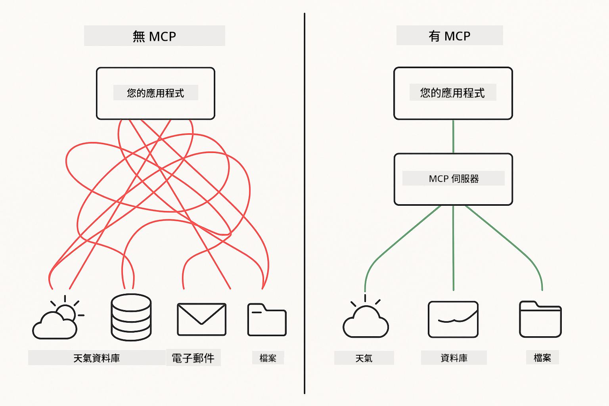

<!--
CO_OP_TRANSLATOR_METADATA:
{
  "original_hash": "c25ec1f10ef156c53e190cdf8b0711ab",
  "translation_date": "2025-12-13T17:42:09+00:00",
  "source_file": "05-mcp/README.md",
  "language_code": "tw"
}
-->
# Module 05: 模型上下文協議 (MCP)

## 目錄

- [你將學到什麼](../../../05-mcp)
- [理解 MCP](../../../05-mcp)
- [MCP 如何運作](../../../05-mcp)
  - [伺服器-客戶端架構](../../../05-mcp)
  - [工具發現](../../../05-mcp)
  - [傳輸機制](../../../05-mcp)
- [先決條件](../../../05-mcp)
- [本模組涵蓋內容](../../../05-mcp)
- [快速開始](../../../05-mcp)
  - [範例 1：遠端計算器（可串流 HTTP）](../../../05-mcp)
  - [範例 2：檔案操作（Stdio）](../../../05-mcp)
  - [範例 3：Git 分析（Docker）](../../../05-mcp)
- [關鍵概念](../../../05-mcp)
  - [傳輸選擇](../../../05-mcp)
  - [工具發現](../../../05-mcp)
  - [會話管理](../../../05-mcp)
  - [跨平台考量](../../../05-mcp)
- [何時使用 MCP](../../../05-mcp)
- [MCP 生態系統](../../../05-mcp)
- [恭喜！](../../../05-mcp)
  - [接下來呢？](../../../05-mcp)
- [故障排除](../../../05-mcp)

## 你將學到什麼

你已經建立了會話式 AI，精通提示工程，能將回應根據文件進行基礎化，並創建了帶有工具的代理。但這些工具都是為你的特定應用量身定制的。如果你能讓你的 AI 存取一個任何人都能創建和分享的標準化工具生態系統呢？

模型上下文協議（MCP）正是提供了這樣的標準方式，讓 AI 應用能發現並使用外部工具。你不必為每個資料來源或服務撰寫自訂整合，而是連接到以一致格式公開其功能的 MCP 伺服器。你的 AI 代理就能自動發現並使用這些工具。



*MCP 之前：複雜的點對點整合。MCP 之後：一個協議，無限可能。*

## 理解 MCP

MCP 解決了 AI 開發中的一個根本問題：每個整合都是自訂的。想存取 GitHub？自訂程式碼。想讀取檔案？自訂程式碼。想查詢資料庫？自訂程式碼。而且這些整合都無法與其他 AI 應用共用。

MCP 將此標準化。MCP 伺服器以清晰的描述和結構公開工具。任何 MCP 用戶端都能連接、發現可用工具並使用它們。一次建置，到處使用。


*模型上下文協議架構 - 標準化的工具發現與執行*

## MCP 如何運作

**伺服器-客戶端架構**

MCP 採用客戶端-伺服器模型。伺服器提供工具——讀取檔案、查詢資料庫、呼叫 API。用戶端（你的 AI 應用）連接伺服器並使用其工具。

**工具發現**

當你的用戶端連接到 MCP 伺服器時，它會詢問「你有哪些工具？」伺服器回應可用工具清單，每個工具附有描述和參數結構。你的 AI 代理可根據使用者請求決定使用哪些工具。

**傳輸機制**

MCP 定義兩種傳輸機制：遠端伺服器用 HTTP，本地程序（含 Docker 容器）用 Stdio：


*MCP 傳輸機制：遠端伺服器用 HTTP，本地程序（含 Docker 容器）用 Stdio*

**可串流 HTTP** - [StreamableHttpDemo.java](../../../05-mcp/src/main/java/com/example/langchain4j/mcp/StreamableHttpDemo.java)

用於遠端伺服器。你的應用向網路上某處運行的伺服器發送 HTTP 請求。使用伺服器推送事件（Server-Sent Events）實現即時通訊。

```java
McpTransport httpTransport = new StreamableHttpMcpTransport.Builder()
    .url("http://localhost:3001/mcp")
    .timeout(Duration.ofSeconds(60))
    .logRequests(true)
    .logResponses(true)
    .build();
```

> **🤖 嘗試使用 [GitHub Copilot](https://github.com/features/copilot) Chat：** 開啟 [`StreamableHttpDemo.java`](../../../05-mcp/src/main/java/com/example/langchain4j/mcp/StreamableHttpDemo.java) 並詢問：
> - 「MCP 與模組 04 中的直接工具整合有何不同？」
> - 「使用 MCP 進行跨應用工具共享有哪些好處？」
> - 「如何處理與 MCP 伺服器的連線失敗或逾時？」

**Stdio** - [StdioTransportDemo.java](../../../05-mcp/src/main/java/com/example/langchain4j/mcp/StdioTransportDemo.java)

用於本地程序。你的應用啟動一個子程序作為伺服器，並透過標準輸入/輸出通訊。適用於檔案系統存取或命令列工具。

```java
McpTransport stdioTransport = new StdioMcpTransport.Builder()
    .command(List.of(
        npmCmd, "exec",
        "@modelcontextprotocol/server-filesystem@0.6.2",
        resourcesDir
    ))
    .logEvents(false)
    .build();
```

> **🤖 嘗試使用 [GitHub Copilot](https://github.com/features/copilot) Chat：** 開啟 [`StdioTransportDemo.java`](../../../05-mcp/src/main/java/com/example/langchain4j/mcp/StdioTransportDemo.java) 並詢問：
> - 「Stdio 傳輸如何運作？何時應該使用它而非 HTTP？」
> - 「LangChain4j 如何管理啟動的 MCP 伺服器程序生命週期？」
> - 「讓 AI 存取檔案系統有哪些安全性考量？」

**Docker（使用 Stdio）** - [GitRepositoryAnalyzer.java](../../../05-mcp/src/main/java/com/example/langchain4j/mcp/GitRepositoryAnalyzer.java)

用於容器化服務。使用 stdio 傳輸透過 `docker run` 與 Docker 容器通訊。適合複雜依賴或隔離環境。

```java
McpTransport dockerTransport = new StdioMcpTransport.Builder()
    .command(List.of(
        "docker", "run",
        "-e", "GITHUB_PERSONAL_ACCESS_TOKEN=" + System.getenv("GITHUB_TOKEN"),
        "-v", volumeMapping,
        "-i", "mcp/git"
    ))
    .logEvents(true)
    .build();
```

> **🤖 嘗試使用 [GitHub Copilot](https://github.com/features/copilot) Chat：** 開啟 [`GitRepositoryAnalyzer.java`](../../../05-mcp/src/main/java/com/example/langchain4j/mcp/GitRepositoryAnalyzer.java) 並詢問：
> - 「Docker 傳輸如何隔離 MCP 伺服器？有哪些好處？」
> - 「如何配置卷掛載以在主機與 MCP 容器間共享資料？」
> - 「在生產環境中管理基於 Docker 的 MCP 伺服器生命週期有哪些最佳實踐？」

## 執行範例

### 先決條件

- Java 21+、Maven 3.9+
- Node.js 16+ 與 npm（用於 MCP 伺服器）
- **Docker Desktop** - 範例 3 必須 **正在執行**（不只是安裝）
- 在 `.env` 檔案中配置 GitHub 個人存取權杖（來自模組 00）

> **注意：** 如果尚未設定 GitHub 權杖，請參考 [模組 00 - 快速開始](../00-quick-start/README.md) 的說明。

> **⚠️ Docker 使用者：** 執行範例 3 前，請用 `docker ps` 確認 Docker Desktop 正在運行。若出現連線錯誤，請啟動 Docker Desktop 並等待約 30 秒完成初始化。

## 快速開始

**使用 VS Code：** 在檔案總管中右鍵點擊任一示範檔案，選擇 **「執行 Java」**，或使用執行與除錯面板的啟動配置（請先將權杖加入 `.env` 檔案）。

**使用 Maven：** 也可從命令列執行以下範例。

**⚠️ 重要：** 部分範例有先決條件（如啟動 MCP 伺服器或建置 Docker 映像）。執行前請確認各範例需求。

### 範例 1：遠端計算器（可串流 HTTP）

展示基於網路的工具整合。

**⚠️ 先決條件：** 需先啟動 MCP 伺服器（見下方終端機 1）。

**終端機 1 - 啟動 MCP 伺服器：**

**Bash:**
```bash
git clone https://github.com/modelcontextprotocol/servers.git
cd servers/src/everything
npm install
node dist/streamableHttp.js
```

**PowerShell:**
```powershell
git clone https://github.com/modelcontextprotocol/servers.git
cd servers/src/everything
npm install
node dist/streamableHttp.js
```

**終端機 2 - 執行範例：**

**使用 VS Code：** 右鍵點擊 `StreamableHttpDemo.java`，選擇 **「執行 Java」**。

**使用 Maven：**

**Bash:**
```bash
export GITHUB_TOKEN=your_token_here
cd 05-mcp
mvn compile exec:java -Dexec.mainClass=com.example.langchain4j.mcp.StreamableHttpDemo
```

**PowerShell:**
```powershell
$env:GITHUB_TOKEN=your_token_here
cd 05-mcp
mvn --% compile exec:java -Dexec.mainClass=com.example.langchain4j.mcp.StreamableHttpDemo
```

觀察代理發現可用工具，然後使用計算器執行加法。

### 範例 2：檔案操作（Stdio）

展示本地子程序工具。

**✅ 無需先決條件** - MCP 伺服器會自動啟動。

**使用 VS Code：** 右鍵點擊 `StdioTransportDemo.java`，選擇 **「執行 Java」**。

**使用 Maven：**

**Bash:**
```bash
export GITHUB_TOKEN=your_token_here
cd 05-mcp
mvn compile exec:java -Dexec.mainClass=com.example.langchain4j.mcp.StdioTransportDemo
```

**PowerShell:**
```powershell
$env:GITHUB_TOKEN=your_token_here
cd 05-mcp
mvn --% compile exec:java -Dexec.mainClass=com.example.langchain4j.mcp.StdioTransportDemo
```

應用程式會自動啟動檔案系統 MCP 伺服器並讀取本地檔案。注意子程序管理是自動處理的。

**預期輸出：**
```
Assistant response: The content of the file is "Kaboom!".
```

### 範例 3：Git 分析（Docker）

展示容器化工具伺服器。

**⚠️ 先決條件：** 
1. **Docker Desktop 必須正在執行**（不只是安裝）
2. **Windows 使用者：** 建議使用 WSL 2 模式（Docker Desktop 設定 → 一般 → 「使用基於 WSL 2 的引擎」）。Hyper-V 模式需手動設定檔案共享。
3. 需先建置 Docker 映像（見下方終端機 1）

**確認 Docker 正在運行：**

**Bash:**
```bash
docker ps  # 應該顯示容器列表，而不是錯誤
```

**PowerShell:**
```powershell
docker ps  # 應該顯示容器列表，而不是錯誤
```

若出現「無法連接 Docker 守護程序」或「系統找不到指定的檔案」錯誤，請啟動 Docker Desktop 並等待約 30 秒完成初始化。

**故障排除：**
- 若 AI 報告空的儲存庫或無檔案，表示卷掛載（`-v`）未生效。
- **Windows Hyper-V 使用者：** 將專案目錄加入 Docker Desktop 設定 → 資源 → 檔案共享，然後重啟 Docker Desktop。
- **建議方案：** 切換至 WSL 2 模式以自動共享檔案（設定 → 一般 → 啟用「使用基於 WSL 2 的引擎」）。

**終端機 1 - 建置 Docker 映像：**

**Bash:**
```bash
cd servers/src/git
docker build -t mcp/git .
```

**PowerShell:**
```powershell
cd servers/src/git
docker build -t mcp/git .
```

**終端機 2 - 執行分析器：**

**使用 VS Code：** 右鍵點擊 `GitRepositoryAnalyzer.java`，選擇 **「執行 Java」**。

**使用 Maven：**

**Bash:**
```bash
export GITHUB_TOKEN=your_token_here
cd 05-mcp
mvn compile exec:java -Dexec.mainClass=com.example.langchain4j.mcp.GitRepositoryAnalyzer
```

**PowerShell:**
```powershell
$env:GITHUB_TOKEN=your_token_here
cd 05-mcp
mvn --% compile exec:java -Dexec.mainClass=com.example.langchain4j.mcp.GitRepositoryAnalyzer
```

應用程式啟動 Docker 容器，掛載你的儲存庫，並透過 AI 代理分析儲存庫結構與內容。

## 關鍵概念

**傳輸選擇**

根據工具所在位置選擇：
- 遠端服務 → 可串流 HTTP
- 本地檔案系統 → Stdio
- 複雜依賴 → Docker

**工具發現**

MCP 用戶端連接時會自動發現可用工具。你的 AI 代理看到工具描述，並根據使用者請求決定使用哪些工具。

**會話管理**

可串流 HTTP 傳輸維持會話，允許與遠端伺服器的有狀態互動。Stdio 和 Docker 傳輸通常是無狀態的。

**跨平台考量**

範例自動處理平台差異（Windows 與 Unix 命令差異、Docker 路徑轉換）。這對於跨環境的生產部署非常重要。

## 何時使用 MCP

**使用 MCP 時機：**
- 想利用現有工具生態系
- 建立多個應用共用的工具
- 以標準協議整合第三方服務
- 需要在不改程式碼下切換工具實作

**使用自訂工具（模組 04）時機：**
- 建立應用專屬功能
- 性能至關重要（MCP 有額外開銷）
- 工具簡單且不會重複使用
- 需要完全控制執行流程

## MCP 生態系統

模型上下文協議是一個開放標準，擁有不斷成長的生態系：

- 官方 MCP 伺服器涵蓋常見任務（檔案系統、Git、資料庫）
- 社群貢獻的多種服務伺服器
- 標準化的工具描述與結構
- 跨框架相容（適用任何 MCP 用戶端）

此標準化意味著為一個 AI 應用打造的工具能與其他應用共用，創造共享的能力生態系。

## 恭喜！

你已完成 LangChain4j 初學者課程。你學會了：

- 如何建立帶記憶的會話式 AI（模組 01）
- 不同任務的提示工程模式（模組 02）
- 使用 RAG 以文件為基礎的回應（模組 03）
- 創建帶自訂工具的 AI 代理（模組 04）
- 透過 MCP 整合標準化工具（模組 05）

你現在擁有建置生產級 AI 應用的基礎。你學到的概念不受特定框架或模型限制——它們是 AI 工程的基本模式。

### 接下來呢？

完成模組後，探索 [測試指南](../docs/TESTING.md)，了解 LangChain4j 測試概念的實作。

**官方資源：**
- [LangChain4j 文件](https://docs.langchain4j.dev/) - 詳盡指南與 API 參考
- [LangChain4j GitHub](https://github.com/langchain4j/langchain4j) - 原始碼與範例
- [LangChain4j 教學](https://docs.langchain4j.dev/tutorials/) - 各種用例的逐步教學

感謝你完成本課程！

---

**導覽：** [← 上一章：模組 04 - 工具](../04-tools/README.md) | [回主頁](../README.md)

---

## 故障排除

### PowerShell Maven 指令語法
**問題**：Maven 命令失敗並顯示錯誤 `Unknown lifecycle phase ".mainClass=..."`

**原因**：PowerShell 將 `=` 解讀為變數賦值運算子，導致 Maven 屬性語法錯誤

**解決方案**：在 Maven 命令前使用停止解析運算子 `--%`：

**PowerShell:**
```powershell
mvn --% compile exec:java -Dexec.mainClass=com.example.langchain4j.mcp.StreamableHttpDemo
```

**Bash:**
```bash
mvn compile exec:java -Dexec.mainClass=com.example.langchain4j.mcp.StreamableHttpDemo
```

`--%` 運算子告訴 PowerShell 將後續所有參數原樣傳遞給 Maven，不進行解析。

### Docker 連線問題

**問題**：Docker 命令失敗，顯示「Cannot connect to Docker daemon」或「The system cannot find the file specified」

**原因**：Docker Desktop 未啟動或尚未完全初始化

**解決方案**： 
1. 啟動 Docker Desktop
2. 等待約 30 秒以完成初始化
3. 使用 `docker ps` 驗證（應顯示容器列表，而非錯誤）
4. 然後執行您的範例

### Windows Docker 卷掛載問題

**問題**：Git 倉庫分析工具報告倉庫為空或找不到檔案

**原因**：卷掛載（`-v`）因檔案共享設定問題無法正常運作

**解決方案**：
- **建議：** 切換至 WSL 2 模式（Docker Desktop 設定 → 一般 → 「使用基於 WSL 2 的引擎」）
- **替代方案（Hyper-V）：** 將專案目錄加入 Docker Desktop 設定 → 資源 → 檔案共享，然後重新啟動 Docker Desktop

---

<!-- CO-OP TRANSLATOR DISCLAIMER START -->
**免責聲明**：  
本文件係使用 AI 翻譯服務 [Co-op Translator](https://github.com/Azure/co-op-translator) 進行翻譯。雖然我們致力於確保翻譯的準確性，但請注意，自動翻譯可能包含錯誤或不準確之處。原始文件的母語版本應視為權威來源。對於重要資訊，建議採用專業人工翻譯。我們不對因使用本翻譯而產生的任何誤解或誤譯負責。
<!-- CO-OP TRANSLATOR DISCLAIMER END -->