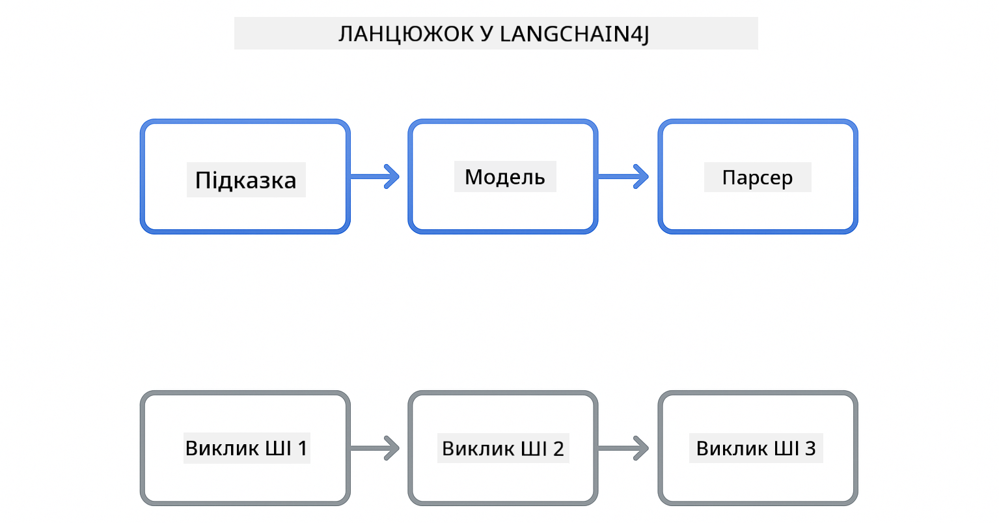

<!--
CO_OP_TRANSLATOR_METADATA:
{
  "original_hash": "377b3e3e6f8d02965bf0fbbc9ccb45c5",
  "translation_date": "2025-12-13T15:25:41+00:00",
  "source_file": "00-quick-start/README.md",
  "language_code": "uk"
}
-->
# Module 00: Quick Start

## Table of Contents

- [Вступ](../../../00-quick-start)
- [Що таке LangChain4j?](../../../00-quick-start)
- [Залежності LangChain4j](../../../00-quick-start)
- [Вимоги](../../../00-quick-start)
- [Налаштування](../../../00-quick-start)
  - [1. Отримайте свій GitHub токен](../../../00-quick-start)
  - [2. Встановіть свій токен](../../../00-quick-start)
- [Запуск прикладів](../../../00-quick-start)
  - [1. Базовий чат](../../../00-quick-start)
  - [2. Шаблони підказок](../../../00-quick-start)
  - [3. Виклик функцій](../../../00-quick-start)
  - [4. Питання та відповіді по документу (RAG)](../../../00-quick-start)
- [Що показує кожен приклад](../../../00-quick-start)
- [Наступні кроки](../../../00-quick-start)
- [Вирішення проблем](../../../00-quick-start)

## Introduction

Цей швидкий старт призначений, щоб якомога швидше допомогти вам почати працювати з LangChain4j. Він охоплює найпростіші основи створення AI-додатків з LangChain4j та GitHub Models. У наступних модулях ви використовуватимете Azure OpenAI з LangChain4j для створення більш складних додатків.

## What is LangChain4j?

LangChain4j — це бібліотека Java, яка спрощує створення додатків з підтримкою штучного інтелекту. Замість роботи з HTTP-клієнтами та парсингом JSON ви працюєте з чистими Java API.

"Chain" у LangChain означає ланцюжок з кількох компонентів — ви можете зв’язати підказку з моделлю, а модель з парсером, або зв’язати кілька викликів AI, де вихід одного є вхідним для наступного. Цей швидкий старт зосереджений на основах перед вивченням складніших ланцюжків.



*Зв’язування компонентів у LangChain4j — будівельні блоки з’єднуються для створення потужних AI-процесів*

Ми використовуватимемо три основні компоненти:

**ChatLanguageModel** — інтерфейс для взаємодії з AI-моделями. Викликайте `model.chat("prompt")` і отримуйте рядок відповіді. Ми використовуємо `OpenAiOfficialChatModel`, який працює з OpenAI-сумісними кінцевими точками, такими як GitHub Models.

**AiServices** — створює типобезпечні інтерфейси AI-сервісів. Визначайте методи, анотуйте їх `@Tool`, і LangChain4j керує оркестрацією. AI автоматично викликає ваші Java-методи за потреби.

**MessageWindowChatMemory** — підтримує історію розмови. Без цього кожен запит незалежний. З ним AI пам’ятає попередні повідомлення і підтримує контекст протягом кількох кроків.


*Архітектура LangChain4j — основні компоненти працюють разом, щоб живити ваші AI-додатки*

## LangChain4j Dependencies

Цей швидкий старт використовує дві залежності Maven у файлі [`pom.xml`](../../../00-quick-start/pom.xml):

```xml
<!-- Core LangChain4j library -->
<dependency>
    <groupId>dev.langchain4j</groupId>
    <artifactId>langchain4j</artifactId> <!-- Inherited from BOM in root pom.xml -->
</dependency>

<!-- OpenAI integration (works with GitHub Models) -->
<dependency>
    <groupId>dev.langchain4j</groupId>
    <artifactId>langchain4j-open-ai-official</artifactId> <!-- Inherited from BOM in root pom.xml -->
</dependency>
```

Модуль `langchain4j-open-ai-official` надає клас `OpenAiOfficialChatModel`, який підключається до OpenAI-сумісних API. GitHub Models використовує той самий формат API, тому спеціальний адаптер не потрібен — просто вкажіть базову URL-адресу `https://models.github.ai/inference`.

## Prerequisites

**Використовуєте Dev Container?** Java та Maven вже встановлені. Вам потрібен лише персональний токен доступу GitHub.

**Локальна розробка:**
- Java 21+, Maven 3.9+
- Персональний токен доступу GitHub (інструкції нижче)

> **Примітка:** Цей модуль використовує `gpt-4.1-nano` з GitHub Models. Не змінюйте ім’я моделі в коді — воно налаштоване для роботи з доступними моделями GitHub.

## Setup

### 1. Get Your GitHub Token

1. Перейдіть до [GitHub Settings → Personal Access Tokens](https://github.com/settings/personal-access-tokens)
2. Натисніть "Generate new token"
3. Встановіть описове ім’я (наприклад, "LangChain4j Demo")
4. Встановіть термін дії (рекомендується 7 днів)
5. У розділі "Account permissions" знайдіть "Models" і встановіть "Read-only"
6. Натисніть "Generate token"
7. Скопіюйте та збережіть токен — ви більше не побачите його

### 2. Set Your Token

**Варіант 1: Використання VS Code (рекомендовано)**

Якщо ви використовуєте VS Code, додайте свій токен у файл `.env` у корені проекту:

Якщо файл `.env` не існує, скопіюйте `.env.example` у `.env` або створіть новий файл `.env` у корені проекту.

**Приклад файлу `.env`:**
```bash
# У /workspaces/LangChain4j-for-Beginners/.env
GITHUB_TOKEN=your_token_here
```

Потім просто клацніть правою кнопкою миші на будь-якому демонстраційному файлі (наприклад, `BasicChatDemo.java`) у Провіднику і виберіть **"Run Java"** або використовуйте конфігурації запуску з панелі Run and Debug.

**Варіант 2: Використання терміналу**

Встановіть токен як змінну середовища:

**Bash:**
```bash
export GITHUB_TOKEN=your_token_here
```

**PowerShell:**
```powershell
$env:GITHUB_TOKEN=your_token_here
```

## Run the Examples

**Використання VS Code:** Просто клацніть правою кнопкою миші на будь-якому демонстраційному файлі у Провіднику і виберіть **"Run Java"**, або використовуйте конфігурації запуску з панелі Run and Debug (переконайтеся, що спочатку додали токен у файл `.env`).

**Використання Maven:** Альтернативно, можна запускати з командного рядка:

### 1. Basic Chat

**Bash:**
```bash
mvn compile exec:java -Dexec.mainClass=com.example.langchain4j.quickstart.BasicChatDemo
```

**PowerShell:**
```powershell
mvn --% compile exec:java -Dexec.mainClass=com.example.langchain4j.quickstart.BasicChatDemo
```

### 2. Prompt Patterns

**Bash:**
```bash
mvn compile exec:java -Dexec.mainClass=com.example.langchain4j.quickstart.PromptEngineeringDemo
```

**PowerShell:**
```powershell
mvn --% compile exec:java -Dexec.mainClass=com.example.langchain4j.quickstart.PromptEngineeringDemo
```

Показує zero-shot, few-shot, chain-of-thought та рольові підказки.

### 3. Function Calling

**Bash:**
```bash
mvn compile exec:java -Dexec.mainClass=com.example.langchain4j.quickstart.ToolIntegrationDemo
```

**PowerShell:**
```powershell
mvn --% compile exec:java -Dexec.mainClass=com.example.langchain4j.quickstart.ToolIntegrationDemo
```

AI автоматично викликає ваші Java-методи за потреби.

### 4. Document Q&A (RAG)

**Bash:**
```bash
mvn compile exec:java -Dexec.mainClass=com.example.langchain4j.quickstart.SimpleReaderDemo
```

**PowerShell:**
```powershell
mvn --% compile exec:java -Dexec.mainClass=com.example.langchain4j.quickstart.SimpleReaderDemo
```

Задавайте питання про вміст файлу `document.txt`.

## What Each Example Shows

**Basic Chat** - [BasicChatDemo.java](../../../00-quick-start/src/main/java/com/example/langchain4j/quickstart/BasicChatDemo.java)

Почніть тут, щоб побачити LangChain4j у найпростішому вигляді. Ви створите `OpenAiOfficialChatModel`, надішлете підказку через `.chat()` і отримаєте відповідь. Це демонструє основу: як ініціалізувати моделі з користувацькими кінцевими точками та API-ключами. Коли ви зрозумієте цей шаблон, все інше будується на ньому.

```java
ChatLanguageModel model = OpenAiOfficialChatModel.builder()
    .baseUrl("https://models.github.ai/inference")
    .apiKey(System.getenv("GITHUB_TOKEN"))
    .modelName("gpt-4.1-nano")
    .build();

String response = model.chat("What is LangChain4j?");
System.out.println(response);
```

> **🤖 Спробуйте з [GitHub Copilot](https://github.com/features/copilot) Chat:** Відкрийте [`BasicChatDemo.java`](../../../00-quick-start/src/main/java/com/example/langchain4j/quickstart/BasicChatDemo.java) і запитайте:
> - "Як переключитися з GitHub Models на Azure OpenAI у цьому коді?"
> - "Які інші параметри можна налаштувати в OpenAiOfficialChatModel.builder()?"
> - "Як додати потокові відповіді замість очікування повної відповіді?"

**Prompt Engineering** - [PromptEngineeringDemo.java](../../../00-quick-start/src/main/java/com/example/langchain4j/quickstart/PromptEngineeringDemo.java)

Тепер, коли ви знаєте, як спілкуватися з моделлю, давайте дослідимо, що саме ви їй говорите. Цей демо використовує ту ж модель, але показує чотири різні шаблони підказок. Спробуйте zero-shot підказки для прямих інструкцій, few-shot підказки, які навчаються на прикладах, chain-of-thought підказки, що розкривають кроки міркувань, та рольові підказки, які встановлюють контекст. Ви побачите, як одна й та сама модель дає кардинально різні результати залежно від формулювання запиту.

```java
PromptTemplate template = PromptTemplate.from(
    "What's the best time to visit {{destination}} for {{activity}}?"
);

Prompt prompt = template.apply(Map.of(
    "destination", "Paris",
    "activity", "sightseeing"
));

String response = model.chat(prompt.text());
```

> **🤖 Спробуйте з [GitHub Copilot](https://github.com/features/copilot) Chat:** Відкрийте [`PromptEngineeringDemo.java`](../../../00-quick-start/src/main/java/com/example/langchain4j/quickstart/PromptEngineeringDemo.java) і запитайте:
> - "У чому різниця між zero-shot і few-shot підказками, і коли яку слід використовувати?"
> - "Як параметр temperature впливає на відповіді моделі?"
> - "Які є методи запобігання атакам через ін’єкції підказок у продакшені?"
> - "Як створити повторно використовувані об’єкти PromptTemplate для поширених шаблонів?"

**Tool Integration** - [ToolIntegrationDemo.java](../../../00-quick-start/src/main/java/com/example/langchain4j/quickstart/ToolIntegrationDemo.java)

Ось де LangChain4j стає потужним. Ви використовуватимете `AiServices` для створення AI-помічника, який може викликати ваші Java-методи. Просто анотуйте методи `@Tool("опис")`, і LangChain4j зробить усе інше — AI автоматично вирішує, коли використовувати кожен інструмент залежно від запиту користувача. Це демонструє виклик функцій, ключову техніку для створення AI, який може виконувати дії, а не лише відповідати на питання.

```java
@Tool("Performs addition of two numeric values")
public double add(double a, double b) {
    return a + b;
}

MathAssistant assistant = AiServices.create(MathAssistant.class, model);
String response = assistant.chat("What is 25 plus 17?");
```

> **🤖 Спробуйте з [GitHub Copilot](https://github.com/features/copilot) Chat:** Відкрийте [`ToolIntegrationDemo.java`](../../../00-quick-start/src/main/java/com/example/langchain4j/quickstart/ToolIntegrationDemo.java) і запитайте:
> - "Як працює анотація @Tool і що LangChain4j робить з нею за лаштунками?"
> - "Чи може AI викликати кілька інструментів послідовно для розв’язання складних задач?"
> - "Що станеться, якщо інструмент викине виключення — як обробляти помилки?"
> - "Як інтегрувати реальний API замість цього прикладу калькулятора?"

**Document Q&A (RAG)** - [SimpleReaderDemo.java](../../../00-quick-start/src/main/java/com/example/langchain4j/quickstart/SimpleReaderDemo.java)

Тут ви побачите основу RAG (retrieval-augmented generation). Замість того, щоб покладатися на навчальні дані моделі, ви завантажуєте вміст з [`document.txt`](../../../00-quick-start/document.txt) і включаєте його в підказку. AI відповідає на основі вашого документа, а не загальних знань. Це перший крок до створення систем, які можуть працювати з вашими власними даними.

```java
Document document = FileSystemDocumentLoader.loadDocument("document.txt");
String content = document.text();

String prompt = "Based on this document: " + content + 
                "\nQuestion: What is the main topic?";
String response = model.chat(prompt);
```

> **Примітка:** Цей простий підхід завантажує весь документ у підказку. Для великих файлів (>10KB) ви перевищите ліміти контексту. Модуль 03 охоплює розбиття на частини та векторний пошук для продакшн-систем RAG.

> **🤖 Спробуйте з [GitHub Copilot](https://github.com/features/copilot) Chat:** Відкрийте [`SimpleReaderDemo.java`](../../../00-quick-start/src/main/java/com/example/langchain4j/quickstart/SimpleReaderDemo.java) і запитайте:
> - "Як RAG запобігає галюцинаціям AI порівняно з використанням навчальних даних моделі?"
> - "У чому різниця між цим простим підходом і використанням векторних ембеддингів для пошуку?"
> - "Як масштабувати це для роботи з кількома документами або більшими базами знань?"
> - "Які найкращі практики структурування підказки, щоб AI використовував лише наданий контекст?"

## Debugging

Приклади включають `.logRequests(true)` та `.logResponses(true)`, щоб показувати виклики API в консолі. Це допомагає усувати помилки автентифікації, обмеження швидкості або несподівані відповіді. Видаліть ці прапорці у продакшені, щоб зменшити шум у логах.

## Next Steps

**Наступний модуль:** [01-introduction - Початок роботи з LangChain4j та gpt-5 на Azure](../01-introduction/README.md)

---

**Навігація:** [← Назад до головної](../README.md) | [Далі: Модуль 01 - Вступ →](../01-introduction/README.md)

---

## Troubleshooting

### First-Time Maven Build

**Проблема:** Початковий `mvn clean compile` або `mvn package` займає багато часу (10-15 хвилин)

**Причина:** Maven повинен завантажити всі залежності проекту (Spring Boot, бібліотеки LangChain4j, Azure SDK тощо) під час першої збірки.

**Рішення:** Це нормальна поведінка. Наступні збірки будуть значно швидшими, оскільки залежності кешуються локально. Час завантаження залежить від швидкості вашого інтернет-з’єднання.

### PowerShell Maven Command Syntax

**Проблема:** Команди Maven не працюють з помилкою `Unknown lifecycle phase ".mainClass=..."`

**Причина:** PowerShell інтерпретує `=` як оператор присвоєння змінної, що порушує синтаксис властивостей Maven.

**Рішення:** Використовуйте оператор припинення парсингу `--%` перед командою Maven:

**PowerShell:**
```powershell
mvn --% compile exec:java -Dexec.mainClass=com.example.langchain4j.quickstart.BasicChatDemo
```

**Bash:**
```bash
mvn compile exec:java -Dexec.mainClass=com.example.langchain4j.quickstart.BasicChatDemo
```

Оператор `--%` каже PowerShell передати всі наступні аргументи буквально Maven без інтерпретації.

### Windows PowerShell Emoji Display

**Проблема:** Відповіді AI показують некоректні символи (наприклад, `????` або `â??`) замість емодзі у PowerShell

**Причина:** За замовчуванням кодування PowerShell не підтримує UTF-8 емодзі

**Рішення:** Виконайте цю команду перед запуском Java-додатків:
```cmd
chcp 65001
```

Це примусово встановлює кодування UTF-8 у терміналі. Альтернативно, використовуйте Windows Terminal, який має кращу підтримку Unicode.

---

<!-- CO-OP TRANSLATOR DISCLAIMER START -->
**Відмова від відповідальності**:  
Цей документ було перекладено за допомогою сервісу автоматичного перекладу [Co-op Translator](https://github.com/Azure/co-op-translator). Хоча ми прагнемо до точності, будь ласка, майте на увазі, що автоматичні переклади можуть містити помилки або неточності. Оригінальний документ рідною мовою слід вважати авторитетним джерелом. Для критично важливої інформації рекомендується звертатися до професійного людського перекладу. Ми не несемо відповідальності за будь-які непорозуміння або неправильні тлумачення, що виникли внаслідок використання цього перекладу.
<!-- CO-OP TRANSLATOR DISCLAIMER END -->