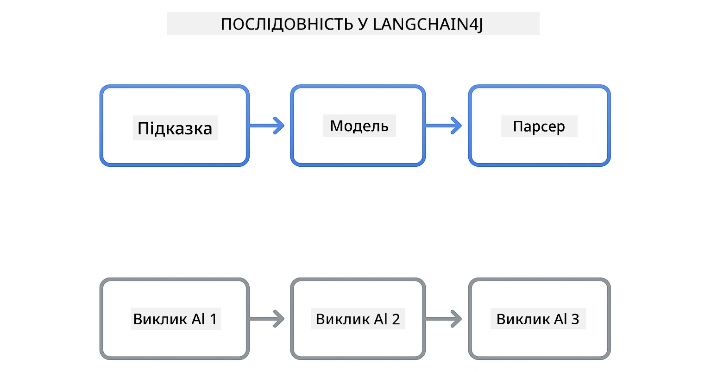
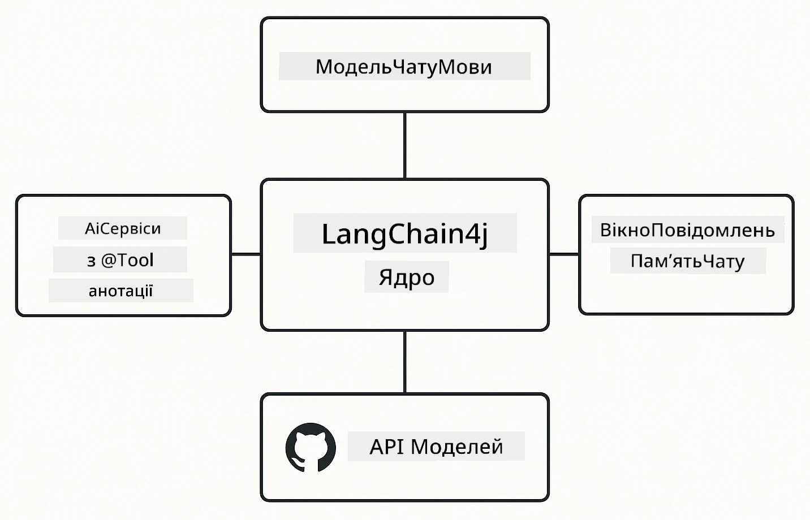

# Module 00: Швидкий старт

## Зміст

- [Вступ](../../../00-quick-start)
- [Що таке LangChain4j?](../../../00-quick-start)
- [Залежності LangChain4j](../../../00-quick-start)
- [Вимоги](../../../00-quick-start)
- [Налаштування](../../../00-quick-start)
  - [1. Отримайте свій токен GitHub](../../../00-quick-start)
  - [2. Встановіть свій токен](../../../00-quick-start)
- [Запуск прикладів](../../../00-quick-start)
  - [1. Базовий чат](../../../00-quick-start)
  - [2. Шаблони запитів](../../../00-quick-start)
  - [3. Виклик функцій](../../../00-quick-start)
  - [4. Питання та відповіді по документу (RAG)](../../../00-quick-start)
  - [5. Відповідальна ШІ](../../../00-quick-start)
- [Що демонструє кожен приклад](../../../00-quick-start)
- [Наступні кроки](../../../00-quick-start)
- [Усунення неполадок](../../../00-quick-start)

## Вступ

Цей швидкий старт призначений, щоб максимально швидко запустити вас з LangChain4j. Він охоплює найосновніші аспекти створення AI-застосунків з LangChain4j та GitHub Models. У наступних модулях ви використовуватимете Azure OpenAI разом з LangChain4j для створення більш складних додатків.

## Що таке LangChain4j?

LangChain4j — це бібліотека на Java, яка спрощує створення застосунків із штучним інтелектом. Замість роботи з HTTP-клієнтами та розбором JSON, ви працюєте з чистими Java API.

"Chain" у LangChain означає зв’язування кількох компонентів — наприклад, ви можете зв’язати запит до моделі, а потім до парсера, або об’єднати декілька викликів ШІ, де вихід одного слугує вхідними даними для наступного. Цей швидкий старт зосереджено на базових поняттях перед вивченням складніших ланцюжків.



*Зв’язування компонентів у LangChain4j — будівельні блоки поєднуються для створення потужних AI-процесів*

Ми використовуватимемо три основні компоненти:

**ChatLanguageModel** — інтерфейс для взаємодії з AI моделями. Викликайте `model.chat("prompt")` і отримуйте рядок відповіді. Ми використовуємо `OpenAiOfficialChatModel`, який працює з сумісними з OpenAI API, такими як GitHub Models.

**AiServices** — створює типобезпечні інтерфейси для AI сервісів. Визначте методи, анотуйте їх `@Tool`, і LangChain4j керуватиме оркестрацією. ШІ автоматично викликає ваші Java-методи за потребою.

**MessageWindowChatMemory** — зберігає історію розмови. Без нього кожен запит незалежний. З ним ШІ пам’ятає попередні повідомлення і підтримує контекст протягом декількох кроків.



*Архітектура LangChain4j — основні компоненти працюють разом, щоб живити ваші AI-застосунки*

## Залежності LangChain4j

Цей швидкий старт використовує дві залежності Maven у [`pom.xml`](../../../00-quick-start/pom.xml):

```xml
<!-- Core LangChain4j library -->
<dependency>
    <groupId>dev.langchain4j</groupId>
    <artifactId>langchain4j</artifactId> <!-- Inherited from BOM in root pom.xml -->
</dependency>

<!-- OpenAI integration (works with GitHub Models) -->
<dependency>
    <groupId>dev.langchain4j</groupId>
    <artifactId>langchain4j-open-ai-official</artifactId> <!-- Inherited from BOM in root pom.xml -->
</dependency>
```
  
Модуль `langchain4j-open-ai-official` надає клас `OpenAiOfficialChatModel`, який підключається до OpenAI-сумісних API. GitHub Models використовує той самий формат API, тож не потрібен спеціальний адаптер — просто вкажіть базовий URL `https://models.github.ai/inference`.

## Вимоги

**Використовуєте Dev Container?** Java та Maven вже встановлені. Потрібен лише особистий токен GitHub.

**Локальна розробка:**
- Java 21+, Maven 3.9+
- Особистий токен доступу GitHub (інструкції нижче)

> **Примітка:** У цьому модулі використовується `gpt-4.1-nano` від GitHub Models. Не змінюйте ім'я моделі в коді — вона налаштована на роботу з доступними моделями GitHub.

## Налаштування

### 1. Отримайте свій токен GitHub

1. Перейдіть у [Налаштування GitHub → Особисті токени доступу](https://github.com/settings/personal-access-tokens)  
2. Натисніть "Generate new token"  
3. Встановіть описове ім’я (наприклад, "LangChain4j Demo")  
4. Встановіть термін дії (рекомендується 7 днів)  
5. В розділі "Account permissions" знайдіть "Models" і встановіть "Read-only"  
6. Натисніть "Generate token"  
7. Скопіюйте і збережіть свій токен — знову побачити його не вдасться

### 2. Встановіть свій токен

**Варіант 1: Використання VS Code (рекомендується)**

Якщо ви працюєте у VS Code, додайте токен у файл `.env` у корені проекту:

Якщо файл `.env` відсутній, скопіюйте `.env.example` у `.env` або створіть новий `.env` у корені проекту.

**Приклад файлу `.env`:**  
```bash
# У /workspaces/LangChain4j-for-Beginners/.env
GITHUB_TOKEN=your_token_here
```
  
Потім просто клацніть правою кнопкою миші на будь-якому демонстраційному файлі (наприклад, `BasicChatDemo.java`) в Провіднику і виберіть **"Run Java"** або скористайтесь конфігураціями запуску у панелі Run and Debug.

**Варіант 2: Використання терміналу**

Встановіть токен як змінну середовища:

**Bash:**  
```bash
export GITHUB_TOKEN=your_token_here
```
  
**PowerShell:**  
```powershell
$env:GITHUB_TOKEN=your_token_here
```
  
## Запуск прикладів

**У VS Code:** Просто клацніть правою кнопкою на демонстраційному файлі в Провіднику і виберіть **"Run Java"** або використайте конфігурації запуску з панелі Run and Debug (переконайтеся, що спочатку додали токен у файл `.env`).

**Через Maven:** Також можна запускати з командного рядка:

### 1. Базовий чат

**Bash:**  
```bash
mvn compile exec:java -Dexec.mainClass=com.example.langchain4j.quickstart.BasicChatDemo
```
  
**PowerShell:**  
```powershell
mvn --% compile exec:java -Dexec.mainClass=com.example.langchain4j.quickstart.BasicChatDemo
```
  
### 2. Шаблони запитів

**Bash:**  
```bash
mvn compile exec:java -Dexec.mainClass=com.example.langchain4j.quickstart.PromptEngineeringDemo
```
  
**PowerShell:**  
```powershell
mvn --% compile exec:java -Dexec.mainClass=com.example.langchain4j.quickstart.PromptEngineeringDemo
```
  
Демонструє zero-shot, few-shot, chain-of-thought та рольові запити.

### 3. Виклик функцій

**Bash:**  
```bash
mvn compile exec:java -Dexec.mainClass=com.example.langchain4j.quickstart.ToolIntegrationDemo
```
  
**PowerShell:**  
```powershell
mvn --% compile exec:java -Dexec.mainClass=com.example.langchain4j.quickstart.ToolIntegrationDemo
```
  
ШІ автоматично викликає ваші Java-методи за потребою.

### 4. Питання та відповіді по документу (RAG)

**Bash:**  
```bash
mvn compile exec:java -Dexec.mainClass=com.example.langchain4j.quickstart.SimpleReaderDemo
```
  
**PowerShell:**  
```powershell
mvn --% compile exec:java -Dexec.mainClass=com.example.langchain4j.quickstart.SimpleReaderDemo
```
  
Задавайте питання щодо вмісту файлу `document.txt`.

### 5. Відповідальна ШІ

**Bash:**  
```bash
mvn compile exec:java -Dexec.mainClass=com.example.langchain4j.quickstart.ResponsibleAIDemo
```
  
**PowerShell:**  
```powershell
mvn --% compile exec:java -Dexec.mainClass=com.example.langchain4j.quickstart.ResponsibleAIDemo
```
  
Покажемо, як фільтри безпеки ШІ блокують шкідливий контент.

## Що демонструє кожен приклад

**Базовий чат** - [BasicChatDemo.java](../../../00-quick-start/src/main/java/com/example/langchain4j/quickstart/BasicChatDemo.java)

Почніть тут, щоб побачити LangChain4j у найпростішому вигляді. Ви створите `OpenAiOfficialChatModel`, надішлете запит через `.chat()` і отримаєте відповідь. Це демонструє основу: як ініціалізувати моделі з кастомними кінцевими точками та API ключами. Коли зрозумієте цей патерн, все інше буде побудоване на ньому.

```java
ChatLanguageModel model = OpenAiOfficialChatModel.builder()
    .baseUrl("https://models.github.ai/inference")
    .apiKey(System.getenv("GITHUB_TOKEN"))
    .modelName("gpt-4.1-nano")
    .build();

String response = model.chat("What is LangChain4j?");
System.out.println(response);
```
  
> **🤖 Спробуйте з [GitHub Copilot](https://github.com/features/copilot) Chat:** Відкрийте [`BasicChatDemo.java`](../../../00-quick-start/src/main/java/com/example/langchain4j/quickstart/BasicChatDemo.java) і запитайте:  
> - "Як переключитися з GitHub Models на Azure OpenAI у цьому коді?"  
> - "Які інші параметри можна налаштувати в OpenAiOfficialChatModel.builder()?"  
> - "Як додати потокові відповіді замість очікування повної відповіді?"

**Інженерія запитів** - [PromptEngineeringDemo.java](../../../00-quick-start/src/main/java/com/example/langchain4j/quickstart/PromptEngineeringDemo.java)

Тепер, коли ви знаєте як спілкуватись з моделлю, давайте розглянемо, що саме ви їй говорите. Цей демо-приклад використовує ту саму модель, але показує чотири різні шаблони запитів. Спробуйте zero-shot — прямі інструкції, few-shot — навчання на прикладах, chain-of-thought — розкриття кроків мислення, рольові запити — встановлення контексту. Ви побачите, як одна й та сама модель дає зовсім різні результати залежно від формулювання запиту.

```java
PromptTemplate template = PromptTemplate.from(
    "What's the best time to visit {{destination}} for {{activity}}?"
);

Prompt prompt = template.apply(Map.of(
    "destination", "Paris",
    "activity", "sightseeing"
));

String response = model.chat(prompt.text());
```
  
> **🤖 Спробуйте з [GitHub Copilot](https://github.com/features/copilot) Chat:** Відкрийте [`PromptEngineeringDemo.java`](../../../00-quick-start/src/main/java/com/example/langchain4j/quickstart/PromptEngineeringDemo.java) і запитайте:  
> - "Яка різниця між zero-shot та few-shot і коли їх використовувати?"  
> - "Як параметр температури впливає на відповіді моделі?"  
> - "Які є способи запобігання атак з введенням шкідливих запитів (prompt injection) на продакшені?"  
> - "Як створювати повторно використовувані об’єкти PromptTemplate для типових шаблонів?"

**Інтеграція інструментів** - [ToolIntegrationDemo.java](../../../00-quick-start/src/main/java/com/example/langchain4j/quickstart/ToolIntegrationDemo.java)

Ось де LangChain4j стає потужним. Ви використаєте `AiServices`, щоб створити AI-помічника, який може викликати ваші Java-методи. Просто анотуйте методи `@Tool("опис")`, а LangChain4j зробить усе інше — ШІ автоматично вирішить, коли використати той чи інший інструмент залежно від запиту користувача. Це демонструє виклик функцій — ключову техніку для створення ШІ, який може діяти, а не лише відповідати на питання.

```java
@Tool("Performs addition of two numeric values")
public double add(double a, double b) {
    return a + b;
}

MathAssistant assistant = AiServices.create(MathAssistant.class, model);
String response = assistant.chat("What is 25 plus 17?");
```
  
> **🤖 Спробуйте з [GitHub Copilot](https://github.com/features/copilot) Chat:** Відкрийте [`ToolIntegrationDemo.java`](../../../00-quick-start/src/main/java/com/example/langchain4j/quickstart/ToolIntegrationDemo.java) і запитайте:  
> - "Як працює анотація @Tool і що LangChain4j робить з нею за лаштунками?"  
> - "Чи може ШІ послідовно викликати кілька інструментів, щоб розв’язати складні проблеми?"  
> - "Що відбувається, якщо інструмент викидає виняток — як обробляти помилки?"  
> - "Як інтегрувати реальний API замість прикладу з калькулятором?"

**Питання та відповіді по документу (RAG)** - [SimpleReaderDemo.java](../../../00-quick-start/src/main/java/com/example/langchain4j/quickstart/SimpleReaderDemo.java)

Тут ви побачите основу концепції RAG (retrieval-augmented generation). Замість покладання на тренувальні дані моделі, ви завантажуєте зміст з [`document.txt`](../../../00-quick-start/document.txt) і включаєте його у запит. ШІ відповідає на основі вашого документа, а не на загальних знаннях. Це перший крок до створення систем, які мають справу з вашими власними даними.

```java
Document document = FileSystemDocumentLoader.loadDocument("document.txt");
String content = document.text();

String prompt = "Based on this document: " + content + 
                "\nQuestion: What is the main topic?";
String response = model.chat(prompt);
```
  
> **Примітка:** Цей простий підхід завантажує увесь документ у запит. Для великих файлів (>10КБ) ви вийдете за межі контекстних обмежень. Модуль 03 охоплює розбиття на частини та пошук за векторними уявленнями для продуктивних RAG систем.

> **🤖 Спробуйте з [GitHub Copilot](https://github.com/features/copilot) Chat:** Відкрийте [`SimpleReaderDemo.java`](../../../00-quick-start/src/main/java/com/example/langchain4j/quickstart/SimpleReaderDemo.java) і запитайте:  
> - "Як RAG запобігає галюцинаціям AI у порівнянні з використанням тренувальних даних моделі?"  
> - "Чим цей простий підхід відрізняється від використання векторних уявлень для пошуку?"  
> - "Як масштабувати це, щоб обробляти кілька документів або більші бази знань?"  
> - "Які найкращі практики структурування запиту, щоб переконатися, що ШІ використовує лише наданий контекст?"

**Відповідальна ШІ** - [ResponsibleAIDemo.java](../../../00-quick-start/src/main/java/com/example/langchain4j/quickstart/ResponsibleAIDemo.java)

Побудуйте безпеку ШІ з багаторівневим захистом. Цей демонстраційний приклад показує дві шари захисту, що працюють разом:

**Частина 1: LangChain4j Input Guardrails** — блокує небезпечні запити до того, як вони потраплять до LLM. Створюйте власні guardrails, які перевіряють заборонені ключові слова або шаблони. Вони виконуються у вашому коді, тому швидкі та безкоштовні.

```java
class DangerousContentGuardrail implements InputGuardrail {
    @Override
    public InputGuardrailResult validate(UserMessage userMessage) {
        String text = userMessage.singleText().toLowerCase();
        if (text.contains("explosives")) {
            return fatal("Blocked: contains prohibited keyword");
        }
        return success();
    }
}
```
  
**Частина 2: Фільтри безпеки провайдера** — GitHub Models має вбудовані фільтри, які ловлять те, що можуть пропустити ваші guardrails. Ви побачите жорсткі блокування (HTTP 400 помилки) за серйозні порушення і м’які відмови, де ШІ ввічливо відмовляється.

> **🤖 Спробуйте з [GitHub Copilot](https://github.com/features/copilot) Chat:** Відкрийте [`ResponsibleAIDemo.java`](../../../00-quick-start/src/main/java/com/example/langchain4j/quickstart/ResponsibleAIDemo.java) і запитайте:  
> - "Що таке InputGuardrail і як створити свій власний?"  
> - "У чому різниця між жорстким блокуванням та м’якою відмовою?"  
> - "Чому використовувати і guardrails, і фільтри провайдера разом?"

## Наступні кроки

**Наступний модуль:** [01-introduction - Початок роботи з LangChain4j та gpt-5 на Azure](../01-introduction/README.md)

---

**Навігація:** [← Назад до головної](../README.md) | [Далі: Модуль 01 - Вступ →](../01-introduction/README.md)

---

## Усунення неполадок

### Перший збір Maven

**Проблема**: Початкова команда `mvn clean compile` або `mvn package` займає багато часу (10-15 хвилин)

**Причина**: Maven повинен завантажити усі залежності проекту (Spring Boot, бібліотеки LangChain4j, Azure SDK тощо) під час першого збіру.

**Рішення**: Це нормальна поведінка. Наступні зборки будуть значно швидшими, оскільки залежності кешуватимуться локально. Час завантаження залежить від швидкості вашого інтернет-з’єднання.

### Синтаксис команд Maven у PowerShell

**Проблема**: Команди Maven повертають помилку `Unknown lifecycle phase ".mainClass=..."`

**Причина**: PowerShell трактує `=` як оператор присвоєння змінної, через що порушується синтаксис властивості Maven.
**Рішення**: Використовуйте оператор припинення розбору `--%` перед командою Maven:

**PowerShell:**
```powershell
mvn --% compile exec:java -Dexec.mainClass=com.example.langchain4j.quickstart.BasicChatDemo
```

**Bash:**
```bash
mvn compile exec:java -Dexec.mainClass=com.example.langchain4j.quickstart.BasicChatDemo
```

Оператор `--%` вказує PowerShell передати всі решту аргументів буквально в Maven без інтерпретації.

### Відображення емодзі в Windows PowerShell

**Проблема**: Відповіді ШІ показують неправильні символи (наприклад, `????` або `â??`) замість емодзі в PowerShell

**Причина**: Стандартне кодування PowerShell не підтримує емодзі UTF-8

**Рішення**: Виконайте цю команду перед запуском Java-застосунків:
```cmd
chcp 65001
```

Це примусово встановлює кодування UTF-8 у терміналі. Як альтернативу, можна використовувати Windows Terminal, який має кращу підтримку Unicode.

### Налагодження викликів API

**Проблема**: Помилки автентифікації, обмеження частоти або несподівані відповіді від моделі ШІ

**Рішення**: Приклади містять `.logRequests(true)` і `.logResponses(true)` для відображення викликів API у консолі. Це допомагає усунути помилки автентифікації, обмеження частоти або несподівані відповіді. Видаліть ці прапори у продуктивному середовищі, щоб зменшити шум у логах.

---

<!-- CO-OP TRANSLATOR DISCLAIMER START -->
**Відмова від відповідальності**:
Цей документ перекладено за допомогою сервісу автоматичного перекладу [Co-op Translator](https://github.com/Azure/co-op-translator). Хоча ми прагнемо до точності, будь ласка, враховуйте, що автоматичні переклади можуть містити помилки або неточності. Оригінальний документ рідною мовою слід вважати авторитетним джерелом. Для критично важливої інформації рекомендується скористатися послугами професійного людського перекладу. Ми не несемо відповідальності за будь-які непорозуміння або неправильні тлумачення, що можуть виникнути внаслідок використання цього перекладу.
<!-- CO-OP TRANSLATOR DISCLAIMER END -->