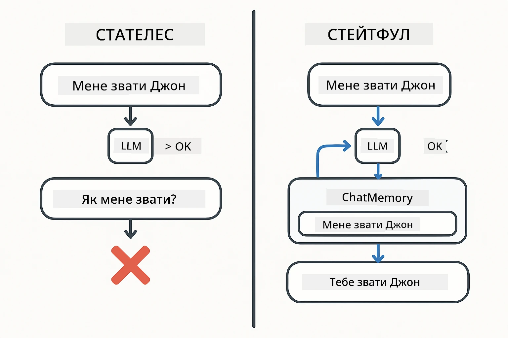
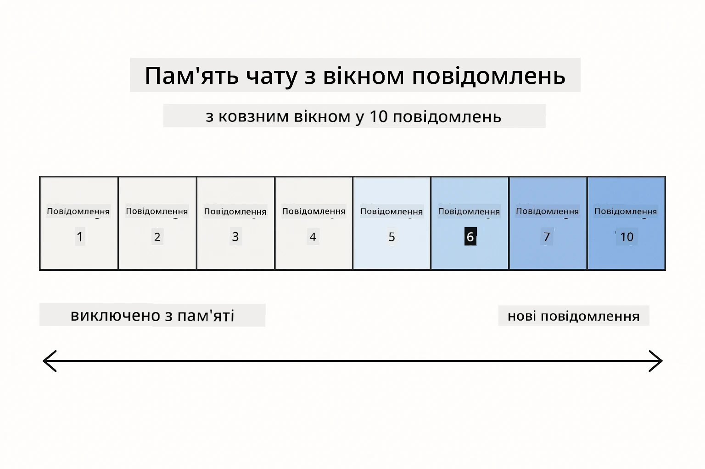
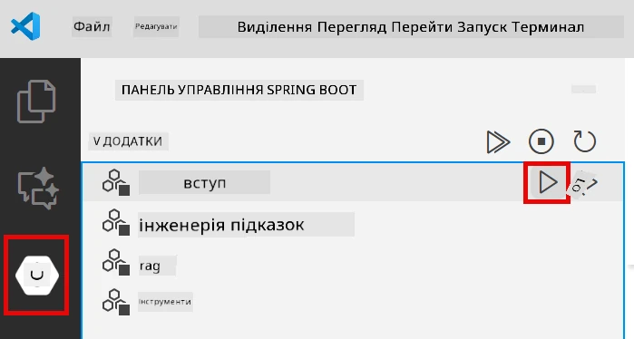
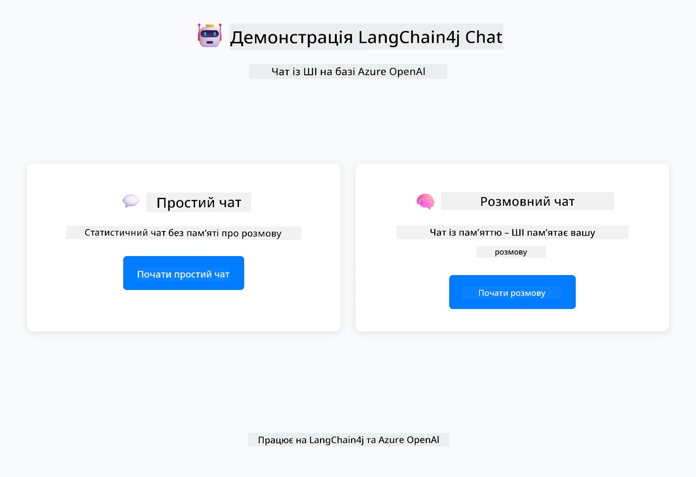
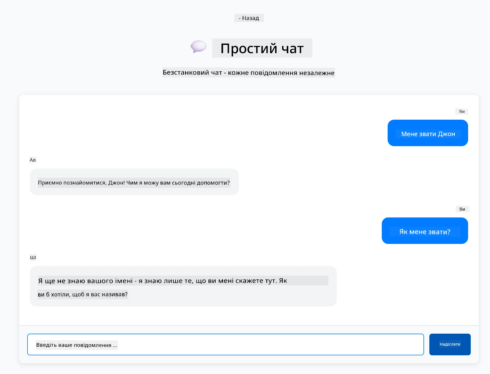
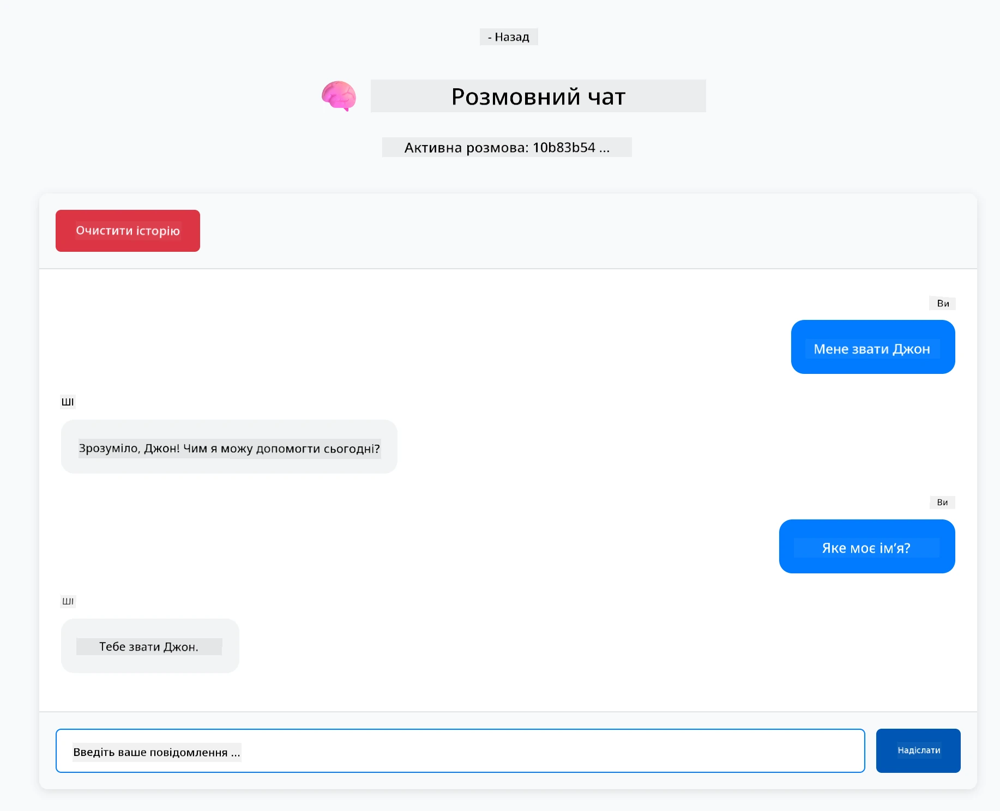

<!--
CO_OP_TRANSLATOR_METADATA:
{
  "original_hash": "c3e07ca58d0b8a3f47d3bf5728541e0a",
  "translation_date": "2025-12-13T14:12:55+00:00",
  "source_file": "01-introduction/README.md",
  "language_code": "uk"
}
-->
# Модуль 01: Початок роботи з LangChain4j

## Зміст

- [Чого ви навчитеся](../../../01-introduction)
- [Вимоги](../../../01-introduction)
- [Розуміння основної проблеми](../../../01-introduction)
- [Розуміння токенів](../../../01-introduction)
- [Як працює пам’ять](../../../01-introduction)
- [Як це використовує LangChain4j](../../../01-introduction)
- [Розгортання інфраструктури Azure OpenAI](../../../01-introduction)
- [Запуск додатку локально](../../../01-introduction)
- [Використання додатку](../../../01-introduction)
  - [Безстанова розмова (ліва панель)](../../../01-introduction)
  - [Станова розмова (права панель)](../../../01-introduction)
- [Наступні кроки](../../../01-introduction)

## Чого ви навчитеся

Якщо ви пройшли швидкий старт, то бачили, як надсилати підказки і отримувати відповіді. Це основа, але реальні додатки потребують більшого. У цьому модулі ви навчитеся створювати розмовний ШІ, який пам’ятає контекст і підтримує стан — різниця між одноразовим демо і готовим до виробництва додатком.

Ми будемо використовувати GPT-5 від Azure OpenAI протягом усього посібника, оскільки його розвинені можливості логічного мислення роблять поведінку різних патернів більш очевидною. Коли ви додаєте пам’ять, ви чітко побачите різницю. Це полегшує розуміння того, що кожен компонент приносить у ваш додаток.

Ви створите один додаток, який демонструє обидва патерни:

**Безстанова розмова** — кожен запит незалежний. Модель не пам’ятає попередні повідомлення. Це патерн, який ви використовували у швидкому старті.

**Станова розмова** — кожен запит включає історію розмови. Модель підтримує контекст протягом кількох кроків. Саме це потрібно для виробничих додатків.

## Вимоги

- Підписка Azure з доступом до Azure OpenAI
- Java 21, Maven 3.9+
- Azure CLI (https://learn.microsoft.com/en-us/cli/azure/install-azure-cli)
- Azure Developer CLI (azd) (https://learn.microsoft.com/en-us/azure/developer/azure-developer-cli/install-azd)

> **Примітка:** Java, Maven, Azure CLI та Azure Developer CLI (azd) попередньо встановлені у наданому devcontainer.

> **Примітка:** Цей модуль використовує GPT-5 на Azure OpenAI. Розгортання налаштоване автоматично через `azd up` — не змінюйте назву моделі у коді.

## Розуміння основної проблеми

Мовні моделі безстанові. Кожен виклик API незалежний. Якщо ви скажете "Мене звати Джон", а потім запитаєте "Як мене звати?", модель не знатиме, що ви щойно представилися. Вона розглядає кожен запит, ніби це перша розмова, яку ви коли-небудь мали.

Це підходить для простих запитань-відповідей, але марно для реальних додатків. Боти служби підтримки мають пам’ятати, що ви їм сказали. Персональні помічники потребують контексту. Будь-яка багатокрокова розмова вимагає пам’яті.



*Різниця між безстановими (незалежними викликами) та становими (з урахуванням контексту) розмовами*

## Розуміння токенів

Перед тим, як зануритися в розмови, важливо зрозуміти токени — базові одиниці тексту, які обробляють мовні моделі:


*Приклад того, як текст розбивається на токени — "I love AI!" стає 4 окремими одиницями обробки*

Токени — це те, як ШІ-моделі вимірюють і обробляють текст. Слова, розділові знаки і навіть пробіли можуть бути токенами. У вашої моделі є обмеження на кількість токенів, які вона може обробити одночасно (400 000 для GPT-5, з максимум 272 000 вхідних токенів і 128 000 вихідних). Розуміння токенів допомагає керувати довжиною розмови і витратами.

## Як працює пам’ять

Пам’ять чату вирішує проблему безстановості, зберігаючи історію розмови. Перед тим, як надіслати запит моделі, фреймворк додає релевантні попередні повідомлення. Коли ви питаєте "Як мене звати?", система фактично надсилає всю історію розмови, дозволяючи моделі бачити, що ви раніше сказали "Мене звати Джон."

LangChain4j надає реалізації пам’яті, які роблять це автоматично. Ви обираєте, скільки повідомлень зберігати, а фреймворк керує контекстним вікном.



*MessageWindowChatMemory підтримує ковзне вікно останніх повідомлень, автоматично видаляючи старі*

## Як це використовує LangChain4j

Цей модуль розширює швидкий старт, інтегруючи Spring Boot і додаючи пам’ять розмови. Ось як компоненти поєднуються:

**Залежності** — додайте дві бібліотеки LangChain4j:

```xml
<dependency>
    <groupId>dev.langchain4j</groupId>
    <artifactId>langchain4j</artifactId> <!-- Inherited from BOM in root pom.xml -->
</dependency>
<dependency>
    <groupId>dev.langchain4j</groupId>
    <artifactId>langchain4j-open-ai-official</artifactId> <!-- Inherited from BOM in root pom.xml -->
</dependency>
```

**Модель чату** — налаштуйте Azure OpenAI як Spring bean ([LangChainConfig.java](../../../01-introduction/src/main/java/com/example/langchain4j/config/LangChainConfig.java)):

```java
@Bean
public OpenAiOfficialChatModel openAiOfficialChatModel() {
    return OpenAiOfficialChatModel.builder()
            .baseUrl(azureEndpoint)
            .apiKey(azureApiKey)
            .modelName(deploymentName)
            .timeout(Duration.ofMinutes(5))
            .maxRetries(3)
            .build();
}
```

Білдер зчитує облікові дані з змінних середовища, встановлених `azd up`. Встановлення `baseUrl` на ваш Azure endpoint дозволяє клієнту OpenAI працювати з Azure OpenAI.

**Пам’ять розмови** — відстежуйте історію чату за допомогою MessageWindowChatMemory ([ConversationService.java](../../../01-introduction/src/main/java/com/example/langchain4j/service/ConversationService.java)):

```java
ChatMemory memory = MessageWindowChatMemory.withMaxMessages(10);

memory.add(UserMessage.from("My name is John"));
memory.add(AiMessage.from("Nice to meet you, John!"));

memory.add(UserMessage.from("What's my name?"));
AiMessage aiMessage = chatModel.chat(memory.messages()).aiMessage();
memory.add(aiMessage);
```

Створіть пам’ять з `withMaxMessages(10)`, щоб зберігати останні 10 повідомлень. Додавайте повідомлення користувача і ШІ з типізованими обгортками: `UserMessage.from(text)` і `AiMessage.from(text)`. Отримуйте історію через `memory.messages()` і надсилайте її моделі. Сервіс зберігає окремі екземпляри пам’яті для кожного ID розмови, що дозволяє кільком користувачам спілкуватися одночасно.

> **🤖 Спробуйте з [GitHub Copilot](https://github.com/features/copilot) Chat:** Відкрийте [`ConversationService.java`](../../../01-introduction/src/main/java/com/example/langchain4j/service/ConversationService.java) і запитайте:
> - "Як MessageWindowChatMemory вирішує, які повідомлення видаляти, коли вікно заповнене?"
> - "Чи можу я реалізувати власне збереження пам’яті за допомогою бази даних замість пам’яті в оперативній пам’яті?"
> - "Як додати підсумовування для стиснення старої історії розмови?"

Ендпоінт безстанового чату повністю пропускає пам’ять — просто `chatModel.chat(prompt)`, як у швидкому старті. Становий ендпоінт додає повідомлення до пам’яті, отримує історію і включає цей контекст у кожен запит. Та сама конфігурація моделі, різні патерни.

## Розгортання інфраструктури Azure OpenAI

**Bash:**
```bash
cd 01-introduction
azd up  # Виберіть підписку та розташування (рекомендується eastus2)
```

**PowerShell:**
```powershell
cd 01-introduction
azd up  # Виберіть підписку та розташування (рекомендується eastus2)
```

> **Примітка:** Якщо ви зіткнулися з помилкою тайм-ауту (`RequestConflict: Cannot modify resource ... provisioning state is not terminal`), просто запустіть `azd up` знову. Ресурси Azure можуть ще розгортатися у фоновому режимі, і повторна спроба дозволяє завершити розгортання, коли ресурси досягнуть кінцевого стану.

Це зробить:
1. Розгортання ресурсу Azure OpenAI з моделями GPT-5 і text-embedding-3-small
2. Автоматичне створення файлу `.env` у корені проекту з обліковими даними
3. Налаштування всіх необхідних змінних середовища

**Проблеми з розгортанням?** Дивіться [Infrastructure README](infra/README.md) для детального усунення неполадок, включно з конфліктами імен піддоменів, кроками ручного розгортання через Azure Portal і рекомендаціями з налаштування моделей.

**Перевірте успішність розгортання:**

**Bash:**
```bash
cat ../.env  # Має показувати AZURE_OPENAI_ENDPOINT, API_KEY тощо.
```

**PowerShell:**
```powershell
Get-Content ..\.env  # Має показувати AZURE_OPENAI_ENDPOINT, API_KEY тощо.
```

> **Примітка:** Команда `azd up` автоматично генерує файл `.env`. Якщо потрібно оновити його пізніше, ви можете або відредагувати `.env` вручну, або згенерувати заново, виконавши:
>
> **Bash:**
> ```bash
> cd ..
> bash .azd-env.sh
> ```
>
> **PowerShell:**
> ```powershell
> cd ..
> .\.azd-env.ps1
> ```

## Запуск додатку локально

**Перевірте розгортання:**

Переконайтеся, що файл `.env` існує у кореневій директорії з обліковими даними Azure:

**Bash:**
```bash
cat ../.env  # Має показувати AZURE_OPENAI_ENDPOINT, API_KEY, DEPLOYMENT
```

**PowerShell:**
```powershell
Get-Content ..\.env  # Повинно показувати AZURE_OPENAI_ENDPOINT, API_KEY, DEPLOYMENT
```

**Запустіть додатки:**

**Варіант 1: Використання Spring Boot Dashboard (рекомендовано для користувачів VS Code)**

Dev container включає розширення Spring Boot Dashboard, яке надає візуальний інтерфейс для керування всіма Spring Boot додатками. Ви знайдете його на панелі активності зліва у VS Code (іконка Spring Boot).

З Spring Boot Dashboard ви можете:
- Переглядати всі доступні Spring Boot додатки у робочому просторі
- Запускати/зупиняти додатки одним кліком
- Переглядати логи додатків у реальному часі
- Моніторити стан додатків

Просто натисніть кнопку запуску поруч із "introduction", щоб запустити цей модуль, або запустіть усі модулі одночасно.



**Варіант 2: Використання shell-скриптів**

Запустіть усі веб-додатки (модулі 01-04):

**Bash:**
```bash
cd ..  # З кореневого каталогу
./start-all.sh
```

**PowerShell:**
```powershell
cd ..  # З кореневого каталогу
.\start-all.ps1
```

Або запустіть лише цей модуль:

**Bash:**
```bash
cd 01-introduction
./start.sh
```

**PowerShell:**
```powershell
cd 01-introduction
.\start.ps1
```

Обидва скрипти автоматично завантажують змінні середовища з кореневого файлу `.env` і збудують JAR-файли, якщо їх немає.

> **Примітка:** Якщо ви хочете збудувати всі модулі вручну перед запуском:
>
> **Bash:**
> ```bash
> cd ..  # Go to root directory
> mvn clean package -DskipTests
> ```
>
> **PowerShell:**
> ```powershell
> cd ..  # Go to root directory
> mvn clean package -DskipTests
> ```

Відкрийте http://localhost:8080 у вашому браузері.

**Щоб зупинити:**

**Bash:**
```bash
./stop.sh  # Тільки цей модуль
# Або
cd .. && ./stop-all.sh  # Всі модулі
```

**PowerShell:**
```powershell
.\stop.ps1  # Тільки цей модуль
# Або
cd ..; .\stop-all.ps1  # Всі модулі
```

## Використання додатку

Додаток надає веб-інтерфейс з двома реалізаціями чату поруч.



*Панель керування з опціями Simple Chat (безстановий) і Conversational Chat (становий)*

### Безстанова розмова (ліва панель)

Спробуйте спочатку це. Скажіть "Мене звати Джон", а потім одразу запитайте "Як мене звати?" Модель не запам’ятає, бо кожне повідомлення незалежне. Це демонструє основну проблему базової інтеграції мовної моделі — відсутність контексту розмови.



*ШІ не пам’ятає ваше ім’я з попереднього повідомлення*

### Станова розмова (права панель)

Тепер спробуйте ту ж послідовність тут. Скажіть "Мене звати Джон", а потім "Як мене звати?" Цього разу модель пам’ятає. Різниця в MessageWindowChatMemory — вона підтримує історію розмови і додає її до кожного запиту. Саме так працює виробничий розмовний ШІ.



*ШІ пам’ятає ваше ім’я з початку розмови*

Обидві панелі використовують ту ж модель GPT-5. Єдина різниця — пам’ять. Це чітко показує, що пам’ять дає вашому додатку і чому вона необхідна для реальних випадків використання.

## Наступні кроки

**Наступний модуль:** [02-prompt-engineering - Інженерія підказок з GPT-5](../02-prompt-engineering/README.md)

---

**Навігація:** [← Попередній: Модуль 00 - Швидкий старт](../00-quick-start/README.md) | [Назад до головної](../README.md) | [Наступний: Модуль 02 - Інженерія підказок →](../02-prompt-engineering/README.md)

---

<!-- CO-OP TRANSLATOR DISCLAIMER START -->
**Відмова від відповідальності**:  
Цей документ було перекладено за допомогою сервісу автоматичного перекладу [Co-op Translator](https://github.com/Azure/co-op-translator). Хоча ми прагнемо до точності, будь ласка, майте на увазі, що автоматичні переклади можуть містити помилки або неточності. Оригінальний документ рідною мовою слід вважати авторитетним джерелом. Для критично важливої інформації рекомендується звертатися до професійного людського перекладу. Ми не несемо відповідальності за будь-які непорозуміння або неправильні тлумачення, що виникли внаслідок використання цього перекладу.
<!-- CO-OP TRANSLATOR DISCLAIMER END -->