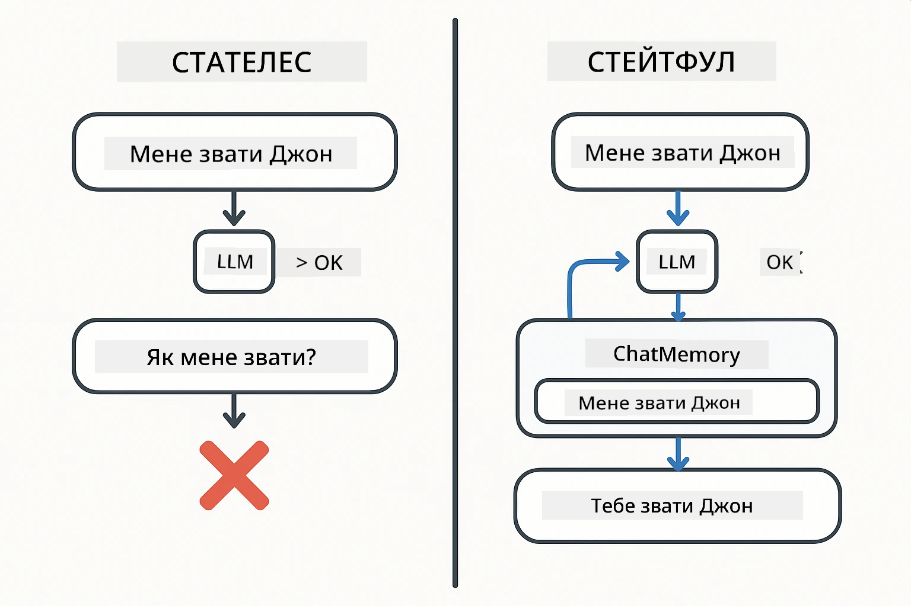
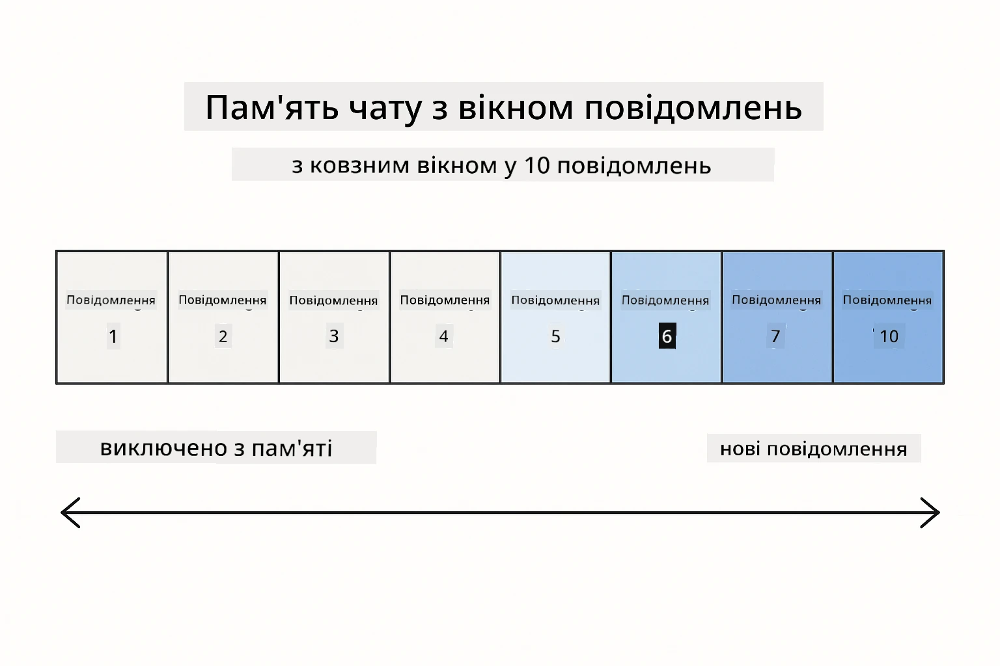
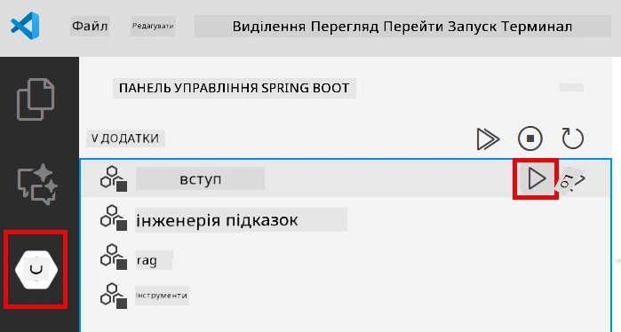
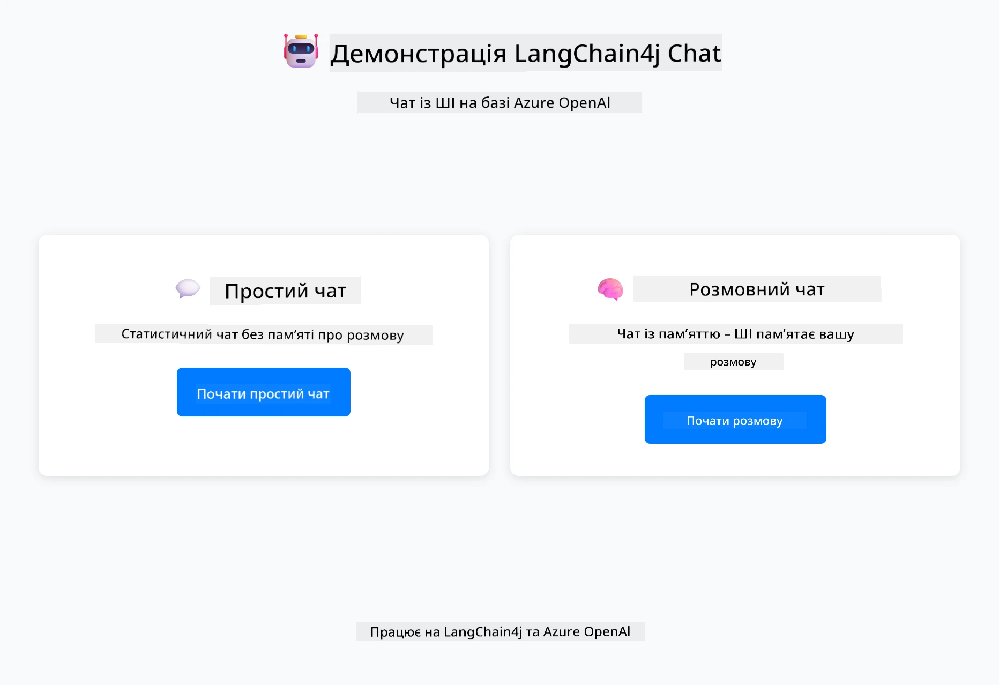
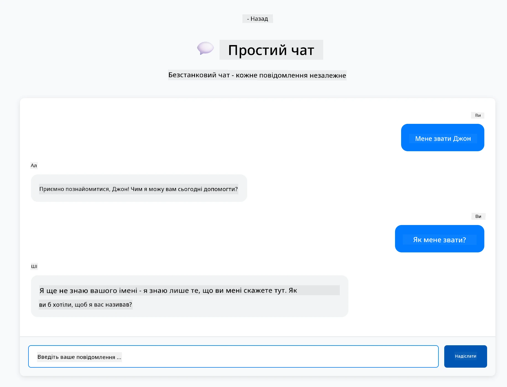
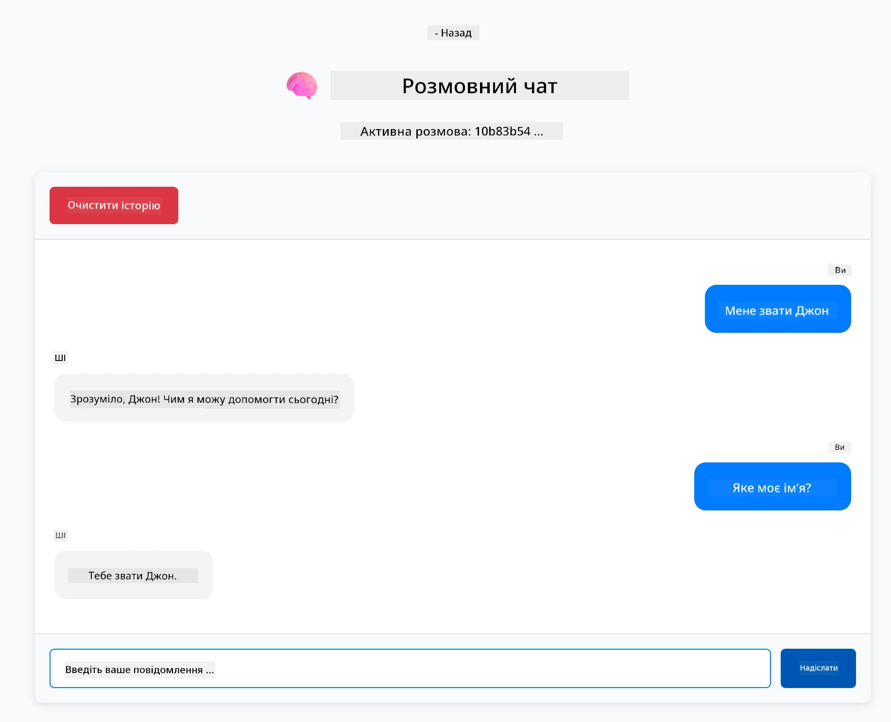

# Module 01: Початок роботи з LangChain4j

## Зміст

- [Відеоогляд](#відеоогляд)
- [Чому ви навчитеся](#чому-ви-навчитеся)
- [Вимоги](#вимоги)
- [Розуміння основної проблеми](#розуміння-основної-проблеми)
- [Розуміння токенів](#розуміння-токенів)
- [Як працює пам’ять](#як-працює-пам’ять)
- [Як це використовує LangChain4j](#як-це-використовує-langchain4j)
- [Розгортання інфраструктури Azure OpenAI](#розгортання-інфраструктури-azure-openai)
- [Запуск програми локально](#запуск-програми-локально)
- [Використання програми](#використання-програми)
  - [Безстанова бесіда (ліва панель)](#безстанова-бесіда-ліва-панель)
  - [Станова бесіда (права панель)](#станова-бесіда-права-панель)
- [Наступні кроки](#наступні-кроки)

## Відеоогляд

Перегляньте це живе заняття, яке пояснює, як почати роботу з цим модулем:

<a href="https://www.youtube.com/live/nl_troDm8rQ?si=6b85S8xGjWnT2fX9"></a>

## Чому ви навчитеся

Це ваша відправна точка з LangChain4j та Azure OpenAI. Ми починаємо з основ і починаємо створювати застосунки виробничого стилю. Цей модуль зосереджений на розмовному штучному інтелекті, який пам’ятає контекст і підтримує стан — базові концепції, на яких будуються всі наступні модулі.

Ми використаємо GPT-5.2 від Azure OpenAI протягом усього керівництва, оскільки його розвинені можливості міркування роблять поведінку різних патернів більш очевидною. Коли ви додаєте пам’ять, різницю буде видно чітко. Це полегшує розуміння того, що кожен компонент додає до вашого застосунку.

Ви створите один застосунок, який демонструє обидва патерни:

**Безстанова бесіда** — кожен запит незалежний. Модель не пам’ятає попередні повідомлення. Це найпростіша відправна точка.

**Станова бесіда** — кожен запит включає історію бесіди. Модель підтримує контекст через кілька ходів. Це те, що вимагають виробничі застосунки.

## Вимоги

- Підписка Azure з доступом до Azure OpenAI
- Java 21, Maven 3.9+
- Azure CLI (https://learn.microsoft.com/en-us/cli/azure/install-azure-cli)
- Azure Developer CLI (azd) (https://learn.microsoft.com/en-us/azure/developer/azure-developer-cli/install-azd)

> **Примітка:** Java, Maven, Azure CLI та Azure Developer CLI (azd) попередньо встановлені у наданому devcontainer.

> **Примітка:** Цей модуль використовує GPT-5.2 на Azure OpenAI. Розгортання конфігурується автоматично через `azd up` — не змінюйте назву моделі в коді.

## Розуміння основної проблеми

Мовні моделі безстанові. Кожен виклик API незалежний. Якщо ви скажете "Мене звати Джон" і потім спитаєте "Як мене звати?", модель навіть не здогадується, що ви тільки-но представилися. Вона обробляє кожен запит так, ніби це ваша перша розмова.

Це підходить для простих запитань-відповідей але марне для реальних застосунків. Чат-боти служби підтримки повинні пам’ятати, що ви їм сказали. Особисті помічники потребують контексту. Будь-яка багатокрокова бесіда потребує пам’яті.

Наступна діаграма порівнює два підходи — зліва безстановий виклик, що забуває ваше ім’я; справа становий виклик з ChatMemory, що його пам’ятає.



*Різниця між безстановими (незалежними викликами) та становими (усвідомленими контекстом) бесідами*

## Розуміння токенів

Перед тим як заглибитися в бесіди, важливо розуміти токени — базові одиниці тексту, які обробляють мовні моделі:


*Приклад розбиття тексту на токени — "I love AI!" стає 4 окремими обробними одиницями*

Токени — це те, як моделі ШІ вимірюють і обробляють текст. Слова, пунктуація і навіть пробіли можуть бути токенами. Ваша модель має ліміт на кількість токенів, які вона може обробити за раз (400 000 для GPT-5.2, із максимум 272 000 для вхідних і 128 000 для вихідних токенів). Розуміння токенів допомагає керувати довжиною бесіди та витратами.

## Як працює пам’ять

Пам’ять чату вирішує проблему безстановості, зберігаючи історію розмови. Перед тим як надіслати ваш запит до моделі, фреймворк додає попередні релевантні повідомлення. Коли ви питаєте "Як мене звати?", система фактично надсилає всю історію бесіди, дозволяючи моделі побачити, що ви раніше сказали "Мене звати Джон."

LangChain4j надає реалізації пам’яті, які виконують це автоматично. Ви обираєте, скільки повідомлень зберігати, а фреймворк керує вікном контексту. На діаграмі нижче показано, як MessageWindowChatMemory підтримує ковзне вікно останніх повідомлень.



*MessageWindowChatMemory підтримує ковзне вікно останніх повідомлень, автоматично видаляючи старі*

## Як це використовує LangChain4j

Цей модуль інтегрує Spring Boot і додає пам’ять для розмов. Ось як все поєднується:

**Залежності** — додайте дві бібліотеки LangChain4j:

```xml
<dependency>
    <groupId>dev.langchain4j</groupId>
    <artifactId>langchain4j</artifactId> <!-- Inherited from BOM in root pom.xml -->
</dependency>
<dependency>
    <groupId>dev.langchain4j</groupId>
    <artifactId>langchain4j-open-ai-official</artifactId> <!-- Inherited from BOM in root pom.xml -->
</dependency>
```

**Модель чату** — налаштуйте Azure OpenAI як Spring bean ([LangChainConfig.java](../../../01-introduction/src/main/java/com/example/langchain4j/config/LangChainConfig.java)):

```java
@Bean
public OpenAiOfficialChatModel openAiOfficialChatModel() {
    return OpenAiOfficialChatModel.builder()
            .baseUrl(azureEndpoint)
            .apiKey(azureApiKey)
            .modelName(deploymentName)
            .timeout(Duration.ofMinutes(5))
            .maxRetries(3)
            .build();
}
```

Будівник зчитує облікові дані з змінних оточення, встановлених за допомогою `azd up`. Встановлення `baseUrl` на ваш кінцевий пункт Azure дозволяє клієнту OpenAI працювати з Azure OpenAI.

**Пам’ять розмов** — відстежуйте історію чату за допомогою MessageWindowChatMemory ([ConversationService.java](../../../01-introduction/src/main/java/com/example/langchain4j/service/ConversationService.java)):

```java
ChatMemory memory = MessageWindowChatMemory.withMaxMessages(10);

memory.add(UserMessage.from("My name is John"));
memory.add(AiMessage.from("Nice to meet you, John!"));

memory.add(UserMessage.from("What's my name?"));
AiMessage aiMessage = chatModel.chat(memory.messages()).aiMessage();
memory.add(aiMessage);
```

Створіть пам’ять з `withMaxMessages(10)`, щоб зберігати останні 10 повідомлень. Додавайте повідомлення користувача і ШІ за допомогою типізованих оболонок: `UserMessage.from(text)` та `AiMessage.from(text)`. Отримуйте історію через `memory.messages()` і надсилайте її моделі. Сервіс зберігає окремі екземпляри пам’яті для кожного ID розмови, що дозволяє кільком користувачам одночасно спілкуватися.

> **🤖 Спробуйте з [GitHub Copilot](https://github.com/features/copilot) Chat:** Відкрийте [`ConversationService.java`](../../../01-introduction/src/main/java/com/example/langchain4j/service/ConversationService.java) і запитайте:
> - "Як MessageWindowChatMemory вирішує, які повідомлення скидати, коли вікно заповнене?"
> - "Чи можна реалізувати власне зберігання пам’яті з використанням бази даних замість пам’яті в процесі?"
> - "Як додати підсумовування для стиснення старої історії розмови?"

Безстановий чат не використовує пам’ять — просто `chatModel.chat(prompt)`, як у швидкому старті. Станова точка додає повідомлення до пам’яті, отримує історію і включає цей контекст у кожен запит. Та сама конфігурація моделі, різні патерни.

## Розгортання інфраструктури Azure OpenAI

**Bash:**
```bash
cd 01-introduction
azd up  # Виберіть підписку та розташування (рекомендується eastus2)
```

**PowerShell:**
```powershell
cd 01-introduction
azd up  # Виберіть підписку та розташування (рекомендується eastus2)
```

> **Примітка:** Якщо ви отримали помилку таймауту (`RequestConflict: Cannot modify resource ... provisioning state is not terminal`), просто запустіть `azd up` ще раз. Ресурси Azure можуть досі розгортатися у фоновому режимі, і повторна спроба дозволить завершити розгортання, коли ресурси досягнуть кінцевого стану.

Це зробить:
1. Розгортання ресурсу Azure OpenAI з моделями GPT-5.2 та text-embedding-3-small
2. Автоматичне створення файлу `.env` у корені проекту з обліковими даними
3. Налаштування всіх необхідних змінних оточення

**Виникають проблеми з розгортанням?** Перегляньте [README інфраструктури](infra/README.md) для детального усунення несправностей, зокрема конфліктів імен субдоменів, кроків ручного розгортання в Azure Portal і порад щодо конфігурації моделей.

**Перевірте успішність розгортання:**

**Bash:**
```bash
cat ../.env  # Повинно показувати AZURE_OPENAI_ENDPOINT, API_KEY тощо.
```

**PowerShell:**
```powershell
Get-Content ..\.env  # Повинні показуватися AZURE_OPENAI_ENDPOINT, API_KEY тощо.
```

> **Примітка:** Команда `azd up` автоматично створює файл `.env`. Якщо вам потрібно оновити його пізніше, ви можете або вручну відредагувати файл `.env`, або створити його заново, запустивши:
>
> **Bash:**
> ```bash
> cd ..
> bash .azd-env.sh
> ```

> **PowerShell:**
> ```powershell
> cd ..
> .\.azd-env.ps1
> ```

## Запуск програми локально

**Перевірте розгортання:**

Переконайтеся, що файл `.env` існує у кореневій директорії з обліковими даними Azure. Запустіть це з каталогу модуля (`01-introduction/`):

**Bash:**
```bash
cat ../.env  # Повинен показувати AZURE_OPENAI_ENDPOINT, API_KEY, DEPLOYMENT
```

**PowerShell:**
```powershell
Get-Content ..\.env  # Має відображати AZURE_OPENAI_ENDPOINT, API_KEY, DEPLOYMENT
```

**Запустіть застосунки:**

**Варіант 1: Використання Spring Boot Dashboard (рекомендовано для користувачів VS Code)**

Devcontainer включає розширення Spring Boot Dashboard, яке надає візуальний інтерфейс для керування всіма застосунками Spring Boot. Ви можете знайти його на панелі активності зліва у VS Code (шукайте іконку Spring Boot).

З Spring Boot Dashboard ви можете:
- Бачити всі доступні застосунки Spring Boot в робочій області
- Запускати/зупиняти застосунки одним кліком
- Переглядати логи застосунку в режимі реального часу
- Моніторити стан застосунку

Просто натисніть кнопку запуску біля "introduction", щоб запустити цей модуль, або запустіть усі модулі одразу.



*Панель Spring Boot у VS Code — запуск, зупинка та моніторинг усіх модулів із одного місця*

**Варіант 2: Використання shell-скриптів**

Запустіть усі веб-застосунки (модулі 01-04):

**Bash:**
```bash
cd ..  # З кореневого каталогу
./start-all.sh
```

**PowerShell:**
```powershell
cd ..  # З кореневої директорії
.\start-all.ps1
```

Або запустіть лише цей модуль:

**Bash:**
```bash
cd 01-introduction
./start.sh
```

**PowerShell:**
```powershell
cd 01-introduction
.\start.ps1
```

Обидва скрипти автоматично завантажують змінні оточення з файлу `.env` у корені і зіб’ють JAR-файли, якщо їх немає.

> **Примітка:** Якщо ви віддаєте перевагу збирати всі модулі вручну перед запуском:
>
> **Bash:**
> ```bash
> cd ..  # Go to root directory
> mvn clean package -DskipTests
> ```

> **PowerShell:**
> ```powershell
> cd ..  # Go to root directory
> mvn clean package -DskipTests
> ```

Відкрийте http://localhost:8080 у вашому браузері.

**Щоб зупинити:**

**Bash:**
```bash
./stop.sh  # Тільки цей модуль
# Або
cd .. && ./stop-all.sh  # Всі модулі
```

**PowerShell:**
```powershell
.\stop.ps1  # Тільки цей модуль
# Або
cd ..; .\stop-all.ps1  # Всі модулі
```

## Використання програми

Програма надає веб-інтерфейс із двома реалізаціями чату поруч.



*Панель керування з варіантами Проста бесіда (безстанова) і Розмовна бесіда (станова)*

### Безстанова бесіда (ліва панель)

Спробуйте спочатку це. Скажіть "Мене звати Джон", а потім відразу спитайте "Як мене звати?" Модель не запам’ятає, бо кожне повідомлення незалежне. Це демонструє основну проблему базової інтеграції мовної моделі — відсутність контексту розмови.



*ШІ не пам’ятає ваше ім’я з попереднього повідомлення*

### Станова бесіда (права панель)

Тепер спробуйте ту ж послідовність тут. Скажіть "Мене звати Джон", потім "Як мене звати?" Тепер модель пам’ятає. Різниця в MessageWindowChatMemory — він підтримує історію розмови і включає її в кожен запит. Так працює виробничий розмовний ШІ.



*ШІ пам’ятає ваше ім’я з попередньої частини розмови*

Обидві панелі використовують ту ж модель GPT-5.2. Єдина різниця — пам’ять. Це чітко показує, що пам’ять додає вашому застосунку і чому вона необхідна для реальних випадків використання.

## Наступні кроки

**Наступний модуль:** [02-prompt-engineering - Проєктування підказок з GPT-5.2](../02-prompt-engineering/README.md)

---

**Навігація:** [← Назад до головної](../README.md) | [Далі: Модуль 02 - Проєктування підказок →](../02-prompt-engineering/README.md)

---

<!-- CO-OP TRANSLATOR DISCLAIMER START -->
**Відмова від відповідальності**:
Цей документ було перекладено за допомогою сервісу штучного інтелекту для перекладу [Co-op Translator](https://github.com/Azure/co-op-translator). Хоча ми прагнемо до точності, будь ласка, майте на увазі, що автоматичні переклади можуть містити помилки або неточності. Оригінальний документ рідною мовою слід вважати авторитетним джерелом. Для критично важливої інформації рекомендується професійний людський переклад. Ми не несемо відповідальності за будь-які непорозуміння або неправильні тлумачення, що виникли внаслідок використання цього перекладу.
<!-- CO-OP TRANSLATOR DISCLAIMER END -->