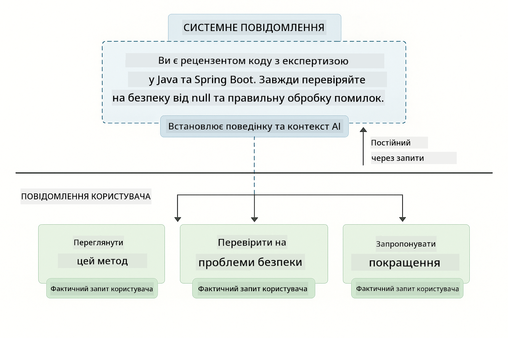
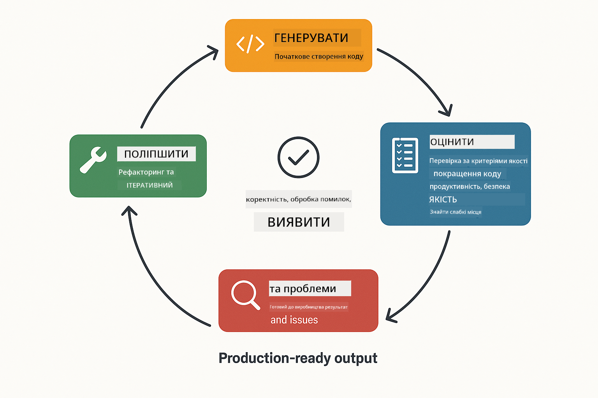
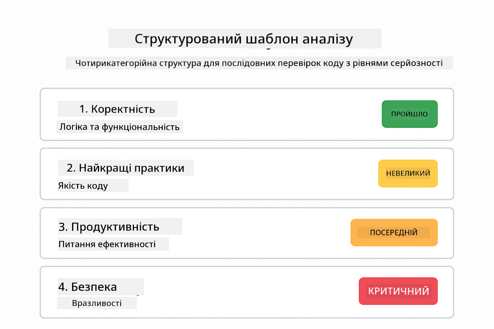
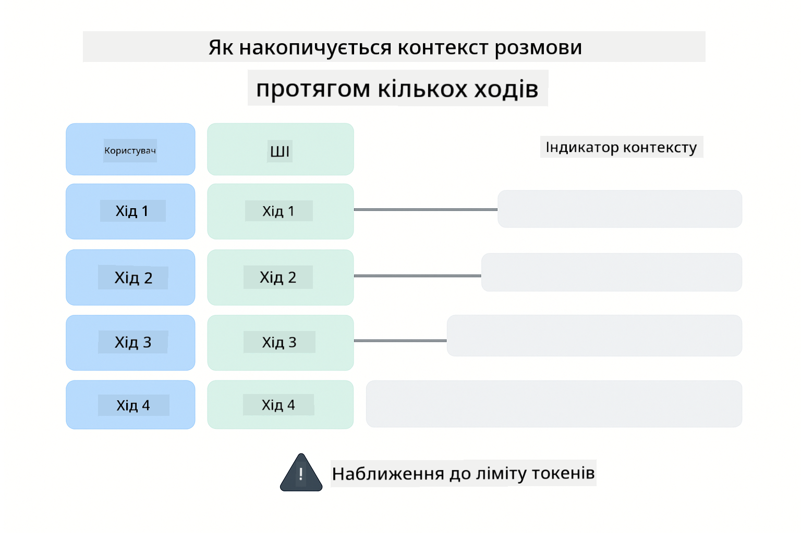
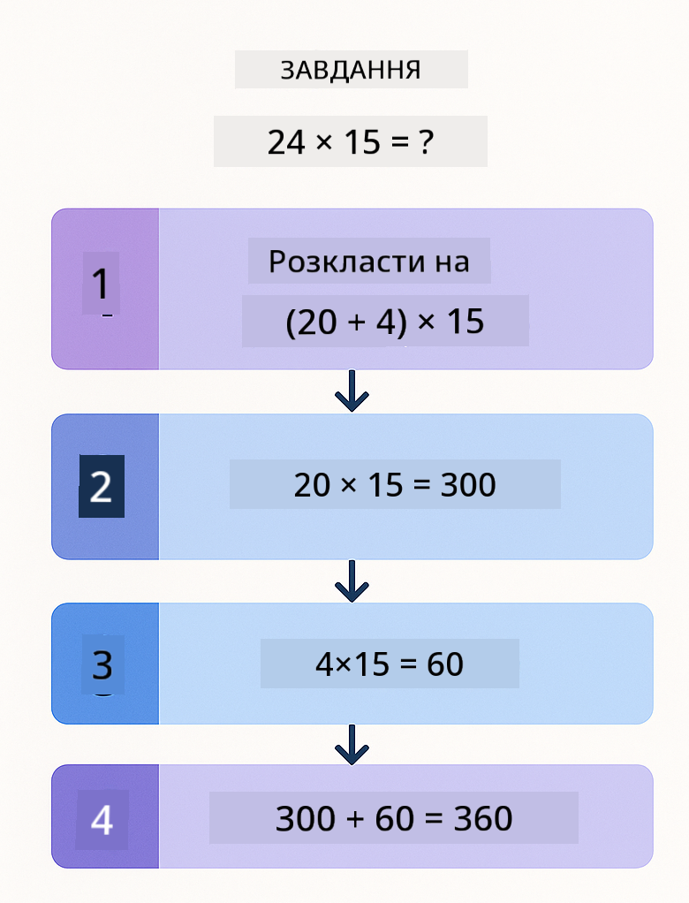
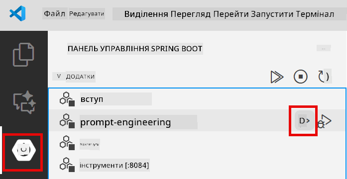
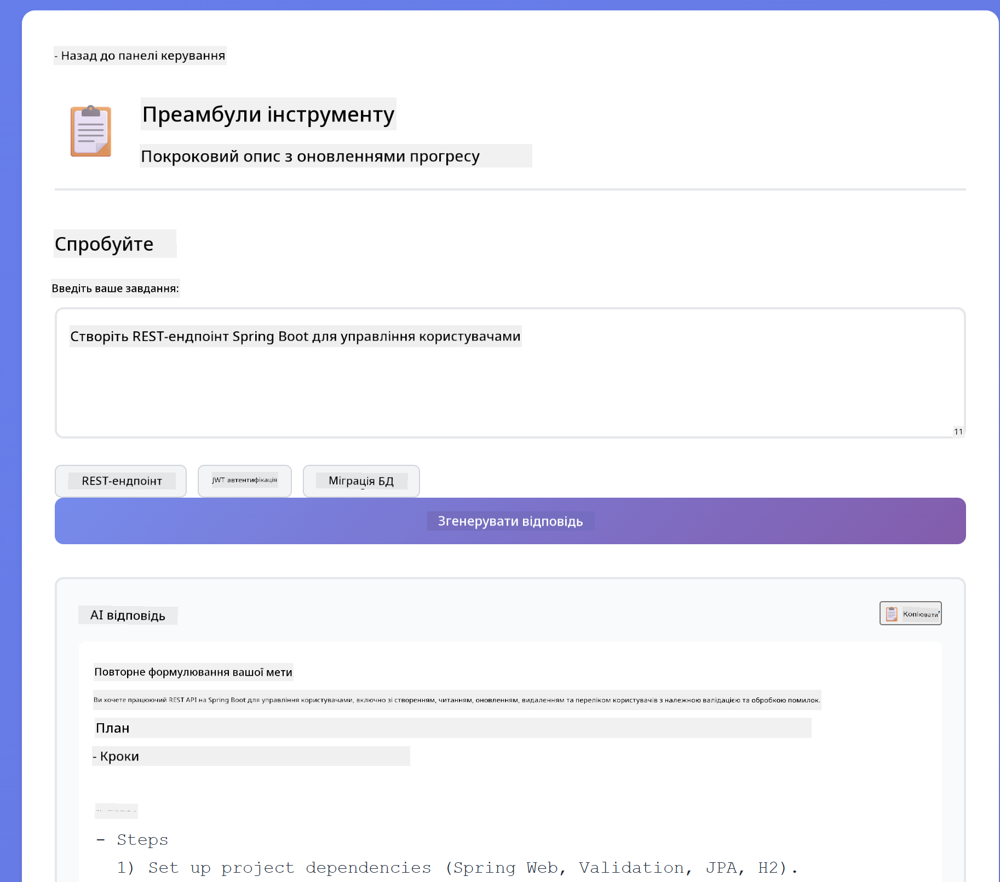
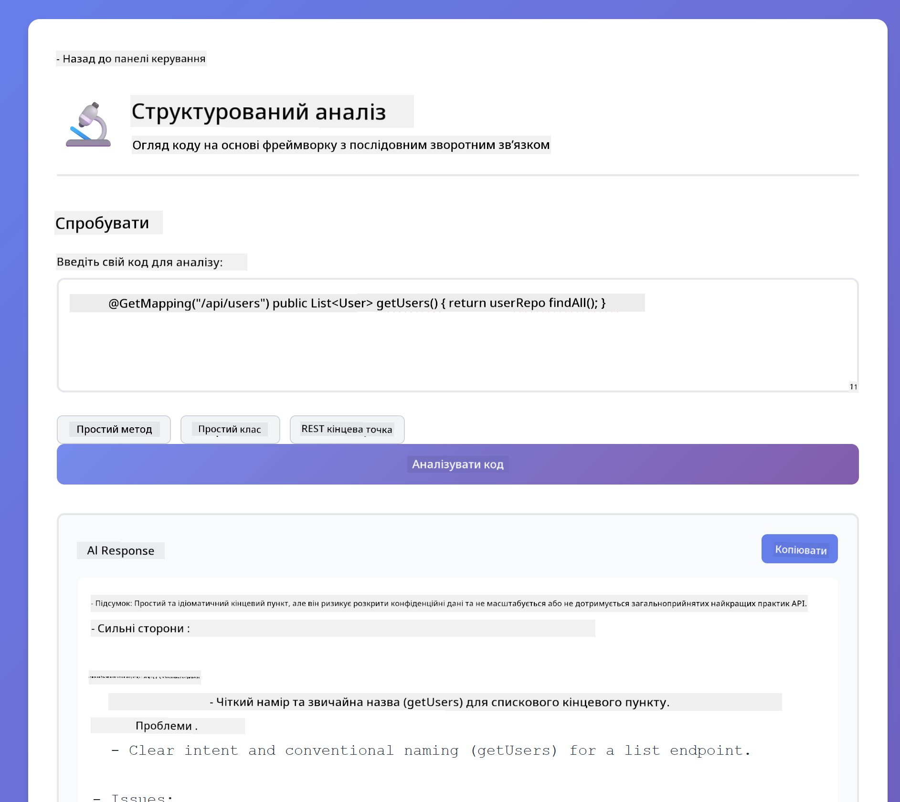
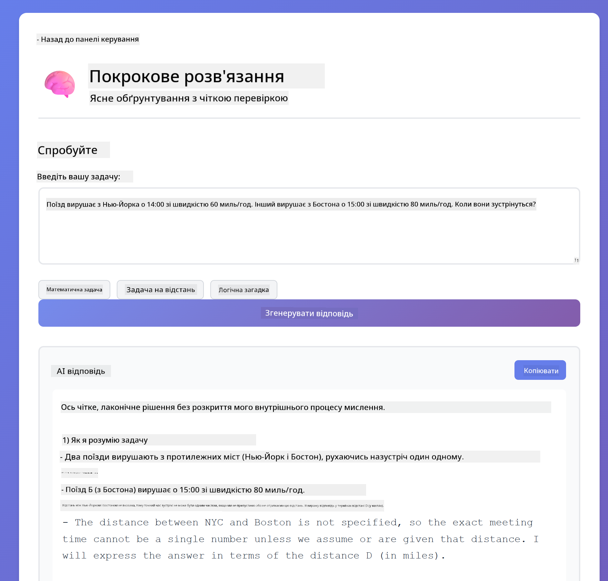

<!--
CO_OP_TRANSLATOR_METADATA:
{
  "original_hash": "8d787826cad7e92bf5cdbd116b1e6116",
  "translation_date": "2025-12-13T16:32:02+00:00",
  "source_file": "02-prompt-engineering/README.md",
  "language_code": "uk"
}
-->
# Модуль 02: Проєктування підказок з GPT-5

## Зміст

- [Чому ви навчитеся](../../../02-prompt-engineering)
- [Вимоги](../../../02-prompt-engineering)
- [Розуміння проєктування підказок](../../../02-prompt-engineering)
- [Як це використовує LangChain4j](../../../02-prompt-engineering)
- [Основні патерни](../../../02-prompt-engineering)
- [Використання існуючих ресурсів Azure](../../../02-prompt-engineering)
- [Знімки екрана додатку](../../../02-prompt-engineering)
- [Дослідження патернів](../../../02-prompt-engineering)
  - [Низька vs Висока зацікавленість](../../../02-prompt-engineering)
  - [Виконання завдань (попередні інструкції для інструментів)](../../../02-prompt-engineering)
  - [Саморефлексивний код](../../../02-prompt-engineering)
  - [Структурований аналіз](../../../02-prompt-engineering)
  - [Багатокроковий чат](../../../02-prompt-engineering)
  - [Покрокове міркування](../../../02-prompt-engineering)
  - [Обмежений вивід](../../../02-prompt-engineering)
- [Що ви насправді вивчаєте](../../../02-prompt-engineering)
- [Наступні кроки](../../../02-prompt-engineering)

## Чому ви навчитеся

У попередньому модулі ви побачили, як пам’ять забезпечує розмовний ШІ, і використовували GitHub Models для базових взаємодій. Тепер ми зосередимося на тому, як ви ставите запитання — самі підказки — використовуючи GPT-5 від Azure OpenAI. Те, як ви структуруєте свої підказки, суттєво впливає на якість отриманих відповідей.

Ми використовуємо GPT-5, тому що він вводить контроль міркувань — ви можете вказати моделі, скільки думати перед відповіддю. Це робить різні стратегії проєктування підказок більш очевидними і допомагає зрозуміти, коли використовувати кожен підхід. Також ми скористаємося меншою кількістю обмежень швидкості для GPT-5 в Azure порівняно з GitHub Models.

## Вимоги

- Завершений Модуль 01 (розгорнуті ресурси Azure OpenAI)
- Файл `.env` у кореневій директорії з обліковими даними Azure (створений командою `azd up` у Модулі 01)

> **Примітка:** Якщо ви не завершили Модуль 01, спочатку виконайте інструкції з розгортання там.

## Розуміння проєктування підказок

Проєктування підказок — це створення вхідного тексту, який послідовно дає вам потрібні результати. Це не просто ставити запитання — це структурувати запити так, щоб модель точно розуміла, чого ви хочете і як це надати.

Уявіть, що ви даєте інструкції колезі. «Виправити помилку» — це розмито. «Виправити NullPointerException у UserService.java на рядку 45, додавши перевірку на null» — це конкретно. Мовні моделі працюють так само — важлива конкретність і структура.

## Як це використовує LangChain4j

Цей модуль демонструє просунуті патерни проєктування підказок, використовуючи ту ж основу LangChain4j, що й у попередніх модулях, з акцентом на структуру підказок і контроль міркувань.


*Як LangChain4j з’єднує ваші підказки з Azure OpenAI GPT-5*

**Залежності** — Модуль 02 використовує такі залежності langchain4j, визначені у `pom.xml`:
```xml
<dependency>
    <groupId>dev.langchain4j</groupId>
    <artifactId>langchain4j</artifactId> <!-- Inherited from BOM in root pom.xml -->
</dependency>
<dependency>
    <groupId>dev.langchain4j</groupId>
    <artifactId>langchain4j-open-ai-official</artifactId> <!-- Inherited from BOM in root pom.xml -->
</dependency>
```

**Конфігурація OpenAiOfficialChatModel** — [LangChainConfig.java](../../../02-prompt-engineering/src/main/java/com/example/langchain4j/prompts/config/LangChainConfig.java)

Чат-модель налаштована вручну як Spring bean із використанням офіційного клієнта OpenAI, який підтримує кінцеві точки Azure OpenAI. Ключова відмінність від Модуля 01 — це те, як ми структуруємо підказки, що надсилаються в `chatModel.chat()`, а не сама налаштування моделі.

**Системні та користувацькі повідомлення** — [Gpt5PromptService.java](../../../02-prompt-engineering/src/main/java/com/example/langchain4j/prompts/service/Gpt5PromptService.java)

LangChain4j розділяє типи повідомлень для ясності. `SystemMessage` задає поведінку та контекст ШІ (наприклад, «Ви — рецензент коду»), тоді як `UserMessage` містить фактичний запит. Це розділення дозволяє підтримувати послідовну поведінку ШІ для різних користувацьких запитів.

```java
SystemMessage systemMsg = SystemMessage.from(
    "You are a helpful Java programming expert."
);

UserMessage userMsg = UserMessage.from(
    "Explain what a List is in Java"
);

String response = chatModel.chat(systemMsg, userMsg);
```



*SystemMessage забезпечує постійний контекст, а UserMessages містять окремі запити*

**MessageWindowChatMemory для багатокрокових діалогів** — Для патерну багатокрокової розмови ми повторно використовуємо `MessageWindowChatMemory` з Модуля 01. Кожна сесія отримує власний екземпляр пам’яті, збережений у `Map<String, ChatMemory>`, що дозволяє одночасно вести кілька розмов без змішування контексту.

**Шаблони підказок** — Основна увага тут на проєктуванні підказок, а не на нових API LangChain4j. Кожен патерн (низька зацікавленість, висока зацікавленість, виконання завдань тощо) використовує той самий метод `chatModel.chat(prompt)`, але з ретельно структурованими рядками підказок. XML-теги, інструкції та форматування — це частина тексту підказки, а не функції LangChain4j.

**Контроль міркувань** — Зусилля міркувань GPT-5 контролюються через інструкції в підказках, наприклад «максимум 2 кроки міркувань» або «дослідити ретельно». Це техніки проєктування підказок, а не налаштування LangChain4j. Бібліотека просто доставляє ваші підказки моделі.

Головний висновок: LangChain4j забезпечує інфраструктуру (підключення моделі через [LangChainConfig.java](../../../02-prompt-engineering/src/main/java/com/example/langchain4j/prompts/config/LangChainConfig.java), пам’ять, обробку повідомлень через [Gpt5PromptService.java](../../../02-prompt-engineering/src/main/java/com/example/langchain4j/prompts/service/Gpt5PromptService.java)), а цей модуль навчає вас, як створювати ефективні підказки в цій інфраструктурі.

## Основні патерни

Не всі проблеми потребують однакового підходу. Деякі питання потребують швидких відповідей, інші — глибокого аналізу. Деякі потребують видимого міркування, інші — лише результатів. Цей модуль охоплює вісім патернів проєктування підказок — кожен оптимізований для різних сценаріїв. Ви випробуєте всі, щоб навчитися, коли який підхід працює найкраще.


*Огляд восьми патернів проєктування підказок та їхніх випадків використання*


*Низька зацікавленість (швидко, прямо) vs Висока зацікавленість (ретельно, дослідницьки) підходи до міркувань*

**Низька зацікавленість (швидко і сфокусовано)** — Для простих питань, де потрібні швидкі, прямі відповіді. Модель робить мінімум міркувань — максимум 2 кроки. Використовуйте для обчислень, пошуку або простих питань.

```java
String prompt = """
    <reasoning_effort>low</reasoning_effort>
    <instruction>maximum 2 reasoning steps</instruction>
    
    What is 15% of 200?
    """;

String response = chatModel.chat(prompt);
```

> 💡 **Досліджуйте з GitHub Copilot:** Відкрийте [`Gpt5PromptService.java`](../../../02-prompt-engineering/src/main/java/com/example/langchain4j/prompts/service/Gpt5PromptService.java) і запитайте:
> - «У чому різниця між патернами низької та високої зацікавленості?»
> - «Як XML-теги в підказках допомагають структурувати відповідь ШІ?»
> - «Коли слід використовувати патерни саморефлексії, а коли прямі інструкції?»

**Висока зацікавленість (глибоко і ретельно)** — Для складних проблем, де потрібен всебічний аналіз. Модель досліджує ретельно і показує детальні міркування. Використовуйте для проєктування систем, архітектурних рішень або складних досліджень.

```java
String prompt = """
    <reasoning_effort>high</reasoning_effort>
    <instruction>explore thoroughly, show detailed reasoning</instruction>
    
    Design a caching strategy for a high-traffic REST API.
    """;

String response = chatModel.chat(prompt);
```

**Виконання завдань (покроковий прогрес)** — Для багатокрокових робочих процесів. Модель надає план наперед, описує кожен крок під час роботи, а потім дає підсумок. Використовуйте для міграцій, впроваджень або будь-яких багатокрокових процесів.

```java
String prompt = """
    <task>Create a REST endpoint for user registration</task>
    <preamble>Provide an upfront plan</preamble>
    <narration>Narrate each step as you work</narration>
    <summary>Summarize what was accomplished</summary>
    """;

String response = chatModel.chat(prompt);
```

Патерн Chain-of-Thought явно просить модель показати процес міркувань, що покращує точність для складних завдань. Покроковий розбір допомагає і людям, і ШІ зрозуміти логіку.

> **🤖 Спробуйте з [GitHub Copilot](https://github.com/features/copilot) Chat:** Запитайте про цей патерн:
> - «Як адаптувати патерн виконання завдань для довготривалих операцій?»
> - «Які найкращі практики структурування попередніх інструкцій для інструментів у продуктивних додатках?»
> - «Як захоплювати і відображати проміжні оновлення прогресу в UI?»


*План → Виконання → Підсумок робочого процесу для багатокрокових завдань*

**Саморефлексивний код** — Для генерації коду виробничої якості. Модель генерує код, перевіряє його за критеріями якості і покращує ітеративно. Використовуйте при створенні нових функцій або сервісів.

```java
String prompt = """
    <task>Create an email validation service</task>
    <quality_criteria>
    - Correct logic and error handling
    - Best practices (clean code, proper naming)
    - Performance optimization
    - Security considerations
    </quality_criteria>
    <instruction>Generate code, evaluate against criteria, improve iteratively</instruction>
    """;

String response = chatModel.chat(prompt);
```



*Ітеративний цикл покращення — генерувати, оцінювати, виявляти проблеми, покращувати, повторювати*

**Структурований аналіз** — Для послідовної оцінки. Модель переглядає код за фіксованою схемою (коректність, практики, продуктивність, безпека). Використовуйте для рецензій коду або оцінки якості.

```java
String prompt = """
    <code>
    public List getUsers() {
        return database.query("SELECT * FROM users");
    }
    </code>
    
    <framework>
    Evaluate using these categories:
    1. Correctness - Logic and functionality
    2. Best Practices - Code quality
    3. Performance - Efficiency concerns
    4. Security - Vulnerabilities
    </framework>
    """;

String response = chatModel.chat(prompt);
```

> **🤖 Спробуйте з [GitHub Copilot](https://github.com/features/copilot) Chat:** Запитайте про структурований аналіз:
> - «Як налаштувати схему аналізу для різних типів рецензій коду?»
> - «Який найкращий спосіб програмно розбирати і обробляти структурований вивід?»
> - «Як забезпечити послідовність рівнів серйозності в різних сесіях рецензій?»



*Чотирикатегорійна схема для послідовних рецензій коду з рівнями серйозності*

**Багатокроковий чат** — Для розмов, що потребують контексту. Модель пам’ятає попередні повідомлення і будує на їх основі. Використовуйте для інтерактивної допомоги або складних Q&A.

```java
ChatMemory memory = MessageWindowChatMemory.withMaxMessages(10);

memory.add(UserMessage.from("What is Spring Boot?"));
AiMessage aiMessage1 = chatModel.chat(memory.messages()).aiMessage();
memory.add(aiMessage1);

memory.add(UserMessage.from("Show me an example"));
AiMessage aiMessage2 = chatModel.chat(memory.messages()).aiMessage();
memory.add(aiMessage2);
```



*Як контекст розмови накопичується за кілька кроків до досягнення ліміту токенів*

**Покрокове міркування** — Для проблем, що потребують видимої логіки. Модель показує явні міркування для кожного кроку. Використовуйте для математичних задач, логічних головоломок або коли потрібно зрозуміти процес мислення.

```java
String prompt = """
    <instruction>Show your reasoning step-by-step</instruction>
    
    If a train travels 120 km in 2 hours, then stops for 30 minutes,
    then travels another 90 km in 1.5 hours, what is the average speed
    for the entire journey including the stop?
    """;

String response = chatModel.chat(prompt);
```



*Розбиття проблем на явні логічні кроки*

**Обмежений вивід** — Для відповідей із конкретними вимогами до формату. Модель суворо дотримується правил формату і довжини. Використовуйте для резюме або коли потрібна точна структура виводу.

```java
String prompt = """
    <constraints>
    - Exactly 100 words
    - Bullet point format
    - Technical terms only
    </constraints>
    
    Summarize the key concepts of machine learning.
    """;

String response = chatModel.chat(prompt);
```


*Дотримання конкретних вимог до формату, довжини та структури*

## Використання існуючих ресурсів Azure

**Перевірка розгортання:**

Переконайтеся, що файл `.env` існує у кореневій директорії з обліковими даними Azure (створений під час Модуля 01):
```bash
cat ../.env  # Повинно показувати AZURE_OPENAI_ENDPOINT, API_KEY, DEPLOYMENT
```

**Запуск додатку:**

> **Примітка:** Якщо ви вже запускали всі додатки за допомогою `./start-all.sh` з Модуля 01, цей модуль вже працює на порту 8083. Ви можете пропустити команди запуску нижче і перейти безпосередньо за адресою http://localhost:8083.

**Варіант 1: Використання Spring Boot Dashboard (рекомендовано для користувачів VS Code)**

Dev-контейнер включає розширення Spring Boot Dashboard, яке надає візуальний інтерфейс для керування всіма додатками Spring Boot. Ви знайдете його в Activity Bar зліва у VS Code (іконка Spring Boot).

З Spring Boot Dashboard ви можете:
- Переглядати всі доступні додатки Spring Boot у робочому просторі
- Запускати/зупиняти додатки одним кліком
- Переглядати логи додатків у реальному часі
- Моніторити стан додатків

Просто натисніть кнопку запуску поруч із "prompt-engineering", щоб запустити цей модуль, або запустіть усі модулі одночасно.



**Варіант 2: Використання shell-скриптів**

Запустіть усі веб-додатки (модулі 01-04):

**Bash:**
```bash
cd ..  # З кореневого каталогу
./start-all.sh
```

**PowerShell:**
```powershell
cd ..  # З кореневого каталогу
.\start-all.ps1
```

Або запустіть лише цей модуль:

**Bash:**
```bash
cd 02-prompt-engineering
./start.sh
```

**PowerShell:**
```powershell
cd 02-prompt-engineering
.\start.ps1
```

Обидва скрипти автоматично завантажують змінні середовища з кореневого файлу `.env` і збудують JAR-файли, якщо їх немає.

> **Примітка:** Якщо ви хочете спочатку вручну збудувати всі модулі перед запуском:
>
> **Bash:**
> ```bash
> cd ..  # Go to root directory
> mvn clean package -DskipTests
> ```
>
> **PowerShell:**
> ```powershell
> cd ..  # Go to root directory
> mvn clean package -DskipTests
> ```

Відкрийте http://localhost:8083 у вашому браузері.

**Щоб зупинити:**

**Bash:**
```bash
./stop.sh  # Тільки цей модуль
# Або
cd .. && ./stop-all.sh  # Всі модулі
```

**PowerShell:**
```powershell
.\stop.ps1  # Тільки цей модуль
# Або
cd ..; .\stop-all.ps1  # Всі модулі
```

## Знімки екрана додатку


*Головна панель із усіма 8 патернами проєктування підказок з їхніми характеристиками та випадками використання*

## Дослідження патернів

Веб-інтерфейс дозволяє експериментувати з різними стратегіями проєктування підказок. Кожен патерн вирішує різні проблеми — спробуйте їх, щоб побачити, коли який підхід найкраще працює.

### Низька vs Висока зацікавленість

Задайте просте питання, наприклад «Що таке 15% від 200?» з використанням Низької зацікавленості. Ви отримаєте миттєву, пряму відповідь. Тепер запитайте щось складне, наприклад «Спроєктуйте стратегію кешування для API з високим трафіком» з використанням Високої зацікавленості. Спостерігайте, як модель уповільнюється і надає детальні міркування. Та сама модель, та сама структура запиту — але підказка вказує, скільки думати.


*Швидкий розрахунок з мінімальним обґрунтуванням*


*Всеохопна стратегія кешування (2.8MB)*

### Виконання завдань (Преамбули інструментів)

Багатокрокові робочі процеси виграють від попереднього планування та оповіді про хід виконання. Модель описує, що вона робитиме, розповідає про кожен крок, а потім підсумовує результати.



*Створення REST-ендпоінта з покроковою оповіддю (3.9MB)*

### Саморефлексивний код

Спробуйте "Створити сервіс перевірки електронної пошти". Замість того, щоб просто згенерувати код і зупинитися, модель генерує, оцінює за критеріями якості, виявляє слабкі місця та покращує. Ви побачите, як вона ітерує, доки код не відповідатиме виробничим стандартам.


*Повний сервіс перевірки електронної пошти (5.2MB)*

### Структурований аналіз

Код-рев’ю потребує послідовних рамок оцінювання. Модель аналізує код за фіксованими категоріями (коректність, практики, продуктивність, безпека) з рівнями серйозності.



*Код-рев’ю на основі фреймворку*

### Багатокроковий чат

Запитайте "Що таке Spring Boot?", а потім одразу "Покажи мені приклад". Модель пам’ятає ваше перше питання і дає приклад саме Spring Boot. Без пам’яті друге питання було б надто загальним.


*Збереження контексту між питаннями*

### Покрокове обґрунтування

Виберіть математичну задачу і спробуйте розв’язати її як з покроковим обґрунтуванням, так і з низькою старанністю. Низька старанність просто дає відповідь — швидко, але непрозоро. Покрокове показує кожен розрахунок і рішення.



*Математична задача з явними кроками*

### Обмежений вивід

Коли потрібні конкретні формати або кількість слів, цей шаблон забезпечує суворе дотримання. Спробуйте згенерувати резюме рівно з 100 слів у форматі маркованого списку.


*Резюме машинного навчання з контролем формату*

## Чого ви справді навчаєтесь

**Зусилля в обґрунтуванні змінює все**

GPT-5 дозволяє контролювати обчислювальні зусилля через ваші підказки. Низькі зусилля означають швидкі відповіді з мінімальним дослідженням. Високі зусилля — модель витрачає час на глибоке обдумування. Ви вчитеся підбирати зусилля відповідно до складності завдання — не витрачайте час на прості питання, але й не поспішайте з складними рішеннями.

**Структура керує поведінкою**

Помітили XML-теги в підказках? Вони не для краси. Моделі надійніше слідують структурованим інструкціям, ніж вільному тексту. Коли потрібні багатокрокові процеси або складна логіка, структура допомагає моделі відстежувати, де вона і що далі.


*Анатомія добре структурованої підказки з чіткими секціями та організацією в стилі XML*

**Якість через самооцінку**

Шаблони саморефлексії працюють, роблячи критерії якості явними. Замість того, щоб сподіватися, що модель "зробить правильно", ви точно кажете, що означає "правильно": коректна логіка, обробка помилок, продуктивність, безпека. Модель може оцінити власний результат і покращити його. Це перетворює генерацію коду з лотереї на процес.

**Контекст обмежений**

Багатокрокові розмови працюють, включаючи історію повідомлень у кожен запит. Але є межа — у кожної моделі максимальна кількість токенів. Зі зростанням розмов вам потрібні стратегії, щоб зберігати релевантний контекст, не досягаючи ліміту. Цей модуль показує, як працює пам’ять; пізніше ви навчитеся, коли підсумовувати, коли забувати і коли витягувати.

## Наступні кроки

**Наступний модуль:** [03-rag - RAG (Retrieval-Augmented Generation)](../03-rag/README.md)

---

**Навігація:** [← Попередній: Модуль 01 - Вступ](../01-introduction/README.md) | [Назад до головної](../README.md) | [Наступний: Модуль 03 - RAG →](../03-rag/README.md)

---

<!-- CO-OP TRANSLATOR DISCLAIMER START -->
**Відмова від відповідальності**:
Цей документ було перекладено за допомогою сервісу автоматичного перекладу [Co-op Translator](https://github.com/Azure/co-op-translator). Хоча ми прагнемо до точності, будь ласка, майте на увазі, що автоматичні переклади можуть містити помилки або неточності. Оригінальний документ рідною мовою слід вважати авторитетним джерелом. Для критично важливої інформації рекомендується звертатися до професійного людського перекладу. Ми не несемо відповідальності за будь-які непорозуміння або неправильні тлумачення, що виникли внаслідок використання цього перекладу.
<!-- CO-OP TRANSLATOR DISCLAIMER END -->