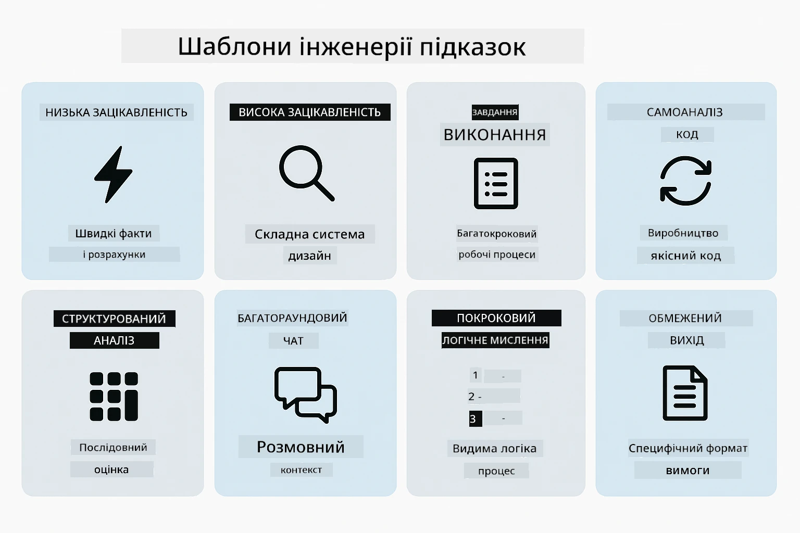
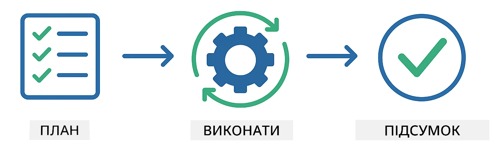
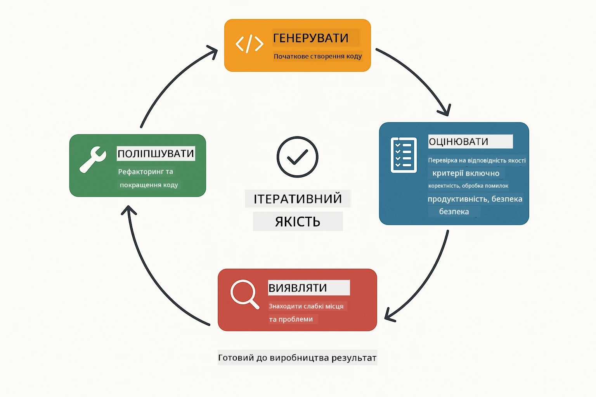
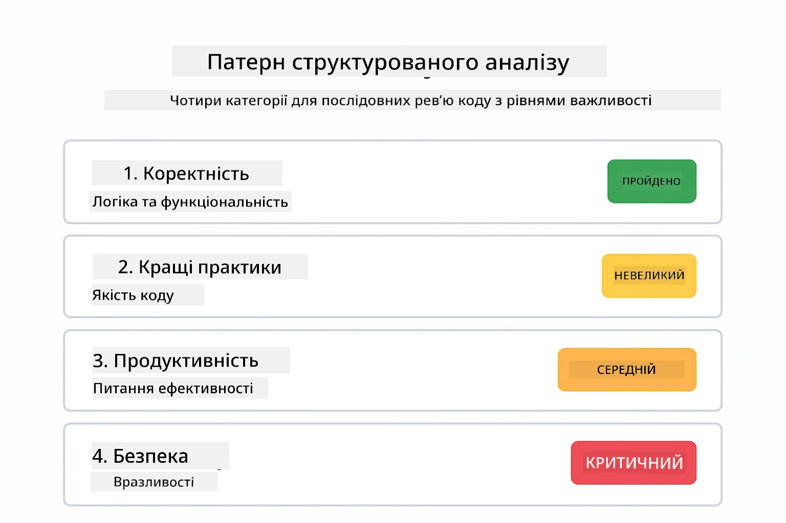
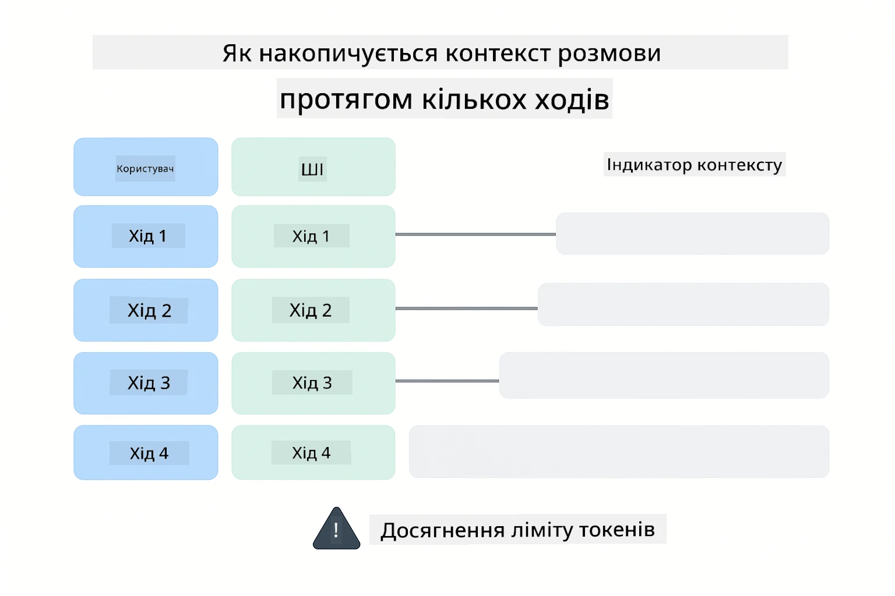
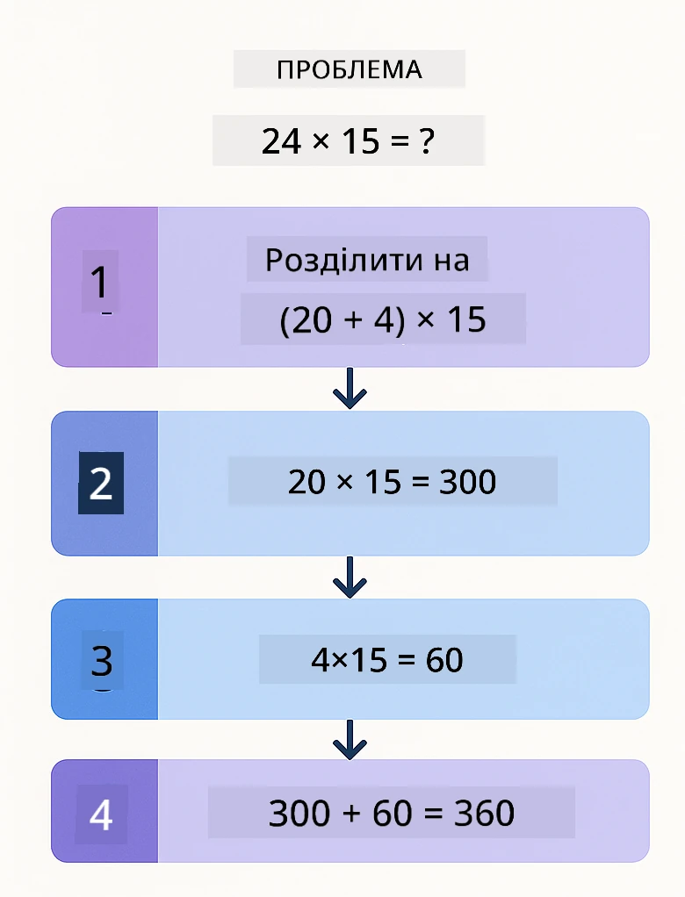
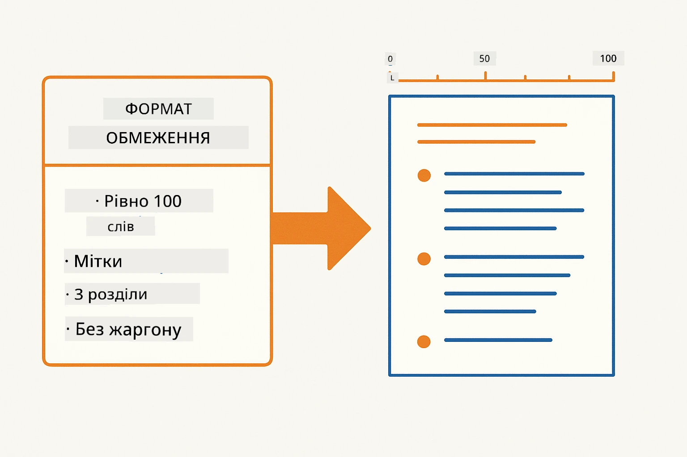
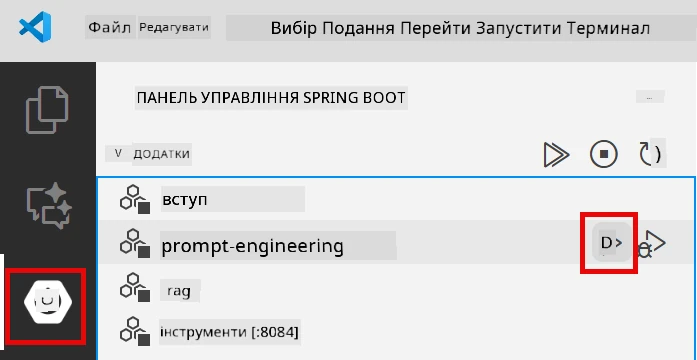
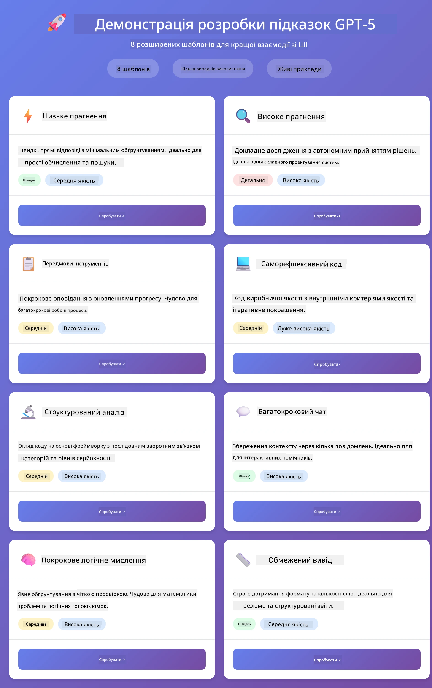
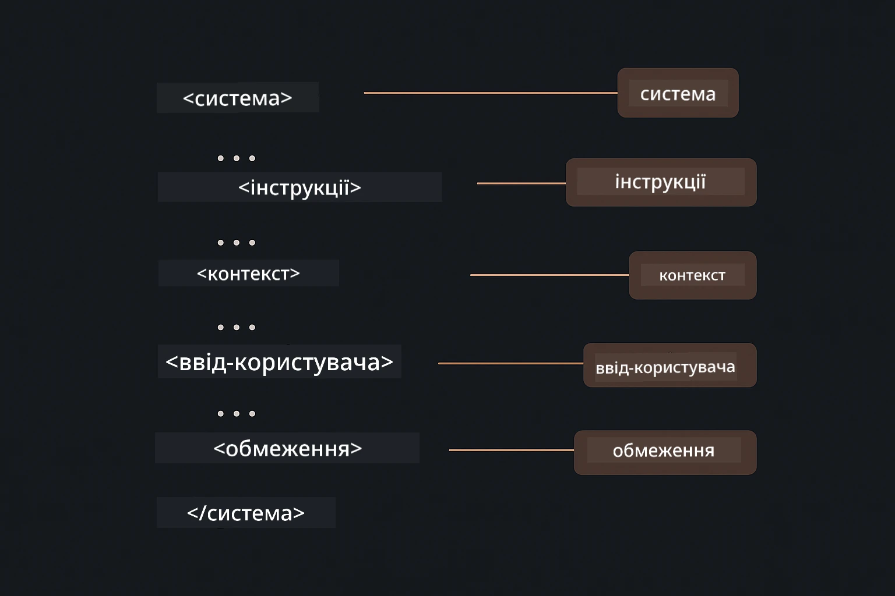

# Модуль 02: Інженерія запитів із GPT-5.2

## Зміст

- [Відеоогляд](#відеоогляд)
- [Чому ви навчитесь](#чому-ви-навчитесь)
- [Вимоги до знань](#вимоги-до-знань)
- [Розуміння інженерії запитів](#розуміння-інженерії-запитів)
- [Основи інженерії запитів](#основи-інженерії-запитів)
  - [Zero-Shot Prompting (без прикладів)](#zero-shot-prompting)
  - [Few-Shot Prompting (з прикладами)](#few-shot-prompting)
  - [Chain of Thought (ланцюг мислення)](#chain-of-thought)
  - [Role-Based Prompting (контекст ролі)](#role-based-prompting)
  - [Шаблони запитів](#prompt-templates)
- [Розширені патерни](#розширені-патерни)
- [Запустити застосунок](#запуск-застосунку)
- [Скріншоти застосунку](#знімки-екрана-застосунку)
- [Огляд патернів](#дослідження-патернів)
  - [Низька vs висока готовність](#низький-проти-високого-рівня-зацікавленості)
  - [Виконання завдань (преамбули інструментів)](#виконання-завдань-преамбули-інструментів)
  - [Саморефлексивний код](#код-із-саморефлексією)
  - [Структурований аналіз](#структурований-аналіз)
  - [Багатокроковий чат](#чат-з-багатьма-повідомленнями)
  - [Покрокове міркування](#крок-за-кроком-міркування)
  - [Обмежений вивід](#обмежений-вивід)
- [То що ж ви справді вивчаєте](#чому-ви-справді-навчаєтеся)
- [Наступні кроки](#наступні-кроки)

## Відеоогляд

Дивіться цю пряму сесію, яка пояснює, як почати роботу з цим модулем:

<a href="https://www.youtube.com/live/PJ6aBaE6bog?si=LDshyBrTRodP-wke"></a>

## Чому ви навчитесь

Наступна діаграма дає огляд ключових тем і навичок, які ви розвинете у цьому модулі — від методів удосконалення запитів до покрокового робочого процесу, який ви будете застосовувати.


У попередньому модулі ви побачили, як пам'ять дозволяє створювати розмовний ШІ з Azure OpenAI. Тепер ми зосередимось на тому, як ставити запитання — на самих запитах — використовуючи Azure OpenAI GPT-5.2. Те, як ви структуруєте свої запити, кардинально впливає на якість отриманих відповідей. Почнемо з огляду базових технік інженерії запитів, а потім перейдемо до восьми розширених патернів, які максимально використовують можливості GPT-5.2.

Ми використовуємо GPT-5.2, бо він вводить контроль мислення — ви можете вказати моделі, скільки обдумування слід виконати перед відповіддю. Це робить різні стратегії формулювання запитів більш очевидними і допомагає зрозуміти, коли використовувати кожен підхід.

## Вимоги до знань

- Завершений Модуль 01 (розгорнуті ресурси Azure OpenAI)
- Файл `.env` в кореневій директорії з обліковими даними Azure (створений командою `azd up` у Модулі 01)

> **Примітка:** Якщо ви не завершили Модуль 01, спершу дотримуйтесь інструкцій по розгортанню з нього.

## Розуміння інженерії запитів

Інженерія запитів — це, по суті, різниця між нечіткими інструкціями та точними, як і показано в порівнянні нижче.


Інженерія запитів полягає у проектуванні вхідного тексту, який послідовно дає вам потрібні результати. Це не просто постановка питань — це структурування запитів так, щоб модель точно зрозуміла, чого ви хочете, і як це надати.

Уявіть, що ви даєте інструкції колезі. «Виправити баг» — це нечітко. «Виправити виняток null pointer у файлі UserService.java рядок 45, додавши перевірку на null» — це конкретно. Мовні моделі працюють так само — точність і структура мають значення.

Наступна діаграма показує, як LangChain4j вписується в цю картину — з’єднуючи ваші патерни запитів із моделлю через будівельні блоки SystemMessage і UserMessage.


LangChain4j забезпечує інфраструктуру — підключення моделі, пам’ять і типи повідомлень — тоді як патерни запитів — це просто ретельно структурований текст, який ви надсилаєте через цю інфраструктуру. Ключові будівельні блоки — це `SystemMessage` (що задає поведінку та роль ШІ) і `UserMessage` (що несе ваш власний запит).

## Основи інженерії запитів

П'ять основних технік, показаних нижче, формують фундамент ефективної інженерії запитів. Кожна розглядає різний аспект того, як ви спілкуєтесь із мовними моделями.


Перед тим як зануритися в розширені патерни цього модуля, давайте переглянемо п’ять базових технік формулювання запитів. Це будівельні блоки, які повинен знати кожен інженер запитів.

### Zero-Shot Prompting

Найпростіший підхід: дайте моделі пряме інструктаж без прикладів. Модель повністю покладається на своє навчання, щоб зрозуміти і виконати завдання. Це добре працює для простих запитів, де очікувана поведінка очевидна.


*Пряме інструктаж без прикладів — модель виводить завдання лише за інструкцією*

```java
String prompt = "Classify this sentiment: 'I absolutely loved the movie!'";
String response = model.chat(prompt);
// Відповідь: "Позитивна"
```

**Коли використовувати:** Просту класифікацію, прямі запитання, переклади або будь-які завдання, які модель може виконати без додаткових настанов.

### Few-Shot Prompting

Надайте приклади, які демонструють патерн, якого ви хочете, щоб модель дотримувалась. Модель вивчає вхід-вихідний формат із ваших прикладів і застосовує його до нових запитів. Це значно покращує консистентність для завдань, де бажаний формат або поведінка не очевидні.


*Навчання на прикладах — модель визначає патерн і застосовує його до нових вхідних даних*

```java
String prompt = """
    Classify the sentiment as positive, negative, or neutral.
    
    Examples:
    Text: "This product exceeded my expectations!" → Positive
    Text: "It's okay, nothing special." → Neutral
    Text: "Waste of money, very disappointed." → Negative
    
    Now classify this:
    Text: "Best purchase I've made all year!"
    """;
String response = model.chat(prompt);
```

**Коли використовувати:** Кастомні класифікації, послідовне форматування, домен-специфічні завдання або коли zero-shot результати непослідовні.

### Chain of Thought

Попросіть модель показати свої міркування крок за кроком. Замість того, щоб одразу давати відповідь, модель розбиває проблему і послідовно опрацьовує кожну частину. Це покращує точність у математиці, логіці і багатокрокових завданнях.


*Покрокове міркування — розбиття складних проблем на явні логічні кроки*

```java
String prompt = """
    Problem: A store has 15 apples. They sell 8 apples and then 
    receive a shipment of 12 more apples. How many apples do they have now?
    
    Let's solve this step-by-step:
    """;
String response = model.chat(prompt);
// Модель показує: 15 - 8 = 7, потім 7 + 12 = 19 яблук
```

**Коли використовувати:** Математичні задачі, логічні головоломки, налагодження або будь-яке завдання, де показ міркувань покращує точність і довіру.

### Role-Based Prompting

Встановіть персону або роль для ШІ перед тим, як ставити питання. Це задає контекст, який формує тон, глибину і фокус відповіді. «Архітектор ПЗ» дасть інші поради, ніж «молодший розробник» або «аудитор безпеки».


*Встановлення контексту і персони — одне і те ж питання отримує різну відповідь залежно від призначеної ролі*

```java
String prompt = """
    You are an experienced software architect reviewing code.
    Provide a brief code review for this function:
    
    def calculate_total(items):
        total = 0
        for item in items:
            total = total + item['price']
        return total
    """;
String response = model.chat(prompt);
```

**Коли використовувати:** Огляди коду, навчання, домен-специфічний аналіз або коли потрібні відповіді, адаптовані до конкретного рівня експертизи чи перспективи.

### Prompt Templates

Створюйте повторно використовувані запити з змінними-заповнювачами. Замість того, щоб писати новий запит щоразу, визначте один шаблон і заповнюйте його різними значеннями. Клас `PromptTemplate` LangChain4j полегшує це з синтаксисом `{{variable}}`.


*Повторно використовувані запити зі змінними-заповнювачами — один шаблон, багато застосувань*

```java
PromptTemplate template = PromptTemplate.from(
    "What's the best time to visit {{destination}} for {{activity}}?"
);

Prompt prompt = template.apply(Map.of(
    "destination", "Paris",
    "activity", "sightseeing"
));

String response = model.chat(prompt.text());
```

**Коли використовувати:** Повторні запити з різними вхідними даними, пакетна обробка, створення повторно використовуваних AI робочих процесів або будь-який випадок, коли структура запиту одна, а дані змінюються.

---

Ці п’ять основ дають міцний інструментарій для більшості завдань формулювання запитів. Решта модуля розвиває їх за допомогою **восьми розширених патернів**, які використовують контроль мислення GPT-5.2, самооцінку та можливості структурованого виводу.

## Розширені патерни

Після освоєння основ, перейдемо до восьми розширених патернів, що роблять цей модуль унікальним. Не всі проблеми потребують однакового підходу. Деякі питання потрібно швидко відповісти, інші — глибоко обміркувати. Деякі вимагають видимого міркування, інші — лише результатів. Кожен патерн нижче оптимізовано для різних сценаріїв — і контроль мислення GPT-5.2 робить ці відмінності ще яскравішими.



*Огляд восьми патернів інженерії запитів та їх випадків використання*

GPT-5.2 додає новий вимір цим патернам: *контроль мислення*. Повзунок нижче показує, як ви можете налаштовувати зусилля мислення моделі — від швидких прямих відповідей до глибокого ретельного аналізу.


*Контроль мислення GPT-5.2 дозволяє вказати, скільки обдумування має виконати модель — від швидких прямих відповідей до глибокого дослідження*

**Низька готовність (швидко і сфокусовано)** — для простих питань, де потрібні швидкі прямі відповіді. Модель виконує мінімальне міркування — максимум 2 кроки. Використовуйте для обчислень, пошуку або простих питань.

```java
String prompt = """
    <context_gathering>
    - Search depth: very low
    - Bias strongly towards providing a correct answer as quickly as possible
    - Usually, this means an absolute maximum of 2 reasoning steps
    - If you think you need more time, state what you know and what's uncertain
    </context_gathering>
    
    Problem: What is 15% of 200?
    
    Provide your answer:
    """;

String response = chatModel.chat(prompt);
```

> 💡 **Вивчіть за допомогою GitHub Copilot:** Відкрийте [`Gpt5PromptService.java`](../../../02-prompt-engineering/src/main/java/com/example/langchain4j/prompts/service/Gpt5PromptService.java) і запитайте:
> - "Чим відрізняються патерни з низькою і високою готовністю?"
> - "Як допомагають XML теги у запитах структурувати відповідь ШІ?"
> - "Коли варто використовувати патерни саморефлексії, а коли прямі інструкції?"

**Висока готовність (глибоко і ретельно)** — для складних проблем, де потрібен всебічний аналіз. Модель ретельно досліджує і показує детальні міркування. Використовуйте для проектування систем, архітектурних рішень чи складних досліджень.

```java
String prompt = """
    Analyze this problem thoroughly and provide a comprehensive solution.
    Consider multiple approaches, trade-offs, and important details.
    Show your analysis and reasoning in your response.
    
    Problem: Design a caching strategy for a high-traffic REST API.
    """;

String response = chatModel.chat(prompt);
```

**Виконання завдань (покроковий прогрес)** — для багатокрокових робочих процесів. Модель надає план заздалегідь, озвучує кожен крок по ходу роботи, а потім робить резюме. Використовуйте для міграцій, імплементацій або будь-яких багатокрокових процесів.

```java
String prompt = """
    <task_execution>
    1. First, briefly restate the user's goal in a friendly way
    
    2. Create a step-by-step plan:
       - List all steps needed
       - Identify potential challenges
       - Outline success criteria
    
    3. Execute each step:
       - Narrate what you're doing
       - Show progress clearly
       - Handle any issues that arise
    
    4. Summarize:
       - What was completed
       - Any important notes
       - Next steps if applicable
    </task_execution>
    
    <tool_preambles>
    - Always begin by rephrasing the user's goal clearly
    - Outline your plan before executing
    - Narrate each step as you go
    - Finish with a distinct summary
    </tool_preambles>
    
    Task: Create a REST endpoint for user registration
    
    Begin execution:
    """;

String response = chatModel.chat(prompt);
```

Патерн Chain-of-Thought (ланцюг мислення) явно просить модель показати процес міркувань, що покращує точність для складних завдань. Покрокове розбиття допомагає і людям, і ШІ зрозуміти логіку.

> **🤖 Спробуйте з [GitHub Copilot](https://github.com/features/copilot) Chat:** Запитайте про цей патерн:
> - "Як адаптувати патерн виконання завдань для тривалих операцій?"
> - "Які найкращі практики структурування преамбул інструментів у продуктивних застосунках?"
> - "Як захоплювати та відображати проміжні оновлення прогресу в UI?"

Наступна діаграма ілюструє робочий процес План → Виконання → Підсумок.



*Робочий процес План → Виконання → Підсумок для багатокрокових завдань*

**Саморефлексивний код** — для генерації коду виробничої якості. Модель створює код відповідно до стандартів виробництва з належною обробкою помилок. Використовуйте це при розробці нових функцій або сервісів.

```java
String prompt = """
    Generate Java code with production-quality standards: Create an email validation service
    Keep it simple and include basic error handling.
    """;

String response = chatModel.chat(prompt);
```

Наступна діаграма показує цей ітеративний цикл покращення — генеруйте, оцінюйте, виявляйте слабкі місця і вдосконалюйте, доки код не відповідатиме стандартам виробництва.



*Цикл ітеративного покращення - генерування, оцінка, виявлення проблем, вдосконалення, повтор*

**Структурований аналіз** — для послідовної оцінки. Модель перевіряє код за фіксованою схемою (коректність, практики, продуктивність, безпека, підтримуваність). Використовуйте для оглядів коду або оцінки якості.

```java
String prompt = """
    <analysis_framework>
    You are an expert code reviewer. Analyze the code for:
    
    1. Correctness
       - Does it work as intended?
       - Are there logical errors?
    
    2. Best Practices
       - Follows language conventions?
       - Appropriate design patterns?
    
    3. Performance
       - Any inefficiencies?
       - Scalability concerns?
    
    4. Security
       - Potential vulnerabilities?
       - Input validation?
    
    5. Maintainability
       - Code clarity?
       - Documentation?
    
    <output_format>
    Provide your analysis in this structure:
    - Summary: One-sentence overall assessment
    - Strengths: 2-3 positive points
    - Issues: List any problems found with severity (High/Medium/Low)
    - Recommendations: Specific improvements
    </output_format>
    </analysis_framework>
    
    Code to analyze:
    ```
    public List getUsers() {
        return database.query("SELECT * FROM users");
    }
    ```
    Provide your structured analysis:
    """;

String response = chatModel.chat(prompt);
```

> **🤖 Спробуйте з [GitHub Copilot](https://github.com/features/copilot) Chat:** Запитайте про структурований аналіз:
> - "Як налаштувати схему аналізу для різних типів оглядів коду?"
> - "Який найкращий спосіб розбирати і працювати зі структурованим виводом програмно?"
> - "Як забезпечити послідовність рівнів серйозності в різних сесіях огляду?"

Наступна діаграма показує, як ця структурована схема організовує огляд коду в послідовні категорії з рівнями серйозності.



*Схема для послідовних оглядів коду з рівнями серйозності*

**Багатокроковий чат** — для розмов, які потребують контексту. Модель запам’ятовує попередні повідомлення і розвиває їх. Використовуйте для інтерактивної допомоги або складних Q&A.

```java
ChatMemory memory = MessageWindowChatMemory.withMaxMessages(10);

memory.add(UserMessage.from("What is Spring Boot?"));
AiMessage aiMessage1 = chatModel.chat(memory.messages()).aiMessage();
memory.add(aiMessage1);

memory.add(UserMessage.from("Show me an example"));
AiMessage aiMessage2 = chatModel.chat(memory.messages()).aiMessage();
memory.add(aiMessage2);
```

Наступна діаграма візуалізує, як контекст розмови накопичується з кожним кроком і як це співвідноситься з лімітом токенів моделі.



*Як контекст розмови накопичується з кількома ходами, доки не досягне ліміту токенів*

**Покрокове міркування** — для задач, які потребують видимої логіки. Модель показує явні міркування для кожного кроку. Використовуйте для математичних задач, логічних головоломок або коли потрібно зрозуміти процес мислення.

```java
String prompt = """
    <instruction>Show your reasoning step-by-step</instruction>
    
    If a train travels 120 km in 2 hours, then stops for 30 minutes,
    then travels another 90 km in 1.5 hours, what is the average speed
    for the entire journey including the stop?
    """;

String response = chatModel.chat(prompt);
```

Наступна діаграма ілюструє, як модель розбиває проблеми на явні, пронумеровані логічні кроки.


*Розбиття проблем на явні логічні кроки*

**Обмежений Вивід** – для відповідей із конкретними вимогами до формату. Модель суворо дотримується правил формату й довжини. Використовуйте це для резюме або коли потрібна точна структура вихідних даних.

```java
String prompt = """
    <constraints>
    - Exactly 100 words
    - Bullet point format
    - Technical terms only
    </constraints>
    
    Summarize the key concepts of machine learning.
    """;

String response = chatModel.chat(prompt);
```

Наступна діаграма показує, як обмеження керують моделлю для генерації виводу, що суворо відповідає вашим вимогам до формату та довжини.



*Забезпечення конкретних вимог до формату, довжини та структури*

## Запуск Застосунку

**Перевірка розгортання:**

Переконайтеся, що файл `.env` існує в кореневій теці з обліковими даними Azure (створений під час Модуля 01). Запустіть це з теки модуля (`02-prompt-engineering/`):

**Bash:**
```bash
cat ../.env  # Повинно відображати AZURE_OPENAI_ENDPOINT, API_KEY, DEPLOYMENT
```

**PowerShell:**
```powershell
Get-Content ..\.env  # Має показувати AZURE_OPENAI_ENDPOINT, API_KEY, DEPLOYMENT
```

**Запуск застосунку:**

> **Примітка:** Якщо ви вже запускали всі застосунки за допомогою `./start-all.sh` з кореневої теки (як описано в Модулі 01), цей модуль вже працює на порту 8083. Ви можете пропустити команди запуску нижче і перейти безпосередньо до http://localhost:8083.

**Варіант 1: Використання Spring Boot Dashboard (Рекомендовано для користувачів VS Code)**

Розробницький контейнер містить розширення Spring Boot Dashboard, яке надає візуальний інтерфейс для керування усіма застосунками Spring Boot. Ви знайдете його в панелі дій ліворуч у VS Code (шукайте значок Spring Boot).

З Spring Boot Dashboard ви можете:
- Переглядати всі доступні застосунки Spring Boot у робочій області
- Запускати/зупиняти застосунки одним кліком
- Переглядати логи застосунку в реальному часі
- Моніторити стан застосунку

Просто натисніть кнопку запуску поруч із "prompt-engineering", щоб запустити цей модуль, або запустіть усі модулі одразу.



*Spring Boot Dashboard у VS Code — запуск, зупинка та моніторинг усіх модулів з одного місця*

**Варіант 2: Використання shell-скриптів**

Запустіть усі веб-застосунки (модулі 01-04):

**Bash:**
```bash
cd ..  # З кореневого каталогу
./start-all.sh
```

**PowerShell:**
```powershell
cd ..  # З кореневого каталогу
.\start-all.ps1
```

Або запустіть тільки цей модуль:

**Bash:**
```bash
cd 02-prompt-engineering
./start.sh
```

**PowerShell:**
```powershell
cd 02-prompt-engineering
.\start.ps1
```

Обидва скрипти автоматично завантажують змінні середовища із кореневого файлу `.env` і скомпілюють JAR-файли, якщо вони не існують.

> **Примітка:** Якщо ви хочете заздалегідь зібрати всі модулі вручну перед запуском:
>
> **Bash:**
> ```bash
> cd ..  # Go to root directory
> mvn clean package -DskipTests
> ```
>
> **PowerShell:**
> ```powershell
> cd ..  # Go to root directory
> mvn clean package -DskipTests
> ```

Відкрийте http://localhost:8083 у вашому браузері.

**Щоб зупинити:**

**Bash:**
```bash
./stop.sh  # Лише цей модуль
# Або
cd .. && ./stop-all.sh  # Всі модулі
```

**PowerShell:**
```powershell
.\stop.ps1  # Тільки цей модуль
# Або
cd ..; .\stop-all.ps1  # Всі модулі
```

## Знімки Екрана Застосунку

Ось основний інтерфейс модуля prompt engineering, де ви можете експериментувати з усіма вісьмома патернами поруч.



*Головна панель, що показує всі 8 патернів prompt engineering з їхніми характеристиками та випадками використання*

## Дослідження Патернів

Веб-інтерфейс дозволяє вам експериментувати з різними стратегіями створення підказок. Кожен патерн вирішує різні проблеми – спробуйте їх, щоб побачити, коли який підхід спрацьовує найкраще.

> **Примітка: Потокова і непотокова передача** — Кожна сторінка патерну має дві кнопки: **🔴 Потокова відповідь (жива)** і варіант **Без потоків**. Потокова передача використовує Server-Sent Events (SSE) для відображення токенів у реальному часі під час генерації моделі, тож ви бачите прогрес миттєво. Опція без потоків чекає повної відповіді перед відображенням. Для підказок, що викликають глибоке міркування (наприклад, High Eagerness, Self-Reflecting Code), виклик без потоків може тривати дуже довго — іноді хвилини — без видимого зворотного зв’язку. **Використовуйте стрімінг при експериментах із складними підказками**, щоб бачити роботу моделі та уникнути враження, що запит завис.
>
> **Примітка: Вимоги до браузера** — функція потоків використовує Fetch Streams API (`response.body.getReader()`), який потребує повноцінного браузера (Chrome, Edge, Firefox, Safari). Не працює в вбудованому Simple Browser у VS Code, оскільки його веб-перегляд не підтримує ReadableStream API. Якщо ви користуєтеся Simple Browser, кнопки без потоків працюватимуть нормально — тільки кнопки для потоків будуть недоступні. Відкрийте `http://localhost:8083` у зовнішньому браузері для повного досвіду.

### Низький проти Високого Рівня Зацікавленості

Задайте просте питання, наприклад "Що таке 15% від 200?" із низьким рівнем зацікавленості. Ви отримаєте миттєву, пряму відповідь. Тепер запитайте щось складніше, наприклад "Спроєктуй стратегію кешування для високонавантаженого API" з високим рівнем зацікавленості. Натисніть **🔴 Потокова відповідь (жива)** і дивіться, як покрокове міркування моделі з’являється токен за токеном. Та сама модель, та сама структура питання – але підказка каже, скільки думок вкладати.

### Виконання Завдань (Преамбули Інструментів)

Багатокрокові робочі процеси виграють від попереднього планування та озвучування прогресу. Модель описує, що буде робити, розповідає про кожен крок, а потім підсумовує результати.

### Код із Саморефлексією

Спробуйте "Створити сервіс для валідації електронної пошти". Замість простого генерування коду та зупинки, модель генерує, оцінює за критеріями якості, виявляє недоліки і покращує. Ви побачите, як вона ітерує, доки код не відповідатиме виробничим стандартам.

### Структурований Аналіз

Код-рев’ю потребує послідовних рамок оцінювання. Модель аналізує код за фіксованими категоріями (коректність, практики, продуктивність, безпека) з рівнями серйозності.

### Чат з Багатьма Повідомленнями

Запитайте "Що таке Spring Boot?" і відразу потім "Покажи приклад". Модель пам’ятає ваше перше питання і дає приклад Spring Boot саме для нього. Без пам’яті друге питання було б надто загальним.

### Крок за Кроком Міркування

Візьміть математичну задачу і спробуйте її з обома способами — крок за кроком міркування і низький рівень зацікавленості. Низький рівень просто дає відповідь — швидко, але непрозоро. Крок за кроком показує всі обчислення та рішення.

### Обмежений Вивід

Коли потрібні конкретні формати або кількість слів, цей патерн суворо дотримується правил. Спробуйте згенерувати резюме рівно з 100 словами у форматі списку.

## Чому Ви Справді Навчаєтеся

**Зусилля у Міркуванні Змінюють Усе**

GPT-5.2 дозволяє контролювати обчислювальні зусилля через підказки. Низькі зусилля означають швидкі відповіді з мінімальним вивченням. Високі — модель тратить час на глибоке мислення. Ви вчитеся співставляти зусилля зі складністю завдання — не марнуйте час на прості питання, але не поспішайте з комплексними рішеннями.

**Структура Керує Поведінкою**

Помітили XML-теги в підказках? Вони не для краси. Моделі надійніше слідують структурованим інструкціям, ніж вільному тексту. Коли потрібні багатокрокові процеси або складна логіка, структура допомагає моделі знати, де вона зараз і що далі. Нижче наведена діаграма розбору добре структурованої підказки, що показує, як теги `<system>`, `<instructions>`, `<context>`, `<user-input>`, `<constraints>` організовують ваші інструкції у чіткі секції.



*Анатомія добре структурованої підказки з чіткими секціями та організацією у стилі XML*

**Якість Через Самооцінку**

Патерни саморефлексії працюють за рахунок чітких критеріїв якості. Замість сподівань, що модель "зробить правильно", ви точно кажете, що означає "правильно": правильна логіка, обробка помилок, продуктивність, безпека. Модель потім може оцінювати власний вихід і покращуватися. Це перетворює генерацію коду з лотереї у процес.

**Контекст Обмежений**

Багатоповідомні розмови працюють за рахунок включення історії повідомлень у кожен запит. Але є обмеження - у кожної моделі максимальна кількість токенів. З ростом розмови буде потрібна стратегія збереження релевантного контексту, щоб не перевищувати ліміт. Цей модуль показує, як працює пам’ять; пізніше ви навчитеся, коли підсумовувати, коли забувати і коли витягувати.

## Наступні Кроки

**Наступний модуль:** [03-rag - RAG (Retrieval-Augmented Generation)](../03-rag/README.md)

---

**Навігація:** [← Попередній: Модуль 01 - Вступ](../01-introduction/README.md) | [Назад на головну](../README.md) | [Наступний: Модуль 03 - RAG →](../03-rag/README.md)

---

<!-- CO-OP TRANSLATOR DISCLAIMER START -->
**Відмова від відповідальності**:
Цей документ було перекладено за допомогою сервісу штучного інтелекту для перекладу [Co-op Translator](https://github.com/Azure/co-op-translator). Хоча ми прагнемо до точності, будь ласка, майте на увазі, що автоматичні переклади можуть містити помилки або неточності. Оригінальний документ рідною мовою слід вважати авторитетним джерелом. Для критично важливої інформації рекомендується професійний людський переклад. Ми не несемо відповідальності за будь-які непорозуміння або неправильні тлумачення, що виникли внаслідок використання цього перекладу.
<!-- CO-OP TRANSLATOR DISCLAIMER END -->