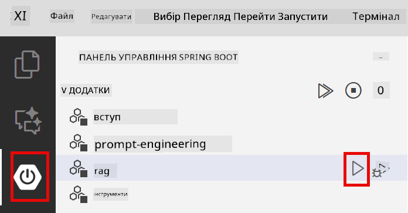

<!--
CO_OP_TRANSLATOR_METADATA:
{
  "original_hash": "f538a51cfd13147d40d84e936a0f485c",
  "translation_date": "2025-12-13T17:23:20+00:00",
  "source_file": "03-rag/README.md",
  "language_code": "uk"
}
-->
# Модуль 03: RAG (Генерація з доповненням пошуком)

## Зміст

- [Чому ви навчитеся](../../../03-rag)
- [Вимоги](../../../03-rag)
- [Розуміння RAG](../../../03-rag)
- [Як це працює](../../../03-rag)
  - [Обробка документів](../../../03-rag)
  - [Створення ембеддингів](../../../03-rag)
  - [Семантичний пошук](../../../03-rag)
  - [Генерація відповіді](../../../03-rag)
- [Запуск додатку](../../../03-rag)
- [Використання додатку](../../../03-rag)
  - [Завантаження документа](../../../03-rag)
  - [Задавання питань](../../../03-rag)
  - [Перевірка джерел](../../../03-rag)
  - [Експерименти з питаннями](../../../03-rag)
- [Ключові поняття](../../../03-rag)
  - [Стратегія розбиття на частини](../../../03-rag)
  - [Оцінки схожості](../../../03-rag)
  - [Зберігання в пам’яті](../../../03-rag)
  - [Управління контекстним вікном](../../../03-rag)
- [Коли RAG має значення](../../../03-rag)
- [Наступні кроки](../../../03-rag)

## Чому ви навчитеся

У попередніх модулях ви навчились вести розмови з ШІ та ефективно структурувати запити. Але існує фундаментальне обмеження: мовні моделі знають лише те, чому їх навчили під час тренування. Вони не можуть відповідати на питання про політики вашої компанії, документацію проекту чи будь-яку інформацію, якої не було в тренувальних даних.

RAG (Генерація з доповненням пошуком) вирішує цю проблему. Замість того, щоб намагатися навчити модель вашій інформації (що дорого і непрактично), ви даєте їй можливість шукати у ваших документах. Коли хтось ставить питання, система знаходить релевантну інформацію і включає її у запит. Модель відповідає на основі цього отриманого контексту.

Уявіть RAG як бібліотеку посилань для моделі. Коли ви ставите питання, система:

1. **Запит користувача** – ви ставите питання  
2. **Ембеддинг** – перетворює ваше питання у вектор  
3. **Пошук у векторному просторі** – знаходить схожі частини документів  
4. **Формування контексту** – додає релевантні частини до запиту  
5. **Відповідь** – LLM генерує відповідь на основі контексту  

Це дозволяє моделі давати відповіді, засновані на ваших реальних даних, а не лише на знаннях з тренування або вигадувати відповіді.


*Робочий процес RAG – від запиту користувача до семантичного пошуку та генерації контекстної відповіді*

## Вимоги

- Завершений Модуль 01 (розгорнуті ресурси Azure OpenAI)  
- Файл `.env` у кореневій директорії з обліковими даними Azure (створений командою `azd up` у Модулі 01)  

> **Примітка:** Якщо ви не завершили Модуль 01, спочатку виконайте інструкції з розгортання там.

## Як це працює

**Обробка документів** - [DocumentService.java](../../../03-rag/src/main/java/com/example/langchain4j/rag/service/DocumentService.java)

Коли ви завантажуєте документ, система розбиває його на частини — менші фрагменти, які зручно поміщаються у контекстне вікно моделі. Ці частини трохи перекриваються, щоб не втрачати контекст на межах.

```java
Document document = FileSystemDocumentLoader.loadDocument("sample-document.txt");

DocumentSplitter splitter = DocumentSplitters
    .recursive(300, 30, new OpenAiTokenizer());

List<TextSegment> segments = splitter.split(document);
```
  
> **🤖 Спробуйте з [GitHub Copilot](https://github.com/features/copilot) Chat:** Відкрийте [`DocumentService.java`](../../../03-rag/src/main/java/com/example/langchain4j/rag/service/DocumentService.java) і запитайте:  
> - "Як LangChain4j розбиває документи на частини і чому важливе перекриття?"  
> - "Який оптимальний розмір частини для різних типів документів і чому?"  
> - "Як обробляти документи кількома мовами або зі спеціальним форматуванням?"

**Створення ембеддингів** - [LangChainRagConfig.java](../../../03-rag/src/main/java/com/example/langchain4j/rag/config/LangChainRagConfig.java)

Кожна частина перетворюється у числове представлення, яке називається ембеддингом — по суті математичним відбитком, що захоплює значення тексту. Схожі тексти дають схожі ембеддинги.

```java
@Bean
public EmbeddingModel embeddingModel() {
    return OpenAiOfficialEmbeddingModel.builder()
        .baseUrl(azureOpenAiEndpoint)
        .apiKey(azureOpenAiKey)
        .modelName(azureEmbeddingDeploymentName)
        .build();
}

EmbeddingStore<TextSegment> embeddingStore = 
    new InMemoryEmbeddingStore<>();
```
  


*Документи представлені у вигляді векторів у просторі ембеддингів — схожий контент групується разом*

**Семантичний пошук** - [RagService.java](../../../03-rag/src/main/java/com/example/langchain4j/rag/service/RagService.java)

Коли ви ставите питання, воно також перетворюється в ембеддинг. Система порівнює ембеддинг вашого питання з ембеддингами всіх частин документів. Вона знаходить частини з найбільш схожим значенням — не просто за ключовими словами, а за семантичною схожістю.

```java
Embedding queryEmbedding = embeddingModel.embed(question).content();

List<EmbeddingMatch<TextSegment>> matches = 
    embeddingStore.findRelevant(queryEmbedding, 5, 0.7);

for (EmbeddingMatch<TextSegment> match : matches) {
    String relevantText = match.embedded().text();
    double score = match.score();
}
```
  
> **🤖 Спробуйте з [GitHub Copilot](https://github.com/features/copilot) Chat:** Відкрийте [`RagService.java`](../../../03-rag/src/main/java/com/example/langchain4j/rag/service/RagService.java) і запитайте:  
> - "Як працює пошук за схожістю з ембеддингами і що визначає оцінку?"  
> - "Який поріг схожості слід використовувати і як це впливає на результати?"  
> - "Як обробляти випадки, коли релевантні документи не знайдені?"

**Генерація відповіді** - [RagService.java](../../../03-rag/src/main/java/com/example/langchain4j/rag/service/RagService.java)

Найрелевантніші частини включаються у запит до моделі. Модель читає ці конкретні частини і відповідає на ваше питання на основі цієї інформації. Це запобігає галюцинаціям — модель може відповідати лише на основі того, що перед нею.

## Запуск додатку

**Перевірка розгортання:**

Переконайтеся, що файл `.env` існує у кореневій директорії з обліковими даними Azure (створений під час Модуля 01):  
```bash
cat ../.env  # Повинно показувати AZURE_OPENAI_ENDPOINT, API_KEY, DEPLOYMENT
```
  
**Запуск додатку:**

> **Примітка:** Якщо ви вже запускали всі додатки за допомогою `./start-all.sh` з Модуля 01, цей модуль вже працює на порту 8081. Можете пропустити команди запуску нижче і перейти безпосередньо на http://localhost:8081.

**Варіант 1: Використання Spring Boot Dashboard (рекомендовано для користувачів VS Code)**

Dev-контейнер включає розширення Spring Boot Dashboard, яке надає візуальний інтерфейс для керування всіма Spring Boot додатками. Ви знайдете його на панелі активності зліва у VS Code (іконка Spring Boot).

З Spring Boot Dashboard ви можете:  
- Переглядати всі доступні Spring Boot додатки у робочому просторі  
- Запускати/зупиняти додатки одним кліком  
- Переглядати логи додатків у реальному часі  
- Моніторити стан додатків  

Просто натисніть кнопку запуску поруч із "rag", щоб запустити цей модуль, або запустіть усі модулі одночасно.



**Варіант 2: Використання shell-скриптів**

Запустіть усі веб-додатки (модулі 01-04):

**Bash:**  
```bash
cd ..  # З кореневого каталогу
./start-all.sh
```
  
**PowerShell:**  
```powershell
cd ..  # З кореневого каталогу
.\start-all.ps1
```
  
Або запустіть лише цей модуль:

**Bash:**  
```bash
cd 03-rag
./start.sh
```
  
**PowerShell:**  
```powershell
cd 03-rag
.\start.ps1
```
  
Обидва скрипти автоматично завантажують змінні середовища з кореневого файлу `.env` і збудують JAR-файли, якщо їх немає.

> **Примітка:** Якщо ви хочете спочатку вручну збудувати всі модулі перед запуском:  
>  
> **Bash:**  
> ```bash
> cd ..  # Go to root directory
> mvn clean package -DskipTests
> ```
  
> **PowerShell:**  
> ```powershell
> cd ..  # Go to root directory
> mvn clean package -DskipTests
> ```
  
Відкрийте http://localhost:8081 у вашому браузері.

**Щоб зупинити:**

**Bash:**  
```bash
./stop.sh  # Тільки цей модуль
# Або
cd .. && ./stop-all.sh  # Всі модулі
```
  
**PowerShell:**  
```powershell
.\stop.ps1  # Тільки цей модуль
# Або
cd ..; .\stop-all.ps1  # Всі модулі
```


## Використання додатку

Додаток надає веб-інтерфейс для завантаження документів і задавання питань.

<a href="images/rag-homepage.png"></a>

*Інтерфейс додатку RAG – завантажуйте документи та ставте питання*

**Завантаження документа**

Почніть із завантаження документа — для тестування найкраще підходять TXT-файли. У цій директорії є `sample-document.txt`, який містить інформацію про можливості LangChain4j, реалізацію RAG та найкращі практики — ідеально для тестування системи.

Система обробляє ваш документ, розбиває його на частини і створює ембеддинги для кожної частини. Це відбувається автоматично при завантаженні.

**Задавання питань**

Тепер ставте конкретні питання про вміст документа. Спробуйте щось фактичне, що чітко вказано у документі. Система шукає релевантні частини, включає їх у запит і генерує відповідь.

**Перевірка джерел**

Зверніть увагу, що кожна відповідь містить посилання на джерела з оцінками схожості. Ці оцінки (від 0 до 1) показують, наскільки релевантною була кожна частина для вашого питання. Вищі оцінки означають кращі збіги. Це дозволяє вам перевірити відповідь за вихідним матеріалом.

<a href="images/rag-query-results.png"></a>

*Результати запиту з відповіддю, посиланнями на джерела та оцінками релевантності*

**Експерименти з питаннями**

Спробуйте різні типи питань:  
- Конкретні факти: "Яка основна тема?"  
- Порівняння: "У чому різниця між X і Y?"  
- Резюме: "Підсумуйте ключові моменти про Z"  

Спостерігайте, як змінюються оцінки релевантності залежно від того, наскільки добре ваше питання відповідає вмісту документа.

## Ключові поняття

**Стратегія розбиття на частини**

Документи розбиваються на частини по 300 токенів з перекриттям у 30 токенів. Такий баланс забезпечує достатній контекст у кожній частині, залишаючись при цьому досить маленькими, щоб у запит можна було включити кілька частин.

**Оцінки схожості**

Оцінки варіюються від 0 до 1:  
- 0.7-1.0: Дуже релевантно, точний збіг  
- 0.5-0.7: Релевантно, хороший контекст  
- Нижче 0.5: Відфільтровано, занадто відмінно  

Система отримує лише частини, що перевищують мінімальний поріг, щоб забезпечити якість.

**Зберігання в пам’яті**

Цей модуль використовує зберігання в оперативній пам’яті для простоти. При перезапуску додатку завантажені документи втрачаються. У продуктивних системах використовують постійні векторні бази даних, такі як Qdrant або Azure AI Search.

**Управління контекстним вікном**

Кожна модель має максимальний розмір контекстного вікна. Ви не можете включити всі частини великого документа. Система отримує топ N найбільш релевантних частин (за замовчуванням 5), щоб залишатися в межах обмежень і при цьому надавати достатній контекст для точних відповідей.

## Коли RAG має значення

**Використовуйте RAG, коли:**  
- Відповідаєте на питання про власні документи  
- Інформація часто змінюється (політики, ціни, специфікації)  
- Потрібна точність з посиланням на джерела  
- Вміст занадто великий, щоб поміститися в один запит  
- Потрібні перевірені, обґрунтовані відповіді  

**Не використовуйте RAG, коли:**  
- Питання вимагають загальних знань, які модель вже має  
- Потрібні дані в реальному часі (RAG працює з завантаженими документами)  
- Вміст достатньо малий, щоб включити його безпосередньо у запити  

## Наступні кроки

**Наступний модуль:** [04-tools - AI агенти з інструментами](../04-tools/README.md)

---

**Навігація:** [← Попередній: Модуль 02 - Інженерія запитів](../02-prompt-engineering/README.md) | [Назад до головної](../README.md) | [Наступний: Модуль 04 - Інструменти →](../04-tools/README.md)

---

<!-- CO-OP TRANSLATOR DISCLAIMER START -->
**Відмова від відповідальності**:  
Цей документ було перекладено за допомогою сервісу автоматичного перекладу [Co-op Translator](https://github.com/Azure/co-op-translator). Хоча ми прагнемо до точності, будь ласка, майте на увазі, що автоматичні переклади можуть містити помилки або неточності. Оригінальний документ рідною мовою слід вважати авторитетним джерелом. Для критично важливої інформації рекомендується звертатися до професійного людського перекладу. Ми не несемо відповідальності за будь-які непорозуміння або неправильні тлумачення, що виникли внаслідок використання цього перекладу.
<!-- CO-OP TRANSLATOR DISCLAIMER END -->