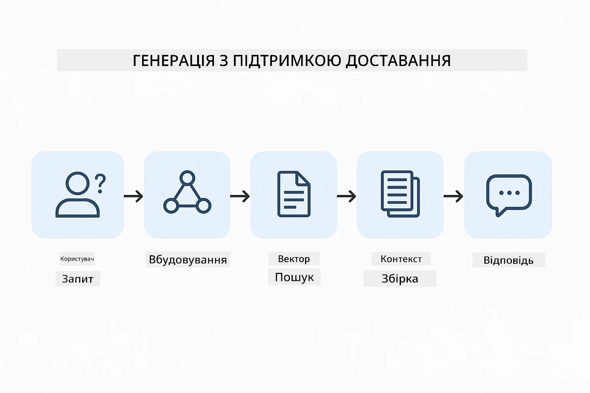
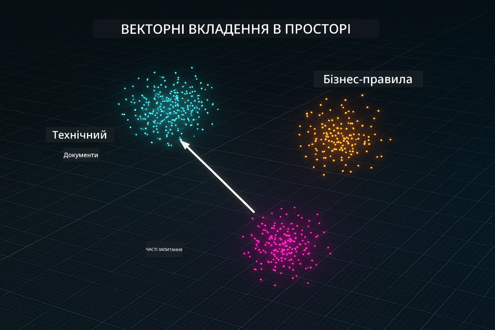
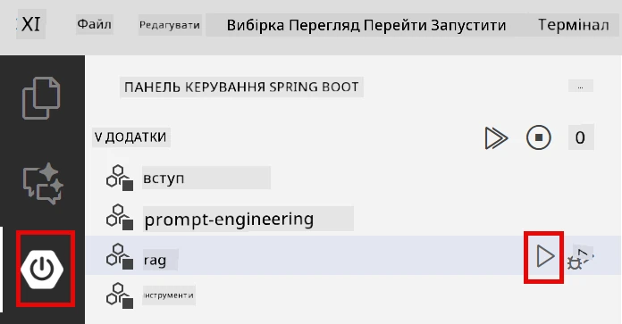
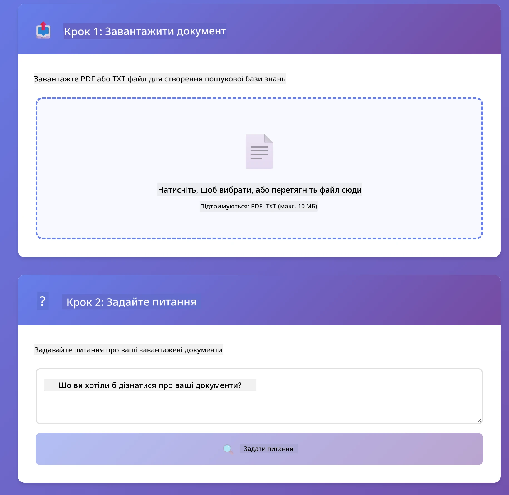
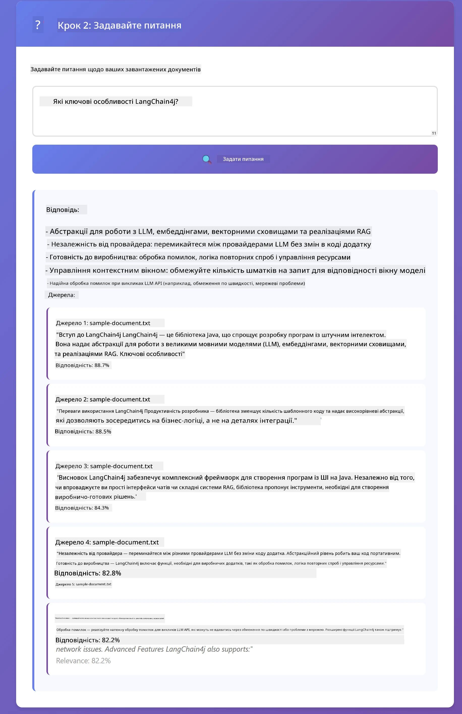

# Модуль 03: RAG (генерація з інформаційним пошуком)

## Зміст

- [Проходження Відео](#проходження-відео)
- [Чому Ви Навчитеся](#чому-ви-навчитеся)
- [Передумови](#передумови)
- [Розуміння RAG](#розуміння-rag)
  - [Який Підхід RAG Використовується в Цьому Посібнику?](#який-підхід-rag-використовується-в-цьому-посібнику)
- [Як Це Працює](#як-це-працює)
  - [Обробка Документів](#обробка-документів)
  - [Створення Векторних Представлень](#створення-векторних-представлень)
  - [Семантичний Пошук](#семантичний-пошук)
  - [Генерація Відповіді](#генерація-відповідей)
- [Запуск Додатку](#запуск-додатку)
- [Використання Додатку](#використання-додатку)
  - [Завантаження Документа](#завантаження-документа)
  - [Задавайте Питання](#задавайте-питання)
  - [Перевірка Джерел](#перевірка-посилань-на-джерела)
  - [Експериментуйте з Питаннями](#експериментуйте-з-питаннями)
- [Ключові Концепції](#основні-поняття)
  - [Стратегія Розбиття на Частини](#стратегія-розбиття-на-шматки)
  - [Оценки Схожості](#оцінки-схожості)
  - [Зберігання в Пам’яті](#збереження-в-пам’яті)
  - [Управління Вікном Контексту](#управління-вікном-контексту)
- [Коли RAG Має Значення](#коли-rag-є-доречним)
- [Наступні Кроки](#наступні-кроки)

## Проходження Відео

Перегляньте це живе заняття, яке пояснює, як почати працювати з цим модулем:

<a href="https://www.youtube.com/watch?v=_olq75ZH_eY"></a>

## Чому Ви Навчитеся

У попередніх модулях ви вчилися вести розмови з ШІ та ефективно структурувати ваші запити. Але існує фундаментальна обмеженість: мовні моделі знають лише те, що вони вивчили під час навчання. Вони не можуть відповідати на питання щодо політик вашої компанії, документації вашого проєкту або будь-якої інформації, яку вони не бачили під час тренування.

RAG (генерація з інформаційним пошуком) вирішує цю проблему. Замість того, щоб намагатися вчити модель вашій інформації (що дорого та практично неможливо), ви даєте їй можливість шукати у ваших документах. Коли хтось ставить питання, система знаходить релевантну інформацію та включає її в запит. Модель тоді відповідає на основі отриманого контексту.

Думайте про RAG як про надання моделі бібліотеки посилань. Коли ви ставите питання, система:

1. **Запит Користувача** — ви ставите питання  
2. **Векторне Представлення** — перетворює ваше питання у вектор  
3. **Пошук по Векторах** — знаходить схожі частини документів  
4. **Збір Контексту** — додає релевантні частини до запиту  
5. **Відповідь** — великий мовний модель створює відповідь на основі контексту

Це підкріплює відповіді моделі вашими реальними даними, а не лише знаннями з тренування або вигадкою відповідей.

## Передумови

- Завершений [Модуль 01 - Вступ](../01-introduction/README.md) (розгорнуті ресурси Azure OpenAI, включно з вбудованою моделлю `text-embedding-3-small`)  
- Файл `.env` в кореневій теці з даними доступу Azure (створений командою `azd up` у Модулі 01)

> **Примітка:** Якщо ви ще не завершили Модуль 01, спочатку дотримуйтесь інструкцій там. Команда `azd up` розгортає як GPT-модель для чату, так і вбудовану модель, що використовується у цьому модулі.

## Розуміння RAG

Нижче наведена діаграма ілюструє основну ідею: замість того, щоб покладатись лише на дані тренування моделі, RAG надає їй бібліотеку ваших документів для консультації перед створенням кожної відповіді.


*Ця діаграма показує відмінність між стандартною великою мовною моделлю (яка робить припущення на основі даних тренування) та моделлю RAG, яка спочатку консультується з вашими документами.*

Ось як компоненти поєднуються в кінцевому рахунку. Запит користувача проходить чотири етапи — створення векторного представлення, пошук по вектору, збір контексту та генерація відповіді — кожен наступний базується на попередньому:



*Ця діаграма показує повний конвеєр RAG — запит користувача проходить через створення векторного представлення, пошук, збір контексту та генерацію відповіді.*

Решта цього модуля детально розглядає кожен етап, з кодом, який ви можете запускати і змінювати.

### Який Підхід RAG Використовується в Цьому Посібнику?

LangChain4j пропонує три способи реалізації RAG, кожен з різним рівнем абстракції. Діаграма нижче порівнює їх поруч:


*Ця діаграма порівнює три підходи LangChain4j RAG — Easy, Native та Advanced — показуючи їх ключові компоненти та коли кожен варто використовувати.*

| Підхід | Що Робить | Компроміс |
|---|---|---|
| **Easy RAG** | Автоматично з’єднує все через `AiServices` і `ContentRetriever`. Ви анотуєте інтерфейс, прикріплюєте ретривер, і LangChain4j опрацьовує векторні представленння, пошук і складання запиту в фоновому режимі. | Мінімум коду, але ви не бачите, що відбувається на кожному кроці. |
| **Native RAG** | Ви самі викликаєте модель створення векторних представлень, шукаєте по сховищу, складаєте запит і генеруєте відповідь — по одному кроку за раз. | Більше коду, але кожний етап видимий та керований. |
| **Advanced RAG** | Використовує рамковий модуль `RetrievalAugmentor` з підключними трансформерами запитів, маршрутизаторами, повторними ранжувальниками та інжекторами контенту для виробничих конвеєрів. | Максимальна гнучкість, але значно більша складність. |

**Цей посібник використовує Native підхід.** Кожен крок RAG-процесу — створення векторного представлення запиту, пошук у сховищі векторів, збір контексту та генерація відповіді — чітко описаний у [`RagService.java`](../../../03-rag/src/main/java/com/example/langchain4j/rag/service/RagService.java). Це зроблено навмисно: як навчальний матеріал, важливіше, щоб ви бачили і розуміли кожен етап, ніж мінімізували код. Коли ви ознайомитеся з процесом, ви зможете перейти до Easy RAG для швидких прототипів або Advanced RAG для виробничих систем.

> **💡 Цікавитесь Easy RAG?** LangChain4j також пропонує підхід *Easy RAG*, де `AiServices` і `ContentRetriever` автоматично опрацьовують створення векторних представлень, пошук та складання запиту. Цей модуль іде більш явним шляхом — розкриває цей процес, щоб ви могли бачити та керувати кожним кроком безпосередньо.

Діаграма нижче показує конвеєр Easy RAG. Зауважте, як `AiServices` і `EmbeddingStoreContentRetriever` приховують всю складність — ви завантажуєте документ, додаєте ретривер і отримуєте відповіді. Native підхід в цьому модулі розкриває кожен із цих прихованих кроків:


*Ця діаграма показує конвеєр Easy RAG. Порівняйте з Native підходом, використаним у цьому модулі: Easy RAG приховує створення векторних представлень, пошук і складання запиту за `AiServices` та `ContentRetriever` — ви завантажуєте документ, додаєте ретривер і отримуєте відповіді. Native підхід розкриває цей процес так, що ви самі викликаєте кожен крок (створення векторів, пошук, збір контексту, генерацію), отримуючи повну прозорість і контроль.*

## Як Це Працює

Конвеєр RAG у цьому модулі поділяється на чотири етапи, які виконуються послідовно щоразу, коли користувач ставить питання. Спершу завантажений документ **розбирається і розбивається на частини** — керовані фрагменти. Ці частини потім конвертуються у **векторні представлення** та зберігаються для математичного порівняння. Коли приходить запит, система виконує **семантичний пошук** для знаходження найбільш релевантних частин, і нарешті передає їх як контекст до великої мовної моделі для **генерації відповіді**. Нижче йде покрокове пояснення кожного етапу з кодом і діаграмами. Почнемо з першого кроку.

### Обробка Документів

[DocumentService.java](../../../03-rag/src/main/java/com/example/langchain4j/rag/service/DocumentService.java)

Коли ви завантажуєте документ, система розбирає його (PDF або простий текст), додає метадані, як-от ім'я файлу, а потім розбиває на частини — менші фрагменти, які зручно поміщаються у контекстне вікно моделі. Ці частини трохи накладаються одна на одну, щоб не втратити контекст на межах.

```java
// Розпарсити завантажений файл і обгорнути його в документ LangChain4j
Document document = Document.from(content, metadata);

// Розбити на фрагменти по 300 токенів з перекриттям у 30 токенів
DocumentSplitter splitter = DocumentSplitters
    .recursive(300, 30);

List<TextSegment> segments = splitter.split(document);
```

Нижче діаграма ілюструє це візуально. Зауважте, як кожна частина має невеликий перетин з сусідніми — 30-токенне перекриття гарантує, що важливий контекст не втрачається між частинами:


*Ця діаграма показує документ, поділений на частини по 300 токенів із 30 токенами перекриття, зберігаючи контекст на межах частин.*

> **🤖 Спробуйте з [GitHub Copilot](https://github.com/features/copilot) Chat:** Відкрийте [`DocumentService.java`](../../../03-rag/src/main/java/com/example/langchain4j/rag/service/DocumentService.java) і запитайте:
> - "Як LangChain4j розбиває документи на частини і чому перекриття важливе?"
> - "Який оптимальний розмір частини для різних типів документів і чому?"
> - "Як обробляти документи кількома мовами або зі спеціальним форматуванням?"

### Створення Векторних Представлень

[LangChainRagConfig.java](../../../03-rag/src/main/java/com/example/langchain4j/rag/config/LangChainRagConfig.java)

Кожна частина перетворюється у числове представлення, зване векторним представленням (embedding) — по суті конвертер змісту у числа. Модель для векторів не є "інтелектуальною", як чат-модель; вона не виконує інструкцій, не логікує та не відповідає на питання. Вона просто відображає текст у математичний простір, де схожі значення розташовуються поряд — "автомобіль" поруч із "машина", "політика повернення" поруч із "поверніть мої гроші". Якщо чат-модель — це співрозмовник, то модель векторних представлень — це відмінна система зберігання файлів.

Нижче діаграма візуалізує цю концепцію — текст перетворюється на числові вектори, а схожі за значенням слова/фрази утворюють кластери:


*Ця діаграма показує, як модель векторних представлень конвертує текст у числові вектори, розміщаючи схожі за значенням слова — як "автомобіль" та "машина" — поруч у векторному просторі.*

```java
@Bean
public EmbeddingModel embeddingModel() {
    return OpenAiOfficialEmbeddingModel.builder()
        .baseUrl(azureOpenAiEndpoint)
        .apiKey(azureOpenAiKey)
        .modelName(azureEmbeddingDeploymentName)
        .build();
}

EmbeddingStore<TextSegment> embeddingStore = 
    new InMemoryEmbeddingStore<>();
```

Класова діаграма нижче демонструє дві окремі гілки у RAG-процесі і відповідні класи LangChain4j. Потік **завантаження** (виконується раз при завантаженні) розбиває документ, створює векторні представлення частин та зберігає їх через `.addAll()`. Потік **запитів** (кожного разу при питанні) створює векторне представлення питання, шукає у сховищі через `.search()` і передає знайдений контекст чат-моделі. Обидва потоки з’єднуються через спільний інтерфейс `EmbeddingStore<TextSegment>`:


*Ця діаграма показує два потоки у RAG — завантаження та запит — і як вони взаємодіють через спільний EmbeddingStore.*

Після збереження векторних представлень, схожий контент природно групується у векторному просторі. Візуалізація нижче показує, як документи на близькі теми збираються в окремі кластери, що і робить семантичний пошук можливим:



*Ця візуалізація показує, як пов’язані документи групуються у 3D векторному просторі, утворюючи окремі групи за темами, наприклад, Технічна Документація, Бізнес-правила, Часті Запитання.*

Коли користувач шукає, система виконує чотири кроки: створює embeddings для документів один раз, створює embedding запиту для кожного пошуку, порівнює вектор запиту зі всіма збереженими векторами за косинусною схожістю та повертає топ-К найкращих частин. Нижче діаграма показує кожен крок і відповідні класи LangChain4j:


*Ця діаграма показує чотириступеневий процес пошуку за векторними представленнями: створення векторів документів, створення вектору запиту, порівняння векторів косинусною схожістю та повернення топ-К результатів.*

### Семантичний Пошук

[RagService.java](../../../03-rag/src/main/java/com/example/langchain4j/rag/service/RagService.java)

Коли ви ставите питання, ваше питання також перетворюється у embedding. Система порівнює embedding вашого запиту з embedding-ами всіх частин документів. Вона знаходить частини з найбільш схожими значеннями — не просто за ключовими словами, а за фактичною семантичною близькістю.

```java
Embedding queryEmbedding = embeddingModel.embed(question).content();

EmbeddingSearchRequest searchRequest = EmbeddingSearchRequest.builder()
    .queryEmbedding(queryEmbedding)
    .maxResults(5)
    .minScore(0.5)
    .build();

EmbeddingSearchResult<TextSegment> searchResult = embeddingStore.search(searchRequest);
List<EmbeddingMatch<TextSegment>> matches = searchResult.matches();

for (EmbeddingMatch<TextSegment> match : matches) {
    String relevantText = match.embedded().text();
    double score = match.score();
}
```

Діаграма нижче порівнює семантичний пошук із традиційним пошуком за ключовими словами. Пошук за ключовим словом "транспорт" пропускає частину про "автомобілі та вантажівки", тоді як семантичний пошук розуміє, що це те саме, і повертає її як відповідний результат:


*Ця діаграма порівнює пошук за ключовими словами з семантичним пошуком, показуючи, як семантичний пошук знаходить концептуально суміжний контент, навіть якщо точні слова відрізняються.*

Під капотом схожість вимірюється за допомогою косинусної схожості — фактично питання "чи вказують ці дві стріли в один напрямок?" Два фрагменти можуть містити зовсім різні слова, але якщо вони мають той самий зміст, їхні вектори дивляться в один бік і оцінка близька до 1.0:


*Ця діаграма ілюструє косинусну схожість як кут між векторами вставок — більш узгоджені вектори мають оцінку ближчу до 1.0, що вказує на вищу семантичну схожість.*

> **🤖 Спробуйте з [GitHub Copilot](https://github.com/features/copilot) Chat:** Відкрийте [`RagService.java`](../../../03-rag/src/main/java/com/example/langchain4j/rag/service/RagService.java) та запитайте:
> - "Як працює пошук за схожістю з використанням embedding і що визначає оцінку?"
> - "Який поріг схожості слід використовувати і як це впливає на результати?"
> - "Як опрацювати випадки, коли не знайдено релевантних документів?"

### Генерація відповідей

[RagService.java](../../../03-rag/src/main/java/com/example/langchain4j/rag/service/RagService.java)

Найрелевантніші шматки збираються у структурований підказку, що містить явні інструкції, отриманий контекст і запит користувача. Модель читає лише ці конкретні шматки та відповідає на основі цієї інформації — вона може використовувати лише те, що перед нею, що запобігає галюцинаціям.

```java
String context = matches.stream()
    .map(match -> match.embedded().text())
    .collect(Collectors.joining("\n\n"));

String prompt = String.format("""
    Answer the question based on the following context.
    If the answer cannot be found in the context, say so.

    Context:
    %s

    Question: %s

    Answer:""", context, request.question());

String answer = chatModel.chat(prompt);
```

Наведену нижче діаграму показано цей процес збірки — найбільш релевантні шматки з кроку пошуку вставляються у шаблон підказки, і `OpenAiOfficialChatModel` генерує обґрунтовану відповідь:


*Ця діаграма показує, як найбільш релевантні шматки збираються у структуровану підказку, що дозволяє моделі створювати обґрунтовані відповіді на основі ваших даних.*

## Запуск додатку

**Перевірте розгортання:**

Переконайтесь, що файл `.env` існує в кореневій теці з обліковими даними Azure (створений під час Модуля 01). Запустіть це з каталогу модуля (`03-rag/`):

**Bash:**
```bash
cat ../.env  # Має показувати AZURE_OPENAI_ENDPOINT, API_KEY, DEPLOYMENT
```

**PowerShell:**
```powershell
Get-Content ..\.env  # Повинно показувати AZURE_OPENAI_ENDPOINT, API_KEY, DEPLOYMENT
```

**Запустіть додаток:**

> **Примітка:** Якщо ви вже запускали всі додатки за допомогою `./start-all.sh` з кореневого каталогу (як описано в Модулі 01), цей модуль вже працює на порту 8081. Ви можете пропустити команди запуску нижче і перейти безпосередньо на http://localhost:8081.

**Варіант 1: Використання Spring Boot Dashboard (Рекомендується для користувачів VS Code)**

Контейнер розробника включає розширення Spring Boot Dashboard, яке надає візуальний інтерфейс для керування всіма додатками Spring Boot. Ви можете знайти його в панелі активностей ліворуч у VS Code (шукайте іконку Spring Boot).

З Spring Boot Dashboard ви можете:
- Побачити всі доступні додатки Spring Boot у робочому просторі
- Запускати/зупиняти додатки одним кліком
- Переглядати логи додатків у реальному часі
- Моніторити стан додатків

Просто натисніть кнопку відтворення поруч з "rag", щоб запустити цей модуль, або запустіть всі модулі одночасно.



*Цей знімок екрана показує Spring Boot Dashboard у VS Code, де ви можете запускати, зупиняти та моніторити додатки візуально.*

**Варіант 2: Використання shell-скриптів**

Запустіть усі веб-додатки (модулі 01-04):

**Bash:**
```bash
cd ..  # З кореневого каталогу
./start-all.sh
```

**PowerShell:**
```powershell
cd ..  # З кореневого каталогу
.\start-all.ps1
```

Або запустіть лише цей модуль:

**Bash:**
```bash
cd 03-rag
./start.sh
```

**PowerShell:**
```powershell
cd 03-rag
.\start.ps1
```

Обидва скрипти автоматично завантажують змінні оточення з кореневого файлу `.env` і збудують JAR-файли, якщо вони відсутні.

> **Примітка:** Якщо ви хочете вручну збудувати всі модулі перед запуском:
>
> **Bash:**
> ```bash
> cd ..  # Go to root directory
> mvn clean package -DskipTests
> ```
>
> **PowerShell:**
> ```powershell
> cd ..  # Go to root directory
> mvn clean package -DskipTests
> ```

Відкрийте http://localhost:8081 у вашому браузері.

**Щоб зупинити:**

**Bash:**
```bash
./stop.sh  # Тільки цей модуль
# Або
cd .. && ./stop-all.sh  # Всі модулі
```

**PowerShell:**
```powershell
.\stop.ps1  # Тільки цей модуль
# Або
cd ..; .\stop-all.ps1  # Всі модулі
```

## Використання додатку

Додаток надає веб-інтерфейс для завантаження документів та задавання питань.

<a href="images/rag-homepage.png"></a>

*Цей знімок екрана показує інтерфейс додатку RAG, де ви завантажуєте документи і ставите запитання.*

### Завантаження документа

Почніть із завантаження документа — TXT-файли найкраще підходять для тестування. У цій теці є `sample-document.txt`, який містить інформацію про особливості LangChain4j, реалізацію RAG та найкращі практики — ідеально для тестування системи.

Система обробляє ваш документ, розбиває його на шматки та створює embedding для кожного шматка. Це відбувається автоматично після завантаження.

### Задавайте питання

Тепер задайте конкретні питання про вміст документа. Спробуйте щось фактичне, що чітко вказано в документі. Система шукає релевантні шматки, включає їх у підказку і генерує відповідь.

### Перевірка посилань на джерела

Зверніть увагу, що кожна відповідь містить посилання на джерела з оцінками схожості. Ці оцінки (від 0 до 1) показують, наскільки релевантним був кожний шматок до вашого питання. Вищі оцінки означають кращі відповідності. Це дозволяє вам перевірити відповідь на основі джерельного матеріалу.

<a href="images/rag-query-results.png"></a>

*Цей скріншот показує результати запиту з генерованою відповіддю, посиланнями на джерела та оцінками релевантності кожного отриманого шматка.*

### Експериментуйте з питаннями

Спробуйте різні типи питань:
- Конкретні факти: "Яка основна тема?"
- Порівняння: "У чому різниця між X та Y?"
- Резюме: "Підсумуйте ключові моменти про Z"

Спостерігайте, як змінюються оцінки релевантності залежно від того, наскільки добре ваше питання відповідає вмісту документа.

## Основні поняття

### Стратегія розбиття на шматки

Документи розбиваються на шматки по 300 токенів з 30 токенами перекриття. Такий баланс гарантує, що кожен шматок має достатній контекст, щоб бути змістовним, при цьому залишається досить маленьким, щоб включити кілька шматків у підказку.

### Оцінки схожості

Кожний отриманий шматок має оцінку схожості від 0 до 1, що вказує, наскільки близько він відповідає питанню користувача. Наведена нижче діаграма візуалізує діапазони оцінок і як система їх використовує для фільтрації результатів:


*Ця діаграма показує діапазони оцінок від 0 до 1 з мінімальним порогом 0.5, що фільтрує нерелевантні шматки.*

Оцінки коливаються від 0 до 1:
- 0.7-1.0: Високорелевантні, точне співпадіння
- 0.5-0.7: Релевантні, добрий контекст
- Нижче 0.5: Відфільтровані, надто різні

Система витягує лише шматки, які перевищують мінімальний поріг для забезпечення якості.

Embedding працюють добре, коли значення згруповані чітко, але мають "сліпі зони". Наведена нижче діаграма показує типові помилки — занадто великі шматки дають "розмиті" вектори, занадто малі не мають контексту, неоднозначні терміни вказують на кілька кластерів, а точні пошуки за співпадінням (ID, номери деталей) зовсім не працюють з embedding:


*Ця діаграма показує типові випадки помилок embedding: занадто великі шматки, занадто малі, неоднозначні терміни, які вказують на кілька кластерів, та пошук точних співпадінь як ID.*

### Збереження в пам’яті

Цей модуль використовує збереження в оперативній пам’яті для простоти. Після перезапуску додатку завантажені документи втрачаються. У промислових системах використовують стійкі векторні бази даних, як Qdrant або Azure AI Search.

### Управління вікном контексту

Кожна модель має максимальний розмір вікна контексту. Ви не можете включити всі шматки великого документа. Система вибирає топ N найбільш релевантних шматків (за замовчуванням 5), щоб відповідати обмеженням і надати достатньо контексту для точних відповідей.

## Коли RAG є доречним

RAG не завжди є правильним підходом. Наступний довідник допоможе вам визначити, коли RAG додає цінність, а коли простіші підходи — як включення контенту безпосередньо у підказку чи покликання на вбудовані знання моделі — є достатніми:


*Ця діаграма показує довідник для прийняття рішення, коли RAG додає цінність у порівнянні з простішими підходами.*

## Наступні кроки

**Наступний модуль:** [04-tools - AI Агенти з Інструментами](../04-tools/README.md)

---

**Навігація:** [← Попередній: Модуль 02 - Проєктування підказок](../02-prompt-engineering/README.md) | [Назад до головного](../README.md) | [Наступний: Модуль 04 - Інструменти →](../04-tools/README.md)

---

<!-- CO-OP TRANSLATOR DISCLAIMER START -->
**Відмова від відповідальності**:
Цей документ було перекладено за допомогою сервісу штучного інтелекту для перекладу [Co-op Translator](https://github.com/Azure/co-op-translator). Хоча ми прагнемо до точності, будь ласка, майте на увазі, що автоматичні переклади можуть містити помилки або неточності. Оригінальний документ рідною мовою слід вважати авторитетним джерелом. Для критично важливої інформації рекомендується професійний людський переклад. Ми не несемо відповідальності за будь-які непорозуміння або неправильні тлумачення, що виникли внаслідок використання цього перекладу.
<!-- CO-OP TRANSLATOR DISCLAIMER END -->