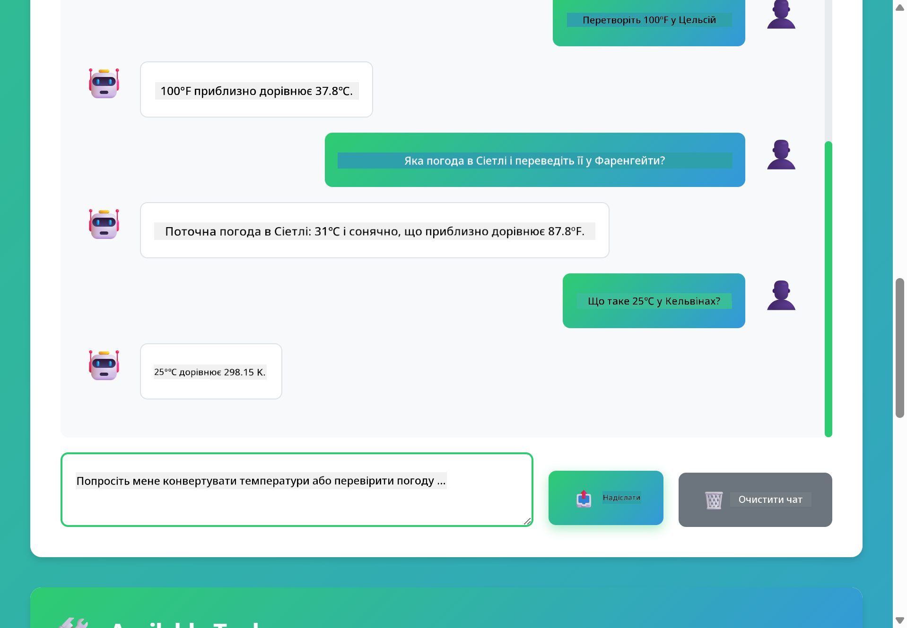

<!--
CO_OP_TRANSLATOR_METADATA:
{
  "original_hash": "aa23f106e7f53270924c9dd39c629004",
  "translation_date": "2025-12-13T19:36:18+00:00",
  "source_file": "04-tools/README.md",
  "language_code": "uk"
}
-->
# Модуль 04: AI Агенти з Інструментами

## Зміст

- [Чому Ви Навчитеся](../../../04-tools)
- [Вимоги](../../../04-tools)
- [Розуміння AI Агентів з Інструментами](../../../04-tools)
- [Як Працює Виклик Інструментів](../../../04-tools)
  - [Визначення Інструментів](../../../04-tools)
  - [Прийняття Рішень](../../../04-tools)
  - [Виконання](../../../04-tools)
  - [Генерація Відповіді](../../../04-tools)
- [Ланцюжок Інструментів](../../../04-tools)
- [Запуск Додатку](../../../04-tools)
- [Використання Додатку](../../../04-tools)
  - [Спробуйте Просте Використання Інструменту](../../../04-tools)
  - [Перевірте Ланцюжок Інструментів](../../../04-tools)
  - [Перегляньте Потік Розмови](../../../04-tools)
  - [Спостерігайте за Міркуваннями](../../../04-tools)
  - [Експериментуйте з Різними Запитами](../../../04-tools)
- [Ключові Концепції](../../../04-tools)
  - [Патерн ReAct (Міркування та Дія)](../../../04-tools)
  - [Опис Інструментів Має Значення](../../../04-tools)
  - [Управління Сесіями](../../../04-tools)
  - [Обробка Помилок](../../../04-tools)
- [Доступні Інструменти](../../../04-tools)
- [Коли Використовувати Агенти на Основі Інструментів](../../../04-tools)
- [Наступні Кроки](../../../04-tools)

## Чому Ви Навчитеся

До цього моменту ви навчилися вести розмови з AI, ефективно структурувати підказки та базувати відповіді на ваших документах. Але існує фундаментальне обмеження: мовні моделі можуть лише генерувати текст. Вони не можуть перевірити погоду, виконувати обчислення, запитувати бази даних або взаємодіяти з зовнішніми системами.

Інструменти змінюють це. Надаючи моделі доступ до функцій, які вона може викликати, ви перетворюєте її з генератора тексту на агента, який може виконувати дії. Модель вирішує, коли їй потрібен інструмент, який саме інструмент використовувати і які параметри передати. Ваш код виконує функцію і повертає результат. Модель включає цей результат у свою відповідь.

## Вимоги

- Завершений Модуль 01 (розгорнуті ресурси Azure OpenAI)
- Файл `.env` у кореневій директорії з обліковими даними Azure (створений командою `azd up` у Модулі 01)

> **Примітка:** Якщо ви не завершили Модуль 01, спочатку дотримуйтесь інструкцій з розгортання там.

## Розуміння AI Агентів з Інструментами

AI агент з інструментами слідує патерну міркування та дії (ReAct):

1. Користувач ставить запитання
2. Агент міркує, що йому потрібно знати
3. Агент вирішує, чи потрібен йому інструмент для відповіді
4. Якщо так, агент викликає відповідний інструмент з правильними параметрами
5. Інструмент виконується і повертає дані
6. Агент включає результат і надає остаточну відповідь


*Патерн ReAct - як AI агенти чергують міркування та дії для розв’язання проблем*

Це відбувається автоматично. Ви визначаєте інструменти та їх описи. Модель приймає рішення, коли і як їх використовувати.

## Як Працює Виклик Інструментів

**Визначення Інструментів** - [WeatherTool.java](../../../04-tools/src/main/java/com/example/langchain4j/agents/tools/WeatherTool.java) | [TemperatureTool.java](../../../04-tools/src/main/java/com/example/langchain4j/agents/tools/TemperatureTool.java)

Ви визначаєте функції з чіткими описами та специфікаціями параметрів. Модель бачить ці описи у системному підказі і розуміє, що робить кожен інструмент.

```java
@Component
public class WeatherTool {
    
    @Tool("Get the current weather for a location")
    public String getCurrentWeather(@P("Location name") String location) {
        // Ваша логіка пошуку погоди
        return "Weather in " + location + ": 22°C, cloudy";
    }
}

@AiService
public interface Assistant {
    String chat(@MemoryId String sessionId, @UserMessage String message);
}

// Асистент автоматично підключається Spring Boot з:
// - біном ChatModel
// - Всі методи @Tool з класів @Component
// - ChatMemoryProvider для керування сесіями
```

> **🤖 Спробуйте з [GitHub Copilot](https://github.com/features/copilot) Chat:** Відкрийте [`WeatherTool.java`](../../../04-tools/src/main/java/com/example/langchain4j/agents/tools/WeatherTool.java) і запитайте:
> - "Як інтегрувати реальний погодний API, наприклад OpenWeatherMap, замість мок-даних?"
> - "Що робить хороший опис інструменту, який допомагає AI правильно його використовувати?"
> - "Як обробляти помилки API та обмеження швидкості у реалізації інструментів?"

**Прийняття Рішень**

Коли користувач питає "Яка погода в Сіетлі?", модель розпізнає, що їй потрібен погодний інструмент. Вона генерує виклик функції з параметром локації "Seattle".

**Виконання** - [AgentService.java](../../../04-tools/src/main/java/com/example/langchain4j/agents/service/AgentService.java)

Spring Boot автоматично підключає декларативний інтерфейс `@AiService` з усіма зареєстрованими інструментами, а LangChain4j виконує виклики інструментів автоматично.

> **🤖 Спробуйте з [GitHub Copilot](https://github.com/features/copilot) Chat:** Відкрийте [`AgentService.java`](../../../04-tools/src/main/java/com/example/langchain4j/agents/service/AgentService.java) і запитайте:
> - "Як працює патерн ReAct і чому він ефективний для AI агентів?"
> - "Як агент вирішує, який інструмент використовувати і в якому порядку?"
> - "Що відбувається, якщо виконання інструменту не вдається - як надійно обробляти помилки?"

**Генерація Відповіді**

Модель отримує погодні дані і форматує їх у природну мову для користувача.

### Чому Використовувати Декларативні AI Сервіси?

Цей модуль використовує інтеграцію LangChain4j зі Spring Boot з декларативними інтерфейсами `@AiService`:

- **Автоматичне підключення Spring Boot** - ChatModel та інструменти автоматично інжектяться
- **Патерн @MemoryId** - Автоматичне управління пам’яттю на основі сесій
- **Один екземпляр** - Асистент створюється один раз і повторно використовується для кращої продуктивності
- **Типобезпечне виконання** - Java методи викликаються напряму з конвертацією типів
- **Оркестрація багатокрокових викликів** - Автоматично обробляє ланцюжок інструментів
- **Відсутність шаблонного коду** - Немає ручних викликів AiServices.builder() або HashMap пам’яті

Альтернативні підходи (ручний `AiServices.builder()`) вимагають більше коду і не мають переваг інтеграції Spring Boot.

## Ланцюжок Інструментів

**Ланцюжок Інструментів** - AI може викликати кілька інструментів послідовно. Запитайте "Яка погода в Сіетлі і чи варто брати парасолю?" і спостерігайте, як він ланцюжить `getCurrentWeather` з міркуваннями про дощовий одяг.

<a href="images/tool-chaining.png"></a>

*Послідовні виклики інструментів - вихід одного інструменту стає вхідними даними для наступного рішення*

**Граціозні Збої** - Запитайте погоду в місті, якого немає у мок-даних. Інструмент поверне повідомлення про помилку, і AI пояснить, що не може допомогти. Інструменти безпечно відмовляють.

Це відбувається в одному кроці розмови. Агент автономно оркеструє кілька викликів інструментів.

## Запуск Додатку

**Перевірте розгортання:**

Переконайтеся, що файл `.env` існує у кореневій директорії з обліковими даними Azure (створений під час Модуля 01):
```bash
cat ../.env  # Повинно показувати AZURE_OPENAI_ENDPOINT, API_KEY, DEPLOYMENT
```

**Запустіть додаток:**

> **Примітка:** Якщо ви вже запускали всі додатки за допомогою `./start-all.sh` з Модуля 01, цей модуль вже працює на порту 8084. Можете пропустити команди запуску нижче і перейти безпосередньо на http://localhost:8084.

**Варіант 1: Використання Spring Boot Dashboard (Рекомендовано для користувачів VS Code)**

Dev контейнер включає розширення Spring Boot Dashboard, яке надає візуальний інтерфейс для керування всіма Spring Boot додатками. Ви знайдете його в Activity Bar зліва у VS Code (іконка Spring Boot).

З Spring Boot Dashboard ви можете:
- Переглядати всі доступні Spring Boot додатки у робочому просторі
- Запускати/зупиняти додатки одним кліком
- Переглядати логи додатків у реальному часі
- Моніторити стан додатків

Просто натисніть кнопку запуску поруч з "tools", щоб запустити цей модуль, або запустіть усі модулі одночасно.


**Варіант 2: Використання shell скриптів**

Запустіть усі веб-додатки (модулі 01-04):

**Bash:**
```bash
cd ..  # З кореневого каталогу
./start-all.sh
```

**PowerShell:**
```powershell
cd ..  # З кореневого каталогу
.\start-all.ps1
```

Або запустіть лише цей модуль:

**Bash:**
```bash
cd 04-tools
./start.sh
```

**PowerShell:**
```powershell
cd 04-tools
.\start.ps1
```

Обидва скрипти автоматично завантажують змінні середовища з кореневого файлу `.env` і збудують JAR-файли, якщо їх немає.

> **Примітка:** Якщо ви хочете збудувати всі модулі вручну перед запуском:
>
> **Bash:**
> ```bash
> cd ..  # Go to root directory
> mvn clean package -DskipTests
> ```
>
> **PowerShell:**
> ```powershell
> cd ..  # Go to root directory
> mvn clean package -DskipTests
> ```

Відкрийте http://localhost:8084 у вашому браузері.

**Щоб зупинити:**

**Bash:**
```bash
./stop.sh  # Тільки цей модуль
# Або
cd .. && ./stop-all.sh  # Всі модулі
```

**PowerShell:**
```powershell
.\stop.ps1  # Тільки цей модуль
# Або
cd ..; .\stop-all.ps1  # Всі модулі
```

## Використання Додатку

Додаток надає веб-інтерфейс, де ви можете взаємодіяти з AI агентом, який має доступ до інструментів погоди та конвертації температур.

<a href="images/tools-homepage.png"></a>

*Інтерфейс AI Агент Інструментів - швидкі приклади та чат для взаємодії з інструментами*

**Спробуйте Просте Використання Інструменту**

Почніть з простого запиту: "Перетвори 100 градусів Фаренгейта в Цельсій". Агент розпізнає, що йому потрібен інструмент конвертації температури, викликає його з правильними параметрами і повертає результат. Зверніть увагу, як природно це відчувається — ви не вказували, який інструмент використовувати або як його викликати.

**Перевірте Ланцюжок Інструментів**

Тепер спробуйте щось складніше: "Яка погода в Сіетлі і перетвори її у Фаренгейти?" Спостерігайте, як агент працює поетапно. Спочатку він отримує погоду (яка повертає Цельсії), розуміє, що потрібно конвертувати у Фаренгейти, викликає інструмент конвертації і об’єднує обидва результати в одну відповідь.

**Перегляньте Потік Розмови**

Інтерфейс чату зберігає історію розмов, дозволяючи вести багатокрокові взаємодії. Ви можете бачити всі попередні запити та відповіді, що полегшує відстеження розмови і розуміння, як агент будує контекст через кілька обмінів.

<a href="images/tools-conversation-demo.png"></a>

*Багатокрокова розмова, що показує прості конвертації, пошук погоди та ланцюжок інструментів*

**Експериментуйте з Різними Запитами**

Спробуйте різні комбінації:
- Пошук погоди: "Яка погода в Токіо?"
- Конвертації температур: "Скільки буде 25°C у Кельвінах?"
- Комбіновані запити: "Перевір погоду в Парижі і скажи, чи вище там 20°C"

Зверніть увагу, як агент інтерпретує природну мову і відображає її у відповідні виклики інструментів.

## Ключові Концепції

**Патерн ReAct (Міркування та Дія)**

Агент чергує міркування (вирішує, що робити) і дію (використання інструментів). Цей патерн дозволяє автономно розв’язувати проблеми, а не просто відповідати на інструкції.

**Опис Інструментів Має Значення**

Якість описів ваших інструментів безпосередньо впливає на те, наскільки добре агент їх використовує. Чіткі, конкретні описи допомагають моделі розуміти, коли і як викликати кожен інструмент.

**Управління Сесіями**

Анотація `@MemoryId` дозволяє автоматично керувати пам’яттю на основі сесій. Кожен ID сесії отримує власний екземпляр `ChatMemory`, яким керує бін `ChatMemoryProvider`, що усуває потребу у ручному відстеженні пам’яті.

**Обробка Помилок**

Інструменти можуть давати збої — API можуть тайм-аутитись, параметри можуть бути недійсними, зовнішні сервіси можуть бути недоступні. Промислові агенти потребують обробки помилок, щоб модель могла пояснити проблеми або спробувати альтернативи.

## Доступні Інструменти

**Погодні Інструменти** (мок-дані для демонстрації):
- Отримати поточну погоду для локації
- Отримати прогноз на кілька днів

**Інструменти Конвертації Температур:**
- Цельсій у Фаренгейт
- Фаренгейт у Цельсій
- Цельсій у Кельвін
- Кельвін у Цельсій
- Фаренгейт у Кельвін
- Кельвін у Фаренгейт

Це прості приклади, але патерн розповсюджується на будь-які функції: запити до баз даних, виклики API, обчислення, операції з файлами або системні команди.

## Коли Використовувати Агенти на Основі Інструментів

**Використовуйте інструменти, коли:**
- Відповідь потребує даних у реальному часі (погода, ціни акцій, інвентар)
- Потрібно виконувати обчислення, що виходять за межі простої математики
- Доступ до баз даних або API
- Виконання дій (відправка листів, створення заявок, оновлення записів)
- Поєднання кількох джерел даних

**Не використовуйте інструменти, коли:**
- Запитання можна відповісти з загальних знань
- Відповідь є суто розмовною
- Затримка інструментів зробить досвід надто повільним

## Наступні Кроки

**Наступний Модуль:** [05-mcp - Протокол Контексту Моделі (MCP)](../05-mcp/README.md)

---

**Навігація:** [← Попередній: Модуль 03 - RAG](../03-rag/README.md) | [Назад до Головної](../README.md) | [Наступний: Модуль 05 - MCP →](../05-mcp/README.md)

---

<!-- CO-OP TRANSLATOR DISCLAIMER START -->
**Відмова від відповідальності**:  
Цей документ було перекладено за допомогою сервісу автоматичного перекладу [Co-op Translator](https://github.com/Azure/co-op-translator). Хоча ми прагнемо до точності, будь ласка, майте на увазі, що автоматичні переклади можуть містити помилки або неточності. Оригінальний документ рідною мовою слід вважати авторитетним джерелом. Для критично важливої інформації рекомендується звертатися до професійного людського перекладу. Ми не несемо відповідальності за будь-які непорозуміння або неправильні тлумачення, що виникли внаслідок використання цього перекладу.
<!-- CO-OP TRANSLATOR DISCLAIMER END -->