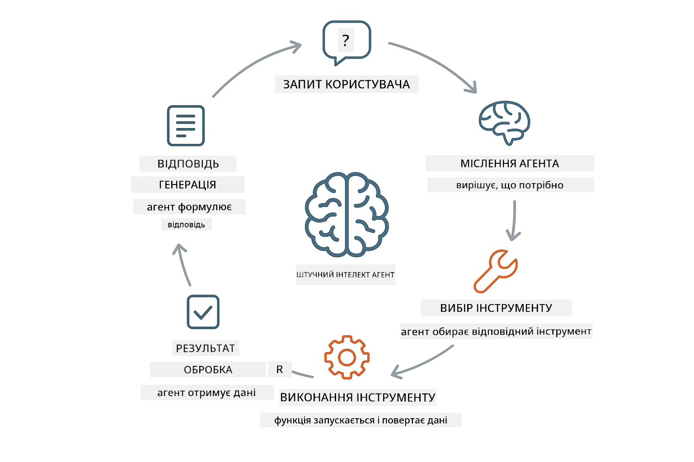
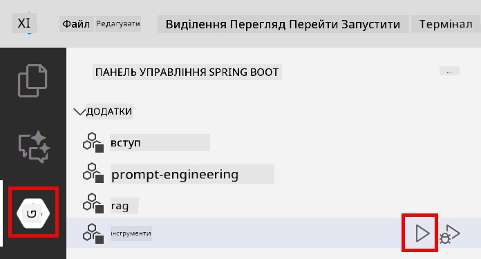

<!--
CO_OP_TRANSLATOR_METADATA:
{
  "original_hash": "13ec450c12cdd1a863baa2b778f27cd7",
  "translation_date": "2025-12-31T06:24:12+00:00",
  "source_file": "04-tools/README.md",
  "language_code": "uk"
}
-->
# Module 04: ШІ-агенти з інструментами

## Зміст

- [Що ви дізнаєтеся](../../../04-tools)
- [Передумови](../../../04-tools)
- [Розуміння ШІ-агентів з інструментами](../../../04-tools)
- [Як працює виклик інструментів](../../../04-tools)
  - [Визначення інструментів](../../../04-tools)
  - [Прийняття рішень](../../../04-tools)
  - [Виконання](../../../04-tools)
  - [Генерація відповіді](../../../04-tools)
- [Ланцюжок інструментів](../../../04-tools)
- [Запуск застосунку](../../../04-tools)
- [Використання застосунку](../../../04-tools)
  - [Спробуйте просте використання інструменту](../../../04-tools)
  - [Перевірте ланцюжок інструментів](../../../04-tools)
  - [Переглянути хід розмови](../../../04-tools)
  - [Спостерігайте за міркуванням](../../../04-tools)
  - [Експериментуйте з різними запитами](../../../04-tools)
- [Ключові поняття](../../../04-tools)
  - [Патерн ReAct (міркування й дія)](../../../04-tools)
  - [Опис інструментів має значення](../../../04-tools)
  - [Управління сесіями](../../../04-tools)
  - [Обробка помилок](../../../04-tools)
- [Доступні інструменти](../../../04-tools)
- [Коли використовувати агентів із інструментами](../../../04-tools)
- [Наступні кроки](../../../04-tools)

## Що ви дізнаєтеся

Поки що ви дізналися, як вести розмови зі ШІ, ефективно будувати підказки та прив'язувати відповіді до ваших документів. Але залишається фундаментальне обмеження: мовні моделі можуть лише генерувати текст. Вони не можуть перевіряти погоду, виконувати обчислення, запитувати бази даних або взаємодіяти з зовнішніми системами.

Інструменти це змінюють. Даючи моделі доступ до функцій, які вона може викликати, ви перетворюєте її з генератора тексту на агента, який може виконувати дії. Модель вирішує, коли їй потрібен інструмент, який інструмент використовувати і які параметри передати. Ваш код виконує функцію і повертає результат. Модель включає цей результат у свою відповідь.

## Передумови

- Завершено Модуль 01 (розгорнуті ресурси Azure OpenAI)
- Файл `.env` у кореневій директорії з обліковими даними Azure (створений за допомогою `azd up` у Модулі 01)

> **Примітка:** Якщо ви не завершили Модуль 01, спочатку виконайте інструкції з розгортання там.

## Розуміння ШІ-агентів з інструментами

> **📝 Примітка:** Термін "агенти" у цьому модулі відноситься до ШІ-асистентів з можливістю виклику інструментів. Це відрізняється від патернів **Agentic AI** (автономні агенти з плануванням, пам'яттю та багатокроковим міркуванням), які ми розглянемо в [Module 05: MCP](../05-mcp/README.md).

ШІ-агент з інструментами слідує патерну міркування й дії (ReAct):

1. Користувач задає питання
2. Агент міркує про те, що йому потрібно знати
3. Агент вирішує, чи потребує він інструменту для відповіді
4. Якщо так, агент викликає відповідний інструмент з правильними параметрами
5. Інструмент виконується і повертає дані
6. Агент враховує результат і надає остаточну відповідь



*Патерн ReAct - як ШІ-агенти чергують міркування і дії, щоб вирішувати задачі*

Це відбувається автоматично. Ви визначаєте інструменти та їхні описи. Модель бере на себе прийняття рішень про те, коли і як їх використовувати.

## Як працює виклик інструментів

**Визначення інструментів** - [WeatherTool.java](../../../04-tools/src/main/java/com/example/langchain4j/agents/tools/WeatherTool.java) | [TemperatureTool.java](../../../04-tools/src/main/java/com/example/langchain4j/agents/tools/TemperatureTool.java)

Ви визначаєте функції з чіткими описами та специфікаціями параметрів. Модель бачить ці описи у своєму системному підказі і розуміє, що робить кожний інструмент.

```java
@Component
public class WeatherTool {
    
    @Tool("Get the current weather for a location")
    public String getCurrentWeather(@P("Location name") String location) {
        // Ваша логіка пошуку погоди
        return "Weather in " + location + ": 22°C, cloudy";
    }
}

@AiService
public interface Assistant {
    String chat(@MemoryId String sessionId, @UserMessage String message);
}

// Асистент автоматично налаштований Spring Boot з такими компонентами:
// - бін ChatModel
// - Усі методи @Tool з класів @Component
// - ChatMemoryProvider для керування сесіями
```

> **🤖 Спробуйте з [GitHub Copilot](https://github.com/features/copilot) Chat:** Відкрийте [`WeatherTool.java`](../../../04-tools/src/main/java/com/example/langchain4j/agents/tools/WeatherTool.java) і запитайте:
> - "Як я інтегрував би реальне погодне API, наприклад OpenWeatherMap, замість мокованих даних?"
> - "Що робить хороший опис інструменту, який допомагає ШІ використовувати його правильно?"
> - "Як мені обробляти помилки API та обмеження швидкості у реалізації інструментів?"

**Прийняття рішень**

Коли користувач запитує "Яка погода в Сіетлі?", модель розпізнає, що їй потрібен інструмент погоди. Вона генерує виклик функції з параметром location, встановленим в "Seattle".

**Виконання** - [AgentService.java](../../../04-tools/src/main/java/com/example/langchain4j/agents/service/AgentService.java)

Spring Boot автоматично впроваджує декларативний інтерфейс `@AiService` зі всіма зареєстрованими інструментами, і LangChain4j виконує виклики інструментів автоматично.

> **🤖 Спробуйте з [GitHub Copilot](https://github.com/features/copilot) Chat:** Відкрийте [`AgentService.java`](../../../04-tools/src/main/java/com/example/langchain4j/agents/service/AgentService.java) і запитайте:
> - "Як працює патерн ReAct і чому він ефективний для ШІ-агентів?"
> - "Як агент вирішує, який інструмент використовувати і в якому порядку?"
> - "Що станеться, якщо виконання інструменту зазнає невдачі - як слід надійно обробляти помилки?"

**Генерація відповіді**

Модель отримує дані про погоду і форматутє їх у природномовну відповідь для користувача.

### Чому варто використовувати декларативні Ai-сервіси?

У цьому модулі використовується інтеграція LangChain4j зі Spring Boot через декларативні інтерфейси `@AiService`:

- **Spring Boot auto-wiring** - ChatModel та інструменти автоматично впроваджуються
- **@MemoryId патерн** - Автоматичне управління пам'яттю на основі сесій
- **Один екземпляр** - Асистент створюється один раз і повторно використовується для кращої продуктивності
- **Типобезпечне виконання** - Викликаються Java-методи безпосередньо з конверсією типів
- **Оркестрація багатоходових запитів** - Автоматично обробляє ланцюжки викликів інструментів
- **Мінімум шаблонного коду** - Жодних ручних викликів AiServices.builder() або HashMap для пам'яті

Альтернативні підходи (ручний `AiServices.builder()`) вимагають більше коду і втрачають переваги інтеграції зі Spring Boot.

## Ланцюжок інструментів

**Ланцюжок інструментів** - ШІ може викликати кілька інструментів підряд. Запитайте "Яка погода в Сіетлі і чи слід брати парасольку?" і спостерігайте, як він поєднає `getCurrentWeather` з міркуванням про дощ.

<a href="images/tool-chaining.png"></a>

*Послідовні виклики інструментів - вихід одного інструменту підживлює наступне рішення*

**Коректні відмови** - Запитайте погоду в місті, якого немає в мокованих даних. Інструмент поверне повідомлення про помилку, і ШІ пояснить, що не може допомогти. Інструменти безпечно зазнають невдач.

Це відбувається в одному ході розмови. Агент автономно оркеструє кілька викликів інструментів.

## Запуск застосунку

**Перевірте розгортання:**

Переконайтеся, що файл `.env` існує в кореневій директорії з обліковими даними Azure (створений під час Модуля 01):
```bash
cat ../.env  # Потрібно показати AZURE_OPENAI_ENDPOINT, API_KEY, DEPLOYMENT
```

**Запустіть застосунок:**

> **Примітка:** Якщо ви вже запускали всі застосунки за допомогою `./start-all.sh` з Модуля 01, цей модуль вже працює на порту 8084. Ви можете пропустити команди запуску нижче і перейти безпосередньо за адресою http://localhost:8084.

**Option 1: Using Spring Boot Dashboard (Recommended for VS Code users)**

Контейнер розробника містить розширення Spring Boot Dashboard, яке надає візуальний інтерфейс для керування всіма Spring Boot застосунками. Ви знайдете його на панелі дій зліва у VS Code (шукайте іконку Spring Boot).

З Spring Boot Dashboard ви можете:
- Бачити всі доступні Spring Boot застосунки у робочому просторі
- Запускати/зупиняти застосунки одним клацанням
- Переглядати логи застосунку в реальному часі
- Моніторити стан застосунку

Просто натисніть кнопку відтворення поруч із "tools", щоб запустити цей модуль, або запустіть усі модулі одночасно.



**Option 2: Using shell scripts**

Запустіть усі web-застосунки (модулі 01-04):

**Bash:**
```bash
cd ..  # З кореневого каталогу
./start-all.sh
```

**PowerShell:**
```powershell
cd ..  # З кореневого каталогу
.\start-all.ps1
```

Або запустіть лише цей модуль:

**Bash:**
```bash
cd 04-tools
./start.sh
```

**PowerShell:**
```powershell
cd 04-tools
.\start.ps1
```

Обидва скрипти автоматично завантажують змінні середовища з кореневого файлу `.env` і збудують JAR-файли, якщо їх не існує.

> **Примітка:** Якщо ви віддаєте перевагу збирати всі модулі вручну перед запуском:
>
> **Bash:**
> ```bash
> cd ..  # Go to root directory
> mvn clean package -DskipTests
> ```
>
> **PowerShell:**
> ```powershell
> cd ..  # Go to root directory
> mvn clean package -DskipTests
> ```

Відкрийте http://localhost:8084 у вашому браузері.

**Щоб зупинити:**

**Bash:**
```bash
./stop.sh  # Тільки цей модуль
# Або
cd .. && ./stop-all.sh  # Всі модулі
```

**PowerShell:**
```powershell
.\stop.ps1  # Тільки цей модуль
# Або
cd ..; .\stop-all.ps1  # Усі модулі
```

## Використання застосунку

Застосунок надає веб-інтерфейс, де ви можете взаємодіяти зі ШІ-агентом, який має доступ до інструментів погоди та перетворення температур.

<a href="images/tools-homepage.png"></a>

*Інтерфейс інструментів ШІ-агента - швидкі приклади та чат для взаємодії з інструментами*

**Спробуйте просте використання інструменту**

Почніть з простого запиту: "Перетворіть 100 градусів за Фаренгейтом у Цельсій". Агент визначить, що йому потрібен інструмент перетворення температур, викличе його з правильними параметрами і поверне результат. Зверніть увагу, наскільки природно це відчувається - вам не потрібно було вказувати, який інструмент використовувати або як його викликати.

**Перевірте ланцюжок інструментів**

Тепер спробуйте щось складніше: "Яка погода в Сіетлі і переведіть її у Фаренгейти?" Спостерігайте, як агент виконає це по кроках. Він спочатку отримає погоду (яка повертається в Цельсіях), потім зрозуміє, що потрібно перетворити у Фаренгейти, викличе інструмент перетворення і об'єднає обидва результати в одній відповіді.

**Переглянути хід розмови**

Інтерфейс чату зберігає історію розмов, дозволяючи вести багатокрокову взаємодію. Ви можете бачити всі попередні запити та відповіді, що полегшує відстеження розмови і розуміння того, як агент будує контекст з кожним обміном.

<a href="images/tools-conversation-demo.png"></a>

*Багатокрокова розмова, що показує прості перетворення, пошуки погоди та ланцюжки викликів інструментів*

**Експериментуйте з різними запитами**

Спробуйте різні комбінації:
- Пошуки погоди: "Яка погода в Токіо?"
- Перетворення температур: "Скільки буде 25°C в Кельвінах?"
- Комбіновані запити: "Перевірте погоду в Парижі і скажіть, чи вона вище 20°C"

Зверніть увагу, як агент інтерпретує природну мову і співвідносить її з відповідними викликами інструментів.

## Ключові поняття

**Патерн ReAct (міркування й дія)**

Агент чергує міркування (вирішення, що робити) і дії (використання інструментів). Цей патерн дозволяє автономно розв'язувати задачі замість просто виконання інструкцій.

**Опис інструментів має значення**

Якість описів інструментів безпосередньо впливає на те, як добре агент їх використовує. Чіткі, конкретні описи допомагають моделі зрозуміти, коли і як викликати кожний інструмент.

**Управління сесіями**

Анотація `@MemoryId` забезпечує автоматичне управління пам'яттю на основі сесій. Кожен ідентифікатор сесії отримує власний екземпляр `ChatMemory`, яким керує bean `ChatMemoryProvider`, що усуває потребу в ручному відстеженні пам'яті.

**Обробка помилок**

Інструменти можуть зазнати невдачі — API таймаутять, параметри можуть бути недійсними, зовнішні сервіси можуть відмовити. У виробничих агентах потрібна обробка помилок, щоб модель могла пояснювати проблеми або спробувати альтернативи.

## Доступні інструменти

**Інструменти погоди** (моковані дані для демонстрації):
- Отримати поточну погоду для локації
- Отримати багатоденний прогноз

**Інструменти перетворення температур:**
- Цельсій у Фаренгейт
- Фаренгейт у Цельсій
- Цельсій у Кельвін
- Кельвін у Цельсій
- Фаренгейт у Кельвін
- Кельвін у Фаренгейт

Це прості приклади, але патерн поширюється на будь-яку функцію: запити до баз даних, виклики API, обчислення, операції з файлами або системні команди.

## Коли використовувати агентів із інструментами

**Використовуйте інструменти коли:**
- Відповідь вимагає даних у реальному часі (погода, ціни акцій, інвентар)
- Потрібно виконати обчислення складніше за просту математику
- Доступ до баз даних або API
- Виконання дій (відправка електронних листів, створення тікетів, оновлення записів)
- Комбінування кількох джерел даних

**Не використовуйте інструменти коли:**
- Питання можна відповісти на основі загальних знань
- Відповідь є суто розмовною
- Затримка інструментів зробить досвід занадто повільним

## Наступні кроки

**Next Module:** [05-mcp - Model Context Protocol (MCP)](../05-mcp/README.md)

---

**Навігація:** [← Попередній: Модуль 03 - RAG](../03-rag/README.md) | [Назад до головної](../README.md) | [Далі: Модуль 05 - MCP →](../05-mcp/README.md)

---

<!-- CO-OP TRANSLATOR DISCLAIMER START -->
Відмова від відповідальності:
Цей документ був перекладений за допомогою сервісу перекладу на основі ШІ Co-op Translator (https://github.com/Azure/co-op-translator). Хоча ми прагнемо до точності, зверніть увагу, що автоматичні переклади можуть містити помилки або неточності. Оригінальний документ мовою оригіналу слід вважати авторитетним джерелом. Для критичної інформації рекомендується скористатися професійним людським перекладом. Ми не несемо відповідальності за будь-які непорозуміння або неправильні тлумачення, що виникли внаслідок використання цього перекладу.
<!-- CO-OP TRANSLATOR DISCLAIMER END -->