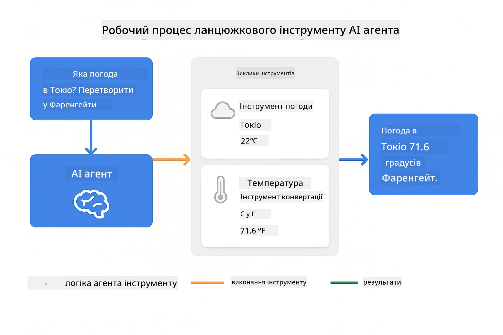
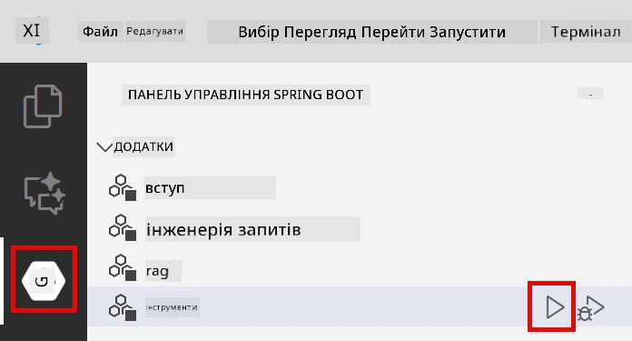
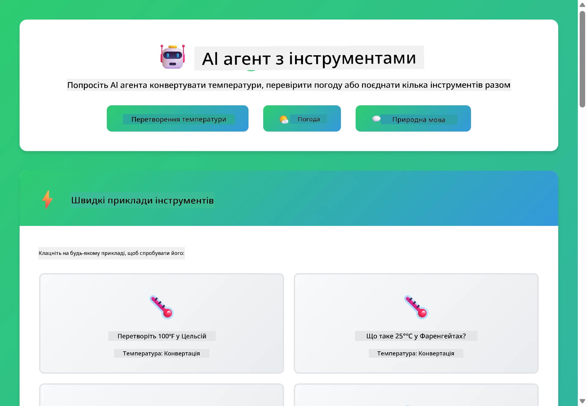

# Модуль 04: AI Агенти з Інструментами

## Зміст

- [Чого Ви Навчитесь](../../../04-tools)
- [Вимоги](../../../04-tools)
- [Розуміння AI Аґентів з Інструментами](../../../04-tools)
- [Як Працює Виклик Інструментів](../../../04-tools)
  - [Визначення Інструментів](../../../04-tools)
  - [Прийняття Рішень](../../../04-tools)
  - [Виконання](../../../04-tools)
  - [Генерація Відповіді](../../../04-tools)
- [Послідовне Використання Інструментів](../../../04-tools)
- [Запуск Додатку](../../../04-tools)
- [Використання Додатку](../../../04-tools)
  - [Спробуйте Просте Використання Інструменту](../../../04-tools)
  - [Перевірте Послідовне Використання Інструментів](../../../04-tools)
  - [Перегляньте Потік Розмови](../../../04-tools)
  - [Експериментуйте з Різними Запитами](../../../04-tools)
- [Ключові Концепції](../../../04-tools)
  - [Паттерн ReAct (Міркування та Дія)](../../../04-tools)
  - [Опис Інструментів Має Значення](../../../04-tools)
  - [Управління Сесією](../../../04-tools)
  - [Обробка Помилок](../../../04-tools)
- [Доступні Інструменти](../../../04-tools)
- [Коли Використовувати Агенти на Основі Інструментів](../../../04-tools)
- [Наступні Кроки](../../../04-tools)

## Чого Ви Навчитесь

До цього часу ви навчились вести розмови з AI, ефективно структурувати підказки і підкріплювати відповіді вашими документами. Але існує фундаментальне обмеження: мовні моделі можуть генерувати лише текст. Вони не можуть перевірити погоду, виконувати обчислення, робити запити до баз даних або взаємодіяти з зовнішніми системами.

Інструменти змінюють це. Надаючи моделі доступ до функцій, які вона може викликати, ви перетворюєте її з генератора тексту на агента, що може здійснювати дії. Модель вирішує, коли їй потрібен інструмент, який інструмент використовувати та які параметри передати. Ваш код виконує функцію і повертає результат. Модель включає цей результат у свою відповідь.

## Вимоги

- Завершений Модуль 01 (розгорнуті ресурси Azure OpenAI)
- Файл `.env` у кореневій директорії з обліковими даними Azure (створений `azd up` у Модулі 01)

> **Примітка:** Якщо ви не завершили Модуль 01, спершу виконайте інструкції з розгортання там.

## Розуміння AI Аґентів з Інструментами

> **📝 Примітка:** Терміни "агенти" у цьому модулі відносяться до AI асистентів, розширених можливістю виклику інструментів. Це відрізняється від паттернів **Agentic AI** (автономні агенти з плануванням, пам’яттю та багатокроковим міркуванням), які ми розглянемо у [Модулі 05: MCP](../05-mcp/README.md).

AI агент з інструментами дотримується паттерну міркування та дії (ReAct):

1. Користувач ставить запитання
2. Агент аналізує, що йому потрібно дізнатись
3. Агент вирішує, чи потрібен інструмент для відповіді
4. Якщо так, агент викликає відповідний інструмент із правильними параметрами
5. Інструмент виконується і повертає дані
6. Агент враховує результат і надає остаточну відповідь


*Паттерн ReAct – як AI агенти чергуються між міркуванням та дією для розв’язання проблем*

Це відбувається автоматично. Ви визначаєте інструменти та їх описи. Модель приймає рішення, коли і як їх використовувати.

## Як Працює Виклик Інструментів

### Визначення Інструментів

[WeatherTool.java](../../../04-tools/src/main/java/com/example/langchain4j/agents/tools/WeatherTool.java) | [TemperatureTool.java](../../../04-tools/src/main/java/com/example/langchain4j/agents/tools/TemperatureTool.java)

Ви визначаєте функції з чіткими описами та специфікаціями параметрів. Модель бачить ці описи у системному підказі та розуміє, що робить кожен інструмент.

```java
@Component
public class WeatherTool {
    
    @Tool("Get the current weather for a location")
    public String getCurrentWeather(@P("Location name") String location) {
        // Ваша логіка пошуку погоди
        return "Weather in " + location + ": 22°C, cloudy";
    }
}

@AiService
public interface Assistant {
    String chat(@MemoryId String sessionId, @UserMessage String message);
}

// Асистент автоматично підключений Spring Boot з:
// - bean ChatModel
// - Усі методи @Tool з класів @Component
// - ChatMemoryProvider для керування сесіями
```

> **🤖 Спробуйте з [GitHub Copilot](https://github.com/features/copilot) Chat:** Відкрийте [`WeatherTool.java`](../../../04-tools/src/main/java/com/example/langchain4j/agents/tools/WeatherTool.java) і запитайте:
> - "Як інтегрувати реальний weather API, наприклад OpenWeatherMap, замість мокових даних?"
> - "Що робить опис інструменту хорошим, щоб допомогти AI правильно його використовувати?"
> - "Як обробляти помилки API та обмеження швидкості у реалізації інструментів?"

### Прийняття Рішень

Коли користувач запитує "Яка погода в Сіетлі?", модель розуміє, що потрібен інструмент погоди. Вона генерує виклик функції з параметром локації "Seattle".

### Виконання

[AgentService.java](../../../04-tools/src/main/java/com/example/langchain4j/agents/service/AgentService.java)

Spring Boot автоматично підключає декларативний інтерфейс `@AiService` з усіма зареєстрованими інструментами, а LangChain4j виконує виклики інструментів автоматично.

> **🤖 Спробуйте з [GitHub Copilot](https://github.com/features/copilot) Chat:** Відкрийте [`AgentService.java`](../../../04-tools/src/main/java/com/example/langchain4j/agents/service/AgentService.java) і запитайте:
> - "Як працює паттерн ReAct і чому він ефективний для AI агентів?"
> - "Як агент вирішує, який інструмент використовувати і в якому порядку?"
> - "Що трапляється, якщо виконання інструменту не вдається – як надійно обробляти помилки?"

### Генерація Відповіді

Модель отримує дані про погоду і форматує їх у природну відповідь для користувача.

### Чому Використовувати Декларативні AI Сервіси?

Цей модуль використовує інтеграцію LangChain4j з Spring Boot через декларативні інтерфейси `@AiService`:

- **Автоматичне підключення Spring Boot** — ChatModel і інструменти автоматично інжектуються
- **Паттерн @MemoryId** — Автоматичне управління пам’яттю на основі сесій
- **Один екземпляр** — Асистент створюється один раз і повторно використовується для кращої продуктивності
- **Типобезпечне виконання** — Java методи викликаються безпосередньо з конвертацією типів
- **Оркестрація багатьох ходів** — Автоматично керує послідовністю викликів інструментів
- **Відсутність шаблонного коду** — Без ручних викликів AiServices.builder() або HashMap пам’яті

Альтернативні підходи (ручне `AiServices.builder()`) вимагають більше коду та не мають переваг інтеграції зі Spring Boot.

## Послідовне Використання Інструментів

**Послідовне Використання –** AI може викликати декілька інструментів підряд. Запитайте "Яка погода в Сіетлі і чи варто брати з собою парасолю?" і спостерігайте, як він поєднує `getCurrentWeather` з міркуваннями про дощове спорядження.

<a href="images/tool-chaining.png"></a>

*Послідовні виклики інструментів – вихід одного інструменту стає вхідними даними для наступного рішення*

**Граціозні Збої** – Запитайте погоду в місті, якого немає в мокових даних. Інструмент поверне повідомлення про помилку, а AI пояснить, що не може допомогти. Інструменти відмовляють безпечно.

Це відбувається в одному ході розмови. Агент автономно координує декілька викликів інструментів.

## Запуск Додатку

**Перевірте розгортання:**

Переконайтесь, що файл `.env` існує у кореневій директорії з обліковими даними Azure (створений під час Модуля 01):
```bash
cat ../.env  # Має відображати AZURE_OPENAI_ENDPOINT, API_KEY, DEPLOYMENT
```

**Запустіть додаток:**

> **Примітка:** Якщо ви вже запускали всі додатки за допомогою `./start-all.sh` з Модуля 01, цей модуль уже працює на порту 8084. Можна пропустити команди запуску нижче і одразу перейти до http://localhost:8084.

**Варіант 1: Використання Spring Boot Dashboard (Рекомендується для користувачів VS Code)**

Dev container включає розширення Spring Boot Dashboard, яке дає візуальний інтерфейс для керування усіма Spring Boot додатками. Ви знайдете його у Activity Bar зліва у VS Code (шукайте іконку Spring Boot).

Через Spring Boot Dashboard можна:
- Переглядати всі доступні Spring Boot додатки в робочому просторі
- Запускати/зупиняти додатки одним кліком
- Переглядати логи додатків у режимі реального часу
- Моніторити стан додатків

Просто клацніть кнопку запуску біля "tools" для запуску цього модуля або запустіть усі модулі одразу.



**Варіант 2: Використання shell скриптів**

Запустіть усі веб-додатки (модулі 01-04):

**Bash:**
```bash
cd ..  # З кореневого каталогу
./start-all.sh
```

**PowerShell:**
```powershell
cd ..  # З кореневої директорії
.\start-all.ps1
```

Або запустіть лише цей модуль:

**Bash:**
```bash
cd 04-tools
./start.sh
```

**PowerShell:**
```powershell
cd 04-tools
.\start.ps1
```

Обидва скрипти автоматично завантажують змінні середовища з кореневого `.env` файлу та збудують JAR-файли, якщо вони відсутні.

> **Примітка:** Якщо бажаєте будувати всі модулі вручну перед запуском:
>
> **Bash:**
> ```bash
> cd ..  # Go to root directory
> mvn clean package -DskipTests
> ```
>
> **PowerShell:**
> ```powershell
> cd ..  # Go to root directory
> mvn clean package -DskipTests
> ```

Відкрийте http://localhost:8084 у браузері.

**Щоб зупинити:**

**Bash:**
```bash
./stop.sh  # Тільки цей модуль
# Або
cd .. && ./stop-all.sh  # Всі модулі
```

**PowerShell:**
```powershell
.\stop.ps1  # Лише цей модуль
# Або
cd ..; .\stop-all.ps1  # Всі модулі
```

## Використання Додатку

Додаток надає веб-інтерфейс, де ви можете взаємодіяти з AI агентом, який має доступ до інструментів погоди та конвертації температур.

<a href="images/tools-homepage.png"></a>

*Інтерфейс AI Агент Інструментів – швидкі приклади та чат для взаємодії з інструментами*

### Спробуйте Просте Використання Інструменту

Почніть з простого запиту: "Конвертуй 100 градусів Фаренгейта у Цельсій". Агент розуміє, що потрібен інструмент конвертації температур, викликає його з правильними параметрами і повертає результат. Зверніть увагу, як природно це відбувається – ви не вказували, який інструмент використовувати чи як його викликати.

### Перевірте Послідовне Використання Інструментів

Тепер спробуйте складніший запит: "Яка погода в Сіетлі і конвертуй її у Фаренгейт?" Спостерігайте, як агент працює крок за кроком. Спершу отримує погоду (яка повертає в Цельсіях), визнає, що потрібно конвертувати у Фаренгейт, викликає інструмент конвертації і об’єднує обидва результати в одну відповідь.

### Перегляньте Потік Розмови

Чат інтерфейс зберігає історію розмови, дозволяючи вести багатохідні взаємодії. Ви бачите всі попередні запити та відповіді, що полегшує відстеження розмови і розуміння, як агент будує контекст через кілька обмінів.

<a href="images/tools-conversation-demo.png"></a>

*Багатохідна розмова, що показує прості конвертації, пошуки погоди та послідовне використання інструментів*

### Експериментуйте з Різними Запитами

Спробуйте різні комбінації:
- Запити погоди: "Яка погода в Токіо?"
- Конвертації температур: "Скільки буде 25°C в Кельвінах?"
- Комбіновані запити: "Перевір погоду в Парижі і скажи, чи температура вище 20°C"

Зверніть увагу, як агент інтерпретує природну мову і перетворює її на правильні виклики інструментів.

## Ключові Концепції

### Паттерн ReAct (Міркування та Дія)

Агент чергується між міркуванням (вирішення, що робити) та дією (використання інструментів). Цей паттерн дозволяє автономно розв’язувати проблеми, а не просто виконувати інструкції.

### Опис Інструментів Має Значення

Якість описів інструментів безпосередньо впливає на те, наскільки добре агент їх використовує. Чіткі, конкретні описи допомагають моделі розуміти, коли і як викликати кожен інструмент.

### Управління Сесією

Анотація `@MemoryId` дозволяє автоматично управляти пам’яттю на основі сесій. Кожен ідентифікатор сесії отримує власний екземпляр `ChatMemory`, яким керує бін `ChatMemoryProvider`, що усуває потребу вручну відслідковувати пам’ять.

### Обробка Помилок

Інструменти можуть не працювати — API може тайм-аутитись, параметри можуть бути невірними, зовнішні сервіси мають збої. Продакшн-агенти потребують обробки помилок, щоб модель могла пояснити проблему або спробувати альтернативи.

## Доступні Інструменти

**Інструменти Погоди** (мокові дані для демонстрації):
- Отримати поточну погоду для локації
- Отримати прогноз на кілька днів

**Інструменти Конвертації Температур:**
- Цельсій у Фаренгейт
- Фаренгейт у Цельсій
- Цельсій у Кельвін
- Кельвін у Цельсій
- Фаренгейт у Кельвін
- Кельвін у Фаренгейт

Це прості приклади, але паттерн розширюється на будь-які функції: запити до баз даних, виклики API, обчислення, файлові операції або системні команди.

## Коли Використовувати Агенти на Основі Інструментів

**Використовуйте інструменти, коли:**
- Відповідь потребує актуальних даних (погода, ціни на акції, запаси)
- Потрібно виконати обчислення складніші за просту математику
- Необхідно звертатись до баз даних або API
- Потрібно здійснювати дії (надсилати листи, створювати задачі, оновлювати записи)
- Поєднуються кілька джерел даних

**Не використовуйте інструменти, коли:**
- Запит можна відповісти на основі загальних знань
- Відповідь чисто розмовна
- Затримка інструментів зробить досвід надто повільним

## Наступні Кроки

**Наступний Модуль:** [05-mcp - Протокол Контексту Моделі (MCP)](../05-mcp/README.md)

---

**Навігація:** [← Попередній: Модуль 03 - RAG](../03-rag/README.md) | [Назад до Головної](../README.md) | [Наступний: Модуль 05 - MCP →](../05-mcp/README.md)

---

<!-- CO-OP TRANSLATOR DISCLAIMER START -->
**Застереження**:
Цей документ було перекладено за допомогою сервісу автоматичного перекладу [Co-op Translator](https://github.com/Azure/co-op-translator). Хоча ми прагнемо до точності, зверніть увагу, що автоматичні переклади можуть містити помилки або неточності. Оригінальний документ рідною мовою слід вважати авторитетним джерелом. Для критичної інформації рекомендується звертатися до професійного людського перекладача. Ми не несемо відповідальності за будь-які непорозуміння або неправильні тлумачення, що виникли внаслідок використання цього перекладу.
<!-- CO-OP TRANSLATOR DISCLAIMER END -->