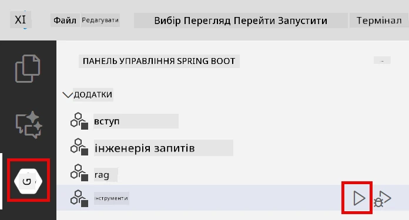
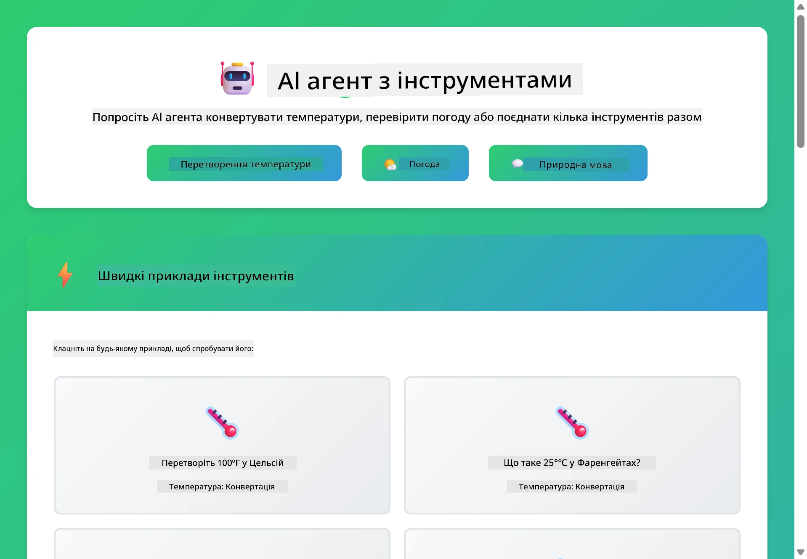
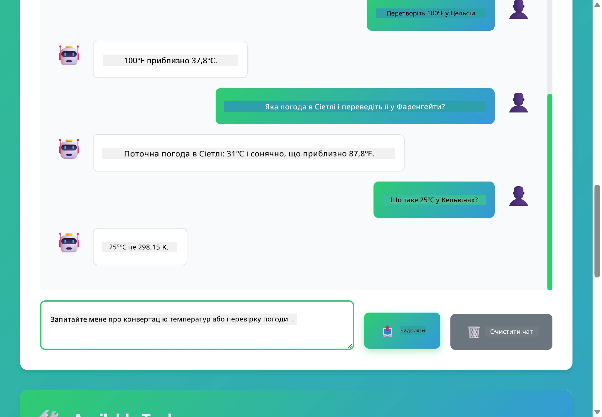

# Модуль 04: AI-агенти з інструментами

## Зміст

- [Огляд відео](#огляд-відео)
- [Чого ви навчитесь](#чого-ви-навчитесь)
- [Вимоги](#вимоги)
- [Розуміння AI-агентів з інструментами](#розуміння-ai-агентів-з-інструментами)
- [Як працює виклик інструментів](#як-працює-виклик-інструментів)
  - [Визначення інструментів](#визначення-інструментів)
  - [Прийняття рішень](#прийняття-рішень)
  - [Виконання](#виконання)
  - [Генерація відповіді](#генерація-відповіді)
  - [Архітектура: Spring Boot Auto-Wiring](#архітектура-spring-boot-auto-wiring)
- [Ланцюжок інструментів](#ланцюжок-інструментів)
- [Запустіть додаток](#запустіть-додаток)
- [Використання додатку](#використання-додатку)
  - [Спробуйте просте використання інструментів](#спробуйте-просте-використання-інструменту)
  - [Перевірте ланцюжок інструментів](#тестуйте-ланцюжок-інструментів)
  - [Перегляньте хід розмови](#перегляньте-хід-розмови)
  - [Експериментуйте з різними запитами](#експериментуйте-з-різними-запитами)
- [Ключові концепції](#ключові-концепції)
  - [Шаблон ReAct (міркування та дія)](#патерн-react-обґрунтування-та-дія)
  - [Важливість описів інструментів](#важливість-описів-інструментів)
  - [Управління сесіями](#керування-сесією)
  - [Обробка помилок](#обробка-помилок)
- [Доступні інструменти](#доступні-інструменти)
- [Коли використовувати агентів на основі інструментів](#коли-використовувати-агентів-на-основі-інструментів)
- [Інструменти vs RAG](#інструменти-проти-rag)
- [Наступні кроки](#наступні-кроки)

## Огляд відео

Дивіться цю живу сесію, яка пояснює, як почати роботу з цим модулем:

<a href="https://www.youtube.com/watch?v=O_J30kZc0rw"></a>

## Чого ви навчитесь

На даний момент ви навчилися вести розмови з AI, ефективно структурувати підказки та базувати відповіді на ваших документах. Але існує фундаментальне обмеження: мовні моделі можуть лише генерувати текст. Вони не можуть перевірити погоду, виконати розрахунки, робити запити до баз даних або взаємодіяти з зовнішніми системами.

Інструменти змінюють це. Надаючи моделі доступ до функцій, які вона може викликати, ви перетворюєте її з генератора тексту в агента, що може виконувати дії. Модель вирішує, коли їй потрібен інструмент, який саме інструмент використати і які параметри передати. Ваш код виконує функцію та повертає результат. Модель інтегрує цей результат у свою відповідь.

## Вимоги

- Завершений [Модуль 01 - Вступ](../01-introduction/README.md) (розгорнуті ресурси Azure OpenAI)
- Рекомендуються попередні модулі (цей модуль посилається на [концепції RAG з Модуля 03](../03-rag/README.md) у порівнянні Інструменти vs RAG)
- Файл `.env` у кореневій директорії з обліковими даними Azure (створений командою `azd up` у Модулі 01)

> **Примітка:** Якщо ви не завершили Модуль 01, спочатку дотримуйтесь інструкцій з розгортання там.

## Розуміння AI-агентів з інструментами

> **📝 Примітка:** Термін "агенти" у цьому модулі означає AI-помічників з можливістю виклику інструментів. Це відрізняється від патернів **Agentic AI** (автономні агенти з плануванням, пам’яттю та багатокроковим розмірковуванням), які ми розглянемо у [Модулі 05: MCP](../05-mcp/README.md).

Без інструментів мовна модель може лише генерувати текст з навчальних даних. Запитайте про поточну погоду — і вона мусить гадати. Дайте їй інструменти — і вона може викликати API погоди, виконати розрахунки або запитати базу даних — та включити ці реальні результати у відповідь.


*Без інструментів модель лише здогадується — з інструментами вона може викликати API, виконувати розрахунки і повертати дані в реальному часі.*

AI-агент з інструментами дотримується патерну **Reasoning and Acting (ReAct)**. Модель не просто відповідає — вона думає, що їй потрібно, діє, викликаючи інструмент, спостерігає результат, а потім вирішує, чи треба діяти знову, чи надати остаточну відповідь:

1. **Розмірковування** — агент аналізує запит користувача і визначає, яку інформацію потрібно отримати
2. **Дія** — агент вибирає відповідний інструмент, генерує правильні параметри і викликає його
3. **Спостереження** — агент отримує результат роботи інструмента і оцінює його
4. **Повторення або відповідь** — якщо потрібні додаткові дані, агент повертається до кроку 1; інакше формує відповідь природною мовою


*Цикл ReAct — агент розмірковує, що зробити, виконує виклик інструмента, спостерігає за результатом і повторює, доки не сформує остаточну відповідь.*

Це відбувається автоматично. Ви визначаєте інструменти та їх описи. Модель приймає рішення, коли і як їх використовувати.

## Як працює виклик інструментів

### Визначення інструментів

[WeatherTool.java](../../../04-tools/src/main/java/com/example/langchain4j/agents/tools/WeatherTool.java) | [TemperatureTool.java](../../../04-tools/src/main/java/com/example/langchain4j/agents/tools/TemperatureTool.java)

Ви визначаєте функції з чіткими описами та специфікаціями параметрів. Модель бачить ці описи у системній підказці і розуміє, що робить кожен інструмент.

```java
@Component
public class WeatherTool {
    
    @Tool("Get the current weather for a location")
    public String getCurrentWeather(@P("Location name") String location) {
        // Ваша логіка пошуку погоди
        return "Weather in " + location + ": 22°C, cloudy";
    }
}

@AiService
public interface Assistant {
    String chat(@MemoryId String sessionId, @UserMessage String message);
}

// Асистент автоматично підключається через Spring Boot з:
// - Bean ChatModel
// - Всі методи @Tool з класів, позначених @Component
// - ChatMemoryProvider для управління сесіями
```

Нижче наведена діаграма розбиває кожну анотацію і показує, як кожен елемент допомагає AI зрозуміти, коли викликати інструмент і які аргументи передавати:


*Анатомія визначення інструмента — @Tool повідомляє AI, коли його використовувати, @P описує кожен параметр, а @AiService об’єднує все разом при запуску.*

> **🤖 Спробуйте з [GitHub Copilot](https://github.com/features/copilot) Chat:** Відкрийте [`WeatherTool.java`](../../../04-tools/src/main/java/com/example/langchain4j/agents/tools/WeatherTool.java) і запитайте:
> - "Як інтегрувати реальний погодний API, наприклад OpenWeatherMap, замість мок-даних?"
> - "Що робить опис інструмента корисним для правильного використання AI?"
> - "Як обробляти помилки API та обмеження за кількістю викликів у реалізації інструментів?"

### Прийняття рішень

Коли користувач питає "Яка погода в Сіетлі?", модель не вибирає інструмент випадково. Вона порівнює намір користувача з описами всіх доступних інструментів, оцінює кожен за релевантністю і вибирає найкращий. Потім генерує структурований виклик функції з правильними параметрами — у цьому випадку `location` встановлюється в `"Seattle"`.

Якщо жоден інструмент не підходить під запит користувача, модель відповідає на основі власних знань. Якщо підходить кілька інструментів, вона обирає найбільш специфічний.


*Модель оцінює кожен доступний інструмент щодо наміру користувача та обирає найкращий варіант — тому важливо писати чіткі, конкретні описи інструментів.*

### Виконання

[AgentService.java](../../../04-tools/src/main/java/com/example/langchain4j/agents/service/AgentService.java)

Spring Boot автоматично під’єднує декларативний інтерфейс `@AiService` з усіма зареєстрованими інструментами, а LangChain4j виконує виклики інструментів автоматично. За лаштунками повний виклик інструменту проходить через шість етапів — від природномовного питання користувача і назад до природної відповіді:


*Повний цикл — користувач ставить питання, модель обирає інструмент, LangChain4j виконує його, а модель вплітає результат у відповідь природною мовою.*

За лаштунками `AiServices` запускає той самий цикл виклику інструменту для будь-якого інструменту — тут показано на прикладі простого `Calculator`. Послідовна діаграма нижче показує, що саме відбувається в процесі:


*Цикл виклику інструменту — `AiServices` надсилає повідомлення і схеми інструментів до LLM, LLM відповідає викликом функції на кшталт `add(42, 58)`, LangChain4j локально виконує метод `Calculator` і повертає результат для фінальної відповіді.*

> **🤖 Спробуйте з [GitHub Copilot](https://github.com/features/copilot) Chat:** Відкрийте [`AgentService.java`](../../../04-tools/src/main/java/com/example/langchain4j/agents/service/AgentService.java) і запитайте:
> - "Як працює патерн ReAct і чому він ефективний для AI-агентів?"
> - "Як агент вирішує, який інструмент використовувати і в якому порядку?"
> - "Що станеться, якщо виконання інструмента не вдалося — як надійно обробляти помилки?"

### Генерація відповіді

Модель отримує дані про погоду і форматує їх у природномовну відповідь для користувача.

### Архітектура: Spring Boot Auto-Wiring

Цей модуль використовує інтеграцію LangChain4j зі Spring Boot з декларативними інтерфейсами `@AiService`. При запуску Spring Boot знаходить кожен `@Component`, який містить методи з `@Tool`, ваш `ChatModel` bean і `ChatMemoryProvider` — потім об’єднує їх у єдиний інтерфейс `Assistant` без жодного шаблонного коду.


*Інтерфейс @AiService зв’язує ChatModel, компоненти інструментів і провайдера пам’яті — Spring Boot автоматично керує їх підключенням.*

Ось повний життєвий цикл запиту у вигляді послідовності — від HTTP-запиту через контролер, сервіс і автоматично підключений проксі аж до виконання інструменту і повернення:


*Повний життєвий цикл запиту в Spring Boot — HTTP-запит проходить через контролер і сервіс до проксі Assistant, який керує LLM і викликами інструментів автоматично.*

Основні переваги цього підходу:

- **Spring Boot auto-wiring** — ChatModel та інструменти автоматично підключаються
- **Патерн @MemoryId** — автоматичне керування пам’яттю на основі сесій
- **Один екземпляр** — Assistant створюється один раз і використовується повторно для кращої продуктивності
- **Безпечне виконання за типами** — Java-методи викликаються напряму з конвертацією типів
- **Багатокрокова оркестрація** — автоматично керує ланцюжком інструментів
- **Жодного шаблонного коду** — не потрібно вручну викликати `AiServices.builder()` або управляти HashMap пам’яті

Альтернативні підходи (ручний `AiServices.builder()`) вимагають більше коду і не дають переваг інтеграції зі Spring Boot.

## Ланцюжок інструментів

**Ланцюжок інструментів** — справжня сила агентів на основі інструментів проявляється, коли одне питання потребує кілька інструментів. Запитайте "Яка погода в Сіетлі за Фаренгейтом?", і агент автоматично об’єднає два інструменти: спочатку викликає `getCurrentWeather` для отримання температури у Цельсіях, потім передає це значення у `celsiusToFahrenheit` для конвертації — все в одному ходу розмови.


*Ланцюжок інструментів у дії — агент спершу викликає getCurrentWeather, потім передає результат у Цельсіях до celsiusToFahrenheit, і надає комбіновану відповідь.*

**Гармонійне оброблення помилок** — Запитайте погоду в місті, якого немає у мок-даних. Інструмент повертає повідомлення про помилку, і AI пояснює, що не може допомогти, замість того щоб аварійно завершитись. Інструменти не падають. Нижче діаграма порівнює два підходи — з коректною обробкою помилок агент ловить виняток і відповідає корисно, інакше весь додаток падає:


*Якщо інструмент не вдається, агент ловить помилку і відповідає з допоміжним поясненням замість аварії.*

Це відбувається за один хід розмови. Агент автономно оркеструє кілька викликів інструментів.

## Запустіть додаток

**Перевірка розгортання:**

Переконайтеся, що файл `.env` існує у кореневій директорії з обліковими даними Azure (створений у Модулі 01). Запустіть це з директорії модуля (`04-tools/`):

**Bash:**
```bash
cat ../.env  # Має показувати AZURE_OPENAI_ENDPOINT, API_KEY, DEPLOYMENT
```

**PowerShell:**
```powershell
Get-Content ..\.env  # Повинно відображати AZURE_OPENAI_ENDPOINT, API_KEY, DEPLOYMENT
```

**Запустіть додаток:**

> **Примітка:** Якщо ви вже запускали всі додатки за допомогою `./start-all.sh` з кореневої директорії (як описано у Модулі 01), цей модуль вже працює на порту 8084. Ви можете пропустити команди запуску нижче і перейти безпосередньо на http://localhost:8084.

**Опція 1: Використання Spring Boot Dashboard (Рекомендується для користувачів VS Code)**

Dev-контейнер включає розширення Spring Boot Dashboard, що надає візуальний інтерфейс для керування всіма Spring Boot додатками. Знайти його можна у панелі активності зліва у VS Code (значок Spring Boot).

За допомогою Spring Boot Dashboard ви можете:
- Переглядати всі доступні Spring Boot додатки у робочій області
- Запускати/зупиняти додатки одним кліком
- Переглядати логи додатків у реальному часі
- Моніторити статус додатків

Просто натисніть кнопку запуску поряд із "tools" для запуску цього модуля або запустіть усі модулі одночасно.

Ось як виглядає Spring Boot Dashboard у VS Code:


*Панель керування Spring Boot у VS Code — запуск, зупинка та моніторинг усіх модулів з одного місця*

**Варіант 2: Використання shell-скриптів**

Запустіть усі веб-додатки (модулі 01-04):

**Bash:**
```bash
cd ..  # З кореневого каталогу
./start-all.sh
```

**PowerShell:**
```powershell
cd ..  # З кореневого каталогу
.\start-all.ps1
```

Або запустіть лише цей модуль:

**Bash:**
```bash
cd 04-tools
./start.sh
```

**PowerShell:**
```powershell
cd 04-tools
.\start.ps1
```

Обидва скрипти автоматично завантажують змінні оточення з кореневого файлу `.env` та створять JAR-файли, якщо їх немає.

> **Примітка:** Якщо ви хочете зібрати всі модулі вручну перед запуском:
>
> **Bash:**
> ```bash
> cd ..  # Go to root directory
> mvn clean package -DskipTests
> ```
>
> **PowerShell:**
> ```powershell
> cd ..  # Go to root directory
> mvn clean package -DskipTests
> ```

Відкрийте у браузері http://localhost:8084.

**Щоб зупинити:**

**Bash:**
```bash
./stop.sh  # Тільки цей модуль
# Або
cd .. && ./stop-all.sh  # Всі модулі
```

**PowerShell:**
```powershell
.\stop.ps1  # Тільки цей модуль
# Або
cd ..; .\stop-all.ps1  # Всі модулі
```

## Використання додатку

Додаток надає веб-інтерфейс, де ви можете взаємодіяти з AI-агентом, який має доступ до інструментів погоди та конвертації температури. Ось як виглядає інтерфейс — він містить швидкі приклади запуску та панель чату для надсилання запитів:

<a href="images/tools-homepage.png"></a>

*Інтерфейс інструментів AI-агента - швидкі приклади та чат для взаємодії з інструментами*

### Спробуйте просте використання інструменту

Почніть з простого запиту: «Перетвори 100 градусів за Фаренгейтом у Цельсій». Агент розуміє, що потрібен інструмент конвертації температури, викликає його з правильними параметрами і повертає результат. Зверніть увагу, наскільки це природно — ви не вказували, який інструмент використовувати або як його викликати.

### Тестуйте ланцюжок інструментів

Тепер спробуйте щось складніше: «Яка погода у Сіетлі та перетвори її у Фаренгейт?» Спостерігайте, як агент виконує це поетапно. Спочатку він отримує погоду (у Цельсіях), розуміє, що потрібно конвертувати у Фаренгейт, викликає інструмент конвертації і об’єднує обидва результати в одну відповідь.

### Перегляньте хід розмови

Інтерфейс чату зберігає історію розмови, що дозволяє вести мультитурові взаємодії. Ви можете бачити всі попередні запити та відповіді, що полегшує відстеження бесіди і розуміння того, як агент будує контекст протягом кількох обмінів.

<a href="images/tools-conversation-demo.png"></a>

*Мультитурова розмова, що показує прості конвертації, пошук погоди та ланцюжок інструментів*

### Експериментуйте з різними запитами

Спробуйте різні варіанти:
- Пошук погоди: «Яка погода в Токіо?»
- Конвертація температур: «Що таке 25°C у Кельвінах?»
- Комбіновані запити: «Перевір погоду в Парижі та скажи, чи більше 20°C»

Зверніть увагу, як агент інтерпретує природну мову і переводить її у відповідні виклики інструментів.

## Ключові концепції

### Патерн ReAct (Обґрунтування та дія)

Агент чергує обґрунтування (вирішує, що робити) та дія (використання інструментів). Цей патерн дозволяє автономне розв’язання задач, а не просто відповідь на інструкції.

### Важливість описів інструментів

Якість описів інструментів безпосередньо впливає на те, наскільки добре агент їх використовує. Чіткі, конкретні описи допомагають моделі розуміти, коли і як викликати кожен інструмент.

### Керування сесією

Анотація `@MemoryId` дозволяє автоматичне керування пам’яттю на основі сесій. Кожне ID сесії отримує окремий екземпляр `ChatMemory`, який керується компонентом `ChatMemoryProvider`, отже кілька користувачів можуть спілкуватися з агентом одночасно, не змішуючи свої розмови. Наступна діаграма показує, як кілька користувачів спрямовуються до ізольованих сховищ пам’яті за ID сесій:


*Кожне ID сесії відповідає ізольованій історії розмов — користувачі ніколи не бачать повідомлення один одного.*

### Обробка помилок

Інструменти можуть давати збій — API можуть таймаутитися, параметри можуть бути недійсними, зовнішні сервіси можуть бути недоступні. Для продакшн-агентів потрібна обробка помилок, щоб модель могла пояснювати проблеми або шукати альтернативи замість краху всього додатку. Коли інструмент викидає виняток, LangChain4j ловить його та передає текст помилки назад моделі, яка тоді може пояснити проблему природною мовою.

## Доступні інструменти

Нижче наведена діаграма, що демонструє широку екосистему інструментів, які можна створити. Цей модуль показує інструменти для погоди і температури, але той самий патерн `@Tool` працює для будь-якого Java-методу — від запитів до баз даних до обробки платежів.


*Будь-який Java-метод із анотацією @Tool стає доступним AI — патерн розширюється до баз даних, API, електронної пошти, файлових операцій та іншого.*

## Коли використовувати агентів на основі інструментів

Не кожен запит потребує інструментів. Рішення залежить від того, чи потрібно AI взаємодіяти із зовнішніми системами або він може відповідати на основі власних знань. Наступний посібник узагальнює, коли інструменти приносять користь, а коли вони зайві:


*Швидкий посібник для рішень — інструменти потрібні для даних у реальному часі, обчислень та дій; загальні знання і творчі завдання не потребують їх.*

## Інструменти проти RAG

Модулі 03 і 04 розширюють можливості AI, але принципово по-різному. RAG надає моделі доступ до **знань** через вивантаження документів. Інструменти дають моделі можливість виконувати **дії** через виклики функцій. Діаграма нижче порівнює ці два підходи бок о бок — від того, як працює кожен робочий процес, до компромісів між ними:


*RAG отримує інформацію зі статичних документів — Інструменти виконують дії і отримують динамічні, актуальні дані. Багато систем у продакшені поєднують обидва.*

На практиці багато продакшн-систем поєднують обидва підходи: RAG для підкріплення відповідей вашою документацією, а Інструменти — для отримання живих даних або виконання операцій.

## Наступні кроки

**Наступний модуль:** [05-mcp - Протокол контексту моделі (MCP)](../05-mcp/README.md)

---

**Навігація:** [← Попередній: Модуль 03 - RAG](../03-rag/README.md) | [Назад до головної](../README.md) | [Вперед: Модуль 05 - MCP →](../05-mcp/README.md)

---

<!-- CO-OP TRANSLATOR DISCLAIMER START -->
**Відмова від відповідальності**:
Цей документ було перекладено за допомогою сервісу штучного інтелекту для перекладу [Co-op Translator](https://github.com/Azure/co-op-translator). Хоча ми прагнемо до точності, будь ласка, майте на увазі, що автоматичні переклади можуть містити помилки або неточності. Оригінальний документ рідною мовою слід вважати авторитетним джерелом. Для критично важливої інформації рекомендується професійний людський переклад. Ми не несемо відповідальності за будь-які непорозуміння або неправильні тлумачення, що виникли внаслідок використання цього перекладу.
<!-- CO-OP TRANSLATOR DISCLAIMER END -->