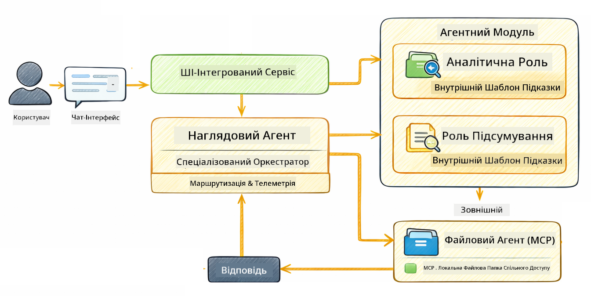

<!--
CO_OP_TRANSLATOR_METADATA:
{
  "original_hash": "6c816d130a1fa47570c11907e72d84ae",
  "translation_date": "2026-01-06T01:42:43+00:00",
  "source_file": "05-mcp/README.md",
  "language_code": "uk"
}
-->
# Модуль 05: Протокол контексту моделі (MCP)

## Зміст

- [Чого ви навчитесь](../../../05-mcp)
- [Що таке MCP?](../../../05-mcp)
- [Як працює MCP](../../../05-mcp)
- [Агентський модуль](../../../05-mcp)
- [Запуск прикладів](../../../05-mcp)
  - [Вимоги](../../../05-mcp)
- [Швидкий старт](../../../05-mcp)
  - [Операції з файлами (Stdio)](../../../05-mcp)
  - [Супервізор агент](../../../05-mcp)
    - [Розуміння виводу](../../../05-mcp)
    - [Стратегії відповіді](../../../05-mcp)
    - [Пояснення функцій агентського модуля](../../../05-mcp)
- [Ключові поняття](../../../05-mcp)
- [Вітаємо!](../../../05-mcp)
  - [Що далі?](../../../05-mcp)

## Чого ви навчитесь

Ви створили розмовний ШІ, освоїли підказки, закріпили відповіді у документах і створили агентів з інструментами. Але всі ці інструменти були спеціально створені для вашого конкретного застосунку. А що якщо ви могли б надати вашому ШІ доступ до стандартизованої екосистеми інструментів, які кожен може створювати та ділитися? У цьому модулі ви навчитесь робити саме це за допомогою Протоколу контексту моделі (MCP) та агентського модуля LangChain4j. Спочатку ми покажемо простий MCP рідер файлів, а потім покажемо, як він легко інтегрується у складні агентські робочі процеси за патерном Supervisor Agent.

## Що таке MCP?

Протокол контексту моделі (MCP) саме це й надає — стандартний спосіб для ШІ-застосунків відкривати та користуватися зовнішніми інструментами. Замість того, щоб писати власні інтеграції для кожного джерела даних чи сервісу, ви підключаєтесь до MCP серверів, які відкривають свої можливості у послідовному форматі. Ваш ШІ агент може автоматично знаходити й використовувати ці інструменти.


*До MCP: складні інтеграції точка-точка. Після MCP: один протокол – безліч можливостей.*

MCP розв’язує фундаментальну проблему в розробці ШІ: кожна інтеграція є унікальною. Хочете отримати доступ до GitHub? Пишіть власний код. Хочете читати файли? Власний код. Хочете робити запити до бази даних? Власний код. І жодна з цих інтеграцій не працює з іншими ШІ-застосунками.

MCP стандартизує це. MCP сервер виводить інструменти з чіткими описами та схемами. Будь-який MCP клієнт може підключатися, знаходити доступні інструменти й користуватися ними. Побудував один раз, використовуйте скрізь.


*Архітектура Протоколу контексту моделі — стандартизоване відкриття та виконання інструментів*

## Як працює MCP

**Архітектура клієнт-сервер**

MCP використовує модель клієнт-сервер. Сервери надають інструменти — читання файлів, запити до баз даних, виклики API. Клієнти (ваш ШІ застосунок) підключаються до серверів і користуються їхніми інструментами.

Для використання MCP з LangChain4j додайте цю залежність Maven:

```xml
<dependency>
    <groupId>dev.langchain4j</groupId>
    <artifactId>langchain4j-mcp</artifactId>
    <version>${langchain4j.version}</version>
</dependency>
```

**Відкриття інструментів**

Коли ваш клієнт підключається до MCP сервера, він питає «Які у вас є інструменти?» Сервер відповідає списком доступних інструментів із описами та схемами параметрів. Ваш агент ШІ потім може вирішити, які інструменти використовувати, залежно від запитів користувача.

**Механізми транспортування**

MCP підтримує різні механізми транспортування. Цей модуль демонструє транспортування Stdio для локальних процесів:


*Механізми транспорту MCP: HTTP для віддалених серверів, Stdio для локальних процесів*

**Stdio** - [StdioTransportDemo.java](../../../05-mcp/src/main/java/com/example/langchain4j/mcp/StdioTransportDemo.java)

Для локальних процесів. Ваш застосунок запускає сервер як підпроцес і спілкується через стандартний ввід/вивід. Корисно для доступу до файлової системи чи командних інструментів.

```java
McpTransport stdioTransport = new StdioMcpTransport.Builder()
    .command(List.of(
        npmCmd, "exec",
        "@modelcontextprotocol/server-filesystem@2025.12.18",
        resourcesDir
    ))
    .logEvents(false)
    .build();
```

> **🤖 Спробуйте з [GitHub Copilot](https://github.com/features/copilot) Chat:** Відкрийте [`StdioTransportDemo.java`](../../../05-mcp/src/main/java/com/example/langchain4j/mcp/StdioTransportDemo.java) і запитайте:
> - «Як працює транспортування Stdio і коли варто його використовувати замість HTTP?»
> - «Як LangChain4j керує життєвим циклом процесів MCP серверів?»
> - «Які наслідки для безпеки мають надання ШІ доступу до файлової системи?»

## Агентський модуль

Хоча MCP надає стандартизовані інструменти, агентський модуль LangChain4j пропонує декларативний спосіб створення агентів, які організовують використовування цих інструментів. Анотація `@Agent` та `AgenticServices` дозволяють визначати поведінку агента через інтерфейси, а не імперативний код.

У цьому модулі ви дослідите патерн **Supervisor Agent** — просунутий підхід агентського ШІ, де «супервізор» агент динамічно вирішує, яких під-агентів викликати залежно від запитів користувача. Ми поєднаємо обидва поняття, надавши одному з під-агентів можливості доступу до файлів через MCP.

Для використання агентського модуля додайте цю залежність Maven:

```xml
<dependency>
    <groupId>dev.langchain4j</groupId>
    <artifactId>langchain4j-agentic</artifactId>
    <version>${langchain4j.mcp.version}</version>
</dependency>
```

> **⚠️ Експериментально:** Модуль `langchain4j-agentic` є **експериментальним** і може змінюватись. Стабільним способом створення ШІ помічників залишається `langchain4j-core` із власними інструментами (Модуль 04).

## Запуск прикладів

### Вимоги

- Java 21+, Maven 3.9+
- Node.js 16+ та npm (для MCP серверів)
- Конфігурація змінних оточення у файлі `.env` (з коренева директорія):
  - `AZURE_OPENAI_ENDPOINT`, `AZURE_OPENAI_API_KEY`, `AZURE_OPENAI_DEPLOYMENT` (такі ж як у Модулях 01-04)

> **Примітка:** Якщо ви ще не налаштували змінні оточення, дивіться [Модуль 00 - Швидкий старт](../00-quick-start/README.md) для інструкцій або скопіюйте `.env.example` у `.env` у кореневій директорії і заповніть значення.

## Швидкий старт

**Використання VS Code:** Просто клацніть правою кнопкою миші на будь-якому демонстраційному файлі у Провіднику і виберіть **«Run Java»**, або скористайтеся конфігураціями запуску у панелі Run and Debug (перед цим переконайтесь, що ваш токен доданий у `.env` файл).

**Використання Maven:** Альтернативно, можна запускати з командного рядка за прикладами нижче.

### Операції з файлами (Stdio)

Демонструє інструменти на основі локальних підпроцесів.

**✅ Передумови не потрібні** — MCP сервер запускається автоматично.

**Використання стартових скриптів (рекомендовано):**

Стартові скрипти автоматично завантажують змінні середовища з кореневого `.env` файлу:

**Bash:**
```bash
cd 05-mcp
chmod +x start-stdio.sh
./start-stdio.sh
```

**PowerShell:**
```powershell
cd 05-mcp
.\start-stdio.ps1
```

**Використання VS Code:** Клацніть правою кнопкою на `StdioTransportDemo.java` і виберіть **«Run Java»** (переконайтесь у наявності `.env` файлу).

Застосунок автоматично запускає MCP сервер файлової системи та зчитує локальний файл. Зверніть увагу, як керується підпроцес.

**Очікуваний вивід:**
```
Assistant response: The file provides an overview of LangChain4j, an open-source Java library
for integrating Large Language Models (LLMs) into Java applications...
```

### Супервізор агент

Патерн **Supervisor Agent** — це **гнучка** форма агентського ШІ. Супервізор використовує LLM для автономного вирішення, яких агентів запустити на основі запиту користувача. У наступному прикладі ми поєднуємо MCP-доступ до файлів з LLM агентом для створення робочого процесу читання файлу → звіт.

У демо `FileAgent` читає файл за допомогою MCP інструментів файлової системи, а `ReportAgent` створює структурований звіт з виконавчим підсумком (1 речення), 3 ключовими моментами та рекомендаціями. Супервізор автоматично координує цей процес:



```
┌─────────────┐      ┌──────────────┐
│  FileAgent  │ ───▶ │ ReportAgent  │
│ (MCP tools) │      │  (pure LLM)  │
└─────────────┘      └──────────────┘
   outputKey:           outputKey:
  'fileContent'         'report'
```

Кожен агент зберігає свій вивід у **Agentic Scope** (спільна пам'ять), що дозволяє іншим агентам отримувати доступ до попередніх результатів. Це демонструє, як MCP інструменти безшовно інтегруються у агентські робочі процеси — супервізору не потрібно знати *як* файли читаються, лише що `FileAgent` може це зробити.

#### Запуск демо

Стартові скрипти автоматично завантажують змінні середовища з кореневого `.env` файлу:

**Bash:**
```bash
cd 05-mcp
chmod +x start-supervisor.sh
./start-supervisor.sh
```

**PowerShell:**
```powershell
cd 05-mcp
.\start-supervisor.ps1
```

**Використання VS Code:** Клацніть правою кнопкою на `SupervisorAgentDemo.java` і виберіть **«Run Java»** (переконайтесь у наявності `.env` файлу).

#### Як працює супервізор

```java
// Крок 1: FileAgent читає файли, використовуючи інструменти MCP
FileAgent fileAgent = AgenticServices.agentBuilder(FileAgent.class)
        .chatModel(model)
        .toolProvider(mcpToolProvider)  // Має інструменти MCP для операцій з файлами
        .build();

// Крок 2: ReportAgent генерує структуровані звіти
ReportAgent reportAgent = AgenticServices.agentBuilder(ReportAgent.class)
        .chatModel(model)
        .build();

// Supervisor координує робочий процес файл → звіт
SupervisorAgent supervisor = AgenticServices.supervisorBuilder()
        .chatModel(model)
        .subAgents(fileAgent, reportAgent)
        .responseStrategy(SupervisorResponseStrategy.LAST)  // Повернути кінцевий звіт
        .build();

// Supervisor вирішує, які агенти викликати на основі запиту
String response = supervisor.invoke("Read the file at /path/file.txt and generate a report");
```

#### Стратегії відповіді

При налаштуванні `SupervisorAgent` ви вказуєте, як він має формулювати кінцеву відповідь користувачу після виконання під-агентів. Доступні стратегії:

| Стратегія | Опис |
|----------|-------------|
| **LAST** | Супервізор повертає вивід останнього викликаного під-агента або інструменту. Ця стратегія корисна, коли кінцевий агент у робочому процесі спеціально створений для повної остаточної відповіді (наприклад, «Агент зведення» у дослідницькому ланцюжку). |
| **SUMMARY** | Супервізор використовує власну внутрішню мовну модель (LLM) для синтезу зведення всього взаємодії та виводів під-агентів, потім повертає це зведення як фінальну відповідь. Це надає чисту, агреговану відповідь користувачу. |
| **SCORED** | Система використовує внутрішню LLM для оцінки як останньої відповіді (LAST), так і зведення (SUMMARY) порівняно з початковим запитом користувача, повертаючи ту відповідь, що отримала вищий бал. |

Повний код дивіться у [SupervisorAgentDemo.java](../../../05-mcp/src/main/java/com/example/langchain4j/mcp/SupervisorAgentDemo.java).

> **🤖 Спробуйте з [GitHub Copilot](https://github.com/features/copilot) Chat:** Відкрийте [`SupervisorAgentDemo.java`](../../../05-mcp/src/main/java/com/example/langchain4j/mcp/SupervisorAgentDemo.java) і запитайте:
> - «Як супервізор вирішує, яких агентів викликати?»
> - «Чим відрізняються патерни Supervisor і Sequential?»
> - «Як налаштувати поведінку планування супервізора?»

#### Розуміння виводу

Після запуску демо ви побачите структурований покроковий огляд, як супервізор організовує роботу кількох агентів. Ось що означає кожен розділ:

```
======================================================================
  FILE → REPORT WORKFLOW DEMO
======================================================================

This demo shows a clear 2-step workflow: read a file, then generate a report.
The Supervisor orchestrates the agents automatically based on the request.
```

**Заголовок** вводить концепцію робочого процесу: сфокусований конвеєр від читання файлу до створення звіту.

```
--- WORKFLOW ---------------------------------------------------------
  ┌─────────────┐      ┌──────────────┐
  │  FileAgent  │ ───▶ │ ReportAgent  │
  │ (MCP tools) │      │  (pure LLM)  │
  └─────────────┘      └──────────────┘
   outputKey:           outputKey:
   'fileContent'        'report'

--- AVAILABLE AGENTS -------------------------------------------------
  [FILE]   FileAgent   - Reads files via MCP → stores in 'fileContent'
  [REPORT] ReportAgent - Generates structured report → stores in 'report'
```

**Діаграма робочого процесу** показує потік даних між агентами. Кожен агент має конкретну роль:
- **FileAgent** читає файли за допомогою MCP інструментів і зберігає сирий вміст у `fileContent`
- **ReportAgent** використовує цей вміст і створює структурований звіт в `report`

```
--- USER REQUEST -----------------------------------------------------
  "Read the file at .../file.txt and generate a report on its contents"
```

**Запит користувача** показує завдання. Супервізор розбирає його і вирішує викликати FileAgent → ReportAgent.

```
--- SUPERVISOR ORCHESTRATION -----------------------------------------
  The Supervisor decides which agents to invoke and passes data between them...

  +-- STEP 1: Supervisor chose -> FileAgent (reading file via MCP)
  |
  |   Input: .../file.txt
  |
  |   Result: LangChain4j is an open-source, provider-agnostic Java framework for building LLM...
  +-- [OK] FileAgent (reading file via MCP) completed

  +-- STEP 2: Supervisor chose -> ReportAgent (generating structured report)
  |
  |   Input: LangChain4j is an open-source, provider-agnostic Java framew...
  |
  |   Result: Executive Summary...
  +-- [OK] ReportAgent (generating structured report) completed
```

**Координація супервізора** показує двокроковий потік на дії:
1. **FileAgent** читає файл через MCP та зберігає вміст
2. **ReportAgent** отримує вміст і генерує структурований звіт

Супервізор прийняв ці рішення **автономно** на основі запиту користувача.

```
--- FINAL RESPONSE ---------------------------------------------------
Executive Summary
...

Key Points
...

Recommendations
...

--- AGENTIC SCOPE (Data Flow) ----------------------------------------
  Each agent stores its output for downstream agents to consume:
  * fileContent: LangChain4j is an open-source, provider-agnostic Java framework...
  * report: Executive Summary...
```

#### Пояснення функцій агентського модуля

Приклад демонструє кілька просунутих властивостей агентського модуля. Розглянемо ближче Agentic Scope та Agent Listeners.

**Agentic Scope** показує спільну пам’ять, де агенти зберігали свої результати за допомогою `@Agent(outputKey="...")`. Це дозволяє:
- Наступним агентам отримувати доступ до виводів попередніх агентів
- Супервізору синтезувати фінальну відповідь
- Вам інспектувати результати роботи кожного агента

```java
ResultWithAgenticScope<String> result = supervisor.invokeWithAgenticScope(request);
AgenticScope scope = result.agenticScope();
String fileContent = scope.readState("fileContent");  // Сирі дані файлу від FileAgent
String report = scope.readState("report");            // Структурований звіт від ReportAgent
```

**Agent Listeners** дозволяють відстежувати та налагоджувати виконання агента. Крок за кроком вивід, який ви бачите у демо, походить від AgentListener, що підключається до кожного виклику агента:
- **beforeAgentInvocation** — викликається, коли супервізор обирає агента, дозволяючи побачити, хто вибраний і чому
- **afterAgentInvocation** — викликається після завершення агента, показуючи його результат
- **inheritedBySubagents** — якщо true, лістенер відслідковує всіх агентів у ієрархії

```java
AgentListener monitor = new AgentListener() {
    private int step = 0;
    
    @Override
    public void beforeAgentInvocation(AgentRequest request) {
        step++;
        System.out.println("  +-- STEP " + step + ": " + request.agentName());
    }
    
    @Override
    public void afterAgentInvocation(AgentResponse response) {
        System.out.println("  +-- [OK] " + response.agentName() + " completed");
    }
    
    @Override
    public boolean inheritedBySubagents() {
        return true; // Поширити на всі суб-агенти
    }
};
```

Поза патерном супервізора `langchain4j-agentic` модуль надає кілька потужних патернів робочих процесів і функцій:

| Патерн | Опис | Використання |
|---------|-------------|----------|
| **Sequential** | Виконання агентів послідовно, вивід переходить до наступного | Конвеєри: дослідження → аналіз → звіт |
| **Parallel** | Запуск агентів одночасно | Незалежні завдання: погода + новини + акції |
| **Loop** | Ітерації до виконання умови | Оцінка якості: уточнення до балу ≥ 0.8 |
| **Conditional** | Маршрутизація за умовами | Класифікація → направлення до фахівця |
| **Human-in-the-Loop** | Додавання людських перевірок | Робочі процеси затвердження, перевірка контенту |

## Ключові поняття

Тепер, коли ви дослідили MCP і агентський модуль у дії, підсумуємо, коли варто використовувати кожен підхід.

**MCP** ідеально підходить, коли ви хочете скористатися існуючими екосистемами інструментів, створювати інструменти, якими можуть користуватися кілька застосунків, інтегрувати сторонні сервіси за стандартними протоколами або змінювати реалізації інструментів без зміни коду.

**Агентський модуль** найкращий, коли потрібні декларативні описання агентів через анотації `@Agent`, потрібна оркестрація робочих процесів (послідовна, циклічна, паралельна), віддаєте перевагу проектуванню агентів через інтерфейси, а не імперативний код, або поєднуєте кілька агентів, які ділять результати через `outputKey`.

**Патерн Supervisor Agent** особливо корисний, коли робочий процес непередбачуваний наперед і хочеться, щоб LLM вирішував, коли має бути застосовано різних агентів, коли у вас кілька спеціалізованих агентів, що потребують динамічної оркестрації, при створенні розмовних систем з маршрутизацією на різні функції, або коли потрібна найбільш гнучка, адаптивна поведінка агента.
## Вітаємо!

Ви завершили курс LangChain4j для початківців. Ви дізналися:

- Як створювати розмовний ШІ з пам’яттю (Модуль 01)
- Шаблони розробки промптів для різних завдань (Модуль 02)
- Анкерування відповідей у ваших документах за допомогою RAG (Модуль 03)
- Створення базових агентів ШІ (помічників) із власними інструментами (Модуль 04)
- Інтеграцію стандартизованих інструментів з LangChain4j MCP та модулем Agentic (Модуль 05)

### Що далі?

Після завершення модулів ознайомтеся з [Посібником з тестування](../docs/TESTING.md), щоб побачити концепції тестування LangChain4j у дії.

**Офіційні ресурси:**
- [Документація LangChain4j](https://docs.langchain4j.dev/) – Повні посібники та довідник API
- [GitHub LangChain4j](https://github.com/langchain4j/langchain4j) – Вихідний код та приклади
- [Навчальні посібники LangChain4j](https://docs.langchain4j.dev/tutorials/) – Покрокові навчання для різних випадків використання

Дякуємо за проходження цього курсу!

---

**Навігація:** [← Попередній: Модуль 04 - Інструменти](../04-tools/README.md) | [Назад до головної](../README.md)

---

<!-- CO-OP TRANSLATOR DISCLAIMER START -->
**Відмова від відповідальності**:  
Цей документ було перекладено за допомогою сервісу автоматичного перекладу [Co-op Translator](https://github.com/Azure/co-op-translator). Незважаючи на наші зусилля забезпечити точність, будь ласка, майте на увазі, що автоматичні переклади можуть містити помилки або неточності. Оригінальний документ рідною мовою слід вважати авторитетним джерелом. Для критично важливої інформації рекомендовано звертатися до професійного перекладу людиною. Ми не несемо відповідальності за будь-які непорозуміння чи неправильне тлумачення, що виникли внаслідок використання цього перекладу.
<!-- CO-OP TRANSLATOR DISCLAIMER END -->