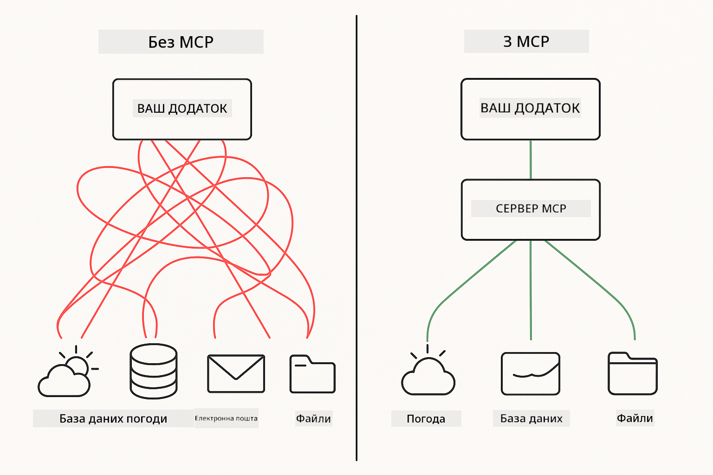
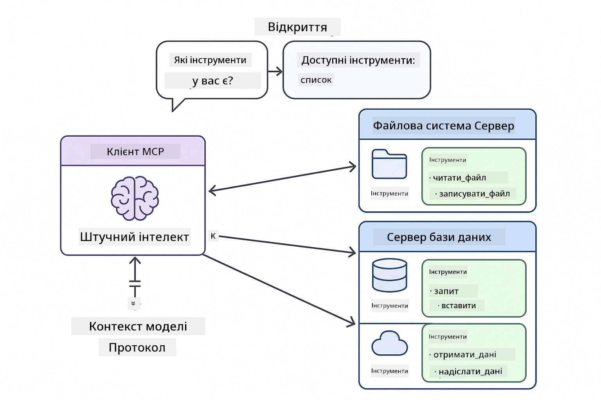

<!--
CO_OP_TRANSLATOR_METADATA:
{
  "original_hash": "c25ec1f10ef156c53e190cdf8b0711ab",
  "translation_date": "2025-12-13T18:10:06+00:00",
  "source_file": "05-mcp/README.md",
  "language_code": "uk"
}
-->
# Модуль 05: Протокол Контексту Моделі (MCP)

## Зміст

- [Чому ви навчитеся](../../../05-mcp)
- [Розуміння MCP](../../../05-mcp)
- [Як працює MCP](../../../05-mcp)
  - [Архітектура Сервер-Клієнт](../../../05-mcp)
  - [Виявлення Інструментів](../../../05-mcp)
  - [Механізми Транспорту](../../../05-mcp)
- [Вимоги](../../../05-mcp)
- [Що охоплює цей модуль](../../../05-mcp)
- [Швидкий старт](../../../05-mcp)
  - [Приклад 1: Віддалений калькулятор (Streamable HTTP)](../../../05-mcp)
  - [Приклад 2: Операції з файлами (Stdio)](../../../05-mcp)
  - [Приклад 3: Аналіз Git (Docker)](../../../05-mcp)
- [Ключові поняття](../../../05-mcp)
  - [Вибір транспорту](../../../05-mcp)
  - [Виявлення інструментів](../../../05-mcp)
  - [Управління сесіями](../../../05-mcp)
  - [Кросплатформені особливості](../../../05-mcp)
- [Коли використовувати MCP](../../../05-mcp)
- [Екосистема MCP](../../../05-mcp)
- [Вітаємо!](../../../05-mcp)
  - [Що далі?](../../../05-mcp)
- [Вирішення проблем](../../../05-mcp)

## Чому ви навчитеся

Ви створили розмовний ШІ, опанували промпти, закріпили відповіді у документах і створили агентів з інструментами. Але всі ці інструменти були спеціально створені для вашого конкретного застосунку. А що як ви могли б надати вашому ШІ доступ до стандартизованої екосистеми інструментів, які кожен може створювати та ділитися?

Протокол Контексту Моделі (MCP) саме це і забезпечує — стандартний спосіб для ШІ-застосунків знаходити та використовувати зовнішні інструменти. Замість написання індивідуальних інтеграцій для кожного джерела даних або сервісу, ви підключаєтесь до MCP серверів, які відкривають свої можливості у послідовному форматі. Ваш ШІ-агент може автоматично знаходити та використовувати ці інструменти.



*До MCP: складні точкові інтеграції. Після MCP: один протокол, безмежні можливості.*

## Розуміння MCP

MCP вирішує фундаментальну проблему в розробці ШІ: кожна інтеграція — унікальна. Хочете отримати доступ до GitHub? Потрібен власний код. Хочете читати файли? Власний код. Хочете робити запити до бази даних? Власний код. І жодна з цих інтеграцій не працює з іншими ШІ-застосунками.

MCP стандартизує це. MCP сервер відкриває інструменти з чіткими описами та схемами. Будь-який MCP клієнт може підключитися, знайти доступні інструменти та використовувати їх. Побудував один раз — використовуй скрізь.



*Архітектура Протоколу Контексту Моделі — стандартизоване виявлення та виконання інструментів*

## Як працює MCP

**Архітектура Сервер-Клієнт**

MCP використовує модель клієнт-сервер. Сервери надають інструменти — читання файлів, запити до баз даних, виклики API. Клієнти (ваш ШІ-застосунок) підключаються до серверів і використовують їхні інструменти.

**Виявлення Інструментів**

Коли ваш клієнт підключається до MCP сервера, він питає: "Які у вас є інструменти?" Сервер відповідає списком доступних інструментів, кожен з описами та схемами параметрів. Ваш ШІ-агент може вирішити, які інструменти використовувати, на основі запитів користувача.

**Механізми Транспорту**

MCP визначає два механізми транспорту: HTTP для віддалених серверів, Stdio для локальних процесів (включно з Docker контейнерами):


*Механізми транспорту MCP: HTTP для віддалених серверів, Stdio для локальних процесів (включно з Docker контейнерами)*

**Streamable HTTP** — [StreamableHttpDemo.java](../../../05-mcp/src/main/java/com/example/langchain4j/mcp/StreamableHttpDemo.java)

Для віддалених серверів. Ваш застосунок робить HTTP-запити до сервера, що працює десь у мережі. Використовує Server-Sent Events для комунікації в реальному часі.

```java
McpTransport httpTransport = new StreamableHttpMcpTransport.Builder()
    .url("http://localhost:3001/mcp")
    .timeout(Duration.ofSeconds(60))
    .logRequests(true)
    .logResponses(true)
    .build();
```

> **🤖 Спробуйте з [GitHub Copilot](https://github.com/features/copilot) Chat:** Відкрийте [`StreamableHttpDemo.java`](../../../05-mcp/src/main/java/com/example/langchain4j/mcp/StreamableHttpDemo.java) і запитайте:
> - "Чим MCP відрізняється від прямої інтеграції інструментів, як у Модулі 04?"
> - "Які переваги використання MCP для спільного використання інструментів між застосунками?"
> - "Як обробляти збої з’єднання або таймаути з MCP серверами?"

**Stdio** — [StdioTransportDemo.java](../../../05-mcp/src/main/java/com/example/langchain4j/mcp/StdioTransportDemo.java)

Для локальних процесів. Ваш застосунок запускає сервер як підпроцес і спілкується через стандартний ввід/вивід. Корисно для доступу до файлової системи або командних інструментів.

```java
McpTransport stdioTransport = new StdioMcpTransport.Builder()
    .command(List.of(
        npmCmd, "exec",
        "@modelcontextprotocol/server-filesystem@0.6.2",
        resourcesDir
    ))
    .logEvents(false)
    .build();
```

> **🤖 Спробуйте з [GitHub Copilot](https://github.com/features/copilot) Chat:** Відкрийте [`StdioTransportDemo.java`](../../../05-mcp/src/main/java/com/example/langchain4j/mcp/StdioTransportDemo.java) і запитайте:
> - "Як працює транспорт Stdio і коли його слід використовувати замість HTTP?"
> - "Як LangChain4j керує життєвим циклом запущених MCP серверних процесів?"
> - "Які наслідки для безпеки при наданні ШІ доступу до файлової системи?"

**Docker (використовує Stdio)** — [GitRepositoryAnalyzer.java](../../../05-mcp/src/main/java/com/example/langchain4j/mcp/GitRepositoryAnalyzer.java)

Для контейнеризованих сервісів. Використовує транспорт stdio для спілкування з Docker контейнером через `docker run`. Добре підходить для складних залежностей або ізольованих середовищ.

```java
McpTransport dockerTransport = new StdioMcpTransport.Builder()
    .command(List.of(
        "docker", "run",
        "-e", "GITHUB_PERSONAL_ACCESS_TOKEN=" + System.getenv("GITHUB_TOKEN"),
        "-v", volumeMapping,
        "-i", "mcp/git"
    ))
    .logEvents(true)
    .build();
```

> **🤖 Спробуйте з [GitHub Copilot](https://github.com/features/copilot) Chat:** Відкрийте [`GitRepositoryAnalyzer.java`](../../../05-mcp/src/main/java/com/example/langchain4j/mcp/GitRepositoryAnalyzer.java) і запитайте:
> - "Як транспорт Docker ізолює MCP сервери і які переваги це дає?"
> - "Як налаштувати монтування томів для обміну даними між хостом і MCP контейнерами?"
> - "Які найкращі практики управління життєвим циклом MCP серверів на базі Docker у продакшені?"

## Запуск прикладів

### Вимоги

- Java 21+, Maven 3.9+
- Node.js 16+ та npm (для MCP серверів)
- **Docker Desktop** — має бути **запущений** для Прикладу 3 (не лише встановлений)
- Особистий токен доступу GitHub, налаштований у файлі `.env` (з Модуля 00)

> **Примітка:** Якщо ви ще не налаштували свій GitHub токен, дивіться [Модуль 00 - Швидкий старт](../00-quick-start/README.md) для інструкцій.

> **⚠️ Користувачі Docker:** Перед запуском Прикладу 3 перевірте, що Docker Desktop запущений командою `docker ps`. Якщо бачите помилки з’єднання, запустіть Docker Desktop і зачекайте ~30 секунд для ініціалізації.

## Швидкий старт

**Використання VS Code:** Просто клацніть правою кнопкою миші на будь-якому демонстраційному файлі в Провіднику і виберіть **"Run Java"**, або використовуйте конфігурації запуску з панелі Run and Debug (переконайтеся, що спочатку додали токен у файл `.env`).

**Використання Maven:** Альтернативно, можна запускати з командного рядка за допомогою наведених нижче прикладів.

**⚠️ Важливо:** Деякі приклади мають вимоги (наприклад, запуск MCP сервера або збірка Docker образів). Перевірте вимоги кожного прикладу перед запуском.

### Приклад 1: Віддалений калькулятор (Streamable HTTP)

Це демонструє інтеграцію інструментів через мережу.

**⚠️ Вимога:** Спочатку потрібно запустити MCP сервер (див. Термінал 1 нижче).

**Термінал 1 — Запуск MCP сервера:**

**Bash:**
```bash
git clone https://github.com/modelcontextprotocol/servers.git
cd servers/src/everything
npm install
node dist/streamableHttp.js
```

**PowerShell:**
```powershell
git clone https://github.com/modelcontextprotocol/servers.git
cd servers/src/everything
npm install
node dist/streamableHttp.js
```

**Термінал 2 — Запуск прикладу:**

**Використання VS Code:** Клацніть правою кнопкою на `StreamableHttpDemo.java` і виберіть **"Run Java"**.

**Використання Maven:**

**Bash:**
```bash
export GITHUB_TOKEN=your_token_here
cd 05-mcp
mvn compile exec:java -Dexec.mainClass=com.example.langchain4j.mcp.StreamableHttpDemo
```

**PowerShell:**
```powershell
$env:GITHUB_TOKEN=your_token_here
cd 05-mcp
mvn --% compile exec:java -Dexec.mainClass=com.example.langchain4j.mcp.StreamableHttpDemo
```

Спостерігайте, як агент знаходить доступні інструменти, а потім використовує калькулятор для виконання додавання.

### Приклад 2: Операції з файлами (Stdio)

Це демонструє інструменти на основі локальних підпроцесів.

**✅ Вимоги відсутні** — MCP сервер запускається автоматично.

**Використання VS Code:** Клацніть правою кнопкою на `StdioTransportDemo.java` і виберіть **"Run Java"**.

**Використання Maven:**

**Bash:**
```bash
export GITHUB_TOKEN=your_token_here
cd 05-mcp
mvn compile exec:java -Dexec.mainClass=com.example.langchain4j.mcp.StdioTransportDemo
```

**PowerShell:**
```powershell
$env:GITHUB_TOKEN=your_token_here
cd 05-mcp
mvn --% compile exec:java -Dexec.mainClass=com.example.langchain4j.mcp.StdioTransportDemo
```

Застосунок автоматично запускає MCP сервер файлової системи і читає локальний файл. Зверніть увагу, як керується підпроцес.

**Очікуваний вивід:**
```
Assistant response: The content of the file is "Kaboom!".
```

### Приклад 3: Аналіз Git (Docker)

Це демонструє сервери інструментів у контейнерах.

**⚠️ Вимоги:** 
1. **Docker Desktop має бути ЗАПУЩЕНИМ** (не лише встановленим)
2. **Користувачі Windows:** рекомендовано режим WSL 2 (Налаштування Docker Desktop → Загальні → "Use the WSL 2 based engine"). Режим Hyper-V вимагає ручного налаштування спільного доступу до файлів.
3. Спочатку потрібно зібрати Docker образ (див. Термінал 1 нижче)

**Перевірка запуску Docker:**

**Bash:**
```bash
docker ps  # Повинен показувати список контейнерів, а не помилку
```

**PowerShell:**
```powershell
docker ps  # Повинен показувати список контейнерів, а не помилку
```

Якщо бачите помилку на кшталт "Cannot connect to Docker daemon" або "The system cannot find the file specified", запустіть Docker Desktop і зачекайте ініціалізації (~30 секунд).

**Вирішення проблем:**
- Якщо ШІ повідомляє про порожній репозиторій або відсутність файлів, монтування тому (`-v`) не працює.
- **Користувачі Windows Hyper-V:** Додайте директорію проекту в Налаштування Docker Desktop → Ресурси → Спільний доступ до файлів, потім перезапустіть Docker Desktop.
- **Рекомендоване рішення:** Переключіться на режим WSL 2 для автоматичного спільного доступу до файлів (Налаштування → Загальні → увімкніть "Use the WSL 2 based engine").

**Термінал 1 — Збірка Docker образу:**

**Bash:**
```bash
cd servers/src/git
docker build -t mcp/git .
```

**PowerShell:**
```powershell
cd servers/src/git
docker build -t mcp/git .
```

**Термінал 2 — Запуск аналізатора:**

**Використання VS Code:** Клацніть правою кнопкою на `GitRepositoryAnalyzer.java` і виберіть **"Run Java"**.

**Використання Maven:**

**Bash:**
```bash
export GITHUB_TOKEN=your_token_here
cd 05-mcp
mvn compile exec:java -Dexec.mainClass=com.example.langchain4j.mcp.GitRepositoryAnalyzer
```

**PowerShell:**
```powershell
$env:GITHUB_TOKEN=your_token_here
cd 05-mcp
mvn --% compile exec:java -Dexec.mainClass=com.example.langchain4j.mcp.GitRepositoryAnalyzer
```

Застосунок запускає Docker контейнер, монтує ваш репозиторій і аналізує структуру та вміст репозиторію через ШІ-агента.

## Ключові поняття

**Вибір транспорту**

Обирайте залежно від розташування ваших інструментів:
- Віддалені сервіси → Streamable HTTP
- Локальна файлова система → Stdio
- Складні залежності → Docker

**Виявлення інструментів**

MCP клієнти автоматично знаходять доступні інструменти при підключенні. Ваш ШІ-агент бачить описи інструментів і вирішує, які використовувати, на основі запиту користувача.

**Управління сесіями**

Транспорт Streamable HTTP підтримує сесії, дозволяючи станозалежні взаємодії з віддаленими серверами. Транспорти Stdio і Docker зазвичай безстанні.

**Кросплатформені особливості**

Приклади автоматично враховують відмінності платформ (різниця команд Windows і Unix, конвертація шляхів для Docker). Це важливо для розгортання у різних середовищах.

## Коли використовувати MCP

**Використовуйте MCP, коли:**
- Хочете скористатися існуючими екосистемами інструментів
- Створюєте інструменти, які використовуватимуть кілька застосунків
- Інтегруєте сторонні сервіси зі стандартними протоколами
- Потрібно змінювати реалізації інструментів без змін коду

**Використовуйте власні інструменти (Модуль 04), коли:**
- Створюєте функціонал, специфічний для застосунку
- Важлива висока продуктивність (MCP додає накладні витрати)
- Ваші інструменти прості і не будуть повторно використовуватися
- Потрібен повний контроль над виконанням

## Екосистема MCP

Протокол Контексту Моделі — відкритий стандарт з розвиваючоюся екосистемою:

- Офіційні MCP сервери для поширених завдань (файлова система, Git, бази даних)
- Сервери, створені спільнотою, для різних сервісів
- Стандартизовані описи інструментів і схеми
- Крос-фреймворк сумісність (працює з будь-яким MCP клієнтом)

Ця стандартизація означає, що інструменти, створені для одного ШІ-застосунку, працюють з іншими, створюючи спільну екосистему можливостей.

## Вітаємо!

Ви завершили курс LangChain4j для початківців. Ви навчилися:

- Як створювати розмовний ШІ з пам’яттю (Модуль 01)
- Шаблони промптів для різних завдань (Модуль 02)
- Закріплення відповідей у ваших документах за допомогою RAG (Модуль 03)
- Створення ШІ-агентів з власними інструментами (Модуль 04)
- Інтеграція стандартизованих інструментів через MCP (Модуль 05)

Тепер у вас є основа для створення продуктивних ШІ-застосунків. Концепції, які ви вивчили, застосовні незалежно від конкретних фреймворків чи моделей — це фундаментальні патерни в інженерії ШІ.

### Що далі?

Після завершення модулів ознайомтеся з [Посібником з тестування](../docs/TESTING.md), щоб побачити концепції тестування LangChain4j у дії.

**Офіційні ресурси:**
- [Документація LangChain4j](https://docs.langchain4j.dev/) — повні посібники та API довідник
- [LangChain4j на GitHub](https://github.com/langchain4j/langchain4j) — вихідний код та приклади
- [Навчальні матеріали LangChain4j](https://docs.langchain4j.dev/tutorials/) — покрокові уроки для різних випадків використання

Дякуємо за проходження курсу!

---

**Навігація:** [← Попередній: Модуль 04 - Інструменти](../04-tools/README.md) | [Назад до головної](../README.md)

---

## Вирішення проблем

### Синтаксис команди Maven у PowerShell
**Проблема**: Команди Maven завершуються помилкою `Unknown lifecycle phase ".mainClass=..."`

**Причина**: PowerShell інтерпретує `=` як оператор присвоєння змінної, що порушує синтаксис властивостей Maven

**Рішення**: Використовуйте оператор припинення парсингу `--%` перед командою Maven:

**PowerShell:**
```powershell
mvn --% compile exec:java -Dexec.mainClass=com.example.langchain4j.mcp.StreamableHttpDemo
```

**Bash:**
```bash
mvn compile exec:java -Dexec.mainClass=com.example.langchain4j.mcp.StreamableHttpDemo
```

Оператор `--%` вказує PowerShell передати всі наступні аргументи буквально Maven без інтерпретації.

### Проблеми з підключенням Docker

**Проблема**: Команди Docker завершуються помилкою "Cannot connect to Docker daemon" або "The system cannot find the file specified"

**Причина**: Docker Desktop не запущено або він не повністю ініціалізований

**Рішення**: 
1. Запустіть Docker Desktop
2. Зачекайте приблизно 30 секунд для повної ініціалізації
3. Перевірте за допомогою `docker ps` (повинен показати список контейнерів, а не помилку)
4. Потім виконайте ваш приклад

### Монтування томів Docker у Windows

**Проблема**: Аналізатор репозиторію Git повідомляє про порожній репозиторій або відсутність файлів

**Причина**: Монтування тому (`-v`) не працює через налаштування спільного доступу до файлів

**Рішення**:
- **Рекомендовано:** Переключіться на режим WSL 2 (Налаштування Docker Desktop → Загальні → "Use the WSL 2 based engine")
- **Альтернатива (Hyper-V):** Додайте директорію проекту в Налаштування Docker Desktop → Ресурси → Спільний доступ до файлів, потім перезапустіть Docker Desktop

---

<!-- CO-OP TRANSLATOR DISCLAIMER START -->
**Відмова від відповідальності**:  
Цей документ було перекладено за допомогою сервісу автоматичного перекладу [Co-op Translator](https://github.com/Azure/co-op-translator). Хоча ми прагнемо до точності, будь ласка, майте на увазі, що автоматичні переклади можуть містити помилки або неточності. Оригінальний документ рідною мовою слід вважати авторитетним джерелом. Для критично важливої інформації рекомендується звертатися до професійного людського перекладу. Ми не несемо відповідальності за будь-які непорозуміння або неправильні тлумачення, що виникли внаслідок використання цього перекладу.
<!-- CO-OP TRANSLATOR DISCLAIMER END -->