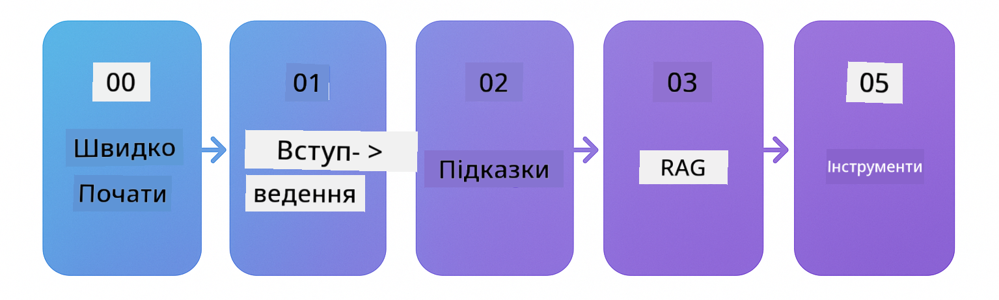

<!--
CO_OP_TRANSLATOR_METADATA:
{
  "original_hash": "1e85afe0b0ee47fc09b20442b0ee4ca5",
  "translation_date": "2025-12-23T11:09:31+00:00",
  "source_file": "README.md",
  "language_code": "uk"
}
-->


### 🌐 Підтримка багатьох мов

#### Підтримується через GitHub Action (автоматично та завжди актуально)

<!-- CO-OP TRANSLATOR LANGUAGES TABLE START -->
[Арабська](../ar/README.md) | [Бенгальська](../bn/README.md) | [Болгарська](../bg/README.md) | [Бірманська (М'янма)](../my/README.md) | [Китайська (спрощена)](../zh/README.md) | [Китайська (традиційна, Гонконг)](../hk/README.md) | [Китайська (традиційна, Макао)](../mo/README.md) | [Китайська (традиційна, Тайвань)](../tw/README.md) | [Хорватська](../hr/README.md) | [Чеська](../cs/README.md) | [Данська](../da/README.md) | [Нідерландська](../nl/README.md) | [Естонська](../et/README.md) | [Фінська](../fi/README.md) | [Французька](../fr/README.md) | [Німецька](../de/README.md) | [Грецька](../el/README.md) | [Іврит](../he/README.md) | [Гінді](../hi/README.md) | [Угорська](../hu/README.md) | [Індонезійська](../id/README.md) | [Італійська](../it/README.md) | [Японська](../ja/README.md) | [Каннада](../kn/README.md) | [Корейська](../ko/README.md) | [Литовська](../lt/README.md) | [Малайська](../ms/README.md) | [Малаяламська](../ml/README.md) | [Мараті](../mr/README.md) | [Непальська](../ne/README.md) | [Нігерійський піджин](../pcm/README.md) | [Норвезька](../no/README.md) | [Перська (фарсі)](../fa/README.md) | [Польська](../pl/README.md) | [Португальська (Бразилія)](../br/README.md) | [Португальська (Португалія)](../pt/README.md) | [Пенджабі (Гурмухі)](../pa/README.md) | [Румунська](../ro/README.md) | [Російська](../ru/README.md) | [Сербська (кирилиця)](../sr/README.md) | [Словацька](../sk/README.md) | [Словенська](../sl/README.md) | [Іспанська](../es/README.md) | [Свахілі](../sw/README.md) | [Шведська](../sv/README.md) | [Тагальська (філіппінська)](../tl/README.md) | [Тамільська](../ta/README.md) | [Телугу](../te/README.md) | [Тайська](../th/README.md) | [Турецька](../tr/README.md) | [Українська](./README.md) | [Урду](../ur/README.md) | [В'єтнамська](../vi/README.md)
<!-- CO-OP TRANSLATOR LANGUAGES TABLE END -->

# LangChain4j для початківців

Курс зі створення AI-застосунків із LangChain4j та Azure OpenAI GPT-5, від базового чату до AI-агентів.

**Новачок у LangChain4j?** Перегляньте [Глосарій](docs/GLOSSARY.md) для визначень ключових термінів і концепцій.

## Table of Contents

1. [Швидкий старт](00-quick-start/README.md) - Початок роботи з LangChain4j
2. [Вступ](01-introduction/README.md) - Вивчіть основи LangChain4j
3. [Розробка підказок](02-prompt-engineering/README.md) - Опануйте ефективне створення підказок
4. [RAG (пошуково-доповнена генерація)](03-rag/README.md) - Створюйте інтелектуальні системи на основі знань
5. [Інструменти](04-tools/README.md) - Інтегруйте зовнішні інструменти та API з AI-агентами
6. [MCP (Протокол контексту моделі)](05-mcp/README.md) - Працюйте з Протоколом контексту моделі
---

##  Навчальний шлях

> **Швидкий старт**

1. Форкніть цей репозиторій у ваш акаунт GitHub
2. Клацніть **Code** → вкладку **Codespaces** → **...** → **New with options...**
3. Використайте значення за замовчуванням – це обере контейнер для розробки, створений для цього курсу
4. Клацніть **Create codespace**
5. Зачекайте 5–10 хвилин, поки середовище буде готове
6. Перейдіть безпосередньо до [Швидкий старт](./00-quick-start/README.md), щоб почати!

> **Віддаєте перевагу клонувати локально?**
>
> Цей репозиторій містить понад 50 перекладів, що значно збільшує розмір завантаження. Щоб клонувати без перекладів, використайте sparse checkout:
> ```bash
> git clone --filter=blob:none --sparse https://github.com/microsoft/LangChain4j-for-Beginners.git
> cd LangChain4j-for-Beginners
> git sparse-checkout set --no-cone '/*' '!translations' '!translated_images'
> ```
> Це дає вам усе необхідне для проходження курсу з набагато швидшим завантаженням.

Почніть з модуля [Швидкий старт](00-quick-start/README.md) і проходьте кожен модуль крок за кроком. Ви спробуєте базові приклади, щоб зрозуміти основи, перш ніж перейти до модуля [Вступ](01-introduction/README.md) для глибшого занурення з GPT-5.



Після завершення модулів ознайомтеся з [Посібником з тестування](docs/TESTING.md), щоб побачити концепції тестування LangChain4j на практиці.

> **Примітка:** Це навчання використовує як GitHub Models, так і Azure OpenAI. Модулі [Швидкий старт](00-quick-start/README.md) та [MCP](05-mcp/README.md) використовують GitHub Models (передплата Azure не потрібна), тоді як модулі 1–4 використовують Azure OpenAI GPT-5.


## Навчання з GitHub Copilot

Щоб швидко почати кодування, відкрийте цей проєкт у GitHub Codespace або у вашому локальному IDE з наданим devcontainer. Devcontainer, що використовується в цьому курсі, попередньо налаштований з GitHub Copilot для парного програмування з AI.

Кожен приклад коду містить запропоновані питання, які ви можете поставити GitHub Copilot, щоб поглибити своє розуміння. Шукайте підказки 💡/🤖 у:

- **Заголовках Java-файлів** - Питання, специфічні для кожного прикладу
- **README модулів** - Запитання для дослідження після прикладів коду

**Як використовувати:** Відкрийте будь-який файл з кодом і задайте Copilot запропоновані питання. Він має повний контекст репозиторію та може пояснити, розширити та запропонувати альтернативи.

Хочете дізнатися більше? Перегляньте [Copilot для парного програмування з AI](https://aka.ms/GitHubCopilotAI).


## Додаткові ресурси

<!-- CO-OP TRANSLATOR OTHER COURSES START -->
### LangChain
[](https://aka.ms/langchain4j-for-beginners)
[](https://aka.ms/langchainjs-for-beginners?WT.mc_id=m365-94501-dwahlin)

---

### Azure / Edge / MCP / Agents
[](https://github.com/microsoft/AZD-for-beginners?WT.mc_id=academic-105485-koreyst)
[](https://github.com/microsoft/edgeai-for-beginners?WT.mc_id=academic-105485-koreyst)
[](https://github.com/microsoft/mcp-for-beginners?WT.mc_id=academic-105485-koreyst)
[](https://github.com/microsoft/ai-agents-for-beginners?WT.mc_id=academic-105485-koreyst)

---
 
### Серія Генеративного AI
[](https://github.com/microsoft/generative-ai-for-beginners?WT.mc_id=academic-105485-koreyst)
[-9333EA?style=for-the-badge&labelColor=E5E7EB&color=9333EA)](https://github.com/microsoft/Generative-AI-for-beginners-dotnet?WT.mc_id=academic-105485-koreyst)
[-C084FC?style=for-the-badge&labelColor=E5E7EB&color=C084FC)](https://github.com/microsoft/generative-ai-for-beginners-java?WT.mc_id=academic-105485-koreyst)
[-E879F9?style=for-the-badge&labelColor=E5E7EB&color=E879F9)](https://github.com/microsoft/generative-ai-with-javascript?WT.mc_id=academic-105485-koreyst)

---
 
### Основне навчання
[](https://aka.ms/ml-beginners?WT.mc_id=academic-105485-koreyst)
[](https://aka.ms/datascience-beginners?WT.mc_id=academic-105485-koreyst)
[](https://aka.ms/ai-beginners?WT.mc_id=academic-105485-koreyst)
[](https://github.com/microsoft/Security-101?WT.mc_id=academic-96948-sayoung)
[](https://aka.ms/webdev-beginners?WT.mc_id=academic-105485-koreyst)
[](https://aka.ms/iot-beginners?WT.mc_id=academic-105485-koreyst)

[](https://github.com/microsoft/xr-development-for-beginners?WT.mc_id=academic-105485-koreyst)

---
 
### Серія Copilot
[](https://aka.ms/GitHubCopilotAI?WT.mc_id=academic-105485-koreyst)
[](https://github.com/microsoft/mastering-github-copilot-for-dotnet-csharp-developers?WT.mc_id=academic-105485-koreyst)
[](https://github.com/microsoft/CopilotAdventures?WT.mc_id=academic-105485-koreyst)
<!-- CO-OP TRANSLATOR OTHER COURSES END -->

## Отримання допомоги

Якщо ви застрягли або маєте питання щодо створення додатків зі ШІ, приєднуйтесь:

[](https://aka.ms/foundry/discord)

Якщо у вас є відгуки про продукт або ви знайшли помилки під час розробки, відвідайте:

[](https://aka.ms/foundry/forum)

## Ліцензія

MIT License - Див. файл [LICENSE](../../LICENSE) для деталей.

---

<!-- CO-OP TRANSLATOR DISCLAIMER START -->
Відмова від відповідальності:
Цей документ перекладено із застосуванням сервісу перекладу на основі ШІ [Co-op Translator](https://github.com/Azure/co-op-translator). Хоча ми прагнемо до точності, зверніть увагу, що автоматичні переклади можуть містити помилки або неточності. Оригінальний документ рідною мовою слід вважати авторитетним джерелом. Для критичної інформації рекомендується професійний переклад, виконаний людиною. Ми не несемо відповідальності за будь-які непорозуміння або неправильні тлумачення, що виникли внаслідок використання цього перекладу.
<!-- CO-OP TRANSLATOR DISCLAIMER END -->