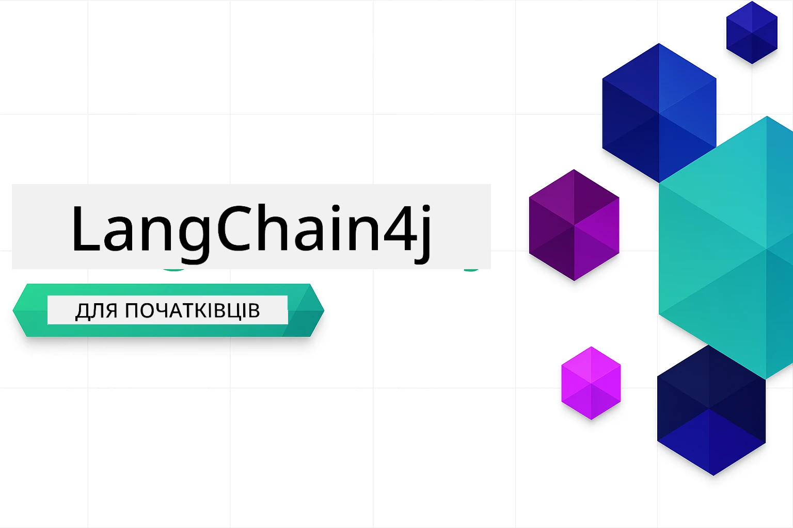

### 🌐 Підтримка кількох мов

#### Підтримується через GitHub Action (автоматично та завжди актуально)

<!-- CO-OP TRANSLATOR LANGUAGES TABLE START -->
[Arabic](../ar/README.md) | [Bengali](../bn/README.md) | [Bulgarian](../bg/README.md) | [Burmese (Myanmar)](../my/README.md) | [Chinese (Simplified)](../zh-CN/README.md) | [Chinese (Traditional, Hong Kong)](../zh-HK/README.md) | [Chinese (Traditional, Macau)](../zh-MO/README.md) | [Chinese (Traditional, Taiwan)](../zh-TW/README.md) | [Croatian](../hr/README.md) | [Czech](../cs/README.md) | [Danish](../da/README.md) | [Dutch](../nl/README.md) | [Estonian](../et/README.md) | [Finnish](../fi/README.md) | [French](../fr/README.md) | [German](../de/README.md) | [Greek](../el/README.md) | [Hebrew](../he/README.md) | [Hindi](../hi/README.md) | [Hungarian](../hu/README.md) | [Indonesian](../id/README.md) | [Italian](../it/README.md) | [Japanese](../ja/README.md) | [Kannada](../kn/README.md) | [Korean](../ko/README.md) | [Lithuanian](../lt/README.md) | [Malay](../ms/README.md) | [Malayalam](../ml/README.md) | [Marathi](../mr/README.md) | [Nepali](../ne/README.md) | [Nigerian Pidgin](../pcm/README.md) | [Norwegian](../no/README.md) | [Persian (Farsi)](../fa/README.md) | [Polish](../pl/README.md) | [Portuguese (Brazil)](../pt-BR/README.md) | [Portuguese (Portugal)](../pt-PT/README.md) | [Punjabi (Gurmukhi)](../pa/README.md) | [Romanian](../ro/README.md) | [Russian](../ru/README.md) | [Serbian (Cyrillic)](../sr/README.md) | [Slovak](../sk/README.md) | [Slovenian](../sl/README.md) | [Spanish](../es/README.md) | [Swahili](../sw/README.md) | [Swedish](../sv/README.md) | [Tagalog (Filipino)](../tl/README.md) | [Tamil](../ta/README.md) | [Telugu](../te/README.md) | [Thai](../th/README.md) | [Turkish](../tr/README.md) | [Ukrainian](./README.md) | [Urdu](../ur/README.md) | [Vietnamese](../vi/README.md)

> **Віддаєте перевагу клонувати локально?**

> У цьому репозиторії є понад 50 мовних перекладів, що значно збільшує розмір завантаження. Щоб клонувати без перекладів, використовуйте sparse checkout:
> ```bash
> git clone --filter=blob:none --sparse https://github.com/microsoft/LangChain4j-for-Beginners.git
> cd LangChain4j-for-Beginners
> git sparse-checkout set --no-cone '/*' '!translations' '!translated_images'
> ```
> Це дає вам усе необхідне для проходження курсу з набагато швидшим завантаженням.
<!-- CO-OP TRANSLATOR LANGUAGES TABLE END -->

# LangChain4j для початківців

Курс зі створення AI-додатків за допомогою LangChain4j та Azure OpenAI GPT-5 — від базового чату до AI-агентів.

**Вперше з LangChain4j?** Ознайомтесь із [Глосарієм](docs/GLOSSARY.md) для визначень ключових термінів і понять.

## Зміст

1. [Швидкий старт](00-quick-start/README.md) — Розпочніть роботу з LangChain4j
2. [Вступ](01-introduction/README.md) — Вивчіть основи LangChain4j
3. [Проєктування запитів (Prompt Engineering)](02-prompt-engineering/README.md) — Опановуйте ефективний дизайн запитів
4. [RAG (Retrieval-Augmented Generation)](03-rag/README.md) — Створюйте інтелектуальні системи на основі знань
5. [Інструменти](04-tools/README.md) — Інтегруйте зовнішні інструменти та простих помічників
6. [MCP (Model Context Protocol)](05-mcp/README.md) — Працюйте з протоколом Model Context та агентськими модулями
---

## Навчальний шлях

> **Швидкий старт**

1. Форкніть цей репозиторій у свій обліковий запис GitHub
2. Натисніть **Code** → вкладка **Codespaces** → **...** → **New with options...**
3. Використайте значення за замовчуванням – це вибере контейнер розробника, створений для цього курсу
4. Натисніть **Create codespace**
5. Почекайте 5-10 хвилин, поки середовище буде готове
6. Перейдіть прямо до [Швидкого старту](./00-quick-start/README.md)!

Після проходження модулів досліджуйте [Посібник з тестування](docs/TESTING.md), щоб побачити концепції тестування LangChain4j у дії.

> **Примітка:** Для цього навчання використовуються як GitHub Models, так і Azure OpenAI. Модуль [Швидкий старт](00-quick-start/README.md) використовує GitHub Models (передплата Azure не потрібна), а модулі 1-5 — Azure OpenAI.

## Навчання з GitHub Copilot

Щоб швидко почати програмувати, відкрийте цей проєкт у GitHub Codespace або у вашому локальному IDE з наданим devcontainer. Devcontainer, що використовується у цьому курсі, попередньо налаштований з GitHub Copilot для AI парного програмування.

Кожен приклад коду містить рекомендовані питання, які ви можете задати GitHub Copilot для глибшого розуміння. Шукайте підказки 💡/🤖 у:

- **Заголовках Java-файлів** — питання, специфічні для кожного прикладу
- **README модулів** — підказки для дослідження після прикладів коду

**Як використовувати:** Відкрийте будь-який код і запитайте Copilot рекомендовані питання. Він має повний контекст коду і може пояснити, розширити і запропонувати альтернативи.

Хочете дізнатись більше? Ознайомтесь із [Copilot для AI парного програмування](https://aka.ms/GitHubCopilotAI).

## Додаткові ресурси

<!-- CO-OP TRANSLATOR OTHER COURSES START -->
### LangChain
[](https://aka.ms/langchain4j-for-beginners)
[](https://aka.ms/langchainjs-for-beginners?WT.mc_id=m365-94501-dwahlin)

---

### Azure / Edge / MCP / Агенти
[](https://github.com/microsoft/AZD-for-beginners?WT.mc_id=academic-105485-koreyst)
[](https://github.com/microsoft/edgeai-for-beginners?WT.mc_id=academic-105485-koreyst)
[](https://github.com/microsoft/mcp-for-beginners?WT.mc_id=academic-105485-koreyst)
[](https://github.com/microsoft/ai-agents-for-beginners?WT.mc_id=academic-105485-koreyst)

---
 
### Серія про генеративний AI
[](https://github.com/microsoft/generative-ai-for-beginners?WT.mc_id=academic-105485-koreyst)
[-9333EA?style=for-the-badge&labelColor=E5E7EB&color=9333EA)](https://github.com/microsoft/Generative-AI-for-beginners-dotnet?WT.mc_id=academic-105485-koreyst)
[-C084FC?style=for-the-badge&labelColor=E5E7EB&color=C084FC)](https://github.com/microsoft/generative-ai-for-beginners-java?WT.mc_id=academic-105485-koreyst)
[-E879F9?style=for-the-badge&labelColor=E5E7EB&color=E879F9)](https://github.com/microsoft/generative-ai-with-javascript?WT.mc_id=academic-105485-koreyst)

---
 
### Основи навчання
[](https://aka.ms/ml-beginners?WT.mc_id=academic-105485-koreyst)
[](https://aka.ms/datascience-beginners?WT.mc_id=academic-105485-koreyst)
[](https://aka.ms/ai-beginners?WT.mc_id=academic-105485-koreyst)
[](https://github.com/microsoft/Security-101?WT.mc_id=academic-96948-sayoung)
[](https://aka.ms/webdev-beginners?WT.mc_id=academic-105485-koreyst)
[](https://aka.ms/iot-beginners?WT.mc_id=academic-105485-koreyst)
[](https://github.com/microsoft/xr-development-for-beginners?WT.mc_id=academic-105485-koreyst)

---
 
### Серія Copilot

[](https://aka.ms/GitHubCopilotAI?WT.mc_id=academic-105485-koreyst)
[](https://github.com/microsoft/mastering-github-copilot-for-dotnet-csharp-developers?WT.mc_id=academic-105485-koreyst)
[](https://github.com/microsoft/CopilotAdventures?WT.mc_id=academic-105485-koreyst)
<!-- CO-OP TRANSLATOR OTHER COURSES END -->

## Отримання допомоги

Якщо ви застрягли або маєте будь-які питання щодо створення AI-додатків, приєднуйтесь:

[](https://aka.ms/foundry/discord)

Якщо у вас є відгуки про продукт або помилки під час розробки, відвідайте:

[](https://aka.ms/foundry/forum)

## Ліцензія

Ліцензія MIT - див. файл [LICENSE](../../LICENSE) для деталей.

---

<!-- CO-OP TRANSLATOR DISCLAIMER START -->
**Відмова від відповідальності**:
Цей документ було перекладено за допомогою сервісу штучного інтелекту [Co-op Translator](https://github.com/Azure/co-op-translator). Хоча ми прагнемо до точності, просимо враховувати, що автоматичні переклади можуть містити помилки чи неточності. Оригінальний документ його рідною мовою слід вважати авторитетним джерелом. Для критичної інформації рекомендується використовувати професійний людський переклад. Ми не несемо відповідальності за будь-які непорозуміння або помилкові тлумачення, що виникли внаслідок використання цього перекладу.
<!-- CO-OP TRANSLATOR DISCLAIMER END -->