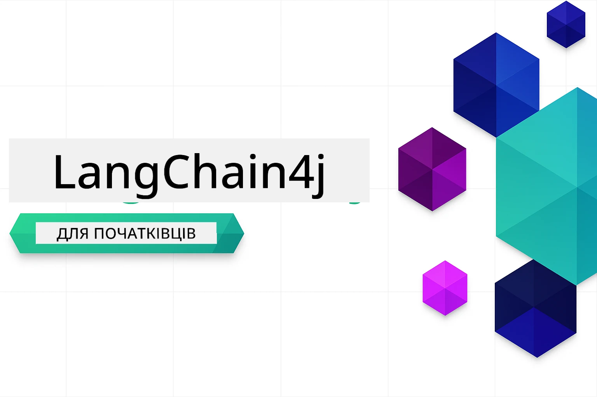

# LangChain4j для початківців

Курс зі створення AI-додатків з LangChain4j та Azure OpenAI GPT-5.2, від базового чату до AI агентів.

### 🌐 Підтримка кількох мов

#### Підтримується через GitHub Action (Автоматично та завжди актуально)

<!-- CO-OP TRANSLATOR LANGUAGES TABLE START -->
[Арабська](../ar/README.md) | [Бенгальська](../bn/README.md) | [Болгарська](../bg/README.md) | [Бирманська (М’янма)](../my/README.md) | [Китайська (спрощена)](../zh-CN/README.md) | [Китайська (традиційна, Гонконг)](../zh-HK/README.md) | [Китайська (традиційна, Макао)](../zh-MO/README.md) | [Китайська (традиційна, Тайвань)](../zh-TW/README.md) | [Хорватська](../hr/README.md) | [Чеська](../cs/README.md) | [Данська](../da/README.md) | [Голландська](../nl/README.md) | [Естонська](../et/README.md) | [Фінська](../fi/README.md) | [Французька](../fr/README.md) | [Німецька](../de/README.md) | [Грецька](../el/README.md) | [Іврит](../he/README.md) | [Гінді](../hi/README.md) | [Угорська](../hu/README.md) | [Індонезійська](../id/README.md) | [Італійська](../it/README.md) | [Японська](../ja/README.md) | [Каннада](../kn/README.md) | [Кхмер](../km/README.md) | [Корейська](../ko/README.md) | [Литовська](../lt/README.md) | [Малайська](../ms/README.md) | [Малаялам](../ml/README.md) | [Мараті](../mr/README.md) | [Неапалі](../ne/README.md) | [Нігерійський Піджин](../pcm/README.md) | [Норвезька](../no/README.md) | [Перська (фарсі)](../fa/README.md) | [Польська](../pl/README.md) | [Португальська (Бразилія)](../pt-BR/README.md) | [Португальська (Португалія)](../pt-PT/README.md) | [Панджабі (гурмукхі)](../pa/README.md) | [Румунська](../ro/README.md) | [Російська](../ru/README.md) | [Сербська (кирилиця)](../sr/README.md) | [Словацька](../sk/README.md) | [Словенська](../sl/README.md) | [Іспанська](../es/README.md) | [Свахілі](../sw/README.md) | [Шведська](../sv/README.md) | [Тагальська (філіппінська)](../tl/README.md) | [Тамільська](../ta/README.md) | [Телугу](../te/README.md) | [Тайська](../th/README.md) | [Турецька](../tr/README.md) | [Українська](./README.md) | [Урду](../ur/README.md) | [В’єтнамська](../vi/README.md)

> **Віддаєте перевагу клонувати локально?**
>
> Цей репозиторій містить понад 50 перекладів, що значно збільшує розмір завантаження. Щоб клонувати без перекладів, використовуйте sparse checkout:
>
> **Bash / macOS / Linux:**
> ```bash
> git clone --filter=blob:none --sparse https://github.com/microsoft/LangChain4j-for-Beginners.git
> cd LangChain4j-for-Beginners
> git sparse-checkout set --no-cone '/*' '!translations' '!translated_images'
> ```
>
> **CMD (Windows):**
> ```cmd
> git clone --filter=blob:none --sparse https://github.com/microsoft/LangChain4j-for-Beginners.git
> cd LangChain4j-for-Beginners
> git sparse-checkout set --no-cone "/*" "!translations" "!translated_images"
> ```
>
> Це дасть вам усе необхідне для проходження курсу з набагато швидшим завантаженням.
<!-- CO-OP TRANSLATOR LANGUAGES TABLE END -->

## Зміст

1. [Вступ](01-introduction/README.md) - Вивчайте основи LangChain4j
2. [Проєктування підказок](02-prompt-engineering/README.md) - Опануйте ефективний дизайн підказок
3. [RAG (Підсилене пошуком покоління)](03-rag/README.md) - Створюйте інтелектуальні системи на основі знань
4. [Інструменти](04-tools/README.md) - Інтегруйте зовнішні інструменти та прості помічники
5. [MCP (Протокол контексту моделі)](05-mcp/README.md) - Працюйте з Протоколом контексту моделі (MCP) та агентними модулями

### Відеоогляди

Кожен модуль має супровідну живу сесію, де ми крок за кроком розглядаємо концепції та код.

| Модуль | Відео |
|--------|-------|
| 01 - Вступ | [Початок роботи з LangChain4j](https://www.youtube.com/live/nl_troDm8rQ) |
| 02 - Проєктування підказок | [Проєктування підказок з LangChain4j](https://www.youtube.com/live/PJ6aBaE6bog) |
| 03 - RAG | [RAG з LangChain4j](https://www.youtube.com/watch?v=_olq75ZH_eY) |
| 04 - Інструменти & 05 - MCP | [AI агенти з інструментами та MCP](https://www.youtube.com/watch?v=O_J30kZc0rw) |

---

## Навчальний шлях

**Новачок у LangChain4j?** Ознайомтеся з [Глосарієм](docs/GLOSSARY.md) для визначень основних термінів і понять.

> **Швидкий початок**

1. Форкніть цей репозиторій у свій обліковий запис GitHub
2. Натисніть **Code** → вкладка **Codespaces** → **...** → **Новий з опціями...**
3. Використовуйте значення за замовчуванням – це вибере контейнер розробника, створений для цього курсу
4. Натисніть **Create codespace**
5. Почекайте 5-10 хвилин, доки середовище буде готове
6. Одразу переходьте до [Вступу](./01-introduction/README.md) для старту!

Після проходження модулів вивчіть [Посібник з тестування](docs/TESTING.md), щоб побачити концепції тестування LangChain4j у дії.

> **Примітка:** це тренування використовує Azure OpenAI. Почніть з [БЕЗКОШТОВНОГО облікового запису Azure](https://aka.ms/azure-free-account), якщо у вас його немає.


## Навчання з GitHub Copilot

Щоб швидко почати програмувати, відкрийте цей проєкт у GitHub Codespace або вашому локальному IDE з наданим devcontainer. Devcontainer, що використовується у цьому курсі, попередньо налаштований з GitHub Copilot для AI-парного програмування.

Кожен приклад коду містить запропоновані питання, які ви можете задати GitHub Copilot, щоб поглибити розуміння. Шукайте підказки 💡/🤖 у:

- **Заголовках Java-файлів** - Питання, специфічні для кожного прикладу
- **README модулів** - Пропозиції для дослідження після прикладів коду

**Як користуватися:** Відкрийте будь-який файл коду і задайте Copilot запропоновані питання. Він має повний контекст кодової бази і може пояснювати, розширювати і пропонувати альтернативи.

Хочете дізнатися більше? Перегляньте [Copilot для AI-парного програмування](https://aka.ms/GitHubCopilotAI).


## Додаткові ресурси

<!-- CO-OP TRANSLATOR OTHER COURSES START -->
### LangChain
[](https://aka.ms/langchain4j-for-beginners)
[](https://aka.ms/langchainjs-for-beginners?WT.mc_id=m365-94501-dwahlin)
[](https://github.com/microsoft/langchain-for-beginners?WT.mc_id=m365-94501-dwahlin)
---

### Azure / Edge / MCP / Агенти
[](https://github.com/microsoft/AZD-for-beginners?WT.mc_id=academic-105485-koreyst)
[](https://github.com/microsoft/edgeai-for-beginners?WT.mc_id=academic-105485-koreyst)
[](https://github.com/microsoft/mcp-for-beginners?WT.mc_id=academic-105485-koreyst)
[](https://github.com/microsoft/ai-agents-for-beginners?WT.mc_id=academic-105485-koreyst)

---
 
### Серія Generative AI
[](https://github.com/microsoft/generative-ai-for-beginners?WT.mc_id=academic-105485-koreyst)
[-9333EA?style=for-the-badge&labelColor=E5E7EB&color=9333EA)](https://github.com/microsoft/Generative-AI-for-beginners-dotnet?WT.mc_id=academic-105485-koreyst)
[-C084FC?style=for-the-badge&labelColor=E5E7EB&color=C084FC)](https://github.com/microsoft/generative-ai-for-beginners-java?WT.mc_id=academic-105485-koreyst)
[-E879F9?style=for-the-badge&labelColor=E5E7EB&color=E879F9)](https://github.com/microsoft/generative-ai-with-javascript?WT.mc_id=academic-105485-koreyst)

---
 
### Основи навчання
[](https://aka.ms/ml-beginners?WT.mc_id=academic-105485-koreyst)
[](https://aka.ms/datascience-beginners?WT.mc_id=academic-105485-koreyst)
[](https://aka.ms/ai-beginners?WT.mc_id=academic-105485-koreyst)
[](https://github.com/microsoft/Security-101?WT.mc_id=academic-96948-sayoung)

[](https://aka.ms/webdev-beginners?WT.mc_id=academic-105485-koreyst)
[](https://aka.ms/iot-beginners?WT.mc_id=academic-105485-koreyst)
[](https://github.com/microsoft/xr-development-for-beginners?WT.mc_id=academic-105485-koreyst)

---
 
### Серія Copilot
[](https://aka.ms/GitHubCopilotAI?WT.mc_id=academic-105485-koreyst)
[](https://github.com/microsoft/mastering-github-copilot-for-dotnet-csharp-developers?WT.mc_id=academic-105485-koreyst)
[](https://github.com/microsoft/CopilotAdventures?WT.mc_id=academic-105485-koreyst)
<!-- CO-OP TRANSLATOR OTHER COURSES END -->

## Отримання допомоги

Якщо ви застрягли або маєте запитання щодо створення додатків зі штучним інтелектом, приєднуйтесь до:

[](https://aka.ms/foundry/discord)

Якщо у вас є відгуки про продукт або помилки під час розробки, відвідайте:

[](https://aka.ms/foundry/forum)

## Ліцензія

Ліцензія MIT — дивіться файл [LICENSE](../../LICENSE) для деталей.

---

<!-- CO-OP TRANSLATOR DISCLAIMER START -->
**Відмова від відповідальності**:
Цей документ було перекладено за допомогою сервісу штучного інтелекту для перекладу [Co-op Translator](https://github.com/Azure/co-op-translator). Хоча ми прагнемо до точності, будь ласка, майте на увазі, що автоматичні переклади можуть містити помилки або неточності. Оригінальний документ рідною мовою слід вважати авторитетним джерелом. Для критично важливої інформації рекомендується професійний людський переклад. Ми не несемо відповідальності за будь-які непорозуміння або неправильні тлумачення, що виникли внаслідок використання цього перекладу.
<!-- CO-OP TRANSLATOR DISCLAIMER END -->