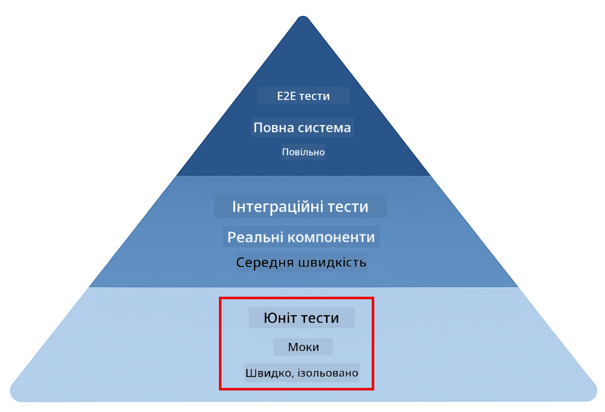
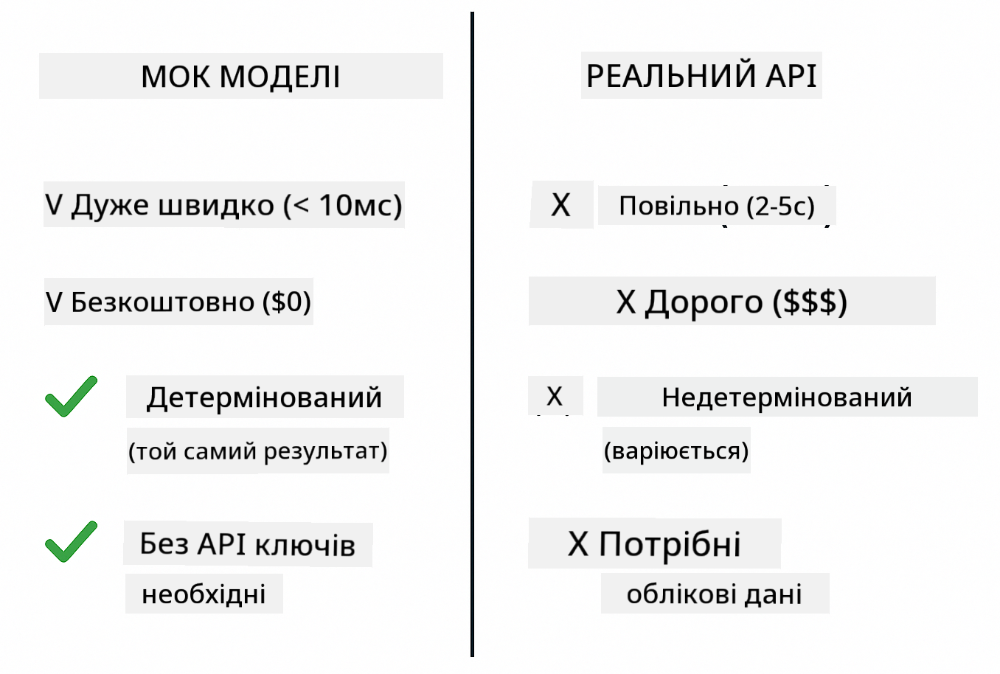
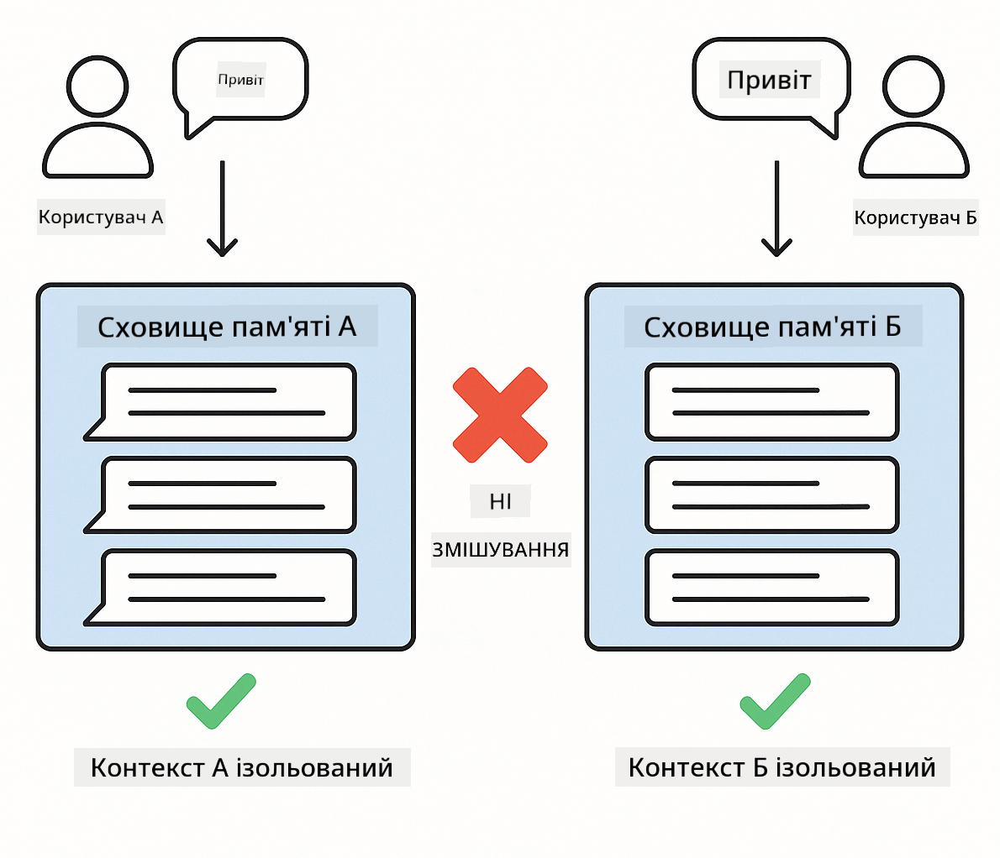
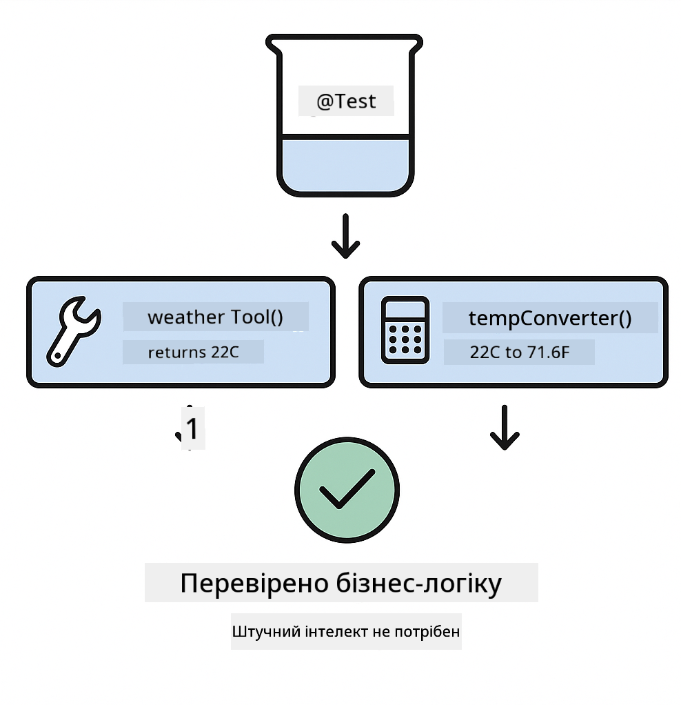

<!--
CO_OP_TRANSLATOR_METADATA:
{
  "original_hash": "b975537560c404d5f254331832811e78",
  "translation_date": "2025-12-13T21:30:52+00:00",
  "source_file": "docs/TESTING.md",
  "language_code": "uk"
}
-->
# Тестування додатків LangChain4j

## Зміст

- [Швидкий старт](../../../docs)
- [Що охоплюють тести](../../../docs)
- [Запуск тестів](../../../docs)
- [Запуск тестів у VS Code](../../../docs)
- [Патерни тестування](../../../docs)
- [Філософія тестування](../../../docs)
- [Наступні кроки](../../../docs)

Цей посібник проведе вас через тести, які демонструють, як тестувати AI-додатки без необхідності API-ключів або зовнішніх сервісів.

## Швидкий старт

Запустіть усі тести однією командою:

**Bash:**
```bash
mvn test
```

**PowerShell:**
```powershell
mvn --% test
```


*Успішне виконання тестів, що показує проходження всіх тестів без помилок*

## Що охоплюють тести

Цей курс зосереджений на **модульних тестах**, які запускаються локально. Кожен тест демонструє конкретну концепцію LangChain4j в ізоляції.



*Піраміда тестування, що показує баланс між модульними тестами (швидкі, ізольовані), інтеграційними тестами (реальні компоненти) та end-to-end тестами (повна система з Docker). Це навчання охоплює модульне тестування.*

| Модуль | Тести | Фокус | Ключові файли |
|--------|-------|-------|---------------|
| **00 - Швидкий старт** | 6 | Шаблони підказок і заміна змінних | `SimpleQuickStartTest.java` |
| **01 - Вступ** | 8 | Пам’ять розмови та стан чатів | `SimpleConversationTest.java` |
| **02 - Проєктування підказок** | 12 | Патерни GPT-5, рівні готовності, структурований вивід | `SimpleGpt5PromptTest.java` |
| **03 - RAG** | 10 | Інгестування документів, ембедінги, пошук за схожістю | `DocumentServiceTest.java` |
| **04 - Інструменти** | 12 | Виклик функцій і ланцюжки інструментів | `SimpleToolsTest.java` |
| **05 - MCP** | 15 | Протокол контексту моделі з Docker | `SimpleMcpTest.java`, `McpDockerTransportTest.java` |

## Запуск тестів

**Запустіть усі тести з кореневої директорії:**

**Bash:**
```bash
mvn test
```

**PowerShell:**
```powershell
mvn --% test
```

**Запуск тестів для конкретного модуля:**

**Bash:**
```bash
cd 01-introduction && mvn test
# Або з кореня
mvn test -pl 01-introduction
```

**PowerShell:**
```powershell
cd 01-introduction; mvn --% test
# Або з кореня
mvn --% test -pl 01-introduction
```

**Запуск одного класу тестів:**

**Bash:**
```bash
mvn test -Dtest=SimpleConversationTest
```

**PowerShell:**
```powershell
mvn --% test -Dtest=SimpleConversationTest
```

**Запуск конкретного тестового методу:**

**Bash:**
```bash
mvn test -Dtest=SimpleConversationTest#слід зберігати історію розмови
```

**PowerShell:**
```powershell
mvn --% test -Dtest=SimpleConversationTest#слід зберігати історію розмови
```

## Запуск тестів у VS Code

Якщо ви використовуєте Visual Studio Code, Test Explorer надає графічний інтерфейс для запуску та налагодження тестів.


*Test Explorer у VS Code, що показує дерево тестів з усіма Java класами тестів та окремими тестовими методами*

**Щоб запустити тести у VS Code:**

1. Відкрийте Test Explorer, натиснувши іконку колби на панелі активності
2. Розгорніть дерево тестів, щоб побачити всі модулі та класи тестів
3. Натисніть кнопку запуску поруч із будь-яким тестом, щоб запустити його окремо
4. Натисніть "Run All Tests", щоб виконати весь набір
5. Клацніть правою кнопкою миші на тесті та виберіть "Debug Test" для встановлення точок зупину та покрокового виконання коду

Test Explorer показує зелені галочки для пройдених тестів і надає детальні повідомлення про помилки, якщо тести не проходять.

## Патерни тестування


*Шість патернів тестування для додатків LangChain4j: шаблони підказок, мокінг моделей, ізоляція розмов, тестування інструментів, in-memory RAG та інтеграція з Docker*

### Патерн 1: Тестування шаблонів підказок

Найпростіший патерн тестує шаблони підказок без виклику будь-якої AI-моделі. Ви перевіряєте, що заміна змінних працює правильно, а підказки форматуються як очікується.


*Тестування шаблонів підказок, що показує потік заміни змінних: шаблон із заповнювачами → застосовані значення → перевірений відформатований вивід*

```java
@Test
@DisplayName("Should format prompt template with variables")
void testPromptTemplateFormatting() {
    PromptTemplate template = PromptTemplate.from(
        "Best time to visit {{destination}} for {{activity}}?"
    );
    
    Prompt prompt = template.apply(Map.of(
        "destination", "Paris",
        "activity", "sightseeing"
    ));
    
    assertThat(prompt.text()).isEqualTo("Best time to visit Paris for sightseeing?");
}
```

Цей тест знаходиться у `00-quick-start/src/test/java/com/example/langchain4j/quickstart/SimpleQuickStartTest.java`.

**Запустіть його:**

**Bash:**
```bash
cd 00-quick-start && mvn test -Dtest=SimpleQuickStartTest#тестуванняФорматуванняШаблонуПідказки
```

**PowerShell:**
```powershell
cd 00-quick-start; mvn --% test -Dtest=SimpleQuickStartTest#тестуванняФорматуванняШаблонуПідказки
```

### Патерн 2: Мокінг мовних моделей

При тестуванні логіки розмови використовуйте Mockito для створення фейкових моделей, які повертають заздалегідь визначені відповіді. Це робить тести швидкими, безкоштовними та детермінованими.



*Порівняння, що показує, чому для тестування краще використовувати моки: вони швидкі, безкоштовні, детерміновані і не потребують API-ключів*

```java
@ExtendWith(MockitoExtension.class)
class SimpleConversationTest {
    
    private ConversationService conversationService;
    
    @Mock
    private OpenAiOfficialChatModel mockChatModel;
    
    @BeforeEach
    void setUp() {
        ChatResponse mockResponse = ChatResponse.builder()
            .aiMessage(AiMessage.from("This is a test response"))
            .build();
        when(mockChatModel.chat(anyList())).thenReturn(mockResponse);
        
        conversationService = new ConversationService(mockChatModel);
    }
    
    @Test
    void shouldMaintainConversationHistory() {
        String conversationId = conversationService.startConversation();
        
        ChatResponse mockResponse1 = ChatResponse.builder()
            .aiMessage(AiMessage.from("Response 1"))
            .build();
        ChatResponse mockResponse2 = ChatResponse.builder()
            .aiMessage(AiMessage.from("Response 2"))
            .build();
        ChatResponse mockResponse3 = ChatResponse.builder()
            .aiMessage(AiMessage.from("Response 3"))
            .build();
        
        when(mockChatModel.chat(anyList()))
            .thenReturn(mockResponse1)
            .thenReturn(mockResponse2)
            .thenReturn(mockResponse3);

        conversationService.chat(conversationId, "First message");
        conversationService.chat(conversationId, "Second message");
        conversationService.chat(conversationId, "Third message");

        List<ChatMessage> history = conversationService.getHistory(conversationId);
        assertThat(history).hasSize(6); // 3 повідомлення від користувача + 3 повідомлення від ШІ
    }
}
```

Цей патерн використовується у `01-introduction/src/test/java/com/example/langchain4j/service/SimpleConversationTest.java`. Мок гарантує послідовну поведінку, щоб ви могли перевірити правильність управління пам’яттю.

### Патерн 3: Тестування ізоляції розмов

Пам’ять розмови має зберігати користувачів окремо. Цей тест перевіряє, що контексти розмов не змішуються.



*Тестування ізоляції розмов, що показує окремі сховища пам’яті для різних користувачів, щоб уникнути змішування контекстів*

```java
@Test
void shouldIsolateConversationsByid() {
    String conv1 = conversationService.startConversation();
    String conv2 = conversationService.startConversation();
    
    ChatResponse mockResponse = ChatResponse.builder()
        .aiMessage(AiMessage.from("Response"))
        .build();
    when(mockChatModel.chat(anyList())).thenReturn(mockResponse);

    conversationService.chat(conv1, "Message for conversation 1");
    conversationService.chat(conv2, "Message for conversation 2");

    List<ChatMessage> history1 = conversationService.getHistory(conv1);
    List<ChatMessage> history2 = conversationService.getHistory(conv2);
    
    assertThat(history1).hasSize(2);
    assertThat(history2).hasSize(2);
}
```

Кожна розмова підтримує власну незалежну історію. В продуктивних системах ця ізоляція критична для багатокористувацьких додатків.

### Патерн 4: Тестування інструментів окремо

Інструменти — це функції, які AI може викликати. Тестуйте їх безпосередньо, щоб переконатися, що вони працюють правильно незалежно від рішень AI.



*Тестування інструментів окремо, що показує виконання мок-інструментів без викликів AI для перевірки бізнес-логіки*

```java
@Test
void shouldConvertCelsiusToFahrenheit() {
    TemperatureTool tempTool = new TemperatureTool();
    String result = tempTool.celsiusToFahrenheit(25.0);
    assertThat(result).containsPattern("77[.,]0°F");
}

@Test
void shouldDemonstrateToolChaining() {
    WeatherTool weatherTool = new WeatherTool();
    TemperatureTool tempTool = new TemperatureTool();

    String weatherResult = weatherTool.getCurrentWeather("Seattle");
    assertThat(weatherResult).containsPattern("\\d+°C");

    String conversionResult = tempTool.celsiusToFahrenheit(22.0);
    assertThat(conversionResult).containsPattern("71[.,]6°F");
}
```

Ці тести з `04-tools/src/test/java/com/example/langchain4j/agents/tools/SimpleToolsTest.java` перевіряють логіку інструментів без участі AI. Приклад ланцюжка показує, як вихід одного інструменту подається на вхід іншому.

### Патерн 5: Тестування in-memory RAG

Системи RAG традиційно потребують векторних баз даних і сервісів ембедінгів. Патерн in-memory дозволяє тестувати весь конвеєр без зовнішніх залежностей.


*Потік тестування in-memory RAG, що показує парсинг документів, збереження ембедінгів і пошук за схожістю без потреби в базі даних*

```java
@Test
void testProcessTextDocument() {
    String content = "This is a test document.\nIt has multiple lines.";
    InputStream inputStream = new ByteArrayInputStream(content.getBytes(StandardCharsets.UTF_8));
    
    DocumentService.ProcessedDocument result = 
        documentService.processDocument(inputStream, "test.txt");

    assertNotNull(result);
    assertTrue(result.segments().size() > 0);
    assertEquals("test.txt", result.segments().get(0).metadata().getString("filename"));
}
```

Цей тест з `03-rag/src/test/java/com/example/langchain4j/rag/service/DocumentServiceTest.java` створює документ у пам’яті та перевіряє розбиття на частини і обробку метаданих.

### Патерн 6: Інтеграційне тестування з Docker

Деякі функції потребують реальної інфраструктури. Модуль MCP використовує Testcontainers для запуску Docker-контейнерів для інтеграційних тестів. Вони перевіряють, що ваш код працює з реальними сервісами, зберігаючи ізоляцію тестів.


*Інтеграційне тестування MCP з Testcontainers, що показує автоматизований життєвий цикл контейнерів: запуск, виконання тестів, зупинка та очищення*

Тести у `05-mcp/src/test/java/com/example/langchain4j/mcp/McpDockerTransportTest.java` вимагають запущеного Docker.

**Запустіть їх:**

**Bash:**
```bash
cd 05-mcp && mvn test
```

**PowerShell:**
```powershell
cd 05-mcp; mvn --% test
```

## Філософія тестування

Тестуйте свій код, а не AI. Ваші тести повинні перевіряти код, який ви пишете, контролюючи, як будуються підказки, як управляється пам’ять і як виконуються інструменти. Відповіді AI варіюються і не повинні бути частиною перевірок тестів. Запитуйте себе, чи правильно ваш шаблон підказки замінює змінні, а не чи дає AI правильну відповідь.

Використовуйте моки для мовних моделей. Це зовнішні залежності, які повільні, дорогі і недетерміновані. Мокінг робить тести швидкими (мілісекунди замість секунд), безкоштовними (без витрат на API) і детермінованими (той самий результат щоразу).

Зберігайте тести незалежними. Кожен тест має налаштовувати власні дані, не залежати від інших тестів і прибирати за собою. Тести повинні проходити незалежно від порядку виконання.

Тестуйте крайні випадки, а не лише щасливий шлях. Спробуйте порожні вхідні дані, дуже великі, спеціальні символи, недійсні параметри та граничні умови. Вони часто виявляють баги, які звичайне використання не показує.

Використовуйте описові назви. Порівняйте `shouldMaintainConversationHistoryAcrossMultipleMessages()` з `test1()`. Перша назва точно описує, що тестується, що значно полегшує налагодження помилок.

## Наступні кроки

Тепер, коли ви розумієте патерни тестування, заглибтеся в кожен модуль:

- **[00 - Швидкий старт](../00-quick-start/README.md)** - Почніть з основ шаблонів підказок
- **[01 - Вступ](../01-introduction/README.md)** - Вивчіть управління пам’яттю розмов
- **[02 - Проєктування підказок](../02-prompt-engineering/README.md)** - Опануйте патерни GPT-5 для підказок
- **[03 - RAG](../03-rag/README.md)** - Створюйте системи з доповненням пошуком
- **[04 - Інструменти](../04-tools/README.md)** - Реалізуйте виклики функцій і ланцюжки інструментів
- **[05 - MCP](../05-mcp/README.md)** - Інтегруйте Протокол контексту моделі з Docker

README кожного модуля містить детальні пояснення концепцій, протестованих тут.

---

**Навігація:** [← Назад до головної](../README.md)

---

<!-- CO-OP TRANSLATOR DISCLAIMER START -->
**Відмова від відповідальності**:  
Цей документ було перекладено за допомогою сервісу автоматичного перекладу [Co-op Translator](https://github.com/Azure/co-op-translator). Хоча ми прагнемо до точності, будь ласка, майте на увазі, що автоматичні переклади можуть містити помилки або неточності. Оригінальний документ рідною мовою слід вважати авторитетним джерелом. Для критично важливої інформації рекомендується звертатися до професійного людського перекладу. Ми не несемо відповідальності за будь-які непорозуміння або неправильні тлумачення, що виникли внаслідок використання цього перекладу.
<!-- CO-OP TRANSLATOR DISCLAIMER END -->