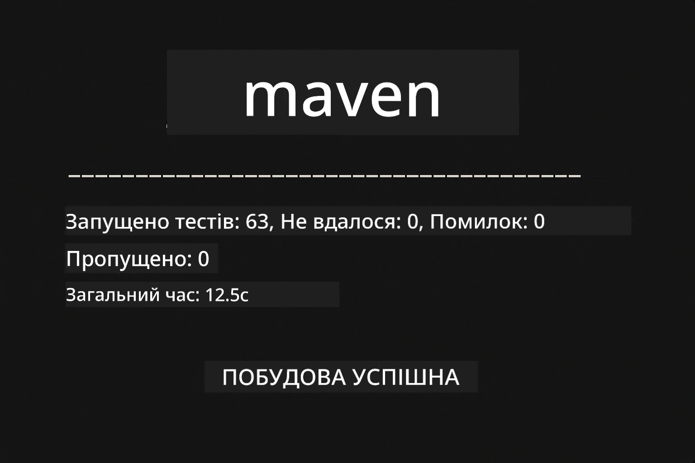
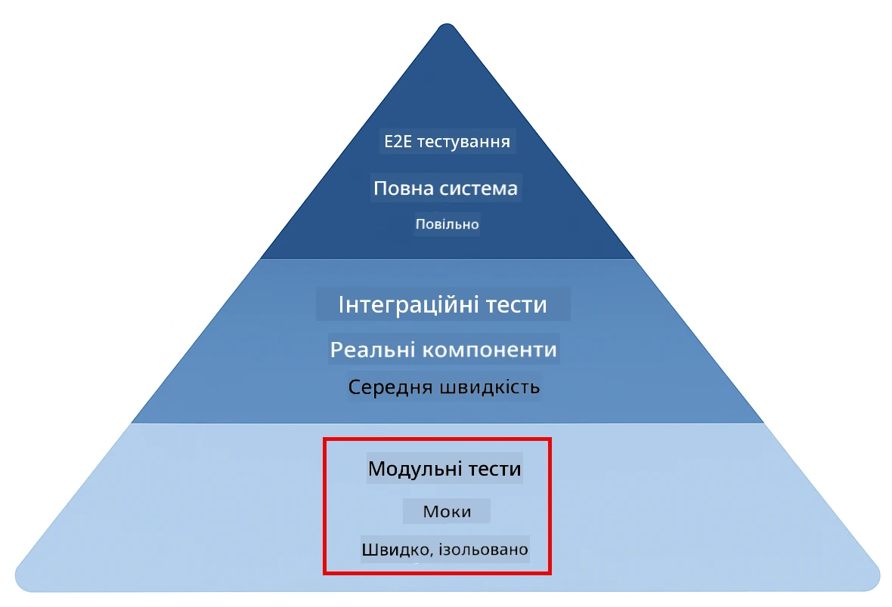
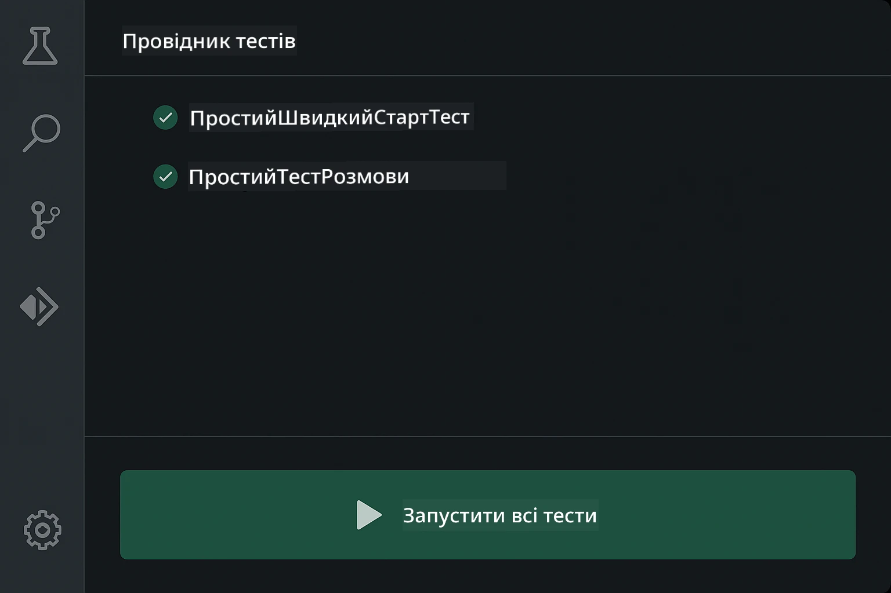
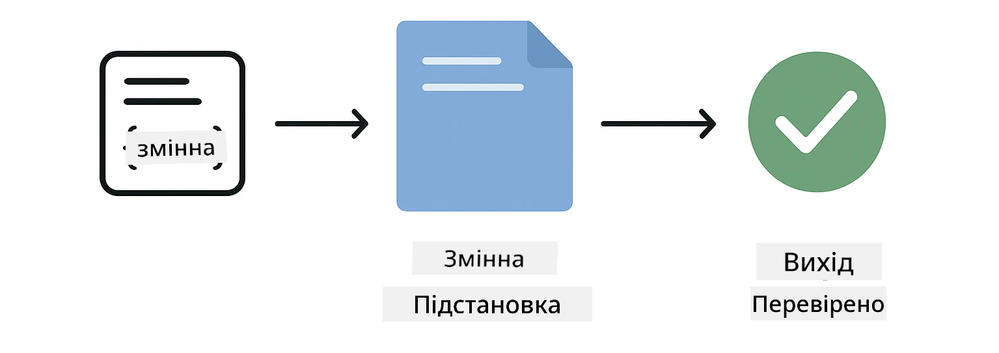
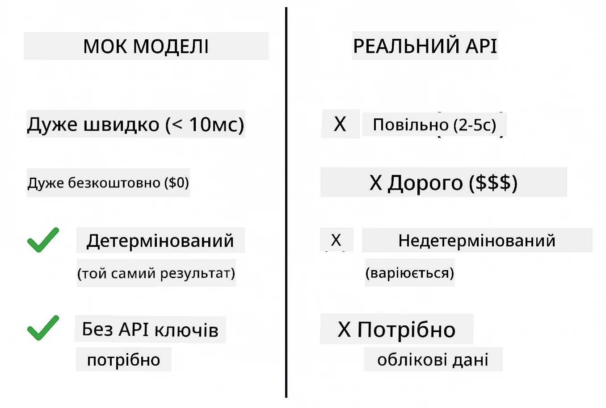
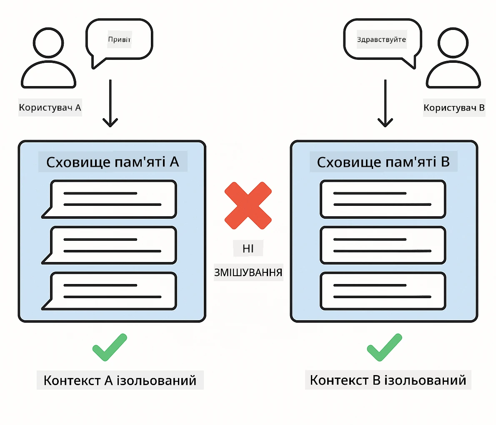
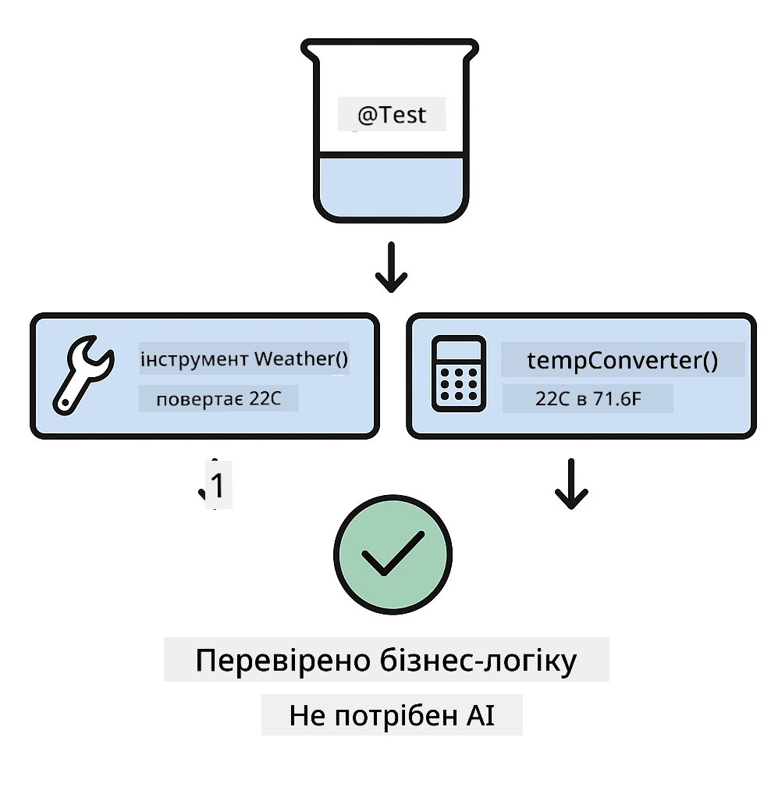
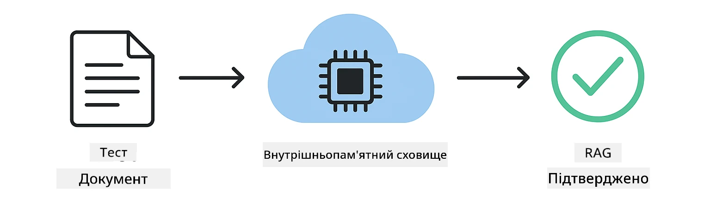

<!--
CO_OP_TRANSLATOR_METADATA:
{
  "original_hash": "ed93b3c14d58734ac10162967da958c1",
  "translation_date": "2025-12-31T06:29:12+00:00",
  "source_file": "docs/TESTING.md",
  "language_code": "uk"
}
-->
# Тестування додатків LangChain4j

## Зміст

- [Швидкий старт](../../../docs)
- [Що покривають тести](../../../docs)
- [Запуск тестів](../../../docs)
- [Запуск тестів у VS Code](../../../docs)
- [Шаблони тестування](../../../docs)
- [Філософія тестування](../../../docs)
- [Наступні кроки](../../../docs)

Цей посібник проведе вас через тести, які демонструють, як тестувати AI-додатки без потреби в API-ключах або зовнішніх службах.

## Quick Start

Запустіть усі тести однією командою:

**Bash:**
```bash
mvn test
```

**PowerShell:**
```powershell
mvn --% test
```



*Успішне виконання тестів, усі тести пройшли без жодної помилки*

## Що покривають тести

Курс зосереджений на **модульних тестах**, які виконуються локально. Кожен тест демонструє окрему концепцію LangChain4j в ізоляції.



*Піраміда тестування, що показує баланс між модульними тестами (швидкі, ізольовані), інтеграційними тестами (реальні компоненти) та end-to-end тестами. Це навчання охоплює модульне тестування.*

| Модуль | Тести | Фокус | Ключові файли |
|--------|-------|-------|-----------|
| **00 - Швидкий старт** | 6 | Шаблони промптів та підстановка змінних | `SimpleQuickStartTest.java` |
| **01 - Вступ** | 8 | Пам'ять розмови та чат зі збереженням стану | `SimpleConversationTest.java` |
| **02 - Промпт-інжиніринг** | 12 | Шаблони GPT-5, рівні ініціативності, структурований вивід | `SimpleGpt5PromptTest.java` |
| **03 - RAG** | 10 | Імпорт документів, вбудування (embeddings), пошук за подібністю | `DocumentServiceTest.java` |
| **04 - Інструменти** | 12 | Виклик функцій та ланцюжки інструментів | `SimpleToolsTest.java` |
| **05 - MCP** | 8 | Model Context Protocol з використанням stdio-транспорту | `SimpleMcpTest.java` |

## Запуск тестів

**Запустити всі тести з кореневої папки:**

**Bash:**
```bash
mvn test
```

**PowerShell:**
```powershell
mvn --% test
```

**Запустити тести для конкретного модуля:**

**Bash:**
```bash
cd 01-introduction && mvn test
# Або з кореня
mvn test -pl 01-introduction
```

**PowerShell:**
```powershell
cd 01-introduction; mvn --% test
# Або з кореня
mvn --% test -pl 01-introduction
```

**Запустити один клас тестів:**

**Bash:**
```bash
mvn test -Dtest=SimpleConversationTest
```

**PowerShell:**
```powershell
mvn --% test -Dtest=SimpleConversationTest
```

**Запустити конкретний метод тесту:**

**Bash:**
```bash
mvn test -Dtest=SimpleConversationTest#повинно зберігати історію розмов
```

**PowerShell:**
```powershell
mvn --% test -Dtest=SimpleConversationTest#повинно зберігати історію розмов
```

## Запуск тестів у VS Code

Якщо ви використовуєте Visual Studio Code, Test Explorer надає графічний інтерфейс для запуску та налагодження тестів.



*Дослідник тестів VS Code, що показує дерево тестів з усіма Java-класами тестів та окремими методами тестів*

**Щоб запускати тести у VS Code:**

1. Відкрийте Test Explorer, натиснувши іконку колби в Activity Bar
2. Розгорніть дерево тестів, щоб побачити всі модулі та класи тестів
3. Натисніть кнопку запуску поруч із будь-яким тестом, щоб виконати його окремо
4. Натисніть "Run All Tests", щоб виконати весь набір тестів
5. Клацніть правою кнопкою миші на будь-якому тесті та оберіть "Debug Test", щоб встановити брейкпоінти та покроково виконувати код

Test Explorer показує зелені галочки для пройдених тестів та надає докладні повідомлення про помилки, коли тести відпадають.

## Шаблони тестування

### Шаблон 1: Тестування шаблонів промптів

Найпростіший шаблон тестує шаблони промптів без виклику AI-моделі. Ви перевіряєте, що підстановка змінних працює правильно і промпти форматуються як очікується.



*Тестування шаблонів промптів, що показує процес підстановки змінних: шаблон з плейсхолдерами → застосовані значення → перевірка відформатованого виводу*

```java
@Test
@DisplayName("Should format prompt template with variables")
void testPromptTemplateFormatting() {
    PromptTemplate template = PromptTemplate.from(
        "Best time to visit {{destination}} for {{activity}}?"
    );
    
    Prompt prompt = template.apply(Map.of(
        "destination", "Paris",
        "activity", "sightseeing"
    ));
    
    assertThat(prompt.text()).isEqualTo("Best time to visit Paris for sightseeing?");
}
```

Цей тест знаходиться в `00-quick-start/src/test/java/com/example/langchain4j/quickstart/SimpleQuickStartTest.java`.

**Запустити його:**

**Bash:**
```bash
cd 00-quick-start && mvn test -Dtest=SimpleQuickStartTest#тестування форматування шаблону підказки
```

**PowerShell:**
```powershell
cd 00-quick-start; mvn --% test -Dtest=SimpleQuickStartTest#тестування форматування шаблону підказки
```

### Шаблон 2: Мокінг мовних моделей

При тестуванні логіки розмов використовуйте Mockito, щоб створювати фейкові моделі, які повертають заздалегідь визначені відповіді. Це робить тести швидкими, безкоштовними та детермінованими.



*Порівняння, яке показує, чому для тестування краще використовувати моки: вони швидкі, безкоштовні, детерміновані і не потребують API-ключів*

```java
@ExtendWith(MockitoExtension.class)
class SimpleConversationTest {
    
    private ConversationService conversationService;
    
    @Mock
    private OpenAiOfficialChatModel mockChatModel;
    
    @BeforeEach
    void setUp() {
        ChatResponse mockResponse = ChatResponse.builder()
            .aiMessage(AiMessage.from("This is a test response"))
            .build();
        when(mockChatModel.chat(anyList())).thenReturn(mockResponse);
        
        conversationService = new ConversationService(mockChatModel);
    }
    
    @Test
    void shouldMaintainConversationHistory() {
        String conversationId = conversationService.startConversation();
        
        ChatResponse mockResponse1 = ChatResponse.builder()
            .aiMessage(AiMessage.from("Response 1"))
            .build();
        ChatResponse mockResponse2 = ChatResponse.builder()
            .aiMessage(AiMessage.from("Response 2"))
            .build();
        ChatResponse mockResponse3 = ChatResponse.builder()
            .aiMessage(AiMessage.from("Response 3"))
            .build();
        
        when(mockChatModel.chat(anyList()))
            .thenReturn(mockResponse1)
            .thenReturn(mockResponse2)
            .thenReturn(mockResponse3);

        conversationService.chat(conversationId, "First message");
        conversationService.chat(conversationId, "Second message");
        conversationService.chat(conversationId, "Third message");

        List<ChatMessage> history = conversationService.getHistory(conversationId);
        assertThat(history).hasSize(6); // 3 повідомлення користувача + 3 повідомлення ШІ
    }
}
```

Цей шаблон зустрічається в `01-introduction/src/test/java/com/example/langchain4j/service/SimpleConversationTest.java`. Мок гарантує послідовну поведінку, щоб ви могли перевірити, що управління пам'яттю працює правильно.

### Шаблон 3: Тестування ізоляції розмов

Пам'ять розмов має зберігати кілька користувачів окремо. Цей тест перевіряє, що розмови не змішуються між собою.



*Тестування ізоляції розмов, що показує окремі сховища пам'яті для різних користувачів, щоб запобігти змішуванню контекстів*

```java
@Test
void shouldIsolateConversationsByid() {
    String conv1 = conversationService.startConversation();
    String conv2 = conversationService.startConversation();
    
    ChatResponse mockResponse = ChatResponse.builder()
        .aiMessage(AiMessage.from("Response"))
        .build();
    when(mockChatModel.chat(anyList())).thenReturn(mockResponse);

    conversationService.chat(conv1, "Message for conversation 1");
    conversationService.chat(conv2, "Message for conversation 2");

    List<ChatMessage> history1 = conversationService.getHistory(conv1);
    List<ChatMessage> history2 = conversationService.getHistory(conv2);
    
    assertThat(history1).hasSize(2);
    assertThat(history2).hasSize(2);
}
```

Кожна розмова зберігає свою незалежну історію. У виробничих системах ця ізоляція критично важлива для багатокористувацьких застосунків.

### Шаблон 4: Тестування інструментів окремо

Інструменти — це функції, які може викликати AI. Тестуйте їх безпосередньо, щоб переконатися, що вони працюють правильно незалежно від рішень AI.



*Тестування інструментів окремо, що показує виконання мокованого інструменту без викликів AI для перевірки бізнес-логіки*

```java
@Test
void shouldConvertCelsiusToFahrenheit() {
    TemperatureTool tempTool = new TemperatureTool();
    String result = tempTool.celsiusToFahrenheit(25.0);
    assertThat(result).containsPattern("77[.,]0°F");
}

@Test
void shouldDemonstrateToolChaining() {
    WeatherTool weatherTool = new WeatherTool();
    TemperatureTool tempTool = new TemperatureTool();

    String weatherResult = weatherTool.getCurrentWeather("Seattle");
    assertThat(weatherResult).containsPattern("\\d+°C");

    String conversionResult = tempTool.celsiusToFahrenheit(22.0);
    assertThat(conversionResult).containsPattern("71[.,]6°F");
}
```

Ці тести з `04-tools/src/test/java/com/example/langchain4j/agents/tools/SimpleToolsTest.java` перевіряють логіку інструментів без участі AI. Приклад ланцюжка показує, як вихід одного інструменту потрапляє на вхід іншого.

### Шаблон 5: Тестування RAG в пам'яті

Системи RAG зазвичай потребують векторних баз даних та сервісів для embeddings. Шаблон в пам'яті дозволяє протестувати весь конвеєр без зовнішніх залежностей.



*Робочий процес тестування RAG в пам'яті, що показує парсинг документів, збереження вбудувань та пошук за подібністю без потреби в базі даних*

```java
@Test
void testProcessTextDocument() {
    String content = "This is a test document.\nIt has multiple lines.";
    InputStream inputStream = new ByteArrayInputStream(content.getBytes(StandardCharsets.UTF_8));
    
    DocumentService.ProcessedDocument result = 
        documentService.processDocument(inputStream, "test.txt");

    assertNotNull(result);
    assertTrue(result.segments().size() > 0);
    assertEquals("test.txt", result.segments().get(0).metadata().getString("filename"));
}
```

Цей тест з `03-rag/src/test/java/com/example/langchain4j/rag/service/DocumentServiceTest.java` створює документ в пам'яті і перевіряє розбивку на чанки та обробку метаданих.

### Шаблон 6: Інтеграційне тестування MCP

Модуль MCP тестує інтеграцію Model Context Protocol з використанням stdio-транспорту. Ці тести перевіряють, що ваш застосунок може створювати та спілкуватися з MCP-серверами як дочірні процеси.

Тести в `05-mcp/src/test/java/com/example/langchain4j/mcp/SimpleMcpTest.java` перевіряють поведінку MCP-клієнта.

**Запустити їх:**

**Bash:**
```bash
cd 05-mcp && mvn test
```

**PowerShell:**
```powershell
cd 05-mcp; mvn --% test
```

## Філософія тестування

Тестуйте ваш код, а не AI. Ваші тести повинні перевіряти код, який ви пишете, шляхом контролю того, як будуються промпти, як управляється пам'ять та як виконуються інструменти. Відповіді AI змінюються і не повинні бути частиною тверджень тестів. Питайте себе, чи ваш шаблон промпту правильно підставляє змінні, а не чи AI дає правильну відповідь.

Використовуйте моки для мовних моделей. Вони є зовнішніми залежностями, які повільні, дорогі та недетерміновані. Мокінг робить тести швидкими — в мілісекундах замість секунд, безкоштовними — без витрат на API, і детермінованими — з однаковим результатом кожного разу.

Тримайте тести незалежними. Кожен тест повинен налаштовувати свої дані, не покладатися на інші тести та очищувати за собою. Тести повинні проходити незалежно від порядку виконання.

Тестуйте крайні випадки, а не лише "щасливий шлях". Перевіряйте порожні входи, дуже великі входи, спеціальні символи, недійсні параметри та граничні умови. Це часто виявляє баги, які нормальне використання не показує.

Використовуйте описові назви. Порівняйте `shouldMaintainConversationHistoryAcrossMultipleMessages()` з `test1()`. Перша точно каже, що тестується, що значно полегшує налагодження помилок.

## Наступні кроки

Тепер, коли ви зрозуміли шаблони тестування, заглибтеся в кожен модуль:

- **[00 - Швидкий старт](../00-quick-start/README.md)** - Почніть з основ шаблонів промптів
- **[01 - Вступ](../01-introduction/README.md)** - Вивчіть управління пам'яттю розмов
- **[02 - Промпт-інжиніринг](../02-prompt-engineering/README.md)** - Опануйте шаблони підготовки промптів для GPT-5
- **[03 - RAG](../03-rag/README.md)** - Створюйте системи retrieval-augmented generation
- **[04 - Інструменти](../04-tools/README.md)** - Реалізуйте виклик функцій та ланцюжки інструментів
- **[05 - MCP](../05-mcp/README.md)** - Інтегруйте Model Context Protocol

README кожного модуля містить детальніші пояснення концепцій, протестованих тут.

---

**Навігація:** [← Повернутися до головної](../README.md)

---

<!-- CO-OP TRANSLATOR DISCLAIMER START -->
Відмова від відповідальності:
Цей документ було перекладено з використанням сервісу машинного перекладу на базі штучного інтелекту Co-op Translator (https://github.com/Azure/co-op-translator). Хоч ми й прагнемо до точності, просимо врахувати, що автоматичні переклади можуть містити помилки або неточності. Оригінальний документ мовою оригіналу слід вважати авторитетним джерелом. Для критичної інформації рекомендується професійний переклад, виконаний людиною. Ми не несемо відповідальності за будь-які непорозуміння чи неправильні тлумачення, що виникли внаслідок використання цього перекладу.
<!-- CO-OP TRANSLATOR DISCLAIMER END -->