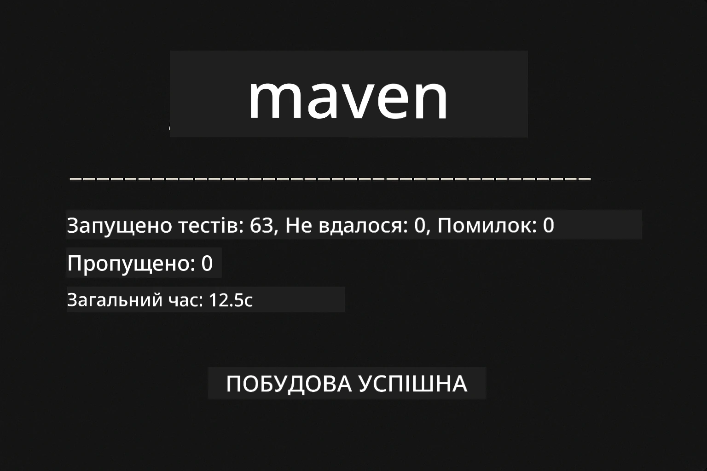
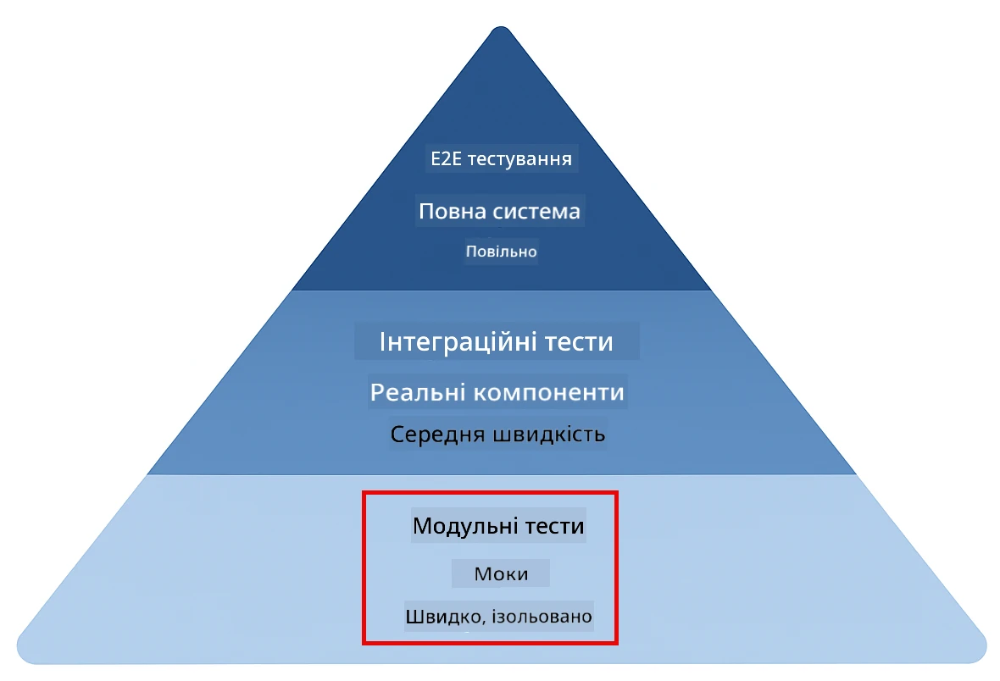
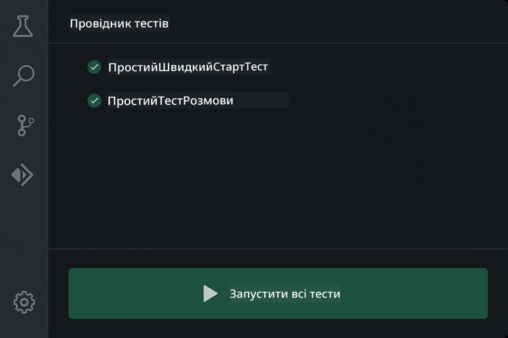
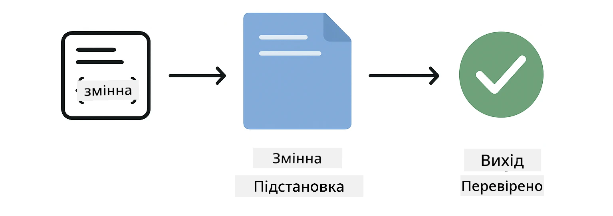
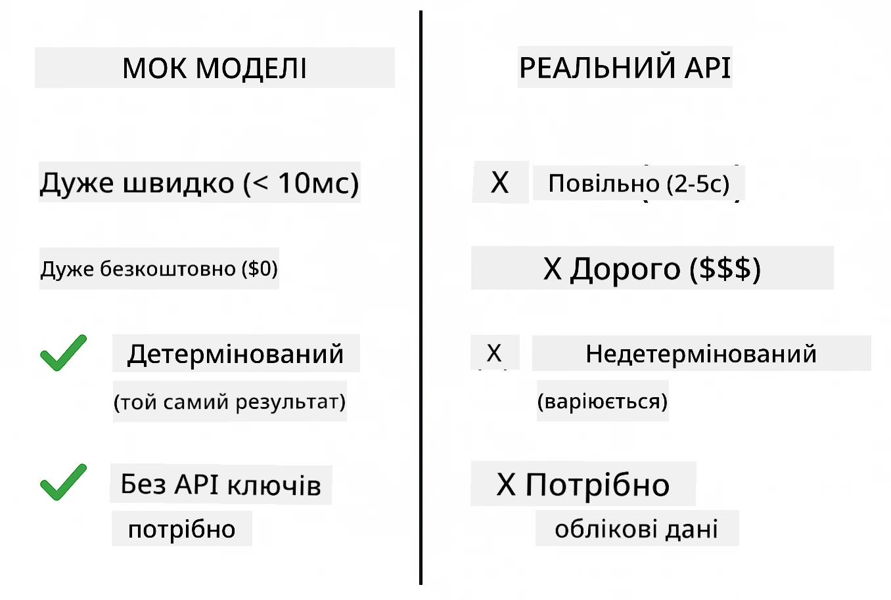
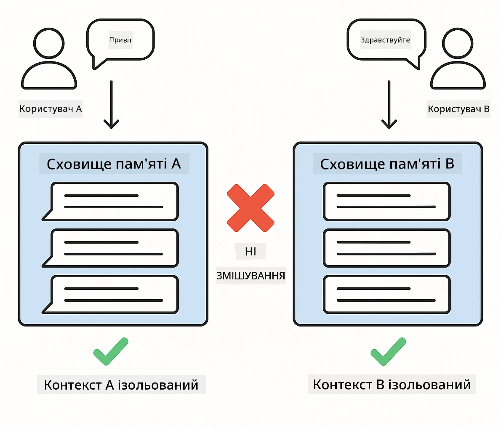
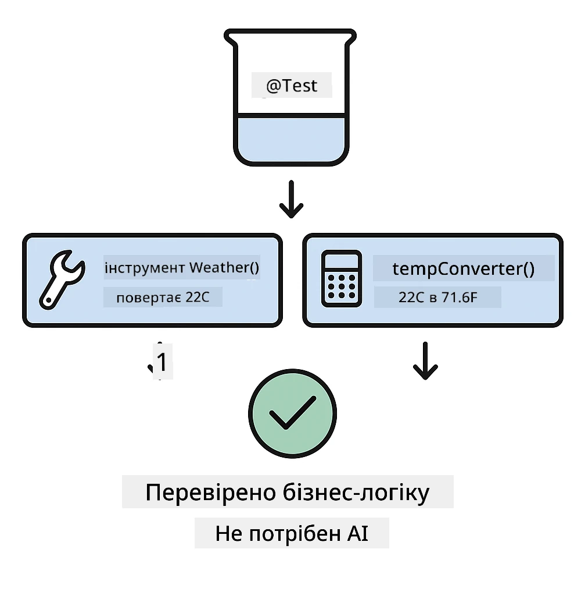
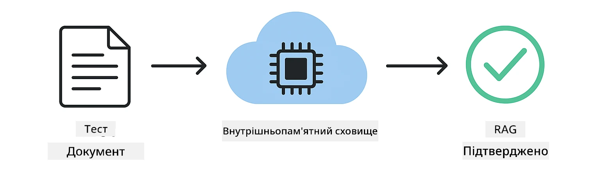

# Тестування додатків LangChain4j

## Зміст

- [Швидкий старт](#швидкий-старт)
- [Що охоплюють тести](#що-охоплюють-тести)
- [Запуск тестів](#запуск-тестів)
- [Запуск тестів у VS Code](#запуск-тестів-у-vs-code)
- [Патерни тестування](#патерни-тестування)
- [Філософія тестування](#філософія-тестування)
- [Наступні кроки](#наступні-кроки)

Цей посібник проведе вас через тести, які демонструють, як тестувати AI-додатки без необхідності ключів API чи зовнішніх сервісів.

## Швидкий старт

Запустіть усі тести одною командою:

**Bash:**
```bash
mvn test
```

**PowerShell:**
```powershell
mvn --% test
```

Коли всі тести пройдуть успішно, ви побачите результат, як на скріншоті нижче — тести пройшли без помилок.



*Успішне виконання тестів, яке показує, що всі тести пройшли без помилок*

## Що охоплюють тести

Цей курс зосереджений на **модульних тестах**, які запускаються локально. Кожен тест демонструє конкретну концепцію LangChain4j окремо. Піраміда тестування нижче показує, де розташовані модульні тести — вони формують швидку та надійну основу, на якій будується решта вашої стратегії тестування.



*Піраміда тестування, що показує баланс між модульними тестами (швидкі, ізольовані), інтеграційними тестами (реальні компоненти) та end-to-end тестами. Цей тренінг охоплює модульне тестування.*

| Модуль | Тести | Фокус | Ключові файли |
|--------|-------|-------|-----------|
| **01 - Вступ** | 8 | Пам'ять розмови та станова чат-сесія | `SimpleConversationTest.java` |
| **02 - Конструювання запитів (Prompt Engineering)** | 12 | Шаблони GPT-5.2, рівні готовності, структурований вивід | `SimpleGpt5PromptTest.java` |
| **03 - RAG** | 10 | Імпорт документів, вектори, пошук за схожістю | `DocumentServiceTest.java` |
| **04 - Інструменти** | 12 | Виклик функцій та ланцюжки інструментів | `SimpleToolsTest.java` |
| **05 - MCP** | 8 | Протокол контексту моделі з транспортом stdio | `SimpleMcpTest.java` |

## Запуск тестів

**Запустити всі тести з кореневої директорії:**

**Bash:**
```bash
mvn test
```

**PowerShell:**
```powershell
mvn --% test
```

**Запустити тести для конкретного модуля:**

**Bash:**
```bash
cd 01-introduction && mvn test
# Або з кореня
mvn test -pl 01-introduction
```

**PowerShell:**
```powershell
cd 01-introduction; mvn --% test
# Або з кореня
mvn --% test -pl 01-introduction
```

**Запустити окремий клас тестів:**

**Bash:**
```bash
mvn test -Dtest=SimpleConversationTest
```

**PowerShell:**
```powershell
mvn --% test -Dtest=SimpleConversationTest
```

**Запустити конкретний метод тесту:**

**Bash:**
```bash
mvn test -Dtest=SimpleConversationTest#слідЗберігатиІсторіюРозмови
```

**PowerShell:**
```powershell
mvn --% test -Dtest=SimpleConversationTest#слід зберігати історію розмови
```

## Запуск тестів у VS Code

Якщо ви використовуєте Visual Studio Code, Test Explorer надає графічний інтерфейс для запуску та відлагодження тестів.



*VS Code Test Explorer показує дерево тестів з усіма Java-класами тестів та окремими методами тестів*

**Щоб запускати тести у VS Code:**

1. Відкрийте Test Explorer, клацнувши значок лабораторної колби в панелі Activity Bar
2. Розгорніть дерево тестів, щоб побачити всі модулі та класи тестів
3. Клацніть кнопку відтворення поруч із будь-яким тестом, щоб запустити його окремо
4. Клацніть "Run All Tests", щоб виконати весь набір
5. Клацніть правою кнопкою миші на будь-який тест і виберіть "Debug Test", щоб встановити точки зупину та проходити код крок за кроком

Test Explorer показує зелені галочки для пройдених тестів і надає детальні повідомлення про помилки, коли тести не проходять.

## Патерни тестування

### Патерн 1: Тестування шаблонів запитів

Найпростіший патерн тестує шаблони запитів без виклику жодної AI-моделі. Ви перевіряєте, що підстановка змінних працює правильно і запити форматуються як очікується.



*Тестування шаблонів запитів, що демонструє процес підстановки змінних: шаблон з заповнювачами → застосовані значення → перевірений форматований вивід*

```java
@Test
@DisplayName("Should format prompt template with variables")
void testPromptTemplateFormatting() {
    PromptTemplate template = PromptTemplate.from(
        "Best time to visit {{destination}} for {{activity}}?"
    );
    
    Prompt prompt = template.apply(Map.of(
        "destination", "Paris",
        "activity", "sightseeing"
    ));
    
    assertThat(prompt.text()).isEqualTo("Best time to visit Paris for sightseeing?");
}
```

Цей патерн перевіряє, що підстановка змінних працює правильно і запити форматуються як очікується — ключ API або виклик моделі не потрібні.

### Патерн 2: Мокінг мовних моделей

При тестуванні логіки розмов використовуйте Mockito для створення фейкових моделей, які повертають заздалегідь визначені відповіді. Це робить тести швидкими, безкоштовними та детерміністичними.



*Порівняння, що демонструє, чому для тестів краще використовувати моки: вони швидкі, безкоштовні, детерміністичні і не потребують ключів API*

```java
@ExtendWith(MockitoExtension.class)
class SimpleConversationTest {
    
    private ConversationService conversationService;
    
    @Mock
    private OpenAiOfficialChatModel mockChatModel;
    
    @BeforeEach
    void setUp() {
        ChatResponse mockResponse = ChatResponse.builder()
            .aiMessage(AiMessage.from("This is a test response"))
            .build();
        when(mockChatModel.chat(anyList())).thenReturn(mockResponse);
        
        conversationService = new ConversationService(mockChatModel);
    }
    
    @Test
    void shouldMaintainConversationHistory() {
        String conversationId = conversationService.startConversation();
        
        ChatResponse mockResponse1 = ChatResponse.builder()
            .aiMessage(AiMessage.from("Response 1"))
            .build();
        ChatResponse mockResponse2 = ChatResponse.builder()
            .aiMessage(AiMessage.from("Response 2"))
            .build();
        ChatResponse mockResponse3 = ChatResponse.builder()
            .aiMessage(AiMessage.from("Response 3"))
            .build();
        
        when(mockChatModel.chat(anyList()))
            .thenReturn(mockResponse1)
            .thenReturn(mockResponse2)
            .thenReturn(mockResponse3);

        conversationService.chat(conversationId, "First message");
        conversationService.chat(conversationId, "Second message");
        conversationService.chat(conversationId, "Third message");

        List<ChatMessage> history = conversationService.getHistory(conversationId);
        assertThat(history).hasSize(6); // 3 повідомлення від користувача + 3 повідомлення від ШІ
    }
}
```

Цей патерн використовується у `01-introduction/src/test/java/com/example/langchain4j/service/SimpleConversationTest.java`. Мок гарантує послідовну поведінку, щоб ви могли перевірити, чи правильно працює управління пам'яттю.

### Патерн 3: Тестування ізоляції розмов

Пам'ять розмов повинна зберігати кілька користувачів окремо. Цей тест перевіряє, що контексти розмов не змішуються.



*Тестування ізоляції розмов, що показує окремі сховища пам'яті для різних користувачів, щоб запобігти змішуванню контекстів*

```java
@Test
void shouldIsolateConversationsByid() {
    String conv1 = conversationService.startConversation();
    String conv2 = conversationService.startConversation();
    
    ChatResponse mockResponse = ChatResponse.builder()
        .aiMessage(AiMessage.from("Response"))
        .build();
    when(mockChatModel.chat(anyList())).thenReturn(mockResponse);

    conversationService.chat(conv1, "Message for conversation 1");
    conversationService.chat(conv2, "Message for conversation 2");

    List<ChatMessage> history1 = conversationService.getHistory(conv1);
    List<ChatMessage> history2 = conversationService.getHistory(conv2);
    
    assertThat(history1).hasSize(2);
    assertThat(history2).hasSize(2);
}
```

Кожна розмова підтримує власну незалежну історію. В продуктивних системах така ізоляція критична для багатокористувацьких додатків.

### Патерн 4: Тестування інструментів окремо

Інструменти — це функції, які AI може викликати. Тестуйте їх напряму, щоб переконатися, що вони працюють правильно, незалежно від рішень AI.



*Тестування інструментів окремо, що демонструє виконання мок-інструменту без виклику AI для перевірки бізнес-логіки*

```java
@Test
void shouldConvertCelsiusToFahrenheit() {
    TemperatureTool tempTool = new TemperatureTool();
    String result = tempTool.celsiusToFahrenheit(25.0);
    assertThat(result).containsPattern("77[.,]0°F");
}

@Test
void shouldDemonstrateToolChaining() {
    WeatherTool weatherTool = new WeatherTool();
    TemperatureTool tempTool = new TemperatureTool();

    String weatherResult = weatherTool.getCurrentWeather("Seattle");
    assertThat(weatherResult).containsPattern("\\d+°C");

    String conversionResult = tempTool.celsiusToFahrenheit(22.0);
    assertThat(conversionResult).containsPattern("71[.,]6°F");
}
```

Ці тести з `04-tools/src/test/java/com/example/langchain4j/agents/tools/SimpleToolsTest.java` перевіряють логіку інструментів без участі AI. Приклад ланцюжка показує, як вихід одного інструменту передається на вхід іншого.

### Патерн 5: Тестування RAG у пам'яті

Системи RAG традиційно потребують векторних баз даних і сервісів для ембеддінгу. Патерн in-memory дозволяє тестувати весь процес без зовнішніх залежностей.



*Потік тестування in-memory RAG, що показує парсинг документів, зберігання ембеддингів і пошук за схожістю без потреби у базі даних*

```java
@Test
void testProcessTextDocument() {
    String content = "This is a test document.\nIt has multiple lines.";
    InputStream inputStream = new ByteArrayInputStream(content.getBytes(StandardCharsets.UTF_8));
    
    DocumentService.ProcessedDocument result = 
        documentService.processDocument(inputStream, "test.txt");

    assertNotNull(result);
    assertTrue(result.segments().size() > 0);
    assertEquals("test.txt", result.segments().get(0).metadata().getString("filename"));
}
```

Цей тест з `03-rag/src/test/java/com/example/langchain4j/rag/service/DocumentServiceTest.java` створює документ у пам'яті і перевіряє поділ на частини та обробку метаданих.

### Патерн 6: Інтеграційне тестування MCP

Модуль MCP тестує інтеграцію Протоколу Контексту Моделі за допомогою транспортного stdio. Ці тести перевіряють, що ваш додаток може запускати і спілкуватися з MCP-серверами як підпроцесами.

Тести з `05-mcp/src/test/java/com/example/langchain4j/mcp/SimpleMcpTest.java` перевіряють поведінку MCP клієнта.

**Запустіть їх:**

**Bash:**
```bash
cd 05-mcp && mvn test
```

**PowerShell:**
```powershell
cd 05-mcp; mvn --% test
```

## Філософія тестування

Тестуйте ваш код, а не AI. Ваші тести мають перевіряти код, який ви пишете, контролюючи, як конструюються запити (prompts), як керується пам'ять і як виконуються інструменти. Відповіді AI можуть варіюватися і не повинні бути частиною тверджень тестів. Запитуйте себе, чи правильно ваш шаблон запиту підставляє змінні, а не те, чи правильну відповідь дає AI.

Використовуйте моки для мовних моделей. Це зовнішні залежності, які працюють повільно, дорого і нестабільно. Мокінг робить тести швидкими (мілісекунди замість секунд), безкоштовними (без витрат на API) і детерміністичними (той самий результат щоразу).

Підтримуйте тести незалежними. Кожен тест має налаштовувати власні дані, не залежати від інших тестів і прибирати після себе. Тести повинні проходити незалежно від порядку запуску.

Тестуйте крайні випадки поза «щасливим шляхом». Спробуйте порожній ввід, дуже великий ввід, спеціальні символи, недійсні параметри і граничні умови. Часто саме вони виявляють баги, які звичайне використання не показує.

Використовуйте описові назви. Порівняйте `shouldMaintainConversationHistoryAcrossMultipleMessages()` з `test1()`. Перша одразу показує, що тестується, що значно полегшує налагодження помилок.

## Наступні кроки

Тепер, коли ви розумієте патерни тестування, заглибтесь у кожен модуль:

- **[01 - Вступ](../01-introduction/README.md)** - Вивчіть управління пам'яттю розмов
- **[02 - Конструювання запитів (Prompt Engineering)](../02/prompt-engineering/README.md)** - Опануйте шаблони GPT-5.2
- **[03 - RAG](../03-rag/README.md)** - Створюйте системи генерації з доповненням пошуком
- **[04 - Інструменти](../04-tools/README.md)** - Реалізуйте виклики функцій та ланцюжки інструментів
- **[05 - MCP](../05-mcp/README.md)** - Інтегруйте Протокол Контексту Моделі

README кожного модуля містить детальні пояснення концепцій, які тут тестуються.

---

**Навігація:** [← Назад на головну](../README.md)

---

<!-- CO-OP TRANSLATOR DISCLAIMER START -->
**Відмова від відповідальності**:
Цей документ було перекладено за допомогою сервісу штучного інтелекту для перекладу [Co-op Translator](https://github.com/Azure/co-op-translator). Хоча ми прагнемо до точності, будь ласка, майте на увазі, що автоматичні переклади можуть містити помилки або неточності. Оригінальний документ рідною мовою слід вважати авторитетним джерелом. Для критично важливої інформації рекомендується професійний людський переклад. Ми не несемо відповідальності за будь-які непорозуміння або неправильні тлумачення, що виникли внаслідок використання цього перекладу.
<!-- CO-OP TRANSLATOR DISCLAIMER END -->