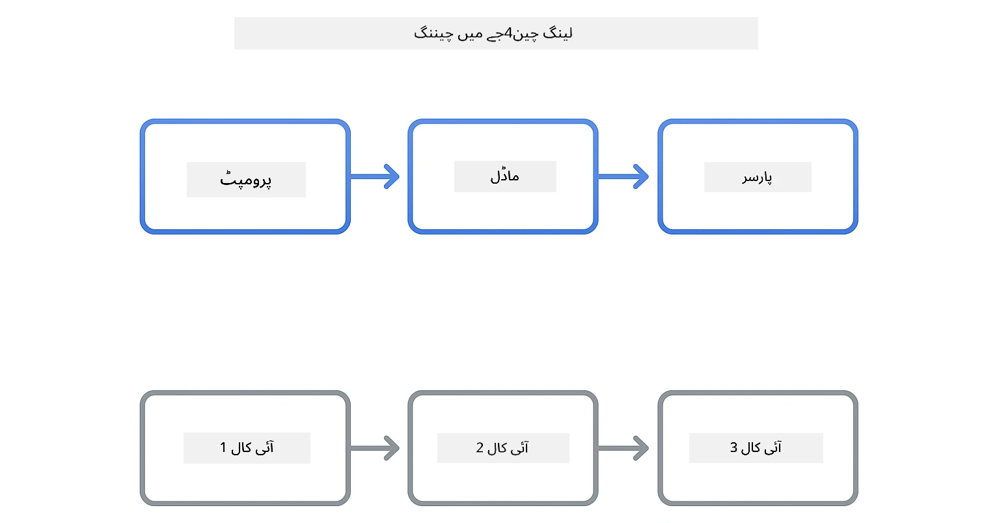
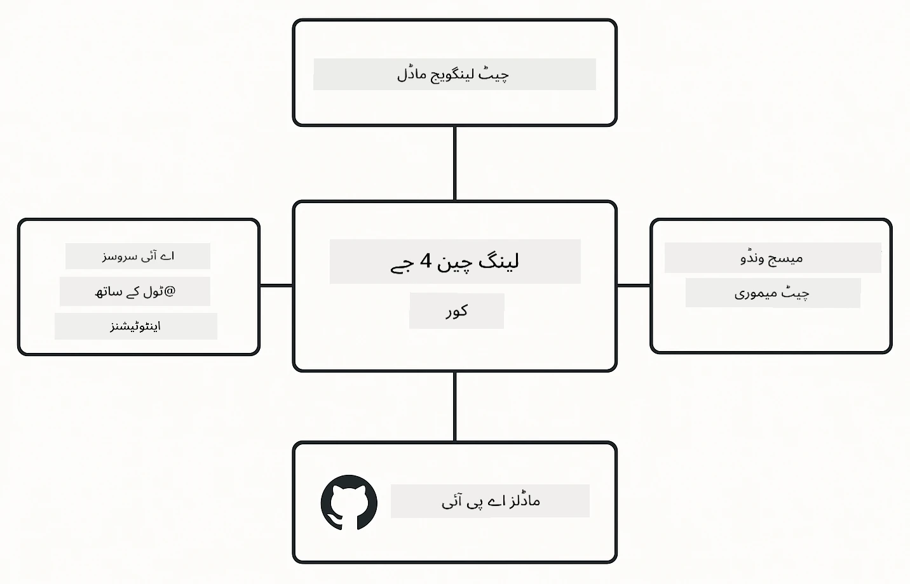

<!--
CO_OP_TRANSLATOR_METADATA:
{
  "original_hash": "22b5d7c8d7585325e38b37fd29eafe25",
  "translation_date": "2026-01-05T21:45:39+00:00",
  "source_file": "00-quick-start/README.md",
  "language_code": "ur"
}
-->
# ماڈیول 00: فوری آغاز

## فہرست مضامین

- [تعارف](../../../00-quick-start)
- [LangChain4j کیا ہے؟](../../../00-quick-start)
- [LangChain4j انحصارات](../../../00-quick-start)
- [ضروریات](../../../00-quick-start)
- [سیٹ اپ](../../../00-quick-start)
  - [1. اپنا گٹ ہب ٹوکن حاصل کریں](../../../00-quick-start)
  - [2. اپنا ٹوکن سیٹ کریں](../../../00-quick-start)
- [مثالیں چلائیں](../../../00-quick-start)
  - [1. بنیادی چیٹ](../../../00-quick-start)
  - [2. پرامپٹ پیٹرنز](../../../00-quick-start)
  - [3. فنکشن کالنگ](../../../00-quick-start)
  - [4. دستاویز سوال و جواب (RAG)](../../../00-quick-start)
  - [5. ذمہ دار AI](../../../00-quick-start)
- [ہر مثال کیا دکھاتی ہے](../../../00-quick-start)
- [اگلے اقدامات](../../../00-quick-start)
- [مسائل حل کرنا](../../../00-quick-start)

## تعارف

یہ فوری آغاز آپ کو LangChain4j کے ساتھ جلد از جلد چلانے کے لیے بنایا گیا ہے۔ یہ LangChain4j اور گٹ ہب ماڈلز کے ساتھ AI ایپلیکیشنز بنانے کی بنیادی باتوں کو شامل کرتا ہے۔ اگلے ماڈیولز میں آپ Azure OpenAI کو LangChain4j کے ساتھ استعمال کر کے مزید پیچیدہ ایپلیکیشنز بنائیں گے۔

## LangChain4j کیا ہے؟

LangChain4j ایک جاوا لائبریری ہے جو AI سے چلنے والی ایپلیکیشنز بنانے کو آسان بناتی ہے۔ HTTP کلائنٹس اور JSON پارسنگ کے بجائے آپ صاف جاوا API کے ساتھ کام کرتے ہیں۔

LangChain میں "چین" سے مراد متعدد اجزاء کو ایک ساتھ جوڑنا ہے - آپ ایک پرامپٹ کو ماڈل سے پارسر تک جوڑ سکتے ہیں، یا کئی AI کالز کو اس طرح جوڑ سکتے ہیں کہ ایک آؤٹ پٹ اگلے ان پٹ میں استعمال ہو۔ یہ فوری آغاز بنیادی باتوں پر توجہ دیتا ہے اس سے پہلے کہ پیچیدہ چینز کو دریافت کیا جائے۔



*LangChain4j میں چیننگ اجزاء - تعمیراتی بلاکس طاقتور AI ورک فلو بنانے کے لیے جڑتے ہیں*

ہم تین اہم اجزاء استعمال کریں گے:

**ChatLanguageModel** - AI ماڈل کے ساتھ تعامل کا انٹرفیس۔ `model.chat("prompt")` کال کریں اور جواب کے طور پر سٹرنگ حاصل کریں۔ ہم `OpenAiOfficialChatModel` استعمال کرتے ہیں جو GitHub ماڈلز جیسے OpenAI-مطابق اینڈپوائنٹس کے ساتھ کام کرتا ہے۔

**AiServices** - قسم محفوظ AI سروس انٹرفیس بناتا ہے۔ طریقے (methods) ڈیفائن کریں، انہیں `@Tool` سے تشریح کریں، اور LangChain4j تنظیم سنبھالتا ہے۔ AI خود بخود جب ضرورت ہو آپ کے جاوا طریقے کال کر لیتا ہے۔

**MessageWindowChatMemory** - گفتگو کی تاریخ برقرار رکھتا ہے۔ اس کے بغیر ہر درخواست آزاد ہوگی۔ اس کے ساتھ، AI پچھلے پیغامات یاد رکھتا ہے اور متعدد چکروں میں سیاق و سباق برقرار رکھتا ہے۔



*LangChain4j کی ساخت - بنیادی اجزاء مل کر آپ کی AI ایپلیکیشنز کو طاقت دیتے ہیں*

## LangChain4j انحصارات

یہ فوری آغاز [`pom.xml`](../../../00-quick-start/pom.xml) میں دو Maven انحصارات استعمال کرتا ہے:

```xml
<!-- Core LangChain4j library -->
<dependency>
    <groupId>dev.langchain4j</groupId>
    <artifactId>langchain4j</artifactId> <!-- Inherited from BOM in root pom.xml -->
</dependency>

<!-- OpenAI integration (works with GitHub Models) -->
<dependency>
    <groupId>dev.langchain4j</groupId>
    <artifactId>langchain4j-open-ai-official</artifactId> <!-- Inherited from BOM in root pom.xml -->
</dependency>
```

`langchain4j-open-ai-official` ماڈیول `OpenAiOfficialChatModel` کلاس فراہم کرتا ہے جو OpenAI-مطابق APIs سے جڑتا ہے۔ GitHub ماڈلز بھی اسی API فارمیٹ کا استعمال کرتے ہیں، اس لیے کوئی خاص ایڈاپٹر درکار نہیں - بس بنیادی URL کو `https://models.github.ai/inference` پر سیٹ کریں۔

## ضروریات

**Dev Container استعمال کر رہے ہیں؟** جاوا اور Maven پہلے سے نصب ہیں۔ آپ کو صرف گٹ ہب پرسنل ایکسیس ٹوکن کی ضرورت ہے۔

**مقامی ترقی:**
- جاوا 21+، Maven 3.9+
- گٹ ہب پرسنل ایکسیس ٹوکن (نیچے ہدایات موجود ہیں)

> **نوٹ:** یہ ماڈیول GitHub ماڈلز کا `gpt-4.1-nano` استعمال کرتا ہے۔ کوڈ میں ماڈل کا نام تبدیل نہ کریں - یہ GitHub کے دستیاب ماڈلز کے ساتھ کام کے لیے ترتیب دیا گیا ہے۔

## سیٹ اپ

### 1. اپنا گٹ ہب ٹوکن حاصل کریں

1. [GitHub Settings → Personal Access Tokens](https://github.com/settings/personal-access-tokens) پر جائیں
2. "Generate new token" پر کلک کریں
3. ایک وضاحتی نام رکھیں (مثلاً "LangChain4j Demo")
4. میعاد ختم ہونے کی تاریخ سیٹ کریں (7 دن تجویز شدہ)
5. "Account permissions" کے تحت "Models" کو "Read-only" کریں
6. "Generate token" پر کلک کریں
7. اپنا ٹوکن کاپی کریں اور محفوظ کریں - یہ دوبارہ نہیں دکھایا جائے گا

### 2. اپنا ٹوکن سیٹ کریں

**اختیار 1: VS Code استعمال کرنا (تجویز کردہ)**

اگر آپ VS Code استعمال کر رہے ہیں، تو پروجیکٹ کے روٹ میں `.env` فائل میں اپنا ٹوکن شامل کریں:

اگر `.env` فائل موجود نہ ہو، تو `.env.example` کو `.env` میں کاپی کریں یا نیا `.env` فائل پروجیکٹ روٹ میں بنائیں۔

**مثال `.env` فائل:**
```bash
# میں /workspaces/LangChain4j-for-Beginners/.env
GITHUB_TOKEN=your_token_here
```

پھر آپ ایکسپلورر میں کسی بھی ڈیمو فائل (مثلاً `BasicChatDemo.java`) پر دائیں کلک کر کے **"Run Java"** منتخب کر سکتے ہیں یا Run and Debug پینل کے لانچ کنفیگرینشنز استعمال کر سکتے ہیں۔

**اختیار 2: ٹرمینل استعمال کرنا**

ٹوکن کو ماحولیاتی متغیر کے طور پر سیٹ کریں:

**bash:**
```bash
export GITHUB_TOKEN=your_token_here
```

**PowerShell:**
```powershell
$env:GITHUB_TOKEN=your_token_here
```

## مثالیں چلائیں

**VS Code استعمال کرتے ہوئے:** کسی بھی ڈیمو فائل پر رائٹ کلک کریں اور **"Run Java"** منتخب کریں، یا Run and Debug پینل سے لانچ کنفیگرینشنز استعمال کریں (یقینی بنائیں کہ ٹوکن پہلے `.env` میں شامل ہے)۔

**Maven استعمال کرتے ہوئے:** متبادل طور پر، آپ کمانڈ لائن سے بھی چلا سکتے ہیں:

### 1. بنیادی چیٹ

**bash:**
```bash
mvn compile exec:java -Dexec.mainClass=com.example.langchain4j.quickstart.BasicChatDemo
```

**PowerShell:**
```powershell
mvn --% compile exec:java -Dexec.mainClass=com.example.langchain4j.quickstart.BasicChatDemo
```

### 2. پرامپٹ پیٹرنز

**bash:**
```bash
mvn compile exec:java -Dexec.mainClass=com.example.langchain4j.quickstart.PromptEngineeringDemo
```

**PowerShell:**
```powershell
mvn --% compile exec:java -Dexec.mainClass=com.example.langchain4j.quickstart.PromptEngineeringDemo
```

یہ زیرو شاٹ، فیو شاٹ، چین آف تھاٹ، اور رول بیسڈ پرامپٹنگ دکھاتا ہے۔

### 3. فنکشن کالنگ

**bash:**
```bash
mvn compile exec:java -Dexec.mainClass=com.example.langchain4j.quickstart.ToolIntegrationDemo
```

**PowerShell:**
```powershell
mvn --% compile exec:java -Dexec.mainClass=com.example.langchain4j.quickstart.ToolIntegrationDemo
```

AI خود بخود ضرورت کے وقت آپ کے جاوا طریقے کال کرتا ہے۔

### 4. دستاویز سوال و جواب (RAG)

**bash:**
```bash
mvn compile exec:java -Dexec.mainClass=com.example.langchain4j.quickstart.SimpleReaderDemo
```

**PowerShell:**
```powershell
mvn --% compile exec:java -Dexec.mainClass=com.example.langchain4j.quickstart.SimpleReaderDemo
```

`document.txt` کے مواد کے بارے میں سوالات کریں۔

### 5. ذمہ دار AI

**bash:**
```bash
mvn compile exec:java -Dexec.mainClass=com.example.langchain4j.quickstart.ResponsibleAIDemo
```

**PowerShell:**
```powershell
mvn --% compile exec:java -Dexec.mainClass=com.example.langchain4j.quickstart.ResponsibleAIDemo
```

دیکھیں کہ AI حفاظتی فلٹرز نقصان پہنچانے والے مواد کو کیسے روکتے ہیں۔

## ہر مثال کیا دکھاتی ہے

**بنیادی چیٹ** - [BasicChatDemo.java](../../../00-quick-start/src/main/java/com/example/langchain4j/quickstart/BasicChatDemo.java)

یہاں سے شروع کریں تاکہ LangChain4j کی سب سے سادہ شکل دیکھ سکیں۔ آپ ایک `OpenAiOfficialChatModel` بنائیں گے، `.chat()` کے ساتھ پرامپٹ بھیجیں گے، اور جواب حاصل کریں گے۔ یہ بنیاد دکھاتا ہے: کس طرح کسٹم اینڈپوائنٹس اور API کیز کے ساتھ ماڈلز کو ابتدائی شکل دی جاتی ہے۔ ایک بار جب آپ اس پیٹرن کو سمجھ لیں، باقی سب اس پر مبنی ہوگا۔

```java
ChatLanguageModel model = OpenAiOfficialChatModel.builder()
    .baseUrl("https://models.github.ai/inference")
    .apiKey(System.getenv("GITHUB_TOKEN"))
    .modelName("gpt-4.1-nano")
    .build();

String response = model.chat("What is LangChain4j?");
System.out.println(response);
```

> **🤖 [GitHub Copilot](https://github.com/features/copilot) چیٹ کے ساتھ آزما کر دیکھیں:** [`BasicChatDemo.java`](../../../00-quick-start/src/main/java/com/example/langchain4j/quickstart/BasicChatDemo.java) کھولیں اور پوچھیں:
> - "میں اس کوڈ میں GitHub Models سے Azure OpenAI میں کیسے تبدیل کروں؟"
> - "OpenAiOfficialChatModel.builder() میں کون سے دیگر پیرامیٹرز ترتیب دیے جا سکتے ہیں؟"
> - "میں مکمل جواب کا انتظار کیے بغیر اسٹریمنگ جوابات کیسے شامل کروں؟"

**پرامپٹ انجینئرنگ** - [PromptEngineeringDemo.java](../../../00-quick-start/src/main/java/com/example/langchain4j/quickstart/PromptEngineeringDemo.java)

اب جب آپ جانتے ہیں کہ ماڈل سے کیسے بات کی جاتی ہے، تو دیکھیں کہ آپ اسے کیا کہتے ہیں۔ یہ ڈیمو ایک ہی ماڈل سیٹ اپ استعمال کرتا ہے لیکن چار مختلف پرامپٹنگ پیٹرنز دکھاتا ہے۔ زیرو شاٹ پرامپٹس براہ راست ہدایات دیتے ہیں، فیو شاٹ پرامپٹس مثالوں سے سیکھتے ہیں، چین آف تھاٹ پرامپٹس وجوہات ظاہر کرتے ہیں، اور رول بیسڈ پرامپٹس سیاق و سباق قائم کرتے ہیں۔ آپ دیکھیں گے کہ ایک ہی ماڈل کس طرح آپ کی درخواست کی تشکیل کے مطابق مختلف نتائج دیتا ہے۔

```java
PromptTemplate template = PromptTemplate.from(
    "What's the best time to visit {{destination}} for {{activity}}?"
);

Prompt prompt = template.apply(Map.of(
    "destination", "Paris",
    "activity", "sightseeing"
));

String response = model.chat(prompt.text());
```

> **🤖 [GitHub Copilot](https://github.com/features/copilot) چیٹ کے ساتھ آزما کر دیکھیں:** [`PromptEngineeringDemo.java`](../../../00-quick-start/src/main/java/com/example/langchain4j/quickstart/PromptEngineeringDemo.java) کھولیں اور پوچھیں:
> - "زیرو شاٹ اور فیو شاٹ پرامپٹنگ میں کیا فرق ہے، اور کب کون سا استعمال کرنا چاہیے؟"
> - "ماڈل کے جوابات پر temperature پیرامیٹر کیسے اثر انداز ہوتا ہے؟"
> - "پروڈکشن میں پرامپٹ انجیکشن حملوں کو روکنے کے لیے کون سی تکنیکز ہیں؟"
> - "مشترکہ پیٹرنز کے لیے دوبارہ قابل استعمال PromptTemplate آبجیکٹس کیسے بنائیں؟"

**ٹول انٹیگریشن** - [ToolIntegrationDemo.java](../../../00-quick-start/src/main/java/com/example/langchain4j/quickstart/ToolIntegrationDemo.java)

یہاں LangChain4j طاقتور ہوتا ہے۔ آپ `AiServices` استعمال کرتے ہوئے ایسا AI اسسٹنٹ بنائیں گے جو آپ کے جاوا طریقے کال کر سکتا ہے۔ صرف طریقوں پر `@Tool("تفصیل")` کا ٹیگ لگائیں اور LangChain4j باقی کا انتظام کرتا ہے - AI خود بخود فیصلہ کرتا ہے کہ کب کون سا ٹول استعمال کرنا ہے۔ یہ فنکشن کالنگ کو ظاہر کرتا ہے، جو AI کو سوالات کے جواب دینے کے علاوہ عمل کرنے کی صلاحیت دیتی ہے۔

```java
@Tool("Performs addition of two numeric values")
public double add(double a, double b) {
    return a + b;
}

MathAssistant assistant = AiServices.create(MathAssistant.class, model);
String response = assistant.chat("What is 25 plus 17?");
```

> **🤖 [GitHub Copilot](https://github.com/features/copilot) چیٹ کے ساتھ آزما کر دیکھیں:** [`ToolIntegrationDemo.java`](../../../00-quick-start/src/main/java/com/example/langchain4j/quickstart/ToolIntegrationDemo.java) کھولیں اور پوچھیں:
> - "@Tool تشریح کیسے کام کرتی ہے اور LangChain4j اسے پس منظر میں کیسے سنبھالتا ہے؟"
> - "کیا AI بیک وقت کئی ٹولز کال کر کے پیچیدہ مسائل حل کر سکتا ہے؟"
> - "اگر کوئی ٹول استثنا پھینکے تو میں ایررز کو کیسے ہینڈل کروں؟"
> - "میں اس کیلکولیٹر مثال کے بجائے حقیقی API کیسے مربوط کروں؟"

**دستاویز سوال و جواب (RAG)** - [SimpleReaderDemo.java](../../../00-quick-start/src/main/java/com/example/langchain4j/quickstart/SimpleReaderDemo.java)

یہاں آپ RAG (ریکٹریول-آگمینٹڈ جنریشن) کی بنیاد دیکھیں گے۔ ماڈل کے تربیتی ڈیٹا پر انحصار کرنے کی بجائے، آپ [`document.txt`](../../../00-quick-start/document.txt) سے مواد لوڈ کرتے ہیں اور اسے پرامپٹ میں شامل کرتے ہیں۔ AI آپ کے دستاویز کی بنیاد پر جواب دیتا ہے، نہ کہ اس کی عمومی معلومات پر۔ یہ سسٹمز بنانے کا پہلا قدم ہے جو آپ کے اپنے ڈیٹا کے ساتھ کام کرتے ہیں۔

```java
Document document = FileSystemDocumentLoader.loadDocument("document.txt");
String content = document.text();

String prompt = "Based on this document: " + content + 
                "\nQuestion: What is the main topic?";
String response = model.chat(prompt);
```

> **نوٹ:** یہ سادہ طریقہ پورے دستاویز کو پرامپٹ میں لوڈ کرتا ہے۔ بڑی فائلوں (>10KB) کے لیے، آپ سیاق و سباق کی حدوں سے تجاوز کر جائیں گے۔ ماڈیول 03 چنکنگ اور ویکٹر سرچ کو پروڈکشن RAG سسٹمز کے لیے شامل کرتا ہے۔

> **🤖 [GitHub Copilot](https://github.com/features/copilot) چیٹ کے ساتھ آزما کر دیکھیں:** [`SimpleReaderDemo.java`](../../../00-quick-start/src/main/java/com/example/langchain4j/quickstart/SimpleReaderDemo.java) کھولیں اور پوچھیں:
> - "RAG ماڈل کی تربیتی ڈیٹا کے مقابلے میں AI ہیلوسینیشنز کو کیسے روکتا ہے؟"
> - "اس سادہ طریقے اور ریکٹریول کے لیے ویکٹر ایمبیڈنگز کے استعمال میں کیا فرق ہے؟"
> - "میں اسے کس طرح بڑھا سکتا ہوں تاکہ کئی دستاویزات یا بڑے نالج بیس سنبھال سکوں؟"
> - "AI کو صرف دیے گئے سیاق و سباق استعمال کرنے کے لیے پرامپٹ کی ساخت کے بہترین طریقے کیا ہیں؟"

**ذمہ دار AI** - [ResponsibleAIDemo.java](../../../00-quick-start/src/main/java/com/example/langchain4j/quickstart/ResponsibleAIDemo.java)

گہرائی میں دفاع کے ساتھ AI کی حفاظت کریں۔ یہ ڈیمو دو سطحوں کی حفاظت دکھاتا ہے جو مل کر کام کرتی ہیں:

**حصہ 1: LangChain4j ان پٹ گارڈریل** - خطرناک پرامپٹس کو LLM تک پہنچنے سے پہلے روکیں۔ اپنی مرضی کے گارڈریل بنائیں جو ممنوعہ کلیدی الفاظ یا پیٹرنز چیک کریں۔ یہ آپ کے کوڈ میں چلتے ہیں، اس لیے تیز اور مفت ہیں۔

```java
class DangerousContentGuardrail implements InputGuardrail {
    @Override
    public InputGuardrailResult validate(UserMessage userMessage) {
        String text = userMessage.singleText().toLowerCase();
        if (text.contains("explosives")) {
            return fatal("Blocked: contains prohibited keyword");
        }
        return success();
    }
}
```

**حصہ 2: پرووائیڈر سیفٹی فلٹرز** - GitHub ماڈلز میں بلٹ ان فلٹرز ہیں جو آپ کے گارڈریل کے چھوٹ جانے والے معاملات کو پکڑتے ہیں۔ آپ سخت بلاکس (HTTP 400 ایرر) دیکھیں گے سنجیدہ خلاف ورزیوں کے لیے اور نرم انکار جہاں AI مہذب انداز میں انکار کرتا ہے۔

> **🤖 [GitHub Copilot](https://github.com/features/copilot) چیٹ کے ساتھ آزما کر دیکھیں:** [`ResponsibleAIDemo.java`](../../../00-quick-start/src/main/java/com/example/langchain4j/quickstart/ResponsibleAIDemo.java) کھولیں اور پوچھیں:
> - "InputGuardrail کیا ہے اور میں اپنا کیسے بنا سکتا ہوں؟"
> - "سخت بلاک اور نرم انکار میں کیا فرق ہے؟"
> - "گارڈریل اور پرووائیڈر فلٹرز دونوں کو ساتھ کیوں استعمال کیا جائے؟"

## اگلے اقدامات

**اگلا ماڈیول:** [01-introduction - LangChain4j اور Azure پر gpt-5 کے ساتھ شروع کرنا](../01-introduction/README.md)

---

**نیویگیشن:** [← مرکزی صفحہ پر واپس](../README.md) | [اگلا: ماڈیول 01 - تعارف →](../01-introduction/README.md)

---

## مسائل حل کرنا

### پہلی بار Maven بلڈ

**مسئلہ:** ابتدائی `mvn clean compile` یا `mvn package` بہت وقت لیتا ہے (10-15 منٹ)

**سبب:** Maven کو پہلے بلڈ میں تمام پروجیکٹ انحصارات (جیسے Spring Boot, LangChain4j لائبریریاں، Azure SDKs) ڈاؤنلوڈ کرنے ہوتے ہیں۔

**حل:** یہ معمول کی بات ہے۔ اگلے بلڈز کہیں زیادہ تیز ہوں گے کیونکہ انحصارات مقامی کیشے میں محفوظ ہو جاتے ہیں۔ ڈاؤن لوڈ کا وقت آپ کے نیٹ ورک کی رفتار پر منحصر ہے۔

### PowerShell Maven کمانڈ نحو

**مسئلہ:** Maven کمانڈز میں خرابی ہوتی ہے `Unknown lifecycle phase ".mainClass=..."`

**سبب:** PowerShell `=` کو متغیر مختصی عامل سمجھتا ہے، جس سے Maven پراپرٹی نحو خراب ہو جاتی ہے۔
**حل**: Maven کمانڈ سے پہلے stop-parsing آپریٹر `--%` استعمال کریں:

**PowerShell:**
```powershell
mvn --% compile exec:java -Dexec.mainClass=com.example.langchain4j.quickstart.BasicChatDemo
```

**Bash:**
```bash
mvn compile exec:java -Dexec.mainClass=com.example.langchain4j.quickstart.BasicChatDemo
```

`--%` آپریٹر PowerShell کو باقی تمام دلائل کو بغیر کسی تشریح کے براہِ راست Maven کو منتقل کرنے کا کہتا ہے۔

### Windows PowerShell میں ایموجی کی نمائش

**مسئلہ**: PowerShell میں ایموجیز کی بجائے بے معنی کردار ظاہر ہوتے ہیں (مثلاً `????` یا `â??`)

**وجہ**: PowerShell کی ڈیفالٹ اینکوڈنگ UTF-8 ایموجیز کی حمایت نہیں کرتی

**حل**: جاوا ایپلیکیشنز چلانے سے پہلے یہ کمانڈ چلائیں:
```cmd
chcp 65001
```

یہ ٹرمینل میں UTF-8 اینکوڈنگ کو زبردستی فعال کرتا ہے۔ متبادل طور پر، Windows Terminal استعمال کریں جو بہتر یونیکوڈ سپورٹ فراہم کرتا ہے۔

### API کالز کو ڈیبگ کرنا

**مسئلہ**: توثیقی غلطیاں، ریٹ حدیں، یا AI ماڈل سے غیر متوقع جوابات

**حل**: مثالوں میں `.logRequests(true)` اور `.logResponses(true)` شامل ہیں تاکہ API کالز کنسول میں دکھائی جائیں۔ یہ توثیقی غلطیوں، ریٹ حدوں، یا غیر متوقع جوابات کو حل کرنے میں مدد دیتا ہے۔ پروڈکشن میں شور کم کرنے کے لیے ان فلگز کو ہٹا دیں۔

---

<!-- CO-OP TRANSLATOR DISCLAIMER START -->
**ڈس کلیمر**:  
یہ دستاویز AI ترجمہ سروس [Co-op Translator](https://github.com/Azure/co-op-translator) کے ذریعے ترجمہ کی گئی ہے۔ اگرچہ ہم درستگی کی کوشش کرتے ہیں، براہ کرم آگاہ رہیں کہ خودکار تراجم میں غلطیاں یا عدم درستیاں ہو سکتی ہیں۔ اصل دستاویز اپنی مادری زبان میں مستند ماخذ سمجھی جانی چاہیے۔ اہم معلومات کے لیے پیشہ ورانہ انسانی ترجمہ تجویز کیا جاتا ہے۔ اس ترجمے کے استعمال سے پیدا ہونے والی کسی بھی غلط فہمی یا غلط تشریح کی ذمہ داری ہم پر عائد نہیں ہوتی۔
<!-- CO-OP TRANSLATOR DISCLAIMER END -->