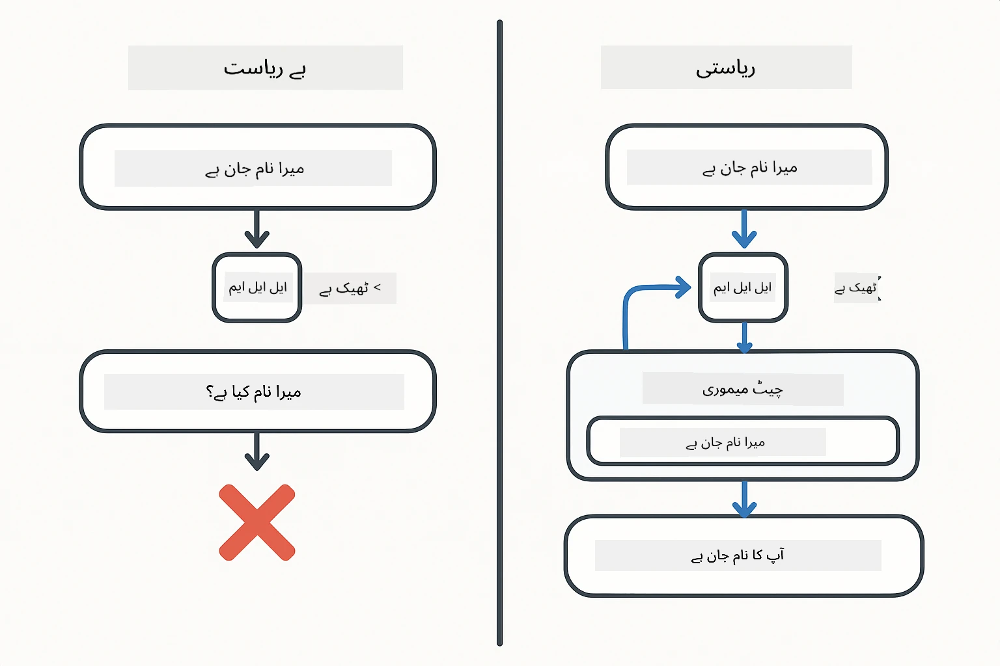
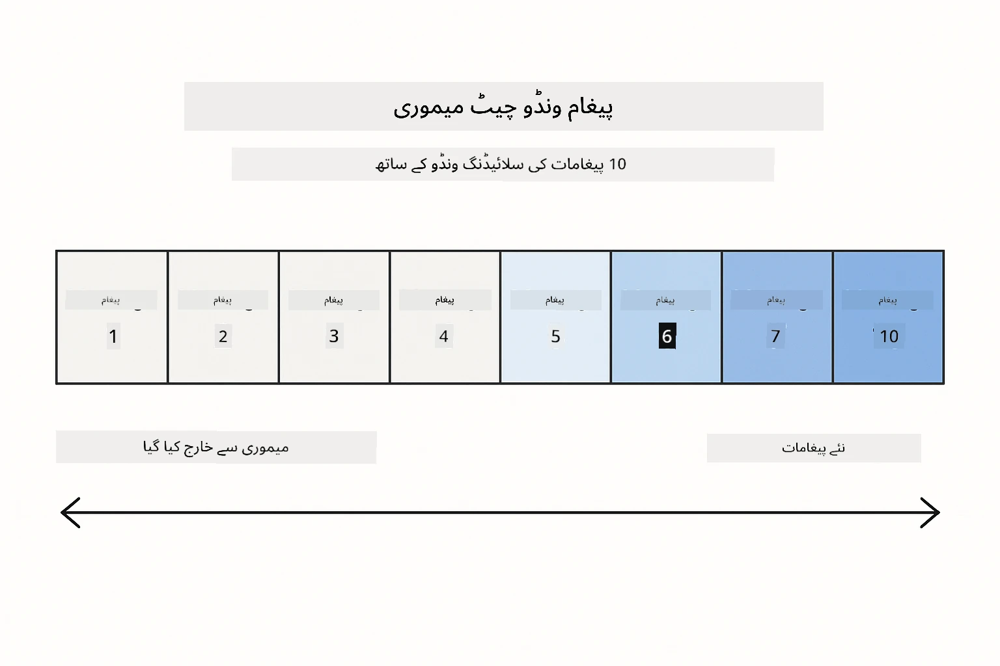
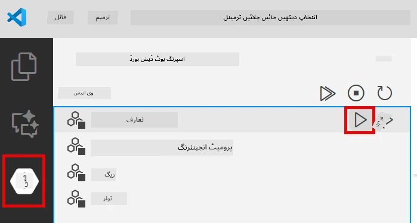
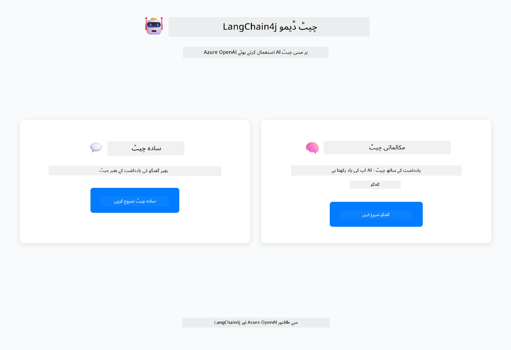
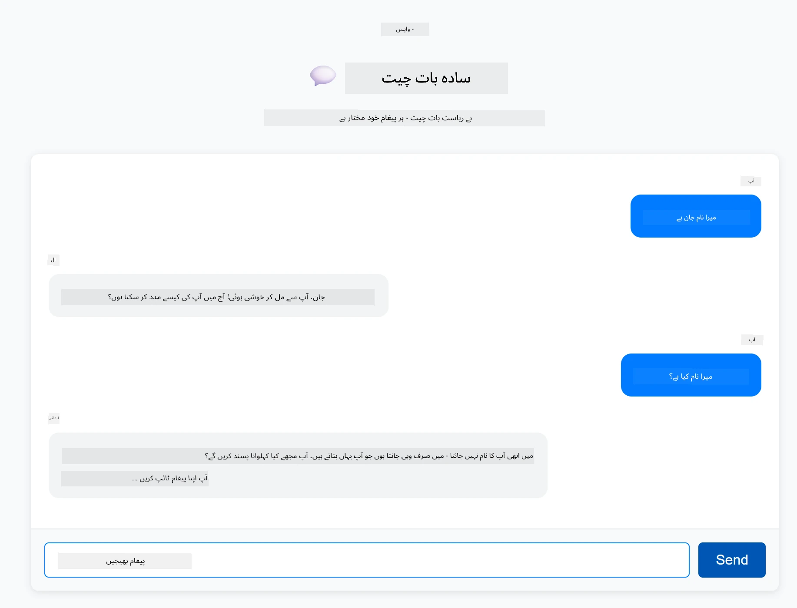
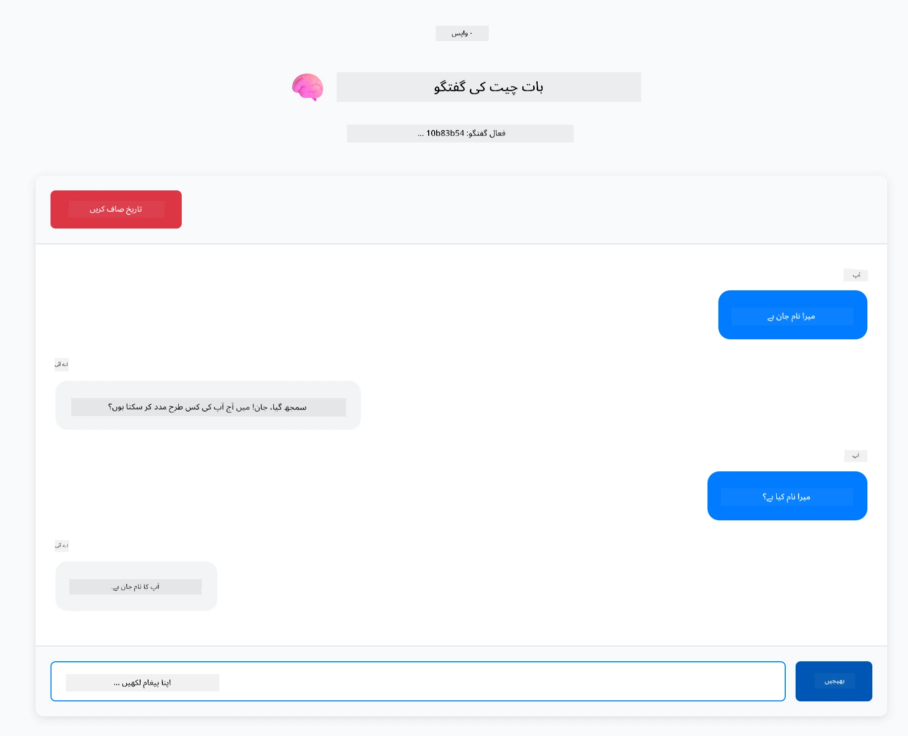

# ماڈیول 01: LangChain4j کے ساتھ شروعات

## فہرست مضامین

- [آپ کیا سیکھیں گے](../../../01-introduction)
- [ضروریات](../../../01-introduction)
- [بنیادی مسئلے کو سمجھنا](../../../01-introduction)
- [ٹوکنز کو سمجھنا](../../../01-introduction)
- [میموری کیسے کام کرتی ہے](../../../01-introduction)
- [یہ LangChain4j کیسے استعمال کرتا ہے](../../../01-introduction)
- [Azure OpenAI انفراسٹرکچر کی تعیناتی](../../../01-introduction)
- [ایپلیکیشن کو مقامی طور پر چلانا](../../../01-introduction)
- [ایپلیکیشن کا استعمال](../../../01-introduction)
  - [بغیر حالت چیٹ (بائیں پینل)](../../../01-introduction)
  - [حالت دار چیٹ (دائیں پینل)](../../../01-introduction)
- [اگلے اقدامات](../../../01-introduction)

## آپ کیا سیکھیں گے

اگر آپ نے فوری آغاز مکمل کیا ہے، تو آپ نے دیکھا کہ پرامپٹس کیسے بھیجے جاتے ہیں اور جوابات کیسے حاصل کیے جاتے ہیں۔ یہ بنیاد ہے، لیکن حقیقی ایپلیکیشنز کو اس سے زیادہ ضرورت ہوتی ہے۔ یہ ماڈیول آپ کو سکھاتا ہے کہ کس طرح بات چیت کرنے والی AI بنائیں جو سیاق و سباق کو یاد رکھتی ہے اور حالت کو برقرار رکھتی ہے - جو ایک وقتی ڈیمو اور پروڈکشن کے قابل ایپلیکیشن کے درمیان فرق ہے۔

ہم اس گائیڈ میں Azure OpenAI کے GPT-5 کا استعمال کریں گے کیونکہ اس کی اعلیٰ استدلال کی صلاحیتیں مختلف پیٹرنز کے رویے کو واضح کرتی ہیں۔ جب آپ میموری شامل کریں گے، تو آپ فرق واضح طور پر دیکھیں گے۔ اس سے یہ سمجھنا آسان ہو جاتا ہے کہ ہر جزو آپ کی ایپلیکیشن میں کیا لاتا ہے۔

آپ ایک ایسی ایپلیکیشن بنائیں گے جو دونوں پیٹرنز کو ظاہر کرتی ہے:

**بغیر حالت چیٹ** - ہر درخواست آزاد ہوتی ہے۔ ماڈل کو پچھلے پیغامات کی کوئی یادداشت نہیں ہوتی۔ یہ وہ پیٹرن ہے جو آپ نے فوری آغاز میں استعمال کیا تھا۔

**حالت دار گفتگو** - ہر درخواست میں گفتگو کی تاریخ شامل ہوتی ہے۔ ماڈل متعدد چکروں میں سیاق و سباق کو برقرار رکھتا ہے۔ یہی وہ چیز ہے جو پروڈکشن ایپلیکیشنز کو درکار ہوتی ہے۔

## ضروریات

- Azure سبسکرپشن جس میں Azure OpenAI تک رسائی ہو
- جاوا 21، میون 3.9+
- Azure CLI (https://learn.microsoft.com/en-us/cli/azure/install-azure-cli)
- Azure Developer CLI (azd) (https://learn.microsoft.com/en-us/azure/developer/azure-developer-cli/install-azd)

> **نوٹ:** جاوا، میون، Azure CLI اور Azure Developer CLI (azd) فراہم کردہ devcontainer میں پہلے سے انسٹال ہیں۔

> **نوٹ:** یہ ماڈیول Azure OpenAI پر GPT-5 استعمال کرتا ہے۔ تعیناتی خودکار طور پر `azd up` کے ذریعے ترتیب دی گئی ہے - کوڈ میں ماڈل کا نام تبدیل نہ کریں۔

## بنیادی مسئلے کو سمجھنا

زبان کے ماڈلز بغیر حالت کے ہوتے ہیں۔ ہر API کال آزاد ہوتی ہے۔ اگر آپ "میرا نام جان ہے" بھیجیں اور پھر پوچھیں "میرا نام کیا ہے؟"، تو ماڈل کو معلوم نہیں ہوتا کہ آپ نے ابھی اپنا تعارف کرایا ہے۔ یہ ہر درخواست کو ایسے سمجھتا ہے جیسے یہ آپ کی پہلی گفتگو ہو۔

یہ سادہ سوال و جواب کے لیے ٹھیک ہے لیکن حقیقی ایپلیکیشنز کے لیے بے کار ہے۔ کسٹمر سروس بوٹس کو یاد رکھنا ہوتا ہے کہ آپ نے کیا کہا تھا۔ ذاتی معاونین کو سیاق و سباق کی ضرورت ہوتی ہے۔ کوئی بھی کثیر چکر گفتگو میموری کی متقاضی ہوتی ہے۔



*بغیر حالت (آزاد کالز) اور حالت دار (سیاق و سباق سے آگاہ) گفتگو کے درمیان فرق*

## ٹوکنز کو سمجھنا

گفتگو میں غوطہ لگانے سے پہلے، ٹوکنز کو سمجھنا ضروری ہے - متن کی بنیادی اکائیاں جنہیں زبان کے ماڈلز پروسیس کرتے ہیں:


*مثال کہ کس طرح متن کو ٹوکنز میں توڑا جاتا ہے - "I love AI!" چار الگ الگ پروسیسنگ یونٹس بن جاتے ہیں*

ٹوکنز وہ طریقہ ہیں جن سے AI ماڈلز متن کو ناپتے اور پروسیس کرتے ہیں۔ الفاظ، رموزِ اوقاف، اور یہاں تک کہ خالی جگہیں بھی ٹوکنز ہو سکتی ہیں۔ آپ کے ماڈل کی ایک حد ہوتی ہے کہ وہ ایک وقت میں کتنے ٹوکنز پروسیس کر سکتا ہے (GPT-5 کے لیے 400,000، جس میں 272,000 ان پٹ ٹوکنز اور 128,000 آؤٹ پٹ ٹوکنز شامل ہیں)۔ ٹوکنز کو سمجھنا آپ کو گفتگو کی لمبائی اور لاگت کو منظم کرنے میں مدد دیتا ہے۔

## میموری کیسے کام کرتی ہے

چیٹ میموری بغیر حالت کے مسئلے کو حل کرتی ہے کیونکہ یہ گفتگو کی تاریخ کو برقرار رکھتی ہے۔ ماڈل کو اپنی درخواست بھیجنے سے پہلے، فریم ورک متعلقہ پچھلے پیغامات کو شامل کرتا ہے۔ جب آپ پوچھتے ہیں "میرا نام کیا ہے؟"، تو نظام درحقیقت پوری گفتگو کی تاریخ بھیجتا ہے، جس سے ماڈل دیکھ سکتا ہے کہ آپ نے پہلے کہا تھا "میرا نام جان ہے"۔

LangChain4j میموری کی ایسی امپلیمنٹیشنز فراہم کرتا ہے جو یہ خودکار طریقے سے سنبھالتی ہیں۔ آپ منتخب کرتے ہیں کہ کتنے پیغامات رکھنا ہیں اور فریم ورک سیاق و سباق کی ونڈو کو منظم کرتا ہے۔



*MessageWindowChatMemory حالیہ پیغامات کی سلائیڈنگ ونڈو برقرار رکھتا ہے، پرانے پیغامات خود بخود ہٹا دیتا ہے*

## یہ LangChain4j کیسے استعمال کرتا ہے

یہ ماڈیول فوری آغاز کو بڑھاتا ہے، Spring Boot کو شامل کرتا ہے اور گفتگو کی میموری کا اضافہ کرتا ہے۔ یہاں اجزاء کیسے جڑتے ہیں:

**انحصار** - دو LangChain4j لائبریریاں شامل کریں:

```xml
<dependency>
    <groupId>dev.langchain4j</groupId>
    <artifactId>langchain4j</artifactId> <!-- Inherited from BOM in root pom.xml -->
</dependency>
<dependency>
    <groupId>dev.langchain4j</groupId>
    <artifactId>langchain4j-open-ai-official</artifactId> <!-- Inherited from BOM in root pom.xml -->
</dependency>
```

**چیٹ ماڈل** - Azure OpenAI کو Spring bean کے طور پر ترتیب دیں ([LangChainConfig.java](../../../01-introduction/src/main/java/com/example/langchain4j/config/LangChainConfig.java)):

```java
@Bean
public OpenAiOfficialChatModel openAiOfficialChatModel() {
    return OpenAiOfficialChatModel.builder()
            .baseUrl(azureEndpoint)
            .apiKey(azureApiKey)
            .modelName(deploymentName)
            .timeout(Duration.ofMinutes(5))
            .maxRetries(3)
            .build();
}
```

بلڈر `azd up` کے ذریعے سیٹ کیے گئے ماحول کے متغیرات سے اسناد پڑھتا ہے۔ `baseUrl` کو آپ کے Azure اینڈپوائنٹ پر سیٹ کرنے سے OpenAI کلائنٹ Azure OpenAI کے ساتھ کام کرتا ہے۔

**گفتگو کی میموری** - MessageWindowChatMemory کے ساتھ چیٹ ہسٹری کو ٹریک کریں ([ConversationService.java](../../../01-introduction/src/main/java/com/example/langchain4j/service/ConversationService.java)):

```java
ChatMemory memory = MessageWindowChatMemory.withMaxMessages(10);

memory.add(UserMessage.from("My name is John"));
memory.add(AiMessage.from("Nice to meet you, John!"));

memory.add(UserMessage.from("What's my name?"));
AiMessage aiMessage = chatModel.chat(memory.messages()).aiMessage();
memory.add(aiMessage);
```

میموری `withMaxMessages(10)` کے ساتھ بنائیں تاکہ آخری 10 پیغامات رکھے جائیں۔ صارف اور AI کے پیغامات ٹائپڈ ریپرز کے ساتھ شامل کریں: `UserMessage.from(text)` اور `AiMessage.from(text)`۔ تاریخ `memory.messages()` سے حاصل کریں اور ماڈل کو بھیجیں۔ سروس ہر گفتگو ID کے لیے الگ میموری انسٹینسز رکھتی ہے، جس سے متعدد صارفین بیک وقت چیٹ کر سکتے ہیں۔

> **🤖 [GitHub Copilot](https://github.com/features/copilot) چیٹ کے ساتھ کوشش کریں:** [`ConversationService.java`](../../../01-introduction/src/main/java/com/example/langchain4j/service/ConversationService.java) کھولیں اور پوچھیں:
> - "MessageWindowChatMemory ونڈو بھرنے پر کون سے پیغامات چھوڑنے کا فیصلہ کیسے کرتا ہے؟"
> - "کیا میں میموری اسٹوریج کو ان میموری کے بجائے ڈیٹا بیس استعمال کرتے ہوئے کسٹم امپلیمنٹ کر سکتا ہوں؟"
> - "میں پرانی گفتگو کی تاریخ کو کمپریس کرنے کے لیے سمری کیسے شامل کر سکتا ہوں؟"

بغیر حالت چیٹ اینڈپوائنٹ میموری کو بالکل چھوڑ دیتا ہے - صرف `chatModel.chat(prompt)` جیسا کہ فوری آغاز میں تھا۔ حالت دار اینڈپوائنٹ پیغامات کو میموری میں شامل کرتا ہے، تاریخ حاصل کرتا ہے، اور ہر درخواست کے ساتھ وہ سیاق و سباق بھیجتا ہے۔ ماڈل کی ترتیب ایک جیسی ہے، پیٹرنز مختلف ہیں۔

## Azure OpenAI انفراسٹرکچر کی تعیناتی

**بش:**
```bash
cd 01-introduction
azd up  # سبسکرپشن اور مقام منتخب کریں (eastus2 کی سفارش کی جاتی ہے)
```

**پاور شیل:**
```powershell
cd 01-introduction
azd up  # سبسکرپشن اور مقام منتخب کریں (eastus2 کی سفارش کی جاتی ہے)
```

> **نوٹ:** اگر آپ کو ٹائم آؤٹ کی خرابی ملے (`RequestConflict: Cannot modify resource ... provisioning state is not terminal`)، تو بس دوبارہ `azd up` چلائیں۔ Azure وسائل پس منظر میں ابھی بھی تعیناتی کے مراحل میں ہو سکتے ہیں، اور دوبارہ کوشش کرنے سے تعیناتی مکمل ہو جائے گی جب وسائل حتمی حالت میں پہنچ جائیں گے۔

یہ کرے گا:
1. Azure OpenAI ریسورس GPT-5 اور text-embedding-3-small ماڈلز کے ساتھ تعینات کرے گا
2. خودکار طور پر پروجیکٹ روٹ میں `.env` فائل بنائے گا جس میں اسناد ہوں گی
3. تمام ضروری ماحول کے متغیرات سیٹ کرے گا

**تعیناتی میں مسائل؟** تفصیلی مسئلہ حل کے لیے [Infrastructure README](infra/README.md) دیکھیں جس میں سب ڈومین نام کے تنازعات، دستی Azure پورٹل تعیناتی کے مراحل، اور ماڈل کی ترتیب کی رہنمائی شامل ہے۔

**تعیناتی کی کامیابی کی تصدیق کریں:**

**بش:**
```bash
cat ../.env  # AZURE_OPENAI_ENDPOINT، API_KEY، وغیرہ دکھانا چاہیے۔
```

**پاور شیل:**
```powershell
Get-Content ..\.env  # AZURE_OPENAI_ENDPOINT، API_KEY، وغیرہ دکھانا چاہیے۔
```

> **نوٹ:** `azd up` کمانڈ خودکار طور پر `.env` فائل بناتی ہے۔ اگر آپ کو بعد میں اسے اپ ڈیٹ کرنا ہو، تو آپ یا تو `.env` فائل کو دستی طور پر ایڈٹ کریں یا اسے دوبارہ بنانے کے لیے یہ کمانڈ چلائیں:
>
> **بش:**
> ```bash
> cd ..
> bash .azd-env.sh
> ```
>
> **پاور شیل:**
> ```powershell
> cd ..
> .\.azd-env.ps1
> ```

## ایپلیکیشن کو مقامی طور پر چلانا

**تعیناتی کی تصدیق کریں:**

یقینی بنائیں کہ `.env` فائل روٹ ڈائریکٹری میں موجود ہے جس میں Azure کی اسناد ہوں:

**بش:**
```bash
cat ../.env  # AZURE_OPENAI_ENDPOINT، API_KEY، DEPLOYMENT دکھانا چاہیے
```

**پاور شیل:**
```powershell
Get-Content ..\.env  # دکھانا چاہیے AZURE_OPENAI_ENDPOINT، API_KEY، DEPLOYMENT
```

**ایپلیکیشنز شروع کریں:**

**اختیار 1: Spring Boot ڈیش بورڈ کا استعمال (VS Code صارفین کے لیے تجویز کردہ)**

devcontainer میں Spring Boot ڈیش بورڈ ایکسٹینشن شامل ہے، جو تمام Spring Boot ایپلیکیشنز کو منظم کرنے کے لیے بصری انٹرفیس فراہم کرتا ہے۔ آپ اسے VS Code کے بائیں جانب ایکٹیویٹی بار میں Spring Boot آئیکن کے طور پر دیکھ سکتے ہیں۔

Spring Boot ڈیش بورڈ سے آپ کر سکتے ہیں:
- ورک اسپیس میں دستیاب تمام Spring Boot ایپلیکیشنز دیکھیں
- ایک کلک سے ایپلیکیشنز شروع/روکیں
- ایپلیکیشن لاگز کو حقیقی وقت میں دیکھیں
- ایپلیکیشن کی حالت کی نگرانی کریں

بس "introduction" کے ساتھ پلے بٹن پر کلک کریں تاکہ یہ ماڈیول شروع ہو، یا تمام ماڈیولز کو ایک ساتھ شروع کریں۔



**اختیار 2: شیل اسکرپٹس کا استعمال**

تمام ویب ایپلیکیشنز (ماڈیولز 01-04) شروع کریں:

**بش:**
```bash
cd ..  # روٹ ڈائریکٹری سے
./start-all.sh
```

**پاور شیل:**
```powershell
cd ..  # روٹ ڈائریکٹری سے
.\start-all.ps1
```

یا صرف یہ ماڈیول شروع کریں:

**بش:**
```bash
cd 01-introduction
./start.sh
```

**پاور شیل:**
```powershell
cd 01-introduction
.\start.ps1
```

دونوں اسکرپٹس خودکار طور پر روٹ `.env` فائل سے ماحول کے متغیرات لوڈ کرتے ہیں اور اگر JARs موجود نہ ہوں تو انہیں بنائیں گے۔

> **نوٹ:** اگر آپ شروع کرنے سے پہلے تمام ماڈیولز کو دستی طور پر بنانا چاہتے ہیں:
>
> **بش:**
> ```bash
> cd ..  # Go to root directory
> mvn clean package -DskipTests
> ```
>
> **پاور شیل:**
> ```powershell
> cd ..  # Go to root directory
> mvn clean package -DskipTests
> ```

اپنے براؤزر میں http://localhost:8080 کھولیں۔

**رکنے کے لیے:**

**بش:**
```bash
./stop.sh  # یہ ماڈیول صرف
# یا
cd .. && ./stop-all.sh  # تمام ماڈیولز
```

**پاور شیل:**
```powershell
.\stop.ps1  # یہ ماڈیول صرف
# یا
cd ..; .\stop-all.ps1  # تمام ماڈیولز
```

## ایپلیکیشن کا استعمال

ایپلیکیشن ایک ویب انٹرفیس فراہم کرتی ہے جس میں دو چیٹ امپلیمنٹیشنز ساتھ ساتھ ہیں۔



*ڈیش بورڈ جو سادہ چیٹ (بغیر حالت) اور گفتگو چیٹ (حالت دار) دونوں آپشنز دکھا رہا ہے*

### بغیر حالت چیٹ (بائیں پینل)

پہلے یہ آزمائیں۔ پوچھیں "میرا نام جان ہے" اور فوراً بعد پوچھیں "میرا نام کیا ہے؟" ماڈل یاد نہیں رکھے گا کیونکہ ہر پیغام آزاد ہوتا ہے۔ یہ بنیادی زبان ماڈل انضمام کا بنیادی مسئلہ ظاہر کرتا ہے - کوئی گفتگو کا سیاق و سباق نہیں۔



*AI پچھلے پیغام سے آپ کا نام یاد نہیں رکھتا*

### حالت دار چیٹ (دائیں پینل)

اب یہی سلسلہ یہاں آزمائیں۔ پوچھیں "میرا نام جان ہے" اور پھر "میرا نام کیا ہے؟" اس بار یہ یاد رکھتا ہے۔ فرق MessageWindowChatMemory ہے - یہ گفتگو کی تاریخ برقرار رکھتا ہے اور ہر درخواست کے ساتھ شامل کرتا ہے۔ یہی طریقہ ہے جس سے پروڈکشن گفتگو AI کام کرتی ہے۔



*AI گفتگو کے شروع میں آپ کا نام یاد رکھتا ہے*

دونوں پینلز ایک ہی GPT-5 ماڈل استعمال کرتے ہیں۔ واحد فرق میموری ہے۔ یہ واضح کرتا ہے کہ میموری آپ کی ایپلیکیشن میں کیا لاتی ہے اور حقیقی استعمال کے لیے کیوں ضروری ہے۔

## اگلے اقدامات

**اگلا ماڈیول:** [02-prompt-engineering - GPT-5 کے ساتھ پرامپٹ انجینئرنگ](../02-prompt-engineering/README.md)

---

**نیویگیشن:** [← پچھلا: ماڈیول 00 - فوری آغاز](../00-quick-start/README.md) | [واپس مرکزی صفحہ](../README.md) | [اگلا: ماڈیول 02 - پرامپٹ انجینئرنگ →](../02-prompt-engineering/README.md)

---

<!-- CO-OP TRANSLATOR DISCLAIMER START -->
**دستخطی دستبرداری**:  
یہ دستاویز AI ترجمہ سروس [Co-op Translator](https://github.com/Azure/co-op-translator) کے ذریعے ترجمہ کی گئی ہے۔ اگرچہ ہم درستگی کے لیے کوشاں ہیں، براہ کرم آگاہ رہیں کہ خودکار ترجمے میں غلطیاں یا عدم درستیاں ہو سکتی ہیں۔ اصل دستاویز اپنی مادری زبان میں ہی معتبر ماخذ سمجھی جانی چاہیے۔ اہم معلومات کے لیے پیشہ ور انسانی ترجمہ کی سفارش کی جاتی ہے۔ اس ترجمے کے استعمال سے پیدا ہونے والی کسی بھی غلط فہمی یا غلط تشریح کی ذمہ داری ہم پر عائد نہیں ہوتی۔
<!-- CO-OP TRANSLATOR DISCLAIMER END -->