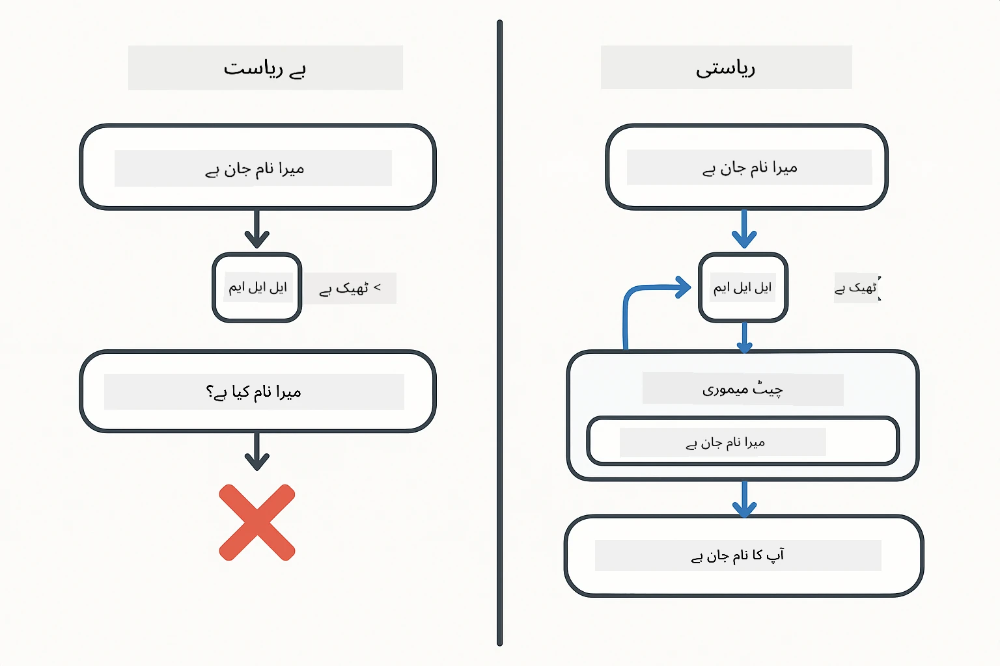
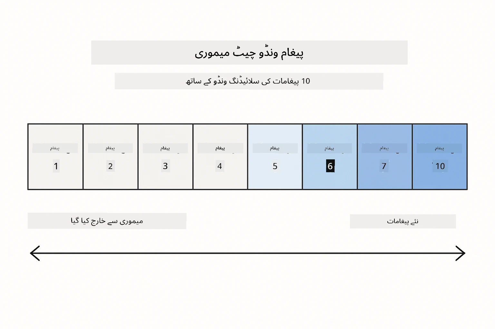
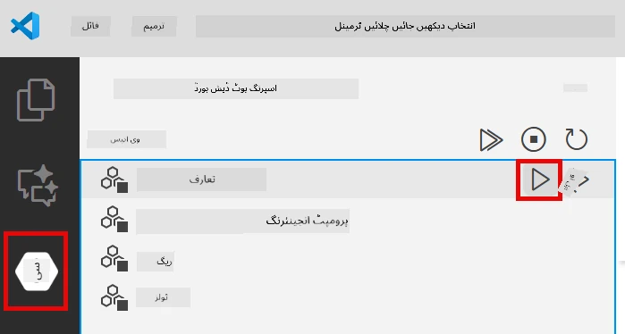
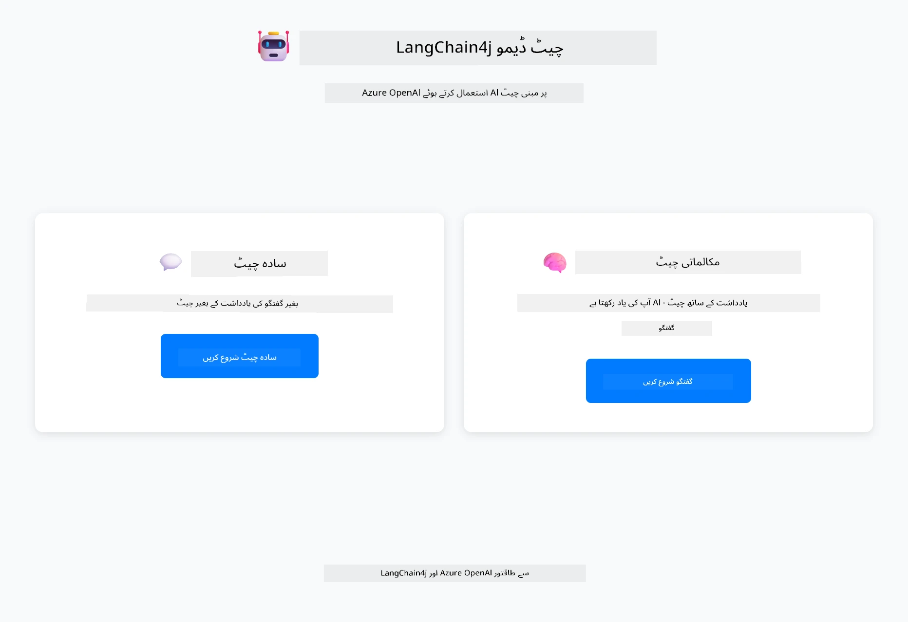
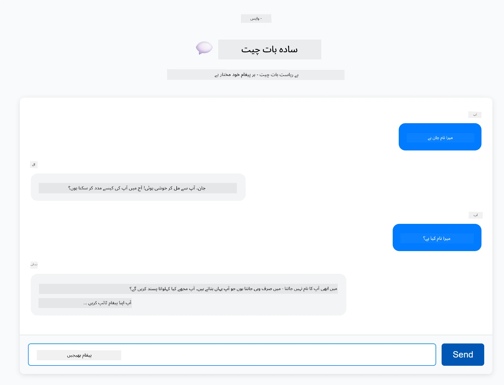
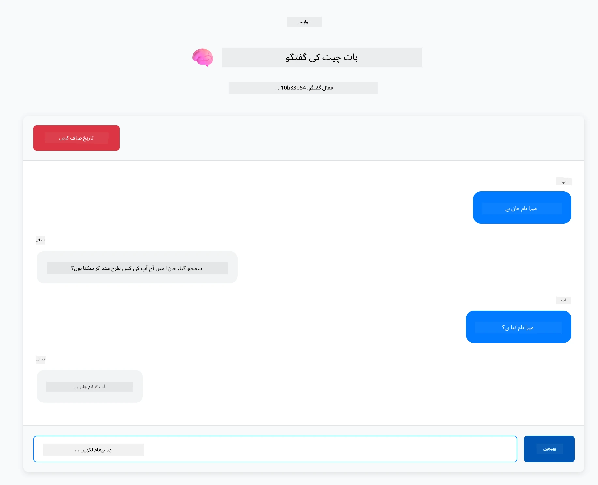

# ماڈیول 01: LangChain4j کے ساتھ شروعات

## فہرست مضامین

- [ویڈیو واک تھرو](#ویڈیو-واک-تھرو)
- [آپ کیا سیکھیں گے](#آپ-کیا-سیکھیں-گے)
- [اہم تقاضے](#اہم-تقاضے)
- [بنیادی مسئلے کو سمجھنا](#بنیادی-مسئلے-کو-سمجھنا)
- [ٹوکنز کو سمجھنا](#ٹوکنز-کو-سمجھنا)
- [میموری کیسے کام کرتی ہے](#میموری-کیسے-کام-کرتی-ہے)
- [LangChain4j کیسے استعمال کرتا ہے](#langchain4j-کیسے-استعمال-کرتا-ہے)
- [Azure OpenAI انفراسٹرکچر تعینات کریں](#azure-openai-انفراسٹرکچر-تعینات-کریں)
- [ایپلیکیشن کو لوکل طور پر چلائیں](#ایپلیکیشن-کو-لوکل-طور-پر-چلائیں)
- [ایپلیکیشن کا استعمال](#ایپلیکیشن-کا-استعمال)
  - [بغیر حالت چیٹ (بائیں پینل)](#بغیر-حالت-چیٹ-بائیں-پینل)
  - [حالت دار چیٹ (دائیں پینل)](#حالت-دار-چیٹ-دائیں-پینل)
- [اگلے اقدامات](#اگلے-اقدامات)

## ویڈیو واک تھرو

اس لائیو سیشن کو دیکھیں جو اس ماڈیول کے ساتھ شروعات کرنے کی وضاحت کرتا ہے:

<a href="https://www.youtube.com/live/nl_troDm8rQ?si=6b85S8xGjWnT2fX9"></a>

## آپ کیا سیکھیں گے

یہ LangChain4j اور Azure OpenAI کے ساتھ آپ کی شروعات ہے۔ ہم بنیادی باتوں سے آغاز کرتے ہیں اور پروڈکشن طرز کی ایپلیکیشنز بنانا شروع کرتے ہیں۔ یہ ماڈیول مکالماتی AI پر مرکوز ہے جو سیاق و سباق یاد رکھتا ہے اور حالت برقرار رکھتا ہے — بنیادی تصورات جن پر ہر بعد والا ماڈیول تعمیر ہوتا ہے۔

ہم اس گائیڈ میں Azure OpenAI کا GPT-5.2 استعمال کریں گے کیونکہ اس کی ترقی یافتہ منطق مختلف پیٹرنز کے رویے کو زیادہ واضح بناتی ہے۔ جب آپ میموری شامل کریں گے، تو فرق واضح طور پر نظر آئے گا۔ یہ سمجھنا آسان بناتا ہے کہ ہر جزو آپ کی ایپلیکیشن میں کیا فرق لے کر آتا ہے۔

آپ ایک ایسی ایپلیکیشن بنائیں گے جو دونوں پیٹرنز کو ظاہر کرے:

**بغیر حالت چیٹ** - ہر درخواست آزاد ہوتی ہے۔ ماڈل کو پچھلے پیغامات کی کوئی یادداشت نہیں ہوتی۔ یہ سب سے آسان شروعات ہے۔

**حالت دار گفتگو** - ہر درخواست میں گفتگو کی تاریخ شامل ہوتی ہے۔ ماڈل متعدد مباحثوں میں سیاق و سباق برقرار رکھتا ہے۔ یہی پروڈکشن ایپلیکیشنز کے لیے ضروری ہے۔

## اہم تقاضے

- Azure سبسکرپشن جس میں Azure OpenAI تک رسائی ہو
- جاوا 21، میون 3.9+
- Azure CLI (https://learn.microsoft.com/en-us/cli/azure/install-azure-cli)
- Azure Developer CLI (azd) (https://learn.microsoft.com/en-us/azure/developer/azure-developer-cli/install-azd)

> **نوٹ:** جاوا، میون، Azure CLI اور Azure Developer CLI (azd) فراہم کردہ devcontainer میں پہلے سے انسٹال شدہ ہیں۔

> **نوٹ:** یہ ماڈیول Azure OpenAI پر GPT-5.2 استعمال کرتا ہے۔ تعیناتی خودکار طریقے سے `azd up` کے ذریعے کی جاتی ہے - کوڈ میں ماڈل کا نام تبدیل نہ کریں۔

## بنیادی مسئلے کو سمجھنا

لسانی ماڈلز بغیر حالت کے ہوتے ہیں۔ ہر API کال آزاد ہوتی ہے۔ اگر آپ "میرا نام جان ہے" کہیں اور پھر پوچھیں "میرا نام کیا ہے؟"، تو ماڈل کو معلوم نہیں کہ آپ نے ابھی اپنا تعارف کرایا ہے۔ یہ ہر درخواست کو اس طرح سمجھتا ہے جیسے آپ کا یہ پہلا گفتگو ہو۔

یہ سادہ سوال جواب کے لیے ٹھیک ہے مگر حقیقی ایپلیکیشنز کے لیے غیر کارآمد ہے۔ کسٹمر سروس بوٹس کو یاد رکھنا ضروری ہوتا ہے کہ آپ نے کیا کہا تھا۔ ذاتی اسسٹنٹس کو سیاق و سباق چاہیے۔ کوئی بھی کثیر مباحثہ گفتگو میموری کا تقاضا کرتی ہے۔

مندرجہ ذیل خاکہ دونوں طریقوں کا موازنہ کرتا ہے — بائیں جانب بغیر حالت کال جو آپ کا نام بھول جاتی ہے؛ دائیں جانب حالت دار کال جو ChatMemory کے ساتھ آپ کا نام یاد رکھتی ہے۔



*بغیر حالت (آزاد کالز) اور حالت دار (سیاق و سباق جاننے والی) گفتگو کے درمیان فرق*

## ٹوکنز کو سمجھنا

گفتگو میں جانے سے پہلے، ٹوکنز کو سمجھنا ضروری ہے — زبان کے ماڈلز جو متن کو پروسیس کرتے ہیں ان کی بنیادی اکائیاں:


*متن کو ٹوکنز میں کیسے توڑا جاتا ہے کی مثال - "I love AI!" چار الگ پروسیسنگ یونٹس بن جاتے ہیں*

ٹوکنز AI ماڈلز کے لیے متن کو ناپنے اور پروسیس کرنے کا ذریعہ ہیں۔ الفاظ، رموز، اور یہاں تک کہ اسپیسز بھی ٹوکنز ہو سکتے ہیں۔ آپ کے ماڈل کی ایک حد ہے کہ وہ ایک وقت میں کتنے ٹوکنز کو پروسیس کر سکتا ہے (GPT-5.2 کے لیے 400,000، جن میں سے 272,000 ان پٹ اور 128,000 آؤٹ پٹ ٹوکنز ہو سکتے ہیں)۔ ٹوکنز کو سمجھنا مدد دیتا ہے آپ کو گفتگو کی لمبائی اور لاگت کا انتظام کرنے میں۔

## میموری کیسے کام کرتی ہے

چیٹ میموری بغیر حالت کے مسئلے کو گفتگو کی تاریخ برقرار رکھ کر حل کرتی ہے۔ ماڈل کو آپ کی درخواست بھیجنے سے پہلے، فریم ورک متعلقہ پچھلے پیغامات شامل کرتا ہے۔ جب آپ پوچھتے ہیں "میرا نام کیا ہے؟"، تو سسٹم حقیقت میں پوری گفتگو کی تاریخ بھیجتا ہے، جس سے ماڈل دیکھ سکتا ہے کہ آپ نے پہلے کہا تھا "میرا نام جان ہے۔"

LangChain4j ایسی میموری کی امپلیمنٹس فراہم کرتا ہے جو خودکار طریقے سے یہ سنبھالتی ہیں۔ آپ طے کرتے ہیں کہ کتنے پیغامات محفوظ کرنے ہیں اور فریم ورک سیاق و سباق کی ونڈو کو منظم کرتا ہے۔ نیچے دیا گیا خاکہ دکھاتا ہے کہ MessageWindowChatMemory حالیہ پیغامات کی سلائڈنگ ونڈو کیسے برقرار رکھتی ہے۔



*MessageWindowChatMemory حالیہ پیغامات کی سلائڈنگ ونڈو برقرار رکھتی ہے، خود بخود پرانے پیغامات کو حذف کرتی ہے*

## LangChain4j کیسے استعمال کرتا ہے

یہ ماڈیول Spring Boot کو یکجا کرتا ہے اور گفتگو کی میموری شامل کرتا ہے۔ یہ ہے کہ اجزاء کیسے جُڑتے ہیں:

**ڈیپینڈنسیز** — دو LangChain4j لائبریریز شامل کریں:

```xml
<dependency>
    <groupId>dev.langchain4j</groupId>
    <artifactId>langchain4j</artifactId> <!-- Inherited from BOM in root pom.xml -->
</dependency>
<dependency>
    <groupId>dev.langchain4j</groupId>
    <artifactId>langchain4j-open-ai-official</artifactId> <!-- Inherited from BOM in root pom.xml -->
</dependency>
```

**چیٹ ماڈل** — Azure OpenAI کو Spring bean کے طور پر کنفیگر کریں ([LangChainConfig.java](../../../01-introduction/src/main/java/com/example/langchain4j/config/LangChainConfig.java)):

```java
@Bean
public OpenAiOfficialChatModel openAiOfficialChatModel() {
    return OpenAiOfficialChatModel.builder()
            .baseUrl(azureEndpoint)
            .apiKey(azureApiKey)
            .modelName(deploymentName)
            .timeout(Duration.ofMinutes(5))
            .maxRetries(3)
            .build();
}
```

بلڈر environment variables سے اسناد پڑھتا ہے جو `azd up` نے سیٹ کی ہیں۔ `baseUrl` کو آپ کے Azure اینڈپوائنٹ پر سیٹ کرنے سے OpenAI کلائنٹ Azure OpenAI کے ساتھ کام کرتا ہے۔

**گفتگو میموری** — MessageWindowChatMemory کے ساتھ چیٹ ہسٹری کو ٹریک کریں ([ConversationService.java](../../../01-introduction/src/main/java/com/example/langchain4j/service/ConversationService.java)):

```java
ChatMemory memory = MessageWindowChatMemory.withMaxMessages(10);

memory.add(UserMessage.from("My name is John"));
memory.add(AiMessage.from("Nice to meet you, John!"));

memory.add(UserMessage.from("What's my name?"));
AiMessage aiMessage = chatModel.chat(memory.messages()).aiMessage();
memory.add(aiMessage);
```

میموری تخلیق کریں `withMaxMessages(10)` کے ساتھ تاکہ آخری 10 پیغامات محفوظ ہوں۔ یوزر اور AI پیغامات کو ٹائپڈ ریپیرز کے ساتھ شامل کریں: `UserMessage.from(text)` اور `AiMessage.from(text)`۔ `memory.messages()` کے ذریعے تاریخ بازیافت کریں اور اسے ماڈل کو بھیجیں۔ سروس ہر گفتگو کی ID کے لیے الگ میموری انسٹنس ذخیرہ کرتی ہے، جو ایک ساتھ متعدد یوزرز کو چیٹ کرنے دیتی ہے۔

> **🤖 [GitHub Copilot](https://github.com/features/copilot) چیٹ کے ساتھ آزمائیں:** [`ConversationService.java`](../../../01-introduction/src/main/java/com/example/langchain4j/service/ConversationService.java) کھولیں اور پوچھیں:
> - "MessageWindowChatMemory جب ونڈو مکمل ہو تو کون سے پیغامات حذف کرنے کا فیصلہ کیسے کرتا ہے؟"
> - "کیا میں میموری کو ان میموری کے بجائے ڈیٹا بیس میں اسٹور کرنے کی اپنی امپلیمنٹیشن کر سکتا ہوں؟"
> - "میں پرانی گفتگو کی تاریخ کو کمپریس کرنے کے لیے سمری کیسے شامل کر سکتا ہوں؟"

بغیر حالت چیٹ اینڈپوائنٹ میموری کو مکمل نظر انداز کرتا ہے - صرف `chatModel.chat(prompt)` جیسا کہ فوری شروعات میں ہوتا ہے۔ حالت دار اینڈپوائنٹ میموری میں پیغامات شامل کرتا ہے، تاریخ بازیافت کرتا ہے، اور ہر درخواست کے ساتھ وہ سیاق و سباق بھیجتا ہے۔ ماڈل کی کانفیگریشن ایک جیسی ہے، فرق صرف پیٹرنز میں ہے۔

## Azure OpenAI انفراسٹرکچر تعینات کریں

**Bash:**
```bash
cd 01-introduction
azd up  # سبسکرپشن اور محل وقوع منتخب کریں (eastus2 تجویز کردہ)
```

**PowerShell:**
```powershell
cd 01-introduction
azd up  # سبسکرپشن اور مقام منتخب کریں (eastus2 کی سفارش کی گئی)
```

> **نوٹ:** اگر آپ کو ٹائم آؤٹ ایرر (`RequestConflict: Cannot modify resource ... provisioning state is not terminal`) ملے تو بس دوبارہ `azd up` چلائیں۔ Azure ریسورسز ابھی پس منظر میں provision ہو رہے ہوتے ہیں، اور دوبارہ کوشش کرنے سے تعیناتی مکمل ہو جاتی ہے جب ریسورسز terminal state تک پہنچیں۔

یہ کرے گا:
1. Azure OpenAI ریسورس کو GPT-5.2 اور text-embedding-3-small ماڈلز کے ساتھ تعینات کرے گا
2. خودکار طریقے سے پراجیکٹ کے روٹ میں `.env` فائل تخلیق کرے گا جس میں اسناد ہوں گی
3. تمام ضروری environment variables سیٹ کرے گا

**تعیناتی کے مسائل؟** تفصیلی مسئلہ حل کے لیے [Infrastructure README](infra/README.md) دیکھیں، جس میں سب ڈومین نام کے تنازعات، دستی Azure Portal تعیناتی کے مراحل، اور ماڈل ترتیب کی رہنمائی شامل ہے۔

**تصدیق کریں کہ تعیناتی کامیاب ہوئی:**

**Bash:**
```bash
cat ../.env  # AZURE_OPENAI_ENDPOINT، API_KEY، وغیرہ دکھانا چاہیے۔
```

**PowerShell:**
```powershell
Get-Content ..\.env  # AZURE_OPENAI_ENDPOINT، API_KEY، وغیرہ دکھانا چاہئے۔
```

> **نوٹ:** `azd up` کمانڈ خودکار طور پر `.env` فائل جنریٹ کرتا ہے۔ اگر آپ کو اسے بعد میں اپ ڈیٹ کرنا ہو، تو آپ یا تو `.env` فائل کو دستی طور پر ایڈیٹ کریں یا اسے دوبارہ بنانے کے لیے چلائیں:
>
> **Bash:**
> ```bash
> cd ..
> bash .azd-env.sh
> ```
>
> **PowerShell:**
> ```powershell
> cd ..
> .\.azd-env.ps1
> ```

## ایپلیکیشن کو لوکل طور پر چلائیں

**تصدیق کریں تعیناتی مکمل ہے:**

یقین دہانی کریں کہ `.env` فائل روٹ ڈائریکٹری میں Azure اسناد کے ساتھ موجود ہے۔ اسے ماڈیول ڈائریکٹری (`01-introduction/`) سے چلائیں:

**Bash:**
```bash
cat ../.env  # AZURE_OPENAI_ENDPOINT، API_KEY، DEPLOYMENT دکھانا چاہئے
```

**PowerShell:**
```powershell
Get-Content ..\.env  # AZURE_OPENAI_ENDPOINT، API_KEY، DEPLOYMENT دکھانا چاہیے
```

**ایپلیکیشنز شروع کریں:**

**اختیار 1: Spring Boot ڈیش بورڈ استعمال کریں (VS Code صارفین کے لیے تجویز کردہ)**

devcontainer میں Spring Boot Dashboard ایکسٹینشن شامل ہے، جو تمام Spring Boot ایپلیکیشنز کو منظم کرنے کے لیے بصری انٹرفیس فراہم کرتا ہے۔ آپ اسے VS Code کی Activity Bar کے بائیں جانب Spring Boot آئیکن کے ذریعے دیکھ سکتے ہیں۔

Spring Boot Dashboard سے آپ کر سکتے ہیں:
- ورک اسپیس میں موجود تمام Spring Boot ایپلیکیشنز دیکھیں
- ایک کلک سے ایپلیکیشنز شروع/روکیں
- ریئل ٹائم میں ایپلیکیشن لاگز دیکھیں
- ایپلیکیشن کی صورتحال مانیٹر کریں

بس "introduction" کے ساتھ پلے بٹن پر کلک کریں تاکہ یہ ماڈیول شروع ہو، یا تمام ماڈیولز ایک ساتھ شروع کریں۔



*VS Code میں Spring Boot Dashboard — تمام ماڈیولز کو ایک جگہ سے شروع، روکیں اور مانیٹر کریں*

**اختیار 2: شیل اسکرپٹس استعمال کریں**

تمام ویب ایپلیکیشنز شروع کریں (ماڈیولز 01-04):

**Bash:**
```bash
cd ..  # روٹ ڈائریکٹری سے
./start-all.sh
```

**PowerShell:**
```powershell
cd ..  # روٹ ڈائریکٹری سے
.\start-all.ps1
```

یا صرف یہ ماڈیول شروع کریں:

**Bash:**
```bash
cd 01-introduction
./start.sh
```

**PowerShell:**
```powershell
cd 01-introduction
.\start.ps1
```

دونوں اسکرپٹس خودکار طور پر روٹ `.env` فائل سے environment variables لوڈ کرتے ہیں اور اگر JARs موجود نہ ہوں تو انہیں بنائیں گے۔

> **نوٹ:** اگر آپ تمام ماڈیولز کو شروع کرنے سے پہلے دستی طور پر بنانا چاہیں:
>
> **Bash:**
> ```bash
> cd ..  # Go to root directory
> mvn clean package -DskipTests
> ```
>
> **PowerShell:**
> ```powershell
> cd ..  # Go to root directory
> mvn clean package -DskipTests
> ```

اپنے براؤزر میں http://localhost:8080 کھولیں۔

**رکنے کے لیے:**

**Bash:**
```bash
./stop.sh  # یہ ماڈیول صرف
# یا
cd .. && ./stop-all.sh  # تمام ماڈیولز
```

**PowerShell:**
```powershell
.\stop.ps1  # یہ ماڈیول صرف
# یا
cd ..; .\stop-all.ps1  # تمام ماڈیولز
```

## ایپلیکیشن کا استعمال

ایپلیکیشن ویب انٹرفیس فراہم کرتی ہے جس میں دو چیٹ امپلیمنٹیشنز ساتھ ساتھ ہیں۔



*ڈیش بورڈ جو دونوں سادہ چیٹ (بغیر حالت) اور مکالماتی چیٹ (حالت دار) آپشنز دکھاتا ہے*

### بغیر حالت چیٹ (بائیں پینل)

پہلے یہ آزمائیں۔ کہیں "میرا نام جان ہے" اور فوراً پوچھیں "میرا نام کیا ہے؟" ماڈل یاد نہیں رکھے گا کیونکہ ہر پیغام آزاد ہوتا ہے۔ یہ بنیادی زبان ماڈل انضمام کی اصل مسئلہ کو ظاہر کرتا ہے - کوئی گفتگو کا سیاق و سباق نہیں۔



*AI پچھلے پیغام سے آپ کا نام یاد نہیں رکھتا*

### حالت دار چیٹ (دائیں پینل)

اب یہاں وہی سلسلہ آزمائیں۔ کہیں "میرا نام جان ہے" اور پھر "میرا نام کیا ہے؟" اس بار یہ یاد رکھتا ہے۔ فرق MessageWindowChatMemory ہے — یہ گفتگو کی تاریخ محفوظ رکھتا ہے اور ہر درخواست کے ساتھ شامل کرتا ہے۔ یہی طریقہ کار پروڈکشن مکالماتی AI میں ہوتا ہے۔



*AI آپ کے گفتگو کے شروع میں کہا ہوا نام یاد رکھتا ہے*

دونوں پینلز ایک ہی GPT-5.2 ماڈل استعمال کرتے ہیں۔ واحد فرق میموری ہے۔ یہ واضح کرتا ہے کہ میموری آپ کی ایپلیکیشن میں کیا قدر لاتی ہے اور یہ حقیقی استعمال کے لیے ضروری کیوں ہے۔

## اگلے اقدامات

**اگلا ماڈیول:** [02-prompt-engineering - GPT-5.2 کے ساتھ پرامپٹ انجینئرنگ](../02-prompt-engineering/README.md)

---

**نیویگیشن:** [← واپس مرکزی صفحہ](../README.md) | [آگے: ماڈیول 02 - پرامپٹ انجینئرنگ →](../02-prompt-engineering/README.md)

---

<!-- CO-OP TRANSLATOR DISCLAIMER START -->
**ڈس کلیمر**:
یہ دستاویز AI ترجمہ سروس [Co-op Translator](https://github.com/Azure/co-op-translator) کے ذریعے ترجمہ کی گئی ہے۔ جبکہ ہم درستگی کے لیے کوشاں ہیں، براہ کرم اس بات سے آگاہ رہیں کہ خودکار ترجمے میں غلطیاں یا عدم درستیاں ہو سکتی ہیں۔ اصل دستاویز اپنے مادری زبان میں مستند ماخذ سمجھی جائے گی۔ حساس معلومات کے لیے پیشہ ور انسانی ترجمہ کی سفارش کی جاتی ہے۔ اس ترجمے کے استعمال سے پیدا ہونے والی کسی بھی غلط فہمی یا غلط تشریح کی ذمہ داری ہم قبول نہیں کرتے۔
<!-- CO-OP TRANSLATOR DISCLAIMER END -->