<!--
CO_OP_TRANSLATOR_METADATA:
{
  "original_hash": "8d787826cad7e92bf5cdbd116b1e6116",
  "translation_date": "2025-12-13T15:51:07+00:00",
  "source_file": "02-prompt-engineering/README.md",
  "language_code": "ur"
}
-->
# ماڈیول 02: GPT-5 کے ساتھ پرامپٹ انجینئرنگ

## فہرست مضامین

- [آپ کیا سیکھیں گے](../../../02-prompt-engineering)
- [ضروریات](../../../02-prompt-engineering)
- [پرامپٹ انجینئرنگ کو سمجھنا](../../../02-prompt-engineering)
- [یہ LangChain4j کیسے استعمال کرتا ہے](../../../02-prompt-engineering)
- [بنیادی پیٹرنز](../../../02-prompt-engineering)
- [موجودہ Azure وسائل کا استعمال](../../../02-prompt-engineering)
- [ایپلیکیشن کے اسکرین شاٹس](../../../02-prompt-engineering)
- [پیٹرنز کی کھوج](../../../02-prompt-engineering)
  - [کم بمقابلہ زیادہ جوش](../../../02-prompt-engineering)
  - [ٹاسک ایگزیکیوشن (ٹول پری ایمبلز)](../../../02-prompt-engineering)
  - [خود عکاسی کرنے والا کوڈ](../../../02-prompt-engineering)
  - [منظم تجزیہ](../../../02-prompt-engineering)
  - [کئی مرحلوں کی بات چیت](../../../02-prompt-engineering)
  - [قدم بہ قدم استدلال](../../../02-prompt-engineering)
  - [محدود آؤٹ پٹ](../../../02-prompt-engineering)
- [آپ واقعی کیا سیکھ رہے ہیں](../../../02-prompt-engineering)
- [اگلے اقدامات](../../../02-prompt-engineering)

## آپ کیا سیکھیں گے

پچھلے ماڈیول میں، آپ نے دیکھا کہ میموری کس طرح بات چیت کرنے والے AI کو ممکن بناتی ہے اور بنیادی تعاملات کے لیے GitHub ماڈلز استعمال کیے۔ اب ہم اس بات پر توجہ دیں گے کہ آپ سوالات کیسے پوچھتے ہیں - یعنی پرامپٹس خود - Azure OpenAI کے GPT-5 کا استعمال کرتے ہوئے۔ آپ کے پرامپٹس کی ساخت اس بات پر گہرا اثر ڈالتی ہے کہ آپ کو جوابات کیسا معیار ملتا ہے۔

ہم GPT-5 استعمال کریں گے کیونکہ یہ استدلال کنٹرول متعارف کراتا ہے - آپ ماڈل کو بتا سکتے ہیں کہ جواب دینے سے پہلے کتنا سوچنا ہے۔ اس سے مختلف پرامپٹنگ حکمت عملیاں واضح ہوتی ہیں اور آپ کو سمجھنے میں مدد ملتی ہے کہ کب کون سا طریقہ استعمال کرنا ہے۔ ہم Azure کی کم ریٹ لمٹس سے بھی فائدہ اٹھائیں گے جو GPT-5 کے لیے GitHub ماڈلز کے مقابلے میں بہتر ہیں۔

## ضروریات

- ماڈیول 01 مکمل کیا ہوا ہو (Azure OpenAI وسائل تعینات کیے ہوئے)
- روٹ ڈائریکٹری میں `.env` فائل Azure کی اسناد کے ساتھ (جو ماڈیول 01 میں `azd up` کے ذریعے بنائی گئی ہو)

> **نوٹ:** اگر آپ نے ماڈیول 01 مکمل نہیں کیا تو پہلے وہاں دی گئی تعیناتی کی ہدایات پر عمل کریں۔

## پرامپٹ انجینئرنگ کو سمجھنا

پرامپٹ انجینئرنگ اس بات کے بارے میں ہے کہ آپ ایسا ان پٹ ٹیکسٹ ڈیزائن کریں جو مستقل طور پر آپ کو مطلوبہ نتائج دے۔ یہ صرف سوالات پوچھنے کے بارے میں نہیں ہے - بلکہ درخواستوں کو اس طرح ترتیب دینے کے بارے میں ہے کہ ماڈل بالکل سمجھ جائے کہ آپ کیا چاہتے ہیں اور اسے کیسے فراہم کرنا ہے۔

اسے ایسے سمجھیں جیسے آپ کسی ساتھی کو ہدایات دے رہے ہوں۔ "بگ ٹھیک کرو" مبہم ہے۔ "UserService.java کی لائن 45 میں null pointer exception کو null چیک شامل کرکے ٹھیک کرو" مخصوص ہے۔ زبان کے ماڈلز بھی اسی طرح کام کرتے ہیں - وضاحت اور ساخت اہم ہے۔

## یہ LangChain4j کیسے استعمال کرتا ہے

یہ ماڈیول پرامپٹ کی ساخت اور استدلال کنٹرول پر توجہ کے ساتھ پچھلے ماڈیولز کے LangChain4j بنیاد کو استعمال کرتے ہوئے جدید پرامپٹنگ پیٹرنز دکھاتا ہے۔

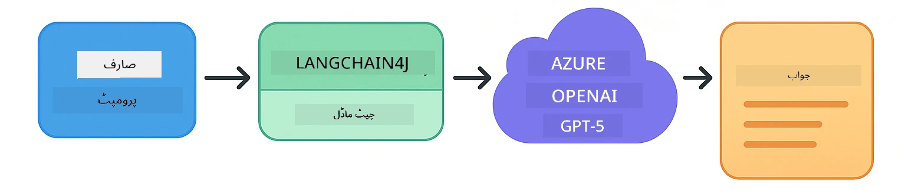

*LangChain4j آپ کے پرامپٹس کو Azure OpenAI GPT-5 سے کیسے جوڑتا ہے*

**انحصار** - ماڈیول 02 `pom.xml` میں درج درج ذیل langchain4j انحصارات استعمال کرتا ہے:
```xml
<dependency>
    <groupId>dev.langchain4j</groupId>
    <artifactId>langchain4j</artifactId> <!-- Inherited from BOM in root pom.xml -->
</dependency>
<dependency>
    <groupId>dev.langchain4j</groupId>
    <artifactId>langchain4j-open-ai-official</artifactId> <!-- Inherited from BOM in root pom.xml -->
</dependency>
```

**OpenAiOfficialChatModel کنفیگریشن** - [LangChainConfig.java](../../../02-prompt-engineering/src/main/java/com/example/langchain4j/prompts/config/LangChainConfig.java)

چیٹ ماڈل کو دستی طور پر ایک Spring bean کے طور پر OpenAI آفیشل کلائنٹ کے ذریعے ترتیب دیا گیا ہے، جو Azure OpenAI اینڈ پوائنٹس کی حمایت کرتا ہے۔ ماڈیول 01 سے کلیدی فرق یہ ہے کہ ہم `chatModel.chat()` کو بھیجے جانے والے پرامپٹس کی ساخت کیسے کرتے ہیں، ماڈل کی سیٹنگ نہیں۔

**سسٹم اور یوزر میسجز** - [Gpt5PromptService.java](../../../02-prompt-engineering/src/main/java/com/example/langchain4j/prompts/service/Gpt5PromptService.java)

LangChain4j وضاحت کے لیے میسج کی اقسام کو الگ کرتا ہے۔ `SystemMessage` AI کے رویے اور سیاق و سباق کو سیٹ کرتا ہے (جیسے "آپ کوڈ ریویور ہیں")، جبکہ `UserMessage` اصل درخواست رکھتا ہے۔ یہ علیحدگی آپ کو مختلف یوزر سوالات کے دوران AI کے رویے کو مستقل رکھنے دیتی ہے۔

```java
SystemMessage systemMsg = SystemMessage.from(
    "You are a helpful Java programming expert."
);

UserMessage userMsg = UserMessage.from(
    "Explain what a List is in Java"
);

String response = chatModel.chat(systemMsg, userMsg);
```

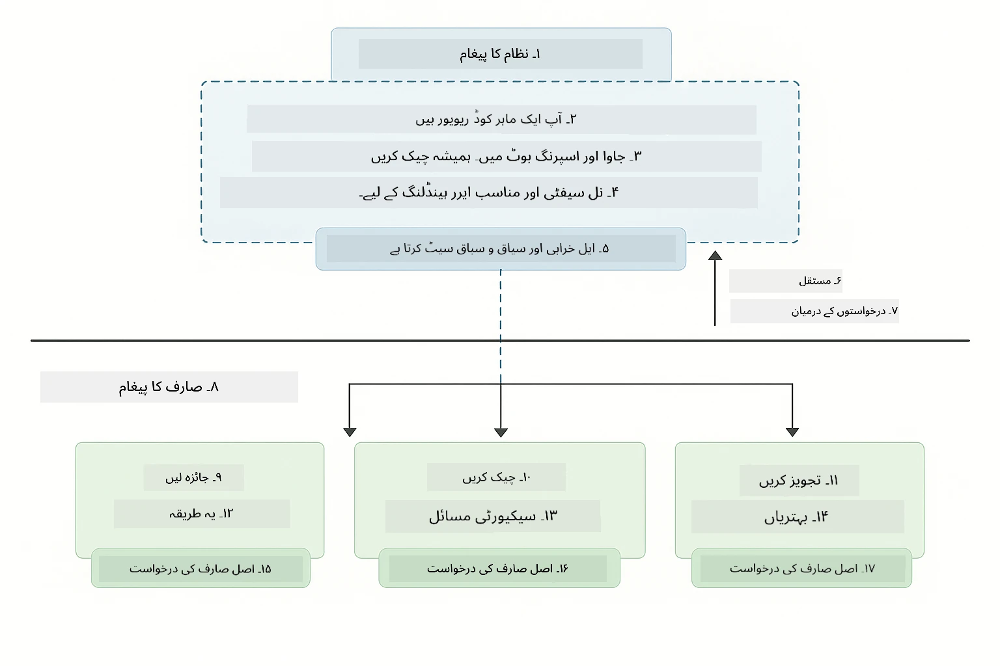

*SystemMessage مستقل سیاق و سباق فراہم کرتا ہے جبکہ UserMessages انفرادی درخواستیں رکھتے ہیں*

**Multi-Turn کے لیے MessageWindowChatMemory** - کئی مرحلوں کی بات چیت کے پیٹرن کے لیے، ہم ماڈیول 01 سے `MessageWindowChatMemory` دوبارہ استعمال کرتے ہیں۔ ہر سیشن کو اس کی اپنی میموری انسٹینس ملتی ہے جو `Map<String, ChatMemory>` میں محفوظ ہوتی ہے، جس سے متعدد بیک وقت بات چیت بغیر سیاق و سباق کے مکس ہونے کے ممکن ہیں۔

**پرامپٹ ٹیمپلیٹس** - اصل توجہ یہاں پرامپٹ انجینئرنگ پر ہے، نہ کہ نئے LangChain4j APIs پر۔ ہر پیٹرن (کم جوش، زیادہ جوش، ٹاسک ایگزیکیوشن وغیرہ) ایک ہی `chatModel.chat(prompt)` طریقہ استعمال کرتا ہے لیکن احتیاط سے ترتیب دیے گئے پرامپٹ سٹرنگز کے ساتھ۔ XML ٹیگز، ہدایات، اور فارمیٹنگ سب پرامپٹ ٹیکسٹ کا حصہ ہیں، LangChain4j کی خصوصیات نہیں۔

**استدلال کنٹرول** - GPT-5 کی استدلال کی کوشش پرامپٹ ہدایات جیسے "زیادہ سے زیادہ 2 استدلالی مراحل" یا "تفصیل سے تلاش کریں" کے ذریعے کنٹرول کی جاتی ہے۔ یہ پرامپٹ انجینئرنگ کی تکنیکیں ہیں، LangChain4j کی کنفیگریشنز نہیں۔ لائبریری صرف آپ کے پرامپٹس ماڈل کو پہنچاتی ہے۔

اہم بات: LangChain4j بنیادی ڈھانچہ فراہم کرتا ہے (ماڈل کنکشن [LangChainConfig.java](../../../02-prompt-engineering/src/main/java/com/example/langchain4j/prompts/config/LangChainConfig.java) کے ذریعے، میموری، میسج ہینڈلنگ [Gpt5PromptService.java](../../../02-prompt-engineering/src/main/java/com/example/langchain4j/prompts/service/Gpt5PromptService.java) کے ذریعے)، جبکہ یہ ماڈیول آپ کو سکھاتا ہے کہ اس بنیادی ڈھانچے کے اندر مؤثر پرامپٹس کیسے تیار کیے جائیں۔

## بنیادی پیٹرنز

تمام مسائل کے لیے ایک ہی طریقہ کار ضروری نہیں ہوتا۔ کچھ سوالات کو فوری جواب چاہیے، کچھ کو گہری سوچ۔ کچھ کو واضح استدلال چاہیے، کچھ کو صرف نتائج۔ یہ ماڈیول آٹھ پرامپٹنگ پیٹرنز کا احاطہ کرتا ہے - ہر ایک مختلف حالات کے لیے بہتر بنایا گیا ہے۔ آپ ان سب کے ساتھ تجربہ کریں گے تاکہ سیکھ سکیں کہ کب کون سا طریقہ بہتر کام کرتا ہے۔

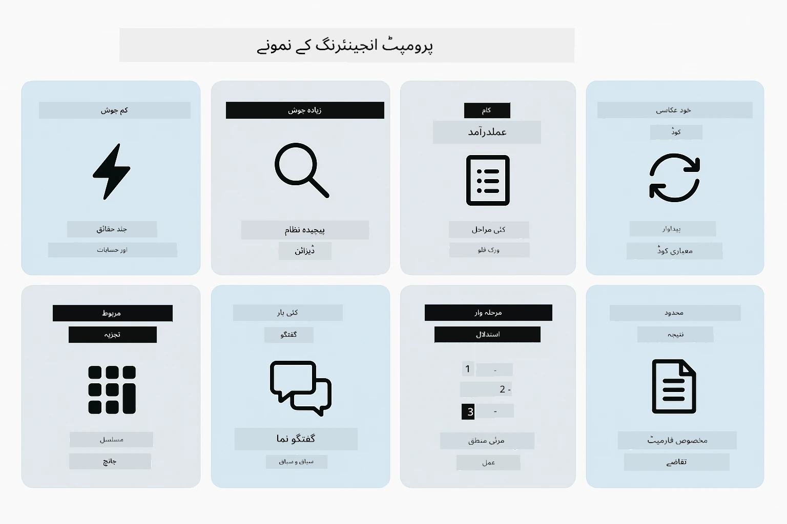

*آٹھ پرامپٹ انجینئرنگ پیٹرنز اور ان کے استعمال کے حالات کا جائزہ*

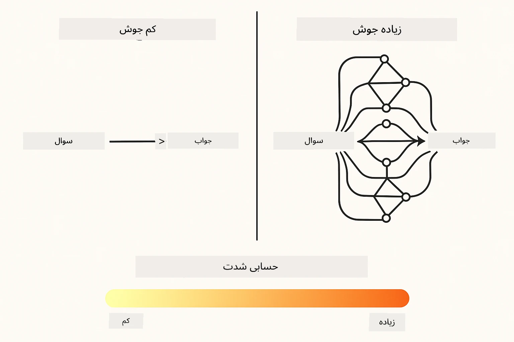

*کم جوش (تیز، براہ راست) بمقابلہ زیادہ جوش (تفصیلی، تحقیقی) استدلالی طریقے*

**کم جوش (تیز اور مرکوز)** - آسان سوالات کے لیے جہاں آپ کو فوری، براہ راست جواب چاہیے۔ ماڈل کم سے کم استدلال کرتا ہے - زیادہ سے زیادہ 2 مراحل۔ اسے حسابات، تلاش یا سیدھے سوالات کے لیے استعمال کریں۔

```java
String prompt = """
    <reasoning_effort>low</reasoning_effort>
    <instruction>maximum 2 reasoning steps</instruction>
    
    What is 15% of 200?
    """;

String response = chatModel.chat(prompt);
```

> 💡 **GitHub Copilot کے ساتھ دریافت کریں:** [`Gpt5PromptService.java`](../../../02-prompt-engineering/src/main/java/com/example/langchain4j/prompts/service/Gpt5PromptService.java) کھولیں اور پوچھیں:
> - "کم جوش اور زیادہ جوش پرامپٹنگ پیٹرنز میں کیا فرق ہے؟"
> - "پرامپٹس میں XML ٹیگز AI کے جواب کی ساخت میں کیسے مدد دیتے ہیں؟"
> - "میں خود عکاسی کے پیٹرنز کب استعمال کروں بمقابلہ براہ راست ہدایت؟"

**زیادہ جوش (گہرا اور تفصیلی)** - پیچیدہ مسائل کے لیے جہاں آپ کو جامع تجزیہ چاہیے۔ ماڈل تفصیل سے تلاش کرتا ہے اور مفصل استدلال دکھاتا ہے۔ اسے سسٹم ڈیزائن، آرکیٹیکچر کے فیصلے، یا پیچیدہ تحقیق کے لیے استعمال کریں۔

```java
String prompt = """
    <reasoning_effort>high</reasoning_effort>
    <instruction>explore thoroughly, show detailed reasoning</instruction>
    
    Design a caching strategy for a high-traffic REST API.
    """;

String response = chatModel.chat(prompt);
```

**ٹاسک ایگزیکیوشن (قدم بہ قدم پیش رفت)** - کئی مرحلوں کے ورک فلو کے لیے۔ ماڈل ایک ابتدائی منصوبہ فراہم کرتا ہے، ہر قدم کو بیان کرتا ہے، پھر خلاصہ دیتا ہے۔ اسے مائیگریشنز، نفاذ، یا کسی بھی کئی مرحلوں کے عمل کے لیے استعمال کریں۔

```java
String prompt = """
    <task>Create a REST endpoint for user registration</task>
    <preamble>Provide an upfront plan</preamble>
    <narration>Narrate each step as you work</narration>
    <summary>Summarize what was accomplished</summary>
    """;

String response = chatModel.chat(prompt);
```

Chain-of-Thought پرامپٹنگ ماڈل سے واضح استدلال کا عمل دکھانے کو کہتی ہے، جو پیچیدہ کاموں کی درستگی بہتر بناتی ہے۔ قدم بہ قدم تجزیہ انسانوں اور AI دونوں کو منطق سمجھنے میں مدد دیتا ہے۔

> **🤖 [GitHub Copilot](https://github.com/features/copilot) چیٹ کے ساتھ آزمائیں:** اس پیٹرن کے بارے میں پوچھیں:
> - "میں طویل مدتی آپریشنز کے لیے ٹاسک ایگزیکیوشن پیٹرن کو کیسے ڈھالوں؟"
> - "پروڈکشن ایپلیکیشنز میں ٹول پری ایمبلز کی ساخت کے بہترین طریقے کیا ہیں؟"
> - "میں UI میں درمیانی پیش رفت کی اپ ڈیٹس کیسے حاصل اور دکھا سکتا ہوں؟"

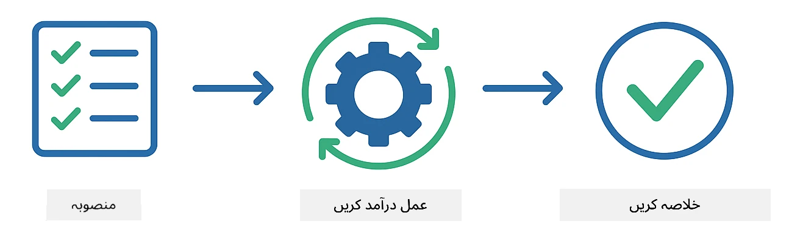

*کئی مرحلوں کے کاموں کے لیے منصوبہ → عمل درآمد → خلاصہ ورک فلو*

**خود عکاسی کرنے والا کوڈ** - پروڈکشن معیار کا کوڈ بنانے کے لیے۔ ماڈل کوڈ تیار کرتا ہے، معیار کے خلاف چیک کرتا ہے، اور اسے تدریجی طور پر بہتر بناتا ہے۔ اسے نئی خصوصیات یا خدمات بنانے کے وقت استعمال کریں۔

```java
String prompt = """
    <task>Create an email validation service</task>
    <quality_criteria>
    - Correct logic and error handling
    - Best practices (clean code, proper naming)
    - Performance optimization
    - Security considerations
    </quality_criteria>
    <instruction>Generate code, evaluate against criteria, improve iteratively</instruction>
    """;

String response = chatModel.chat(prompt);
```

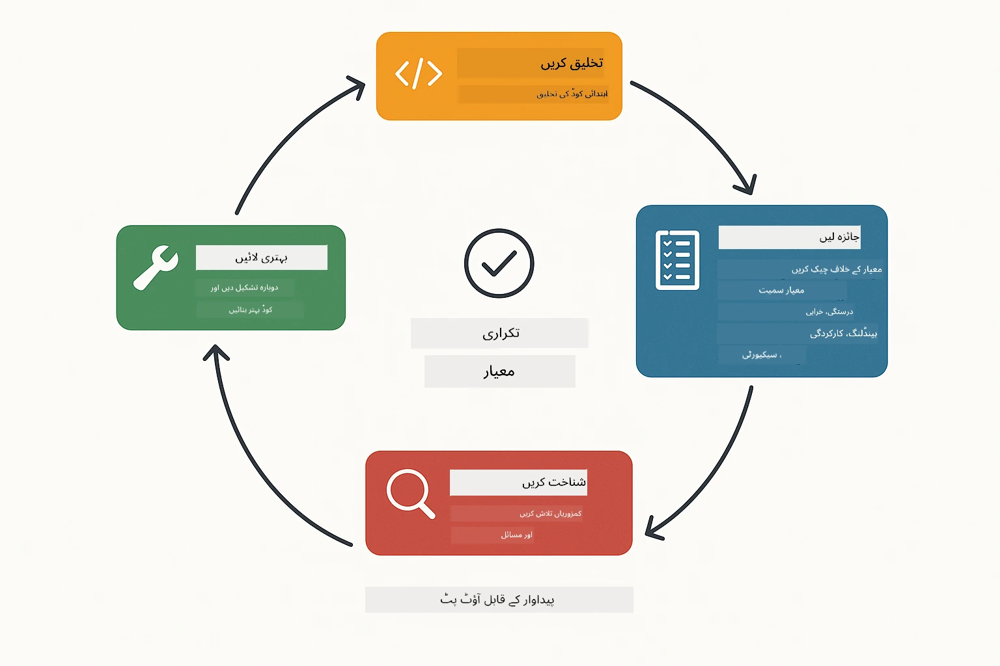

*تدریجی بہتری کا چکر - تیار کریں، جائزہ لیں، مسائل شناخت کریں، بہتر کریں، دہرائیں*

**منظم تجزیہ** - مستقل جائزے کے لیے۔ ماڈل کوڈ کو ایک مقررہ فریم ورک (درستی، طریقے، کارکردگی، سیکیورٹی) کے تحت جائزہ لیتا ہے۔ اسے کوڈ ریویوز یا معیار کے جائزوں کے لیے استعمال کریں۔

```java
String prompt = """
    <code>
    public List getUsers() {
        return database.query("SELECT * FROM users");
    }
    </code>
    
    <framework>
    Evaluate using these categories:
    1. Correctness - Logic and functionality
    2. Best Practices - Code quality
    3. Performance - Efficiency concerns
    4. Security - Vulnerabilities
    </framework>
    """;

String response = chatModel.chat(prompt);
```

> **🤖 [GitHub Copilot](https://github.com/features/copilot) چیٹ کے ساتھ آزمائیں:** منظم تجزیہ کے بارے میں پوچھیں:
> - "میں مختلف قسم کے کوڈ ریویوز کے لیے تجزیہ فریم ورک کو کیسے حسب ضرورت بنا سکتا ہوں؟"
> - "منظم آؤٹ پٹ کو پروگراماتی طور پر پارس اور عمل کرنے کا بہترین طریقہ کیا ہے؟"
> - "میں مختلف ریویو سیشنز میں مستقل شدت کی سطح کیسے یقینی بناؤں؟"

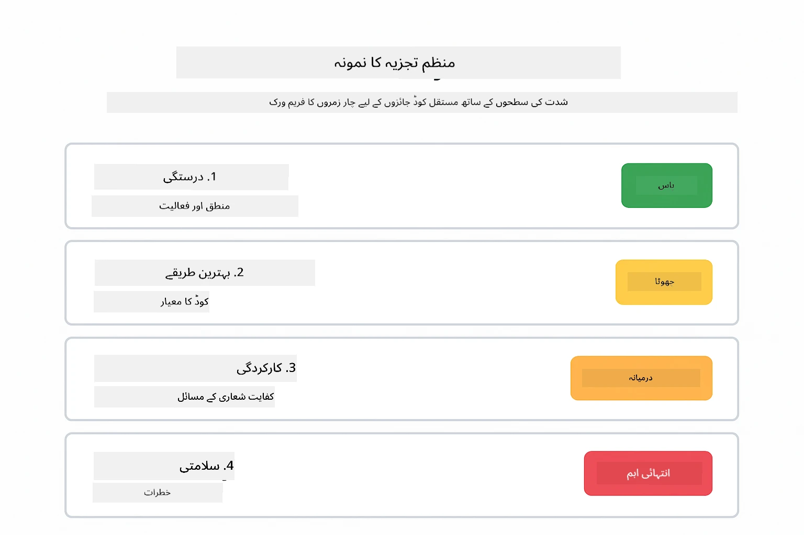

*شدت کی سطحوں کے ساتھ مستقل کوڈ ریویوز کے لیے چار زمرہ جات کا فریم ورک*

**کئی مرحلوں کی بات چیت** - ایسی بات چیت کے لیے جسے سیاق و سباق کی ضرورت ہو۔ ماڈل پچھلے پیغامات کو یاد رکھتا ہے اور ان پر تعمیر کرتا ہے۔ اسے انٹرایکٹو مدد کے سیشنز یا پیچیدہ سوال و جواب کے لیے استعمال کریں۔

```java
ChatMemory memory = MessageWindowChatMemory.withMaxMessages(10);

memory.add(UserMessage.from("What is Spring Boot?"));
AiMessage aiMessage1 = chatModel.chat(memory.messages()).aiMessage();
memory.add(aiMessage1);

memory.add(UserMessage.from("Show me an example"));
AiMessage aiMessage2 = chatModel.chat(memory.messages()).aiMessage();
memory.add(aiMessage2);
```

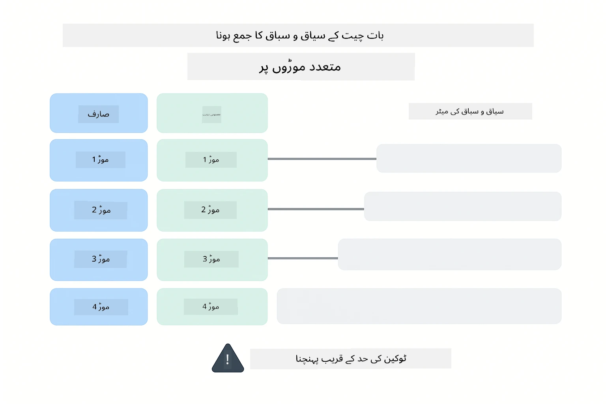

*بات چیت کا سیاق و سباق کئی مرحلوں میں جمع ہوتا ہے جب تک کہ ٹوکن کی حد نہ پہنچ جائے*

**قدم بہ قدم استدلال** - ایسے مسائل کے لیے جنہیں واضح منطق کی ضرورت ہو۔ ماڈل ہر قدم کے لیے واضح استدلال دکھاتا ہے۔ اسے ریاضی کے مسائل، منطق کے پہیلیاں، یا جب آپ سوچنے کے عمل کو سمجھنا چاہتے ہوں استعمال کریں۔

```java
String prompt = """
    <instruction>Show your reasoning step-by-step</instruction>
    
    If a train travels 120 km in 2 hours, then stops for 30 minutes,
    then travels another 90 km in 1.5 hours, what is the average speed
    for the entire journey including the stop?
    """;

String response = chatModel.chat(prompt);
```

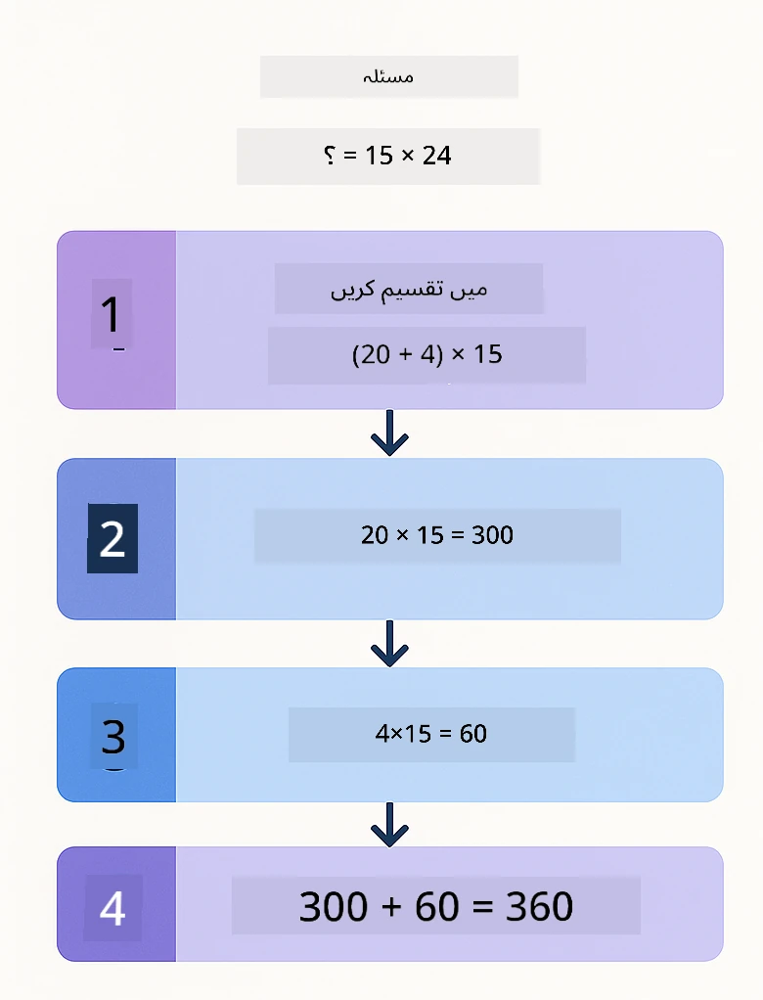

*مسائل کو واضح منطقی مراحل میں تقسیم کرنا*

**محدود آؤٹ پٹ** - ایسے جوابات کے لیے جنہیں مخصوص فارمیٹ کی ضرورت ہو۔ ماڈل سختی سے فارمیٹ اور لمبائی کے قواعد کی پیروی کرتا ہے۔ اسے خلاصوں یا جب آپ کو درست آؤٹ پٹ ساخت چاہیے ہو استعمال کریں۔

```java
String prompt = """
    <constraints>
    - Exactly 100 words
    - Bullet point format
    - Technical terms only
    </constraints>
    
    Summarize the key concepts of machine learning.
    """;

String response = chatModel.chat(prompt);
```

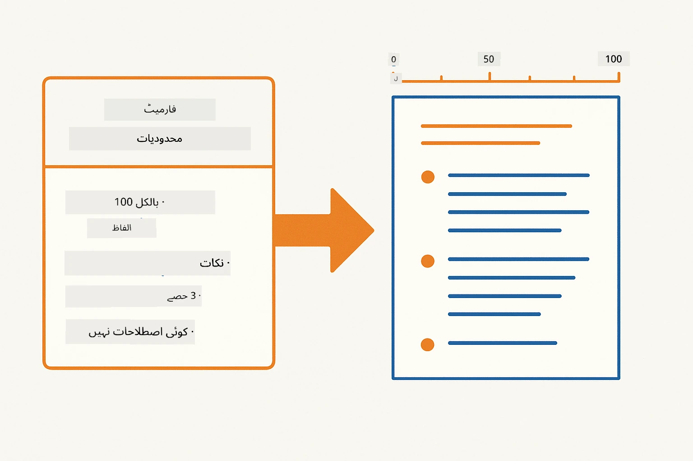

*مخصوص فارمیٹ، لمبائی، اور ساخت کی ضروریات کا نفاذ*

## موجودہ Azure وسائل کا استعمال

**تعیناتی کی تصدیق کریں:**

یقینی بنائیں کہ روٹ ڈائریکٹری میں `.env` فائل Azure کی اسناد کے ساتھ موجود ہے (جو ماڈیول 01 کے دوران بنائی گئی تھی):
```bash
cat ../.env  # دکھانا چاہیے AZURE_OPENAI_ENDPOINT، API_KEY، DEPLOYMENT
```

**ایپلیکیشن شروع کریں:**

> **نوٹ:** اگر آپ نے ماڈیول 01 سے `./start-all.sh` کے ذریعے تمام ایپلیکیشنز پہلے ہی شروع کر رکھی ہیں، تو یہ ماڈیول پہلے ہی پورٹ 8083 پر چل رہا ہے۔ آپ نیچے دیے گئے شروع کرنے کے کمانڈز چھوڑ کر براہ راست http://localhost:8083 پر جا سکتے ہیں۔

**اختیار 1: Spring Boot ڈیش بورڈ کا استعمال (VS Code صارفین کے لیے تجویز کردہ)**

ڈویلپمنٹ کنٹینر میں Spring Boot ڈیش بورڈ ایکسٹینشن شامل ہے، جو تمام Spring Boot ایپلیکیشنز کو منظم کرنے کے لیے بصری انٹرفیس فراہم کرتا ہے۔ آپ اسے VS Code کی بائیں جانب ایکٹیویٹی بار میں Spring Boot آئیکن کے طور پر دیکھ سکتے ہیں۔

Spring Boot ڈیش بورڈ سے آپ کر سکتے ہیں:
- ورک اسپیس میں تمام دستیاب Spring Boot ایپلیکیشنز دیکھیں
- ایک کلک سے ایپلیکیشنز شروع/روکیں
- ایپلیکیشن لاگز کو حقیقی وقت میں دیکھیں
- ایپلیکیشن کی حالت کی نگرانی کریں

بس "prompt-engineering" کے ساتھ پلے بٹن پر کلک کریں تاکہ یہ ماڈیول شروع ہو، یا تمام ماڈیولز ایک ساتھ شروع کریں۔

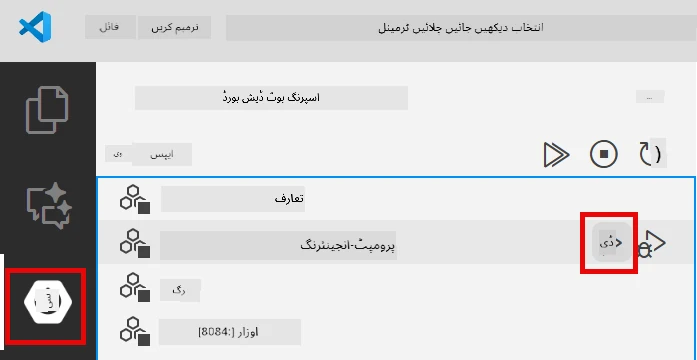

**اختیار 2: شیل اسکرپٹس کا استعمال**

تمام ویب ایپلیکیشنز (ماڈیولز 01-04) شروع کریں:

**Bash:**
```bash
cd ..  # روٹ ڈائریکٹری سے
./start-all.sh
```

**PowerShell:**
```powershell
cd ..  # روٹ ڈائریکٹری سے
.\start-all.ps1
```

یا صرف یہ ماڈیول شروع کریں:

**Bash:**
```bash
cd 02-prompt-engineering
./start.sh
```

**PowerShell:**
```powershell
cd 02-prompt-engineering
.\start.ps1
```

دونوں اسکرپٹس خود بخود روٹ `.env` فائل سے ماحول کی متغیرات لوڈ کرتے ہیں اور اگر JARs موجود نہ ہوں تو انہیں بنائیں گے۔

> **نوٹ:** اگر آپ شروع کرنے سے پہلے تمام ماڈیولز کو دستی طور پر بنانا چاہتے ہیں:
>
> **Bash:**
> ```bash
> cd ..  # Go to root directory
> mvn clean package -DskipTests
> ```
>
> **PowerShell:**
> ```powershell
> cd ..  # Go to root directory
> mvn clean package -DskipTests
> ```

اپنا براؤزر کھولیں اور http://localhost:8083 پر جائیں۔

**بند کرنے کے لیے:**

**Bash:**
```bash
./stop.sh  # صرف یہ ماڈیول
# یا
cd .. && ./stop-all.sh  # تمام ماڈیولز
```

**PowerShell:**
```powershell
.\stop.ps1  # صرف یہ ماڈیول
# یا
cd ..; .\stop-all.ps1  # تمام ماڈیولز
```

## ایپلیکیشن کے اسکرین شاٹس

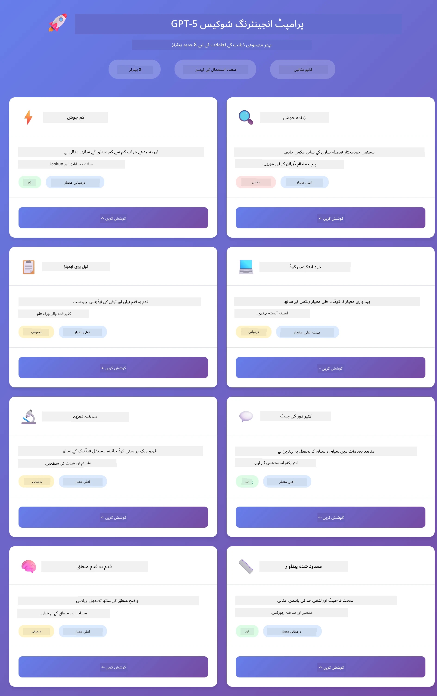

*مین ڈیش بورڈ جو تمام 8 پرامپٹ انجینئرنگ پیٹرنز کو ان کی خصوصیات اور استعمال کے حالات کے ساتھ دکھا رہا ہے*

## پیٹرنز کی کھوج

ویب انٹرفیس آپ کو مختلف پرامپٹنگ حکمت عملیوں کے ساتھ تجربہ کرنے دیتا ہے۔ ہر پیٹرن مختلف مسائل حل کرتا ہے - انہیں آزمائیں تاکہ دیکھ سکیں کہ کب کون سا طریقہ بہتر کام کرتا ہے۔

### کم بمقابلہ زیادہ جوش

ایک آسان سوال پوچھیں جیسے "200 کا 15% کیا ہے؟" کم جوش استعمال کرتے ہوئے۔ آپ کو فوری، براہ راست جواب ملے گا۔ اب کچھ پیچیدہ پوچھیں جیسے "ہائی ٹریفک API کے لیے کیشنگ حکمت عملی ڈیزائن کریں" زیادہ جوش استعمال کرتے ہوئے۔ دیکھیں کہ ماڈل کس طرح سست ہوتا ہے اور تفصیلی استدلال فراہم کرتا ہے۔ ایک ہی ماڈل، ایک ہی سوال کی ساخت - لیکن پرامپٹ اسے بتاتا ہے کہ کتنا سوچنا ہے۔

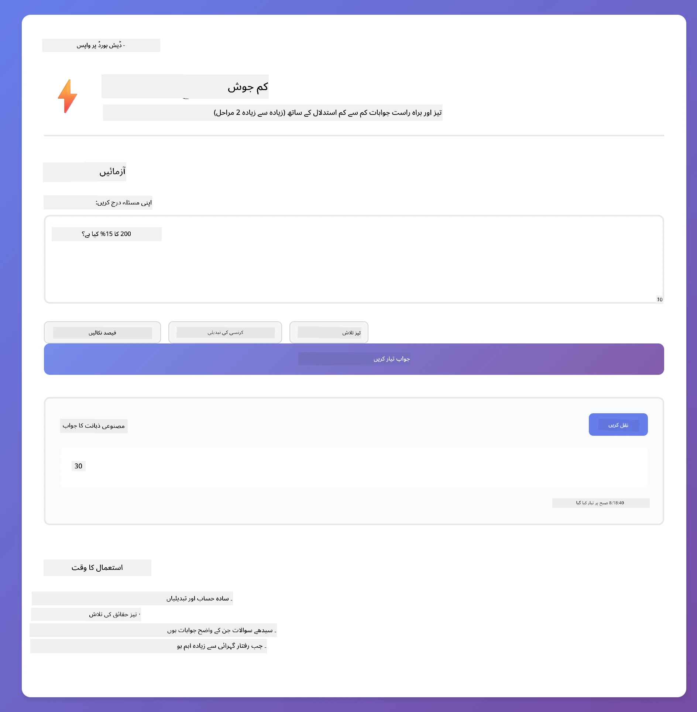
*کم از کم استدلال کے ساتھ تیز حساب*


*جامع کیشنگ حکمت عملی (2.8MB)*

### کام کی انجام دہی (ٹول پری ایمبلز)

کئی مراحل پر مشتمل ورک فلو کو پہلے سے منصوبہ بندی اور پیش رفت کی وضاحت سے فائدہ ہوتا ہے۔ ماڈل بتاتا ہے کہ وہ کیا کرے گا، ہر قدم کی وضاحت کرتا ہے، پھر نتائج کا خلاصہ پیش کرتا ہے۔

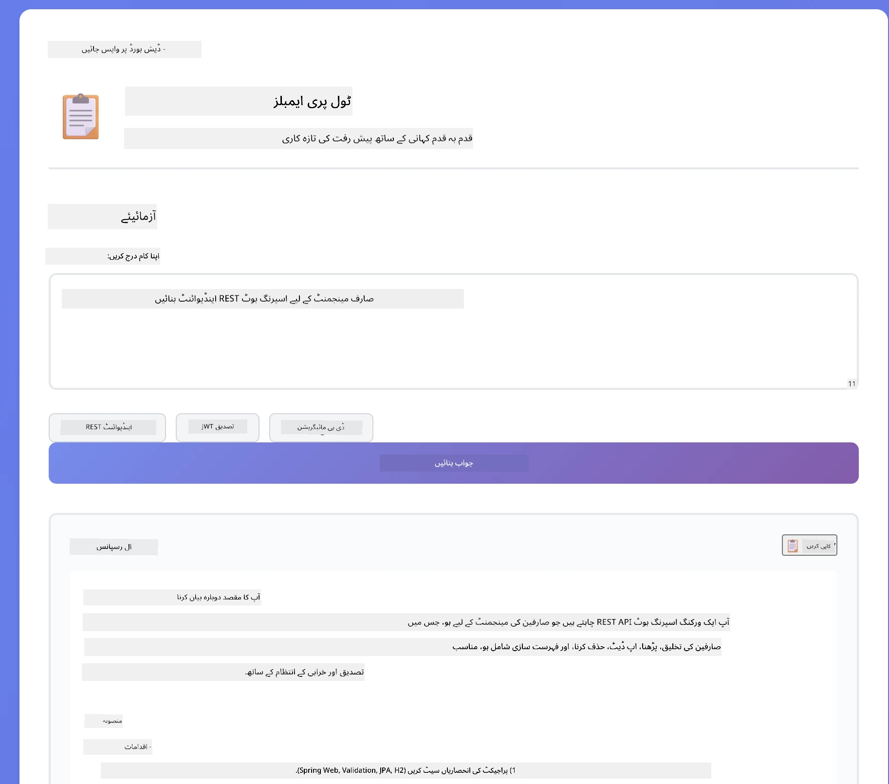

*قدم بہ قدم وضاحت کے ساتھ REST اینڈپوائنٹ بنانا (3.9MB)*

### خود عکاسی کرنے والا کوڈ

"ایک ای میل ویلیڈیشن سروس بنائیں" آزما کر دیکھیں۔ صرف کوڈ بنانے اور رکنے کی بجائے، ماڈل کوڈ تیار کرتا ہے، معیار کے خلاف جانچتا ہے، کمزوریاں شناخت کرتا ہے، اور بہتری لاتا ہے۔ آپ دیکھیں گے کہ یہ تب تک دہرائے گا جب تک کوڈ پروڈکشن معیار پر پورا نہ اترے۔

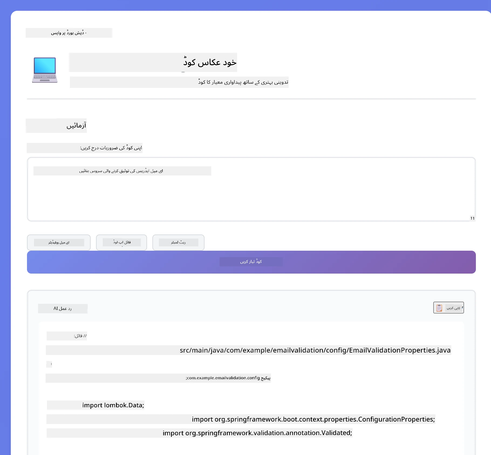

*مکمل ای میل ویلیڈیشن سروس (5.2MB)*

### منظم تجزیہ

کوڈ ریویوز کے لیے مستقل جانچ کے فریم ورک کی ضرورت ہوتی ہے۔ ماڈل کوڈ کا تجزیہ مقررہ زمروں (درستگی، طریقہ کار، کارکردگی، سیکیورٹی) اور شدت کی سطحوں کے ساتھ کرتا ہے۔

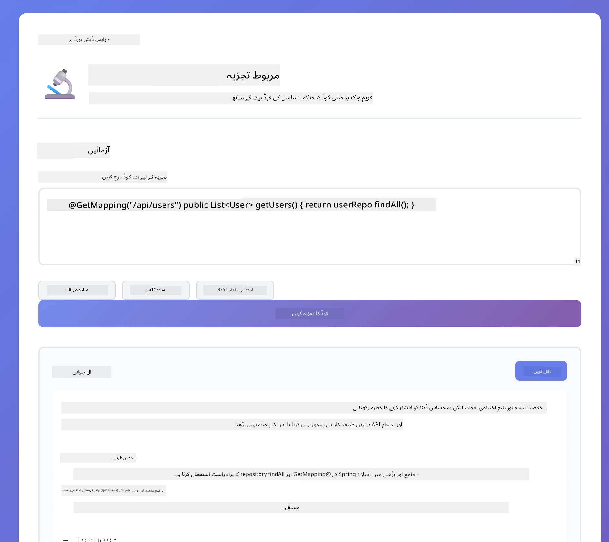

*فریم ورک پر مبنی کوڈ ریویو*

### کثیر مرحلہ چیٹ

پوچھیں "Spring Boot کیا ہے؟" پھر فوراً "ایک مثال دکھائیں"۔ ماڈل آپ کے پہلے سوال کو یاد رکھتا ہے اور خاص طور پر Spring Boot کی مثال دیتا ہے۔ بغیر یادداشت کے، دوسرا سوال بہت مبہم ہوتا۔

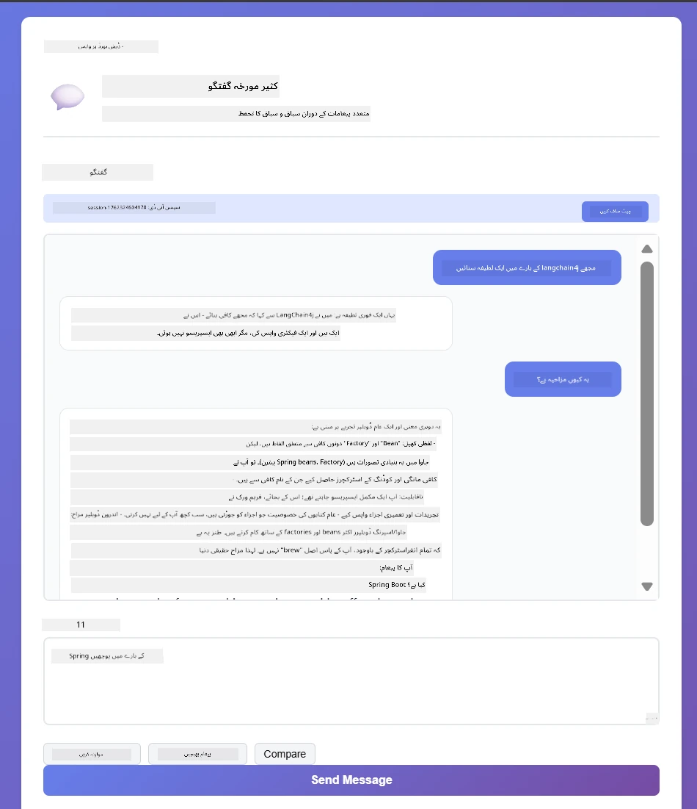

*سوالات کے درمیان سیاق و سباق کا تحفظ*

### قدم بہ قدم استدلال

کسی ریاضی کے مسئلے کا انتخاب کریں اور اسے Step-by-Step Reasoning اور Low Eagerness دونوں کے ساتھ آزمائیں۔ Low eagerness صرف جواب دیتا ہے - تیز لیکن غیر واضح۔ Step-by-step آپ کو ہر حساب اور فیصلہ دکھاتا ہے۔

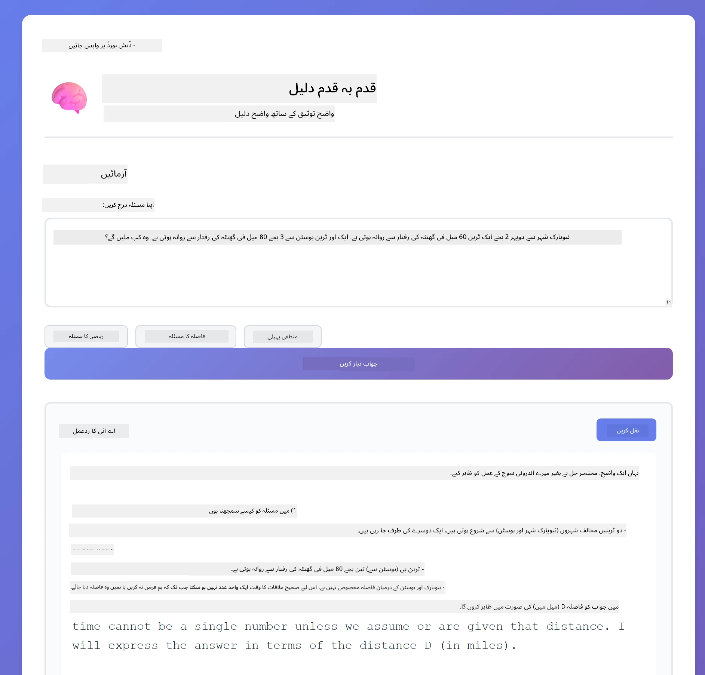

*واضح مراحل کے ساتھ ریاضی کا مسئلہ*

### محدود آؤٹ پٹ

جب آپ کو مخصوص فارمیٹس یا الفاظ کی تعداد کی ضرورت ہو، یہ طریقہ سخت پابندی عائد کرتا ہے۔ بال پوائنٹ فارمیٹ میں بالکل 100 الفاظ کا خلاصہ بنانے کی کوشش کریں۔

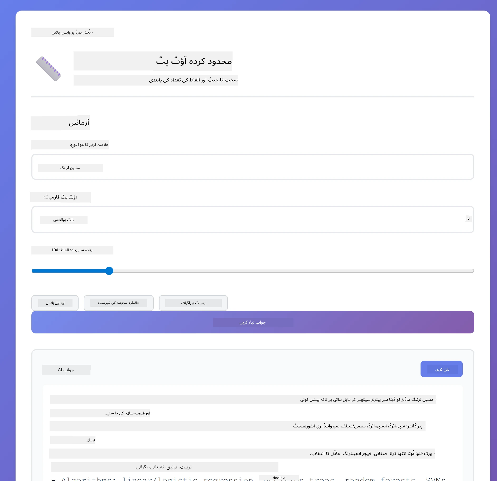

*فارمیٹ کنٹرول کے ساتھ مشین لرننگ کا خلاصہ*

## آپ واقعی کیا سیکھ رہے ہیں

**استدلال کی کوشش سب کچھ بدل دیتی ہے**

GPT-5 آپ کو اپنے پرامپٹس کے ذریعے حسابی کوشش کو کنٹرول کرنے دیتا ہے۔ کم کوشش کا مطلب ہے تیز جوابات کم تلاش کے ساتھ۔ زیادہ کوشش کا مطلب ہے کہ ماڈل گہرائی سے سوچنے میں وقت لگاتا ہے۔ آپ سیکھ رہے ہیں کہ کوشش کو کام کی پیچیدگی کے مطابق ملائیں - آسان سوالات پر وقت ضائع نہ کریں، لیکن پیچیدہ فیصلوں کو بھی جلد بازی میں نہ کریں۔

**ساخت رویے کی رہنمائی کرتی ہے**

کیا آپ نے پرامپٹس میں XML ٹیگز دیکھے؟ یہ صرف سجاوٹ نہیں ہیں۔ ماڈلز منظم ہدایات کو آزاد متن سے زیادہ قابل اعتماد طریقے سے فالو کرتے ہیں۔ جب آپ کو کئی مراحل کے عمل یا پیچیدہ منطق کی ضرورت ہو، ساخت ماڈل کو بتاتی ہے کہ وہ کہاں ہے اور آگے کیا آنا ہے۔

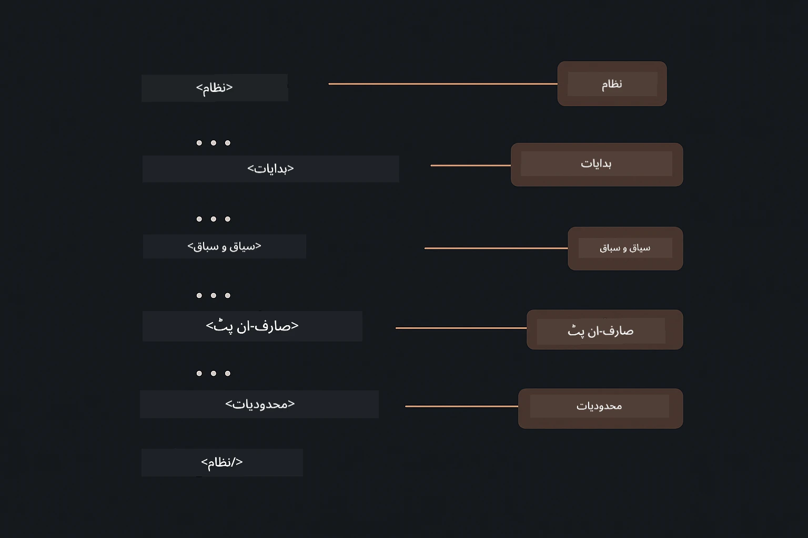

*واضح سیکشنز اور XML طرز کی تنظیم کے ساتھ اچھی ساخت والا پرامپٹ*

**خود تشخیص کے ذریعے معیار**

خود عکاسی کرنے والے نمونے معیار کے معیارات کو واضح کر کے کام کرتے ہیں۔ ماڈل سے "صحیح طریقے سے کریں" کی امید کرنے کی بجائے، آپ اسے بتاتے ہیں کہ "صحیح" کا مطلب کیا ہے: درست منطق، غلطی کا انتظام، کارکردگی، سیکیورٹی۔ پھر ماڈل اپنی پیداوار کا جائزہ لے سکتا ہے اور بہتری لا سکتا ہے۔ یہ کوڈ جنریشن کو قرعہ اندازی سے ایک عمل میں بدل دیتا ہے۔

**سیاق و سباق محدود ہے**

کثیر مرحلہ بات چیت ہر درخواست کے ساتھ پیغام کی تاریخ شامل کر کے کام کرتی ہے۔ لیکن حد ہوتی ہے - ہر ماڈل کی زیادہ سے زیادہ ٹوکن کی تعداد ہوتی ہے۔ جیسے جیسے بات چیت بڑھتی ہے، آپ کو متعلقہ سیاق و سباق کو برقرار رکھنے کی حکمت عملیوں کی ضرورت ہوگی بغیر حد کو پہنچے۔ یہ ماڈیول آپ کو یادداشت کے کام کرنے کا طریقہ دکھاتا ہے؛ بعد میں آپ سیکھیں گے کہ کب خلاصہ کرنا ہے، کب بھولنا ہے، اور کب بازیافت کرنا ہے۔

## اگلے اقدامات

**اگلا ماڈیول:** [03-rag - RAG (Retrieval-Augmented Generation)](../03-rag/README.md)

---

**نیویگیشن:** [← پچھلا: ماڈیول 01 - تعارف](../01-introduction/README.md) | [مین پر واپس](../README.md) | [اگلا: ماڈیول 03 - RAG →](../03-rag/README.md)

---

<!-- CO-OP TRANSLATOR DISCLAIMER START -->
**دستخطی نوٹ**:  
یہ دستاویز AI ترجمہ سروس [Co-op Translator](https://github.com/Azure/co-op-translator) کے ذریعے ترجمہ کی گئی ہے۔ اگرچہ ہم درستگی کے لیے کوشاں ہیں، براہ کرم اس بات سے آگاہ رہیں کہ خودکار ترجمے میں غلطیاں یا عدم درستیاں ہو سکتی ہیں۔ اصل دستاویز اپنی مادری زبان میں ہی معتبر ماخذ سمجھی جانی چاہیے۔ اہم معلومات کے لیے پیشہ ور انسانی ترجمہ کی سفارش کی جاتی ہے۔ اس ترجمے کے استعمال سے پیدا ہونے والی کسی بھی غلط فہمی یا غلط تشریح کی ذمہ داری ہم پر عائد نہیں ہوتی۔
<!-- CO-OP TRANSLATOR DISCLAIMER END -->