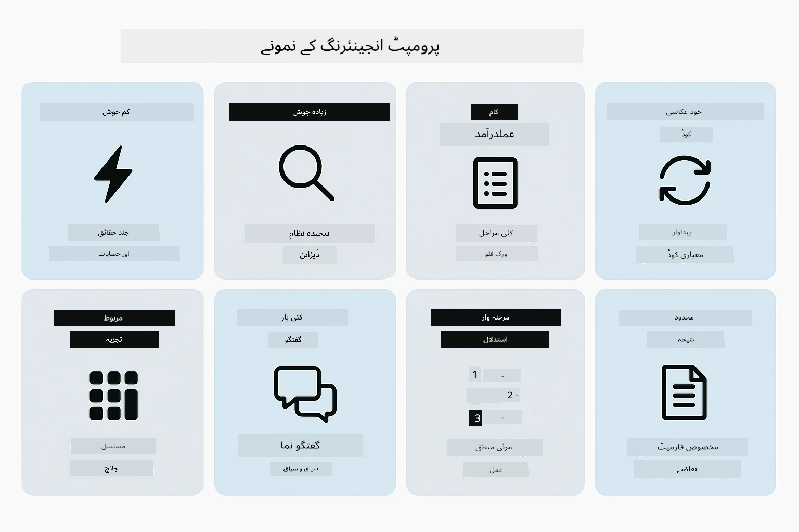
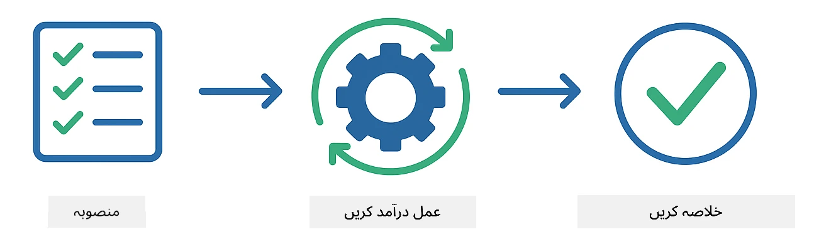
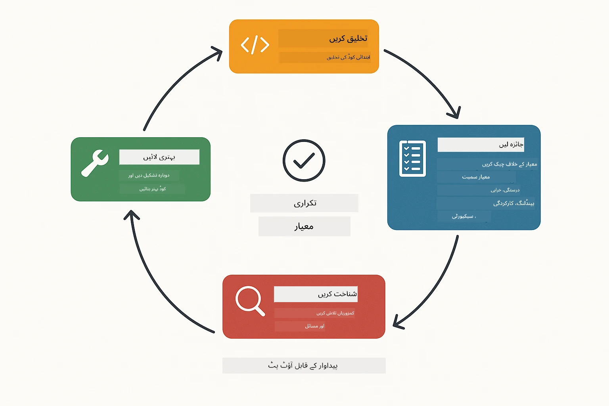
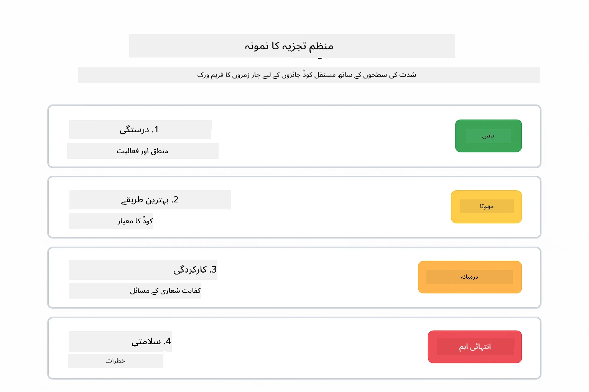
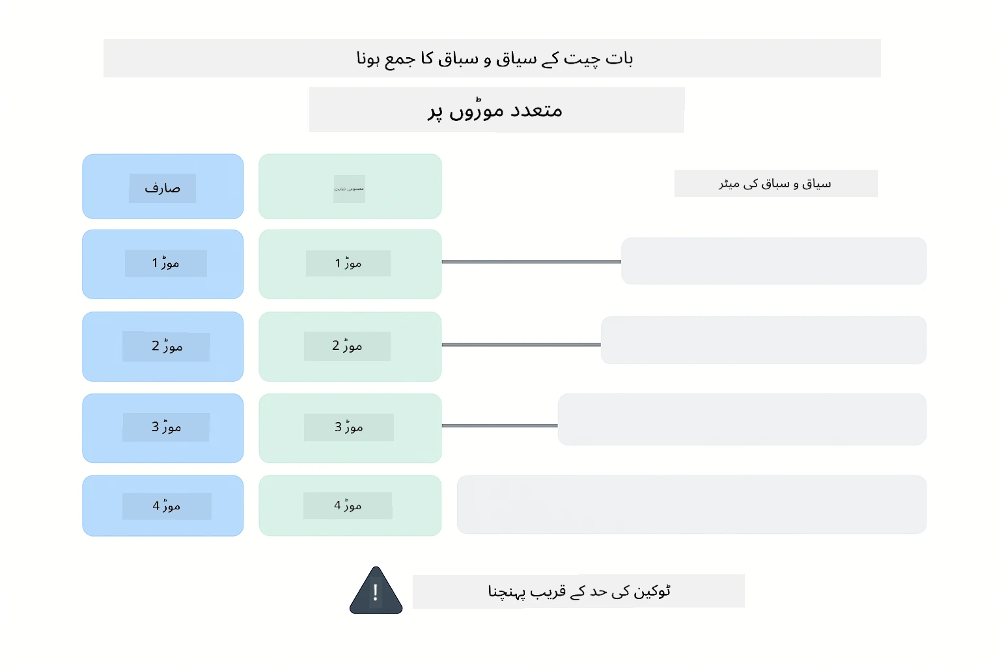
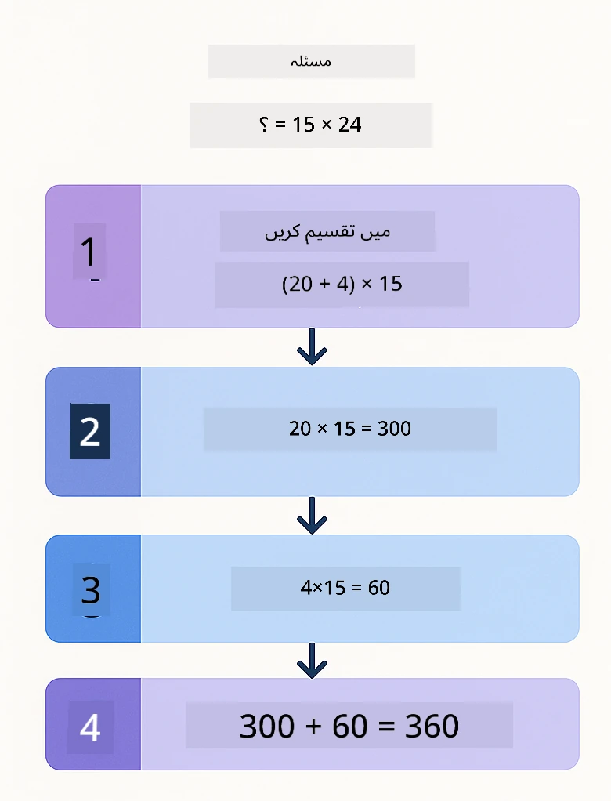
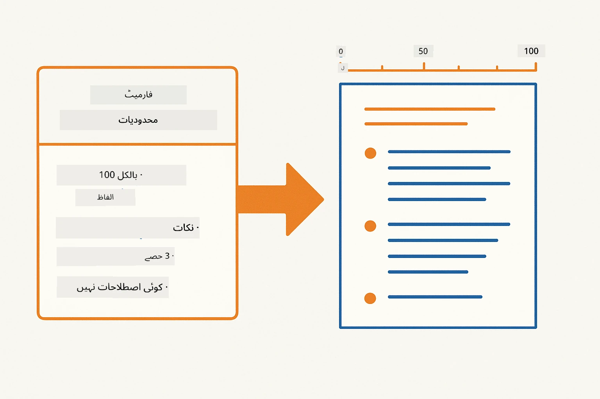
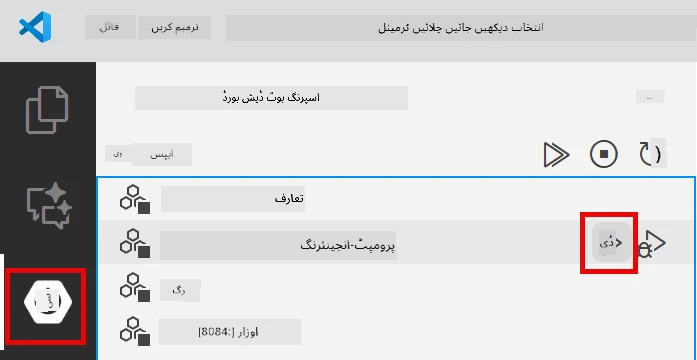
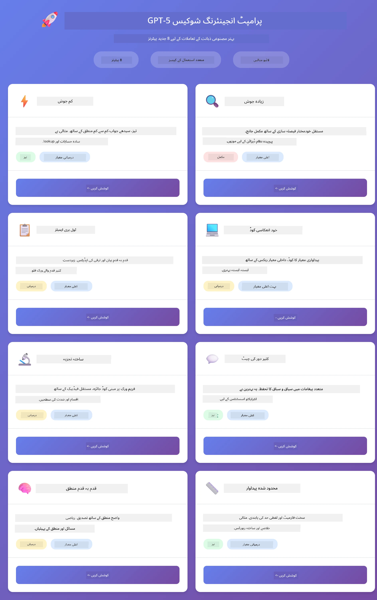
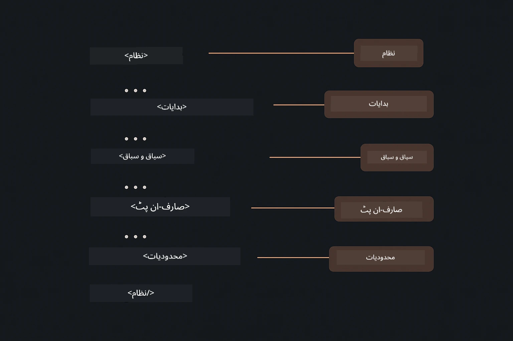

# ماڈیول 02: GPT-5.2 کے ساتھ پرامپٹ انجینئرنگ

## مندرجات

- [ویڈیو واک تھرو](#ویڈیو-واک-تھرو)
- [آپ کیا سیکھیں گے](#آپ-کیا-سیکھیں-گے)
- [درکار شرائط](#درکار-شرائط)
- [پرامپٹ انجینئرنگ کو سمجھنا](#پرامپٹ-انجینئرنگ-کو-سمجھنا)
- [پرامپٹ انجینئرنگ کے بنیادی اصول](#پرامپٹ-انجینئرنگ-کے-بنیادی-اصول)
  - [زیرو شاٹ پرامپٹنگ](#زیرو-شاٹ-پرامپٹنگ)
  - [فیوشاٹ پرامپٹنگ](#فیوشاٹ-پرامپٹنگ)
  - [چین آف تھوٹ](#چین-آف-تھوٹ)
  - [رول پر مبنی پرامپٹنگ](#رول-پر-مبنی-پرامپٹنگ)
  - [پرامپٹ ٹیمپلیٹس](#پرامپٹ-ٹیمپلیٹس)
- [جدید نمونے](#جدید-نمونے)
- [ایپلیکیشن چلائیں](#ایپلیکیشن-چلائیں)
- [ایپلیکیشن کے اسکرین شاٹس](#ایپلیکیشن-اسکرین-شاٹس)
- [نمونوں کی تلاش](#پیٹرنز-کی-دریافت)
  - [کم بمقابلہ زیادہ جوش](#کم-بمقابلہ-زیادہ-جوش)
  - [ٹاسک ایکزیکیوشن (ٹول پری ایمبلز)](#ٹاسک-ایگزیکیوشن-ٹول-پری-ایمبلز)
  - [خود انعکاسی کوڈ](#خود-عکاسی-کرنے-والا-کوڈ)
  - [مُرَتب تجزیہ](#منظم-تجزیہ)
  - [کثیر مرحلہ چیٹ](#کثیر-دفعہ-چیٹ)
  - [قدم بہ قدم استدلال](#مرحلہ-وار-استدلال)
  - [محصور آؤٹ پٹ](#محدود-شدہ-آؤٹ-پٹ)
- [آپ واقعی کیا سیکھ رہے ہیں](#آپ-اصل-میں-کیا-سیکھ-رہے-ہیں)
- [اگلے اقدامات](#اگلے-مراحل)

## ویڈیو واک تھرو

اس لائیو سیشن کو دیکھیں جو اس ماڈیول کے ساتھ شروعات کرنے کا طریقہ بتاتا ہے:

<a href="https://www.youtube.com/live/PJ6aBaE6bog?si=LDshyBrTRodP-wke"></a>

## آپ کیا سیکھیں گے

مندرجہ ذیل خاکہ اس ماڈیول میں آپ کن کلیدی موضوعات اور مہارتوں کو سیکھیں گے اس کا ایک جائزہ فراہم کرتا ہے — پرامپٹ کی بہتری کی تکنیکوں سے لے کر مرحلہ وار ورک فلو تک جو آپ فالو کریں گے۔


پچھلے ماڈیول میں آپ نے دیکھا کہ کس طرح میموری Azure OpenAI کے ساتھ بات چیت کرنے والے AI کو ممکن بناتی ہے۔ اب ہم اس بات پر توجہ دیں گے کہ آپ سوالات کیسے پوچھتے ہیں — یعنی خود پرامپٹس — Azure OpenAI کے GPT-5.2 کا استعمال کرتے ہوئے۔ آپ کے پرامپٹس کی ساخت اس بات کو بہت متاثر کرتی ہے کہ آپ کو جوابات کیسا معیار ملتا ہے۔ ہم بنیادی پرامپٹنگ تکنیکوں کا جائزہ لے کر شروع کرتے ہیں، پھر آٹھ جدید نمونوں پر جاتے ہیں جو GPT-5.2 کی صلاحیتوں کا مکمل فائدہ اٹھاتے ہیں۔

ہم GPT-5.2 استعمال کریں گے کیونکہ یہ استدلال کنٹرول متعارف کرواتا ہے — آپ ماڈل کو بتا سکتے ہیں کہ جواب دینے سے پہلے کتنا سوچنا ہے۔ اس سے مختلف پرامپٹنگ حکمت عملیاں زیادہ واضح ہوتی ہیں اور آپ کو سمجھنے میں مدد ملتی ہے کہ ہر طریقہ کب استعمال کرنا چاہیے۔

## درکار شرائط

- ماڈیول 01 مکمل کر لیا ہو (Azure OpenAI وسائل نافذ کیے گئے)
- `.env` فائل روٹ ڈائرکٹری میں Azure کی اسناد کے ساتھ موجود ہو (جو ماڈیول 01 میں `azd up` سے بنائی گئی ہو)

> **نوٹ:** اگر آپ نے ماڈیول 01 مکمل نہیں کیا تو پہلے وہاں ڈپلائے کرنے کی ہدایات پر عمل کریں۔

## پرامپٹ انجینئرنگ کو سمجھنا

بنیادی طور پر، پرامپٹ انجینئرنگ مبہم ہدایات اور واضح ہدایات کے درمیان فرق ہے، جیسا کہ نیچے دیا گیا موازنہ ظاہر کرتا ہے۔


پرامپٹ انجینئرنگ کا مقصد ایسا ان پٹ متن ڈیزائن کرنا ہے جو مستقل طور پر آپ کو مطلوبہ نتائج دے۔ یہ صرف سوالات پوچھنے کے بارے میں نہیں ہے - بلکہ درخواستوں کو اس طرح ترتیب دینے کے بارے میں ہے کہ ماڈل بالکل سمجھے کہ آپ کیا چاہتے ہیں اور اسے کیسے فراہم کرنا ہے۔

اسے کسی ساتھی کو ہدایات دینے کے مترادف سمجھیں۔ "بگ درست کرو" مبہم ہے۔ "UserService.java کی لائن 45 میں نل پوائنٹر استثنا کو نل چیک شامل کرکے درست کریں" واضح ہے۔ زبان کے ماڈل بھی اسی طرح کام کرتے ہیں - وضاحت اور ساخت اہم ہیں۔

نیچے دیا گیا خاکہ دکھاتا ہے کہ LangChain4j اس تصویر میں کہاں فٹ بیٹھتا ہے — جو آپ کے پرامپٹ پیٹرنز کو SystemMessage اور UserMessage بیلڈنگ بلاکس کے ذریعے ماڈل سے جوڑتا ہے۔


LangChain4j بنیادی ڈھانچہ مہیا کرتا ہے — ماڈل کنیکشنز، میموری، اور پیغام کی اقسام — جبکہ پرامپٹ پیٹرنز صرف وہ محتاط طور پر مرتب شدہ متن ہیں جو آپ اس بنیادی ڈھانچے کے ذریعے بھیجتے ہیں۔ کلیدی اجزاء ہیں `SystemMessage` (جو AI کے رویے اور کردار کو سیٹ کرتا ہے) اور `UserMessage` (جو آپ کی اصل درخواست لے کر آتا ہے)۔

## پرامپٹ انجینئرنگ کے بنیادی اصول

نیچے دکھائی گئی پانچ بنیادی تکنیک موثر پرامپٹ انجینئرنگ کی بنیاد فراہم کرتی ہیں۔ ہر ایک زبان کے ماڈلز کے ساتھ آپ کی بات چیت کے ایک مختلف پہلو کو حل کرتا ہے۔


اس ماڈیول میں موجود جدید نمونوں میں جانے سے پہلے، پانچ بنیادی پرامپٹنگ تکنیکوں کا جائزہ لیتے ہیں۔ یہ وہ بنیادی اجزاء ہیں جو ہر پرامپٹ انجینئر کو معلوم ہونے چاہییں۔

### زیرو شاٹ پرامپٹنگ

سب سے آسان طریقہ: ماڈل کو بغیر کسی مثال کے براہ راست ہدایت دیں۔ ماڈل مکمل طور پر اپنی تربیت پر انحصار کرتا ہے تاکہ کام کو سمجھ کر انجام دے۔ یہ سیدھے سادے سوالات کے لیے اچھا کام کرتا ہے جہاں متوقع رویہ واضح ہوتا ہے۔


*مثالوں کے بغیر براہ راست ہدایت — ماڈل صرف ہدایت سے ہی کام کا اندازہ لگاتا ہے*

```java
String prompt = "Classify this sentiment: 'I absolutely loved the movie!'";
String response = model.chat(prompt);
// ردعمل: "مثبت"
```

**استعمال کب کریں:** آسان درجہ بندی، سیدھے سوالات، ترجمے، یا کوئی بھی کام جو ماڈل بغیر اضافی رہنمائی کے کر سکتا ہو۔

### فیوشاٹ پرامپٹنگ

ایسی مثالیں فراہم کریں جو وہ پیٹرن ظاہر کریں جسے آپ چاہتے ہیں کہ ماڈل فالو کرے۔ ماڈل آپ کی مثالوں سے متوقع ان پٹ-آؤٹ پٹ فارمیٹ سیکھتا ہے اور نئے ان پٹس پر لاگو کرتا ہے۔ اس سے اس کام میں مستقل مزاجی بہت بہتر ہوتی ہے جہاں مطلوبہ فارمیٹ یا رویہ واضح نہ ہو۔


*مثالوں سے سیکھنا — ماڈل پیٹرن کو پہچان کر نئے ان پٹس پر لاگو کرتا ہے*

```java
String prompt = """
    Classify the sentiment as positive, negative, or neutral.
    
    Examples:
    Text: "This product exceeded my expectations!" → Positive
    Text: "It's okay, nothing special." → Neutral
    Text: "Waste of money, very disappointed." → Negative
    
    Now classify this:
    Text: "Best purchase I've made all year!"
    """;
String response = model.chat(prompt);
```

**استعمال کب کریں:** کسٹم درجہ بندیاں، مستقل فارمیٹنگ، مخصوص دائرہ کار کے کام، یا جب زیرو شاٹ نتائج غیر مستقل ہوں۔

### چین آف تھوٹ

ماڈل سے کہیں کہ اپنا استدلال قدم بہ قدم ظاہر کرے۔ فوراً جواب دینے کی بجائے، ماڈل مسئلے کو توڑتا ہے اور ہر حصے کو واضح طور پر حل کرتا ہے۔ یہ ریاضی، منطق، اور کثیر مرحلہ استدلالی کاموں کی درستگی کو بہتر بناتا ہے۔


*قدم بہ قدم استدلال — پیچیدہ مسائل کو واضح منطقی مراحل میں تقسیم کرنا*

```java
String prompt = """
    Problem: A store has 15 apples. They sell 8 apples and then 
    receive a shipment of 12 more apples. How many apples do they have now?
    
    Let's solve this step-by-step:
    """;
String response = model.chat(prompt);
// ماڈل دکھاتا ہے: 15 - 8 = 7، پھر 7 + 12 = 19 سیب
```

**استعمال کب کریں:** ریاضی کے مسائل، منطق کی پہیلیاں، ڈیبگنگ، یا کوئی بھی ایسا کام جہاں استدلال کا عمل ظاہر کرنا درستگی اور اعتماد بڑھائے۔

### رول پر مبنی پرامپٹنگ

اپنا سوال پوچھنے سے پہلے AI کے لیے ایک کردار یا شخصیت سیٹ کریں۔ اس سے وہ سیاق و سباق ملتا ہے جو جواب کے لہجے، گہرائی، اور توجہ کو تشکیل دیتا ہے۔ ایک "سوفٹ ویئر آرکیٹیکٹ" کا مشورہ "جونئیر ڈیویلپر" یا "سیکیورٹی آڈیٹر" سے مختلف ہوتا ہے۔


*سیاق و سباق اور شخصیت کا تعین — ایک ہی سوال کو دیے گئے کردار کے حساب سے مختلف جواب ملتا ہے*

```java
String prompt = """
    You are an experienced software architect reviewing code.
    Provide a brief code review for this function:
    
    def calculate_total(items):
        total = 0
        for item in items:
            total = total + item['price']
        return total
    """;
String response = model.chat(prompt);
```

**استعمال کب کریں:** کوڈ ریویوز، ٹیوٹرنگ، مخصوص دائرہ کار کا تجزیہ، یا جب آپ کو مخصوص مہارت کی سطح یا نقطہ نظر کے لیے جوابات درکار ہوں۔

### پرامپٹ ٹیمپلیٹس

متغیر مقامات کے ساتھ دوبارہ استعمال ہونے والے پرامپٹس بنائیں۔ ہر بار نیا پرامپٹ لکھنے کے بجائے، ایک ٹیمپلیٹ بنائیں اور مختلف اقدار بھر دیں۔ LangChain4j کی `PromptTemplate` کلاس `{{variable}}` نحو کے ساتھ یہ آسان بناتی ہے۔


*متغیر مقامات کے ساتھ دوبارہ استعمال ہونے والے پرامپٹس — ایک ٹیمپلیٹ، متعدد استعمالات*

```java
PromptTemplate template = PromptTemplate.from(
    "What's the best time to visit {{destination}} for {{activity}}?"
);

Prompt prompt = template.apply(Map.of(
    "destination", "Paris",
    "activity", "sightseeing"
));

String response = model.chat(prompt.text());
```

**استعمال کب کریں:** مختلف ان پٹس کے ساتھ بار بار سوالات، بیچ پراسیسنگ، دوبارہ استعمال کے قابل AI ورک فلو بنانے کے لیے، یا کوئی بھی ایسا منظر جہاں پرامپٹ کی ساخت ایک جیسی رہے مگر ڈیٹا بدلتا ہو۔

---

یہ پانچ بنیادی اصول زیادہ تر پرامپٹنگ کاموں کے لیے آپ کو مضبوط ٹول کٹ فراہم کرتے ہیں۔ اس ماڈیول کا باقی حصہ ان پر مبنی ہے اور GPT-5.2 کی استدلال کنٹرول، خود تشخیص، اور مرصع آؤٹ پٹ صلاحیتوں کا فائدہ اٹھانے والے **آٹھ جدید نمونوں** پر مشتمل ہے۔

## جدید نمونے

بنیادی اصولوں کے بعد، آئیے آٹھ جدید نمونوں کی طرف بڑھتے ہیں جو اس ماڈیول کو منفرد بناتے ہیں۔ تمام مسائل کے لیے ایک جیسا طریقہ کار ضروری نہیں۔ کچھ سوالات کے فوری جواب درکار ہوتے ہیں، کچھ کے لیے گہرے غور کی ضرورت ہوتی ہے۔ کچھ کو واضح استدلال چاہیے، اور کچھ کو صرف نتائج۔ ذیل میں ہر نمونہ مختلف منظر نامے کے لیے بہتر بنایا گیا ہے — اور GPT-5.2 کی استدلال کنٹرول سے فرق اور واضح ہو جاتے ہیں۔



*آٹھ پرامپٹ انجینئرنگ نمونوں اور ان کے استعمال کے معاملے کا جائزہ*

GPT-5.2 ان نمونوں میں ایک اور جہت شامل کرتا ہے: *استدلال کنٹرول*۔ نیچے سلائیڈر دکھاتا ہے کہ آپ ماڈل کی سوچ کی مقدار کیسے ایڈجسٹ کر سکتے ہیں — فوری، براہ راست جواب سے لے کر گہرے، تفصیلی تجزیے تک۔


*GPT-5.2 کا استدلال کنٹرول آپ کو بتانے دیتا ہے کہ ماڈل کو کتنا سوچنا چاہیے — تیز اور براہ راست جواب سے لے کر گہرے تجزیے تک*

**کم جوش (تیز اور مرکوز)** - آسان سوالات کے لیے جہاں آپ تیز، براہ راست جواب چاہتے ہیں۔ ماڈل کم سے کم استدلال کرتا ہے - زیادہ سے زیادہ 2 مراحل۔ حساب کتاب، تلاش، یا سادہ سوالات کے لیے استعمال کریں۔

```java
String prompt = """
    <context_gathering>
    - Search depth: very low
    - Bias strongly towards providing a correct answer as quickly as possible
    - Usually, this means an absolute maximum of 2 reasoning steps
    - If you think you need more time, state what you know and what's uncertain
    </context_gathering>
    
    Problem: What is 15% of 200?
    
    Provide your answer:
    """;

String response = chatModel.chat(prompt);
```

> 💡 **GitHub Copilot کے ساتھ دریافت کریں:** [`Gpt5PromptService.java`](../../../02-prompt-engineering/src/main/java/com/example/langchain4j/prompts/service/Gpt5PromptService.java) کھولیں اور پوچھیں:
> - "کم اور زیادہ جوش کے پرامپٹنگ نمونوں میں کیا فرق ہے؟"
> - "پرامپٹس میں XML ٹیگز AI کے جواب کو کیسے منظم کرتے ہیں؟"
> - "میں خود انعکاسی نمونوں اور براہ راست ہدایت میں کب فرق کروں؟"

**زیادہ جوش (گہرا اور مفصل)** - پیچیدہ مسائل کے لیے جہاں آپ تفصیلی تجزیہ چاہتے ہیں۔ ماڈل باریک بینی سے تجزیہ کرتا ہے اور تفصیلی استدلال دکھاتا ہے۔ نظام ڈیزائن، آرکیٹیکچر کے فیصلے، یا پیچیدہ تحقیق کے لیے استعمال کریں۔

```java
String prompt = """
    Analyze this problem thoroughly and provide a comprehensive solution.
    Consider multiple approaches, trade-offs, and important details.
    Show your analysis and reasoning in your response.
    
    Problem: Design a caching strategy for a high-traffic REST API.
    """;

String response = chatModel.chat(prompt);
```

**ٹاسک ایکزیکیوشن (مرحلہ وار پیش رفت)** - کثیر مرحلہ ورک فلو کے لیے۔ ماڈل پہلے ایک منصوبہ فراہم کرتا ہے، ہر قدم پر کام کی وضاحت کرتا ہے، پھر خلاصہ دیتا ہے۔ مائیگریشنز، عمل درآمد، یا کسی بھی کثیر مرحلہ عمل کے لیے استعمال کریں۔

```java
String prompt = """
    <task_execution>
    1. First, briefly restate the user's goal in a friendly way
    
    2. Create a step-by-step plan:
       - List all steps needed
       - Identify potential challenges
       - Outline success criteria
    
    3. Execute each step:
       - Narrate what you're doing
       - Show progress clearly
       - Handle any issues that arise
    
    4. Summarize:
       - What was completed
       - Any important notes
       - Next steps if applicable
    </task_execution>
    
    <tool_preambles>
    - Always begin by rephrasing the user's goal clearly
    - Outline your plan before executing
    - Narrate each step as you go
    - Finish with a distinct summary
    </tool_preambles>
    
    Task: Create a REST endpoint for user registration
    
    Begin execution:
    """;

String response = chatModel.chat(prompt);
```

چین آف تھوٹ پرامپٹنگ واضح طور پر ماڈل سے استدلالی عمل ظاہر کرنے کو کہتی ہے، جو پیچیدہ کاموں کی درستگی کو بہتر بناتی ہے۔ قدم بہ قدم تجزیہ انسانوں اور AI دونوں کے لیے منطقی سمجھ کو آسان بناتا ہے۔

> **🤖 [GitHub Copilot](https://github.com/features/copilot) چیٹ کے ساتھ آزمائیں:** اس نمونے کے بارے میں پوچھیں:
> - "طویل مدتی آپریشنز کے لیے ٹاسک ایکزیکیوشن نمونے کو کیسے ڈھالیں؟"
> - "پیداوار میں ٹول پری ایمبلز کو ترتیب دینے کے بہترین طریقے کیا ہیں؟"
> - "انٹرفیس میں درمیانی پیش رفت کی تازہ کاریوں کو کس طرح پکڑیں اور دکھائیں؟"

نیچے دیا گیا خاکہ اس پلان → ایکزیکیوشن → خلاصہ ورک فلو کو ظاہر کرتا ہے۔



*کثیر مرحلہ کاموں کے لیے پلان → ایکزیکیوشن → خلاصہ ورک فلو*

**خود انعکاسی کوڈ** - پیداوار کے معیار کے کوڈ کی تخلیق کے لیے۔ ماڈل پیداوار کے معیارات کے مطابق کوڈ بناتا ہے جس میں درست ایرر ہینڈلنگ شامل ہوتی ہے۔ نئی خصوصیات یا خدمات بنانے کے وقت استعمال کریں۔

```java
String prompt = """
    Generate Java code with production-quality standards: Create an email validation service
    Keep it simple and include basic error handling.
    """;

String response = chatModel.chat(prompt);
```

نیچے دیا گیا خاکہ اس تکراری بہتری کے چکر کو دکھاتا ہے — جنریٹ کریں، جائزہ لیں، کمزوریاں معلوم کریں، اور کوڈ کے معیار تک پہنچنے تک درست کریں۔



*تکراری بہتری کا چکر - بنائیں، جائزہ لیں، مسائل کی نشاندہی کریں، بہتر بنائیں، دہرائیں*

**مرصع تجزیہ** - مستقل جائزے کے لیے۔ ماڈل کوڈ کو ایک مقررہ فریم ورک (درستی، طریقے، کارکردگی، سیکیورٹی، برقرار رکھنے کی صلاحیت) کے تحت جانچتا ہے۔ کوڈ ریویوز یا معیار کی جانچ کے لیے استعمال کریں۔

```java
String prompt = """
    <analysis_framework>
    You are an expert code reviewer. Analyze the code for:
    
    1. Correctness
       - Does it work as intended?
       - Are there logical errors?
    
    2. Best Practices
       - Follows language conventions?
       - Appropriate design patterns?
    
    3. Performance
       - Any inefficiencies?
       - Scalability concerns?
    
    4. Security
       - Potential vulnerabilities?
       - Input validation?
    
    5. Maintainability
       - Code clarity?
       - Documentation?
    
    <output_format>
    Provide your analysis in this structure:
    - Summary: One-sentence overall assessment
    - Strengths: 2-3 positive points
    - Issues: List any problems found with severity (High/Medium/Low)
    - Recommendations: Specific improvements
    </output_format>
    </analysis_framework>
    
    Code to analyze:
    ```
    public List getUsers() {
        return database.query("SELECT * FROM users");
    }
    ```
    Provide your structured analysis:
    """;

String response = chatModel.chat(prompt);
```

> **🤖 [GitHub Copilot](https://github.com/features/copilot) چیٹ کے ساتھ آزمائیں:** مرصع تجزیے کے بارے میں پوچھیں:
> - "میں مختلف قسم کی کوڈ ریویوز کے لیے تجزیاتی فریم ورک کو کیسے حسبِ منشاء بنا سکتا ہوں؟"
> - "مرصع آؤٹ پٹ کو پروگرام کے ذریعے پارس اور عمل میں کیسے لاؤں؟"
> - "میں ایک ہی شدت کی سطح کو مختلف ریویو سیشنز میں کیسے یقینی بنا سکتا ہوں؟"

ذیل کا خاکہ دکھاتا ہے کہ یہ منظم فریم ورک کوڈ ریویو کو مستقل زمروں اور شدت کی سطحوں کے ساتھ کس طرح منظم کرتا ہے۔



*شدت کی سطحوں کے ساتھ مستقل کوڈ ریویوز کے لیے فریم ورک*

**کثیر مرحلہ چیٹ** - ایسے گفتگو کے لیے جنہیں سیاق و سباق کی ضرورت ہوتی ہے۔ ماڈل پچھلے پیغامات یاد رکھتا ہے اور ان پر تعمیر کرتا ہے۔ انٹرایکٹو مدد سیشنز یا پیچیدہ سوال و جواب کے لیے استعمال کریں۔

```java
ChatMemory memory = MessageWindowChatMemory.withMaxMessages(10);

memory.add(UserMessage.from("What is Spring Boot?"));
AiMessage aiMessage1 = chatModel.chat(memory.messages()).aiMessage();
memory.add(aiMessage1);

memory.add(UserMessage.from("Show me an example"));
AiMessage aiMessage2 = chatModel.chat(memory.messages()).aiMessage();
memory.add(aiMessage2);
```

نیچے دیا گیا خاکہ ظاہر کرتا ہے کہ کس طرح گفتگو کا سیاق و سباق ہر بار اضافہ ہوتا ہے اور یہ ماڈل کے ٹوکن کی حد کے ساتھ کیسے تعلق رکھتا ہے۔



*کس طرح گفتگو کا سیاق و سباق متعدد مراحل میں جمع ہوتا ہے جب تک کہ ٹوکن حد نہ پہنچ جائے*

**قدم بہ قدم استدلال** - ایسے مسائل کے لیے جنہیں واضح منطق چاہیے۔ ماڈل ہر مرحلہ کے لیے واضح استدلال دکھاتا ہے۔ یہ ریاضی کے مسائل، منطقی پہیلیاں، یا اس موقع پر استعمال کریں جب آپ سمجھنا چاہیں کہ سوچنے کا عمل کیسا ہے۔

```java
String prompt = """
    <instruction>Show your reasoning step-by-step</instruction>
    
    If a train travels 120 km in 2 hours, then stops for 30 minutes,
    then travels another 90 km in 1.5 hours, what is the average speed
    for the entire journey including the stop?
    """;

String response = chatModel.chat(prompt);
```

نیچے دیا گیا خاکہ دکھاتا ہے کہ ماڈل کیسے مسائل کو واضح، نمبر والے منطقی مراحل میں تقسیم کرتا ہے۔


*مسائل کو واضح منطقی مراحل میں توڑنا*

**محدود شدہ آؤٹ پٹ** - مخصوص فارمیٹ کی ضروریات والے جوابات کے لیے۔ ماڈل سختی سے فارمیٹ اور لمبائی کے قواعد کی پیروی کرتا ہے۔ خلاصہ یا جب آپ کو بالکل درست آؤٹ پٹ ڈھانچے کی ضرورت ہو، اس کا استعمال کریں۔

```java
String prompt = """
    <constraints>
    - Exactly 100 words
    - Bullet point format
    - Technical terms only
    </constraints>
    
    Summarize the key concepts of machine learning.
    """;

String response = chatModel.chat(prompt);
```

مندرجہ ذیل خاکہ دکھاتا ہے کہ کس طرح پابندیاں ماڈل کو آپ کی فارمیٹ اور لمبائی کی ضروریات کی سختی سے پابندی کرتے ہوئے آؤٹ پٹ تیار کرنے کی رہنمائی کرتی ہیں۔



*مخصوص فارمیٹ، لمبائی، اور ڈھانچے کی ضروریات کو نافذ کرنا*

## ایپلیکیشن چلائیں

**تعینات کی تصدیق کریں:**

یقینی بنائیں کہ روٹ ڈائریکٹری میں `.env` فائل موجود ہے جس میں Azure کے اسناد ہوں (جو ماڈیول 01 کے دوران بنائی گئی ہو)۔ اسے ماڈیول ڈائریکٹری (`02-prompt-engineering/`) سے چلائیں:

**Bash:**
```bash
cat ../.env  # AZURE_OPENAI_ENDPOINT، API_KEY، DEPLOYMENT دکھانے چاہئیں
```

**PowerShell:**
```powershell
Get-Content ..\.env  # دکھانا چاہیے AZURE_OPENAI_ENDPOINT، API_KEY، DEPLOYMENT
```

**ایپلیکیشن شروع کریں:**

> **نوٹ:** اگر آپ نے پہلے ہی روٹ ڈائریکٹری سے `./start-all.sh` استعمال کرتے ہوئے تمام ایپلیکیشنز شروع کر دی ہیں (جیسا کہ ماڈیول 01 میں بیان ہوا)، یہ ماڈیول پہلے ہی پورٹ 8083 پر چل رہا ہے۔ آپ نیچے دیے گئے شروع کرنے کے کمانڈ چھوڑ کر براہ راست http://localhost:8083 پر جا سکتے ہیں۔

**اختیار 1: Spring Boot Dashboard استعمال کرنا (VS کوڈ صارفین کے لیے تجویز کردہ)**

ڈیو کنٹینر میں Spring Boot Dashboard ایکسٹینشن شامل ہے، جو تمام Spring Boot ایپلیکیشنز کو منظم کرنے کے لیے بصری انٹرفیس فراہم کرتا ہے۔ آپ اسے VS کوڈ میں بائیں جانب Activity Bar پر Spring Boot کے آئیکن کے ذریعے دیکھ سکتے ہیں۔

Spring Boot Dashboard سے آپ کر سکتے ہیں:
- ورک اسپیس میں دستیاب تمام Spring Boot ایپلیکیشنز دیکھیں
- ایک کلک سے ایپلیکیشنز شروع/روکیں
- ایپلیکیشن لاگز کو حقیقی وقت میں دیکھیں
- ایپلیکیشن کی حالت کی نگرانی کریں

بس "prompt-engineering" کے ساتھ پلے بٹن پر کلک کریں تاکہ یہ ماڈیول شروع ہو جائے، یا سبھی ماڈیولز کو ایک ساتھ شروع کریں۔



*VS کوڈ میں Spring Boot Dashboard — تمام ماڈیولز کو ایک جگہ سے شروع، روک، اور مانیٹر کریں*

**اختیار 2: شیل اسکرپٹس استعمال کرنا**

تمام ویب ایپلیکیشنز (ماڈیول 01-04) شروع کریں:

**Bash:**
```bash
cd ..  # جڑ ڈائریکٹری سے
./start-all.sh
```

**PowerShell:**
```powershell
cd ..  # روٹ ڈائریکٹری سے
.\start-all.ps1
```

یا صرف اس ماڈیول کو شروع کریں:

**Bash:**
```bash
cd 02-prompt-engineering
./start.sh
```

**PowerShell:**
```powershell
cd 02-prompt-engineering
.\start.ps1
```

دونوں اسکرپٹس خودکار طور پر روٹ `.env` فائل سے ماحولیاتی متغیرات لوڈ کریں گے اور اگر JAR فائلیں موجود نہ ہوں تو انہیں بنائیں گے۔

> **نوٹ:** اگر آپ سبھی ماڈیولز کو دستی طور پر شروع کرنے سے پہلے بنانا چاہتے ہیں:
>
> **Bash:**
> ```bash
> cd ..  # Go to root directory
> mvn clean package -DskipTests
> ```
>
> **PowerShell:**
> ```powershell
> cd ..  # Go to root directory
> mvn clean package -DskipTests
> ```

اپنے براؤزر میں http://localhost:8083 کھولیں۔

**بند کرنے کے لیے:**

**Bash:**
```bash
./stop.sh  # صرف یہ ماڈیول
# یا
cd .. && ./stop-all.sh  # تمام ماڈیولز
```

**PowerShell:**
```powershell
.\stop.ps1  # یہ ماڈیول صرف
# یا
cd ..; .\stop-all.ps1  # تمام ماڈیولز
```

## ایپلیکیشن اسکرین شاٹس

یہاں prompt engineering ماڈیول کا مرکزی انٹرفیس ہے، جہاں آپ تمام آٹھ پیٹرنز کو ایک ساتھ آزما سکتے ہیں۔



*مرکزی ڈیش بورڈ جو تمام 8 پرامپٹ انجینئرنگ پیٹرنز کو ان کی خصوصیات اور استعمال کے معاملات کے ساتھ دکھاتا ہے*

## پیٹرنز کی دریافت

ویب انٹرفیس آپ کو مختلف پرامپٹنگ حکمت عملیاں آزمانے دیتا ہے۔ ہر پیٹرن مختلف مسائل کو حل کرتا ہے - انہیں آزما کر دیکھیں کہ کب کون سا طریقہ نمایاں ہوتا ہے۔

> **نوٹ: سٹریمنگ vs نان-سٹریمنگ** — ہر پیٹرن کے صفحہ پر دو بٹن ہوتے ہیں: **🔴 Stream Response (Live)** اور **نان-سٹریمنگ** آپشن۔ سٹریمنگ Server-Sent Events (SSE) استعمال کرتی ہے تاکہ ماڈل کے ٹوکنز کو حقیقی وقت میں دکھایا جا سکے، لہٰذا آپ فوری پیش رفت دیکھتے ہیں۔ نان-سٹریمنگ آپشن پوری جواب دہی کا انتظار کرتا ہے پھر دکھاتا ہے۔ پیچیدہ پرامپٹس (مثلاً High Eagerness, Self-Reflecting Code) کے لیے نان-سٹریمنگ کال بہت دیر لے سکتی ہے — بعض اوقات منٹوں تک — بغیر کسی ظاہری فیڈبیک کے۔ **پیچیدہ پرامپٹس کے ساتھ تجربہ کرتے وقت سٹریمنگ استعمال کریں** تاکہ آپ ماڈل کے کام کرنے کو دیکھ سکیں اور یہ تاثر پیدا نہ ہو کہ درخواست ٹائم آؤٹ ہو گئی ہے۔
>
> **نوٹ: براؤزر کی ضرورت** — سٹریمنگ فیچر Fetch Streams API (`response.body.getReader()`) استعمال کرتا ہے جو مکمل براؤزر (Chrome, Edge, Firefox, Safari) چاہتا ہے۔ VS کوڈ کے ان بلٹ Simple Browser میں یہ کام نہیں کرتا کیونکہ اس کا ویب ویو ReadableStream API کو سپورٹ نہیں کرتا۔ اگر آپ Simple Browser استعمال کرتے ہیں تو نان-سٹریمنگ بٹن معمول کے مطابق کام کریں گے — صرف سٹریمنگ بٹن اثر انداز ہوں گے۔ مکمل تجربے کے لیے `http://localhost:8083` کو بیرونی براؤزر میں کھولیں۔

### کم بمقابلہ زیادہ جوش

ایک آسان سوال پوچھیں جیسے "200 کا 15٪ کیا ہے؟" کم جوش کے ساتھ۔ آپ کو فوری اور براہ راست جواب ملے گا۔ اب کچھ پیچیدہ پوچھیں جیسے "ہائی ٹریفک API کے لیے کیشنگ حکمت عملی ڈیزائن کریں" زیادہ جوش کے ساتھ۔ **🔴 Stream Response (Live)** پر کلک کریں اور ماڈل کی تفصیلی دلیل ٹوکن بہ ٹوکن دیکھیں۔ ایک ہی ماڈل، ایک ہی سوال کا ڈھانچہ - لیکن پرامپٹ بتاتا ہے کہ کتنا سوچنا ہے۔

### ٹاسک ایگزیکیوشن (ٹول پری ایمبلز)

کئی مراحل والے ورک فلو کو ابتدائی منصوبہ بندی اور پیش رفت کی وضاحت سے فائدہ ہوتا ہے۔ ماڈل بتاتا ہے کہ کیا کرنا ہے، ہر قدم کی وضاحت کرتا ہے، پھر نتائج کا خلاصہ دیتا ہے۔

### خود عکاسی کرنے والا کوڈ

"ایک ای میل ویلیڈیشن سروس بنائیں" آزمائیں۔ صرف کوڈ تیار کرنے اور رکنے کے بجائے، ماڈل کوڈ تخلیق کرتا ہے، معیار کے خلاف جانچتا ہے، کمزوریاں شناخت کرتا ہے، اور بہتر کرتا ہے۔ آپ اسے اس وقت تک دہرایا ہوا دیکھیں گے جب تک کوڈ پروڈکشن معیارات پر پورا نہ اترے۔

### منظم تجزیہ

کوڈ ریویوز کے لیے مستقل تشخیصی فریم ورک کی ضرورت ہوتی ہے۔ ماڈل کوڈ کو معیاری زمروں (صحیح ہونا، طریقہ کار، کارکردگی، سیکیورٹی) اور شدت کی سطحوں کے ساتھ تجزیہ کرتا ہے۔

### کثیر دفعہ چیٹ

پوچھیں "Spring Boot کیا ہے؟" پھر فوراً "مثال دکھائیں"۔ ماڈل آپ کے پہلے سوال کو یاد رکھتا ہے اور آپ کو خاص طور پر Spring Boot کی مثال دیتا ہے۔ بغیر یادداشت کے، دوسرا سوال بہت مبہم ہوتا۔

### مرحلہ وار استدلال

ایک ریاضی کا مسئلہ چنیں اور اسے Step-by-Step Reasoning اور Low Eagerness دونوں کے ساتھ آزمائیں۔ کم جوش صرف جواب دیتا ہے - تیز مگر مبہم۔ مرحلہ وار ہر حساب اور فیصلہ دکھاتا ہے۔

### محدود شدہ آؤٹ پٹ

جب آپ کو مخصوص فارمیٹس یا الفاظ کی تعداد کی ضرورت ہو، یہ پیٹرن سخت پابندی کو نافذ کرتا ہے۔ 100 الفاظ کے بلٹ پوائنٹ فارمیٹ میں خلاصہ بنانے کی کوشش کریں۔

## آپ اصل میں کیا سیکھ رہے ہیں

**استدلال کی کوشش ہر چیز بدل دیتی ہے**

GPT-5.2 آپ کو اپنے پرامپٹس کے ذریعے حسابی کوشش کنٹرول کرنے دیتا ہے۔ کم کوشش کا مطلب تیز جوابات کم تلاش کے ساتھ۔ زیادہ کوشش کا مطلب ماڈل گہرائی سے سوچنے میں وقت لگاتا ہے۔ آپ سیکھ رہے ہیں کہ کوشش کو کام کی پیچیدگی کے مطابق ملائیں - آسان سوالات پر وقت ضائع نہ کریں، اور پیچیدہ فیصلوں کو جلد بازی میں نہ لائیں۔

**ڈھانچہ رویے کی رہنمائی کرتا ہے**

کیا آپ نے پرامپٹس میں XML ٹیگز دیکھے؟ یہ صرف سجانے کے لیے نہیں ہیں۔ ماڈلز ساختی ہدایات کو آزاد متنی ہدایتوں سے زیادہ قابل بھروسہ طریقے سے فالو کرتے ہیں۔ جب آپ کو متعدد مراحل کے عمل یا پیچیدہ منطق کی ضرورت ہوتی ہے، تو ساخت ماڈل کی مدد کرتی ہے کہ وہ اپنی جگہ اور اگلے مرحلے کا پتہ رکھے۔ نیچے دیا گیا خاکہ ایک اچھی طرح منظم پرامپٹ کو توڑ کر دکھاتا ہے، جس میں `<system>`, `<instructions>`, `<context>`, `<user-input>`, اور `<constraints>` جیسے ٹیگز آپ کی ہدایات کو واضح حصوں میں منظم کرتے ہیں۔



*ایک اچھی طرح منظم پرامپٹ کی تفصیل جس میں واضح حصے اور XML طرز کی تنظیم شامل ہے*

**خود تشخیص کے ذریعے معیار**

خود عکاسی کرنے والے پیٹرنز اس وقت کام کرتے ہیں جب معیار کے معیارات واضح کیے جائیں۔ ماڈل سے "صحیح طریقے سے کرنے" کی امید کرنے کے بجائے، آپ اسے واضح کرتے ہیں کہ "صحیح" کا مطلب کیا ہے: درست منطق، غلطی سنبھالنا، کارکردگی، سیکیورٹی۔ ماڈل پھر اپنی آؤٹ پٹ کا جائزہ لے کر بہتر کر سکتا ہے۔ یہ کوڈ جنریشن کو ایک قرعہ اندازی سے ایک مستحکم عمل میں بدل دیتا ہے۔

**سیاق و سباق محدود ہے**

کثیر دفعہ بات چیت ہر درخواست کے ساتھ پیغام کی تاریخ شامل کرنے سے کام کرتی ہے۔ لیکن حد ہوتی ہے - ہر ماڈل میں زیادہ سے زیادہ ٹوکن کی گنتی ہوتی ہے۔ جیسے جیسے بات چیت بڑھتی ہے، آپ کو اس حد کو پہنچے بغیر متعلقہ سیاق و سباق رکھنے کی حکمت عملیاں استعمال کرنی ہوں گی۔ یہ ماڈیول آپ کو یادداشت کیسے کام کرتی ہے دکھاتا ہے؛ بعد میں آپ سیکھیں گے کہ کب خلاصہ کرنا ہے، کب بھولنا ہے، اور کب بازیافت کرنا ہے۔

## اگلے مراحل

**اگلا ماڈیول:** [03-rag - RAG (ریٹریول-اگمینٹڈ جنریشن)](../03-rag/README.md)

---

**نیویگیشن:** [← پچھلا: ماڈیول 01 - تعارف](../01-introduction/README.md) | [واپس مرکزی صفحہ](../README.md) | [آگلا: ماڈیول 03 - RAG →](../03-rag/README.md)

---

<!-- CO-OP TRANSLATOR DISCLAIMER START -->
**ڈس کلیمر**:
یہ دستاویز AI ترجمہ سروس [Co-op Translator](https://github.com/Azure/co-op-translator) کے ذریعے ترجمہ کی گئی ہے۔ جبکہ ہم درستگی کے لیے کوشاں ہیں، براہ کرم اس بات سے آگاہ رہیں کہ خودکار ترجمے میں غلطیاں یا عدم درستیاں ہو سکتی ہیں۔ اصل دستاویز اپنے مادری زبان میں مستند ماخذ سمجھی جائے گی۔ حساس معلومات کے لیے پیشہ ور انسانی ترجمہ کی سفارش کی جاتی ہے۔ اس ترجمے کے استعمال سے پیدا ہونے والی کسی بھی غلط فہمی یا غلط تشریح کی ذمہ داری ہم قبول نہیں کرتے۔
<!-- CO-OP TRANSLATOR DISCLAIMER END -->