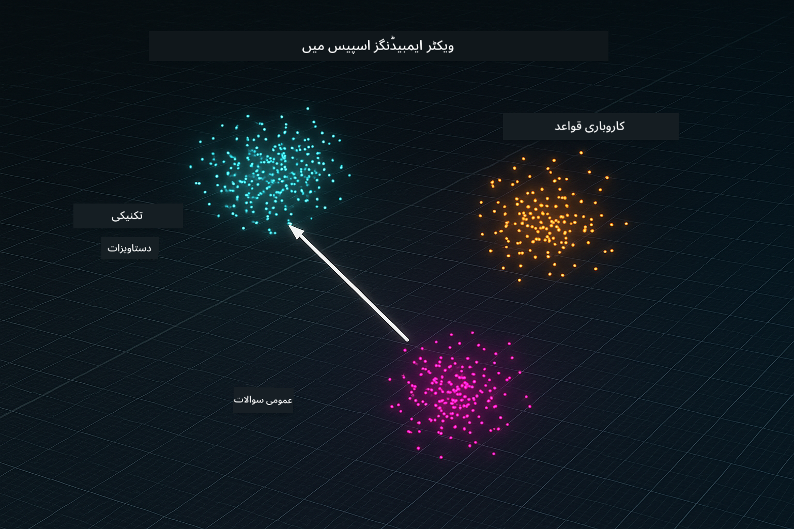

<!--
CO_OP_TRANSLATOR_METADATA:
{
  "original_hash": "f538a51cfd13147d40d84e936a0f485c",
  "translation_date": "2025-12-13T16:48:29+00:00",
  "source_file": "03-rag/README.md",
  "language_code": "ur"
}
-->
# ماڈیول 03: RAG (ریٹریول-آگمینٹڈ جنریشن)

## فہرست مضامین

- [آپ کیا سیکھیں گے](../../../03-rag)
- [ضروریات](../../../03-rag)
- [RAG کو سمجھنا](../../../03-rag)
- [یہ کیسے کام کرتا ہے](../../../03-rag)
  - [دستاویز کی پروسیسنگ](../../../03-rag)
  - [ایمبیڈنگز بنانا](../../../03-rag)
  - [سمانٹک سرچ](../../../03-rag)
  - [جواب کی تخلیق](../../../03-rag)
- [ایپلیکیشن چلائیں](../../../03-rag)
- [ایپلیکیشن کا استعمال](../../../03-rag)
  - [دستاویز اپ لوڈ کریں](../../../03-rag)
  - [سوالات پوچھیں](../../../03-rag)
  - [ماخذ حوالہ جات چیک کریں](../../../03-rag)
  - [سوالات کے ساتھ تجربہ کریں](../../../03-rag)
- [اہم تصورات](../../../03-rag)
  - [چنکنگ حکمت عملی](../../../03-rag)
  - [مشابہت کے اسکورز](../../../03-rag)
  - [ان-میموری اسٹوریج](../../../03-rag)
  - [کانٹیکسٹ ونڈو مینجمنٹ](../../../03-rag)
- [جب RAG اہم ہوتا ہے](../../../03-rag)
- [اگلے اقدامات](../../../03-rag)

## آپ کیا سیکھیں گے

پچھلے ماڈیولز میں، آپ نے سیکھا کہ AI کے ساتھ بات چیت کیسے کی جاتی ہے اور اپنے پرامپٹس کو مؤثر طریقے سے کیسے ترتیب دیا جاتا ہے۔ لیکن ایک بنیادی حد ہے: زبان کے ماڈلز صرف وہی جانتے ہیں جو انہوں نے تربیت کے دوران سیکھا ہے۔ وہ آپ کی کمپنی کی پالیسیوں، آپ کے پروجیکٹ کی دستاویزات، یا کسی بھی ایسی معلومات کے بارے میں سوالات کا جواب نہیں دے سکتے جن پر انہیں تربیت نہیں دی گئی۔

RAG (ریٹریول-آگمینٹڈ جنریشن) اس مسئلے کو حل کرتا ہے۔ ماڈل کو آپ کی معلومات سکھانے کی کوشش کرنے کے بجائے (جو مہنگا اور غیر عملی ہے)، آپ اسے اپنی دستاویزات میں تلاش کرنے کی صلاحیت دیتے ہیں۔ جب کوئی سوال پوچھتا ہے، تو سسٹم متعلقہ معلومات تلاش کرتا ہے اور اسے پرامپٹ میں شامل کرتا ہے۔ ماڈل پھر اس بازیافت شدہ سیاق و سباق کی بنیاد پر جواب دیتا ہے۔

RAG کو ماڈل کو ایک حوالہ جاتی لائبریری دینے کے طور پر سوچیں۔ جب آپ سوال پوچھتے ہیں، تو سسٹم:

1. **صارف کا سوال** - آپ سوال پوچھتے ہیں  
2. **ایمبیڈنگ** - آپ کے سوال کو ویکٹر میں تبدیل کرتا ہے  
3. **ویکٹر سرچ** - ملتے جلتے دستاویز کے چنکس تلاش کرتا ہے  
4. **کانٹیکسٹ اسمبلی** - متعلقہ چنکس کو پرامپٹ میں شامل کرتا ہے  
5. **جواب** - LLM سیاق و سباق کی بنیاد پر جواب تیار کرتا ہے  

یہ ماڈل کے جوابات کو آپ کے اصل ڈیٹا پر مبنی بناتا ہے بجائے اس کے کہ وہ اپنی تربیتی معلومات پر انحصار کرے یا جوابات گھڑے۔


*RAG ورک فلو - صارف کے سوال سے سمانٹک سرچ تک اور کانٹیکسچول جواب کی تخلیق تک*

## ضروریات

- ماڈیول 01 مکمل کیا ہوا (Azure OpenAI وسائل تعینات کیے گئے)
- روٹ ڈائریکٹری میں `.env` فائل Azure کی اسناد کے ساتھ (ماڈیول 01 میں `azd up` کے ذریعے بنائی گئی)

> **نوٹ:** اگر آپ نے ماڈیول 01 مکمل نہیں کیا، تو پہلے وہاں دی گئی تعیناتی کی ہدایات پر عمل کریں۔

## یہ کیسے کام کرتا ہے

**دستاویز کی پروسیسنگ** - [DocumentService.java](../../../03-rag/src/main/java/com/example/langchain4j/rag/service/DocumentService.java)

جب آپ کوئی دستاویز اپ لوڈ کرتے ہیں، تو سسٹم اسے چنکس میں تقسیم کرتا ہے - چھوٹے حصے جو ماڈل کے کانٹیکسٹ ونڈو میں آرام سے فٹ ہوتے ہیں۔ یہ چنکس معمولی حد تک اوورلیپ کرتے ہیں تاکہ آپ کو سرحدوں پر سیاق و سباق نہ کھونا پڑے۔

```java
Document document = FileSystemDocumentLoader.loadDocument("sample-document.txt");

DocumentSplitter splitter = DocumentSplitters
    .recursive(300, 30, new OpenAiTokenizer());

List<TextSegment> segments = splitter.split(document);
```

> **🤖 [GitHub Copilot](https://github.com/features/copilot) چیٹ کے ساتھ آزمائیں:** [`DocumentService.java`](../../../03-rag/src/main/java/com/example/langchain4j/rag/service/DocumentService.java) کھولیں اور پوچھیں:  
> - "LangChain4j دستاویزات کو چنکس میں کیسے تقسیم کرتا ہے اور اوورلیپ کیوں اہم ہے؟"  
> - "مختلف دستاویز کی اقسام کے لیے مثالی چنک سائز کیا ہے اور کیوں؟"  
> - "میں متعدد زبانوں یا خاص فارمیٹنگ والی دستاویزات کو کیسے ہینڈل کروں؟"

**ایمبیڈنگز بنانا** - [LangChainRagConfig.java](../../../03-rag/src/main/java/com/example/langchain4j/rag/config/LangChainRagConfig.java)

ہر چنک کو ایک عددی نمائندگی میں تبدیل کیا جاتا ہے جسے ایمبیڈنگ کہا جاتا ہے - بنیادی طور پر ایک ریاضیاتی فنگر پرنٹ جو متن کے معنی کو پکڑتا ہے۔ ملتے جلتے متن ملتی جلتی ایمبیڈنگز پیدا کرتے ہیں۔

```java
@Bean
public EmbeddingModel embeddingModel() {
    return OpenAiOfficialEmbeddingModel.builder()
        .baseUrl(azureOpenAiEndpoint)
        .apiKey(azureOpenAiKey)
        .modelName(azureEmbeddingDeploymentName)
        .build();
}

EmbeddingStore<TextSegment> embeddingStore = 
    new InMemoryEmbeddingStore<>();
```



*دستاویزات کو ایمبیڈنگ اسپیس میں ویکٹرز کے طور پر ظاہر کیا گیا ہے - ملتے جلتے مواد ایک ساتھ کلسٹر ہوتے ہیں*

**سمانٹک سرچ** - [RagService.java](../../../03-rag/src/main/java/com/example/langchain4j/rag/service/RagService.java)

جب آپ سوال پوچھتے ہیں، تو آپ کا سوال بھی ایک ایمبیڈنگ بن جاتا ہے۔ سسٹم آپ کے سوال کی ایمبیڈنگ کا موازنہ تمام دستاویز کے چنکس کی ایمبیڈنگز سے کرتا ہے۔ یہ چنکس تلاش کرتا ہے جن کے معنی سب سے زیادہ ملتے جلتے ہوں - صرف کلیدی الفاظ کی مماثلت نہیں بلکہ حقیقی معنوی مشابہت۔

```java
Embedding queryEmbedding = embeddingModel.embed(question).content();

List<EmbeddingMatch<TextSegment>> matches = 
    embeddingStore.findRelevant(queryEmbedding, 5, 0.7);

for (EmbeddingMatch<TextSegment> match : matches) {
    String relevantText = match.embedded().text();
    double score = match.score();
}
```

> **🤖 [GitHub Copilot](https://github.com/features/copilot) چیٹ کے ساتھ آزمائیں:** [`RagService.java`](../../../03-rag/src/main/java/com/example/langchain4j/rag/service/RagService.java) کھولیں اور پوچھیں:  
> - "ایمبیڈنگز کے ساتھ مشابہت کی تلاش کیسے کام کرتی ہے اور اسکور کیا طے کرتا ہے؟"  
> - "مجھے کون سا مشابہت کا حد استعمال کرنا چاہیے اور یہ نتائج کو کیسے متاثر کرتا ہے؟"  
> - "میں ایسے کیسز کو کیسے ہینڈل کروں جہاں کوئی متعلقہ دستاویزات نہ ملیں؟"

**جواب کی تخلیق** - [RagService.java](../../../03-rag/src/main/java/com/example/langchain4j/rag/service/RagService.java)

سب سے متعلقہ چنکس ماڈل کے پرامپٹ میں شامل کیے جاتے ہیں۔ ماڈل ان مخصوص چنکس کو پڑھتا ہے اور اس معلومات کی بنیاد پر آپ کے سوال کا جواب دیتا ہے۔ یہ ہیلوسینیشن کو روکتا ہے - ماڈل صرف سامنے موجود معلومات سے جواب دے سکتا ہے۔

## ایپلیکیشن چلائیں

**تصدیق کریں کہ تعیناتی مکمل ہے:**

یقینی بنائیں کہ روٹ ڈائریکٹری میں `.env` فائل موجود ہے جس میں Azure کی اسناد ہیں (ماڈیول 01 کے دوران بنائی گئی):  
```bash
cat ../.env  # دکھانا چاہیے AZURE_OPENAI_ENDPOINT، API_KEY، DEPLOYMENT
```
  
**ایپلیکیشن شروع کریں:**

> **نوٹ:** اگر آپ نے پہلے ماڈیول 01 سے `./start-all.sh` کے ذریعے تمام ایپلیکیشنز شروع کر دی ہیں، تو یہ ماڈیول پہلے ہی پورٹ 8081 پر چل رہا ہے۔ آپ نیچے دیے گئے شروع کرنے کے کمانڈز کو چھوڑ کر براہ راست http://localhost:8081 پر جا سکتے ہیں۔

**اختیار 1: Spring Boot ڈیش بورڈ کا استعمال (VS Code صارفین کے لیے تجویز کردہ)**

ڈویلپمنٹ کنٹینر میں Spring Boot ڈیش بورڈ ایکسٹینشن شامل ہے، جو تمام Spring Boot ایپلیکیشنز کو منظم کرنے کے لیے ایک بصری انٹرفیس فراہم کرتا ہے۔ آپ اسے VS Code کے بائیں جانب ایکٹیویٹی بار میں Spring Boot آئیکن کے طور پر دیکھ سکتے ہیں۔

Spring Boot ڈیش بورڈ سے آپ:  
- ورک اسپیس میں دستیاب تمام Spring Boot ایپلیکیشنز دیکھ سکتے ہیں  
- ایک کلک سے ایپلیکیشنز شروع/روک سکتے ہیں  
- ایپلیکیشن لاگز کو حقیقی وقت میں دیکھ سکتے ہیں  
- ایپلیکیشن کی حالت کی نگرانی کر سکتے ہیں  

بس "rag" کے ساتھ پلے بٹن پر کلک کریں تاکہ یہ ماڈیول شروع ہو جائے، یا تمام ماڈیولز کو ایک ساتھ شروع کریں۔


**اختیار 2: شیل اسکرپٹس کا استعمال**

تمام ویب ایپلیکیشنز (ماڈیولز 01-04) شروع کریں:

**بش:**  
```bash
cd ..  # روٹ ڈائریکٹری سے
./start-all.sh
```
  
**پاور شیل:**  
```powershell
cd ..  # روٹ ڈائریکٹری سے
.\start-all.ps1
```
  
یا صرف یہ ماڈیول شروع کریں:

**بش:**  
```bash
cd 03-rag
./start.sh
```
  
**پاور شیل:**  
```powershell
cd 03-rag
.\start.ps1
```
  
دونوں اسکرپٹس خود بخود روٹ `.env` فائل سے ماحول کے متغیرات لوڈ کرتے ہیں اور اگر JARs موجود نہ ہوں تو انہیں بنائیں گے۔

> **نوٹ:** اگر آپ شروع کرنے سے پہلے تمام ماڈیولز کو دستی طور پر بنانا چاہتے ہیں:  
>  
> **بش:**  
> ```bash
> cd ..  # Go to root directory
> mvn clean package -DskipTests
> ```
  
> **پاور شیل:**  
> ```powershell
> cd ..  # Go to root directory
> mvn clean package -DskipTests
> ```
  
اپنا براؤزر کھولیں اور http://localhost:8081 پر جائیں۔

**بند کرنے کے لیے:**

**بش:**  
```bash
./stop.sh  # صرف یہ ماڈیول
# یا
cd .. && ./stop-all.sh  # تمام ماڈیولز
```
  
**پاور شیل:**  
```powershell
.\stop.ps1  # یہ ماڈیول صرف
# یا
cd ..; .\stop-all.ps1  # تمام ماڈیولز
```


## ایپلیکیشن کا استعمال

ایپلیکیشن دستاویز اپ لوڈ اور سوالات کے لیے ویب انٹرفیس فراہم کرتی ہے۔

<a href="images/rag-homepage.png"></a>

*RAG ایپلیکیشن انٹرفیس - دستاویزات اپ لوڈ کریں اور سوالات پوچھیں*

**دستاویز اپ لوڈ کریں**

شروع کریں ایک دستاویز اپ لوڈ کر کے - TXT فائلیں ٹیسٹنگ کے لیے بہترین کام کرتی ہیں۔ اس ڈائریکٹری میں `sample-document.txt` فراہم کی گئی ہے جس میں LangChain4j کی خصوصیات، RAG کی عمل درآمد، اور بہترین طریقے شامل ہیں - جو سسٹم کی جانچ کے لیے بہترین ہے۔

سسٹم آپ کی دستاویز کو پروسیس کرتا ہے، اسے چنکس میں تقسیم کرتا ہے، اور ہر چنک کے لیے ایمبیڈنگز بناتا ہے۔ یہ سب خودکار طریقے سے اپ لوڈ کے وقت ہوتا ہے۔

**سوالات پوچھیں**

اب دستاویز کے مواد کے بارے میں مخصوص سوالات پوچھیں۔ کوئی ایسا حقائق پر مبنی سوال آزمائیں جو دستاویز میں واضح طور پر بیان کیا گیا ہو۔ سسٹم متعلقہ چنکس تلاش کرتا ہے، انہیں پرامپٹ میں شامل کرتا ہے، اور جواب تیار کرتا ہے۔

**ماخذ حوالہ جات چیک کریں**

نوٹ کریں کہ ہر جواب میں ماخذ حوالہ جات شامل ہوتے ہیں جن کے ساتھ مشابہت کے اسکورز ہوتے ہیں۔ یہ اسکورز (0 سے 1 تک) دکھاتے ہیں کہ ہر چنک آپ کے سوال سے کتنا متعلقہ تھا۔ زیادہ اسکورز بہتر مماثلت ظاہر کرتے ہیں۔ اس سے آپ جواب کو ماخذ مواد کے خلاف تصدیق کر سکتے ہیں۔

<a href="images/rag-query-results.png"></a>

*سوال کے نتائج جو جواب کے ساتھ ماخذ حوالہ جات اور مطابقت کے اسکورز دکھا رہے ہیں*

**سوالات کے ساتھ تجربہ کریں**

مختلف قسم کے سوالات آزمائیں:  
- مخصوص حقائق: "مرکزی موضوع کیا ہے؟"  
- موازنہ: "X اور Y میں کیا فرق ہے؟"  
- خلاصے: "Z کے بارے میں کلیدی نکات کا خلاصہ کریں"  

دیکھیں کہ آپ کے سوال کے دستاویز کے مواد سے میل کھانے کی بنیاد پر مطابقت کے اسکورز کیسے بدلتے ہیں۔

## اہم تصورات

**چنکنگ حکمت عملی**

دستاویزات کو 300 ٹوکن کے چنکس میں تقسیم کیا جاتا ہے جن میں 30 ٹوکن کا اوورلیپ ہوتا ہے۔ یہ توازن یقینی بناتا ہے کہ ہر چنک کے پاس کافی سیاق و سباق ہو تاکہ وہ معنی خیز ہو اور ساتھ ہی اتنا چھوٹا ہو کہ ایک پرامپٹ میں متعدد چنکس شامل کیے جا سکیں۔

**مشابہت کے اسکورز**

اسکورز 0 سے 1 کے درمیان ہوتے ہیں:  
- 0.7-1.0: انتہائی متعلقہ، بالکل میل  
- 0.5-0.7: متعلقہ، اچھا سیاق و سباق  
- 0.5 سے کم: فلٹر کیے گئے، بہت مختلف  

سسٹم صرف ان چنکس کو بازیافت کرتا ہے جو کم از کم حد سے اوپر ہوں تاکہ معیار یقینی بنایا جا سکے۔

**ان-میموری اسٹوریج**

یہ ماڈیول سادگی کے لیے ان-میموری اسٹوریج استعمال کرتا ہے۔ جب آپ ایپلیکیشن کو دوبارہ شروع کرتے ہیں، تو اپ لوڈ کی گئی دستاویزات ضائع ہو جاتی ہیں۔ پروڈکشن سسٹمز مستقل ویکٹر ڈیٹا بیس جیسے Qdrant یا Azure AI سرچ استعمال کرتے ہیں۔

**کانٹیکسٹ ونڈو مینجمنٹ**

ہر ماڈل کی زیادہ سے زیادہ کانٹیکسٹ ونڈو ہوتی ہے۔ آپ ایک بڑی دستاویز کے تمام چنکس شامل نہیں کر سکتے۔ سسٹم سب سے زیادہ متعلقہ N چنکس (ڈیفالٹ 5) بازیافت کرتا ہے تاکہ حدود کے اندر رہتے ہوئے درست جوابات کے لیے کافی سیاق و سباق فراہم کیا جا سکے۔

## جب RAG اہم ہوتا ہے

**RAG استعمال کریں جب:**  
- مخصوص دستاویزات کے بارے میں سوالات کے جواب دینا ہو  
- معلومات بار بار تبدیل ہوتی ہو (پالیسیاں، قیمتیں، وضاحتیں)  
- درستگی کے لیے ماخذ حوالہ درکار ہو  
- مواد اتنا بڑا ہو کہ ایک پرامپٹ میں شامل نہ کیا جا سکے  
- آپ کو قابل تصدیق، مستند جوابات چاہیے ہوں  

**RAG استعمال نہ کریں جب:**  
- سوالات عمومی معلومات کے بارے میں ہوں جو ماڈل پہلے سے جانتا ہو  
- حقیقی وقت کا ڈیٹا درکار ہو (RAG اپ لوڈ کی گئی دستاویزات پر کام کرتا ہے)  
- مواد اتنا چھوٹا ہو کہ اسے براہ راست پرامپٹ میں شامل کیا جا سکے  

## اگلے اقدامات

**اگلا ماڈیول:** [04-tools - AI Agents with Tools](../04-tools/README.md)

---

**نیویگیشن:** [← پچھلا: ماڈیول 02 - پرامپٹ انجینئرنگ](../02-prompt-engineering/README.md) | [مین پر واپس](../README.md) | [اگلا: ماڈیول 04 - ٹولز →](../04-tools/README.md)

---

<!-- CO-OP TRANSLATOR DISCLAIMER START -->
**دستخطی نوٹ**:  
یہ دستاویز AI ترجمہ سروس [Co-op Translator](https://github.com/Azure/co-op-translator) کے ذریعے ترجمہ کی گئی ہے۔ اگرچہ ہم درستگی کے لیے کوشاں ہیں، براہ کرم اس بات سے آگاہ رہیں کہ خودکار ترجمے میں غلطیاں یا عدم درستیاں ہو سکتی ہیں۔ اصل دستاویز اپنی مادری زبان میں ہی معتبر ماخذ سمجھی جانی چاہیے۔ اہم معلومات کے لیے پیشہ ور انسانی ترجمہ کی سفارش کی جاتی ہے۔ اس ترجمے کے استعمال سے پیدا ہونے والی کسی بھی غلط فہمی یا غلط تشریح کی ذمہ داری ہم پر عائد نہیں ہوتی۔
<!-- CO-OP TRANSLATOR DISCLAIMER END -->