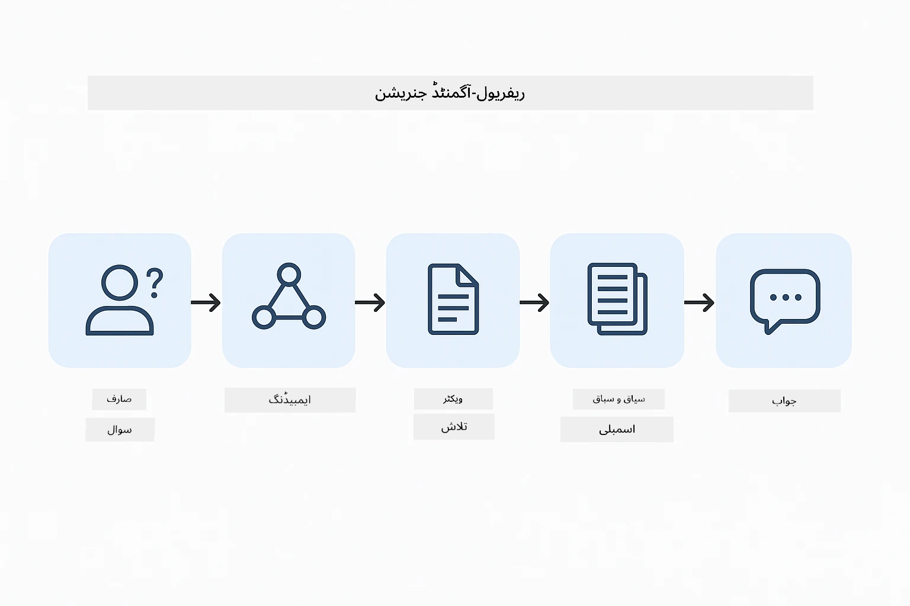
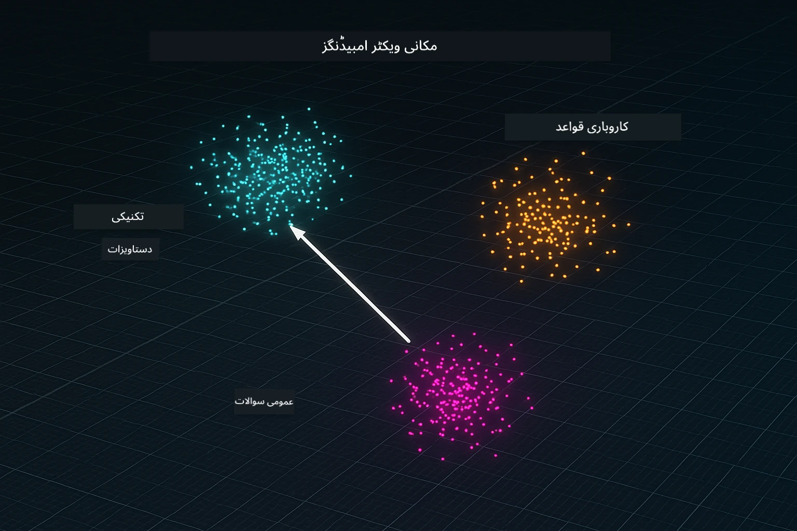
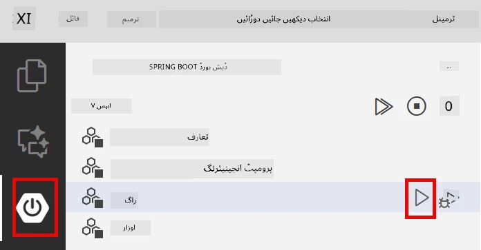
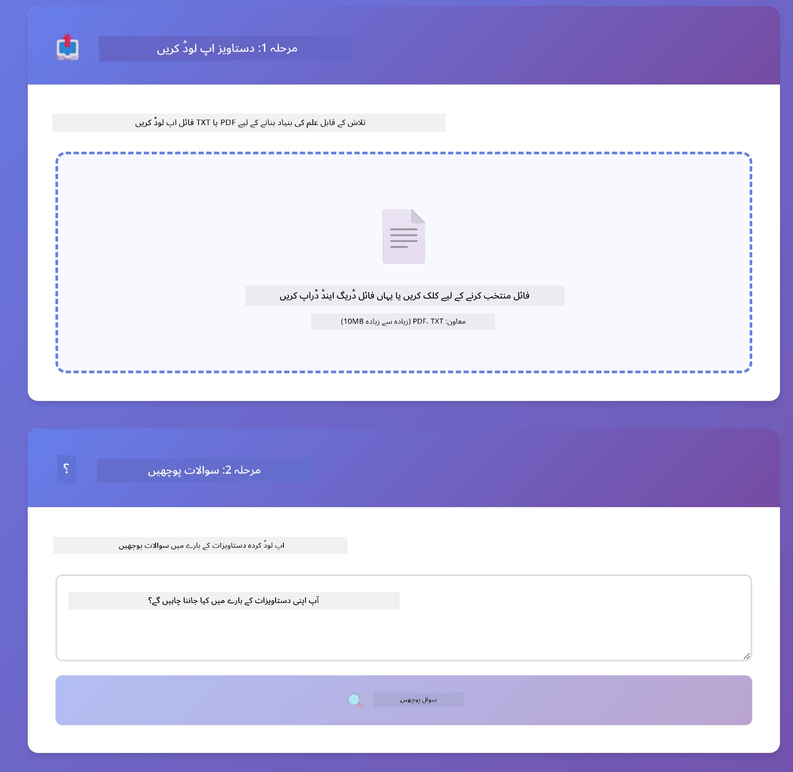
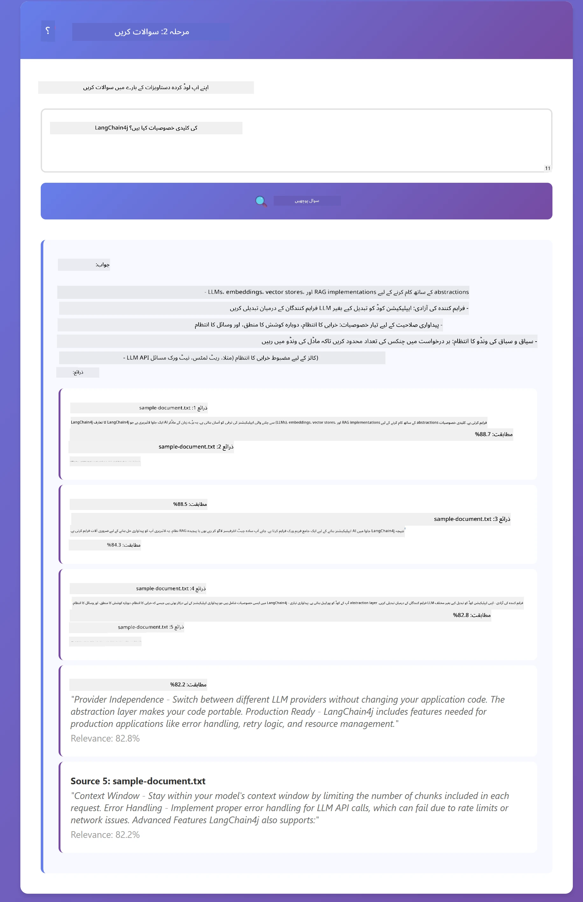

# ماڈیول 03: RAG (ریکوری-آگمینٹڈ جنریشن)

## مواد کی فہرست

- [ویڈیو واک تھرو](#ویڈیو-واک-تھرو)
- [آپ کیا سیکھیں گے](#آپ-کیا-سیکھیں-گے)
- [پری ریکوزٹس](#پری-ریکوزٹس)
- [RAG کو سمجھنا](#rag-کو-سمجھنا)
  - [یہ ٹیوٹوریل کون سا RAG طریقہ استعمال کرتا ہے؟](#یہ-ٹیوٹوریل-کون-سا-rag-طریقہ-استعمال-کرتا-ہے؟)
- [یہ کیسے کام کرتا ہے](#یہ-کیسے-کام-کرتا-ہے)
  - [دستاویز کی پراسیسنگ](#دستاویز-کی-پراسیسنگ)
  - [ایمبیڈنگز بنانا](#ایمبیڈنگز-بنانا)
  - [سیمنٹک سرچ](#سیمنٹک-سرچ)
  - [جواب تیار کرنا](#جواب-کی-تخلیق)
- [ایپلیکیشن چلائیں](#ایپلیکیشن-چلائیں)
- [ایپلیکیشن استعمال کرنا](#ایپلیکیشن-کا-استعمال)
  - [ایک دستاویز اپ لوڈ کریں](#دستاویز-اپلوڈ-کریں)
  - [سوالات پوچھیں](#سوالات-پوچھیں)
  - [ذرائع کی حوالہ جات چیک کریں](#ماخذ-حوالہ-جات-چیک-کریں)
  - [سوالات کے ساتھ تجربہ کریں](#سوالات-کے-ساتھ-تجربہ-کریں)
- [اہم تصورات](#کلیدی-تصورات)
  - [چنکنگ حکمت عملی](#ٹکڑوں-کی-حکمت-عملی-chunking-strategy)
  - [مماثلت کے اسکورز](#مماثلت-کے-اسکور)
  - [میموری میں اسٹوریج](#میموری-میں-ذخیرہ)
  - [کانٹیکسٹ ونڈو مینجمنٹ](#سیاق-و-سباق-ونڈو-مینجمنٹ)
- [جب RAG اہم ہو](#جب-rag-اہم-ہوتا-ہے)
- [اگلے اقدامات](#اگلے-مراحل)

## ویڈیو واک تھرو

اس لائیو سیشن کو دیکھیں جو اس ماڈیول کے ساتھ شروع کرنے کا طریقہ بتاتا ہے:

<a href="https://www.youtube.com/watch?v=_olq75ZH_eY"></a>

## آپ کیا سیکھیں گے

پچھلے ماڈیولز میں، آپ نے سیکھا کہ AI کے ساتھ بات چیت کیسے کی جائے اور اپنے پرامپٹس کو مؤثر طریقے سے کیسے ترتیب دیا جائے۔ لیکن ایک بنیادی حد ہے: زبان کے ماڈلز صرف وہی جانتے ہیں جو انہوں نے تربیت کے دوران سیکھا ہوتا ہے۔ وہ آپ کی کمپنی کی پالیسیوں، آپ کے پروجیکٹ کی دستاویزات، یا ایسی کسی معلومات کے بارے میں سوالات کا جواب نہیں دے سکتے جن پر انہیں تربیت نہیں دی گئی۔

RAG (ریکوری-آگمینٹڈ جنریشن) اس مسئلے کو حل کرتا ہے۔ ماڈل کو آپ کی معلومات سکھانے کی کوشش کرنے کی بجائے (جو مہنگا اور غیر عملی ہے)، آپ اسے اپنی دستاویزات میں تلاش کرنے کی صلاحیت دیتے ہیں۔ جب کوئی سوال کرتا ہے، تو نظام متعلقہ معلومات تلاش کرتا ہے اور اسے پرامپٹ میں شامل کرتا ہے۔ ماڈل پھر اس بازیافت شدہ سیاق و سباق کی بنیاد پر جواب دیتا ہے۔

RAG کو ایسے سمجھیں کہ آپ ماڈل کو ایک حوالہ جاتی لائبریری دے رہے ہیں۔ جب آپ سوال کرتے ہیں، تو نظام:

1. **صارف کا سوال** - آپ سوال کرتے ہیں  
2. **ایمبیڈنگ** - آپ کے سوال کو ویکٹر میں تبدیل کرتا ہے  
3. **ویکٹر سرچ** - متعلقہ دستاویز کے چنکس تلاش کرتا ہے  
4. **کانٹیکسٹ اسمبلی** - متعلقہ چنکس کو پرامپٹ میں شامل کرتا ہے  
5. **جواب** - LLM سیاق و سباق کی بنیاد پر جواب تیار کرتا ہے  

یہ ماڈل کے جوابات کو آپ کے اصل ڈیٹا پر قائم کرتا ہے بجائے اس کے کہ وہ اپنی تربیتی معلومات پر انحصار کرے یا جوابات خود بنا سکے۔

## پری ریکوزٹس

- مکمل شدہ [ماڈیول 01 - تعارف](../01-introduction/README.md) (Azure OpenAI وسائل تعینات کیے گئے، بشمول `text-embedding-3-small` ایمبیڈنگ ماڈل)
- روٹ ڈائریکٹری میں `.env` فائل Azure اسناد کے ساتھ (جو ماڈیول 01 میں `azd up` کی مدد سے بنائی گئی ہے)

> **نوٹ:** اگر آپ نے ماڈیول 01 مکمل نہیں کیا ہے، تو پہلے وہاں دی گئی تعیناتی کی ہدایات پر عمل کریں۔ `azd up` کمانڈ GPT چیٹ ماڈل اور اس ماڈیول میں استعمال ہونے والے ایمبیڈنگ ماڈل دونوں کو تعینات کرتا ہے۔

## RAG کو سمجھنا

ذیل میں دیا گیا خاکہ بنیادی تصور کو ظاہر کرتا ہے: ماڈل کی تربیت ڈیٹا پر انحصار کرنے کی بجائے، RAG اسے آپ کی دستاویزات کی ایک حوالہ جاتی لائبریری دیتا ہے تاکہ ہر جواب تیار کرنے سے پہلے اس سے رجوع کیا جا سکے۔


*یہ خاکہ ایک عام LLM (جو تربیتی ڈیٹا سے اندازہ لگاتا ہے) اور ایک RAG سے بہتر بنایا گیا LLM (جو پہلے آپ کی دستاویزات سے رجوع کرتا ہے) کے درمیان فرق دکھاتا ہے۔*

یہاں بتایا گیا ہے کہ تمام اجزاء آپس میں کیسے جڑتے ہیں۔ صارف کا سوال چار مراحل سے گزرتا ہے — ایمبیڈنگ، ویکٹر سرچ، کانٹیکسٹ اسمبلی، اور جواب کی تخلیق — ہر ایک پچھلے پر مبنی ہے:



*یہ خاکہ RAG کی پوری لائن دکھاتا ہے — ایک صارف کا سوال ایمبیڈنگ، ویکٹر سرچ، کانٹیکسٹ اسمبلی، اور جواب کی تخلیق سے گزرتا ہے۔*

ماڈیول کے بقیہ حصے میں ہر مرحلے کو تفصیل سے سمجھایا گیا ہے، ساتھ ہی کوڈ بھی فراہم کیا گیا ہے جسے آپ چلا اور ترمیم کر سکتے ہیں۔

### یہ ٹیوٹوریل کون سا RAG طریقہ استعمال کرتا ہے؟

LangChain4j تین طریقے فراہم کرتا ہے RAG کو نافذ کرنے کے لیے، ہر ایک مختلف سطح کی پیچیدگی کے ساتھ۔ ذیل کا خاکہ انہیں ایک ساتھ موازنہ کرتا ہے:


*یہ خاکہ LangChain4j کے تین RAG طریقوں — آسان، نیٹو، اور ایڈوانسڈ — کے کلیدی اجزاء اور استعمال کے اوقات دکھاتا ہے۔*

| طریقہ  | کیا کرتا ہے | سود و نقصان |
|---|---|---|
| **آسان RAG** | `AiServices` اور `ContentRetriever` کے ذریعے سب کچھ خود بخود کنفیگر کرتا ہے۔ آپ ایک انٹرفیس اینوٹ کرتے ہیں، ریٹریور لگاتے ہیں، اور LangChain4j ایمبیڈنگ، سرچ، اور پرامپٹ اسمبلی کو پیچھے سے سنبھالتا ہے۔ | کوڈ بہت کم، لیکن ہر مرحلے کی واضح تفصیل نظر نہیں آتی۔ |
| **نیٹو RAG** | آپ خود ایمبیڈنگ ماڈل کو کال کرتے ہیں، اسٹور میں سرچ کرتے ہیں، پرامپٹ بناتے ہیں، اور جواب تخلیق کرتے ہیں — ہر قدم واضح اور خود کنٹرول ہوتا ہے۔ | زیادہ کوڈ، لیکن ہر مرحلہ صاف نظر آتا ہے اور ترمیم کے قابل ہے۔ |
| **ایڈوانسڈ RAG** | `RetrievalAugmentor` فریم ورک استعمال کرتا ہے جس میں پلگ ایبل کوئری ٹرانسفارمرز، راؤٹرز، ری رینکرز، اور مواد ڈالنے والے شامل ہیں، جو پروڈکشن لیول پائپ لائنز کے لیے مناسب ہیں۔ | بے حد لچکدار، لیکن کافی پیچیدہ۔ |

**یہ ٹیوٹوریل نیٹو طریقہ استعمال کرتا ہے۔** RAG پائپ لائن کے ہر مرحلے — کوئری ایمبیڈنگ، ویکٹر اسٹور سرچ، کانٹیکسٹ اسمبلی، اور جواب تیار کرنا — کو [`RagService.java`](../../../03-rag/src/main/java/com/example/langchain4j/rag/service/RagService.java) میں واضح طور پر لکھا گیا ہے۔ یہ جان بوجھ کر کیا گیا ہے: سیکھنے کے لیے، ہر مرحلے کو دیکھنا اور سمجھنا زیادہ ضروری ہے بجائے اس کے کہ کوڈ کم سے کم ہو۔ جب آپ کو عمل کا اچھا فہم ہو جائے، تو آپ تیز پروٹوٹائپس کے لیے آسان RAG یا پروڈکشن کے لیے ایڈوانسڈ RAG پر جا سکتے ہیں۔

> **💡 آسان RAG میں دلچسپی ہے؟** LangChain4j ایک *آسان RAG* طریقہ بھی پیش کرتا ہے جہاں `AiServices` اور `ContentRetriever` ایمبیڈنگ، سرچ، اور پرامپٹ اسمبلی کو خودکار طریقے سے سنبھالتے ہیں۔ یہ ماڈیول زیادہ واضح راستہ اپناتا ہے — اس پائپ لائن کو کھول کر ہر مرحلے کو خود دیکھنے اور کنٹرول کرنے کے لیے۔

ذیل کا خاکہ آسان RAG پائپ لائن دکھاتا ہے۔ دھیان دیں کہ `AiServices` اور `EmbeddingStoreContentRetriever` کیسے تمام پیچیدگی کو چھپاتے ہیں — آپ ایک دستاویز لوڈ کرتے ہیں، ریٹریور لگاتے ہیں، اور جوابات حاصل کرتے ہیں۔ اس ماڈیول میں نیٹو طریقہ کار ہر چھپے ہوئے مرحلے کو کھولتا ہے:


*یہ خاکہ آسان RAG پائپ لائن دکھاتا ہے۔ اسے اس ماڈیول میں استعمال کیے گئے نیٹو طریقے سے موازنہ کریں: آسان RAG ایمبیڈنگ، بازیافت، اور پرامپٹ اسمبلی کو `AiServices` اور `ContentRetriever` کے پیچھے چھپاتا ہے — آپ دستاویز لوڈ کریں، ریٹریور لگائیں، اور جوابات حاصل کریں۔ اس ماڈیول کا نیٹو طریقہ وہ پائپ لائن کھولتا ہے تاکہ آپ ہر مرحلہ (ایمبیڈ، تلاش، کانٹیکسٹ بنائیں، جواب تیار کریں) خود کال کریں، اس طرح آپ کو مکمل رویت اور کنٹرول ملتا ہے۔*

## یہ کیسے کام کرتا ہے

اس ماڈیول میں RAG پائپ لائن چار مراحل پر مشتمل ہے جو ہر بار جب صارف سوال کرتا ہے ترتیب سے چلتے ہیں۔ سب سے پہلے، اپلوڈ کی گئی دستاویز کو **پارز اور چنکس میں تقسیم** کیا جاتا ہے۔ پھر وہ چنکس **ویکٹر ایمبیڈنگز** میں تبدیل کیے جاتے ہیں اور اس طرح محفوظ کیے جاتے ہیں کہ وہ ریاضیاتی طور پر موازنہ کیے جا سکیں۔ جب کوئی سوال آتا ہے، تو نظام **سیمنٹک سرچ** کرتا ہے تاکہ سب سے متعلقہ چنکس مل سکیں، اور آخر میں انہیں LLM کو **جواب تخلیق** کے لیے بطور سیاق و سباق دیتا ہے۔ ذیل کے سیکشن ہر مرحلے کو کوڈ اور خاکوں کے ساتھ تفصیل سے سمجھاتے ہیں۔ آئیے پہلے مرحلے کو دیکھتے ہیں۔

### دستاویز کی پراسیسنگ

[DocumentService.java](../../../03-rag/src/main/java/com/example/langchain4j/rag/service/DocumentService.java)

جب آپ ایک دستاویز اپلوڈ کرتے ہیں، تو نظام اسے پارز کرتا ہے (PDF یا سادہ متن)، فائل نام جیسی میٹا ڈیٹا لگاتا ہے، اور پھر اسے چنکس میں توڑ دیتا ہے — چھوٹے حصے جو ماڈل کے کانٹیکسٹ ونڈو میں آرام سے فٹ آ جاتے ہیں۔ یہ چنکس تھوڑا سا اوورلیپ کرتے ہیں تاکہ آپ سرحدوں پر سیاق و سباق نہ کھویں۔

```java
// اپ لوڈ کی گئی فائل کو پارس کریں اور اسے LangChain4j دستاویز میں لپیٹیں
Document document = Document.from(content, metadata);

// 300 ٹوکن کے ٹکڑوں میں تقسیم کریں جس میں 30 ٹوکن کا اوور لیپ ہو
DocumentSplitter splitter = DocumentSplitters
    .recursive(300, 30);

List<TextSegment> segments = splitter.split(document);
```

ذیل کا خاکہ بصری طور پر دکھاتا ہے کہ یہ کیسے کام کرتا ہے۔ دیکھیں کہ ہر چنک اپنے پڑوسیوں کے ساتھ کچھ ٹوکنز شیئر کرتا ہے — 30 ٹوکن اوورلیپ اس بات کو یقینی بناتا ہے کہ کوئی اہم سیاق باہم درمیان میں نہ گم ہو:


*یہ خاکہ دکھاتا ہے کہ دستاویز کو 300 ٹوکن کے چنکس میں تقسیم کیا جا رہا ہے جس میں 30 ٹوکن اوورلیپ ہے، تاکہ چنک کی سرحدوں پر سیاق و سباق برقرار رہے۔*

> **🤖 [GitHub Copilot](https://github.com/features/copilot) چیٹ کے ساتھ کوشش کریں:** [`DocumentService.java`](../../../03-rag/src/main/java/com/example/langchain4j/rag/service/DocumentService.java) کھولیں اور پوچھیں:  
> - "LangChain4j دستاویزات کو چنکس میں کیسے تقسیم کرتا ہے اور اوورلیپ کیوں ضروری ہے؟"  
> - "مختلف دستاویز کی اقسام کے لیے مثالی چنک سائز کیا ہے اور کیوں؟"  
> - "میں متعدد زبانوں یا خاص فارمیٹنگ والی دستاویزات کو کیسے ہینڈل کرتا ہوں؟"

### ایمبیڈنگز بنانا

[LangChainRagConfig.java](../../../03-rag/src/main/java/com/example/langchain4j/rag/config/LangChainRagConfig.java)

ہر چنک کو ایک عددی نمائندگی میں تبدیل کیا جاتا ہے جسے ایمبیڈنگ کہتے ہیں — بنیادی طور پر معنی کو نمبرز میں تبدیل کرنے والا آلہ۔ ایمبیڈنگ ماڈل "ذہین" نہیں ہوتا جیسا کہ چیٹ ماڈل ہوتا ہے؛ یہ ہدایات پر عمل نہیں کر سکتا، استدلال نہیں کر سکتا، یا سوالات کا جواب نہیں دے سکتا۔ جو یہ کر سکتا ہے وہ یہ ہے کہ متن کو ایسے ریاضیاتی جگہ میں نقش کر دے جہاں ایک جیسے معنی ایک دوسرے کے قریب واقع ہوتے ہیں — "کار" "گاڑی" کے قریب، "ریفنڈ پالیسی" "میرے پیسے واپس کرو" کے قریب۔ چیٹ ماڈل کو ایک انسان سمجھیں جس سے آپ بات کر سکتے ہیں؛ اور ایمبیڈنگ ماڈل کو ایک بہت ہی اچھا فائلنگ نظام سمجھیں۔

ذیل کا خاکہ اس تصور کو دکھاتا ہے — متن آتا ہے، عددی ویکٹر نکلتے ہیں، اور ایک جیسے معنی قریب ویکٹر پیدا کرتے ہیں:


*یہ خاکہ دکھاتا ہے کہ ایمبیڈنگ ماڈل متن کو عددی ویکٹرز میں کیسے تبدیل کرتا ہے، اسی طرح کے معنی مثلاً "کار" اور "گاڑی" کو ویکٹر اسپیس میں ایک دوسرے کے قریب رکھتا ہے۔*

```java
@Bean
public EmbeddingModel embeddingModel() {
    return OpenAiOfficialEmbeddingModel.builder()
        .baseUrl(azureOpenAiEndpoint)
        .apiKey(azureOpenAiKey)
        .modelName(azureEmbeddingDeploymentName)
        .build();
}

EmbeddingStore<TextSegment> embeddingStore = 
    new InMemoryEmbeddingStore<>();
```

ذیل کا کلاس ڈایاگرام RAG پائپ لائن میں دو الگ الگ فلوز اور LangChain4j کی کلاسز کو دکھاتا ہے جو انہیں نافذ کرتی ہیں۔ **انریشن فلور** (اپلوڈ کے وقت ایک بار چلتا ہے) دستاویز کو تقسیم کرتا ہے، چنکس کو ایمبیڈ کرتا ہے، اور `.addAll()` کے ذریعے ذخیرہ کرتا ہے۔ **کوئری فلور** (ہر بار جب صارف سوال کرتا ہے) سوال کو ایمبیڈ کرتا ہے، `.search()` کے ذریعے اسٹور میں تلاش کرتا ہے، اور میچ شدہ کانٹیکسٹ کو چیٹ ماڈل کو دیتا ہے۔ دونوں فلوز مشترکہ `EmbeddingStore<TextSegment>` انٹرفیس پر ملتے ہیں:


*یہ خاکہ RAG پائپ لائن کے دونوں فلوز — انریشن اور کوئری — اور ان کے مشترکہ EmbeddingStore کے ذریعے جڑنے کو دکھاتا ہے۔*

ایک بار ایمبیڈنگز محفوظ ہو جائیں، تو مشابہ مواد قدرتی طور پر ویکٹر اسپیس میں ایک ساتھ گروہ بند ہو جاتے ہیں۔ ذیل کی وضاحت دکھاتی ہے کہ متعلقہ موضوعات والی دستاویزات قریب نزدیک پوائنٹس کی صورت میں بنتی ہیں، جو سیمنٹک سرچ کو ممکن بناتی ہے:



*یہ وضاحت دکھاتی ہے کہ تکنیکی دستاویزات، کاروباری قواعد، اور اکثر پوچھے جانے والے سوالات جیسے موضوعات 3D ویکٹر اسپیس میں ایک خاص گروہ بناتے ہیں۔*

جب کوئی صارف تلاش کرتا ہے، تو نظام چار مراحل پر عمل کرتا ہے: دستاویزات کو ایک بار ایمبیڈ کرتا ہے، ہر تلاش پر سوال کو ایمبیڈ کرتا ہے، سوال کے ویکٹر کو تمام ذخیرہ شدہ ویکٹرز سے کوسائن سیمیلیریٹی کے ذریعے موازنہ کرتا ہے، اور سب سے زیادہ اسکورنگ والے چنکس واپس کرتا ہے۔ ذیل کا خاکہ ہر مرحلے اور شامل LangChain4j کلاسز کو دکھاتا ہے:


*یہ خاکہ چار مرحلے پر مشتمل ایمبیڈنگ سرچ کے عمل کو دکھاتا ہے: دستاویزات کو ایمبیڈ کریں، سوال کو ایمبیڈ کریں، ویکٹرز کا کوسائن سیمیلیریٹی سے موازنہ کریں، اور ٹاپ-K نتائج واپس کریں۔*

### سیمنٹک سرچ

[RagService.java](../../../03-rag/src/main/java/com/example/langchain4j/rag/service/RagService.java)

جب آپ سوال کرتے ہیں، تو آپ کا سوال بھی ایک ایمبیڈنگ بن جاتا ہے۔ نظام آپ کے سوال کی ایمبیڈنگ کا موازنہ تمام دستاویز چنکس کی ایمبیڈنگز سے کرتا ہے۔ یہ چنکس تلاش کرتا ہے جن کے معنی سب سے زیادہ ملتے جلتے ہوں — صرف کلیدی الفاظ نہیں بلکہ اصل معنوی مماثلت۔

```java
Embedding queryEmbedding = embeddingModel.embed(question).content();

EmbeddingSearchRequest searchRequest = EmbeddingSearchRequest.builder()
    .queryEmbedding(queryEmbedding)
    .maxResults(5)
    .minScore(0.5)
    .build();

EmbeddingSearchResult<TextSegment> searchResult = embeddingStore.search(searchRequest);
List<EmbeddingMatch<TextSegment>> matches = searchResult.matches();

for (EmbeddingMatch<TextSegment> match : matches) {
    String relevantText = match.embedded().text();
    double score = match.score();
}
```

ذیل کا خاکہ سیمنٹک سرچ کو روایتی کلیدی لفظ تلاش کے مقابلے میں دکھاتا ہے۔ "vehicle" کے لیے کلیدی لفظ تلاش "cars and trucks" والے چنک کو نہیں ڈھونڈ پاتی، لیکن سیمنٹک سرچ سمجھتی ہے کہ وہ ایک ہی مطلب رکھتے ہیں اور اسے اعلی اسکور کے ساتھ واپس کرتی ہے:


*یہ خاکہ کلیدی لفظ پر مبنی تلاش اور سیمنٹک تلاش کا موازنہ کرتا ہے، دکھاتا ہے کہ سیمنٹک تلاش اس مواد کو بھی بازیافت کرتی ہے جس کا تعلق تصوری طور پر ہوتا ہے چاہے کلیدی الفاظ مختلف ہوں۔*

نیچے دیے گئے گرافی میں، ہم کوسائن سیمیلیریٹی کے ذریعے مشابہت کو ناپتے ہیں — یعنی "کیا یہ دو تیر ایک ہی سمت میں اشارہ کر رہے ہیں؟"۔ دو چنکس بالکل مختلف الفاظ استعمال کر سکتے ہیں، لیکن اگر وہ ایک ہی مطلب رکھتے ہیں تو ان کے ویکٹر ایک ہی سمت میں ہوں گے اور اسکور 1.0 کے قریب ہوگا:


*یہ خاکہ کوسائن مماثلت کو ایمبیڈنگ ویکٹروں کے درمیان زاویہ کے طور پر ظاہر کرتا ہے — زیادہ ہم آہنگ ویکٹرز 1.0 کے قریب اسکور کرتے ہیں، جو زیادہ معنوی مماثلت کی نشاندہی کرتا ہے۔*

> **🤖 [GitHub Copilot](https://github.com/features/copilot) چیٹ کے ساتھ کوشش کریں:** [`RagService.java`](../../../03-rag/src/main/java/com/example/langchain4j/rag/service/RagService.java) کھولیں اور پوچھیں:
> - "ایمبیڈنگز کے ساتھ مماثلت تلاش کیسے کام کرتی ہے اور اسکور کیا طے کرتا ہے؟"
> - "مجھے کون سا مماثلت کا حد استعمال کرنا چاہیے اور یہ نتائج کو کیسے متاثر کرتا ہے؟"
> - "میں ایسے معاملات کو کیسے ہینڈل کروں جہاں کوئی متعلقہ دستاویزات نہ ملیں؟"

### جواب کی تخلیق

[RagService.java](../../../03-rag/src/main/java/com/example/langchain4j/rag/service/RagService.java)

سب سے متعلقہ ٹکڑے ایک منظم پرامپٹ میں جمع کیے جاتے ہیں جس میں واضح ہدایات، بازیافت شدہ سیاق و سباق، اور صارف کا سوال شامل ہوتا ہے۔ ماڈل ان مخصوص ٹکڑوں کو پڑھتا ہے اور اس معلومات کی بنیاد پر جواب دیتا ہے — یہ صرف سامنے موجود مواد استعمال کر سکتا ہے، جو ہیلوسینیشن کو روکتا ہے۔

```java
String context = matches.stream()
    .map(match -> match.embedded().text())
    .collect(Collectors.joining("\n\n"));

String prompt = String.format("""
    Answer the question based on the following context.
    If the answer cannot be found in the context, say so.

    Context:
    %s

    Question: %s

    Answer:""", context, request.question());

String answer = chatModel.chat(prompt);
```

نیچے دیا گیا خاکہ اس اسمبلنگ کو عملی طور پر دکھاتا ہے — تلاش کے مرحلے سے سب سے زیادہ اسکور کرنے والے ٹکڑے پرامپٹ ٹیمپلیٹ میں ڈاInject کیے جاتے ہیں، اور `OpenAiOfficialChatModel` ایک بنیاد فراہم کرنے والا جواب تیار کرتا ہے:


*یہ خاکہ دکھاتا ہے کہ کیسے سب سے زیادہ اسکور کرنے والے ٹکڑے ایک منظم پرامپٹ میں جمع کیے جاتے ہیں، ماڈل کو آپ کے ڈیٹا سے ایک بنیاد یافتہ جواب تیار کرنے کی اجازت دیتا ہے۔*

## ایپلیکیشن چلائیں

**تصدیق کریں کہ تنصیب مکمل ہے:**

یقین دہانی کریں کہ `.env` فائل روٹ ڈائریکٹری میں موجود ہے جس میں Azure کے اسناد ہیں (جو ماڈیول 01 کے دوران بنائی گئی تھیں)۔ اس کو ماڈیول ڈائریکٹری (`03-rag/`) سے چلائیں:

**Bash:**
```bash
cat ../.env  # AZURE_OPENAI_ENDPOINT, API_KEY, DEPLOYMENT دکھانا چاہیے
```

**PowerShell:**
```powershell
Get-Content ..\.env  # دکھانا چاہیے AZURE_OPENAI_ENDPOINT، API_KEY، DEPLOYMENT
```

**ایپلیکیشن شروع کریں:**

> **نوٹ:** اگر آپ پہلے ہی روٹ ڈائریکٹری سے `./start-all.sh` استعمال کرکے تمام ایپلیکیشنز شروع کر چکے ہیں (جیسا کہ ماڈیول 01 میں بیان کیا گیا ہے)، تو یہ ماڈیول پہلے سے پورٹ 8081 پر چل رہا ہے۔ نیچے دیے گئے شروع کرنے کے کمانڈز کو نظر انداز کریں اور براہ راست http://localhost:8081 پر جائیں۔

**آپشن 1: Spring Boot ڈیش بورڈ کا استعمال کرنا (VS کوڈ صارفین کے لیے تجویز کردہ)**

ڈویلپمنٹ کنٹینر میں Spring Boot ڈیش بورڈ ایکسٹینشن شامل ہے، جو تمام Spring Boot ایپلیکیشنز کا ایک بصری انٹرفیس فراہم کرتا ہے۔ آپ اسے VS کوڈ کے بائیں جانب ایکٹیویٹی بار میں Spring Boot آئی کن کے طور پر دیکھ سکتے ہیں۔

Spring Boot ڈیش بورڈ سے آپ کر سکتے ہیں:
- ورک اسپیس میں تمام دستیاب Spring Boot ایپلیکیشنز دیکھیں
- ایک کلک سے ایپلیکیشنز کو شروع/روکیں
- ایپلیکیشن لاگز کو حقیقی وقت میں دیکھیں
- ایپلیکیشن کی حالت کی نگرانی کریں

بس "rag" کے ساتھ موجود پلے بٹن پر کلک کریں تاکہ یہ ماڈیول شروع ہو، یا تمام ماڈیولز کو ایک ساتھ شروع کریں۔



*یہ اسکرین شاٹ VS کوڈ میں Spring Boot ڈیش بورڈ دکھاتا ہے، جہاں آپ ایپلیکیشنز کو بصری طور پر شروع، روک اور مانیٹر کر سکتے ہیں۔*

**آپشن 2: شیل اسکرپٹس کا استعمال**

تمام ویب ایپلیکیشنز (ماڈیول 01-04) شروع کریں:

**Bash:**
```bash
cd ..  # روٹ ڈائریکٹری سے
./start-all.sh
```

**PowerShell:**
```powershell
cd ..  # روٹ ڈائریکٹری سے
.\start-all.ps1
```

یا صرف اس ماڈیول کو شروع کریں:

**Bash:**
```bash
cd 03-rag
./start.sh
```

**PowerShell:**
```powershell
cd 03-rag
.\start.ps1
```

دونوں اسکرپٹس خودکار طریقے سے روٹ میں موجود `.env` فائل سے ماحول کے متغیرات لوڈ کرتے ہیں اور اگر JAR فائلز موجود نہیں ہوتیں تو انہیں بنائیں گے۔

> **نوٹ:** اگر آپ شروع کرنے سے پہلے تمام ماڈیولز کو دستی طور پر بنانا پسند کرتے ہیں تو:
>
> **Bash:**
> ```bash
> cd ..  # Go to root directory
> mvn clean package -DskipTests
> ```
>
> **PowerShell:**
> ```powershell
> cd ..  # Go to root directory
> mvn clean package -DskipTests
> ```

اپنے براؤزر میں http://localhost:8081 کھولیں۔

**رکنے کے لیے:**

**Bash:**
```bash
./stop.sh  # یہ ماڈیول فقط
# یا
cd .. && ./stop-all.sh  # تمام ماڈیولز
```

**PowerShell:**
```powershell
.\stop.ps1  # یہ صرف ماڈیول
# یا
cd ..; .\stop-all.ps1  # تمام ماڈیولز
```

## ایپلیکیشن کا استعمال

یہ ایپلیکیشن دستاویزات اپلوڈ کرنے اور سوال کرنے کے لیے ایک ویب انٹرفیس فراہم کرتی ہے۔

<a href="images/rag-homepage.png"></a>

*یہ اسکرین شاٹ RAG ایپلیکیشن کا انٹرفیس دکھاتا ہے جہاں آپ دستاویزات اپلوڈ کرتے ہیں اور سوال کرتے ہیں۔*

### دستاویز اپلوڈ کریں

شروع کریں ایک دستاویز اپلوڈ کر کے — TXT فائلیں ٹیسٹ کے لیے بہترین کام کرتی ہیں۔ اس ڈائریکٹری میں `sample-document.txt` فراہم کی گئی ہے جس میں LangChain4j کی خصوصیات، RAG نفاذ، اور بہترین عمل کی معلومات شامل ہے — جو نظام کی جانچ کے لیے بہترین ہے۔

نظام آپ کی دستاویز کو پروسیس کرتا ہے، اسے ٹکڑوں میں تقسیم کرتا ہے، اور ہر ٹکڑے کے لیے ایمبیڈنگز بناتا ہے۔ یہ خودکار طریقے سے اپلوڈ کرنے پر ہوتا ہے۔

### سوالات پوچھیں

اب دستاویز کے مواد کے بارے میں مخصوص سوالات پوچھیں۔ ایسی معلومات کی کوشش کریں جو دستاویز میں واضح طور پر بیان کی گئی ہو۔ نظام متعلقہ ٹکڑوں کی تلاش کرتا ہے، انہیں پرامپٹ میں شامل کرتا ہے، اور جواب تیار کرتا ہے۔

### ماخذ حوالہ جات چیک کریں

نوٹ کریں کہ ہر جواب میں مماثلت کے اسکور کے ساتھ ماخذ حوالہ جات شامل ہوتے ہیں۔ یہ اسکور (0 سے 1 کے درمیان) دکھاتے ہیں کہ ہر ٹکڑا آپ کے سوال سے کتنا متعلقہ تھا۔ زیادہ اسکور کا مطلب بہتر ملاپ ہے۔ اس سے آپ جواب کی تصدیق ماخذ مواد کے ساتھ کر سکتے ہیں۔

<a href="images/rag-query-results.png"></a>

*یہ اسکرین شاٹ سوالات کے نتائج دکھاتا ہے، جس میں تیار کردہ جواب، ماخذ حوالہ جات، اور ہر بازیافت شدہ ٹکڑے کے لیے متعلقہ اسکور شامل ہیں۔*

### سوالات کے ساتھ تجربہ کریں

مختلف قسم کے سوالات آزما کر دیکھیں:
- مخصوص حقائق: "اہم موضوع کیا ہے؟"
- تقابل: "X اور Y میں کیا فرق ہے؟"
- خلاصے: "Z کے بارے میں کلیدی نکات کا خلاصہ کریں"

دیکھیں کہ آپ کے سوال کے مطابق متعلقہ اسکور کیسے بدلتے ہیں۔

## کلیدی تصورات

### ٹکڑوں کی حکمت عملی (Chunking Strategy)

دستاویزات کو 300 ٹوکن کے ٹکڑوں میں تقسیم کیا جاتا ہے جن میں 30 ٹوکن کا اوورلیپ ہوتا ہے۔ یہ توازن یقینی بناتا ہے کہ ہر ٹکڑا معنی خیز ہونے کے لیے کافی سیاق و سباق رکھتا ہے جبکہ پرامپٹ میں متعدد ٹکڑے شامل کرنے کے لیے چھوٹا بھی رہتا ہے۔

### مماثلت کے اسکور

ہر بازیافت شدہ ٹکڑے کے ساتھ ایک مماثلت کا اسکور ہوتا ہے جو 0 سے 1 کے درمیان ہوتا ہے اور ظاہر کرتا ہے کہ وہ صارف کے سوال سے کتنی قریبی مماثلت رکھتا ہے۔ ذیل میں دیا گیا خاکہ اسکور رینجز اور نظام کے ان کو فلٹر کرنے کے طریقے کو بصری بناتا ہے:


*یہ خاکہ 0 سے 1 کے اسکور رینجز دکھاتا ہے، جس میں 0.5 کی کم از کم حد شامل ہے جو غیر متعلقہ ٹکڑوں کو فلٹر کرتی ہے۔*

اسکورز کی حد 0 سے 1 تک ہے:
- 0.7-1.0: انتہائی متعلقہ، عین مطابق
- 0.5-0.7: متعلقہ، اچھا سیاق و سباق
- 0.5 سے کم: فلٹر شدہ، بہت غیر مماثل

نظام صرف کم از کم حد سے اوپر کے ٹکڑے بازیافت کرتا ہے تاکہ معیار کو یقینی بنایا جا سکے۔

ایمبیڈنگز اس وقت اچھی کارکردگی دکھاتے ہیں جب معنی صاف طور پر کلسٹر ہوتے ہیں، لیکن ان میں خامیاں بھی ہوتی ہیں۔ ذیل میں دیا گیا خاکہ عام ناکامی کے حالات دکھاتا ہے — بہت بڑے ٹکڑے مدھم ویکٹر بناتے ہیں، بہت چھوٹے ٹکڑے سیاق و سباق کی کمی رکھتے ہیں، مبہم اصطلاحات متعدد کلسٹر کی طرف اشارہ کرتی ہیں، اور عین مطابق تلاش (IDs، پارٹ نمبر) ایمبیڈنگز کے ساتھ بالکل کام نہیں کرتی:


*یہ خاکہ عام ایمبیڈنگ ناکامیوں کے حالات دکھاتا ہے: بہت بڑے ٹکڑے، بہت چھوٹے ٹکڑے، مبہم اصطلاحات جو متعدد کلسٹر کی طرف اشارہ کرتی ہیں، اور عین مطابق تلاش جیسے IDs۔*

### میموری میں ذخیرہ

یہ ماڈیول سادگی کے لیے میموری میں ذخیرہ استعمال کرتا ہے۔ جب آپ ایپلیکیشن کو دوبارہ شروع کرتے ہیں تو اپلوڈ شدہ دستاویزات ضائع ہو جاتی ہیں۔ پروڈکشن سسٹمز مستقل ویکٹر ڈیٹا بیس جیسے Qdrant یا Azure AI Search استعمال کرتے ہیں۔

### سیاق و سباق ونڈو مینجمنٹ

ہر ماڈل کی ایک زیادہ سے زیادہ سیاق و سباق کی ونڈو ہوتی ہے۔ آپ بڑے دستاویز سے ہر ٹکڑا شامل نہیں کر سکتے۔ نظام حدوں کے اندر رہتے ہوئے درست جواب فراہم کرنے کے لیے سب سے زیادہ متعلقہ N ٹکڑے (ڈیفالٹ 5) بازیافت کرتا ہے۔

## جب RAG اہم ہوتا ہے

RAG ہمیشہ صحیح طریقہ نہیں ہوتا۔ ذیل میں فیصلہ سازی کا گائیڈ ہے جو آپ کو مدد دیتا ہے کہ کب RAG مفید ہوتا ہے اور کب آسان طریقے — جیسے مواد کو براہ راست پرامپٹ میں شامل کرنا یا ماڈل کی بلٹ ان معلومات پر انحصار کرنا — کافی ہوتے ہیں:


*یہ خاکہ ایک فیصلہ سازی کا گائیڈ ہے کہ کب RAG مفید ہوتا ہے اور کب آسان طریقے کافی ہوتے ہیں۔*

## اگلے مراحل

**اگلا ماڈیول:** [04-tools - AI Agents with Tools](../04-tools/README.md)

---

**نیویگیشن:** [← پچھلا: ماڈیول 02 - پرامپٹ انجینئرنگ](../02-prompt-engineering/README.md) | [مرکزی صفحہ پر واپس](../README.md) | [اگلا: ماڈیول 04 - ٹولز →](../04-tools/README.md)

---

<!-- CO-OP TRANSLATOR DISCLAIMER START -->
**ڈس کلیمر**:
یہ دستاویز AI ترجمہ سروس [Co-op Translator](https://github.com/Azure/co-op-translator) کے ذریعے ترجمہ کی گئی ہے۔ جبکہ ہم درستگی کے لیے کوشاں ہیں، براہ کرم اس بات سے آگاہ رہیں کہ خودکار ترجمے میں غلطیاں یا عدم درستیاں ہو سکتی ہیں۔ اصل دستاویز اپنے مادری زبان میں مستند ماخذ سمجھی جائے گی۔ حساس معلومات کے لیے پیشہ ور انسانی ترجمہ کی سفارش کی جاتی ہے۔ اس ترجمے کے استعمال سے پیدا ہونے والی کسی بھی غلط فہمی یا غلط تشریح کی ذمہ داری ہم قبول نہیں کرتے۔
<!-- CO-OP TRANSLATOR DISCLAIMER END -->