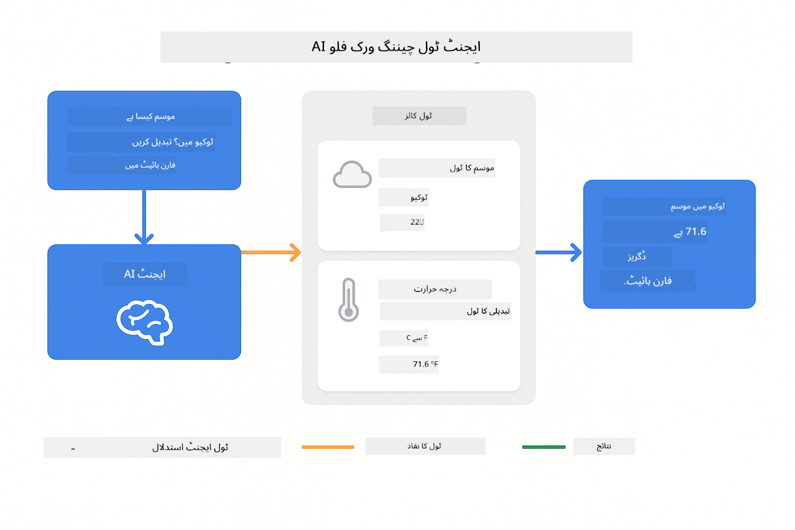
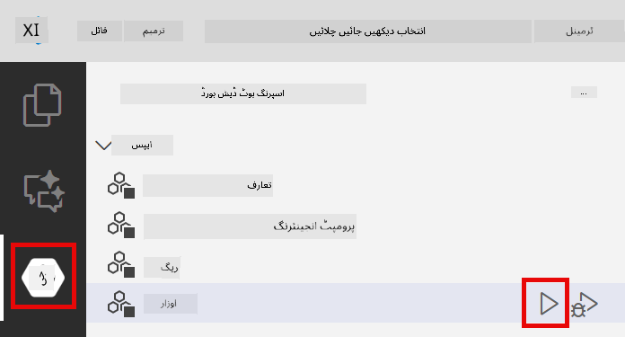
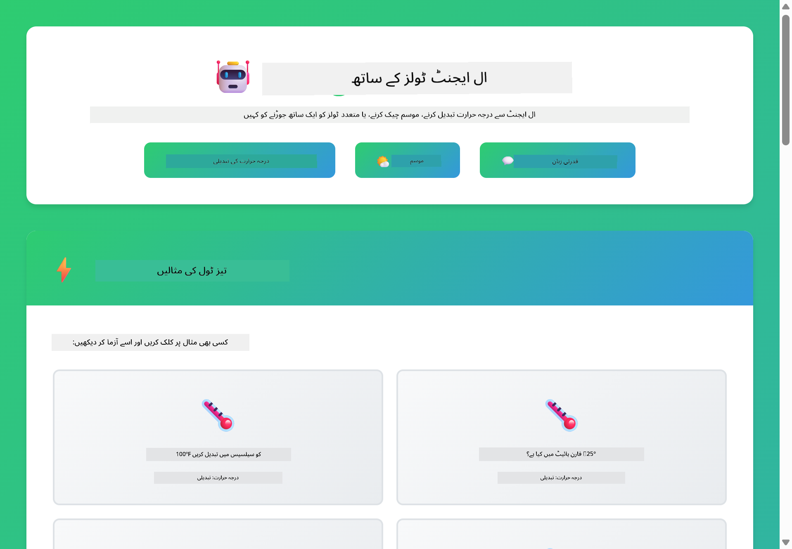

<!--
CO_OP_TRANSLATOR_METADATA:
{
  "original_hash": "aa23f106e7f53270924c9dd39c629004",
  "translation_date": "2025-12-13T18:27:21+00:00",
  "source_file": "04-tools/README.md",
  "language_code": "ur"
}
-->
# ماڈیول 04: ٹولز کے ساتھ AI ایجنٹس

## فہرست مضامین

- [آپ کیا سیکھیں گے](../../../04-tools)
- [ضروریات](../../../04-tools)
- [ٹولز کے ساتھ AI ایجنٹس کو سمجھنا](../../../04-tools)
- [ٹول کالنگ کیسے کام کرتی ہے](../../../04-tools)
  - [ٹول کی تعریفیں](../../../04-tools)
  - [فیصلہ سازی](../../../04-tools)
  - [عمل درآمد](../../../04-tools)
  - [جواب کی تخلیق](../../../04-tools)
- [ٹول چیننگ](../../../04-tools)
- [ایپلیکیشن چلائیں](../../../04-tools)
- [ایپلیکیشن کا استعمال](../../../04-tools)
  - [سادہ ٹول استعمال کرنے کی کوشش کریں](../../../04-tools)
  - [ٹول چیننگ کا تجربہ کریں](../../../04-tools)
  - [گفتگو کے بہاؤ کو دیکھیں](../../../04-tools)
  - [منطق کا مشاہدہ کریں](../../../04-tools)
  - [مختلف درخواستوں کے ساتھ تجربہ کریں](../../../04-tools)
- [اہم تصورات](../../../04-tools)
  - [ReAct پیٹرن (منطق اور عمل)](../../../04-tools)
  - [ٹول کی وضاحتیں اہم ہیں](../../../04-tools)
  - [سیشن مینجمنٹ](../../../04-tools)
  - [خرابیوں کا انتظام](../../../04-tools)
- [دستیاب ٹولز](../../../04-tools)
- [ٹول پر مبنی ایجنٹس کب استعمال کریں](../../../04-tools)
- [اگلے اقدامات](../../../04-tools)

## آپ کیا سیکھیں گے

اب تک، آپ نے سیکھا ہے کہ AI کے ساتھ بات چیت کیسے کی جاتی ہے، مؤثر پرامپٹس کیسے بنائے جاتے ہیں، اور جوابات کو اپنے دستاویزات میں کیسے گراؤنڈ کیا جاتا ہے۔ لیکن ایک بنیادی حد ہے: زبان کے ماڈلز صرف متن تیار کر سکتے ہیں۔ وہ موسم کا حال چیک نہیں کر سکتے، حساب کتاب نہیں کر سکتے، ڈیٹا بیس سے سوالات نہیں کر سکتے، یا بیرونی نظاموں کے ساتھ تعامل نہیں کر سکتے۔

ٹولز اس کو بدل دیتے ہیں۔ ماڈل کو فنکشنز تک رسائی دے کر جو وہ کال کر سکتا ہے، آپ اسے ایک متن بنانے والے سے ایک ایجنٹ میں تبدیل کر دیتے ہیں جو عمل کر سکتا ہے۔ ماڈل فیصلہ کرتا ہے کہ اسے کب ٹول کی ضرورت ہے، کون سا ٹول استعمال کرنا ہے، اور کون سے پیرامیٹرز پاس کرنے ہیں۔ آپ کا کوڈ فنکشن کو چلاتا ہے اور نتیجہ واپس کرتا ہے۔ ماڈل اس نتیجے کو اپنے جواب میں شامل کرتا ہے۔

## ضروریات

- ماڈیول 01 مکمل کیا ہوا (Azure OpenAI وسائل تعینات کیے گئے)
- روٹ ڈائریکٹری میں `.env` فائل Azure کی اسناد کے ساتھ (ماڈیول 01 میں `azd up` کے ذریعے بنائی گئی)

> **نوٹ:** اگر آپ نے ماڈیول 01 مکمل نہیں کیا، تو پہلے وہاں دی گئی تعیناتی کی ہدایات پر عمل کریں۔

## ٹولز کے ساتھ AI ایجنٹس کو سمجھنا

ٹولز کے ساتھ AI ایجنٹ ایک منطق اور عمل کے پیٹرن (ReAct) کی پیروی کرتا ہے:

1. صارف سوال پوچھتا ہے  
2. ایجنٹ سوچتا ہے کہ اسے کیا جاننا چاہیے  
3. ایجنٹ فیصلہ کرتا ہے کہ جواب دینے کے لیے اسے ٹول کی ضرورت ہے یا نہیں  
4. اگر ہاں، تو ایجنٹ مناسب ٹول کو درست پیرامیٹرز کے ساتھ کال کرتا ہے  
5. ٹول عمل کرتا ہے اور ڈیٹا واپس کرتا ہے  
6. ایجنٹ نتیجہ شامل کرتا ہے اور حتمی جواب دیتا ہے  


*ReAct پیٹرن - AI ایجنٹس مسائل حل کرنے کے لیے منطق اور عمل کے درمیان باری باری کام کرتے ہیں*

یہ خودکار طور پر ہوتا ہے۔ آپ ٹولز اور ان کی وضاحتیں متعین کرتے ہیں۔ ماڈل فیصلہ سازی کرتا ہے کہ کب اور کیسے انہیں استعمال کرنا ہے۔

## ٹول کالنگ کیسے کام کرتی ہے

**ٹول کی تعریفیں** - [WeatherTool.java](../../../04-tools/src/main/java/com/example/langchain4j/agents/tools/WeatherTool.java) | [TemperatureTool.java](../../../04-tools/src/main/java/com/example/langchain4j/agents/tools/TemperatureTool.java)

آپ واضح وضاحتوں اور پیرامیٹر کی وضاحتوں کے ساتھ فنکشنز تعریف کرتے ہیں۔ ماڈل ان وضاحتوں کو اپنے سسٹم پرامپٹ میں دیکھتا ہے اور سمجھتا ہے کہ ہر ٹول کیا کرتا ہے۔

```java
@Component
public class WeatherTool {
    
    @Tool("Get the current weather for a location")
    public String getCurrentWeather(@P("Location name") String location) {
        // آپ کا موسم تلاش کرنے کا منطق
        return "Weather in " + location + ": 22°C, cloudy";
    }
}

@AiService
public interface Assistant {
    String chat(@MemoryId String sessionId, @UserMessage String message);
}

// اسسٹنٹ خود بخود Spring Boot کے ذریعے منسلک ہوتا ہے:
// - ChatModel بین
// - @Component کلاسز سے تمام @Tool طریقے
// - سیشن مینجمنٹ کے لیے ChatMemoryProvider
```

> **🤖 [GitHub Copilot](https://github.com/features/copilot) چیٹ کے ساتھ کوشش کریں:** [`WeatherTool.java`](../../../04-tools/src/main/java/com/example/langchain4j/agents/tools/WeatherTool.java) کھولیں اور پوچھیں:  
> - "میں اصلی موسم کی API جیسے OpenWeatherMap کو جعلی ڈیٹا کی جگہ کیسے شامل کروں؟"  
> - "ایک اچھی ٹول وضاحت کیا ہوتی ہے جو AI کو اسے صحیح طریقے سے استعمال کرنے میں مدد دیتی ہے؟"  
> - "ٹول کی عمل درآمد میں API کی غلطیوں اور ریٹ لمٹس کو کیسے سنبھالوں؟"  

**فیصلہ سازی**

جب صارف پوچھتا ہے "سیئٹل میں موسم کیسا ہے؟"، ماڈل پہچانتا ہے کہ اسے موسم کا ٹول چاہیے۔ یہ لوکیشن پیرامیٹر "سیئٹل" کے ساتھ فنکشن کال تیار کرتا ہے۔

**عمل درآمد** - [AgentService.java](../../../04-tools/src/main/java/com/example/langchain4j/agents/service/AgentService.java)

Spring Boot خودکار طور پر `@AiService` انٹرفیس کو تمام رجسٹرڈ ٹولز کے ساتھ جوڑتا ہے، اور LangChain4j خودکار طور پر ٹول کالز کو چلاتا ہے۔

> **🤖 [GitHub Copilot](https://github.com/features/copilot) چیٹ کے ساتھ کوشش کریں:** [`AgentService.java`](../../../04-tools/src/main/java/com/example/langchain4j/agents/service/AgentService.java) کھولیں اور پوچھیں:  
> - "ReAct پیٹرن کیسے کام کرتا ہے اور AI ایجنٹس کے لیے یہ کیوں مؤثر ہے؟"  
> - "ایجنٹ کیسے فیصلہ کرتا ہے کہ کون سا ٹول استعمال کرنا ہے اور کس ترتیب میں؟"  
> - "اگر ٹول کی عمل درآمد ناکام ہو جائے تو کیا ہوتا ہے - میں غلطیوں کو مضبوطی سے کیسے سنبھالوں؟"  

**جواب کی تخلیق**

ماڈل موسم کا ڈیٹا وصول کرتا ہے اور اسے صارف کے لیے قدرتی زبان کے جواب میں ترتیب دیتا ہے۔

### declarative AI سروسز کیوں استعمال کریں؟

یہ ماڈیول LangChain4j کی Spring Boot انٹیگریشن استعمال کرتا ہے جس میں declarative `@AiService` انٹرفیسز شامل ہیں:

- **Spring Boot خودکار وائرنگ** - ChatModel اور ٹولز خود بخود شامل کیے جاتے ہیں  
- **@MemoryId پیٹرن** - خودکار سیشن پر مبنی میموری مینجمنٹ  
- **واحد مثال** - اسسٹنٹ ایک بار بنایا جاتا ہے اور بہتر کارکردگی کے لیے دوبارہ استعمال ہوتا ہے  
- **ٹائپ سیف عمل درآمد** - جاوا میتھڈز کو براہ راست ٹائپ کنورژن کے ساتھ کال کیا جاتا ہے  
- **کئی مرحلوں کی ترتیب** - ٹول چیننگ خودکار طریقے سے سنبھالتا ہے  
- **زیرو بائلر پلیٹ** - کوئی دستی AiServices.builder() کالز یا میموری ہیش میپ نہیں  

متبادل طریقے (دستی `AiServices.builder()`) زیادہ کوڈ کی ضرورت ہوتی ہے اور Spring Boot انٹیگریشن کے فوائد سے محروم ہوتے ہیں۔

## ٹول چیننگ

**ٹول چیننگ** - AI باری باری کئی ٹولز کو کال کر سکتا ہے۔ پوچھیں "سیئٹل میں موسم کیسا ہے اور کیا مجھے چھتری لانی چاہیے؟" اور دیکھیں کہ یہ `getCurrentWeather` کو بارش کے گیئر کے بارے میں منطق کے ساتھ چین کرتا ہے۔

<a href="images/tool-chaining.png"></a>

*متواتر ٹول کالز - ایک ٹول کا آؤٹ پٹ اگلے فیصلے میں شامل ہوتا ہے*

**خوبصورت ناکامیاں** - ایسے شہر کا موسم پوچھیں جو جعلی ڈیٹا میں نہیں ہے۔ ٹول ایک خرابی کا پیغام واپس کرتا ہے، اور AI وضاحت کرتا ہے کہ وہ مدد نہیں کر سکتا۔ ٹولز محفوظ طریقے سے ناکام ہوتے ہیں۔

یہ ایک ہی گفتگو کے مرحلے میں ہوتا ہے۔ ایجنٹ خودکار طور پر متعدد ٹول کالز کو ترتیب دیتا ہے۔

## ایپلیکیشن چلائیں

**تعیناتی کی تصدیق کریں:**

یقینی بنائیں کہ روٹ ڈائریکٹری میں `.env` فائل Azure کی اسناد کے ساتھ موجود ہے (ماڈیول 01 کے دوران بنائی گئی):  
```bash
cat ../.env  # AZURE_OPENAI_ENDPOINT، API_KEY، DEPLOYMENT دکھانا چاہیے
```
  
**ایپلیکیشن شروع کریں:**

> **نوٹ:** اگر آپ نے پہلے ہی ماڈیول 01 سے `./start-all.sh` کے ذریعے تمام ایپلیکیشنز شروع کر دی ہیں، تو یہ ماڈیول پہلے ہی پورٹ 8084 پر چل رہا ہے۔ آپ نیچے دیے گئے شروع کرنے کے کمانڈز چھوڑ کر براہ راست http://localhost:8084 پر جا سکتے ہیں۔

**اختیار 1: Spring Boot ڈیش بورڈ کا استعمال (VS Code صارفین کے لیے تجویز کردہ)**

ڈویلپمنٹ کنٹینر میں Spring Boot ڈیش بورڈ ایکسٹینشن شامل ہے، جو تمام Spring Boot ایپلیکیشنز کو منظم کرنے کے لیے بصری انٹرفیس فراہم کرتا ہے۔ آپ اسے VS Code کے بائیں جانب ایکٹیویٹی بار میں Spring Boot آئیکن کے طور پر دیکھ سکتے ہیں۔

Spring Boot ڈیش بورڈ سے آپ کر سکتے ہیں:  
- ورک اسپیس میں تمام دستیاب Spring Boot ایپلیکیشنز دیکھیں  
- ایک کلک سے ایپلیکیشنز شروع/روکیں  
- ایپلیکیشن لاگز کو حقیقی وقت میں دیکھیں  
- ایپلیکیشن کی حالت کی نگرانی کریں  

بس "tools" کے ساتھ پلے بٹن پر کلک کریں تاکہ یہ ماڈیول شروع ہو، یا تمام ماڈیولز کو ایک ساتھ شروع کریں۔



**اختیار 2: شیل اسکرپٹس کا استعمال**

تمام ویب ایپلیکیشنز (ماڈیولز 01-04) شروع کریں:

**Bash:**  
```bash
cd ..  # روٹ ڈائریکٹری سے
./start-all.sh
```
  
**PowerShell:**  
```powershell
cd ..  # روٹ ڈائریکٹری سے
.\start-all.ps1
```
  
یا صرف یہ ماڈیول شروع کریں:

**Bash:**  
```bash
cd 04-tools
./start.sh
```
  
**PowerShell:**  
```powershell
cd 04-tools
.\start.ps1
```
  
دونوں اسکرپٹس خودکار طور پر روٹ `.env` فائل سے ماحول کے متغیرات لوڈ کرتے ہیں اور اگر JARs موجود نہ ہوں تو انہیں بنائیں گے۔

> **نوٹ:** اگر آپ شروع کرنے سے پہلے تمام ماڈیولز کو دستی طور پر بنانا چاہتے ہیں:  
>  
> **Bash:**  
> ```bash
> cd ..  # Go to root directory
> mvn clean package -DskipTests
> ```
>  
> **PowerShell:**  
> ```powershell
> cd ..  # Go to root directory
> mvn clean package -DskipTests
> ```
  
اپنے براؤزر میں http://localhost:8084 کھولیں۔

**بند کرنے کے لیے:**

**Bash:**  
```bash
./stop.sh  # یہ ماڈیول صرف
# یا
cd .. && ./stop-all.sh  # تمام ماڈیولز
```
  
**PowerShell:**  
```powershell
.\stop.ps1  # یہ ماڈیول صرف
# یا
cd ..; .\stop-all.ps1  # تمام ماڈیولز
```
  
## ایپلیکیشن کا استعمال

ایپلیکیشن ایک ویب انٹرفیس فراہم کرتی ہے جہاں آپ ایک AI ایجنٹ کے ساتھ بات چیت کر سکتے ہیں جسے موسم اور درجہ حرارت کی تبدیلی کے ٹولز تک رسائی حاصل ہے۔

<a href="images/tools-homepage.png"></a>

*AI ایجنٹ ٹولز انٹرفیس - ٹولز کے ساتھ بات چیت کے لیے فوری مثالیں اور چیٹ انٹرفیس*

**سادہ ٹول استعمال کرنے کی کوشش کریں**

ایک سیدھی درخواست سے شروع کریں: "100 ڈگری فارن ہائیٹ کو سیلسیس میں تبدیل کریں"۔ ایجنٹ پہچانتا ہے کہ اسے درجہ حرارت کی تبدیلی کے ٹول کی ضرورت ہے، اسے درست پیرامیٹرز کے ساتھ کال کرتا ہے، اور نتیجہ واپس کرتا ہے۔ محسوس کریں کہ یہ کتنا قدرتی لگتا ہے - آپ نے یہ نہیں بتایا کہ کون سا ٹول استعمال کرنا ہے یا اسے کیسے کال کرنا ہے۔

**ٹول چیننگ کا تجربہ کریں**

اب کچھ زیادہ پیچیدہ کوشش کریں: "سیئٹل میں موسم کیسا ہے اور اسے فارن ہائیٹ میں تبدیل کریں؟" دیکھیں کہ ایجنٹ اسے مرحلہ وار کیسے حل کرتا ہے۔ پہلے موسم حاصل کرتا ہے (جو سیلسیس میں آتا ہے)، پھر پہچانتا ہے کہ اسے فارن ہائیٹ میں تبدیل کرنا ہے، تبدیلی کے ٹول کو کال کرتا ہے، اور دونوں نتائج کو ایک جواب میں جوڑ دیتا ہے۔

**گفتگو کے بہاؤ کو دیکھیں**

چیٹ انٹرفیس گفتگو کی تاریخ کو برقرار رکھتا ہے، جس سے آپ کو کئی مرحلوں کی بات چیت کرنے کی اجازت ملتی ہے۔ آپ تمام پچھلے سوالات اور جوابات دیکھ سکتے ہیں، جس سے گفتگو کو ٹریک کرنا اور سمجھنا آسان ہوتا ہے کہ ایجنٹ متعدد تبادلوں میں سیاق و سباق کیسے بناتا ہے۔

<a href="images/tools-conversation-demo.png"></a>

*کئی مرحلوں کی گفتگو جس میں سادہ تبدیلیاں، موسم کی تلاش، اور ٹول چیننگ دکھائی گئی ہے*

**مختلف درخواستوں کے ساتھ تجربہ کریں**

مختلف امتزاجات آزمائیں:  
- موسم کی تلاش: "ٹوکیو میں موسم کیسا ہے؟"  
- درجہ حرارت کی تبدیلیاں: "25°C کلوین میں کیا ہے؟"  
- مشترکہ سوالات: "پیرس میں موسم چیک کریں اور بتائیں کہ کیا یہ 20°C سے زیادہ ہے"  

دیکھیں کہ ایجنٹ قدرتی زبان کو کیسے سمجھتا ہے اور اسے مناسب ٹول کالز میں کیسے تبدیل کرتا ہے۔

## اہم تصورات

**ReAct پیٹرن (منطق اور عمل)**

ایجنٹ منطق (فیصلہ کرنا کہ کیا کرنا ہے) اور عمل (ٹولز کا استعمال) کے درمیان باری باری کام کرتا ہے۔ یہ پیٹرن خود مختار مسئلہ حل کرنے کی اجازت دیتا ہے بجائے صرف ہدایات کے جواب دینے کے۔

**ٹول کی وضاحتیں اہم ہیں**

آپ کی ٹول وضاحتوں کا معیار براہ راست اس بات پر اثر ڈالتا ہے کہ ایجنٹ انہیں کتنی اچھی طرح استعمال کرتا ہے۔ واضح اور مخصوص وضاحتیں ماڈل کو سمجھنے میں مدد دیتی ہیں کہ کب اور کیسے ہر ٹول کو کال کرنا ہے۔

**سیشن مینجمنٹ**

`@MemoryId` اینوٹیشن خودکار سیشن پر مبنی میموری مینجمنٹ کو فعال کرتا ہے۔ ہر سیشن ID کو `ChatMemory` کی اپنی مثال ملتی ہے جو `ChatMemoryProvider` بین کے ذریعے منظم ہوتی ہے، جس سے دستی میموری ٹریکنگ کی ضرورت ختم ہو جاتی ہے۔

**خرابیوں کا انتظام**

ٹولز ناکام ہو سکتے ہیں - APIs کا وقت ختم ہو سکتا ہے، پیرامیٹرز غلط ہو سکتے ہیں، بیرونی خدمات بند ہو سکتی ہیں۔ پروڈکشن ایجنٹس کو ایسی غلطیوں کا انتظام کرنا چاہیے تاکہ ماڈل مسائل کی وضاحت کر سکے یا متبادل کوشش کر سکے۔

## دستیاب ٹولز

**موسم کے ٹولز** (نمائش کے لیے جعلی ڈیٹا):  
- کسی مقام کے لیے موجودہ موسم حاصل کریں  
- کئی دنوں کی پیش گوئی حاصل کریں  

**درجہ حرارت کی تبدیلی کے ٹولز:**  
- سیلسیس سے فارن ہائیٹ  
- فارن ہائیٹ سے سیلسیس  
- سیلسیس سے کلوین  
- کلوین سے سیلسیس  
- فارن ہائیٹ سے کلوین  
- کلوین سے فارن ہائیٹ  

یہ سادہ مثالیں ہیں، لیکن پیٹرن کسی بھی فنکشن پر لاگو ہوتا ہے: ڈیٹا بیس سوالات، API کالز، حساب کتاب، فائل آپریشنز، یا سسٹم کمانڈز۔

## ٹول پر مبنی ایجنٹس کب استعمال کریں

**ٹولز استعمال کریں جب:**  
- جواب کے لیے حقیقی وقت کا ڈیٹا چاہیے (موسم، اسٹاک کی قیمتیں، انوینٹری)  
- آپ کو سادہ ریاضی سے آگے حساب کتاب کرنا ہو  
- ڈیٹا بیس یا APIs تک رسائی چاہیے  
- عمل کرنا ہو (ای میل بھیجنا، ٹکٹ بنانا، ریکارڈز اپ ڈیٹ کرنا)  
- متعدد ڈیٹا ذرائع کو یکجا کرنا ہو  

**ٹولز استعمال نہ کریں جب:**  
- سوالات عمومی معلومات سے جواب دیے جا سکتے ہوں  
- جواب صرف بات چیت پر مبنی ہو  
- ٹول کی تاخیر تجربے کو بہت سست بنا دے  

## اگلے اقدامات

**اگلا ماڈیول:** [05-mcp - ماڈل کانٹیکسٹ پروٹوکول (MCP)](../05-mcp/README.md)

---

**نیویگیشن:** [← پچھلا: ماڈیول 03 - RAG](../03-rag/README.md) | [مین پر واپس](../README.md) | [اگلا: ماڈیول 05 - MCP →](../05-mcp/README.md)

---

<!-- CO-OP TRANSLATOR DISCLAIMER START -->
**دستخطی نوٹ**:  
یہ دستاویز AI ترجمہ سروس [Co-op Translator](https://github.com/Azure/co-op-translator) کے ذریعے ترجمہ کی گئی ہے۔ اگرچہ ہم درستگی کے لیے کوشاں ہیں، براہ کرم اس بات سے آگاہ رہیں کہ خودکار ترجمے میں غلطیاں یا عدم درستیاں ہو سکتی ہیں۔ اصل دستاویز اپنی مادری زبان میں معتبر ماخذ سمجھی جانی چاہیے۔ اہم معلومات کے لیے پیشہ ور انسانی ترجمہ کی سفارش کی جاتی ہے۔ اس ترجمے کے استعمال سے پیدا ہونے والی کسی بھی غلط فہمی یا غلط تشریح کی ذمہ داری ہم پر عائد نہیں ہوتی۔
<!-- CO-OP TRANSLATOR DISCLAIMER END -->